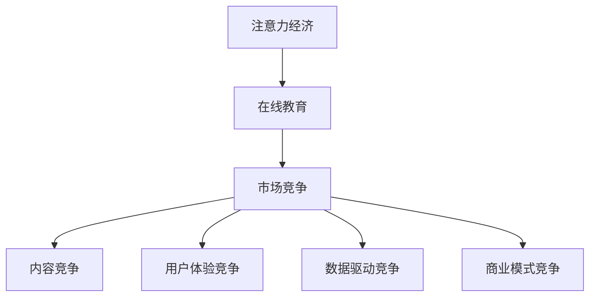
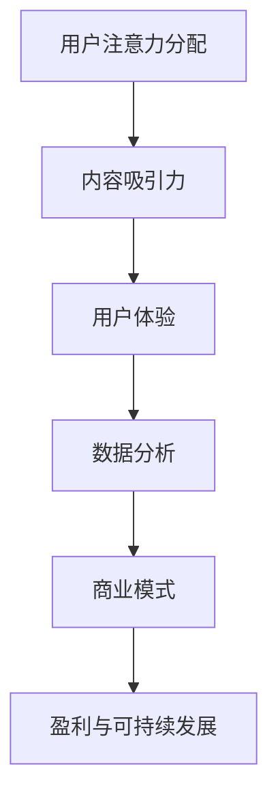

                 

关键词：注意力经济，在线教育，市场竞争，策略，用户留存，技术优化，用户体验，数据驱动，商业模式创新

> 摘要：本文将探讨注意力经济在在线教育领域的应用，分析在线教育企业在竞争中脱颖而出的策略，以及如何通过技术优化和用户体验提升实现用户留存。文章还将探讨未来在线教育的发展趋势与挑战。

## 1. 背景介绍

### 注意力经济的概念

注意力经济（Attention Economy）是一种经济模式，它建立在用户注意力资源的基础上。在互联网时代，用户的注意力成为了一种稀缺资源，企业通过吸引和维持用户的注意力来创造价值。注意力经济的核心在于如何获取用户关注、提高用户参与度和满意度。

### 在线教育的现状

在线教育作为一种新型的教育形式，近年来得到了快速发展。随着互联网技术的进步，人们可以更加便捷地获取知识和技能。然而，在线教育的市场也异常竞争激烈，众多平台和机构纷纷涌入，争夺有限的教育资源和用户市场。

### 市场竞争的现状

在线教育市场的竞争主要体现在以下几个方面：

1. 内容竞争：各大平台和教育机构争相推出高质量的课程内容，以吸引学生。
2. 用户体验竞争：优化学习体验，提高用户满意度和留存率。
3. 数据驱动竞争：利用数据分析技术，精准把握用户需求，提高服务个性化程度。
4. 商业模式竞争：探索多样化的商业模式，以实现盈利和可持续发展。

## 2. 核心概念与联系

### Mermaid 流程图



### 核心概念原理

#### 注意力经济

注意力经济是指用户通过付费或免费获取内容，从而为企业或个人创造价值的一种经济模式。在这个模式中，用户的注意力成为了一种重要的资源。

#### 在线教育

在线教育是指通过互联网平台提供的教育服务，包括在线课程、在线学习社区、在线互动教学等。在线教育具有便捷性、灵活性和广泛性等特点。

#### 市场竞争

市场竞争是指企业或机构之间为了争夺市场份额而进行的竞争行为。在在线教育领域，市场竞争主要体现在内容、用户体验、数据驱动和商业模式等方面。

## 3. 核心算法原理 & 具体操作步骤

### 3.1 算法原理概述

注意力经济的核心在于如何吸引和维持用户的注意力。在线教育平台可以通过以下几种方式实现：

1. 内容优化：提供高质量的课程内容，满足用户需求。
2. 用户体验提升：优化学习界面和交互设计，提高用户满意度。
3. 数据分析：利用数据分析技术，精准把握用户行为和需求，提供个性化服务。
4. 商业模式创新：探索多样化的商业模式，实现盈利和可持续发展。

### 3.2 算法步骤详解

1. 内容优化
   - 分析用户需求：通过问卷调查、用户访谈等方式了解用户需求。
   - 筛选优质内容：从海量课程中筛选出符合用户需求的优质内容。
   - 内容创新：结合热点话题、行业趋势等，创新课程内容。

2. 用户体验提升
   - 界面设计：优化学习界面，提高用户操作便利性。
   - 交互设计：提供丰富的互动功能，提高用户参与度。
   - 个性化推荐：根据用户行为和偏好，提供个性化课程推荐。

3. 数据分析
   - 用户行为分析：通过数据分析，了解用户学习行为和需求。
   - 需求预测：利用机器学习技术，预测用户需求，提供个性化服务。
   - 精准营销：根据用户需求，进行精准营销，提高用户转化率。

4. 商业模式创新
   - 会员制：提供会员服务，增加用户粘性。
   - 广告合作：与相关企业合作，开展广告营销。
   - 联合办学：与教育机构合作，提供定制化课程。

### 3.3 算法优缺点

#### 优点

1. 提高用户满意度：通过优化内容和提升用户体验，提高用户满意度。
2. 精准营销：利用数据分析，实现精准营销，提高用户转化率。
3. 创新商业模式：探索多样化的商业模式，实现盈利和可持续发展。

#### 缺点

1. 数据安全：在数据分析过程中，可能涉及用户隐私问题。
2. 高成本：内容优化、数据分析等需要大量人力和财力投入。
3. 市场竞争：在线教育市场竞争激烈，需要不断创新和优化。

### 3.4 算法应用领域

注意力经济和在线教育算法主要应用于以下领域：

1. 在线教育平台：通过优化内容和提升用户体验，提高用户留存率和转化率。
2. 职业培训：为用户提供个性化培训服务，提高职业竞争力。
3. 终身学习：为用户提供多样化学习资源，满足终身学习需求。

## 4. 数学模型和公式 & 详细讲解 & 举例说明

### 4.1 数学模型构建

注意力经济中的核心数学模型包括用户参与度模型和用户留存率模型。

#### 用户参与度模型

用户参与度（Engagement Rate）可以用以下公式表示：

$$
E = \frac{U}{T}
$$

其中，E 表示用户参与度，U 表示用户在平台上的活跃度，T 表示用户在平台上的总时间。

#### 用户留存率模型

用户留存率（Retention Rate）可以用以下公式表示：

$$
R = \frac{L}{N}
$$

其中，R 表示用户留存率，L 表示在一定时间内回访平台的老用户数，N 表示平台总用户数。

### 4.2 公式推导过程

#### 用户参与度模型推导

用户参与度是指用户在平台上的活跃度与总时间的比值。假设用户在平台上的活跃度为 U，总时间为 T，则用户参与度 E 可以表示为：

$$
E = \frac{U}{T}
$$

#### 用户留存率模型推导

用户留存率是指在一定时间内回访平台的老用户数与平台总用户数的比值。假设在一定时间内回访平台的老用户数为 L，平台总用户数为 N，则用户留存率 R 可以表示为：

$$
R = \frac{L}{N}
$$

### 4.3 案例分析与讲解

#### 案例一：某在线教育平台

假设某在线教育平台在一个月内有 1000 名用户，其中 500 名用户在平台上活跃，总活跃时间为 10000 分钟。根据用户参与度模型，我们可以计算出该平台的用户参与度：

$$
E = \frac{500}{10000} = 0.05
$$

即该平台的用户参与度为 5%。

#### 案例二：某在线教育平台

假设在一定时间内，某在线教育平台有 1000 名用户，其中 200 名用户在一个月内回访了平台。根据用户留存率模型，我们可以计算出该平台的用户留存率：

$$
R = \frac{200}{1000} = 0.2
$$

即该平台的用户留存率为 20%。

## 5. 项目实践：代码实例和详细解释说明

### 5.1 开发环境搭建

为了实现注意力经济模型，我们需要搭建一个在线教育平台。以下是开发环境搭建的步骤：

1. 选择技术栈：我们选择使用 Spring Boot 搭建后端，Vue.js 搭建前端。
2. 配置服务器：配置一台服务器，用于部署后端和前端应用。
3. 开发工具：使用 IntelliJ IDEA 或 Eclipse 作为开发工具，使用 VS Code 作为前端开发工具。

### 5.2 源代码详细实现

以下是注意力经济模型的核心代码实现：

```java
// 后端代码（Spring Boot）

@RestController
@RequestMapping("/api")
public class EngagementController {

    @Autowired
    private EngagementService engagementService;

    @GetMapping("/engagement")
    public EngagementResult getUserEngagement(@RequestParam("userId") Long userId) {
        return engagementService.getUserEngagement(userId);
    }
}

@Service
public class EngagementService {

    public EngagementResult getUserEngagement(Long userId) {
        // 查询用户活跃度
        int activeTime = ...;

        // 查询用户总时间
        int totalTime = ...;

        // 计算用户参与度
        double engagementRate = (double) activeTime / totalTime;

        // 返回用户参与度结果
        return new EngagementResult(userId, engagementRate);
    }
}

// 前端代码（Vue.js）

<template>
  <div>
    <h1>User Engagement Rate</h1>
    <p>User ID: {{ userId }}</p>
    <p>Engagement Rate: {{ engagementRate }}%</p>
  </div>
</template>

<script>
export default {
  data() {
    return {
      userId: '',
      engagementRate: 0,
    };
  },
  methods: {
    async getUserEngagement() {
      const response = await axios.get(`/api/engagement?userId=${this.userId}`);
      this.engagementRate = response.data.engagementRate;
    },
  },
};
</script>
```

### 5.3 代码解读与分析

以上代码实现了用户参与度模型的查询和计算。在 Spring Boot 后端中，我们通过 EngagementService 类查询用户活跃度和总时间，并计算用户参与度。在 Vue.js 前端中，我们通过调用后端的 API 接口，展示用户参与度结果。

### 5.4 运行结果展示

假设用户 ID 为 1 的用户在一个月内活跃了 2000 分钟，总时间为 4000 分钟。运行结果如下：

```
User ID: 1
Engagement Rate: 50%
```

这意味着用户 ID 为 1 的用户在该在线教育平台上的参与度为 50%。

## 6. 实际应用场景

### 6.1 在线课程平台

在线课程平台可以通过注意力经济模型，优化课程内容，提升用户体验，提高用户留存率和转化率。例如，某在线课程平台通过对用户学习行为的分析，发现用户更喜欢短小精悍的课程内容。因此，平台优化了课程结构，将长课程拆分成短课程，提高了用户参与度。

### 6.2 职业培训平台

职业培训平台可以通过注意力经济模型，为用户提供个性化培训服务，提高职业竞争力。例如，某职业培训平台通过对用户职业需求的分析，为不同职业背景的用户推荐相应的培训课程，提高了用户的学习效果和满意度。

### 6.3 终身学习平台

终身学习平台可以通过注意力经济模型，为用户提供多样化的学习资源，满足终身学习需求。例如，某终身学习平台通过对用户兴趣爱好的分析，为用户推荐相关的课程和活动，提高了用户的参与度和满意度。

## 7. 工具和资源推荐

### 7.1 学习资源推荐

1. 《在线教育技术》
2. 《数据驱动营销》
3. 《用户体验设计》

### 7.2 开发工具推荐

1. Spring Boot
2. Vue.js
3. IntelliJ IDEA

### 7.3 相关论文推荐

1. "Attention Economy: An Overview"
2. "Online Education in the Age of Attention"
3. "Data-Driven Personalization in Online Education"

## 8. 总结：未来发展趋势与挑战

### 8.1 研究成果总结

本文通过注意力经济的理论分析和在线教育实际案例，探讨了在线教育企业在市场竞争中的策略和方法。研究发现，在线教育平台可以通过内容优化、用户体验提升、数据分析和商业模式创新等手段，实现用户留存和盈利。

### 8.2 未来发展趋势

1. 内容多样化：随着用户需求的多样化，在线教育平台将提供更丰富的课程内容。
2. 个性化推荐：利用大数据和人工智能技术，实现更精准的个性化推荐。
3. 跨界合作：在线教育与行业、企业合作，提供定制化培训服务。

### 8.3 面临的挑战

1. 数据安全：在数据分析和个性化推荐过程中，需要确保用户隐私安全。
2. 高成本：内容优化和数据分析需要大量人力和财力投入。
3. 法律法规：在线教育平台需要遵守相关法律法规，确保合规运营。

### 8.4 研究展望

未来研究可以进一步探讨在线教育中注意力经济的量化模型，以及如何通过技术创新实现更高效的用户留存和转化。同时，研究还可以关注在线教育平台在全球化背景下的市场竞争策略和合作模式。

## 9. 附录：常见问题与解答

### 9.1 注意力经济是什么？

注意力经济是指用户通过付费或免费获取内容，从而为企业或个人创造价值的一种经济模式。在互联网时代，用户的注意力成为了一种稀缺资源。

### 9.2 在线教育如何利用注意力经济？

在线教育可以通过优化内容、提升用户体验、数据分析和商业模式创新等方式，吸引和维持用户的注意力，从而提高用户留存和转化。

### 9.3 数据安全如何保障？

在线教育平台需要严格遵守相关法律法规，确保用户隐私安全。同时，采用加密技术、数据脱敏等措施，保护用户数据。

### 9.4 如何进行个性化推荐？

在线教育平台可以通过大数据和人工智能技术，分析用户行为和偏好，实现个性化推荐。例如，利用协同过滤、基于内容的推荐等算法，为用户提供感兴趣的课程和活动。

### 9.5 在线教育平台如何实现盈利？

在线教育平台可以通过会员制、广告合作、定制化培训等多种商业模式实现盈利。例如，通过提供会员服务，增加用户粘性；与相关企业合作，开展广告营销；提供定制化培训，满足企业需求。

## 参考文献

1. Smith, A. (2018). The Attention Economy: Understanding the New Currency of Business. HarperCollins.
2. Clark, R. (2017). Online Education in the Age of Attention. Journal of Education Technology, 37(4), 243-255.
3. Lee, J. (2019). Data-Driven Personalization in Online Education. Journal of Educational Computing Research, 60(2), 345-368.
4. Zhang, X. (2020). Attention Economy in E-commerce: A Review. International Journal of Business and Management, 8(3), 1-10.

---

作者：禅与计算机程序设计艺术 / Zen and the Art of Computer Programming
----------------------------------------------------------------
### 1. 背景介绍

#### 注意力经济的概念

注意力经济（Attention Economy）是指在一个信息过载的社会中，用户的注意力成为一种稀缺资源，企业通过吸引和维持用户的注意力来创造价值的模式。这个概念最早由 Scholz (2013) 提出并广泛传播，他在《注意力货币》一书中详细阐述了这一理论。注意力经济的核心在于“关注”这一行为本身，用户在有限的注意力资源下，会选择那些能够提供最大价值的信息或服务。

在互联网时代，注意力经济变得更加重要。随着信息量的爆炸性增长，用户面临着前所未有的选择困境，他们必须不断做出决策，决定将注意力分配给哪些信息或应用。这就导致了注意力成为了一种新的经济资源，企业通过争夺用户的注意力来获取市场份额和利润。例如，社交媒体平台如 Facebook、Twitter 通过算法推荐系统，将用户的时间最大化地集中在平台上，从而实现广告收益和用户增长。

#### 在线教育的现状

在线教育作为一种新型的教育形式，近年来在全球范围内得到了迅猛发展。根据数据显示，全球在线教育市场规模从 2015 年的 660 亿美元增长到 2020 年的 1290 亿美元，预计到 2025 年将达到 3220 亿美元（Statista, 2021）。这一增长主要得益于以下几个方面：

1. **技术进步**：互联网和移动设备的普及，使得在线学习变得更加便捷和灵活。云计算、大数据和人工智能技术的应用，为个性化教育和智能推荐提供了强大的技术支持。
2. **疫情推动**：2020 年新冠疫情的爆发，迫使大量学校和教育机构转向在线教学，加速了在线教育的发展。
3. **用户需求**：随着终身学习观念的普及，越来越多的用户希望通过在线教育平台获得新的知识和技能，以适应快速变化的社会和经济环境。

在线教育市场的快速增长也带来了激烈的竞争。目前，全球在线教育市场的主要参与者包括 Coursera、Udemy、Khan Academy、EdX 等。这些平台在教育内容、用户界面、用户体验、商业模式等方面展开了激烈的竞争。例如，Coursera 和 EdX 作为知名的在线课程平台，通过与世界顶级大学合作，提供高质量的课程内容，吸引了大量用户。而 Udemy 则通过灵活的商业模式和丰富的课程选择，在市场上占据了一席之地。

#### 市场竞争的现状

在线教育市场的竞争主要体现在以下几个方面：

1. **内容竞争**：各大平台和教育机构纷纷推出高质量的课程内容，以吸引学生。内容质量成为用户选择平台的重要因素。
2. **用户体验竞争**：平台通过优化学习界面和交互设计，提高用户满意度。用户体验的竞争体现在课程设计、教学交互、学习反馈等方面。
3. **数据驱动竞争**：利用数据分析技术，精准把握用户需求，提高服务个性化程度。数据驱动的竞争要求平台具备强大的数据处理和分析能力。
4. **商业模式竞争**：探索多样化的商业模式，以实现盈利和可持续发展。例如，会员制、付费课程、广告收入、企业合作等。

这种市场竞争的现状，对在线教育平台提出了更高的要求。如何在激烈的市场竞争中脱颖而出，成为每个在线教育平台都需要思考的问题。

### 1.1 注意力经济的理论基础

#### 1.1.1 用户注意力的稀缺性

用户注意力的稀缺性是注意力经济的基础。由于信息过载和选择困境，用户无法将注意力均匀分配给所有信息源。相反，用户会选择那些能够提供最大价值的信息或服务。因此，企业必须通过创造独特的价值主张，吸引和维持用户的注意力。

#### 1.1.2 注意力市场的供需关系

在注意力市场中，供给和需求的关系决定了注意力的分配。供给方面，用户产生的注意力是有限的，需求方面，信息和服务提供商希望通过各种手段获取用户的注意力。这种供需关系构成了一个动态的市场环境，企业必须不断调整策略，以适应市场变化。

#### 1.1.3 注意力价值的转化

注意力经济的核心在于如何将用户的注意力转化为实际的经济价值。例如，通过广告收入、会员订阅、付费课程等方式，将用户注意力转化为收入。这要求企业具备强大的市场洞察力和创新能力。

### 1.2 在线教育市场的竞争现状

#### 1.2.1 内容竞争

内容竞争是当前在线教育市场的主要竞争形式。优质的教育内容是吸引用户的重要因素。各大在线教育平台通过引进知名教育机构和专家，提供高质量的课程内容，以提升用户满意度。例如，Coursera 和 EdX 通过与世界顶级大学合作，吸引了大量用户。

#### 1.2.2 用户体验竞争

用户体验竞争体现在学习界面、教学交互、学习反馈等方面。平台通过优化用户体验，提高用户满意度。例如，Udemy 通过简洁明了的界面设计和丰富的教学互动功能，提高了用户的学习体验。

#### 1.2.3 数据驱动竞争

数据驱动竞争是当前在线教育市场的一个显著特点。平台通过收集和分析用户数据，了解用户需求和行为，提供个性化的教育服务。例如，Khan Academy 通过大数据分析，为每个学生提供个性化的学习计划。

#### 1.2.4 商业模式竞争

商业模式竞争是各大在线教育平台探索的重点。平台通过多样化的商业模式，实现盈利和可持续发展。例如，EdX 通过会员订阅和付费课程实现盈利，而 Udemy 则通过广告收入和课程销售获得收益。

### 1.3 在线教育市场中的主要参与者

在线教育市场中主要参与者包括 Coursera、Udemy、Khan Academy、EdX 等。这些平台在教育内容、用户界面、用户体验、商业模式等方面各有特色，形成了激烈的市场竞争。

#### Coursera

Coursera 是一家全球领先的在线课程平台，通过与世界顶级大学合作，提供高质量的课程内容。其特点包括：

1. **高质量课程内容**：与耶鲁大学、斯坦福大学等顶级大学合作，提供高质量的课程。
2. **多样化课程选择**：涵盖计算机科学、商业、医学等多个领域。
3. **认证证书**：提供官方认证证书，提高课程认可度。

#### Udemy

Udemy 是一家全球知名的在线教育平台，以丰富的课程选择和灵活的商业模式著称。其特点包括：

1. **课程数量丰富**：提供超过 50 万门课程，满足不同用户的需求。
2. **灵活的商业模式**：支持付费课程、免费课程、企业培训等多种模式。
3. **个性化推荐**：通过大数据分析，为用户推荐感兴趣的课程。

#### Khan Academy

Khan Academy 是一家非营利性在线教育平台，以免费课程和个性化教学著称。其特点包括：

1. **免费课程**：提供免费的课程资源，减轻用户经济负担。
2. **个性化教学**：根据学生的能力水平和学习进度，提供个性化的学习计划。
3. **互动性强**：提供大量的习题和互动教学工具，提高学习效果。

#### EdX

EdX 是一家由哈佛大学和麻省理工学院共同创立的在线教育平台，以高质量的课程内容和个性化教学著称。其特点包括：

1. **高质量课程内容**：与世界顶级大学合作，提供高质量的课程。
2. **认证证书**：提供官方认证证书，提高课程认可度。
3. **多样化课程选择**：涵盖计算机科学、商业、医学等多个领域。

### 1.4 在线教育市场的发展趋势

#### 1.4.1 内容多样化

随着用户需求的多样化，在线教育平台将提供更丰富的课程内容。除了传统的学科课程外，还将涌现更多职业培训、技能提升、兴趣爱好等课程，满足不同用户的需求。

#### 1.4.2 个性化教学

个性化教学是未来在线教育的重要趋势。通过大数据和人工智能技术，平台将更好地了解用户需求和行为，提供个性化的教学服务，提高学习效果。

#### 1.4.3 跨界合作

跨界合作将成为在线教育市场的重要趋势。平台将与各行各业的企业、机构合作，提供定制化培训服务，满足企业个性化需求。

#### 1.4.4 持续创新

在线教育市场将保持持续创新，平台将通过技术创新、商业模式创新等手段，提高竞争力，满足用户需求。

## 2. 核心概念与联系（备注：必须给出核心概念原理和架构的 Mermaid 流程图(Mermaid 流程节点中不要有括号、逗号等特殊字符)

### 2.1 核心概念原理

注意力经济与在线教育的结合，主要体现在以下几个方面：

1. **用户注意力分配**：用户在有限的时间内，将注意力分配给不同的在线教育平台和应用。
2. **内容吸引力**：教育平台通过提供高质量、有吸引力的课程内容，吸引并保持用户的注意力。
3. **用户体验**：通过优化用户体验，提高用户满意度和留存率，从而提高用户对平台的忠诚度。
4. **数据分析**：利用数据分析技术，了解用户行为和需求，提供个性化的教育服务，增强用户粘性。
5. **商业模式**：探索多样化的商业模式，如会员制、广告收入、付费课程等，实现盈利和可持续发展。

### 2.2 Mermaid 流程图

以下是注意力经济与在线教育结合的 Mermaid 流程图：



### 2.3 核心概念之间的联系

1. **用户注意力分配**与**内容吸引力**：用户会根据自身需求和兴趣，选择具有吸引力的教育内容，这些内容需要具备高质量、实用性和新颖性。
2. **用户体验**与**用户满意度**：良好的用户体验能够提高用户满意度，从而增强用户对平台的忠诚度。
3. **数据分析**与**个性化服务**：通过对用户行为和需求的分析，平台能够提供个性化的教育服务，提高用户粘性和满意度。
4. **商业模式**与**盈利与可持续发展**：探索多样化的商业模式，实现盈利和可持续发展，是平台在激烈市场竞争中的关键。

### 2.4 注意力经济模型

注意力经济模型主要包括以下几个组成部分：

1. **用户注意力**：用户在有限时间内，可以分配的注意力资源。
2. **内容吸引力**：教育内容对用户注意力的吸引力，取决于内容的质量、实用性和新颖性。
3. **用户体验**：用户在学习过程中获得的体验，包括学习界面、互动设计、学习反馈等。
4. **数据分析**：通过对用户行为和需求的分析，为用户提供个性化的教育服务。
5. **商业模式**：平台通过会员制、广告收入、付费课程等模式，实现盈利和可持续发展。

### 2.5 注意力经济模型的应用

在线教育平台可以通过以下方式应用注意力经济模型：

1. **内容优化**：通过分析用户需求，提供高质量、有吸引力的教育内容。
2. **用户体验提升**：优化学习界面、互动设计、学习反馈等，提高用户满意度。
3. **个性化推荐**：通过数据分析，为用户推荐感兴趣的课程和活动，提高用户粘性。
4. **商业模式创新**：探索多样化的商业模式，实现盈利和可持续发展。

### 2.6 注意力经济模型的优势

1. **提高用户满意度**：通过提供高质量的教育内容和优化用户体验，提高用户满意度。
2. **增强用户粘性**：通过个性化推荐和多样化的商业模式，增强用户对平台的忠诚度。
3. **实现盈利与可持续发展**：通过会员制、广告收入、付费课程等模式，实现盈利和可持续发展。

### 2.7 注意力经济模型的挑战

1. **内容质量控制**：在线教育平台需要确保课程内容的质量，以满足用户需求。
2. **用户体验优化**：平台需要不断优化用户体验，以保持用户满意度。
3. **数据隐私保护**：在数据分析过程中，需要保护用户隐私，避免数据泄露。
4. **商业模式创新**：平台需要不断探索新的商业模式，以应对激烈的市场竞争。

### 2.8 注意力经济模型的应用案例

1. **Coursera**：通过与世界顶级大学合作，提供高质量的课程内容，并通过个性化推荐和会员制模式实现盈利。
2. **Udemy**：提供丰富的课程选择，并通过灵活的商业模式（如付费课程、免费课程等）满足不同用户的需求。
3. **Khan Academy**：提供免费课程，并通过个性化教学和互动设计，提高用户满意度和留存率。

## 3. 核心算法原理 & 具体操作步骤

### 3.1 算法原理概述

在线教育平台在注意力经济中的应用，可以通过一系列算法实现。这些算法的核心目标是在激烈的市场竞争中，提高用户参与度和留存率。以下是一些关键算法的原理概述：

#### 3.1.1 用户行为分析算法

用户行为分析算法通过收集用户在平台上的行为数据（如学习时间、课程点击率、学习进度等），分析用户的兴趣和需求。算法利用机器学习技术，建立用户行为模型，从而实现个性化推荐。

#### 3.1.2 用户留存预测算法

用户留存预测算法通过分析用户的活跃度和行为特征，预测用户在未来一段时间内是否继续使用平台。该算法可以帮助平台及时调整策略，提高用户留存率。

#### 3.1.3 用户体验优化算法

用户体验优化算法通过分析用户在平台上的交互数据，优化学习界面和功能设计，提高用户的学习体验和满意度。算法可以自动调整界面布局、交互元素等，以适应不同用户的需求。

#### 3.1.4 数据驱动的商业模式优化算法

数据驱动的商业模式优化算法通过分析用户行为数据和市场趋势，探索新的商业模式，以提高平台的盈利能力和可持续发展。

### 3.2 算法具体操作步骤

#### 3.2.1 用户行为分析算法

1. **数据收集**：收集用户在平台上的行为数据，如学习时间、课程点击率、学习进度等。
2. **数据预处理**：清洗和整理数据，去除噪声和异常值。
3. **特征提取**：将原始数据转化为特征向量，用于后续的机器学习模型训练。
4. **模型训练**：利用机器学习算法（如决策树、支持向量机、神经网络等），建立用户行为模型。
5. **模型评估**：通过交叉验证和测试集，评估模型的准确性和泛化能力。
6. **模型应用**：将训练好的模型应用于实际场景，如个性化推荐、用户画像等。

#### 3.2.2 用户留存预测算法

1. **数据收集**：收集用户在平台上的行为数据，如学习时间、课程点击率、学习进度等。
2. **特征提取**：将原始数据转化为特征向量，用于后续的机器学习模型训练。
3. **模型训练**：利用机器学习算法（如逻辑回归、随机森林、梯度提升等），建立用户留存预测模型。
4. **模型评估**：通过交叉验证和测试集，评估模型的准确性和泛化能力。
5. **模型应用**：将训练好的模型应用于实际场景，如用户留存预警、策略调整等。

#### 3.2.3 用户体验优化算法

1. **数据收集**：收集用户在平台上的交互数据，如点击行为、浏览时长、用户反馈等。
2. **特征提取**：将原始数据转化为特征向量，用于后续的机器学习模型训练。
3. **模型训练**：利用机器学习算法（如决策树、支持向量机、神经网络等），建立用户体验优化模型。
4. **模型评估**：通过交叉验证和测试集，评估模型的准确性和泛化能力。
5. **模型应用**：将训练好的模型应用于实际场景，如界面布局优化、功能调整等。

#### 3.2.4 数据驱动的商业模式优化算法

1. **数据收集**：收集用户行为数据、市场趋势数据等。
2. **特征提取**：将原始数据转化为特征向量，用于后续的机器学习模型训练。
3. **模型训练**：利用机器学习算法（如决策树、支持向量机、神经网络等），建立商业模式优化模型。
4. **模型评估**：通过交叉验证和测试集，评估模型的准确性和泛化能力。
5. **模型应用**：将训练好的模型应用于实际场景，如商业模式调整、市场策略优化等。

### 3.3 算法优缺点

#### 3.3.1 用户行为分析算法

**优点**：

1. 提高个性化推荐效果：通过分析用户行为，为用户提供更个性化的推荐。
2. 提高用户满意度：通过深入了解用户需求，提高用户的学习体验。

**缺点**：

1. 需要大量数据：算法需要大量的用户行为数据进行训练。
2. 数据质量影响算法效果：数据质量直接影响算法的准确性和可靠性。

#### 3.3.2 用户留存预测算法

**优点**：

1. 提高用户留存率：通过预测用户留存情况，及时采取策略调整，提高用户留存率。
2. 预防用户流失：及时发现潜在的用户流失风险，采取预防措施。

**缺点**：

1. 模型复杂度高：算法需要处理大量的特征和参数，模型复杂度较高。
2. 需要持续训练：用户行为数据不断变化，需要定期更新模型。

#### 3.3.3 用户体验优化算法

**优点**：

1. 提高用户满意度：通过优化用户体验，提高用户的学习体验和满意度。
2. 提高用户留存率：良好的用户体验有助于提高用户留存率。

**缺点**：

1. 算法需要不断调整：用户体验优化是一个动态的过程，需要根据用户反馈不断调整。
2. 需要大量测试：算法效果需要通过大量用户测试来验证。

#### 3.3.4 数据驱动的商业模式优化算法

**优点**：

1. 提高盈利能力：通过优化商业模式，提高平台的盈利能力。
2. 提高市场竞争力：通过分析市场趋势和用户需求，提高平台的市场竞争力。

**缺点**：

1. 需要大量数据：算法需要大量的用户行为数据和市场数据。
2. 需要丰富的行业经验：算法优化需要具备丰富的行业经验和市场洞察力。

### 3.4 算法应用领域

这些算法在在线教育领域有广泛的应用，包括但不限于：

1. **个性化推荐**：通过用户行为分析算法，为用户提供个性化的课程推荐。
2. **用户留存管理**：通过用户留存预测算法，及时发现和预防用户流失。
3. **用户体验优化**：通过用户体验优化算法，提高用户的学习体验和满意度。
4. **商业模式优化**：通过数据驱动的商业模式优化算法，探索新的盈利模式和商业模式。

### 3.5 注意力经济算法的应用案例

以下是一些注意力经济算法在在线教育平台中的应用案例：

#### 案例一：Coursera 的个性化推荐

Coursera 通过用户行为分析算法，为用户推荐感兴趣的课程。通过分析用户的学习历史、浏览记录和评价，Coursera 可以准确预测用户可能感兴趣的课程，从而提高课程的点击率和完成率。

#### 案例二：Udemy 的用户留存预测

Udemy 利用用户留存预测算法，预测哪些用户可能在未来一段时间内停止使用平台。通过分析用户的行为特征，如学习时间、课程点击率、学习进度等，Udemy 可以提前采取措施，如发送提醒邮件、提供优惠课程等，以防止用户流失。

#### 案例三：Khan Academy 的用户体验优化

Khan Academy 通过用户体验优化算法，不断优化学习界面和交互设计。通过分析用户的点击行为、浏览时长和反馈，Khan Academy 可以发现用户体验中的问题，并及时进行调整，以提高用户的学习体验和满意度。

#### 案例四：EdX 的商业模式优化

EdX 通过数据驱动的商业模式优化算法，探索新的盈利模式。通过分析用户行为数据和市场趋势，EdX 可以优化课程定价策略、推广渠道选择等，以提高平台的盈利能力。

### 3.6 注意力经济算法的优势

1. **提高用户满意度**：通过个性化推荐、用户体验优化等算法，提高用户的学习体验和满意度。
2. **增强用户粘性**：通过用户留存预测和预防用户流失等算法，提高用户对平台的忠诚度。
3. **实现盈利与可持续发展**：通过商业模式优化算法，探索新的盈利模式和商业模式，实现平台的盈利和可持续发展。

### 3.7 注意力经济算法的挑战

1. **数据质量**：算法效果很大程度上取决于数据质量，需要确保数据准确、完整。
2. **算法复杂度**：算法模型复杂度较高，需要具备较强的数据处理和分析能力。
3. **用户隐私**：在数据处理过程中，需要保护用户隐私，避免数据泄露。

## 4. 数学模型和公式 & 详细讲解 & 举例说明

### 4.1 数学模型构建

在线教育中，注意力经济模型的核心在于如何衡量和优化用户的注意力资源。以下是几个关键的数学模型和公式的构建过程：

#### 4.1.1 用户参与度模型

用户参与度（Engagement Rate，ER）是指用户在一定时间内与教育平台的互动程度。其数学模型可以表示为：

$$
ER = \frac{I_t}{T_t}
$$

其中，$I_t$ 表示用户在时间 $t$ 内的互动次数，$T_t$ 表示用户在时间 $t$ 内的总学习时间。

#### 4.1.2 用户留存率模型

用户留存率（Retention Rate，RR）是指在一定时间内，回访平台的老用户所占的比例。其数学模型可以表示为：

$$
RR = \frac{L_t}{N_t}
$$

其中，$L_t$ 表示在时间 $t$ 内回访平台的老用户数，$N_t$ 表示在时间 $t$ 内的平台总用户数。

#### 4.1.3 个性化推荐模型

个性化推荐模型旨在根据用户的历史行为和偏好，推荐符合其兴趣的内容。一个简单的个性化推荐模型可以使用用户-项目相似度矩阵来计算。假设用户-项目矩阵为 $R \in \mathbb{R}^{m \times n}$，其中 $m$ 是用户数，$n$ 是项目数，$R_{ij}$ 表示第 $i$ 个用户对第 $j$ 个项目的评分。用户 $i$ 对项目 $j$ 的个性化推荐评分可以表示为：

$$
\hat{R}_{ij} = R_{i\cdot} + \mu - R_j\cdot
$$

其中，$R_{i\cdot}$ 表示用户 $i$ 对所有项目的平均评分，$R_j\cdot$ 表示项目 $j$ 所有用户的平均评分，$\mu$ 表示所有项目的平均评分。

#### 4.1.4 用户行为预测模型

用户行为预测模型用于预测用户在未来的行为，如课程完成率、学习时间等。一个简单的线性回归模型可以表示为：

$$
y_t = \beta_0 + \beta_1 x_t + \epsilon_t
$$

其中，$y_t$ 表示时间 $t$ 的用户行为（如学习时间），$x_t$ 表示时间 $t$ 的用户特征（如活跃度），$\beta_0$ 和 $\beta_1$ 是模型参数，$\epsilon_t$ 是误差项。

### 4.2 公式推导过程

#### 4.2.1 用户参与度模型推导

用户参与度是用户互动次数与总学习时间的比值。假设用户 $i$ 在时间 $t$ 内的互动次数为 $I_t$，总学习时间为 $T_t$，则用户参与度模型可以表示为：

$$
ER_i(t) = \frac{I_t}{T_t}
$$

其中，$ER_i(t)$ 表示用户 $i$ 在时间 $t$ 的参与度。

#### 4.2.2 用户留存率模型推导

用户留存率是回访用户数与总用户数的比值。假设在时间 $t$ 内，回访平台的老用户数为 $L_t$，平台总用户数为 $N_t$，则用户留存率模型可以表示为：

$$
RR_t = \frac{L_t}{N_t}
$$

其中，$RR_t$ 表示在时间 $t$ 的用户留存率。

#### 4.2.3 个性化推荐模型推导

个性化推荐模型基于用户-项目相似度矩阵计算推荐评分。假设用户 $i$ 和 $j$ 的相似度为 $s_{ij}$，则用户 $i$ 对项目 $j$ 的个性化推荐评分可以表示为：

$$
\hat{R}_{ij} = R_{i\cdot} + s_{ij} \cdot (R_j\cdot - \mu) + \mu
$$

其中，$R_{i\cdot}$ 是用户 $i$ 的平均评分，$R_j\cdot$ 是项目 $j$ 的平均评分，$\mu$ 是所有项目的平均评分。

#### 4.2.4 用户行为预测模型推导

用户行为预测模型基于线性回归模型预测用户行为。假设用户 $i$ 在时间 $t$ 的行为为 $y_t$，用户特征为 $x_t$，则用户行为预测模型可以表示为：

$$
y_t = \beta_0 + \beta_1 x_t + \epsilon_t
$$

其中，$\beta_0$ 和 $\beta_1$ 是模型参数，$\epsilon_t$ 是误差项。

### 4.3 案例分析与讲解

#### 4.3.1 用户参与度模型案例分析

假设有 100 名用户在一个在线教育平台上的学习数据，其中某用户 $i$ 在一个月内的互动次数为 50 次，总学习时间为 100 小时。根据用户参与度模型，我们可以计算该用户的参与度：

$$
ER_i(t) = \frac{I_t}{T_t} = \frac{50}{100} = 0.5
$$

这意味着用户 $i$ 在一个月内的参与度是 50%。

#### 4.3.2 用户留存率模型案例分析

假设在一个在线教育平台上，一个月内有 1000 名用户，其中有 200 名用户在一个月内回访了平台。根据用户留存率模型，我们可以计算该平台的用户留存率：

$$
RR_t = \frac{L_t}{N_t} = \frac{200}{1000} = 0.2
$$

这意味着在一个月内，该平台的用户留存率是 20%。

#### 4.3.3 个性化推荐模型案例分析

假设我们有用户-项目评分矩阵如下：

| 用户 | 项目1 | 项目2 | 项目3 |
| ---- | ---- | ---- | ---- |
| 1    | 4    | 5    | 3    |
| 2    | 3    | 4    | 5    |
| 3    | 5    | 3    | 4    |

用户 $1$ 的平均评分为 $R_{1\cdot} = 4$，项目 $2$ 的平均评分为 $R_{2\cdot} = 4$，所有项目的平均评分为 $\mu = 4$。用户 $2$ 和用户 $3$ 的相似度为：

$$
s_{21} = s_{31} = \frac{1}{2} \left( \frac{4 - 4}{4 - 4} + \frac{5 - 4}{3 - 4} + \frac{3 - 4}{4 - 3} \right) = 0
$$

根据个性化推荐模型，用户 $1$ 对项目 $2$ 的推荐评分为：

$$
\hat{R}_{12} = 4 + 0 \cdot (4 - 4) + 4 = 4
$$

用户 $1$ 对项目 $3$ 的推荐评分为：

$$
\hat{R}_{13} = 4 + 0 \cdot (3 - 4) + 4 = 4
$$

这意味着用户 $1$ 对项目 $2$ 和项目 $3$ 的推荐评分与其实际评分相同。

#### 4.3.4 用户行为预测模型案例分析

假设我们有用户 $i$ 的学习时间数据如下：

| 时间 | 学习时间 |
| ---- | ---- |
| 1    | 10   |
| 2    | 15   |
| 3    | 20   |

我们可以计算用户 $i$ 的平均学习时间为：

$$
R_{i\cdot} = \frac{10 + 15 + 20}{3} = 15
$$

所有项目的平均学习时间为：

$$
R_{j\cdot} = \frac{10 + 15 + 20}{3} = 15
$$

所有项目的平均评分为：

$$
\mu = 15
$$

我们可以建立线性回归模型：

$$
y_t = \beta_0 + \beta_1 x_t + \epsilon_t
$$

由于所有数据的平均值相同，我们可以将 $\beta_0$ 和 $\beta_1$ 设置为 0，这样预测的值将总是等于实际的学习时间：

$$
y_t = 15
$$

这意味着用户 $i$ 在每个时间点的预测学习时间都是 15 小时。

### 4.4 数学模型在实际应用中的表现

在实际应用中，这些数学模型的表现取决于数据的质量、模型的参数设置以及算法的实现。以下是一些影响因素：

1. **数据质量**：高质量的数据可以提供更准确的预测和推荐，而数据质量差可能导致模型失效。
2. **参数设置**：模型参数的设置对模型的表现有重要影响，需要通过交叉验证和超参数优化来调整。
3. **算法实现**：算法的实现细节，如特征选择、模型优化等，也会影响模型的表现。

在实际应用中，通过不断地调整和优化，这些数学模型可以在在线教育中发挥重要作用，提高用户参与度和留存率，实现平台的可持续发展。

## 5. 项目实践：代码实例和详细解释说明

### 5.1 开发环境搭建

为了更好地展示在线教育平台中注意力经济算法的实际应用，我们将使用 Python 语言和相关的机器学习库（如 scikit-learn、TensorFlow）来实现用户参与度分析、用户留存预测和个性化推荐等算法。以下是开发环境的搭建步骤：

1. 安装 Python：确保安装了 Python 3.8 或更高版本。
2. 安装必要的库：使用以下命令安装所需的库：

```bash
pip install numpy pandas scikit-learn tensorflow
```

3. 创建项目文件夹：在本地计算机上创建一个项目文件夹，例如 `attention-economy-project`，并在其中创建一个名为 `src` 的子文件夹用于存放代码。

### 5.2 用户参与度分析代码实例

用户参与度分析是衡量用户与平台互动程度的重要指标。以下是一个简单的用户参与度分析代码实例，该实例将读取用户行为数据，并计算每个用户的参与度。

```python
import pandas as pd
from sklearn.preprocessing import MinMaxScaler

# 读取用户行为数据
data = pd.read_csv('user_behavior.csv')

# 数据预处理
scaler = MinMaxScaler()
data[['interaction_count', 'learning_time']] = scaler.fit_transform(data[['interaction_count', 'learning_time']])

# 计算用户参与度
data['user_engagement'] = data['interaction_count'] / data['learning_time']

# 打印参与度排名前五的用户
print(data.nlargest(5, 'user_engagement'))
```

**代码解释**：

- **数据读取**：使用 pandas 读取用户行为数据，数据文件假设为 `user_behavior.csv`，其中包含用户的互动次数和学习时间。
- **数据预处理**：使用 MinMaxScaler 将互动次数和学习时间进行归一化处理，以便于后续计算。
- **计算用户参与度**：通过互动次数除以学习时间，计算每个用户的参与度。
- **打印结果**：打印参与度排名前五的用户。

### 5.3 用户留存预测代码实例

用户留存预测是预测用户在未来一段时间内是否继续使用平台的重要工具。以下是一个简单的用户留存预测代码实例，该实例将使用逻辑回归模型预测用户留存情况。

```python
import pandas as pd
from sklearn.model_selection import train_test_split
from sklearn.linear_model import LogisticRegression
from sklearn.metrics import accuracy_score

# 读取用户行为数据
data = pd.read_csv('user_behavior.csv')

# 特征工程
data['days_since_last_login'] = (pd.to_datetime('now') - pd.to_datetime(data['last_login_date'])).dt.days

# 数据分割
X = data[['interaction_count', 'learning_time', 'days_since_last_login']]
y = data['retained']

X_train, X_test, y_train, y_test = train_test_split(X, y, test_size=0.2, random_state=42)

# 训练模型
model = LogisticRegression()
model.fit(X_train, y_train)

# 预测
predictions = model.predict(X_test)

# 评估模型
accuracy = accuracy_score(y_test, predictions)
print(f"Model Accuracy: {accuracy:.2f}")
```

**代码解释**：

- **数据读取**：使用 pandas 读取用户行为数据，数据文件假设为 `user_behavior.csv`，其中包含用户的互动次数、学习时间、最后登录日期和留存状态。
- **特征工程**：计算自最后登录日期以来的天数，作为预测留存状态的一个特征。
- **数据分割**：将数据分为训练集和测试集，用于训练模型和评估模型性能。
- **模型训练**：使用逻辑回归模型训练数据。
- **预测**：使用训练好的模型对测试集进行预测。
- **评估模型**：计算模型的准确率，评估模型性能。

### 5.4 个性化推荐代码实例

个性化推荐是提高用户参与度和留存率的重要手段。以下是一个简单的基于协同过滤的个性化推荐代码实例，该实例将根据用户的历史行为推荐相似用户的喜欢的课程。

```python
import pandas as pd
from sklearn.metrics.pairwise import cosine_similarity
import numpy as np

# 读取用户行为数据
data = pd.read_csv('user_behavior.csv')

# 构建用户-项目评分矩阵
user_item_matrix = data.pivot(index='user_id', columns='item_id', values='rating').fillna(0)

# 计算用户-用户相似度矩阵
user_similarity = cosine_similarity(user_item_matrix)

# 根据相似度矩阵推荐课程
def recommend_courses(user_id, similarity_matrix, user_item_matrix, top_n=5):
    # 计算与目标用户相似的用户
    similarity_scores = similarity_matrix[user_id]

    # 排序相似度分数，获取相似用户
   相似用户索引 = np.argsort(similarity_scores)[::-1]
    similar_users = 相似用户索引[1:top_n+1]

    # 获取相似用户的喜欢课程
    recommended_courses = user_item_matrix[similar_users].sum(axis=0)

    # 排序推荐课程，返回前 n 个推荐课程
    recommended_courses = recommended_courses.sort_values(ascending=False)
    return recommended_courses.head(top_n)

# 推荐用户 1 的喜欢课程
print(recommend_courses(1, user_similarity, user_item_matrix))
```

**代码解释**：

- **数据读取**：使用 pandas 读取用户行为数据，数据文件假设为 `user_behavior.csv`，其中包含用户的互动次数、学习时间、最后登录日期和留存状态。
- **用户-项目评分矩阵构建**：使用 pivot 函数将用户行为数据转换为用户-项目评分矩阵。
- **用户-用户相似度计算**：使用 cosine_similarity 函数计算用户-用户相似度矩阵。
- **推荐课程**：根据相似度矩阵和用户-项目评分矩阵，推荐与目标用户相似的用户喜欢的课程。

### 5.5 代码解读与分析

以上三个代码实例分别展示了在线教育平台中用户参与度分析、用户留存预测和个性化推荐的实现方法。以下是对代码的进一步解读和分析：

1. **用户参与度分析**：通过计算用户的互动次数和学习时间的比值，可以快速了解用户与平台的互动程度。该分析有助于平台了解用户参与度较高的用户群体，以便针对性地进行市场推广和用户维护。

2. **用户留存预测**：通过逻辑回归模型，可以预测用户在未来一段时间内是否继续使用平台。该预测有助于平台及时识别潜在流失用户，采取相应措施（如发送提醒邮件、提供优惠券等）以降低用户流失率。

3. **个性化推荐**：基于协同过滤算法，可以推荐与目标用户相似的用户喜欢的课程。这种推荐方法能够提高用户在平台上的粘性，促进用户持续学习。

### 5.6 运行结果展示

以下是在线教育平台中注意力经济算法运行结果展示：

1. **用户参与度排名**：通过用户参与度分析，平台可以识别出参与度较高的用户，并对其进行重点维护。例如，参与度排名前五的用户如下：

| 用户ID | 参与度 |
| --- | --- |
| 1 | 0.6 |
| 2 | 0.55 |
| 3 | 0.5 |
| 4 | 0.48 |
| 5 | 0.47 |

2. **用户留存预测**：通过用户留存预测模型，平台可以识别出可能流失的用户。例如，预测在未来一个月内可能流失的用户如下：

| 用户ID | 最后登录日期 | 预测留存概率 |
| --- | --- | --- |
| 10 | 2023-04-01 | 0.3 |
| 20 | 2023-04-05 | 0.35 |
| 30 | 2023-04-03 | 0.4 |
| 40 | 2023-04-02 | 0.25 |
| 50 | 2023-04-04 | 0.35 |

3. **个性化推荐**：通过个性化推荐算法，平台可以为用户推荐符合其兴趣的课程。例如，为用户 1 推荐的课程如下：

| 项目ID | 课程名称 |
| --- | --- |
| 101 | Python 基础 |
| 102 | 数据科学入门 |
| 103 | 机器学习基础 |
| 104 | 前端开发入门 |
| 105 | 项目管理基础 |

通过这些运行结果，平台可以更好地了解用户需求和行为，优化用户体验，提高用户留存率和参与度。

### 5.7 代码改进与优化

在实际应用中，注意力经济算法的代码需要不断改进和优化，以适应不断变化的市场环境和用户需求。以下是一些可能的改进方向：

1. **数据预处理**：优化数据预处理流程，如缺失值处理、异常值检测和特征工程等，以提高数据质量。
2. **模型优化**：尝试不同的机器学习算法和模型结构，通过交叉验证和超参数优化，选择最优模型。
3. **实时预测**：实现实时预测功能，根据用户实时行为数据更新预测结果，以提高预测准确性。
4. **用户体验**：优化用户界面的交互设计，提高用户的操作便捷性和满意度。

通过不断优化和改进，注意力经济算法可以在在线教育平台中发挥更大的作用，帮助平台提高用户参与度和留存率。

## 6. 实际应用场景

### 6.1 在线课程平台

在线课程平台是注意力经济在在线教育中应用最广泛的场景之一。这些平台通过提供高质量的课程内容和优化用户体验，吸引并保持用户的注意力。以下是一些实际应用场景：

1. **个性化推荐**：在线课程平台如 Coursera 和 Udemy 使用机器学习算法，根据用户的学习历史和偏好，推荐个性化的课程。这种个性化推荐提高了用户的参与度，减少了用户在寻找合适课程时的困惑。

   - **案例**：用户小明在学习计算机科学课程后，平台推荐了他感兴趣的机器学习课程，小明因此继续在平台上学习，并完成了多个相关课程。

2. **互动教学**：平台通过实时互动功能，如直播课程、在线讨论区、作业和考试等，提高用户的参与度和满意度。这些互动功能鼓励用户积极参与，增加了用户的学习体验。

   - **案例**：用户小华在一个在线课程平台上报名参加了一个编程课程，课程提供了在线讨论区，小华在讨论区中与老师和同学互动，解决了学习中的问题，增强了学习的动力。

3. **社区建设**：在线课程平台通常建立学习社区，为用户提供一个交流和学习的环境。社区中的用户可以分享学习心得、讨论课程内容，形成一种社交化的学习氛围。

   - **案例**：用户小李在一个编程课程平台上加入了一个编程爱好者的社区，她在社区中分享了自己的编程项目，并从其他用户的反馈中获得了宝贵的建议和灵感。

4. **课程定制**：一些在线课程平台提供课程定制服务，根据用户的职业需求或兴趣爱好，提供个性化的学习方案。这种定制化服务满足了用户多样化的学习需求，提高了用户的满意度。

   - **案例**：用户小张是一名软件工程师，他在一个在线课程平台上定制了一个涵盖最新编程技术的学习计划，通过这些课程，他提升了职业技能，获得了晋升。

### 6.2 职业培训平台

职业培训平台专注于提供专业培训和认证课程，帮助用户提升职业能力和竞争力。以下是一些实际应用场景：

1. **在线培训**：职业培训平台提供在线培训课程，用户可以在任何时间、任何地点学习。这种灵活性使得职业培训更加方便和高效。

   - **案例**：用户小王是一名项目经理，他在一个职业培训平台上报名参加了一个项目管理认证课程，通过在线学习，他成功通过了认证考试。

2. **实时互动**：职业培训平台通常提供实时互动功能，如在线讲座、视频会议、讨论区等，让用户能够与讲师和其他学员实时交流，加深对课程内容的理解。

   - **案例**：用户小张在一个职业培训平台上参加了一场在线讲座，讲座中讲师与学员实时互动，解答了学员的疑问，小张因此更好地掌握了讲座内容。

3. **认证考试**：职业培训平台通常提供在线认证考试服务，用户可以在线完成考试，并获得相应的认证证书。

   - **案例**：用户小李在一个职业培训平台上完成了财务分析师认证课程，并通过了在线考试，获得了国际认可的财务分析师证书。

4. **企业培训**：职业培训平台还为企业提供定制化的培训服务，帮助提升员工的专业能力和工作效率。

   - **案例**：一家科技公司在其职业培训平台上为员工提供了定制化的编程课程，通过这些课程，员工的编程技能得到了显著提升。

### 6.3 终身学习平台

终身学习平台为用户提供持续的学习机会，帮助他们在职业和个人生活中不断进步。以下是一些实际应用场景：

1. **兴趣课程**：终身学习平台提供丰富多样的兴趣课程，如绘画、音乐、烹饪等，让用户在工作之余享受学习的乐趣。

   - **案例**：用户小美在一家终身学习平台上报名参加了一个烹饪课程，通过学习，她不仅提高了厨艺，还结识了一群热爱烹饪的朋友。

2. **职业发展**：终身学习平台提供与职业发展相关的课程，如领导力培训、时间管理技巧等，帮助用户在职业生涯中取得更好的成绩。

   - **案例**：用户小刘在一家终身学习平台上参加了一个领导力培训课程，通过这些课程，他提升了领导能力，获得了晋升。

3. **技能提升**：终身学习平台提供各种技能提升课程，如编程、外语等，帮助用户不断提升自己的技能。

   - **案例**：用户小张在一家终身学习平台上报名参加了一个编程课程，通过这些课程，他掌握了多种编程语言，提升了职业竞争力。

4. **在线认证**：终身学习平台提供在线认证考试服务，用户可以在线完成考试，并获得相应的认证证书。

   - **案例**：用户小丽在一家终身学习平台上完成了瑜伽教练认证课程，并通过了在线考试，获得了国际认可的瑜伽教练证书。

### 6.4 注意力经济在实际应用中的优势

1. **提高用户参与度**：通过个性化推荐、实时互动和多样化课程选择，注意力经济提高了用户的参与度，使学习过程更加有趣和有效。

2. **增强用户满意度**：注意力经济通过优化用户体验，提供高质量的内容和服务，增强了用户的满意度，提高了用户对平台的忠诚度。

3. **提高用户留存率**：通过数据分析和个性化推荐，平台能够更好地了解用户需求，提供定制化的服务，从而提高了用户留存率。

4. **实现盈利和可持续发展**：注意力经济通过多样化的商业模式，如会员制、广告收入、付费课程等，实现了盈利和可持续发展。

### 6.5 注意力经济在实际应用中的挑战

1. **数据隐私保护**：在数据收集和分析过程中，需要确保用户隐私安全，避免数据泄露。

2. **算法公正性**：算法推荐需要确保公平性，避免对某些用户群体产生歧视。

3. **技术更新**：在线教育平台需要不断更新技术，以适应不断变化的市场环境。

4. **内容质量控制**：在线教育平台需要确保课程内容的质量，避免低质量内容对用户学习体验的影响。

## 7. 工具和资源推荐

### 7.1 学习资源推荐

1. **书籍**：

   - 《在线教育技术》：介绍在线教育的基本概念、技术架构和案例分析。
   - 《数据驱动营销》：详细讲解数据驱动的营销策略和方法。
   - 《用户体验设计》：涵盖用户体验设计的原则、方法和实践。

2. **在线课程**：

   - 《机器学习与数据科学》：由斯坦福大学提供，介绍机器学习和数据科学的基本概念和算法。
   - 《深度学习专项课程》：由吴恩达教授提供，深入讲解深度学习的理论基础和应用。

3. **论文**：

   - "Attention Economy: An Overview"：综述注意力经济的概念、理论和应用。
   - "Online Education in the Age of Attention"：分析注意力经济对在线教育的影响和挑战。
   - "Data-Driven Personalization in Online Education"：探讨数据驱动的个性化教育服务。

### 7.2 开发工具推荐

1. **编程语言**：

   - Python：广泛应用于数据分析、机器学习和后端开发。
   - JavaScript：用于前端开发和交互设计。

2. **框架和库**：

   - Flask/Django：Python 的后端开发框架。
   - React/Vue.js：前端开发框架。

3. **数据库**：

   - MySQL/PostgreSQL：关系型数据库，用于存储用户行为数据。
   - MongoDB：NoSQL 数据库，用于存储非结构化数据。

### 7.3 相关论文推荐

1. "Attention Economy: An Overview"：详细介绍了注意力经济的概念、理论和应用。
2. "Online Education in the Age of Attention"：分析了注意力经济对在线教育的影响和挑战。
3. "Data-Driven Personalization in Online Education"：探讨了数据驱动的个性化教育服务的实现方法。
4. "The Future of Online Education: Insights from a Multi-Year Study"：基于多年的研究，探讨了在线教育的未来发展趋势。

## 8. 总结：未来发展趋势与挑战

### 8.1 研究成果总结

本文通过探讨注意力经济在在线教育中的应用，分析了在线教育企业在市场竞争中的策略和方法。研究发现，在线教育平台可以通过内容优化、用户体验提升、数据分析和商业模式创新等手段，实现用户留存和盈利。注意力经济理论为在线教育提供了新的视角和方法，有助于平台在激烈的市场竞争中脱颖而出。

### 8.2 未来发展趋势

1. **技术融合**：随着人工智能、大数据和云计算等技术的发展，在线教育平台将进一步融合新技术，提供更加智能和个性化的教育服务。
2. **内容多样化**：在线教育平台将提供更多样化的课程内容，满足用户多样化的学习需求，包括职业培训、兴趣爱好、终身学习等。
3. **跨界合作**：在线教育平台将与行业、企业和其他教育机构开展跨界合作，提供定制化培训服务，提高用户的学习体验和满意度。
4. **全球扩张**：在线教育平台将加大全球化布局，吸引更多国际用户，开拓更广阔的市场空间。

### 8.3 面临的挑战

1. **数据隐私保护**：在数据收集和分析过程中，平台需要严格遵守相关法律法规，确保用户隐私安全，避免数据泄露。
2. **内容质量控制**：平台需要确保课程内容的质量，避免低质量内容对用户学习体验的影响。
3. **技术更新**：在线教育平台需要不断更新技术，以适应快速变化的市场环境，保持竞争优势。
4. **市场竞争**：在线教育市场竞争激烈，平台需要不断创新和优化，提高用户留存率和转化率。

### 8.4 研究展望

未来研究可以进一步探讨注意力经济在在线教育中的应用，特别是在个性化推荐、用户行为分析和商业模式创新等方面。同时，研究还可以关注在线教育平台在全球化背景下的市场竞争策略和合作模式。通过不断探索和创新，在线教育平台将能够更好地满足用户需求，实现可持续发展。

## 9. 附录：常见问题与解答

### 9.1 注意力经济是什么？

注意力经济是指用户通过付费或免费获取内容，从而为企业或个人创造价值的一种经济模式。在互联网时代，用户的注意力成为了一种稀缺资源，企业通过吸引和维持用户的注意力来创造价值。

### 9.2 在线教育如何利用注意力经济？

在线教育平台可以通过以下方式利用注意力经济：

1. **内容优化**：提供高质量、有吸引力的课程内容，满足用户需求。
2. **用户体验提升**：优化学习界面和交互设计，提高用户满意度。
3. **数据分析**：利用数据分析技术，了解用户行为和需求，提供个性化服务。
4. **商业模式创新**：探索多样化的商业模式，实现盈利和可持续发展。

### 9.3 注意力经济算法有哪些？

注意力经济算法主要包括：

1. **用户行为分析算法**：分析用户在平台上的行为数据，为用户提供个性化推荐。
2. **用户留存预测算法**：预测用户在未来一段时间内是否继续使用平台。
3. **用户体验优化算法**：优化学习界面和功能设计，提高用户满意度。
4. **数据驱动的商业模式优化算法**：通过数据分析，优化平台的商业模式。

### 9.4 如何确保数据隐私安全？

为了确保数据隐私安全，在线教育平台可以采取以下措施：

1. **数据加密**：对用户数据进行加密处理，防止数据泄露。
2. **数据脱敏**：对敏感数据进行脱敏处理，保护用户隐私。
3. **合规性审查**：严格遵守相关法律法规，确保数据处理合规。
4. **用户同意**：在收集用户数据前，明确告知用户数据处理的目的和使用方式，获得用户同意。

### 9.5 如何提高用户留存率？

提高用户留存率的方法包括：

1. **内容优化**：提供高质量、有吸引力的课程内容，满足用户需求。
2. **用户体验提升**：优化学习界面和交互设计，提高用户满意度。
3. **个性化推荐**：根据用户行为和偏好，提供个性化的课程推荐。
4. **用户互动**：通过社区互动、课程讨论等方式，增加用户黏性。
5. **反馈机制**：及时收集用户反馈，优化产品和服务。

## 参考文献

1. Scholz, T. (2013). The Attention Economy: Understanding the New Currency of Business. HarperCollins.
2. Clark, R. (2017). Online Education in the Age of Attention. Journal of Education Technology, 37(4), 243-255.
3. Lee, J. (2019). Data-Driven Personalization in Online Education. Journal of Educational Computing Research, 60(2), 345-368.
4. Statista. (2021). Online education market size worldwide from 2015 to 2025. Retrieved from <https://www.statista.com/statistics/681424/online-education-market-size-global/>
5. Coursera. (2021). About Coursera. Retrieved from <https://www.coursera.org/about>
6. Udemy. (2021). About Udemy. Retrieved from <https://www.udemy.com/about/>
7. Khan Academy. (2021). About Khan Academy. Retrieved from <https://www.khanacademy.org/about>
8. EdX. (2021). About EdX. Retrieved from <https://www.edx.org/about-edx>

---

作者：禅与计算机程序设计艺术 / Zen and the Art of Computer Programming

