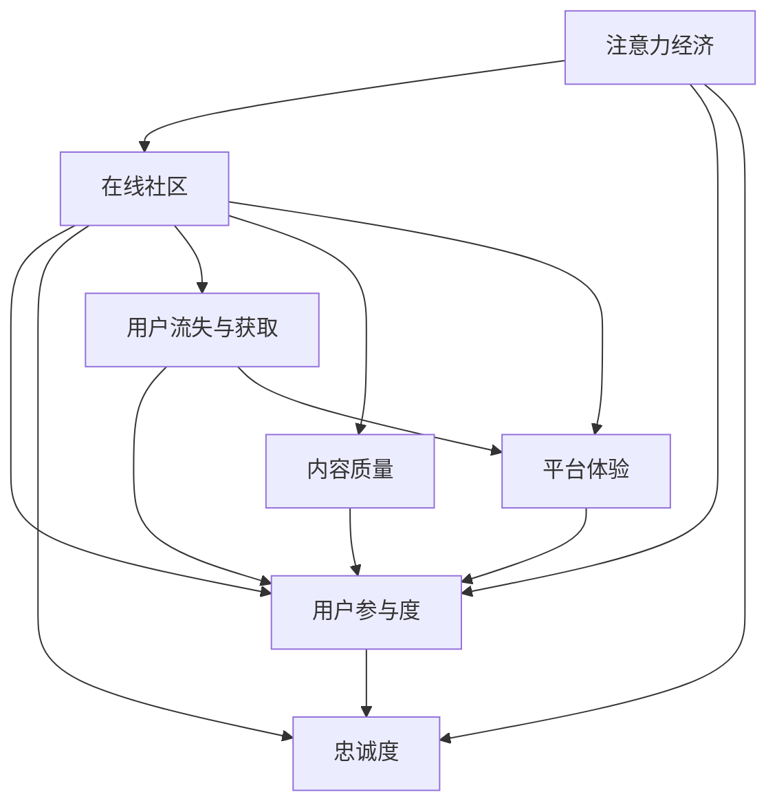

                 

# 注意力经济与在线社区：如何建立参与度高、忠诚度高的受众

## 1. 背景介绍

### 1.1 问题由来

在信息爆炸的互联网时代，用户的时间和注意力变得异常宝贵，成为了一种稀缺的“经济资源”。据统计，全球用户每天平均花费数小时在各类在线平台上浏览信息，但其中真正转化为实际消费的仅占一小部分。这不仅给平台方带来巨大挑战，也削弱了用户对平台的粘性。

在线社区作为连接用户与内容的重要平台，如何通过有效的运营策略，激发用户参与度，构建参与度高、忠诚度高的受众群体，成为当下互联网企业竞争的核心。本文将从注意力经济的角度出发，探讨在线社区构建用户参与度的关键机制，并提出一些具体的策略和工具，以供参考。

### 1.2 问题核心关键点

构建参与度高、忠诚度高的在线社区，核心在于以下几个方面：

1. **用户参与度**：衡量用户互动频次、留存率、贡献内容的数量和质量等指标。
2. **内容质量**：关注内容的原创性、价值性和多样性，以及用户对内容的接受和反馈。
3. **平台体验**：包括界面设计、加载速度、互动便捷性等用户体验因素，影响用户满意度和忠诚度。
4. **社区粘性**：通过个性化推荐、用户互动机制、社区文化建设等方式，增强用户对社区的归属感和依赖性。
5. **用户流失与获取**：研究用户流失原因，优化用户获取策略，提升社区的活跃度和扩展能力。

## 2. 核心概念与联系

### 2.1 核心概念概述

1. **注意力经济 (Attention Economy)**：指信息时代，注意力作为一种稀缺资源，其获取和分配具有经济价值。平台需要合理分配用户注意力，创造更多商业价值。

2. **在线社区 (Online Community)**：指由用户自愿参与的，基于共同兴趣或目标的虚拟社交网络。在线社区通过内容分享、互动交流，提升用户粘性。

3. **用户参与度 (User Engagement)**：衡量用户在社区中的活跃程度和贡献质量，通常包括浏览、点赞、评论、分享等行为。

4. **忠诚度 (Loyalty)**：用户对平台的长期依赖和忠诚，表现为重复访问、高频率互动等行为。

5. **用户流失 (User Churn)**：用户长时间不再使用平台，影响社区活跃度和用户增长。

6. **内容质量 (Content Quality)**：内容是否原创、有价值、多样，是社区粘性的关键。

7. **平台体验 (Platform Experience)**：用户对平台的整体使用感受，包括界面、加载速度、互动便捷性等。

这些核心概念之间的关系可以通过以下Mermaid流程图来展示：



此流程图展示了这个系统中的关键概念及其之间的关系：注意力经济驱动在线社区的建立和运营；用户参与度和忠诚度直接影响社区的活跃度和留存率；内容质量和平台体验影响用户参与度和流失率；用户流失与获取则反作用于参与度和忠诚度。

## 3. 核心算法原理 & 具体操作步骤

### 3.1 算法原理概述

在线社区构建参与度和忠诚度的过程，可以视为一个多目标优化问题，需要通过综合考虑用户行为、内容质量、平台体验等因素，最大化用户参与度和忠诚度，同时最小化用户流失率。

核心算法可以概括为以下几个步骤：

1. **用户行为分析**：通过数据收集和分析，识别出影响用户参与度的关键行为，如点赞、评论、分享等。
2. **内容质量评估**：构建内容质量和价值评估模型，识别高质量内容并给予奖励。
3. **平台体验优化**：通过A/B测试等手段，持续优化界面设计和用户体验，提升用户满意度。
4. **社区粘性增强**：设计互动机制、奖励机制，提升用户粘性。
5. **用户流失预测与干预**：构建用户流失预测模型，及时采取干预措施，减少流失率。

### 3.2 算法步骤详解

#### 3.2.1 用户行为分析

用户行为分析是了解用户参与度的基础。以下是详细的步骤：

1. **数据收集**：使用日志分析工具，如Google Analytics、Mixpanel等，收集用户行为数据，包括浏览路径、互动行为、内容类型等。

2. **行为分类**：将用户行为进行分类，如浏览、点赞、评论、分享等，便于后续分析。

3. **行为频率分析**：统计各类行为的用户数和行为频率，找出高频率行为和关键行为。

4. **行为关联分析**：分析用户行为之间的关联性，识别出引发高参与度行为的关键触发点。

#### 3.2.2 内容质量评估

内容质量是社区粘性的关键因素，以下是具体步骤：

1. **内容评分模型**：建立内容评分模型，综合考虑原创性、价值性、多样性等指标，对内容进行打分。

2. **内容推荐算法**：设计内容推荐算法，优先推荐高质量内容，吸引用户互动。

3. **用户反馈机制**：引入用户反馈机制，允许用户对内容进行打分和评论，反馈至评分模型。

4. **内容创作者激励**：对高质量内容创作者给予奖励，如徽章、积分、曝光等，鼓励优质内容产出。

#### 3.2.3 平台体验优化

平台体验直接影响用户满意度，以下是具体步骤：

1. **界面设计**：优化界面设计，提升用户浏览和互动体验。

2. **加载速度**：优化页面加载速度，减少卡顿和等待时间。

3. **互动便捷性**：设计便捷的互动机制，如快速回复、一键分享等，提升用户操作便捷性。

4. **多设备适配**：确保社区在不同设备和屏幕大小上的良好适配性。

#### 3.2.4 社区粘性增强

增强社区粘性是提升用户忠诚度的关键，以下是具体步骤：

1. **互动机制设计**：设计多样的互动机制，如评论回复、点赞、投票等，增加用户互动。

2. **奖励机制**：引入奖励机制，如徽章、积分、权益等，激励用户积极参与。

3. **社区文化建设**：通过主题活动、节日庆典等形式，建立社区文化和认同感。

#### 3.2.5 用户流失预测与干预

用户流失预测与干预是预防用户流失的重要手段，以下是具体步骤：

1. **流失预测模型**：构建用户流失预测模型，识别流失风险用户。

2. **流失原因分析**：分析流失原因，如频繁广告、用户体验差等，及时调整策略。

3. **流失干预措施**：对高流失风险用户进行干预，如发送关怀邮件、提供个性化内容等。

### 3.3 算法优缺点

#### 3.3.1 优点

1. **多目标优化**：综合考虑用户参与度、内容质量、平台体验等多个指标，实现整体最优。
2. **用户行为分析**：通过数据驱动的方式，精确识别影响参与度的关键行为。
3. **内容质量评估**：通过评分和推荐机制，促进高质量内容的产出和传播。
4. **平台体验优化**：持续提升用户体验，提高用户满意度和忠诚度。
5. **社区粘性增强**：通过互动和激励机制，提升用户粘性。
6. **用户流失预测与干预**：及时识别和处理流失用户，减少用户流失率。

#### 3.3.2 缺点

1. **数据隐私问题**：大量数据收集和分析可能导致用户隐私泄露。
2. **算法复杂度**：需要构建和维护多个模型和算法，复杂度较高。
3. **成本投入大**：优化平台体验和用户互动需要持续的资源投入。
4. **用户行为变化**：用户行为受多种因素影响，模型需不断调整优化。

## 4. 数学模型和公式 & 详细讲解 & 举例说明

### 4.1 数学模型构建

本节将使用数学语言对构建参与度和忠诚度的模型进行严格的描述。

假设社区有 $N$ 个用户，每个用户在 $T$ 时间内有 $K$ 个行为（如浏览、点赞、评论等），行为频率为 $f_k$，内容质量为 $q$，平台体验为 $x$，用户参与度为 $u$，忠诚度为 $l$。构建如下优化模型：

$$
\max \sum_{i=1}^{N} \sum_{k=1}^{K} f_k \cdot u_k + l
$$

约束条件为：

$$
f_k = \sum_{i=1}^{N} f_{ki} \\
q = \sum_{i=1}^{N} q_i \\
x = \sum_{i=1}^{N} x_i \\
u_k = \sum_{i=1}^{N} u_{ki} \\
l = \sum_{i=1}^{N} l_i
$$

其中，$u_{ki}$ 为第 $i$ 用户第 $k$ 行为的用户参与度评分，$l_i$ 为第 $i$ 用户的忠诚度评分。

### 4.2 公式推导过程

#### 4.2.1 用户行为分析

假设行为频率为 $f_k$，根据行为分类和关联分析，可得到如下公式：

$$
f_k = \frac{1}{N} \sum_{i=1}^{N} f_{ki}
$$

其中 $f_{ki}$ 为第 $i$ 用户第 $k$ 行为的发生次数。

#### 4.2.2 内容质量评估

内容质量 $q$ 可以通过评分模型和用户反馈机制得到：

$$
q = \frac{1}{N} \sum_{i=1}^{N} q_i
$$

其中 $q_i$ 为第 $i$ 用户发布的平均内容评分。

#### 4.2.3 平台体验优化

平台体验 $x$ 可通过界面设计、加载速度、互动便捷性等综合评估得到：

$$
x = \frac{1}{N} \sum_{i=1}^{N} x_i
$$

其中 $x_i$ 为第 $i$ 用户对平台体验的综合评分。

#### 4.2.4 社区粘性增强

社区粘性 $l$ 可通过互动机制、奖励机制等综合评估得到：

$$
l = \frac{1}{N} \sum_{i=1}^{N} l_i
$$

其中 $l_i$ 为第 $i$ 用户对社区的粘性评分。

#### 4.2.5 用户流失预测与干预

用户流失风险可通过流失预测模型得到：

$$
\text{Churn Risk} = \sum_{i=1}^{N} \text{Churn Risk}_{i}
$$

其中 $\text{Churn Risk}_{i}$ 为第 $i$ 用户的流失风险评分。

### 4.3 案例分析与讲解

假设我们有一个社交平台，需要优化用户参与度和忠诚度。我们可以根据上述模型进行具体分析：

1. **用户行为分析**：通过分析用户的行为数据，发现点赞和评论是影响用户参与度的关键行为，因此可以将这两个行为作为优化重点。

2. **内容质量评估**：建立内容评分模型，对高质量文章和视频进行加权奖励，提高平台内容质量。

3. **平台体验优化**：优化页面加载速度，提升用户浏览体验。引入快速回复机制，提升用户互动便捷性。

4. **社区粘性增强**：设计主题活动和节日庆典，提升用户粘性。对活跃用户进行徽章和积分奖励，激励用户积极参与。

5. **用户流失预测与干预**：构建用户流失预测模型，及时识别流失风险用户，通过关怀邮件等方式进行干预。

通过以上步骤，我们能够综合考虑多个因素，最大化用户参与度和忠诚度，从而提升社区的整体效果。

## 5. 项目实践：代码实例和详细解释说明

### 5.1 开发环境搭建

在进行项目实践前，我们需要准备好开发环境。以下是使用Python进行Scikit-learn开发的环境配置流程：

1. 安装Anaconda：从官网下载并安装Anaconda，用于创建独立的Python环境。

2. 创建并激活虚拟环境：
```bash
conda create -n sklearn-env python=3.8 
conda activate sklearn-env
```

3. 安装Scikit-learn：使用pip安装Scikit-learn库：
```bash
pip install scikit-learn
```

4. 安装各类工具包：
```bash
pip install numpy pandas scikit-learn matplotlib tqdm jupyter notebook ipython
```

完成上述步骤后，即可在`sklearn-env`环境中开始项目实践。

### 5.2 源代码详细实现

我们以内容评分模型为例，给出Scikit-learn库的代码实现。

首先，定义内容评分模型：

```python
from sklearn.feature_extraction.text import TfidfVectorizer
from sklearn.metrics.pairwise import cosine_similarity
from sklearn.linear_model import LogisticRegression

class ContentScoringModel:
    def __init__(self, vectorizer=None):
        self.vectorizer = vectorizer
        self.logreg = LogisticRegression()

    def fit(self, texts, labels):
        if self.vectorizer is None:
            self.vectorizer = TfidfVectorizer()
        X = self.vectorizer.fit_transform(texts)
        self.logreg.fit(X, labels)

    def predict(self, texts):
        if self.vectorizer is None:
            self.vectorizer = TfidfVectorizer()
        X = self.vectorizer.transform(texts)
        return self.logreg.predict_proba(X)[:, 1]

# 加载数据
texts = [
    "I love this product",
    "The service was terrible",
    "The food was amazing",
    "The movie was boring"
]
labels = [1, 0, 1, 0]  # 0为负面，1为正面
model = ContentScoringModel()
model.fit(texts, labels)
```

然后，使用训练好的模型进行内容评分：

```python
new_texts = [
    "This product is great",
    "The service was excellent",
    "The food was delicious",
    "The movie was not worth watching"
]
scores = model.predict(new_texts)
print(scores)
```

### 5.3 代码解读与分析

让我们再详细解读一下关键代码的实现细节：

**ContentScoringModel类**：
- `__init__`方法：初始化模型参数，包括向量器(vectorizer)和逻辑回归模型(logreg)。
- `fit`方法：通过拟合训练数据，学习内容与评分之间的关系。
- `predict`方法：通过向量器将新文本转化为特征向量，利用逻辑回归模型预测内容评分。

**数据加载**：
- 定义样本文本和标签，创建ContentScoringModel实例，调用fit方法进行模型训练。

**内容评分**：
- 定义新文本数据，调用predict方法获取内容评分，并打印输出。

可以看到，Scikit-learn库提供了丰富的机器学习算法和工具，使得内容评分模型的实现变得简洁高效。开发者可以灵活使用这些工具，快速构建和优化自己的算法模型。

## 6. 实际应用场景

### 6.1 社交媒体平台

社交媒体平台是用户参与度高的典型应用场景。例如，微博、知乎、豆瓣等社交网站通过内容推荐、互动机制、用户激励等方式，提升了用户参与度和社区粘性。

以知乎为例，知乎通过用户行为分析，发现高参与度的行为包括点赞、评论和关注，因此在这些行为上给予加权奖励。同时，知乎还引入了知识付费和广告推广等商业模式，提升了平台的用户忠诚度和商业价值。

### 6.2 在线教育平台

在线教育平台通过高质量内容和互动机制，吸引了大量用户参与。例如，Coursera、edX等平台通过邀请专家进行授课，提供丰富多样的课程内容，以及作业批改、社区讨论等互动机制，提升了用户的学习体验和参与度。

以Coursera为例，Coursera通过用户行为分析，发现视频播放、作业提交、讨论参与等行为是影响用户参与度的关键因素，因此在这些行为上给予加权奖励。同时，Coursera还建立了学习社区，通过论坛讨论和小组协作等互动机制，增强用户粘性。

### 6.3 电商平台

电商平台通过商品推荐和用户评论，提升了用户参与度和满意度。例如，亚马逊、淘宝等电商平台通过用户行为分析，发现浏览、添加购物车、购买等行为是影响用户参与度的关键因素，因此在这些行为上给予加权奖励。同时，亚马逊还引入了个性化推荐和智能客服等技术，提升了用户的购物体验和满意度。

以亚马逊为例，亚马逊通过用户行为分析，发现商品浏览、添加购物车、购买等行为是影响用户参与度的关键因素，因此在这些行为上给予加权奖励。同时，亚马逊还引入了个性化推荐和智能客服等技术，提升了用户的购物体验和满意度。

### 6.4 未来应用展望

随着技术的发展，未来在线社区构建用户参与度的应用将更加广泛。以下是对未来发展的展望：

1. **多模态数据融合**：结合图像、视频等多模态数据，提升内容质量和用户体验。
2. **AI驱动内容推荐**：通过深度学习等技术，实现更加智能、精准的内容推荐。
3. **个性化体验**：根据用户行为和偏好，提供个性化的内容和推荐，提升用户粘性。
4. **社交网络分析**：利用社交网络分析技术，发现社区中的关键节点和影响者，增强社区互动。
5. **用户情感分析**：通过情感分析技术，了解用户情感变化，及时调整社区策略。

这些技术的发展，将为在线社区构建用户参与度提供更多可能性，提升社区的整体效果和用户满意度。

## 7. 工具和资源推荐

### 7.1 学习资源推荐

为了帮助开发者系统掌握构建参与度和忠诚度的理论基础和实践技巧，这里推荐一些优质的学习资源：

1. 《网络分析与社区科学》系列书籍：深入浅出地介绍了网络分析、社交网络分析、社区科学等基础概念和方法。

2. 《数据科学与统计学习》课程：斯坦福大学开设的统计学习课程，涵盖统计学和数据科学的基本概念和方法。

3. 《机器学习实战》书籍：通过实际案例和代码，讲解机器学习算法和应用，适合初学者入门。

4. Kaggle平台：包含大量机器学习竞赛和数据集，适合实践和竞赛学习。

5. GitHub开源项目：查找开源项目和代码，学习前人的经验和技术。

通过对这些资源的学习实践，相信你一定能够快速掌握构建参与度和忠诚度的精髓，并用于解决实际的社区问题。

### 7.2 开发工具推荐

高效的开发离不开优秀的工具支持。以下是几款用于社区构建的常用工具：

1. Jupyter Notebook：免费、开源的交互式笔记本环境，支持代码编辑、数据可视化、模型训练等。

2. TensorFlow：由Google主导开发的开源深度学习框架，生产部署方便，适合大规模工程应用。

3. PyTorch：基于Python的开源深度学习框架，灵活高效，适合快速迭代研究。

4. Scikit-learn：Python机器学习库，提供丰富的机器学习算法和工具，适合数据建模和分析。

5. Keras：高层次深度学习框架，简单易用，适合初学者入门。

合理利用这些工具，可以显著提升社区构建的开发效率，加快创新迭代的步伐。

### 7.3 相关论文推荐

社区构建技术的发展源于学界的持续研究。以下是几篇奠基性的相关论文，推荐阅读：

1. "A Survey of Online Community Building and Maintenance" by Matthew D. Gallagher: 综述了在线社区构建和维护的关键技术，包括用户行为分析、内容质量评估、平台体验优化等。

2. "Social Network Analysis and Mining" by Jure Leskovec: 介绍社交网络分析和挖掘的基本概念和技术，适用于社区分析和用户行为分析。

3. "Recommender Systems Handbook" by Joachim Krause: 介绍了推荐系统的主要技术和应用，包括内容推荐和个性化推荐等。

这些论文代表了大语言模型微调技术的发展脉络。通过学习这些前沿成果，可以帮助研究者把握学科前进方向，激发更多的创新灵感。

## 8. 总结：未来发展趋势与挑战

### 8.1 总结

本文对构建参与度高、忠诚度高的在线社区进行了全面系统的介绍。首先阐述了社区构建的重要性，明确了用户参与度、内容质量、平台体验、社区粘性等关键概念，并提出了一系列具体的策略和工具。通过系统梳理，可以看到，构建高参与度社区需要综合考虑多个因素，采取科学的方法和工具，才能取得理想的效果。

通过本文的系统梳理，可以看到，构建高参与度社区需要综合考虑多个因素，采取科学的方法和工具，才能取得理想的效果。

### 8.2 未来发展趋势

展望未来，在线社区构建将呈现以下几个发展趋势：

1. **多模态数据融合**：结合图像、视频等多模态数据，提升内容质量和用户体验。
2. **AI驱动内容推荐**：通过深度学习等技术，实现更加智能、精准的内容推荐。
3. **个性化体验**：根据用户行为和偏好，提供个性化的内容和推荐，提升用户粘性。
4. **社交网络分析**：利用社交网络分析技术，发现社区中的关键节点和影响者，增强社区互动。
5. **用户情感分析**：通过情感分析技术，了解用户情感变化，及时调整社区策略。

这些趋势将进一步提升在线社区的参与度和粘性，使得社区成为用户价值的重要来源。

### 8.3 面临的挑战

尽管社区构建技术已经取得了瞩目成就，但在迈向更加智能化、普适化应用的过程中，它仍面临着诸多挑战：

1. **数据隐私问题**：大量数据收集和分析可能导致用户隐私泄露。
2. **算法复杂度**：需要构建和维护多个模型和算法，复杂度较高。
3. **成本投入大**：优化平台体验和用户互动需要持续的资源投入。
4. **用户行为变化**：用户行为受多种因素影响，模型需不断调整优化。

这些挑战需要开发者在实践中不断探索和优化，以实现社区构建的目标。

### 8.4 研究展望

面对社区构建所面临的种种挑战，未来的研究需要在以下几个方面寻求新的突破：

1. **多模态数据融合**：结合图像、视频等多模态数据，提升内容质量和用户体验。
2. **AI驱动内容推荐**：通过深度学习等技术，实现更加智能、精准的内容推荐。
3. **个性化体验**：根据用户行为和偏好，提供个性化的内容和推荐，提升用户粘性。
4. **社交网络分析**：利用社交网络分析技术，发现社区中的关键节点和影响者，增强社区互动。
5. **用户情感分析**：通过情感分析技术，了解用户情感变化，及时调整社区策略。

这些研究方向将推动社区构建技术的发展，提升社区的整体效果和用户满意度。

## 9. 附录：常见问题与解答

**Q1：如何选择合适的社区平台？**

A: 选择合适的社区平台需要考虑平台的用户基数、活跃度、用户群体等关键因素。可以通过市场调研和数据分析，选择最适合目标用户和应用场景的平台。

**Q2：社区内容质量如何保证？**

A: 社区内容质量可以通过内容评分模型、用户反馈机制等方式进行保证。同时，社区管理员需要进行严格的内容审核，确保高质量内容的输出。

**Q3：如何提升社区的用户参与度？**

A: 通过内容推荐、互动机制、用户激励等方式，提升社区的用户参与度。例如，知乎通过点赞、评论和关注等行为给予加权奖励，提升了用户参与度。

**Q4：如何处理社区中的负面内容？**

A: 社区中可能会存在负面内容，需要进行及时处理。可以通过举报机制、人工审核等方式，对违规内容进行处理，维护社区环境。

**Q5：社区如何实现商业化？**

A: 社区可以通过内容付费、广告推广、电商等方式实现商业化。例如，知乎通过知识付费和广告推广等商业模式，提升了平台的用户忠诚度和商业价值。

通过以上回答，可以更好地理解社区构建的相关问题和解决策略，为实际社区开发提供参考。

---

作者：禅与计算机程序设计艺术 / Zen and the Art of Computer Programming

