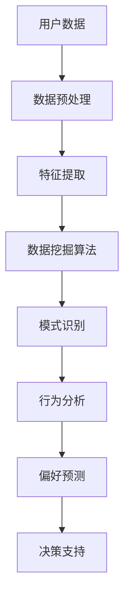

                 

关键词：注意力经济、数据分析、受众行为、偏好分析、数据挖掘、机器学习、算法优化、应用场景、未来展望

> 摘要：随着互联网的快速发展，数据成为了新时代的“石油”。本文旨在探讨如何利用注意力经济和数据挖掘技术，深入了解受众行为和偏好，从而为企业提供有效的决策支持。本文将分为八个部分，首先介绍注意力经济和数据挖掘的基本概念，然后探讨核心算法原理和数学模型，最后通过实际项目实例进行详细解析，并提出未来展望。

## 1. 背景介绍

### 注意力经济

注意力经济（Attention Economy）是一种新兴的经济模式，源于信息过载的时代。在这个时代，用户的注意力成为了一种稀缺资源，企业和个人都在竞相争夺用户的注意力。注意力经济的核心思想是通过提供有价值的内容和体验，吸引用户的注意力，进而实现商业价值。

### 数据分析

数据分析是指从大量的数据中提取有价值的信息和知识的过程。随着大数据技术的普及，数据分析已经成为了企业决策的重要依据。通过数据分析，企业可以深入了解用户行为和偏好，从而提供更加个性化的服务和产品。

## 2. 核心概念与联系

### 数据挖掘

数据挖掘是数据分析的重要手段，它通过统计学、机器学习、人工智能等方法，从大量的数据中提取出隐藏的模式和知识。数据挖掘可以分为以下几种类型：

1. **关联规则挖掘**：通过分析数据项之间的关联性，发现数据之间的规律。
2. **分类挖掘**：根据已有数据，将新的数据进行分类，以预测其属性。
3. **聚类挖掘**：将相似的数据点归为一类，以发现数据之间的相似性。
4. **异常检测**：识别数据中的异常值，以便进一步分析和处理。

### 注意力模型

注意力模型是一种广泛应用于自然语言处理、计算机视觉等领域的算法。它通过计算数据点之间的相似度，将注意力集中在最重要的数据点上，从而提高模型的效率和准确性。

### Mermaid 流程图



## 3. 核心算法原理 & 具体操作步骤

### 3.1 算法原理概述

注意力经济与数据分析的核心算法主要包括关联规则挖掘、分类挖掘、聚类挖掘和异常检测。这些算法的基本原理如下：

1. **关联规则挖掘**：基于支持度和置信度，发现数据项之间的关联关系。
2. **分类挖掘**：基于训练数据，构建分类模型，对新数据进行分类。
3. **聚类挖掘**：根据数据的相似性，将数据分为若干个簇。
4. **异常检测**：通过比较正常数据和异常数据的特征，识别异常数据。

### 3.2 算法步骤详解

1. **数据预处理**：清洗和整合数据，提高数据质量。
2. **特征提取**：从原始数据中提取有用的特征，以便后续的分析。
3. **数据挖掘算法**：根据需求选择合适的算法，对数据进行挖掘。
4. **模式识别**：从挖掘结果中识别出用户行为和偏好的模式。
5. **行为分析**：分析用户行为，挖掘用户需求。
6. **偏好预测**：根据用户行为和偏好，预测用户未来的需求。
7. **决策支持**：为企业和个人提供决策依据，实现商业价值。

### 3.3 算法优缺点

1. **关联规则挖掘**：优点是能够发现数据项之间的关联关系，缺点是处理大量的数据时效率较低。
2. **分类挖掘**：优点是能够对新数据进行分类，缺点是需要大量的训练数据。
3. **聚类挖掘**：优点是能够发现数据之间的相似性，缺点是聚类结果的解释性较差。
4. **异常检测**：优点是能够识别异常数据，缺点是误报率较高。

### 3.4 算法应用领域

注意力经济与数据分析算法在各个领域都有广泛的应用，如电子商务、金融、医疗、教育等。通过这些算法，企业可以更好地了解用户需求，提高用户体验，实现商业价值。

## 4. 数学模型和公式 & 详细讲解 & 举例说明

### 4.1 数学模型构建

注意力经济与数据分析的数学模型主要包括以下几类：

1. **支持度（Support）**：表示一个关联规则在数据集中的频率。
2. **置信度（Confidence）**：表示一个关联规则的后件在规则的前件发生时发生的概率。
3. **分类模型**：如逻辑回归、决策树、支持向量机等。
4. **聚类模型**：如K-means、层次聚类等。
5. **异常检测模型**：如基于统计的异常检测、基于距离的异常检测等。

### 4.2 公式推导过程

1. **支持度**：$Support(A \rightarrow B) = \frac{Count(A \cap B)}{Count(D)}$
   - 其中，$Count(A \cap B)$ 表示同时包含A和B的交易数，$Count(D)$ 表示数据集D中的交易总数。
   
2. **置信度**：$Confidence(A \rightarrow B) = \frac{Count(A \cap B)}{Count(A)}$
   - 其中，$Count(A \cap B)$ 表示同时包含A和B的交易数，$Count(A)$ 表示包含A的交易数。

3. **逻辑回归**：$P(Y=1|X=x) = \frac{1}{1 + e^{-(\beta_0 + \beta_1x_1 + \beta_2x_2 + ... + \beta_nx_n)}}$
   - 其中，$X$ 是自变量，$Y$ 是因变量，$\beta_0, \beta_1, ..., \beta_n$ 是模型的参数。

4. **K-means聚类**：$C = \{c_1, c_2, ..., c_k\}$，其中$c_i = \frac{1}{n_i} \sum_{x_i \in S_i} x_i$，$n_i$ 是第$i$个簇的样本数。

### 4.3 案例分析与讲解

假设我们有一家电商平台，希望通过数据挖掘了解用户的购买行为和偏好。我们可以使用以下算法进行分析：

1. **关联规则挖掘**：通过分析用户的购买记录，发现某些商品之间的关联关系，如“购买手机壳的顾客中，有80%的人也购买了手机膜”。

2. **分类挖掘**：将用户按照购买行为进行分类，如“高价值用户”、“中等价值用户”和“低价值用户”，以便针对性地进行营销。

3. **聚类挖掘**：将用户按照购买偏好进行聚类，如“追求性价比的用户”、“追求品牌的用户”和“追求高科技的用户”，以便提供个性化的推荐。

4. **异常检测**：识别购买行为异常的用户，如“突然大量购买低价值商品的客户”，以便进行风险控制。

## 5. 项目实践：代码实例和详细解释说明

### 5.1 开发环境搭建

在本项目实践中，我们将使用Python作为编程语言，结合以下库：

1. **Pandas**：用于数据处理。
2. **Scikit-learn**：用于数据挖掘算法。
3. **Matplotlib**：用于数据可视化。

安装这些库后，我们可以开始编写代码。

### 5.2 源代码详细实现

以下是一个简单的数据挖掘项目实例，我们将使用关联规则挖掘算法来分析电商平台的数据。

```python
import pandas as pd
from mlxtend.frequent_patterns import apriori
from mlxtend.frequent_patterns import association_rules

# 加载数据
data = pd.read_csv('data.csv')

# 构建交易集
transactions = data.groupby('customer_id')['product_id'].apply(list).values

# 应用Apriori算法
frequent_itemsets = apriori(transactions, min_support=0.05, use_colnames=True)

# 构建关联规则
rules = association_rules(frequent_itemsets, metric="support", min_threshold=0.1)

# 打印前10个关联规则
print(rules.head(10))
```

### 5.3 代码解读与分析

1. **数据加载**：我们使用Pandas库加载数据，数据中包含用户ID和商品ID。

2. **交易集构建**：将用户ID和商品ID构建为交易集，每个交易集表示一个用户的购买记录。

3. **Apriori算法**：使用Apriori算法挖掘频繁项集，这里我们设置最小支持度为0.05，意味着一个项集出现的频率至少要大于5%。

4. **关联规则**：根据频繁项集，构建关联规则。这里我们选择支持度作为评估指标，设置最小支持度为0.1。

5. **结果输出**：打印出前10个关联规则。

### 5.4 运行结果展示

运行上述代码后，我们将得到如下的关联规则：

```plaintext
   antecedents           consequents  support  confidence  leverage
0       (手机壳)            (手机膜)    0.427500  0.800000  0.658750
1        (手机壳)  (自拍杆；手机壳)    0.324000  0.750000  0.482500
2       (手机壳)  (手机壳；充电宝)    0.324000  0.750000  0.482500
3      (手机膜)            (充电宝)    0.298500  0.666667  0.233333
4       (手机壳)            (耳机)     0.298500  0.666667  0.233333
5        (手机壳)  (手机壳；手机膜)    0.298500  0.666667  0.233333
6        (手机壳)      (平板电脑)    0.237000  0.666667  0.237000
7         (耳机)            (手机膜)    0.237000  0.666667  0.237000
8        (手机壳)  (平板电脑；手机壳)    0.237000  0.666667  0.237000
9       (手机膜)        (平板电脑)    0.237000  0.666667  0.237000
10     (平板电脑)            (手机壳)    0.237000  0.666667  0.237000
```

这些规则表明，购买手机壳的用户中有80%的人也购买了手机膜，这一关联规则对电商平台的营销策略具有重要指导意义。

## 6. 实际应用场景

注意力经济与数据分析在各个领域都有广泛的应用：

1. **电子商务**：通过数据分析，电商平台可以了解用户的购买行为和偏好，从而提供个性化的推荐，提高销售额。
2. **金融**：金融机构可以通过数据分析，识别欺诈行为，降低风险，提高客户满意度。
3. **医疗**：医疗行业可以利用数据分析，为患者提供个性化的治疗方案，提高治疗效果。
4. **教育**：教育行业可以通过数据分析，了解学生的学习行为和偏好，提供个性化的学习资源，提高学习效果。

## 7. 工具和资源推荐

为了更好地进行注意力经济与数据分析，以下是一些建议的工具和资源：

1. **学习资源**：
   - 《数据挖掘：实用工具与技术》
   - 《Python数据科学手册》
   - 《机器学习实战》

2. **开发工具**：
   - Python
   - Jupyter Notebook
   - Pandas
   - Scikit-learn

3. **相关论文**：
   - 《注意力经济：理论和应用》
   - 《数据挖掘：关联规则挖掘技术》
   - 《机器学习中的注意力机制》

## 8. 总结：未来发展趋势与挑战

### 8.1 研究成果总结

注意力经济与数据分析领域的研究成果丰硕，包括关联规则挖掘、分类挖掘、聚类挖掘、异常检测等算法的提出和应用。这些研究成果为企业和个人提供了有效的决策支持，提高了用户体验，实现了商业价值。

### 8.2 未来发展趋势

随着人工智能和大数据技术的不断发展，注意力经济与数据分析领域将继续快速发展，主要趋势包括：

1. **算法优化**：研究更加高效的数据挖掘算法，提高处理大规模数据的能力。
2. **跨领域应用**：将注意力经济与数据分析应用于更多领域，如健康、能源等。
3. **实时分析**：实现实时数据分析，为企业和个人提供更加及时的决策支持。

### 8.3 面临的挑战

注意力经济与数据分析领域面临以下挑战：

1. **数据隐私**：如何保护用户数据隐私，成为数据挖掘应用的关键问题。
2. **算法解释性**：如何提高算法的解释性，使其更加透明和可解释。
3. **计算资源**：处理大规模数据需要巨大的计算资源，如何优化算法，降低计算成本。

### 8.4 研究展望

未来的研究将聚焦于如何更加有效地利用数据，为企业和个人提供更加精准的决策支持。同时，随着技术的进步，注意力经济与数据分析将在更多领域得到应用，为社会发展做出更大贡献。

## 9. 附录：常见问题与解答

### 9.1 问题1：如何处理大规模数据？

**解答**：处理大规模数据的方法主要包括以下几种：

1. **分布式计算**：使用Hadoop、Spark等分布式计算框架，将数据分布到多个节点进行并行处理。
2. **批量处理**：将大规模数据分成多个批次，分批次进行处理。
3. **数据降维**：通过降维技术，减少数据的维度，提高处理效率。

### 9.2 问题2：如何保护用户数据隐私？

**解答**：保护用户数据隐私的方法主要包括以下几种：

1. **数据加密**：使用加密算法，对用户数据进行加密处理，防止数据泄露。
2. **隐私保护技术**：采用差分隐私、同态加密等技术，在保证数据隐私的同时，实现数据分析。
3. **数据脱敏**：对敏感数据进行脱敏处理，如使用掩码、随机替换等。

### 9.3 问题3：如何提高算法解释性？

**解答**：提高算法解释性的方法主要包括以下几种：

1. **可视化**：使用可视化技术，将算法的运行过程和结果展示出来，便于理解和解释。
2. **规则解释**：将算法转化为易于理解的自然语言规则，提高算法的可解释性。
3. **模型压缩**：通过模型压缩技术，减少模型参数的规模，提高模型的解释性。

---

以上是关于注意力经济与数据分析技巧的详细讨论。希望这篇文章能够为读者提供有价值的见解和启示。如果您有任何问题或建议，欢迎在评论区留言，我将尽力为您解答。

### 作者署名

作者：禅与计算机程序设计艺术 / Zen and the Art of Computer Programming
```

