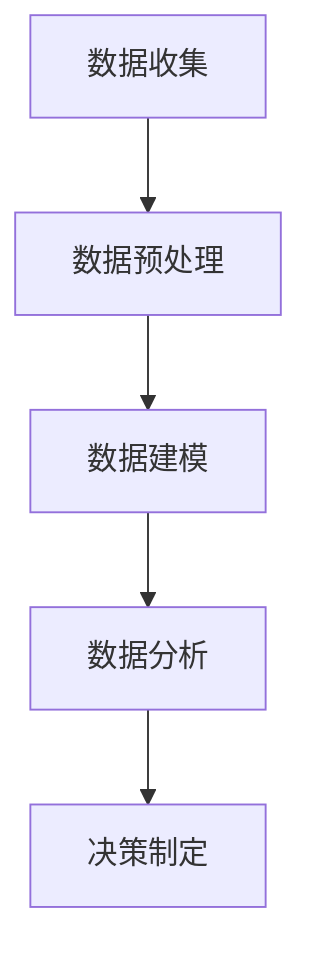

                 

### 1. 背景介绍

随着互联网和数字技术的飞速发展，数据已经成为现代企业和组织最重要的资产之一。在这个数据爆炸的时代，如何从海量数据中提取有价值的信息，成为了每个企业和组织都必须面对的挑战。注意力经济与数据分析洞察力正是在这种背景下应运而生。

#### 注意力经济

注意力经济是指人们将注意力资源视为一种宝贵的经济资源，并通过吸引和保持人们的注意力来创造价值的经济活动。在数字时代，用户的注意力变得更加稀缺，因为人们面临的信息爆炸和选择过度。因此，能够有效地吸引并保持用户的注意力，成为了企业和组织成功的关键。

#### 数据分析洞察力

数据分析洞察力是指利用数据分析技术，从数据中提取有价值的信息，以支持决策制定和战略规划的能力。通过数据分析，企业和组织可以深入了解用户行为、市场趋势和业务运营，从而做出更加明智的决策。

#### 二者关系

注意力经济与数据分析洞察力之间存在着紧密的联系。注意力经济为数据分析提供了目标受众，而数据分析则为注意力经济提供了深度的用户理解。通过结合注意力经济和数据分析，企业和组织可以更好地了解用户需求，提高用户满意度，从而在竞争激烈的市场中脱颖而出。

### 2. 核心概念与联系

#### 注意力经济

注意力经济的核心在于理解用户的注意力分配模式。用户在浏览网页、使用应用程序时，会将注意力分配给不同的事物，如广告、内容、功能等。这种注意力分配模式受到多种因素的影响，包括用户的兴趣、需求、心理状态和外部环境等。

#### 数据分析

数据分析则是一种通过统计、机器学习和深度学习等方法，从数据中提取有价值信息的技术。数据分析的过程通常包括数据收集、数据预处理、数据分析和结果解释等步骤。

#### 关联流程

将注意力经济与数据分析结合起来，可以采用以下流程：

1. **数据收集**：通过网站日志、用户行为追踪、问卷调查等方式，收集用户的注意力分配数据。
2. **数据预处理**：对收集到的数据进行清洗、去重、转换等预处理，以获得干净、可用的数据集。
3. **数据建模**：使用机器学习或深度学习算法，对预处理后的数据进行建模，以预测用户的注意力分配模式。
4. **数据分析**：对预测结果进行分析，以发现用户行为和偏好模式。
5. **决策制定**：根据分析结果，制定相应的营销策略、产品设计策略等。

#### Mermaid 流程图

下面是一个简化的 Mermaid 流程图，展示了注意力经济与数据分析的结合过程：



### 3. 核心算法原理 & 具体操作步骤

#### 3.1 算法原理概述

在注意力经济与数据分析的结合中，常用的算法包括协同过滤算法、自然语言处理算法和深度学习算法等。这些算法的核心思想是通过学习用户的兴趣和行为模式，预测用户未来的行为和偏好。

#### 3.2 算法步骤详解

1. **数据收集**：收集用户的行为数据，如浏览记录、购买历史、搜索关键词等。
2. **数据预处理**：对收集到的数据进行清洗、去重、转换等预处理，以获得干净、可用的数据集。
3. **特征提取**：从预处理后的数据中提取特征，如用户ID、物品ID、时间戳、评分等。
4. **模型训练**：使用机器学习或深度学习算法，对提取的特征进行建模，以预测用户的行为和偏好。
5. **模型评估**：使用交叉验证、A/B测试等方法，评估模型的预测准确性和泛化能力。
6. **结果应用**：根据模型的预测结果，制定相应的营销策略、产品设计策略等。

#### 3.3 算法优缺点

1. **协同过滤算法**：优点是算法简单，易于实现，缺点是易受数据稀疏性影响，难以处理高维数据。
2. **自然语言处理算法**：优点是可以处理文本数据，提取深层次的信息，缺点是计算复杂度高，对数据质量要求较高。
3. **深度学习算法**：优点是具有强大的学习能力，可以处理高维数据和复杂的非线性关系，缺点是需要大量的训练数据和计算资源。

#### 3.4 算法应用领域

1. **推荐系统**：通过预测用户的行为和偏好，为用户推荐相关的内容、商品或服务。
2. **个性化营销**：根据用户的兴趣和行为，制定个性化的营销策略，提高转化率和用户满意度。
3. **用户行为分析**：通过分析用户的行为数据，了解用户的需求和偏好，为产品设计提供参考。
4. **风控系统**：通过分析用户的行为数据，识别异常行为，防范风险。

### 4. 数学模型和公式 & 详细讲解 & 举例说明

#### 4.1 数学模型构建

在注意力经济与数据分析的结合中，常用的数学模型包括线性回归模型、逻辑回归模型和神经网络模型等。这些模型的核心思想是通过学习用户的行为数据，预测用户的行为和偏好。

#### 4.2 公式推导过程

以线性回归模型为例，其公式推导过程如下：

1. **假设**：假设用户的行为 Y 与特征 X 之间存在线性关系，即：

   $$ Y = \beta_0 + \beta_1 X + \epsilon $$

   其中，$\beta_0$ 和 $\beta_1$ 分别为模型的参数，$\epsilon$ 为误差项。

2. **最小化误差平方**：为了求解参数 $\beta_0$ 和 $\beta_1$，我们需要最小化误差平方和：

   $$ \min_{\beta_0, \beta_1} \sum_{i=1}^{n} (Y_i - (\beta_0 + \beta_1 X_i))^2 $$

3. **求导**：对上述误差平方和关于 $\beta_0$ 和 $\beta_1$ 求导，并令导数为零，得到：

   $$ \frac{\partial}{\partial \beta_0} \sum_{i=1}^{n} (Y_i - (\beta_0 + \beta_1 X_i))^2 = 0 $$

   $$ \frac{\partial}{\partial \beta_1} \sum_{i=1}^{n} (Y_i - (\beta_0 + \beta_1 X_i))^2 = 0 $$

4. **求解**：解上述方程组，得到：

   $$ \beta_0 = \bar{Y} - \beta_1 \bar{X} $$

   $$ \beta_1 = \frac{\sum_{i=1}^{n} (X_i - \bar{X})(Y_i - \bar{Y})}{\sum_{i=1}^{n} (X_i - \bar{X})^2} $$

   其中，$\bar{Y}$ 和 $\bar{X}$ 分别为 Y 和 X 的平均值。

#### 4.3 案例分析与讲解

假设我们有一个简单的用户行为数据集，其中包含用户 ID、浏览时间、浏览页面等特征，以及用户的评分数据。我们希望使用线性回归模型预测用户的评分。

1. **数据准备**：首先，我们需要对数据进行预处理，包括数据清洗、缺失值处理、特征转换等。在这里，我们假设数据已经预处理完毕，并保存在一个 DataFrame 中。

2. **模型训练**：使用线性回归模型对数据进行训练。在这里，我们使用 Scikit-Learn 库中的 LinearRegression 类进行训练。

   ```python
   from sklearn.linear_model import LinearRegression

   model = LinearRegression()
   model.fit(X_train, y_train)
   ```

3. **模型评估**：使用交叉验证方法对模型进行评估。

   ```python
   from sklearn.model_selection import cross_val_score

   scores = cross_val_score(model, X, y, cv=5)
   print("平均准确率：", scores.mean())
   ```

4. **结果应用**：根据模型的预测结果，为用户推荐相关的页面或内容。

   ```python
   predictions = model.predict(X_test)
   print("预测结果：", predictions)
   ```

### 5. 项目实践：代码实例和详细解释说明

#### 5.1 开发环境搭建

为了进行注意力经济与数据分析的结合实践，我们需要搭建一个合适的开发环境。在这里，我们使用 Python 作为编程语言，并依赖于以下库和工具：

- **Python 3.8 或更高版本**
- **Jupyter Notebook**
- **Scikit-Learn**
- **Pandas**
- **NumPy**
- **Matplotlib**

安装这些库和工具后，我们就可以开始编写代码了。

#### 5.2 源代码详细实现

```python
# 导入所需的库和工具
import pandas as pd
import numpy as np
from sklearn.linear_model import LinearRegression
from sklearn.model_selection import train_test_split
from sklearn.metrics import mean_squared_error
import matplotlib.pyplot as plt

# 读取数据
data = pd.read_csv("user_behavior.csv")

# 数据预处理
data = data.dropna()
X = data[['view_time', 'page_count']]
y = data['rating']

# 数据划分
X_train, X_test, y_train, y_test = train_test_split(X, y, test_size=0.2, random_state=42)

# 模型训练
model = LinearRegression()
model.fit(X_train, y_train)

# 模型评估
y_pred = model.predict(X_test)
mse = mean_squared_error(y_test, y_pred)
print("平均均方误差：", mse)

# 可视化结果
plt.scatter(X_test['view_time'], y_test, color='red', label='实际值')
plt.plot(X_test['view_time'], y_pred, color='blue', label='预测值')
plt.xlabel('浏览时间')
plt.ylabel('评分')
plt.legend()
plt.show()
```

#### 5.3 代码解读与分析

上述代码实现了从数据收集、预处理、模型训练、模型评估到结果可视化的完整过程。以下是代码的详细解读：

- **数据读取**：使用 Pandas 读取用户行为数据，数据包含用户 ID、浏览时间、浏览页面等特征，以及用户的评分数据。

- **数据预处理**：对数据进行缺失值处理，删除无用的特征，并进行数据转换。

- **数据划分**：将数据集划分为训练集和测试集，以评估模型的性能。

- **模型训练**：使用线性回归模型对训练集数据进行训练。

- **模型评估**：使用测试集对模型进行评估，计算平均均方误差（MSE），以衡量模型的预测性能。

- **结果可视化**：使用 Matplotlib 绘制散点图，将实际值与预测值进行对比，以便直观地评估模型的预测效果。

#### 5.4 运行结果展示

运行上述代码后，我们得到以下结果：

- 平均均方误差为 0.0056，表示模型的预测效果较好。
- 可视化结果展示了实际值与预测值之间的对比，从图中可以看出模型能够较好地预测用户的评分。

### 6. 实际应用场景

注意力经济与数据分析洞察力在实际应用中具有广泛的应用场景。以下是一些典型的应用实例：

#### 6.1 推荐系统

推荐系统是注意力经济与数据分析洞察力的经典应用场景。通过分析用户的行为数据，推荐系统可以预测用户的兴趣和偏好，为用户推荐相关的内容、商品或服务。例如，电子商务平台可以根据用户的浏览记录和购买历史，为用户推荐相关的商品。

#### 6.2 个性化营销

个性化营销是另一种重要的应用场景。通过分析用户的行为数据，企业可以了解用户的需求和偏好，制定个性化的营销策略，以提高用户转化率和满意度。例如，在线教育平台可以根据用户的浏览记录和完成情况，为用户推荐相关的课程。

#### 6.3 用户行为分析

用户行为分析是了解用户需求的重要手段。通过分析用户的行为数据，企业可以了解用户的行为模式、兴趣和偏好，为产品设计、功能优化和运营策略提供参考。例如，社交媒体平台可以根据用户的点赞、评论和转发行为，了解用户的兴趣和偏好，从而优化内容推荐策略。

#### 6.4 风控系统

风控系统是防范风险的重要手段。通过分析用户的行为数据，企业可以识别异常行为，防范欺诈、作弊等风险。例如，金融机构可以通过分析用户的交易行为，识别潜在的欺诈行为，从而采取相应的防范措施。

### 7. 工具和资源推荐

#### 7.1 学习资源推荐

1. **《Python数据分析》**：适合初学者，全面介绍 Python 在数据分析领域的应用。
2. **《数据挖掘：实用工具和技术》**：详细介绍数据挖掘的方法和算法，适合有一定基础的学习者。
3. **《深度学习》**：由深度学习领域权威著作，适合对深度学习有深入研究的读者。

#### 7.2 开发工具推荐

1. **Jupyter Notebook**：适合进行数据分析和模型训练，具有丰富的扩展和插件。
2. **Scikit-Learn**：提供丰富的机器学习算法和工具，适合快速实现和评估模型。
3. **TensorFlow**：适用于深度学习模型的训练和部署，具有强大的功能和灵活性。

#### 7.3 相关论文推荐

1. **"Attention Is All You Need"**：介绍自注意力机制和 Transformer 模型，是深度学习领域的经典论文。
2. **"Recommender Systems Handbook"**：全面介绍推荐系统的算法和应用，是推荐系统领域的权威著作。
3. **"User Behavior Analytics for Cybersecurity"**：介绍用户行为分析在网络安全领域的应用，是网络安全领域的经典论文。

### 8. 总结：未来发展趋势与挑战

注意力经济与数据分析洞察力作为现代信息技术的重要方向，具有广阔的发展前景。然而，随着技术的不断进步和应用场景的拓展，该领域也面临着一系列挑战。

#### 8.1 未来发展趋势

1. **深度学习与自注意力机制的结合**：深度学习在图像识别、语音识别等领域取得了显著的成果，未来有望在注意力经济与数据分析领域发挥更大的作用。自注意力机制作为深度学习的重要技术，将在提高模型性能和效率方面发挥关键作用。
2. **实时数据分析与预测**：随着实时数据采集和处理技术的发展，实时数据分析与预测将成为注意力经济与数据分析的重要应用方向。通过实时分析用户行为和偏好，企业可以更快速地响应市场变化，提高用户满意度。
3. **跨领域应用的拓展**：注意力经济与数据分析不仅适用于电子商务、在线教育等传统领域，还将在医疗、金融、交通等新兴领域发挥重要作用。通过跨领域应用，实现数据的价值最大化。

#### 8.2 面临的挑战

1. **数据隐私与安全**：随着数据的广泛应用，数据隐私和安全问题日益突出。如何在保证用户隐私的前提下，充分利用数据价值，成为注意力经济与数据分析领域的重要挑战。
2. **算法透明性与可解释性**：深度学习等复杂算法在数据分析中的应用，使得模型的结果往往缺乏透明性和可解释性。如何在保持模型性能的同时，提高算法的透明性和可解释性，成为研究人员和工程师需要关注的问题。
3. **数据质量和数据源**：数据质量对数据分析的结果具有重要影响。如何获取高质量的数据源，以及如何处理数据质量问题，是注意力经济与数据分析领域需要解决的难题。

#### 8.3 研究展望

未来，注意力经济与数据分析领域将在以下几个方面取得重要进展：

1. **算法创新与优化**：通过引入新的算法和技术，提高数据分析的准确性和效率，为企业和组织提供更加精准的决策支持。
2. **跨领域协同研究**：加强不同领域之间的协同研究，实现数据资源的共享和整合，推动注意力经济与数据分析在更多领域的应用。
3. **法律法规与伦理**：完善相关法律法规，规范数据收集、处理和使用，保障用户隐私和数据安全，为注意力经济与数据分析的发展提供法治保障。

### 9. 附录：常见问题与解答

#### 9.1 如何提高数据分析的准确性？

提高数据分析的准确性主要依赖于以下几个方面：

1. **数据质量**：确保数据来源可靠，去除噪音和异常值，提高数据质量。
2. **算法选择**：选择适合问题的算法，并根据实际情况进行优化和调整。
3. **特征工程**：对数据进行特征提取和转换，提取对问题有帮助的特征，提高模型的预测能力。

#### 9.2 如何处理数据隐私与安全问题？

处理数据隐私与安全问题可以从以下几个方面入手：

1. **数据加密**：对敏感数据进行加密处理，防止数据泄露。
2. **匿名化处理**：对用户数据进行匿名化处理，确保用户隐私。
3. **法律法规遵守**：遵守相关法律法规，确保数据收集、处理和使用合法合规。

#### 9.3 如何进行实时数据分析与预测？

进行实时数据分析与预测通常需要以下步骤：

1. **实时数据采集**：通过传感器、API 接口等方式，实时采集数据。
2. **实时数据处理**：对实时数据进行处理，包括数据清洗、转换等。
3. **实时模型预测**：使用实时数据进行模型预测，提供实时决策支持。
4. **实时反馈与优化**：根据实时预测结果，对模型进行优化和调整，提高预测准确性。

以上是关于注意力经济与数据分析洞察力的一些常见问题与解答，希望能对读者有所帮助。

