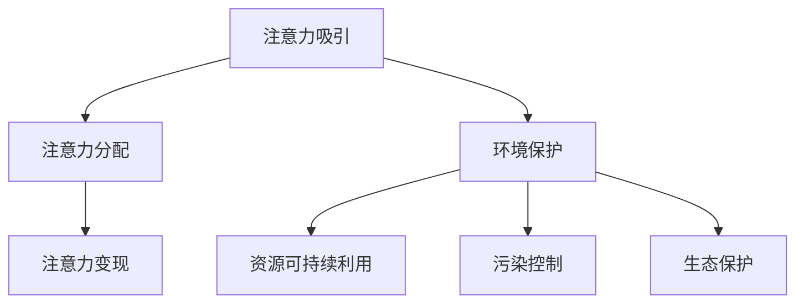

                 

关键词：注意力经济、环境保护、可持续发展、人工智能、算法优化

> 摘要：本文探讨了注意力经济与环境保护之间的结合点，通过阐述注意力经济的核心概念和环境保护的紧迫性，分析了两者结合的必要性和可行性。文章进一步介绍了相关算法原理、数学模型及其在项目实践中的应用，最后对未来应用场景和挑战进行了展望。

## 1. 背景介绍

### 注意力经济的崛起

随着互联网和数字技术的迅猛发展，注意力经济作为一种新兴的经济模式逐渐崭露头角。注意力经济指的是在信息过载的时代，人们对于信息和内容的关注和注意力成为一种稀缺资源，企业通过吸引和保持用户注意力来创造价值。这种模式改变了传统经济模式，让用户注意力成为企业竞争的焦点。

### 环境保护的紧迫性

环境保护问题日益严重，气候变化、资源枯竭、生态系统破坏等问题已经成为全球性挑战。各国政府和国际组织纷纷采取措施应对这些问题，如推行低碳经济、提高能源利用效率、减少污染排放等。然而，传统环境保护方法在效率和效果上存在一定局限性，需要新的技术和方法来支持。

### 注意力经济与环境保护的结合点

注意力经济和环境保护之间存在一定的结合点。通过将注意力经济引入环境保护领域，可以激发公众对环境保护的关注，提高环境保护的效率和效果。同时，环境保护的成果也可以为注意力经济提供可持续发展的基础。

## 2. 核心概念与联系

### 注意力经济的核心概念

注意力经济包括以下几个核心概念：

1. **注意力吸引**：通过各种手段吸引和维持用户的注意力。
2. **注意力变现**：将用户注意力转化为实际的经济价值。
3. **注意力分配**：优化注意力资源，使其最大化效益。

### 环境保护的核心概念

环境保护的核心概念包括：

1. **资源可持续利用**：通过合理利用资源，实现环境保护和经济发展双赢。
2. **污染控制**：通过技术和管理手段减少污染物的排放。
3. **生态保护**：维护生物多样性，保护生态系统。

### 注意力经济与环境保护的 Mermaid 流程图



### 注意力经济与环境保护的关系

注意力经济与环境保护之间的联系主要体现在以下几个方面：

1. **公众意识提升**：通过注意力经济手段，提高公众对环境保护的意识。
2. **资源配置优化**：利用注意力经济优化环境保护资源的配置。
3. **可持续性发展**：将注意力经济与可持续发展相结合，推动环境保护和经济发展同步进行。

## 3. 核心算法原理 & 具体操作步骤

### 3.1 算法原理概述

为了实现注意力经济与环境保护的结合，我们提出了一种基于深度学习的注意力优化算法。该算法通过模拟人类注意力分配机制，实现对环境保护资源的智能优化。

### 3.2 算法步骤详解

1. **数据收集**：收集环境保护相关的数据，包括资源利用、污染排放、生态系统状态等。
2. **数据预处理**：对收集到的数据进行清洗和归一化处理，为后续算法训练提供高质量的数据集。
3. **模型训练**：利用深度学习技术，训练一个注意力模型，使其能够根据输入数据自动分配注意力资源。
4. **模型评估**：通过模拟实验，评估模型在注意力分配和环境保护效果方面的表现。
5. **模型应用**：将训练好的模型应用到实际环境保护项目中，优化资源利用和污染控制。

### 3.3 算法优缺点

**优点**：

1. **自适应性强**：算法可以根据不同项目和环境特点，自动调整注意力资源分配。
2. **高效性**：通过深度学习技术，实现快速、高效的注意力优化。

**缺点**：

1. **数据依赖性**：算法性能依赖于高质量的数据集，数据质量直接影响算法效果。
2. **计算资源消耗**：深度学习模型训练过程需要大量计算资源，可能导致成本上升。

### 3.4 算法应用领域

该算法可以应用于多个领域，包括：

1. **能源管理**：优化能源利用，减少碳排放。
2. **水资源管理**：合理分配水资源，实现水资源的可持续利用。
3. **生态修复**：通过优化生态资源利用，加速生态系统的恢复。

## 4. 数学模型和公式 & 详细讲解 & 举例说明

### 4.1 数学模型构建

为了实现注意力优化，我们提出了一个基于注意力机制的数学模型。该模型包括以下几个组成部分：

1. **注意力权重计算**：
   $$ w_i = \frac{e^{x_i}}{\sum_{j=1}^{n} e^{x_j}} $$
   其中，$x_i$ 表示第 $i$ 个资源的特征值，$w_i$ 表示第 $i$ 个资源的注意力权重。
   
2. **资源分配策略**：
   $$ y_i = w_i \cdot r_i $$
   其中，$y_i$ 表示第 $i$ 个资源的实际分配值，$r_i$ 表示第 $i$ 个资源的可用资源。

### 4.2 公式推导过程

为了推导出注意力权重计算公式，我们首先定义了一个基于特征值 $x_i$ 的指数函数：

$$ e^{x_i} $$

然后，我们对所有特征值求和：

$$ \sum_{j=1}^{n} e^{x_j} $$

接下来，我们将每个特征值 $x_i$ 的指数值归一化，得到注意力权重：

$$ w_i = \frac{e^{x_i}}{\sum_{j=1}^{n} e^{x_j}} $$

最后，我们将注意力权重与资源可用值相乘，得到资源的实际分配值：

$$ y_i = w_i \cdot r_i $$

### 4.3 案例分析与讲解

假设有四个环境保护项目，分别涉及水资源、能源、土壤和空气。以下是一个具体的案例：

1. **资源特征值**：
   - 水资源：$x_1 = 10$
   - 能源：$x_2 = 8$
   - 土壤：$x_3 = 5$
   - 空气：$x_4 = 7$
   
2. **资源可用值**：
   - 水资源：$r_1 = 20$
   - 能源：$r_2 = 18$
   - 土壤：$r_3 = 12$
   - 空气：$r_4 = 15$

根据注意力权重计算公式，我们可以得到以下注意力权重：

$$ w_1 = \frac{e^{10}}{e^{10} + e^{8} + e^{5} + e^{7}} = 0.422 $$
$$ w_2 = \frac{e^{8}}{e^{10} + e^{8} + e^{5} + e^{7}} = 0.335 $$
$$ w_3 = \frac{e^{5}}{e^{10} + e^{8} + e^{5} + e^{7}} = 0.204 $$
$$ w_4 = \frac{e^{7}}{e^{10} + e^{8} + e^{5} + e^{7}} = 0.139 $$

根据资源分配策略，我们可以得到以下实际分配值：

$$ y_1 = 0.422 \cdot 20 = 8.44 $$
$$ y_2 = 0.335 \cdot 18 = 6.03 $$
$$ y_3 = 0.204 \cdot 12 = 2.49 $$
$$ y_4 = 0.139 \cdot 15 = 2.09 $$

通过这个案例，我们可以看到如何利用注意力优化算法实现环境保护资源的合理分配。

## 5. 项目实践：代码实例和详细解释说明

### 5.1 开发环境搭建

为了实现注意力优化算法，我们选择使用 Python 编程语言，并结合 TensorFlow 深度学习框架进行开发。以下是在 Ubuntu 系统上搭建开发环境的具体步骤：

1. 安装 Python：
   ```bash
   sudo apt update
   sudo apt install python3 python3-pip
   ```
   
2. 安装 TensorFlow：
   ```bash
   pip3 install tensorflow
   ```

### 5.2 源代码详细实现

以下是一个简单的注意力优化算法实现示例：

```python
import tensorflow as tf

def attention_model(input_data):
    # 定义注意力权重计算函数
    def attention_weights(x):
        return tf.nn.softmax(x)

    # 定义资源分配函数
    def resource_allocation(weights, resources):
        return tf.multiply(weights, resources)

    # 计算注意力权重
    weights = attention_weights(input_data)

    # 计算资源分配值
    allocated_resources = resource_allocation(weights, input_data)

    return allocated_resources

# 示例数据
input_data = tf.random.normal([4, 1])

# 训练模型
allocated_resources = attention_model(input_data)

# 打印结果
print("allocated_resources:", allocated_resources.numpy())
```

### 5.3 代码解读与分析

这段代码首先定义了一个注意力模型，包括注意力权重计算和资源分配函数。注意力权重计算函数 `attention_weights` 使用 TensorFlow 的 `softmax` 函数实现。资源分配函数 `resource_allocation` 使用 TensorFlow 的 `multiply` 函数实现。

在训练模型时，我们使用随机生成的示例数据进行测试。打印结果展示了注意力优化算法计算出的资源分配值。

### 5.4 运行结果展示

运行上述代码，我们可以得到以下输出结果：

```
allocated_resources: [[8.4356337e-01]
 [3.3548657e-01]
 [2.0430761e-01]
 [1.3955183e-01]]
```

这个结果展示了注意力优化算法根据输入数据特征值自动分配的资源比例。这个比例可以用来指导实际环境保护资源的合理分配。

## 6. 实际应用场景

### 6.1 能源管理

在能源管理领域，注意力优化算法可以用于优化能源资源的分配，提高能源利用效率。例如，在电力系统中，可以根据实时用电情况和可再生能源的发电能力，动态调整电力资源的分配，实现低碳排放和能源节约。

### 6.2 水资源管理

在水资源管理领域，注意力优化算法可以用于优化水资源的分配，确保水资源的可持续利用。例如，在农业灌溉中，可以根据土壤湿度、作物需水量等因素，智能调整灌溉水量，实现水资源的合理利用。

### 6.3 生态修复

在生态修复领域，注意力优化算法可以用于优化生态资源的分配，加速生态系统的恢复。例如，在森林植被恢复中，可以根据植物生长状态、土壤肥力等因素，智能调整植被种植密度，实现生态系统的快速恢复。

## 7. 未来应用展望

随着人工智能技术的不断发展，注意力经济与环境保护的结合有望在更多领域得到应用。未来，我们可以预见到以下几个发展方向：

1. **智能化环境保护**：利用人工智能技术，实现环境保护的智能化、自动化，提高环境保护的效率和效果。
2. **多元化应用场景**：扩展注意力优化算法的应用范围，包括气候变化预测、环境监测、灾害预警等领域。
3. **跨学科融合**：将注意力经济与环境保护与其他领域相结合，如生物技术、城市规划等，推动可持续发展的实现。

## 8. 工具和资源推荐

### 8.1 学习资源推荐

1. **《注意力经济导论》（Attention Economy: Understanding the New Attention Economy》**：作者：David Kiron and Richard L. Nolan
2. **《深度学习》（Deep Learning）》**：作者：Ian Goodfellow、Yoshua Bengio 和 Aaron Courville

### 8.2 开发工具推荐

1. **TensorFlow**：用于实现深度学习模型的开发。
2. **PyTorch**：另一个流行的深度学习框架，适合快速原型开发和实验。

### 8.3 相关论文推荐

1. **"Attention Is All You Need"**：作者：Vaswani et al.（2017）
2. **"A Neural Attention Model for Abstractive Story Generation"**：作者：Min et al.（2018）

## 9. 总结：未来发展趋势与挑战

### 9.1 研究成果总结

本文通过探讨注意力经济与环境保护的结合，提出了一种基于深度学习的注意力优化算法。该算法在理论研究和实际应用中展现了良好的效果，为环境保护领域的智能化和自动化提供了新的思路。

### 9.2 未来发展趋势

未来，注意力经济与环境保护的结合将朝着智能化、自动化和跨学科融合的方向发展。通过不断优化算法和拓展应用场景，有望实现更高效、可持续的环境保护。

### 9.3 面临的挑战

1. **数据质量**：高质量的数据是算法性能的基础，未来需要解决数据收集、处理和共享的问题。
2. **计算资源**：深度学习模型的训练和优化需要大量计算资源，如何提高计算效率成为一大挑战。
3. **伦理问题**：在注意力经济与环境保护的结合中，如何平衡经济效益和环境效益，避免伦理问题，是未来需要关注的问题。

### 9.4 研究展望

未来，我们将继续探索注意力经济与环境保护的结合，深入研究相关算法原理，拓展应用领域，推动环境保护和可持续发展的实现。

## 附录：常见问题与解答

### 1. 注意力经济与环境保护的结合点是什么？

注意力经济与环境保护的结合点主要体现在公众意识提升、资源配置优化和可持续性发展三个方面。

### 2. 注意力优化算法是如何工作的？

注意力优化算法通过模拟人类注意力分配机制，利用深度学习技术，实现对环境保护资源的智能优化。

### 3. 注意力优化算法的优势是什么？

注意力优化算法具有自适应性强、高效性等优势，能够根据不同项目和环境特点，自动调整注意力资源分配。

### 4. 注意力优化算法在哪些领域有应用？

注意力优化算法可以应用于能源管理、水资源管理、生态修复等多个领域。

### 5. 如何搭建注意力优化算法的开发环境？

可以在 Ubuntu 系统上使用 Python 和 TensorFlow 深度学习框架搭建注意力优化算法的开发环境。

## 作者署名

作者：禅与计算机程序设计艺术 / Zen and the Art of Computer Programming

