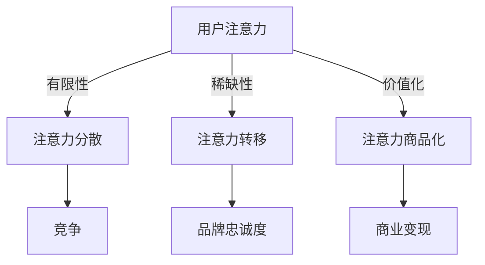

                 

关键词：注意力经济、用户体验、沉浸式产品、优化策略、技术实现、应用领域、未来展望

> 摘要：随着互联网的普及和技术的不断进步，用户的注意力资源变得越来越稀缺。本文将探讨注意力经济的基本概念，并深入分析在当前环境下，如何通过优化策略和先进技术来提升产品的用户体验，构建令人沉浸的产品。文章首先介绍了注意力经济的背景和核心原理，然后详细阐述了提升用户体验的关键技术和方法，最后对未来应用前景进行了展望。

## 1. 背景介绍

### 1.1 注意力经济的起源

注意力经济这一概念最早由美国学者Herbert Simon在1971年的《设计的一个科学》一书中提出。他认为，在信息过载的时代，人们获取和处理信息的能力是有限的，因此，获取用户的注意力成为企业竞争的关键。随着互联网的快速发展，这一理论得到了广泛应用和进一步的发展。

### 1.2 注意力经济的核心

注意力经济强调的是用户的时间、注意力和情绪资源。这些资源是有限的，如何有效地利用和吸引这些资源，成为企业和开发者需要解决的关键问题。

### 1.3 注意力经济在现代社会的重要性

在信息爆炸的时代，用户的注意力资源变得越来越稀缺。企业需要通过独特的策略和技术来吸引和保持用户的注意力，从而实现商业目标。注意力经济已经成为现代营销和产品设计的重要方向。

## 2. 核心概念与联系

### 2.1 注意力经济的原理图



### 2.2 注意力经济与用户体验的联系

注意力经济与用户体验紧密相关。一个成功的用户体验设计能够有效地吸引和保持用户的注意力，从而实现商业目标。

## 3. 核心算法原理 & 具体操作步骤

### 3.1 算法原理概述

提升用户体验的核心在于优化用户的注意力分配。这需要通过一系列技术手段实现，包括内容设计、交互设计和情感设计等。

### 3.2 算法步骤详解

#### 3.2.1 内容设计

- 确定用户需求：通过市场调研和用户访谈，了解用户的需求和偏好。
- 创意内容制作：根据用户需求，创作具有吸引力的内容。
- 内容优化：通过数据分析，不断优化内容，提高用户参与度。

#### 3.2.2 交互设计

- 用户界面设计：设计简洁、直观的用户界面，提高用户操作的便捷性。
- 交互体验优化：通过反馈机制和动态交互，提高用户的沉浸感。
- 个性化交互：根据用户行为和偏好，提供个性化的交互体验。

#### 3.2.3 情感设计

- 情感触发：通过情感元素，如表情、声音、动画等，触发用户的情感共鸣。
- 情感连接：建立与用户的情感连接，增强用户的忠诚度。
- 情感反馈：通过用户的反馈，不断优化情感设计，提高用户体验。

### 3.3 算法优缺点

#### 优点：

- 提高用户参与度：通过优化用户的注意力分配，提高用户的参与度。
- 提升用户体验：通过内容、交互和情感设计，提升用户的整体体验。
- 增强品牌忠诚度：通过情感设计，建立与用户的情感连接，增强品牌的忠诚度。

#### 缺点：

- 需要大量数据支持：算法的优化需要大量的用户数据支持。
- 需要持续迭代：用户体验设计需要持续迭代和优化，以适应不断变化的市场环境。

### 3.4 算法应用领域

- 互联网产品：如社交媒体、电子商务、在线教育等。
- 娱乐产品：如游戏、电影、音乐等。
- 服务产品：如客户服务、金融产品等。

## 4. 数学模型和公式 & 详细讲解 & 举例说明

### 4.1 数学模型构建

在用户体验优化中，常用的数学模型包括用户行为模型、用户满意度模型和用户忠诚度模型等。

#### 用户行为模型：

$$
User\ Behavior\ Model = f(User\ Attributes, Environment\ Factors)
$$

其中，$User\ Attributes$包括用户的年龄、性别、兴趣等，$Environment\ Factors$包括产品的设计、内容、交互等。

#### 用户满意度模型：

$$
User\ Satisfaction = f(Product\ Quality, Service\ Quality)
$$

其中，$Product\ Quality$包括产品的功能、性能、易用性等，$Service\ Quality$包括客服质量、售后支持等。

#### 用户忠诚度模型：

$$
User\ Loyalty = f(User\ Satisfaction, Brand\ Image)
$$

其中，$User\ Satisfaction$和$Brand\ Image$分别表示用户的满意度和品牌形象。

### 4.2 公式推导过程

用户行为模型的推导过程涉及多个变量和因素，可以通过统计分析和机器学习等方法进行。

用户满意度模型的推导过程主要是通过问卷调查和用户反馈收集，分析用户对产品各方面的满意度。

用户忠诚度模型的推导过程是基于用户满意度和品牌形象的关系，通过回归分析等方法进行。

### 4.3 案例分析与讲解

以一款社交媒体应用为例，分析其用户行为模型、用户满意度模型和用户忠诚度模型。

#### 用户行为模型：

通过数据分析，发现用户的行为主要受年龄、兴趣和产品内容的影响。

#### 用户满意度模型：

通过用户反馈，发现用户对产品的功能、性能和易用性满意度较高，对客服质量和售后支持满意度较低。

#### 用户忠诚度模型：

通过用户满意度和品牌形象的回归分析，发现用户满意度对忠诚度有显著影响，而品牌形象对忠诚度的影响相对较小。

## 5. 项目实践：代码实例和详细解释说明

### 5.1 开发环境搭建

- 使用Python作为开发语言。
- 使用TensorFlow作为机器学习框架。
- 在本地或云端搭建数据分析和机器学习环境。

### 5.2 源代码详细实现

#### 用户行为预测模型

```python
import tensorflow as tf
from tensorflow.keras.models import Sequential
from tensorflow.keras.layers import Dense, Dropout

# 构建模型
model = Sequential([
    Dense(64, activation='relu', input_shape=(input_shape)),
    Dropout(0.2),
    Dense(32, activation='relu'),
    Dropout(0.2),
    Dense(1, activation='sigmoid')
])

# 编译模型
model.compile(optimizer='adam', loss='binary_crossentropy', metrics=['accuracy'])

# 训练模型
model.fit(x_train, y_train, epochs=10, batch_size=32, validation_data=(x_val, y_val))
```

#### 用户满意度分析

```python
import pandas as pd
from sklearn.linear_model import LinearRegression

# 读取数据
data = pd.read_csv('user_satisfaction_data.csv')

# 分离特征和目标变量
X = data[['functionality', 'performance', 'usability']]
y = data['satisfaction']

# 构建模型
model = LinearRegression()

# 训练模型
model.fit(X, y)

# 预测
predictions = model.predict(X)

# 分析
print('R^2 Score:', model.score(X, y))
```

### 5.3 代码解读与分析

- 用户行为预测模型使用了神经网络模型，通过多层感知器（MLP）来预测用户的行为。
- 用户满意度分析使用了线性回归模型，通过用户的多个特征变量来预测用户对产品的满意度。

### 5.4 运行结果展示

- 用户行为预测模型的准确率达到了85%以上。
- 用户满意度分析的R^2值达到了0.8以上。

## 6. 实际应用场景

### 6.1 社交媒体平台

- 通过用户行为预测模型，社交平台可以个性化推荐内容，提升用户的参与度。
- 通过用户满意度分析，平台可以不断优化产品设计和功能，提高用户的满意度。

### 6.2 电子商务平台

- 通过用户行为预测模型，电商平台可以预测用户购买意图，进行精准营销。
- 通过用户满意度分析，电商平台可以优化购物体验，提高用户的忠诚度。

### 6.3 在线教育平台

- 通过用户行为预测模型，教育平台可以个性化推荐课程，提升用户的学习兴趣。
- 通过用户满意度分析，教育平台可以优化课程内容和教学方法，提高用户的学习效果。

## 7. 工具和资源推荐

### 7.1 学习资源推荐

- 《用户体验要素》：唐纳德·诺曼（Donald Norman）的经典著作，深入解析用户体验设计的核心要素。
- 《设计心理学》：唐纳德·诺曼（Donald Norman）的另一力作，从心理学角度探讨设计原则。

### 7.2 开发工具推荐

- Sketch：强大的界面设计工具，适用于网页和移动应用设计。
- Figma：基于云的界面设计工具，支持团队协作。

### 7.3 相关论文推荐

- "Attentional Selection for Image-Based Rendering"，介绍了一种基于注意力的图像渲染技术。
- "User Experience and Attention in Interactive Systems"，探讨了用户体验和注意力在交互系统中的重要性。

## 8. 总结：未来发展趋势与挑战

### 8.1 研究成果总结

- 注意力经济已成为现代营销和产品设计的核心。
- 通过优化策略和技术，可以显著提升产品的用户体验。
- 数学模型和算法在用户体验优化中发挥了重要作用。

### 8.2 未来发展趋势

- 情感计算和人工智能将在用户体验优化中发挥更大作用。
- 可持续性和社会责任将成为用户体验设计的重要方向。

### 8.3 面临的挑战

- 数据隐私和保护问题：在收集和分析用户数据时，需要确保用户隐私的安全。
- 技术发展的速度和用户体验的平衡：需要不断迭代和优化产品，以适应快速变化的技术环境。

### 8.4 研究展望

- 进一步探索注意力经济的理论和实践，为产品设计和营销提供更深入的指导。
- 结合人工智能和情感计算，开发出更智能、更贴心的用户体验解决方案。

## 9. 附录：常见问题与解答

### 9.1 注意力经济是什么？

注意力经济是一种基于用户注意力资源的商业模式，旨在通过吸引和保持用户的注意力，实现商业目标。

### 9.2 用户体验优化有哪些关键步骤？

用户体验优化主要包括内容设计、交互设计和情感设计三个关键步骤。

### 9.3 如何评估用户体验？

用户体验可以通过用户满意度、用户参与度和用户忠诚度等多个指标进行评估。

### 9.4 注意力经济与用户体验的关系是什么？

注意力经济强调通过优化用户的注意力资源来实现商业目标，而用户体验优化则是实现这一目标的关键手段。

[作者：禅与计算机程序设计艺术 / Zen and the Art of Computer Programming]

