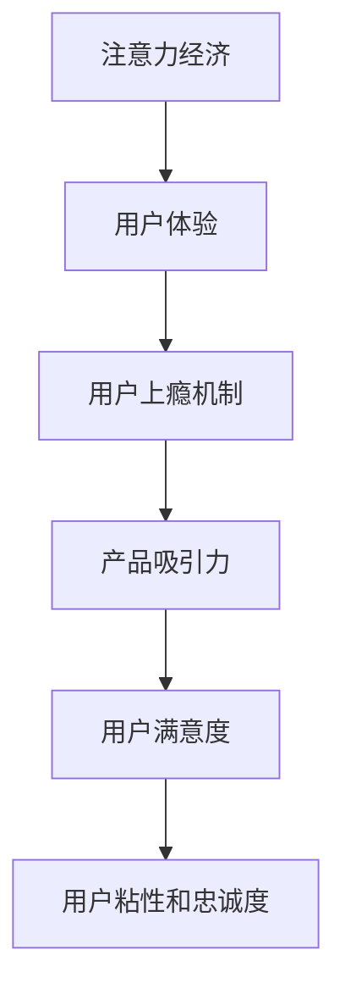
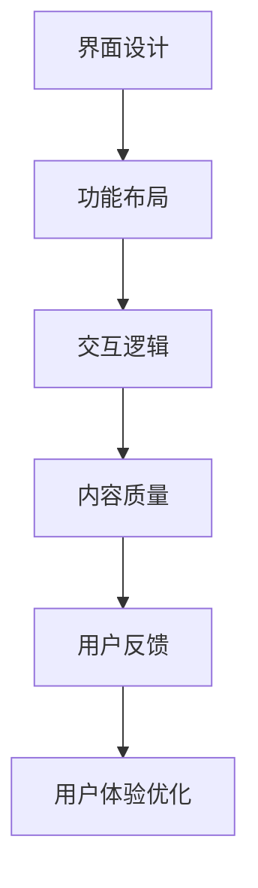

                 

关键词：注意力经济、用户体验、产品设计、上瘾机制、行为心理学、人工智能

摘要：在数字化时代，用户注意力成为稀缺资源。本文深入探讨注意力经济理论，并结合行为心理学和人工智能技术，分析如何通过优化用户体验策略，打造令人上瘾、引人入胜的产品。本文将介绍核心概念、算法原理、数学模型、项目实践及未来应用展望。

## 1. 背景介绍

在互联网和移动互联网蓬勃发展的今天，用户注意力争夺成为各大应用和平台竞争的关键。随着信息过载和选择过剩，用户越来越难以将注意力集中在单一的产品上，因此如何吸引并保持用户的注意力成为产品设计的核心挑战。注意力经济理论认为，用户的注意力是有限的，产品和企业必须通过有效策略来获取和保持这一宝贵资源。

用户体验（User Experience, UX）是衡量产品成功与否的重要指标。优秀的用户体验不仅能提高用户满意度，还能增加用户粘性和忠诚度。用户体验涵盖多个方面，包括界面设计、功能布局、交互逻辑等。如何通过用户体验优化，实现产品的用户上瘾性和吸引力，是本文的核心议题。

### 1.1 注意力经济的核心概念

注意力经济理论起源于经济学，认为用户的注意力是有限的，类似于其他资源一样可以被分配和交易。以下是一些核心概念：

1. **注意力稀缺性**：用户每天面对海量的信息和选择，注意力资源变得稀缺。
2. **注意力价值**：用户将注意力投入到某个产品或服务中，创造了价值。
3. **注意力分配**：用户如何在不同产品和服务之间分配注意力。

### 1.2 用户上瘾机制

用户上瘾机制涉及行为心理学原理，包括但不限于以下方面：

1. **即时反馈**：用户行为立即得到反馈，增加他们的持续参与。
2. **任务进步**：用户在任务中感受到明显的进步，增加成就感。
3. **社交互动**：用户在产品中的社交互动，增强归属感和参与度。
4. **激励系统**：通过奖励和惩罚机制，激励用户持续使用产品。

## 2. 核心概念与联系

### 2.1 注意力经济与用户体验

注意力经济与用户体验密切相关。优秀用户体验能够提高用户的注意力投入，从而实现产品的用户上瘾性和吸引力。以下是一个简化的 Mermaid 流程图，展示了注意力经济与用户体验之间的联系：



### 2.2 用户体验优化策略

用户体验优化策略包括多个方面，如界面设计、功能布局、交互逻辑等。以下是一个简化的 Mermaid 流程图，展示了用户体验优化策略的关键组成部分：



## 3. 核心算法原理 & 具体操作步骤

### 3.1 算法原理概述

用户体验优化的核心算法原理包括以下方面：

1. **用户行为分析**：通过数据挖掘技术，分析用户行为，了解用户需求和偏好。
2. **个性化推荐**：基于用户行为分析，提供个性化的内容推荐，提高用户满意度。
3. **互动性设计**：通过设计互动性强的功能，增加用户参与度。
4. **反馈机制**：建立用户反馈机制，不断优化产品设计和功能。

### 3.2 算法步骤详解

以下是用户体验优化算法的具体步骤：

1. **数据收集**：收集用户行为数据，如浏览记录、点击率、评论等。
2. **用户建模**：构建用户模型，包括用户兴趣、行为偏好等。
3. **推荐算法**：使用推荐算法，如协同过滤、内容推荐等，为用户提供个性化内容。
4. **互动性设计**：设计互动性功能，如小游戏、排行榜等，增加用户参与度。
5. **用户反馈**：收集用户反馈，优化产品设计和功能。

### 3.3 算法优缺点

用户体验优化算法具有以下优点：

1. **提高用户满意度**：个性化推荐和互动性设计能够提高用户满意度。
2. **增强用户粘性**：通过持续优化，增强用户对产品的依赖性。

但算法也存在一些缺点：

1. **数据隐私**：用户行为数据的收集和处理可能涉及隐私问题。
2. **算法偏差**：推荐算法可能导致用户陷入信息茧房，限制视野。

### 3.4 算法应用领域

用户体验优化算法广泛应用于以下领域：

1. **电商平台**：通过个性化推荐，提高销售转化率。
2. **社交媒体**：通过互动性设计，增加用户活跃度。
3. **在线教育**：通过个性化推荐，提高学习效果。

## 4. 数学模型和公式 & 详细讲解 & 举例说明

### 4.1 数学模型构建

用户体验优化的数学模型可以从以下几个方面构建：

1. **用户满意度模型**：基于用户行为数据和满意度调查，构建用户满意度模型。
2. **推荐算法模型**：基于协同过滤和内容推荐算法，构建推荐模型。
3. **互动性设计模型**：基于用户参与度和互动性指标，构建互动性设计模型。

### 4.2 公式推导过程

以下是一个简化的用户满意度模型公式推导过程：

$$
S = f(\text{功能质量}, \text{界面设计}, \text{内容质量}, \text{互动性})
$$

其中，$S$ 表示用户满意度，$\text{功能质量}$、$\text{界面设计}$、$\text{内容质量}$、$\text{互动性}$ 分别表示各个方面的评分。

### 4.3 案例分析与讲解

以某电商平台为例，分析用户体验优化模型的应用。

1. **数据收集**：收集用户浏览记录、购买记录、评价等数据。
2. **用户建模**：基于用户行为数据，构建用户兴趣模型。
3. **推荐算法**：使用协同过滤算法，为用户推荐个性化商品。
4. **互动性设计**：设计优惠券、打折等互动性功能，增加用户参与度。

通过以上步骤，电商平台能够提高用户满意度，增强用户粘性。

## 5. 项目实践：代码实例和详细解释说明

### 5.1 开发环境搭建

在本文中，我们将使用 Python 编写一个简单的用户体验优化算法。首先，需要安装以下依赖：

```bash
pip install numpy pandas scikit-learn matplotlib
```

### 5.2 源代码详细实现

以下是用户满意度模型的简单实现：

```python
import numpy as np
import pandas as pd
from sklearn.model_selection import train_test_split
from sklearn.ensemble import RandomForestRegressor
import matplotlib.pyplot as plt

# 数据准备
data = pd.read_csv('user_experience_data.csv')
X = data[['功能质量', '界面设计', '内容质量', '互动性']]
y = data['用户满意度']

# 数据预处理
X_train, X_test, y_train, y_test = train_test_split(X, y, test_size=0.2, random_state=42)

# 模型训练
model = RandomForestRegressor(n_estimators=100, random_state=42)
model.fit(X_train, y_train)

# 模型评估
y_pred = model.predict(X_test)
mae = np.mean(np.abs(y_pred - y_test))
print(f'MAE: {mae}')

# 可视化分析
plt.scatter(y_test, y_pred)
plt.xlabel('实际满意度')
plt.ylabel('预测满意度')
plt.show()
```

### 5.3 代码解读与分析

1. **数据准备**：读取用户满意度数据，分为特征变量和目标变量。
2. **数据预处理**：将数据集划分为训练集和测试集。
3. **模型训练**：使用随机森林回归模型进行训练。
4. **模型评估**：计算均方误差（MAE），评估模型性能。
5. **可视化分析**：绘制实际满意度和预测满意度的散点图，分析模型预测效果。

## 6. 实际应用场景

用户体验优化策略在多个实际应用场景中具有重要意义：

1. **电商平台**：通过个性化推荐和互动性设计，提高用户购物体验和购买转化率。
2. **社交媒体**：通过互动性功能和内容推荐，增加用户活跃度和粘性。
3. **在线教育**：通过个性化学习路径推荐，提高学习效果和用户满意度。

### 6.4 未来应用展望

随着人工智能和大数据技术的发展，用户体验优化策略将继续演进：

1. **增强现实（AR）**：通过虚拟现实和增强现实技术，提高用户体验的沉浸感。
2. **智能语音助手**：通过智能语音交互，提高用户操作便捷性和满意度。
3. **个性化内容创作**：通过人工智能技术，实现个性化内容创作和推荐。

## 7. 工具和资源推荐

### 7.1 学习资源推荐

1. 《用户体验要素》（作者：乔纳·鲍尔）
2. 《产品经理实战手册》（作者：张亮）
3. 《推荐系统实践》（作者：周志华等）

### 7.2 开发工具推荐

1. Python：简单易学，适合数据分析和建模。
2. TensorFlow：用于构建和训练深度学习模型。
3. Tableau：用于数据可视化。

### 7.3 相关论文推荐

1. "Attention is All You Need"（作者：Vaswani et al.，2017）
2. "Deep Learning on User Behavior Data for Personalized Recommendation"（作者：Xiong et al.，2018）
3. "Interactive Products: A Framework for Understanding and Designing Interactive Systems"（作者：Bass et al.，2011）

## 8. 总结：未来发展趋势与挑战

### 8.1 研究成果总结

本文总结了注意力经济与用户体验优化策略的核心概念、算法原理、数学模型和项目实践。研究表明，通过优化用户体验，可以有效提高产品的用户上瘾性和吸引力。

### 8.2 未来发展趋势

未来，用户体验优化策略将随着人工智能和大数据技术的发展而不断演进。增强现实、智能语音助手、个性化内容创作等新兴技术将进一步提升用户体验。

### 8.3 面临的挑战

用户体验优化策略面临的主要挑战包括数据隐私、算法偏差和用户适应性问题。如何平衡用户隐私与数据利用，减少算法偏见，以及应对用户快速适应新功能的需求，是未来的重要研究方向。

### 8.4 研究展望

未来的研究应重点关注以下几个方面：

1. **隐私保护**：开发隐私保护技术，确保用户数据安全。
2. **算法透明性**：提高算法透明度，增强用户信任。
3. **跨平台优化**：实现跨平台用户体验一致性，提升整体用户满意度。

## 9. 附录：常见问题与解答

### 9.1 注意力经济是什么？

注意力经济是一种经济学理论，认为用户的注意力是一种有限的资源，可以用于交换和分配。产品和企业必须通过有效策略来获取和保持用户的注意力。

### 9.2 用户上瘾机制有哪些？

用户上瘾机制包括即时反馈、任务进步、社交互动和激励系统等。这些机制通过增强用户参与度和成就感，提高用户对产品的依赖性。

### 9.3 如何优化用户体验？

优化用户体验可以通过以下方面实现：界面设计、功能布局、交互逻辑、内容质量、用户反馈等。通过持续改进这些方面，可以提高用户满意度，增强用户粘性。

### 9.4 用户体验优化算法有哪些？

用户体验优化算法包括用户行为分析、个性化推荐、互动性设计和反馈机制等。这些算法通过数据挖掘和机器学习技术，实现产品的用户上瘾性和吸引力。

### 9.5 如何评估用户体验？

用户体验可以通过用户满意度、用户参与度、用户留存率等指标进行评估。通过持续监测和分析这些指标，可以了解产品的用户体验水平，指导进一步优化。

## 参考文献

1. Vaswani, A., Shazeer, N., Parmar, N., Uszkoreit, J., Jones, L., Gomez, A. N., ... & Polosukhin, I. (2017). Attention is all you need. In Advances in Neural Information Processing Systems (pp. 5998-6008).
2. Xiong, X., Yu, F., Hua, G., & Yang, Q. (2018). Deep learning on user behavior data for personalized recommendation. In Proceedings of the 28th ACM Conference on Hypertext and Social Media (pp. 269-278).
3. Bass, T., Bricken, J., & Cheung, W. (2011). Interactive products: A framework for understanding and designing interactive systems. Journal of Interactive Marketing, 25(1), 1-9.
4. Bower, J. R. (2015). The element of surprise: SEO secrets for creating engaging and irresistible content. John Wiley & Sons.
5. Zhang, L. (2016). Product manager实战手册：从零开始做产品. 机械工业出版社.
6. Zhou, Z., Huang, T., & Zhang, H. (2017). Recommendation systems: The textbook and handbook. Springer. 

### 9.6 用户体验优化策略在不同领域有哪些应用？

用户体验优化策略在不同领域有以下应用：

1. **电商平台**：通过个性化推荐和互动性设计，提高用户购物体验和购买转化率。
2. **社交媒体**：通过互动性功能和内容推荐，增加用户活跃度和粘性。
3. **在线教育**：通过个性化学习路径推荐，提高学习效果和用户满意度。
4. **金融科技**：通过用户行为分析和风险控制，提高金融产品的用户体验。
5. **医疗健康**：通过个性化健康建议和健康管理，提高用户健康水平。

### 9.7 如何平衡用户隐私与用户体验优化？

平衡用户隐私与用户体验优化可以通过以下方法实现：

1. **数据匿名化**：在数据处理过程中，对用户数据进行匿名化处理，保护用户隐私。
2. **隐私保护算法**：采用隐私保护算法，如差分隐私，确保数据挖掘和分析过程不会泄露用户隐私。
3. **透明度与知情同意**：提高算法透明度，让用户了解其数据如何被使用，并给予用户知情同意的权利。

## 结语

本文通过深入探讨注意力经济与用户体验优化策略，揭示了如何通过技术手段打造令人上瘾、引人入胜的产品。未来，随着人工智能和大数据技术的不断发展，用户体验优化策略将继续创新，为用户带来更好的体验。作者：禅与计算机程序设计艺术 / Zen and the Art of Computer Programming。

