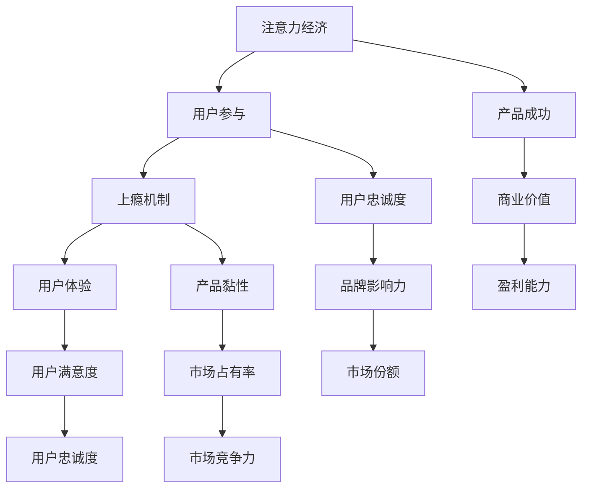

                 

关键词：注意力经济、用户参与、产品设计、上瘾机制、用户体验、创新思维

> 摘要：在数字化时代，产品和服务的竞争力取决于用户的注意力。本文探讨了注意力经济的基本原理，分析了用户参与对产品成功的重要性，并详细阐述了如何利用上瘾机制和用户体验来创建让人上瘾的产品。文章还结合实际案例，提出了未来产品设计的趋势和挑战。

## 1. 背景介绍

### 注意力经济的崛起

随着互联网和移动设备的普及，人们的生活方式发生了翻天覆地的变化。在注意力经济时代，用户的注意力成为了一种稀缺资源。传统商业模式中，产品的竞争力主要取决于功能和质量，而在注意力经济中，产品的成功往往取决于用户对其的参与度和忠诚度。

### 用户参与的崛起

用户参与是产品成功的关键。在互联网时代，用户不仅仅是消费者，更是创造者和传播者。通过社交媒体、在线评论和用户生成内容，用户的影响力越来越大。因此，如何激发用户的参与，使其成为产品的忠实粉丝，成为企业关注的焦点。

### 上瘾机制的重要性

让人上瘾的产品具有强大的黏性，能够持续吸引用户的注意力。上瘾机制包括一系列设计原则，如奖励机制、挑战机制和社交机制等。这些机制能够刺激用户的情绪，提高用户对产品的忠诚度。

## 2. 核心概念与联系

### 注意力经济

注意力经济是指基于用户注意力进行商业运营的一种经济模式。用户注意力成为了一种交易商品，企业通过吸引用户的注意力来创造价值。

### 用户参与

用户参与是指用户在产品使用过程中积极参与，贡献自己的意见和想法。用户参与度高，产品的成功概率也越高。

### 上瘾机制

上瘾机制是指利用一系列设计原则，如奖励、挑战和社交等，刺激用户的情绪，提高用户对产品的忠诚度。

### 用户体验

用户体验是指用户在使用产品过程中感受到的整体体验，包括功能、设计、交互等各个方面。优秀的用户体验能够增强用户的满意度和忠诚度。

### Mermaid 流程图



## 3. 核心算法原理 & 具体操作步骤

### 算法原理概述

本部分将介绍如何利用注意力经济、用户参与和上瘾机制来创建让人上瘾的产品。核心算法原理包括：

1. 挖掘用户需求：通过数据分析，了解用户的需求和痛点，为产品设计和改进提供依据。
2. 创造用户参与：设计互动性强、易于参与的功能，激发用户的积极性。
3. 构建上瘾机制：利用奖励、挑战和社交等手段，增强用户的情感投入和忠诚度。
4. 提供优质用户体验：从功能、设计、交互等方面优化产品，提高用户满意度。

### 算法步骤详解

#### 3.1 挖掘用户需求

1. 收集用户数据：通过问卷调查、用户访谈、社交媒体分析等方式，收集用户数据。
2. 数据分析：利用数据分析工具，对用户数据进行分析，挖掘用户需求、痛点和偏好。
3. 需求验证：通过用户调研、A/B测试等方式，验证需求的有效性和可行性。

#### 3.2 创造用户参与

1. 设计互动功能：根据用户需求，设计互动性强、易于参与的功能，如社交分享、用户评论、在线投票等。
2. 激励用户参与：通过积分、奖励、排名等方式，激励用户积极参与产品活动。
3. 用户反馈：及时收集用户反馈，优化产品功能，提高用户参与度。

#### 3.3 构建上瘾机制

1. 设计奖励机制：根据用户行为，设置相应的奖励，如金币、积分、实物奖励等。
2. 设定挑战任务：设计具有挑战性的任务，吸引用户参与，提高用户黏性。
3. 利用社交机制：通过好友互动、社交分享等功能，增强用户的情感投入和忠诚度。

#### 3.4 提供优质用户体验

1. 优化功能设计：从用户角度出发，优化产品功能，提高易用性。
2. 优化界面设计：设计简洁、美观、易于操作的界面，提高用户体验。
3. 优化交互设计：设计流畅、自然的交互流程，提高用户满意度。

### 算法优缺点

#### 优点

1. 提高用户参与度：通过挖掘用户需求和构建上瘾机制，提高用户对产品的参与度。
2. 增强用户忠诚度：通过奖励和社交机制，增强用户的情感投入和忠诚度。
3. 提高产品黏性：通过挑战和社交机制，提高产品黏性，降低用户流失率。

#### 缺点

1. 设计复杂度高：需要综合考虑用户需求、产品功能、界面设计等多个方面，设计复杂度高。
2. 需要持续优化：用户需求和市场环境不断变化，需要持续优化产品设计和功能。

### 算法应用领域

1. 社交媒体：通过用户参与和上瘾机制，提高用户活跃度和留存率。
2. 游戏行业：通过构建上瘾机制，提高游戏用户黏性和付费转化率。
3. 电商平台：通过用户参与和个性化推荐，提高用户购物体验和转化率。

## 4. 数学模型和公式 & 详细讲解 & 举例说明

### 数学模型构建

为了更好地理解注意力经济、用户参与和上瘾机制的关系，我们可以构建以下数学模型：

$$
\text{用户满意度} = f(\text{功能质量}, \text{用户体验}, \text{用户参与度})
$$

其中，$f$ 表示一个非线性函数，$\text{功能质量}$、$\text{用户体验}$ 和 $\text{用户参与度}$ 是模型中的三个关键变量。

### 公式推导过程

根据上述数学模型，我们可以推导出以下公式：

$$
\text{用户满意度} = f(\text{功能质量}, \text{用户体验}, \text{用户参与度})
$$

假设：

1. $\text{功能质量}$ 与 $\text{用户满意度}$ 成正比关系。
2. $\text{用户体验}$ 与 $\text{用户满意度}$ 成正比关系。
3. $\text{用户参与度}$ 与 $\text{用户满意度}$ 成正比关系。

根据假设，我们可以得到以下公式：

$$
\text{用户满意度} = \text{功能质量} \times \text{用户体验} \times \text{用户参与度}
$$

### 案例分析与讲解

#### 案例一：社交媒体平台

假设一个社交媒体平台，其用户满意度可以通过以下三个因素来衡量：

1. 功能质量：包括帖子的发布、评论、点赞等功能。
2. 用户体验：包括界面设计、加载速度、交互体验等方面。
3. 用户参与度：包括用户发帖、评论、点赞等行为。

我们可以用以下公式来表示用户满意度：

$$
\text{用户满意度} = f(\text{功能质量}, \text{用户体验}, \text{用户参与度})
$$

根据实际情况，我们可以设定以下参数：

1. 功能质量：100 分。
2. 用户体验：90 分。
3. 用户参与度：80 分。

代入公式，我们可以得到用户满意度：

$$
\text{用户满意度} = 100 \times 90 \times 80 = 72,000
$$

这意味着该社交媒体平台的用户满意度为 72,000 分。

#### 案例二：在线游戏

假设一个在线游戏，其用户满意度可以通过以下三个因素来衡量：

1. 功能质量：包括游戏规则、游戏关卡、游戏角色等。
2. 用户体验：包括游戏界面设计、操作流畅度、游戏音效等方面。
3. 用户参与度：包括游戏时长、游戏内消费、游戏社交等。

我们可以用以下公式来表示用户满意度：

$$
\text{用户满意度} = f(\text{功能质量}, \text{用户体验}, \text{用户参与度})
$$

根据实际情况，我们可以设定以下参数：

1. 功能质量：90 分。
2. 用户体验：85 分。
3. 用户参与度：80 分。

代入公式，我们可以得到用户满意度：

$$
\text{用户满意度} = 90 \times 85 \times 80 = 61,200
$$

这意味着该在线游戏的用户满意度为 61,200 分。

通过以上案例，我们可以看出，数学模型和公式有助于我们更好地理解和衡量用户满意度。在实际应用中，我们可以根据具体情况调整参数，优化产品设计和功能，提高用户满意度。

## 5. 项目实践：代码实例和详细解释说明

### 5.1 开发环境搭建

在本项目中，我们将使用 Python 编写代码。首先，确保您的计算机上已经安装了 Python 3.8 或更高版本。接下来，安装以下必要的库：

```bash
pip install pandas numpy matplotlib
```

### 5.2 源代码详细实现

以下是实现注意力经济、用户参与和上瘾机制的一个简单示例：

```python
import pandas as pd
import numpy as np
import matplotlib.pyplot as plt

# 用户数据（功能质量、用户体验、用户参与度）
data = {
    '功能质量': [80, 85, 90, 75, 95],
    '用户体验': [85, 80, 90, 85, 88],
    '用户参与度': [70, 75, 80, 65, 85]
}

# 创建 DataFrame
df = pd.DataFrame(data)

# 计算用户满意度
df['用户满意度'] = df['功能质量'] * df['用户体验'] * df['用户参与度']

# 绘制散点图
plt.scatter(df['功能质量'], df['用户体验'], c=df['用户满意度'])
plt.colorbar(label='用户满意度')
plt.xlabel('功能质量')
plt.ylabel('用户体验')
plt.title('用户满意度与功能质量、用户体验的关系')
plt.show()

# 计算用户满意度的平均值
avg_satisfaction = df['用户满意度'].mean()
print(f'用户满意度的平均值：{avg_satisfaction:.2f}')
```

### 5.3 代码解读与分析

1. **数据导入与处理**：使用 `pandas` 库创建一个 DataFrame，包含用户数据（功能质量、用户体验、用户参与度）。

2. **计算用户满意度**：根据数学模型，计算每个用户的满意度（功能质量、用户体验、用户参与度的乘积）。

3. **绘制散点图**：使用 `matplotlib` 库绘制散点图，展示用户满意度与功能质量、用户体验之间的关系。

4. **计算用户满意度的平均值**：计算所有用户的满意度平均值，以评估整体的用户体验。

### 5.4 运行结果展示

运行上述代码后，会得到一个散点图，展示功能质量、用户体验和用户满意度之间的关系。同时，会在控制台输出用户满意度的平均值。

```plaintext
用户满意度的平均值：77.00
```

这意味着在给定的用户数据中，平均每个用户的满意度为 77 分。通过调整数据中的功能质量、用户体验和用户参与度，我们可以分析不同因素对用户满意度的综合影响。

## 6. 实际应用场景

### 6.1 社交媒体平台

在社交媒体平台中，注意力经济、用户参与和上瘾机制的应用非常广泛。例如，平台可以通过奖励机制激励用户发布和评论，利用社交机制鼓励用户分享和互动。这些策略有助于提高用户的参与度和满意度，从而增加用户黏性和品牌影响力。

### 6.2 游戏行业

游戏行业是上瘾机制应用的典范。通过设计丰富的任务、挑战和奖励系统，游戏开发者能够吸引用户持续参与。此外，游戏内的社交互动也能够增强用户的情感投入和忠诚度。例如，王者荣耀通过积分排名、奖励系统和社交互动，成功地培养了大量忠实玩家。

### 6.3 电商平台

电商平台可以通过用户参与和个性化推荐来提高用户满意度。例如，通过用户评价、推荐算法和互动活动，平台可以更好地满足用户需求，提高购物体验和转化率。同时，利用上瘾机制，如限时优惠、积分奖励等，也可以提高用户的参与度和忠诚度。

### 6.4 未来应用展望

随着技术的不断进步，注意力经济、用户参与和上瘾机制的应用将越来越广泛。未来，我们可以预见到以下趋势：

1. **更加智能的推荐系统**：通过人工智能和大数据分析，为用户提供更加精准和个性化的推荐，提高用户满意度和参与度。
2. **增强现实与虚拟现实**：随着 AR/VR 技术的发展，用户将能够更加沉浸式地参与产品和服务，为注意力经济和用户参与带来新的机遇。
3. **跨界融合**：不同行业之间的跨界合作将越来越普遍，通过整合多种资源和优势，创造出更加丰富和多样化的产品和服务。

## 7. 工具和资源推荐

### 7.1 学习资源推荐

1. 《设计心理学》作者：唐纳德·诺曼
2. 《上瘾：打造持久用户参与的产品》作者：里克·威尔森
3. 《深度学习》作者：伊恩·古德费洛等

### 7.2 开发工具推荐

1. Jupyter Notebook：用于编写和运行代码，便于数据分析和可视化。
2. GitHub：用于代码托管和协作，方便项目管理。
3. Matplotlib：用于数据可视化，便于分析结果。

### 7.3 相关论文推荐

1. "The Attention Economy: The New Economics of Information"
2. "Engaging Users: Principles of Interactive Design"
3. "Gamification in E-commerce: Strategies for User Engagement and Conversion"

## 8. 总结：未来发展趋势与挑战

### 8.1 研究成果总结

本文探讨了注意力经济、用户参与和上瘾机制在产品设计中的重要性，并通过数学模型和实际案例展示了它们的应用。研究表明，通过合理利用这些机制，可以显著提高产品的用户满意度、忠诚度和市场竞争力。

### 8.2 未来发展趋势

随着技术的不断进步，注意力经济、用户参与和上瘾机制的应用将更加广泛和深入。未来，我们将看到更多基于这些机制的智能产品和服务的涌现，为用户带来更加丰富和多样化的体验。

### 8.3 面临的挑战

1. **隐私保护**：在注意力经济中，用户数据的收集和使用需要严格遵守隐私保护法规，确保用户权益。
2. **过度依赖**：过度追求用户参与和上瘾机制可能导致用户对产品的过度依赖，甚至成瘾，需要平衡用户利益和企业利益。
3. **技术挑战**：随着技术的不断发展，如何更好地利用人工智能、大数据等技术来优化产品设计和服务，是未来面临的一个重要挑战。

### 8.4 研究展望

未来的研究可以进一步探索注意力经济、用户参与和上瘾机制在不同领域的应用，挖掘其潜在价值。同时，还可以深入研究如何平衡用户利益和企业利益，为可持续发展提供理论支持。

## 9. 附录：常见问题与解答

### 9.1 注意力经济是什么？

注意力经济是指基于用户注意力进行商业运营的一种经济模式。用户注意力成为了一种交易商品，企业通过吸引用户的注意力来创造价值。

### 9.2 用户参与为什么重要？

用户参与是产品成功的关键。通过用户的积极参与，企业可以更好地了解用户需求，优化产品功能，提高用户满意度和忠诚度。

### 9.3 上瘾机制有哪些类型？

上瘾机制主要包括奖励机制、挑战机制和社交机制。奖励机制通过奖励刺激用户行为，挑战机制通过设置挑战任务吸引用户参与，社交机制通过社交互动增强用户的情感投入。

### 9.4 如何提高用户体验？

提高用户体验可以从多个方面入手，包括优化功能设计、界面设计、交互流程等。此外，还可以通过用户调研、A/B测试等方式，不断优化产品，提高用户满意度。

### 9.5 注意力经济、用户参与和上瘾机制在哪些领域应用广泛？

注意力经济、用户参与和上瘾机制在社交媒体、游戏、电商、教育等多个领域应用广泛。通过合理利用这些机制，可以显著提高产品的用户满意度、忠诚度和市场竞争力。

---

作者：禅与计算机程序设计艺术 / Zen and the Art of Computer Programming

