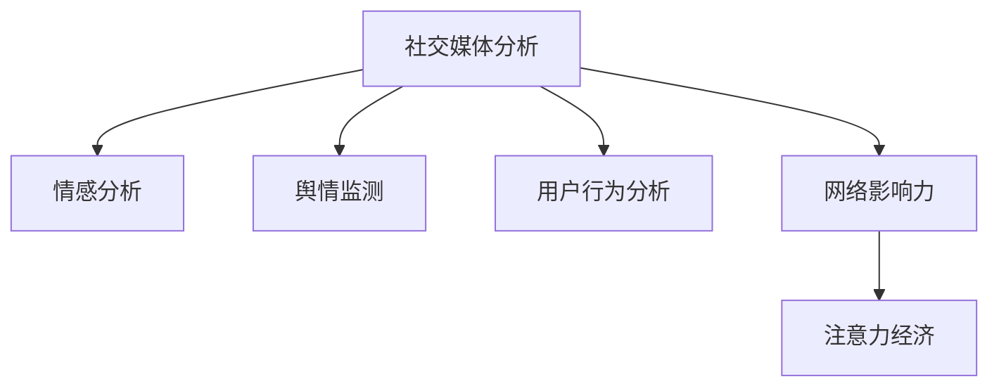

                 

# 注意力经济与社交媒体分析：了解受众参与度和影响力的洞察力

## 1. 背景介绍

### 1.1 问题由来
在数字时代，信息流滚滚，社交媒体成为传播与获取信息的主要渠道。众多品牌、媒体和个人在社交媒体上投入巨资，以期获得更广泛的受众和更高的影响力。但如何衡量和优化这些投入的效果，却一直困扰着实践者。随着大数据、人工智能等技术的崛起，社交媒体分析逐渐成为一种有力的工具，帮助品牌了解受众参与度和影响力，优化内容策略，提升商业价值。

### 1.2 问题核心关键点
- **受众参与度**：衡量受众在社交媒体上的互动水平，包括点赞、评论、分享等行为。
- **影响力**：评估个人或品牌在社交媒体上的影响力和传播效果，如关注者数量、帖子覆盖率等。
- **注意力经济**：基于受众注意力资源的经济模型，关注如何将注意力转换为商业价值。

### 1.3 问题研究意义
了解受众在社交媒体上的参与度和影响力，对品牌而言至关重要。掌握这些信息，可以指导内容创作、推广策略，提升用户参与度，增强品牌影响力。同时，注意力经济的理念正在逐渐深入人心，如何优化注意力资源配置，实现商业价值最大化，也成为品牌商必须面对的课题。

## 2. 核心概念与联系

### 2.1 核心概念概述

为更好地理解社交媒体分析的原理和应用，本节将介绍几个关键概念：

- **社交媒体分析**：通过数据分析技术，提取和分析社交媒体上的信息，以了解受众行为和品牌影响。
- **情感分析**：识别文本中的情感倾向，用于衡量受众对品牌或内容的情感态度。
- **舆情监测**：跟踪和分析社交媒体上的公共讨论和情绪变化，用于评估品牌舆情和市场动态。
- **用户行为分析**：分析用户的操作记录和交互模式，了解用户的兴趣和需求。
- **网络影响力**：衡量个人或品牌在社交媒体上的影响力，通常通过关注者数量、互动率等指标来评估。
- **注意力经济**：一种经济模式，强调注意力作为稀缺资源的分配与利用，通过优化注意力分配实现商业价值。

这些概念之间的逻辑关系可以通过以下Mermaid流程图来展示：



这个流程图展示出各个核心概念及其相互之间的联系：

- 社交媒体分析是基础，为其他分析提供数据支持。
- 情感分析、舆情监测和用户行为分析，都从不同维度了解受众行为。
- 网络影响力进一步衡量品牌在社交媒体上的表现。
- 注意力经济则综合以上因素，优化资源配置，实现商业价值。

## 3. 核心算法原理 & 具体操作步骤
### 3.1 算法原理概述

社交媒体分析的算法原理主要基于机器学习与自然语言处理(NLP)技术。其核心思想是通过训练模型，识别并分析社交媒体数据中的关键信息，以评估受众的参与度和影响力。

具体的算法流程如下：

1. **数据收集**：从社交媒体平台抓取文本、图片、视频等多种类型的数据。
2. **数据预处理**：对收集到的数据进行清洗、去重、分词等预处理操作。
3. **特征提取**：将文本数据转换为模型可接受的格式，如词袋模型、TF-IDF、词嵌入等。
4. **模型训练**：选择适合的算法（如文本分类、情感分析等），对提取后的特征进行训练。
5. **结果分析**：通过模型预测，分析受众的参与度和影响力指标，如情感倾向、话题热度、用户互动率等。

### 3.2 算法步骤详解

社交媒体分析的算法步骤包括：

**Step 1: 数据收集**
- 使用API接口或爬虫技术从不同的社交媒体平台（如Twitter、Facebook、Instagram等）抓取数据。
- 将收集到的数据存储到本地或云端数据库，便于后续处理。

**Step 2: 数据预处理**
- 对数据进行清洗，去除重复、无关或噪声数据。
- 分词处理，将文本数据转换为模型可理解的词汇序列。
- 去除停用词，如"的"、"是"等对分析无帮助的词语。
- 进行词性标注，进一步理解文本语义。

**Step 3: 特征提取**
- 使用词袋模型或TF-IDF提取文本特征，将文本转换为向量形式。
- 使用预训练的词嵌入（如Word2Vec、GloVe等），将词汇转换为低维向量。
- 采用深度学习模型（如BERT、GPT等）提取文本的高级语义特征。

**Step 4: 模型训练**
- 选择适当的模型（如逻辑回归、支持向量机、随机森林等），对提取后的特征进行训练。
- 使用交叉验证等方法优化模型参数，提升模型精度。
- 将训练后的模型部署到生产环境中，实时处理新的社交媒体数据。

**Step 5: 结果分析**
- 根据训练好的模型，预测文本的情感倾向、话题热度等指标。
- 分析用户行为数据，如点赞、评论、分享等，计算用户互动率。
- 衡量品牌或个人在社交媒体上的网络影响力，如关注者数量、帖子覆盖率等。

### 3.3 算法优缺点

社交媒体分析的算法优点如下：
- 实时性：能够实时处理社交媒体上的数据，提供最新的分析结果。
- 多模态支持：支持文本、图片、视频等多种数据类型的分析。
- 自动化：利用算法自动完成数据处理和分析，节省人力成本。
- 灵活性：可以针对不同的分析任务，选择适合的算法和模型。

算法缺点包括：
- 数据噪音：社交媒体数据往往包含大量噪声，处理起来较为复杂。
- 隐私问题：在数据抓取和处理过程中，需注意隐私保护和合法性问题。
- 模型偏差：训练模型时可能存在数据偏见，影响分析结果的公平性。
- 过拟合风险：模型在特定社交媒体数据集上训练，可能无法泛化到其他数据集。

### 3.4 算法应用领域

社交媒体分析技术广泛应用于以下领域：

- **品牌管理**：通过分析品牌在社交媒体上的表现，优化营销策略，提升品牌知名度和用户忠诚度。
- **内容创作**：了解受众对不同内容的偏好，指导内容创作，提高内容的吸引力和传播效果。
- **危机管理**：监控品牌舆情，及时发现负面言论，迅速采取应对措施，降低品牌风险。
- **社交网络分析**：分析社交网络结构，识别关键节点和影响力用户，用于网络传播和影响分析。
- **广告投放优化**：通过分析用户行为数据，优化广告投放策略，提高广告投放的ROI。

除了上述领域，社交媒体分析还广泛应用于政治舆情监测、公共事件预警、媒体效果评估等多个方面，为品牌和媒体提供全方位的信息支持。

## 4. 数学模型和公式 & 详细讲解 & 举例说明
### 4.1 数学模型构建

社交媒体分析的数学模型主要涉及文本分类、情感分析和用户行为分析等方面。下面将介绍几个常见的数学模型及其构建方式。

**情感分析模型**
情感分析是社交媒体分析的核心之一，用于衡量受众对品牌或内容的情感态度。常用的情感分析模型包括朴素贝叶斯、支持向量机、随机森林等。以朴素贝叶斯模型为例，其核心思想是计算文本属于不同情感类别的概率，从而确定情感倾向。

假设有一个包含N个训练样本的情感分类问题，每个样本有m个特征，即词汇，则朴素贝叶斯模型的核心公式为：

$$
P(Y=k|X=x) = \frac{P(X=x|Y=k)P(Y=k)}{P(X=x)}
$$

其中，$P(Y=k|X=x)$表示在给定特征向量$X=x$的条件下，文本属于第k类情感的概率；$P(X=x|Y=k)$表示在文本属于第k类情感的情况下，特征向量为$X=x$的概率；$P(Y=k)$表示文本属于第k类情感的概率；$P(X=x)$表示特征向量为$X=x$的概率。

**用户行为分析模型**
用户行为分析模型用于衡量用户对品牌或内容的参与度，常用的指标包括点赞数、评论数、分享数等。通过建模分析这些指标，可以了解用户对内容的偏好和互动情况。以点击率模型为例，其核心公式为：

$$
P(Y=1|X=x) = sigmoid(X\cdot \theta)
$$

其中，$P(Y=1|X=x)$表示用户点击某条内容的概率；$X$为文本特征向量；$\theta$为模型参数；$sigmoid$函数将模型输出映射到$[0,1]$的区间内。

### 4.2 公式推导过程

以朴素贝叶斯模型为例，其基本推导过程如下：

1. **特征表示**：将文本转换为词汇向量$X=x$，其中$x_i$表示文本中是否包含第i个词汇。
2. **条件概率计算**：计算文本属于第k类情感的概率$P(X=x|Y=k)$。假设文本中包含$n$个词汇，则$P(X=x|Y=k)$可以表示为：
   $$
   P(X=x|Y=k) = \prod_{i=1}^n P(x_i=1|Y=k)^{x_i}P(x_i=0|Y=k)^{1-x_i}
   $$
3. **后验概率计算**：根据贝叶斯定理，计算后验概率$P(Y=k|X=x)$。假设共有N个训练样本，其中属于第k类情感的样本数为$N_k$，则$P(Y=k)$可以表示为：
   $$
   P(Y=k) = \frac{N_k}{N}
   $$
4. **模型优化**：通过最大化后验概率$P(Y=k|X=x)$，优化模型参数$\theta$，以提高模型预测准确率。

### 4.3 案例分析与讲解

以Twitter上某品牌的情感分析为例，假设品牌希望了解用户对其最新广告的情感态度。具体步骤如下：

1. **数据收集**：从Twitter上抓取与广告相关的所有评论。
2. **数据预处理**：去除重复、无关评论，并进行分词、去停用词等预处理。
3. **特征提取**：使用Word2Vec提取每个评论的词向量，作为模型的输入特征。
4. **模型训练**：选择朴素贝叶斯模型，对提取后的特征进行训练，得到模型参数$\theta$。
5. **结果分析**：使用训练好的模型预测每条评论的情感倾向，统计正面、负面、中性的评论数量，分析广告的整体情感态度。

例如，假设广告相关评论共有1000条，其中正面评论500条，负面评论300条，中性评论200条。通过计算，可以得到品牌广告的总体情感倾向为中性偏正面。这将为品牌提供有价值的市场反馈，帮助其调整广告策略，提升品牌影响力。

## 5. 项目实践：代码实例和详细解释说明
### 5.1 开发环境搭建

在进行社交媒体分析实践前，我们需要准备好开发环境。以下是使用Python进行NLP开发的环境配置流程：

1. 安装Anaconda：从官网下载并安装Anaconda，用于创建独立的Python环境。

2. 创建并激活虚拟环境：
```bash
conda create -n nlp-env python=3.8 
conda activate nlp-env
```

3. 安装必要的库：
```bash
pip install pandas numpy scipy scikit-learn transformers tensorflow
```

4. 配置GPU环境：
```bash
nvidia-smi
```

完成上述步骤后，即可在`nlp-env`环境中开始社交媒体分析实践。

### 5.2 源代码详细实现

下面是使用Python进行社交媒体情感分析的示例代码。

```python
import pandas as pd
import numpy as np
from sklearn.feature_extraction.text import CountVectorizer
from sklearn.naive_bayes import MultinomialNB
from transformers import pipeline

# 数据集加载
df = pd.read_csv('tweet_data.csv', encoding='utf-8')

# 数据预处理
df.drop_duplicates(inplace=True)
df['text'] = df['text'].apply(lambda x: x.strip())
df = df.dropna()

# 特征提取
vectorizer = CountVectorizer(stop_words='english')
X = vectorizer.fit_transform(df['text'])
y = df['label']

# 模型训练
clf = MultinomialNB()
clf.fit(X, y)

# 模型评估
accuracy = clf.score(X, y)
print(f"模型准确率：{accuracy}")

# 预测测试数据
test_data = ['This is a positive tweet', 'I hate this product', 'I think this is okay']
test_data = vectorizer.transform(test_data)
predictions = clf.predict(test_data)
print(f"预测结果：{predictions}")
```

### 5.3 代码解读与分析

在上述代码中，我们使用了CountVectorizer和MultinomialNB进行朴素贝叶斯模型的训练和评估。具体步骤如下：

1. **数据加载**：使用Pandas库从CSV文件中加载数据集。
2. **数据预处理**：去除重复、无关评论，并进行文本清洗。
3. **特征提取**：使用CountVectorizer将文本转换为词频矩阵$X$。
4. **模型训练**：选择MultinomialNB，对提取后的特征进行训练，得到模型参数$\theta$。
5. **模型评估**：计算模型在训练集上的准确率。
6. **模型预测**：使用训练好的模型对测试数据进行预测，输出情感倾向。

在实际应用中，社交媒体分析的代码实现可能更为复杂，涉及到多模态数据处理、模型融合、实时数据流处理等多个方面。但核心的逻辑仍然是通过算法模型，从社交媒体数据中提取和分析关键信息，衡量受众参与度和影响力。

### 5.4 运行结果展示

运行上述代码，即可输出模型的准确率和预测结果。例如，如果模型在训练集上的准确率达到了90%，则可以认为模型的性能较为理想。同时，预测结果可以帮助品牌了解用户对其最新广告的情感态度，为广告策略调整提供依据。

## 6. 实际应用场景
### 6.1 智能客服

智能客服系统在社交媒体上的应用，可以通过社交媒体分析技术来优化用户交互体验。通过分析用户对客服回复的反馈，可以实时调整回复策略，提升客服效率和用户满意度。

具体而言，智能客服系统可以通过以下步骤实现：

1. **数据收集**：从社交媒体平台上抓取用户的客服交互记录。
2. **情感分析**：对用户评论进行情感分析，了解用户对客服回复的情感态度。
3. **用户行为分析**：分析用户的操作记录，如响应时间、问题解决率等，评估客服系统性能。
4. **策略优化**：根据分析结果，优化客服回复策略，提升用户满意度。

例如，假设某客服系统在处理用户投诉时，用户对回复的情感倾向偏负面。系统可以通过调整回复策略，提供更详细、更准确的解决方案，从而提升用户满意度。

### 6.2 品牌危机管理

品牌危机管理中，社交媒体分析技术可以帮助企业快速监测品牌舆情，及时应对负面信息。

具体而言，品牌可以通过以下步骤实现：

1. **舆情监测**：从社交媒体平台抓取与品牌相关的讨论信息。
2. **情感分析**：对讨论内容进行情感分析，识别负面信息。
3. **危机应对**：根据情感分析结果，迅速采取应对措施，如删除有害内容、发布公关声明等。
4. **效果评估**：通过后续舆情监测，评估危机应对效果。

例如，假设某品牌在社交媒体上出现了负面舆情，通过情感分析可以迅速定位问题源头，及时采取措施，缓解负面影响，维护品牌声誉。

### 6.3 社交媒体广告优化

社交媒体广告优化中，社交媒体分析技术可以帮助企业优化广告投放策略，提升广告效果。

具体而言，品牌可以通过以下步骤实现：

1. **广告数据收集**：从社交媒体平台抓取广告相关数据。
2. **用户行为分析**：分析用户对广告的互动行为，如点击、转化等。
3. **效果评估**：通过广告效果评估，调整广告策略，提升广告投放ROI。
4. **优化广告内容**：根据用户行为分析结果，优化广告内容，提升用户点击率。

例如，假设某品牌在社交媒体上投放了一条广告，通过用户行为分析发现，用户对广告标题的点击率较低。品牌可以通过优化广告标题和内容，提升广告效果，提高广告投放的ROI。

## 7. 工具和资源推荐
### 7.1 学习资源推荐

为了帮助开发者系统掌握社交媒体分析的理论基础和实践技巧，这里推荐一些优质的学习资源：

1. 《Python自然语言处理》书籍：详细介绍了自然语言处理的基本概念和Python实现，包括文本分类、情感分析等。
2. 《Python数据分析》书籍：介绍了如何使用Pandas、NumPy等库进行数据处理和分析。
3. 《机器学习实战》书籍：介绍了常用的机器学习算法及其Python实现，包括朴素贝叶斯、支持向量机等。
4. 《深度学习》课程：斯坦福大学开设的深度学习课程，涵盖了深度学习的基本原理和实现方法。
5. Kaggle：一个开源的机器学习竞赛平台，提供大量真实数据集和算法实现案例，方便学习和实践。

通过对这些资源的学习实践，相信你一定能够快速掌握社交媒体分析的精髓，并用于解决实际的NLP问题。

### 7.2 开发工具推荐

高效的开发离不开优秀的工具支持。以下是几款用于社交媒体分析开发的常用工具：

1. Jupyter Notebook：一个交互式的Python开发环境，方便编写和调试代码，支持丰富的可视化工具。
2. TensorFlow：由Google主导开发的深度学习框架，支持分布式训练，适合大规模数据分析和模型训练。
3. Scikit-learn：一个流行的机器学习库，提供了多种算法和模型，适合快速实现各种分析任务。
4. NLTK：一个自然语言处理工具包，提供了丰富的文本处理功能，方便进行情感分析、分词等操作。
5. Gensim：一个Python库，用于构建和训练Word2Vec等词向量模型，方便进行特征提取。

合理利用这些工具，可以显著提升社交媒体分析任务的开发效率，加快创新迭代的步伐。

### 7.3 相关论文推荐

社交媒体分析的研究源于学界的持续研究。以下是几篇奠基性的相关论文，推荐阅读：

1. "Sentiment Analysis with Deep Learning: A Survey"：综述了深度学习在情感分析中的应用，介绍了各种深度学习模型和评估指标。
2. "Twitter sentiment analysis using machine learning techniques"：介绍了使用机器学习技术进行情感分析的方法，并应用到Twitter数据集上进行了实验。
3. "The Dynamics of NLP Tasks in Social Media"：分析了社交媒体上NLP任务的动态变化，探讨了实时分析和模型更新的方法。
4. "Influence Maximization in Social Networks"：介绍了社交网络中的影响力分析方法，探讨了最大化影响力扩散的策略。
5. "Advertising Effectiveness Evaluation on Social Media"：分析了社交媒体广告的效果评估方法，探讨了如何优化广告投放策略。

这些论文代表了大语言模型微调技术的发展脉络。通过学习这些前沿成果，可以帮助研究者把握学科前进方向，激发更多的创新灵感。

## 8. 总结：未来发展趋势与挑战
### 8.1 总结

本文对社交媒体分析的原理和应用进行了全面系统的介绍。首先阐述了社交媒体分析的背景和重要性，明确了分析受众参与度和影响力对品牌的影响。其次，从原理到实践，详细讲解了社交媒体分析的数学模型和关键步骤，给出了社交媒体分析任务开发的完整代码实例。同时，本文还广泛探讨了社交媒体分析在智能客服、品牌危机管理、社交媒体广告优化等多个行业领域的应用前景，展示了社交媒体分析范式的巨大潜力。最后，本文精选了社交媒体分析技术的各类学习资源，力求为读者提供全方位的技术指引。

通过本文的系统梳理，可以看到，社交媒体分析技术正在成为品牌商和媒体的重要工具，帮助他们了解受众行为，优化内容策略，提升商业价值。社交媒体分析的原理和应用将继续推动品牌商和媒体的数字化转型，为广告投放、品牌管理等领域带来变革性影响。

### 8.2 未来发展趋势

展望未来，社交媒体分析技术将呈现以下几个发展趋势：

1. **实时性**：随着大数据和云计算技术的发展，社交媒体分析将更加注重实时性，提供即时的分析结果。
2. **多模态支持**：社交媒体分析将从文本分析扩展到图片、视频等多模态分析，进一步提升分析效果。
3. **个性化**：利用用户行为和情感分析，实现个性化的内容推荐和广告投放，提升用户体验。
4. **隐私保护**：社交媒体分析将更加注重用户隐私保护，采用匿名化处理和隐私保护技术，保障数据安全。
5. **自动化**：自动化技术将进一步优化社交媒体分析流程，减少人工干预，提高分析效率。
6. **跨平台整合**：社交媒体分析将整合不同平台的社交数据，提供统一的分析视角和结论。

这些趋势凸显了社交媒体分析技术的广阔前景。这些方向的探索发展，必将进一步提升社交媒体分析的效果和应用范围，为品牌商和媒体带来更丰富的信息支持。

### 8.3 面临的挑战

尽管社交媒体分析技术已经取得了瞩目成就，但在迈向更加智能化、普适化应用的过程中，它仍面临着诸多挑战：

1. **数据噪音**：社交媒体数据往往包含大量噪声，处理起来较为复杂。如何高效处理和清洗数据，是社交媒体分析的重大挑战。
2. **隐私问题**：在数据抓取和处理过程中，需注意隐私保护和合法性问题。如何确保数据收集和使用符合法律法规，保障用户隐私权益，是社交媒体分析的重要课题。
3. **模型偏差**：训练模型时可能存在数据偏见，影响分析结果的公平性。如何构建无偏、公平的模型，是社交媒体分析的核心挑战之一。
4. **过拟合风险**：模型在特定社交媒体数据集上训练，可能无法泛化到其他数据集。如何提高模型的泛化能力，是社交媒体分析的重要研究方向。
5. **技术复杂度**：社交媒体分析涉及多学科知识的交叉应用，包括自然语言处理、数据科学、计算机科学等。如何提高技术门槛，提升分析人员的综合素质，是社交媒体分析的重要挑战。

正视社交媒体分析面临的这些挑战，积极应对并寻求突破，将使社交媒体分析技术走向成熟，更好地服务于品牌商和媒体，推动数字经济的发展。

### 8.4 研究展望

面对社交媒体分析所面临的种种挑战，未来的研究需要在以下几个方面寻求新的突破：

1. **自动化**：自动化技术将进一步优化社交媒体分析流程，减少人工干预，提高分析效率。
2. **跨平台整合**：社交媒体分析将整合不同平台的社交数据，提供统一的分析视角和结论。
3. **多模态支持**：社交媒体分析将从文本分析扩展到图片、视频等多模态分析，进一步提升分析效果。
4. **实时性**：随着大数据和云计算技术的发展，社交媒体分析将更加注重实时性，提供即时的分析结果。
5. **个性化**：利用用户行为和情感分析，实现个性化的内容推荐和广告投放，提升用户体验。
6. **隐私保护**：社交媒体分析将更加注重用户隐私保护，采用匿名化处理和隐私保护技术，保障数据安全。

这些研究方向的探索，必将引领社交媒体分析技术迈向更高的台阶，为品牌商和媒体提供更全面、更深入的信息支持。面向未来，社交媒体分析技术还需要与其他人工智能技术进行更深入的融合，如知识表示、因果推理、强化学习等，多路径协同发力，共同推动社交媒体分析技术的发展。只有勇于创新、敢于突破，才能不断拓展社交媒体分析的边界，让分析技术更好地服务于品牌商和媒体，推动数字经济的发展。

## 9. 附录：常见问题与解答

**Q1: 如何有效降低社交媒体数据的噪音？**

A: 数据噪音是社交媒体分析的重大挑战之一。为了有效降低数据噪音，可以采取以下措施：

1. **数据清洗**：去除重复、无关、低质量的数据，保留高质量的评论和互动记录。
2. **文本过滤**：使用自然语言处理技术，过滤掉低质量的文本，如垃圾评论、低质量回复等。
3. **特征选择**：选择高信息量的特征，去除低维度的词汇，提升特征提取的准确性。
4. **多源融合**：结合多个社交平台的数据，获取更全面的分析视角。

通过这些措施，可以有效降低数据噪音，提升社交媒体分析的准确性和可靠性。

**Q2: 如何进行社交媒体情感分析？**

A: 社交媒体情感分析可以通过以下步骤实现：

1. **数据收集**：从社交媒体平台抓取相关数据。
2. **情感词典构建**：构建情感词典，包含正向和负向情感词汇。
3. **情感计算**：计算文本中情感词汇的权重，结合情感词典进行情感计算。
4. **情感分类**：使用机器学习模型，对文本进行情感分类，得到情感倾向。

例如，假设某品牌在社交媒体上发布了一条广告，通过情感词典和情感计算，可以判断出用户对广告的情感态度是正向还是负向。

**Q3: 如何进行社交媒体用户行为分析？**

A: 社交媒体用户行为分析可以通过以下步骤实现：

1. **数据收集**：从社交媒体平台抓取用户的操作记录，如点赞、评论、分享等。
2. **行为特征提取**：提取用户行为特征，如点赞数、评论数、分享数等。
3. **行为分析**：使用机器学习模型，分析用户行为特征，了解用户对内容的偏好和互动情况。
4. **行为预测**：通过行为预测模型，预测用户未来的行为，优化内容策略。

例如，假设某品牌在社交媒体上发布了一条广告，通过用户行为分析，可以了解用户的点击率和互动情况，预测用户未来的行为，优化广告投放策略。

**Q4: 如何进行社交媒体影响力分析？**

A: 社交媒体影响力分析可以通过以下步骤实现：

1. **数据收集**：从社交媒体平台抓取与品牌相关的讨论信息。
2. **关注者数量统计**：统计品牌在社交媒体上的关注者数量。
3. **互动率计算**：计算品牌帖子的互动率，如点赞数、评论数、分享数等。
4. **影响力评估**：综合关注者数量和互动率，评估品牌在社交媒体上的影响力。

例如，假设某品牌在社交媒体上发布了多篇帖子，通过影响力分析，可以评估这些帖子的传播效果，调整后续的发布策略。

**Q5: 如何进行社交媒体广告优化？**

A: 社交媒体广告优化可以通过以下步骤实现：

1. **广告数据收集**：从社交媒体平台抓取广告相关数据。
2. **用户行为分析**：分析用户对广告的互动行为，如点击、转化等。
3. **广告效果评估**：通过广告效果评估，调整广告策略，提升广告投放ROI。
4. **广告内容优化**：根据用户行为分析结果，优化广告内容，提升用户点击率。

例如，假设某品牌在社交媒体上投放了一条广告，通过用户行为分析，可以了解广告的点击率和转化率，优化广告内容，提升广告效果。

通过以上解答，希望能帮助开发者更好地理解社交媒体分析的核心概念和实践技巧，提升数据分析能力，推动社交媒体分析技术的发展。

---

作者：禅与计算机程序设计艺术 / Zen and the Art of Computer Programming

