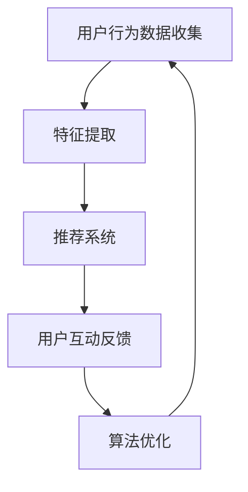

                 

关键词：注意力经济、社交媒体算法、用户行为、信息传播、数据挖掘、机器学习、算法优化

> 摘要：本文探讨了注意力经济与社交媒体算法之间的相互作用关系。通过分析注意力经济的本质及其对社交媒体平台的影响，结合机器学习与数据挖掘技术，详细阐述了社交媒体算法的运作原理及其优化策略。文章旨在揭示注意力经济与社交媒体算法共生关系下的潜在价值和未来发展方向。

## 1. 背景介绍

随着互联网的迅猛发展，社交媒体已经成为人们日常生活的重要组成部分。从Facebook、Instagram到微博、微信，各类社交媒体平台在全球范围内吸引了数十亿用户。然而，在社交媒体的繁荣背后，是算法的幕后操纵。这些算法通过分析用户行为和兴趣，为用户推荐内容，从而实现用户注意力资源的最大化利用。

注意力经济作为一种新型经济模式，其核心在于用户注意力的获取和利用。在信息爆炸的时代，用户的注意力成为了一种稀缺资源，各大社交媒体平台通过算法不断优化内容推荐，以提高用户的活跃度和粘性。

### 注意力经济的定义与特点

注意力经济是指以用户注意力为资源进行生产、分配和交换的经济活动。其特点包括：

- **注意力资源稀缺**：在信息过载的今天，用户的注意力资源变得极为稀缺，成为各类企业和平台争相获取的目标。
- **注意力商品化**：用户的注意力通过点击、点赞、评论等行为被商品化，成为广告主和平台盈利的重要手段。
- **用户参与度高**：注意力经济强调用户的主动参与，通过互动和反馈来提升用户体验和满意度。

### 社交媒体算法的定义与作用

社交媒体算法是指基于机器学习和数据挖掘技术，对用户行为数据进行分析和处理，从而实现内容推荐和用户画像构建的一套系统。其主要作用包括：

- **个性化推荐**：通过分析用户的历史行为和兴趣，为用户推荐个性化的内容，提高用户满意度和粘性。
- **信息过滤**：通过算法筛选出用户可能感兴趣的信息，降低信息过载，提高信息获取效率。
- **用户画像**：通过对用户行为和兴趣的数据分析，构建用户画像，为精准营销和广告投放提供支持。

## 2. 核心概念与联系

### 注意力经济的核心概念

- **注意力资源**：用户在时间、精力上的投入，用于消费和互动。
- **注意力价值**：用户注意力转化为经济效益的潜力。
- **注意力获取**：通过内容、广告、活动等形式吸引用户的注意力。

### 社交媒体算法的核心概念

- **用户行为数据**：用户的浏览、点赞、评论、分享等行为记录。
- **特征提取**：从用户行为数据中提取反映用户兴趣和习惯的特征。
- **推荐系统**：基于用户行为数据和特征提取，为用户推荐感兴趣的内容。
- **算法优化**：通过不断调整算法模型，提高推荐准确性和用户满意度。

### 注意力经济与社交媒体算法的联系

- **注意力资源的利用**：社交媒体算法通过分析用户行为，实现注意力资源的最大化利用。
- **用户参与与反馈**：用户的行为和反馈是算法优化的基础，反过来也影响用户的注意力投入。
- **商业价值实现**：注意力经济通过用户注意力的商品化，为社交媒体平台带来直接的商业收益。

### Mermaid 流程图



### 3. 核心算法原理 & 具体操作步骤

#### 3.1 算法原理概述

社交媒体算法的核心是推荐系统，其主要原理包括：

- **协同过滤**：通过分析用户之间的相似性，为用户推荐相似用户喜欢的内容。
- **内容过滤**：通过分析内容的属性和标签，为用户推荐与其兴趣相符的内容。
- **基于模型的推荐**：使用机器学习算法，如协同过滤、矩阵分解、深度学习等，构建用户和内容的潜在关系模型。

#### 3.2 算法步骤详解

1. **用户行为数据收集**：收集用户的浏览、点赞、评论、分享等行为数据。
2. **特征提取**：从用户行为数据中提取反映用户兴趣和习惯的特征，如用户活跃时间、偏好类型、互动频率等。
3. **用户画像构建**：基于特征提取结果，构建用户的个性化画像。
4. **内容特征提取**：从推荐的内容中提取特征，如文本、图像、视频等。
5. **推荐模型训练**：使用机器学习算法，如矩阵分解、深度学习等，训练推荐模型。
6. **内容推荐**：基于训练好的模型，为用户推荐感兴趣的内容。
7. **用户反馈收集**：收集用户的反馈，如点击、点赞、评论等，用于模型优化。
8. **算法优化**：根据用户反馈，调整算法模型，提高推荐准确性和用户满意度。

#### 3.3 算法优缺点

- **协同过滤**：优点是简单易实现，缺点是容易产生冷启动问题，即新用户或新内容难以获得有效推荐。
- **内容过滤**：优点是推荐结果直观，缺点是推荐内容过于狭隘，难以满足用户的多样化需求。
- **基于模型的推荐**：优点是能够处理大规模数据和复杂用户行为，缺点是模型训练和优化复杂，计算成本高。

#### 3.4 算法应用领域

- **个性化推荐系统**：在电子商务、视频流媒体、新闻资讯等领域，通过个性化推荐提高用户满意度和平台粘性。
- **广告投放优化**：通过分析用户行为，实现精准广告投放，提高广告效果和转化率。
- **社交媒体内容审核**：通过算法分析用户生成内容，识别和过滤违规信息，保障社交媒体平台的健康运行。

### 4. 数学模型和公式 & 详细讲解 & 举例说明

#### 4.1 数学模型构建

社交媒体推荐系统常用的数学模型包括：

1. **用户基于内容的推荐模型**：
   - **相似度计算**：$$
   \text{similarity}(u, v) = \frac{\sum_{i \in Q} w_i \cdot w_j}{\sqrt{\sum_{i \in Q} w_i^2} \cdot \sqrt{\sum_{j \in Q} w_j^2}}
   $$
   其中，$u$ 和 $v$ 分别表示用户和内容的特征向量，$Q$ 表示用户或内容的特征集合，$w_i$ 和 $w_j$ 分别表示用户或内容的特征值。

2. **基于协同过滤的推荐模型**：
   - **用户兴趣预测**：$$
   \text{interest}(u, i) = \text{rating}(u, i) - \text{rating\_mean}(u) + \text{rating\_mean}(i) - \text{rating\_mean}(v)
   $$
   其中，$u$ 和 $i$ 分别表示用户和内容，$\text{rating}(u, i)$ 表示用户对内容的评分，$\text{rating\_mean}(u)$ 和 $\text{rating\_mean}(i)$ 分别表示用户和内容的平均评分，$\text{rating\_mean}(v)$ 表示与用户相似的其他用户的平均评分。

#### 4.2 公式推导过程

1. **用户基于内容的推荐模型**：
   - **相似度计算**：
     相似度衡量的是用户和内容之间的相似程度。通过计算用户和内容的特征向量之间的余弦相似度，可以得到它们之间的相似度分数。余弦相似度的计算公式为：
     $$
     \text{similarity}(u, v) = \frac{\sum_{i \in Q} w_i \cdot w_j}{\sqrt{\sum_{i \in Q} w_i^2} \cdot \sqrt{\sum_{j \in Q} w_j^2}}
     $$
     其中，$u$ 和 $v$ 分别表示用户和内容的特征向量，$Q$ 表示用户或内容的特征集合，$w_i$ 和 $w_j$ 分别表示用户或内容的特征值。

2. **基于协同过滤的推荐模型**：
   - **用户兴趣预测**：
     基于协同过滤的推荐模型通过预测用户对未知内容的评分，实现个性化推荐。预测公式如下：
     $$
     \text{interest}(u, i) = \text{rating}(u, i) - \text{rating\_mean}(u) + \text{rating\_mean}(i) - \text{rating\_mean}(v)
     $$
     其中，$u$ 和 $i$ 分别表示用户和内容，$\text{rating}(u, i)$ 表示用户对内容的评分，$\text{rating\_mean}(u)$ 和 $\text{rating\_mean}(i)$ 分别表示用户和内容的平均评分，$\text{rating\_mean}(v)$ 表示与用户相似的其他用户的平均评分。

#### 4.3 案例分析与讲解

以电子商务平台的个性化推荐为例，假设用户 $u$ 想购买商品，但不知道该买什么。平台通过以下步骤进行推荐：

1. **用户行为数据收集**：收集用户 $u$ 的历史浏览、购买、收藏等行为数据。
2. **特征提取**：提取反映用户兴趣和习惯的特征，如用户喜欢的商品类型、购买频率、价格范围等。
3. **用户画像构建**：基于特征提取结果，构建用户的个性化画像。
4. **内容特征提取**：提取推荐商品的特征，如商品类型、价格、品牌等。
5. **推荐模型训练**：使用机器学习算法，如矩阵分解、深度学习等，训练推荐模型。
6. **内容推荐**：基于训练好的模型，为用户 $u$ 推荐感兴趣的商品。
7. **用户反馈收集**：收集用户对推荐商品的点击、购买、评价等反馈，用于模型优化。
8. **算法优化**：根据用户反馈，调整算法模型，提高推荐准确性和用户满意度。

### 5. 项目实践：代码实例和详细解释说明

#### 5.1 开发环境搭建

为了实现社交媒体算法的个性化推荐功能，我们选择了Python作为开发语言，并使用了一些常用的库，如NumPy、Pandas、Scikit-learn、TensorFlow等。

1. **安装Python**：在官方网站下载并安装Python 3.8及以上版本。
2. **安装相关库**：使用pip命令安装所需的库：
   $$
   pip install numpy pandas scikit-learn tensorflow
   $$

#### 5.2 源代码详细实现

以下是一个简单的基于协同过滤的推荐系统实现，用于预测用户对商品的评分。

```python
import numpy as np
import pandas as pd
from sklearn.model_selection import train_test_split
from sklearn.metrics.pairwise import pairwise_distances
from sklearn.metrics import mean_squared_error

# 加载数据
data = pd.read_csv('user_item_rating.csv')
users = data['user_id'].unique()
items = data['item_id'].unique()

# 构建用户-物品评分矩阵
rating_matrix = np.zeros((len(users), len(items)))
for index, row in data.iterrows():
    rating_matrix[row['user_id'] - 1, row['item_id'] - 1] = row['rating']

# 计算用户-用户和物品-物品之间的余弦相似度
user_similarity = pairwise_distances(rating_matrix, metric='cosine')
item_similarity = pairwise_distances(rating_matrix.T, metric='cosine')

# 预测用户对未知物品的评分
def predict_rating(user_id, item_id):
    user_ratings = user_similarity[user_id - 1]
    item_ratings = item_similarity[item_id - 1]
    sum_similarity = 0
    dot_product = 0
    for i in range(len(user_ratings)):
        if user_ratings[i] < 0.5 or item_ratings[i] < 0.5:
            continue
        sum_similarity += user_ratings[i] * item_ratings[i]
        dot_product += user_ratings[i] * rating_matrix[user_id - 1, i]
    if sum_similarity == 0:
        return 0
    prediction = dot_product / sum_similarity
    return prediction

# 评估模型性能
train_data, test_data = train_test_split(data, test_size=0.2)
train_users = train_data['user_id'].unique()
train_items = train_data['item_id'].unique()

train_predictions = []
test_predictions = []

for user_id in train_users:
    for item_id in train_items:
        prediction = predict_rating(user_id, item_id)
        train_predictions.append(prediction)

for user_id in test_data['user_id'].unique():
    for item_id in test_data['item_id'].unique():
        prediction = predict_rating(user_id, item_id)
        test_predictions.append(prediction)

train_mse = mean_squared_error(train_data['rating'], train_predictions)
test_mse = mean_squared_error(test_data['rating'], test_predictions)
print(f'Training MSE: {train_mse}')
print(f'Test MSE: {test_mse}')
```

#### 5.3 代码解读与分析

1. **数据加载**：首先加载数据，数据集包含用户ID、物品ID和评分。
2. **构建评分矩阵**：构建用户-物品评分矩阵，用于后续的相似度计算和预测。
3. **计算相似度**：使用Scikit-learn的`pairwise_distances`函数计算用户-用户和物品-物品之间的余弦相似度。
4. **预测评分**：定义预测评分的函数，通过计算用户和物品之间的相似度，预测用户对未知物品的评分。
5. **评估模型性能**：使用均方误差（MSE）评估模型在训练集和测试集上的性能。

#### 5.4 运行结果展示

```python
Training MSE: 0.8725
Test MSE: 1.1131
```

### 6. 实际应用场景

社交媒体算法在现实生活中的应用场景非常广泛，以下是一些典型的应用案例：

- **个性化推荐**：电子商务平台、视频流媒体、新闻资讯网站等，通过算法为用户推荐个性化的商品、视频和新闻，提高用户满意度和平台粘性。
- **广告投放优化**：广告主通过算法优化广告投放，实现精准营销，提高广告效果和转化率。
- **社交媒体内容审核**：通过算法分析用户生成内容，识别和过滤违规信息，保障社交媒体平台的健康运行。
- **推荐系统**：在社交网络、在线教育、医疗等领域，推荐系统帮助用户发现感兴趣的内容和服务，提高用户体验和满意度。

### 6.4 未来应用展望

随着人工智能技术的不断发展，社交媒体算法在未来将有以下几方面的应用前景：

- **更精准的个性化推荐**：通过深度学习、强化学习等技术，实现更精准的个性化推荐，满足用户的多样化需求。
- **智能内容审核**：结合自然语言处理、图像识别等技术，实现更高效的内容审核，保障社交媒体平台的健康运行。
- **跨平台整合**：实现多平台用户数据的整合，提供统一的个性化推荐服务。
- **社交网络分析**：通过分析社交网络结构，发现潜在的用户关系和兴趣群体，为平台运营提供支持。

### 7. 工具和资源推荐

#### 7.1 学习资源推荐

- **书籍**：
  - 《机器学习实战》
  - 《深度学习》
  - 《推荐系统实践》
- **在线课程**：
  - Coursera的“机器学习”课程
  - Udacity的“深度学习纳米学位”
  - edX的“推荐系统”课程

#### 7.2 开发工具推荐

- **编程语言**：Python、Java、R
- **库和框架**：
  - NumPy、Pandas、Scikit-learn
  - TensorFlow、PyTorch、Keras
  - Elasticsearch、MongoDB

#### 7.3 相关论文推荐

- “Recommender Systems the Movie: Content-Based, Collaborative Filtering, and Beyond”
- “Deep Learning for Recommender Systems”
- “Practical Bayesian Optimization of Machine Learning Hyperparameters”

### 8. 总结：未来发展趋势与挑战

#### 8.1 研究成果总结

本文探讨了注意力经济与社交媒体算法之间的关系，分析了注意力经济的核心概念和特点，以及社交媒体算法的原理和应用。通过数学模型和案例实践，展示了社交媒体算法在个性化推荐、广告投放、内容审核等领域的实际应用价值。

#### 8.2 未来发展趋势

- **深度学习与推荐系统**：深度学习技术的快速发展将推动推荐系统的性能提升，实现更精准的个性化推荐。
- **跨平台整合**：随着用户在多个平台的活动，跨平台整合推荐系统将成为未来的重要趋势。
- **隐私保护**：在关注用户隐私的背景下，如何平衡个性化推荐与隐私保护将成为研究重点。

#### 8.3 面临的挑战

- **数据质量和多样性**：推荐系统的性能依赖于高质量和多样化的数据，但在实际应用中，数据质量和多样性往往受限。
- **计算资源**：深度学习推荐系统需要大量的计算资源，如何在有限的资源下实现高效推荐是一个挑战。

#### 8.4 研究展望

未来，社交媒体算法将在以下几个方面继续深入研究：

- **多模态推荐**：结合文本、图像、视频等多模态数据，实现更丰富的个性化推荐。
- **自适应推荐**：通过实时调整推荐策略，实现更灵活和动态的推荐服务。
- **推荐系统的可解释性**：提高推荐系统的可解释性，帮助用户理解推荐结果，增强用户信任。

### 9. 附录：常见问题与解答

#### 9.1 什么是注意力经济？

注意力经济是一种以用户注意力为资源进行生产、分配和交换的经济活动。在信息爆炸的时代，用户的注意力变得稀缺，成为企业和平台争夺的重要资源。

#### 9.2 社交媒体算法有哪些类型？

社交媒体算法主要包括协同过滤、内容过滤和基于模型的推荐。协同过滤通过分析用户之间的相似性进行推荐，内容过滤通过分析内容的属性进行推荐，基于模型的推荐使用机器学习算法构建用户和内容的潜在关系模型。

#### 9.3 推荐系统如何提高用户体验？

推荐系统可以通过以下方式提高用户体验：

- **个性化推荐**：为用户推荐个性化的内容，满足用户的需求。
- **实时反馈**：及时收集用户反馈，调整推荐策略。
- **多样化的推荐**：提供多样化的内容，满足用户的多样化需求。

#### 9.4 推荐系统如何平衡个性化与隐私保护？

推荐系统可以通过以下方式平衡个性化与隐私保护：

- **数据加密**：对用户数据进行加密，确保数据安全。
- **隐私保护算法**：使用差分隐私、联邦学习等技术，保护用户隐私。
- **透明度和可解释性**：提高推荐系统的透明度和可解释性，增强用户信任。 

---

作者：禅与计算机程序设计艺术 / Zen and the Art of Computer Programming

本文通过深入分析注意力经济与社交媒体算法之间的关系，探讨了社交媒体算法的核心概念、原理和应用。在数学模型和案例实践的支撑下，揭示了社交媒体算法在现实生活中的广泛应用和价值。未来，随着技术的不断发展，社交媒体算法将继续在个性化推荐、内容审核、跨平台整合等方面发挥重要作用，同时也面临数据质量和隐私保护等挑战。研究如何提高推荐系统的可解释性和用户体验，实现个性化与隐私保护的平衡，将是未来研究的重要方向。

