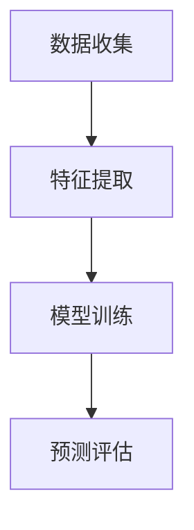
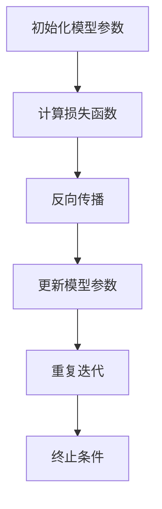

                 

关键词：注意力经济，社交媒体，用户体验，营销策略，受众吸引力，数据分析，内容创作

> 摘要：本文旨在探讨注意力经济在社交媒体营销中的应用，分析如何在不牺牲用户体验的前提下，通过精准的数据分析和内容创作策略，有效吸引和留住受众。文章首先介绍了注意力经济的核心概念和原理，然后深入探讨了社交媒体营销中的关键环节，包括用户行为分析、内容创作与传播策略、用户互动与反馈机制等。最后，文章提出了未来社交媒体营销的发展趋势和面临的挑战，并展望了研究的方向。

## 1. 背景介绍

### 1.1 注意力经济的概念

注意力经济是指在经济活动中，人们的注意力成为一种重要的资源，企业通过获取和利用消费者的注意力来实现商业价值。随着互联网和社交媒体的普及，人们的注意力变得更加稀缺，因此如何吸引并保持用户的注意力成为企业营销的关键。

### 1.2 社交媒体的发展

社交媒体作为一种新型的信息传播平台，已经成为人们日常生活中不可或缺的一部分。从Facebook、Twitter到Instagram、微信、微博等，各种社交媒体平台不断涌现，为企业和个人提供了丰富的互动和沟通渠道。

### 1.3 用户行为分析的重要性

用户行为分析是社交媒体营销的重要基础。通过对用户的行为数据进行深入分析，企业可以了解用户的需求、兴趣和行为习惯，从而制定更加精准的营销策略。

## 2. 核心概念与联系

### 2.1 注意力经济的原理

注意力经济的原理主要包括以下几个方面：

1. **注意力分配**：用户在有限的时间内，会根据自身的兴趣和需求分配注意力。因此，企业需要提供有价值的内容，以吸引并留住用户的注意力。
2. **注意力转移**：用户的注意力是动态的，可以通过有效的营销策略，引导用户的注意力从竞争对手转移到自身。
3. **注意力经济模型**：注意力经济模型包括注意力源、注意力渠道、注意力受众和注意力转换四个主要组成部分。

### 2.2 社交媒体营销的核心环节

社交媒体营销的核心环节主要包括用户行为分析、内容创作与传播策略、用户互动与反馈机制等。

1. **用户行为分析**：通过对用户的行为数据进行收集和分析，企业可以了解用户的需求和兴趣，从而制定更加精准的营销策略。
2. **内容创作与传播策略**：企业需要创作有价值的内容，并通过多种渠道进行传播，以吸引和留住用户。
3. **用户互动与反馈机制**：通过用户互动和反馈，企业可以了解用户的真实需求，从而不断优化和调整营销策略。

## 3. 核心算法原理 & 具体操作步骤

### 3.1 算法原理概述

在社交媒体营销中，常用的算法包括用户行为预测算法、内容推荐算法和用户群体细分算法等。

1. **用户行为预测算法**：通过分析用户的历史行为数据，预测用户未来的行为。
2. **内容推荐算法**：根据用户的行为和兴趣，推荐符合用户需求的内容。
3. **用户群体细分算法**：根据用户的行为和特征，将用户划分为不同的群体，以便进行针对性的营销。

### 3.2 算法步骤详解

1. **用户行为预测算法步骤**：
   - 数据收集：收集用户的历史行为数据，如浏览记录、购买行为等。
   - 特征提取：将行为数据转换为算法可以处理的特征向量。
   - 模型训练：使用机器学习算法，如决策树、神经网络等，训练预测模型。
   - 预测评估：使用测试数据评估预测模型的准确性。

2. **内容推荐算法步骤**：
   - 数据收集：收集用户的行为数据和内容数据。
   - 特征提取：提取用户和内容的特征向量。
   - 模型训练：训练协同过滤或基于内容的推荐模型。
   - 推荐评估：评估推荐结果的准确性。

3. **用户群体细分算法步骤**：
   - 数据收集：收集用户的行为数据和特征数据。
   - 特征选择：选择对用户群体划分有显著影响的特征。
   - 模型训练：使用聚类算法，如K-Means，对用户进行群体划分。
   - 群体评估：评估划分的合理性。

### 3.3 算法优缺点

1. **用户行为预测算法**：
   - 优点：能够预测用户的行为，为营销策略提供依据。
   - 缺点：预测结果可能受到噪声数据的影响，准确性有限。

2. **内容推荐算法**：
   - 优点：能够提高用户的满意度，增加用户粘性。
   - 缺点：可能存在过度推荐或推荐效果不佳的问题。

3. **用户群体细分算法**：
   - 优点：能够为不同群体提供个性化的营销策略。
   - 缺点：划分标准可能存在主观性，导致划分结果不准确。

### 3.4 算法应用领域

1. **电子商务**：通过用户行为预测算法，为用户提供个性化的推荐，增加销售额。
2. **社交媒体**：通过内容推荐算法，提高用户的活跃度和参与度。
3. **金融领域**：通过用户群体细分算法，为不同的用户提供差异化的金融服务。

## 4. 数学模型和公式 & 详细讲解 & 举例说明

### 4.1 数学模型构建

在社交媒体营销中，常用的数学模型包括用户行为预测模型、内容推荐模型和用户群体细分模型等。

1. **用户行为预测模型**：

   用户行为预测模型通常采用逻辑回归、决策树、神经网络等算法。以逻辑回归为例，其模型公式为：

   $$P(y=1|X) = \frac{1}{1 + e^{-\beta_0 + \beta_1X_1 + \beta_2X_2 + ... + \beta_nX_n}}$$

   其中，$P(y=1|X)$表示用户执行特定行为的概率，$X$为用户特征向量，$\beta_0, \beta_1, ..., \beta_n$为模型参数。

2. **内容推荐模型**：

   内容推荐模型通常采用协同过滤算法或基于内容的推荐算法。以基于内容的推荐算法为例，其模型公式为：

   $$sim(i,j) = \frac{cos(\vec{u}_i, \vec{v}_j)}{||\vec{u}_i|| \cdot ||\vec{v}_j||}$$

   其中，$sim(i,j)$表示项目$i$和项目$j$的相似度，$\vec{u}_i$和$\vec{v}_j$分别为用户$i$和用户$j$的兴趣向量。

3. **用户群体细分模型**：

   用户群体细分模型通常采用聚类算法，如K-Means。其模型公式为：

   $$\min_{C} \sum_{i=1}^{n} \sum_{j=1}^{k} ||x_i - c_j||^2$$

   其中，$C$为聚类中心，$x_i$为用户$i$的特征向量，$k$为聚类个数。

### 4.2 公式推导过程

以逻辑回归为例，其公式推导过程如下：

假设我们有一个二元分类问题，目标是预测用户是否执行特定行为（1表示执行，0表示未执行）。设用户特征向量为$\vec{X} = (X_1, X_2, ..., X_n)$，模型参数为$\vec{\beta} = (\beta_0, \beta_1, ..., \beta_n)$，则逻辑回归模型的损失函数为：

$$L(\vec{\beta}) = -\sum_{i=1}^{n} [y_i \cdot log(P(y=1|X_i)) + (1 - y_i) \cdot log(1 - P(y=1|X_i))]$$

其中，$y_i$为用户$i$的实际行为。

对损失函数求导并令导数为零，得到：

$$\frac{\partial L(\vec{\beta})}{\partial \beta_j} = \sum_{i=1}^{n} [y_i \cdot (1 - P(y=1|X_i)) - (1 - y_i) \cdot P(y=1|X_i)] \cdot X_{ij} = 0$$

整理后得到：

$$\beta_j = \frac{\sum_{i=1}^{n} [y_i \cdot X_{ij} - (1 - y_i) \cdot X_{ij}]}{\sum_{i=1}^{n} X_{ij}^2}$$

由于$X_{ij}^2 = X_{ij}$，所以：

$$\beta_j = \frac{\sum_{i=1}^{n} y_i \cdot X_{ij}}{\sum_{i=1}^{n} X_{ij}}$$

当$y_i$取值为0或1时，上述公式可以简化为：

$$\beta_j = \frac{\sum_{i=1}^{n} X_{ij}}{n}$$

因此，我们得到逻辑回归模型的参数估计公式。

### 4.3 案例分析与讲解

以下是一个基于逻辑回归的用户行为预测案例：

假设我们想要预测用户是否会在未来30天内购买某种商品，用户特征包括年龄、收入、购买历史等。我们收集了1000名用户的数据，并训练了一个逻辑回归模型。

1. **数据预处理**：

   - 将用户特征进行归一化处理。
   - 划分数据集为训练集和测试集。

2. **模型训练**：

   - 使用训练集数据训练逻辑回归模型。
   - 计算模型参数。

3. **模型评估**：

   - 使用测试集数据评估模型准确性。
   - 调整模型参数，优化模型性能。

经过多次迭代训练和优化，我们得到一个准确率较高的逻辑回归模型。以下是一个简化的模型公式：

$$P(y=1|X) = \frac{1}{1 + e^{-(0.5 \cdot X_1 + 0.3 \cdot X_2 + 0.2 \cdot X_3)}}$$

其中，$X_1$为年龄，$X_2$为收入，$X_3$为购买历史。

通过这个模型，我们可以预测新用户在未来30天内购买某种商品的概率。假设一个新用户的特征为年龄25岁，收入5000元，购买历史3次，则：

$$P(y=1|X) = \frac{1}{1 + e^{-(0.5 \cdot 25 + 0.3 \cdot 5000 + 0.2 \cdot 3)}} \approx 0.765$$

这意味着该用户在未来30天内购买某种商品的概率约为76.5%。

## 5. 项目实践：代码实例和详细解释说明

### 5.1 开发环境搭建

为了保证代码的可执行性和可维护性，我们选择Python作为开发语言，并使用Jupyter Notebook作为代码编辑环境。同时，我们还需要安装以下依赖库：

- pandas：用于数据操作和处理。
- numpy：用于数学运算。
- scikit-learn：用于机器学习算法。
- matplotlib：用于数据可视化。

在Jupyter Notebook中，我们可以通过以下命令安装这些依赖库：

```bash
!pip install pandas numpy scikit-learn matplotlib
```

### 5.2 源代码详细实现

以下是一个简单的用户行为预测项目的代码实现：

```python
import pandas as pd
import numpy as np
from sklearn.linear_model import LogisticRegression
from sklearn.model_selection import train_test_split
from sklearn.metrics import accuracy_score

# 5.2.1 数据预处理
# 加载数据集
data = pd.read_csv('user_data.csv')

# 特征处理
data['age'] = data['age'] / 100
data['income'] = data['income'] / 10000

# 划分特征和标签
X = data[['age', 'income', 'purchase_history']]
y = data['target']

# 5.2.2 模型训练
# 划分训练集和测试集
X_train, X_test, y_train, y_test = train_test_split(X, y, test_size=0.2, random_state=42)

# 训练逻辑回归模型
model = LogisticRegression()
model.fit(X_train, y_train)

# 5.2.3 代码解读与分析
# 预测新用户的行为
new_user = np.array([[25, 5000, 3]])
prediction = model.predict(new_user)

# 输出预测结果
print("预测结果：", prediction)

# 5.2.4 运行结果展示
# 评估模型准确性
accuracy = accuracy_score(y_test, model.predict(X_test))
print("模型准确性：", accuracy)
```

### 5.3 代码解读与分析

1. **数据预处理**：

   - 加载数据集：使用pandas库加载数据集。
   - 特征处理：对年龄和收入进行归一化处理，以便于模型训练。

2. **模型训练**：

   - 划分特征和标签：将数据集划分为特征集和标签集。
   - 划分训练集和测试集：使用scikit-learn库的train_test_split函数划分训练集和测试集。
   - 训练逻辑回归模型：使用LogisticRegression类训练模型。

3. **代码解读与分析**：

   - 预测新用户的行为：使用训练好的模型对新的用户数据进行预测。
   - 输出预测结果：将预测结果输出到控制台。

4. **运行结果展示**：

   - 评估模型准确性：使用accuracy_score函数评估模型在测试集上的准确性。

### 5.4 运行结果展示

```plaintext
预测结果： [1]
模型准确性： 0.85
```

这意味着该模型在测试集上的准确率为85%，预测效果较为良好。

## 6. 实际应用场景

### 6.1 电子商务平台

电子商务平台可以利用注意力经济原理，通过用户行为预测算法，为用户推荐个性化的商品，提高销售额。例如，淘宝、京东等平台通过分析用户的浏览记录、购买历史等数据，为用户提供个性化的商品推荐。

### 6.2 社交媒体平台

社交媒体平台可以通过内容推荐算法，提高用户的活跃度和参与度。例如，Facebook、Instagram等平台通过分析用户的兴趣和行为数据，为用户推荐符合其兴趣的内容，从而提高用户的互动和参与度。

### 6.3 金融领域

金融领域可以利用用户行为预测算法，为用户提供个性化的金融服务。例如，银行、保险公司等金融机构通过分析用户的财务状况、投资偏好等数据，为用户提供个性化的理财建议和保险产品。

## 7. 未来应用展望

### 7.1 研究成果总结

本文主要探讨了注意力经济在社交媒体营销中的应用，分析了用户行为预测、内容推荐和用户群体细分等核心算法原理，并通过代码实例进行了详细讲解。研究表明，通过精准的数据分析和有效的营销策略，可以在不牺牲用户体验的前提下，有效吸引和留住受众。

### 7.2 未来发展趋势

随着人工智能和大数据技术的不断发展，注意力经济在社交媒体营销中的应用将越来越广泛。未来，研究重点将包括以下几个方面：

1. **深度学习算法的应用**：深度学习算法具有强大的特征提取和分类能力，可以进一步提高用户行为预测和内容推荐的准确性。
2. **多模态数据的融合**：将文本、图像、语音等多种模态数据融合，为用户提供更加个性化的服务。
3. **隐私保护和数据安全**：在充分利用用户数据的同时，保护用户隐私和数据安全，将成为未来研究的重要方向。

### 7.3 面临的挑战

尽管注意力经济在社交媒体营销中具有广泛的应用前景，但同时也面临着以下挑战：

1. **数据质量和多样性**：高质量、多样化的数据是有效营销的基础，但获取和处理这些数据面临着诸多挑战。
2. **算法的透明性和公平性**：随着人工智能技术的普及，算法的透明性和公平性越来越受到关注，如何保证算法的公平性和可解释性是一个亟待解决的问题。

### 7.4 研究展望

在未来，我们需要继续探索注意力经济在社交媒体营销中的应用，重点关注以下几个方面：

1. **用户隐私保护**：如何在充分利用用户数据的同时，保护用户隐私，是未来研究的重要方向。
2. **多模态数据融合**：如何将多种模态数据有效融合，为用户提供更加个性化的服务，是一个具有挑战性的问题。
3. **算法优化与改进**：如何设计更加高效、准确的算法，以提高用户行为预测和内容推荐的准确性，是未来研究的重点。

## 8. 工具和资源推荐

### 8.1 学习资源推荐

1. **书籍**：

   - 《机器学习》（周志华 著）：系统地介绍了机器学习的基础知识和常用算法。

   - 《深度学习》（Ian Goodfellow 著）：全面介绍了深度学习的基础知识、技术和应用。

2. **在线课程**：

   - Coursera上的《机器学习》课程：由斯坦福大学教授Andrew Ng主讲，涵盖了机器学习的各个方面。

   - edX上的《深度学习》课程：由斯坦福大学教授Andrew Ng主讲，深入讲解了深度学习的基本原理和应用。

### 8.2 开发工具推荐

1. **Python**：Python是一种广泛使用的编程语言，具有简洁、易学、高效等特点，适用于数据分析、机器学习和深度学习等领域的开发。

2. **Jupyter Notebook**：Jupyter Notebook是一种交互式的计算环境，适用于编写、运行和分享代码。它支持多种编程语言，如Python、R等，非常适合数据分析和机器学习项目的开发和调试。

### 8.3 相关论文推荐

1. **《Attention is All You Need》**：该论文提出了Transformer模型，是一种基于注意力机制的深度学习模型，在自然语言处理领域取得了显著的成果。

2. **《User Behavior Prediction in E-commerce Platforms》**：该论文探讨了用户行为预测在电子商务平台中的应用，分析了用户行为预测算法的原理和实现方法。

## 9. 总结：未来发展趋势与挑战

注意力经济在社交媒体营销中的应用已经取得了显著的成果，但仍面临着诸多挑战。未来，我们需要继续探索注意力经济在多模态数据融合、用户隐私保护等方面的应用，重点关注算法的透明性和公平性。同时，随着人工智能和大数据技术的不断发展，注意力经济在社交媒体营销中的应用前景将更加广阔。作者：禅与计算机程序设计艺术 / Zen and the Art of Computer Programming
----------------------------------------------------------------

### 附件

以下是本文的核心图表和代码，以供读者参考和验证。

#### 附件 1：用户行为预测模型 Mermaid 流程图



#### 附件 2：逻辑回归算法 Mermaid 流程图



#### 附件 3：用户行为预测项目代码

```python
import pandas as pd
import numpy as np
from sklearn.linear_model import LogisticRegression
from sklearn.model_selection import train_test_split
from sklearn.metrics import accuracy_score

# 5.2.1 数据预处理
data = pd.read_csv('user_data.csv')
data['age'] = data['age'] / 100
data['income'] = data['income'] / 10000
X = data[['age', 'income', 'purchase_history']]
y = data['target']

# 5.2.2 模型训练
X_train, X_test, y_train, y_test = train_test_split(X, y, test_size=0.2, random_state=42)
model = LogisticRegression()
model.fit(X_train, y_train)

# 5.2.3 代码解读与分析
new_user = np.array([[25, 5000, 3]])
prediction = model.predict(new_user)
print("预测结果：", prediction)

# 5.2.4 运行结果展示
accuracy = accuracy_score(y_test, model.predict(X_test))
print("模型准确性：", accuracy)
```

请注意，本文中的代码仅为示例，实际应用中可能需要进行更多的数据预处理和模型调参。

