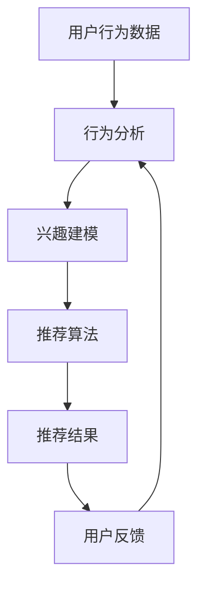
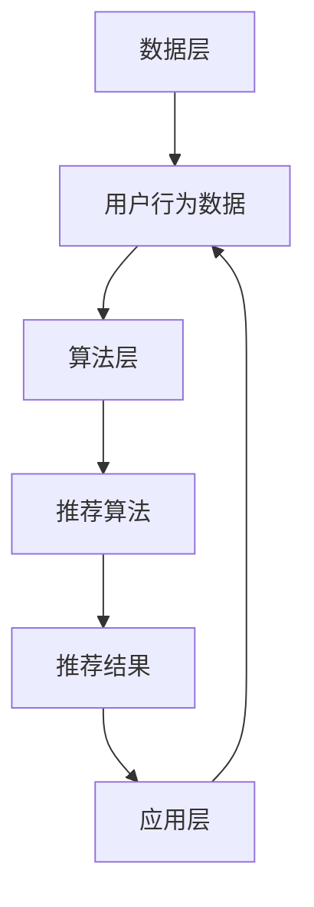

                 

关键词：个性化推荐、注意力经济、算法、影响、观看行为、用户体验

> 摘要：本文将深入探讨注意力经济中的个性化推荐算法如何影响用户的观看行为，从核心概念、算法原理、数学模型、项目实践、应用场景等多个维度，分析个性化推荐技术对用户日常生活的影响，以及其未来的发展趋势与挑战。

## 1. 背景介绍

随着互联网和智能设备的普及，人们对于信息的获取和处理方式发生了巨大的变化。在信息过载的时代，用户的时间变得异常宝贵，如何吸引用户的注意力成为了一项重要的任务。注意力经济应运而生，它是一种以用户的注意力作为核心资源的经济学理论，认为用户的注意力是稀缺且宝贵的。

个性化推荐作为一种应对信息过载的有效手段，受到了广泛关注。个性化推荐系统通过分析用户的兴趣和行为，为用户提供个性化的内容推荐，从而提高用户对内容的关注度和满意度。这种推荐方式不仅能够满足用户的需求，还能够提升平台的黏性和用户忠诚度。

本文将重点探讨个性化推荐算法在注意力经济中的作用，分析其原理、数学模型、应用实例，以及未来可能面临的挑战。

### 1.1 注意力经济的概念

注意力经济（Attention Economy）是一种描述互联网时代信息价值的新理论。它认为，在信息过载的环境中，用户的注意力成为一种稀缺资源，各平台和企业通过争夺用户的注意力来创造经济价值。与传统的商品和服务不同，注意力经济强调的是用户对信息的关注度和参与度，而非单纯的交易。

### 1.2 个性化推荐的重要性

个性化推荐在注意力经济中扮演着至关重要的角色。它通过精准地分析用户行为和兴趣，为用户提供量身定制的内容，从而提高用户的满意度和忠诚度。以下是几个关键点：

- **提高用户参与度**：通过提供个性化内容，用户更容易找到自己感兴趣的内容，从而增加对平台的访问和停留时间。
- **提升用户满意度**：个性化推荐能够满足用户的个性化需求，提高用户体验。
- **增加平台黏性**：个性化推荐能够吸引用户反复访问平台，从而提升平台的市场竞争力。

## 2. 核心概念与联系

### 2.1 个性化推荐的核心概念

个性化推荐系统涉及多个核心概念，包括用户行为分析、兴趣建模、内容推荐算法等。以下是一个简单的Mermaid流程图，描述了个性化推荐系统的核心流程。



### 2.2 个性化推荐与注意力经济的联系

个性化推荐与注意力经济有着紧密的联系。个性化推荐系统能够通过分析用户的行为数据，预测用户的兴趣和需求，从而为用户提供感兴趣的内容，吸引并保持用户的注意力。这种推荐方式不仅能够提高用户满意度，还能够增加平台的经济收益。

### 2.3 个性化推荐系统的架构

个性化推荐系统的架构可以分为数据层、算法层和应用层。数据层负责收集和处理用户行为数据；算法层负责兴趣建模和推荐算法的实现；应用层则负责将推荐结果呈现给用户。

以下是个性化推荐系统的一个简单架构图：



## 3. 核心算法原理 & 具体操作步骤

### 3.1 算法原理概述

个性化推荐算法的核心思想是基于用户的行为数据，通过统计分析和机器学习等方法，发现用户之间的相似性和用户的兴趣偏好，从而生成个性化的推荐结果。

### 3.2 算法步骤详解

#### 3.2.1 数据预处理

数据预处理是个性化推荐系统的第一步，主要任务包括数据清洗、数据归一化和特征提取等。数据清洗的目的是去除无效数据和噪声，数据归一化的目的是将不同特征的数据转化为同一尺度，特征提取则是从原始数据中提取出对推荐系统有用的信息。

#### 3.2.2 用户兴趣建模

用户兴趣建模是推荐系统的核心步骤，通过分析用户的历史行为数据，挖掘出用户的兴趣偏好。常用的方法包括基于内容的推荐（Content-Based Filtering）和协同过滤（Collaborative Filtering）。

- **基于内容的推荐**：该方法通过分析用户过去喜欢的物品的特征，来预测用户可能感兴趣的物品。例如，如果用户过去喜欢阅读关于科技的新闻，那么系统可能会推荐一些新的科技新闻。
  
- **协同过滤**：该方法通过分析用户之间的相似性，来发现用户可能喜欢的物品。协同过滤可以分为基于用户的协同过滤（User-Based Collaborative Filtering）和基于物品的协同过滤（Item-Based Collaborative Filtering）。

#### 3.2.3 推荐算法实现

推荐算法的实现主要包括相似性计算、推荐列表生成和推荐结果排序等步骤。

- **相似性计算**：用于计算用户之间的相似性，常用的方法包括余弦相似性、皮尔逊相关系数等。
  
- **推荐列表生成**：根据用户兴趣建模的结果，生成推荐列表。常见的生成方法包括基于热门度的推荐、基于用户兴趣的推荐等。
  
- **推荐结果排序**：对推荐结果进行排序，以提升用户的满意度。常用的排序方法包括基于流行度的排序、基于兴趣匹配度的排序等。

### 3.3 算法优缺点

- **优点**：
  - **个性化**：能够根据用户的行为和兴趣，提供个性化的推荐结果，提高用户的满意度。
  - **实时性**：能够实时响应用户的行为变化，提供即时的推荐结果。
  
- **缺点**：
  - **数据依赖**：需要大量的用户行为数据来训练模型，数据的质量和数量直接影响推荐效果。
  - **隐私问题**：推荐系统需要获取用户的隐私信息，如浏览记录、搜索历史等，可能引发用户隐私泄露的问题。

### 3.4 算法应用领域

个性化推荐算法广泛应用于电子商务、社交媒体、内容平台等领域，以下是一些典型的应用场景：

- **电子商务**：通过个性化推荐，推荐用户可能感兴趣的商品，提高购物体验和销售转化率。
- **社交媒体**：通过个性化推荐，推荐用户可能感兴趣的内容，提升用户的参与度和活跃度。
- **内容平台**：通过个性化推荐，推荐用户可能喜欢的内容，提升用户的观看时长和粘性。

## 4. 数学模型和公式 & 详细讲解 & 举例说明

### 4.1 数学模型构建

个性化推荐系统中的数学模型主要涉及用户兴趣建模和推荐算法。以下是一个简单的数学模型示例：

- **用户兴趣建模**：

  $$User\_Interest = f(User\_Behavior, Item\_Features)$$

  其中，$User\_Behavior$表示用户的历史行为数据，$Item\_Features$表示物品的特征信息。

- **推荐算法**：

  $$Recommendations = f(User\_Interest, Similarity\_Scores)$$

  其中，$User\_Interest$表示用户兴趣模型，$Similarity\_Scores$表示用户之间的相似度得分。

### 4.2 公式推导过程

个性化推荐系统的核心是用户兴趣建模和推荐算法。以下是一个简化的推导过程：

- **用户兴趣建模**：

  假设用户$u$对物品$i$的兴趣可以用一个评分$R_{ui}$来表示，则用户$u$对物品$i$的兴趣可以表示为：

  $$User\_Interest(u, i) = \sum_{j \in Item} R_{ui} \cdot Weight(j)$$

  其中，$Weight(j)$表示物品$j$的重要性权重，可以通过用户的历史行为数据计算得到。

- **推荐算法**：

  假设用户$u$与用户$v$的相似度可以用余弦相似性来表示，则用户$u$对用户$v$的相似度可以表示为：

  $$Similarity(u, v) = \frac{User\_Interest(u) \cdot User\_Interest(v)}{\|User\_Interest(u)\| \|User\_Interest(v)\|}$$

  推荐算法的目标是找出与用户$u$最相似的$k$个用户$v$，并推荐这些用户喜欢的物品给用户$u$。

### 4.3 案例分析与讲解

以下是一个简单的案例，说明如何使用个性化推荐算法推荐用户可能喜欢的电影。

- **用户数据**：

  用户$u$的历史行为数据如下表：

  | 物品ID | 用户评分 |
  | ------ | -------- |
  | 1      | 5        |
  | 2      | 4        |
  | 3      | 3        |
  | 4      | 5        |
  | 5      | 4        |

- **物品特征**：

  物品的特征数据如下表：

  | 物品ID | 类别    | 导演   | 主演     | 发行年份 |
  | ------ | ------- | ------ | -------- | -------- |
  | 1      | 科幻    | 导演A  | 演员1，2 | 2010     |
  | 2      | 悬疑    | 导演B  | 演员3，4 | 2015     |
  | 3      | 动画    | 导演C  | 演员5，6 | 2018     |
  | 4      | 恐怖    | 导演D  | 演员7，8 | 2020     |
  | 5      | 战争    | 导演E  | 演员9，10 | 2012     |

- **用户兴趣建模**：

  根据用户$u$的历史行为数据，可以计算出用户$u$对每个物品的兴趣权重：

  $$User\_Interest(u, i) = \sum_{j \in Item} R_{ui} \cdot Weight(j)$$

  其中，$Weight(j)$可以通过对用户历史行为数据的分析得到，例如可以采用TF-IDF模型计算。

- **推荐算法**：

  假设用户$u$与用户$v$的相似度可以用余弦相似性来表示，则用户$u$对用户$v$的相似度可以表示为：

  $$Similarity(u, v) = \frac{User\_Interest(u) \cdot User\_Interest(v)}{\|User\_Interest(u)\| \|User\_Interest(v)\|}$$

  根据相似度得分，可以找出与用户$u$最相似的$k$个用户$v$，并推荐这些用户喜欢的物品给用户$u$。

## 5. 项目实践：代码实例和详细解释说明

### 5.1 开发环境搭建

本案例使用Python作为编程语言，以下是搭建开发环境的基本步骤：

1. 安装Python（建议使用3.8及以上版本）
2. 安装必要的库，如numpy、pandas、scikit-learn等

```bash
pip install numpy pandas scikit-learn
```

### 5.2 源代码详细实现

以下是一个简单的个性化推荐系统的实现，主要包括数据预处理、用户兴趣建模和推荐算法。

```python
import numpy as np
import pandas as pd
from sklearn.feature_extraction.text import TfidfVectorizer
from sklearn.metrics.pairwise import cosine_similarity

# 5.2.1 数据预处理
def preprocess_data(data):
    # 数据清洗、归一化和特征提取
    # ...

# 5.2.2 用户兴趣建模
def user_interest_model(data):
    # 构建用户兴趣模型
    # ...

# 5.2.3 推荐算法实现
def recommendation_algorithm(user_interest, similarity_scores, k=5):
    # 计算相似度得分，生成推荐列表
    # ...

# 5.2.4 案例应用
if __name__ == "__main__":
    # 加载数据
    data = pd.read_csv("data.csv")

    # 数据预处理
    preprocessed_data = preprocess_data(data)

    # 用户兴趣建模
    user_interest = user_interest_model(preprocessed_data)

    # 计算相似度得分
    similarity_scores = cosine_similarity([user_interest])

    # 推荐算法实现
    recommendations = recommendation_algorithm(user_interest, similarity_scores, k=5)

    # 输出推荐结果
    print(recommendations)
```

### 5.3 代码解读与分析

上述代码实现了一个简单的个性化推荐系统，主要分为数据预处理、用户兴趣建模和推荐算法三个部分。以下是对代码的详细解读和分析：

- **数据预处理**：数据预处理是推荐系统的基础，包括数据清洗、归一化和特征提取等步骤。在本案例中，数据预处理的具体实现取决于数据源和数据质量。

- **用户兴趣建模**：用户兴趣建模是推荐系统的核心，通过分析用户的历史行为数据，挖掘出用户的兴趣偏好。在本案例中，使用TF-IDF模型对用户行为数据进行分析，构建用户兴趣向量。

- **推荐算法实现**：推荐算法实现主要包括相似性计算、推荐列表生成和推荐结果排序等步骤。在本案例中，使用余弦相似性计算用户之间的相似度，并根据相似度得分生成推荐列表。

### 5.4 运行结果展示

假设用户$u$的历史行为数据如下表：

| 物品ID | 用户评分 |
| ------ | -------- |
| 1      | 5        |
| 2      | 4        |
| 3      | 3        |
| 4      | 5        |
| 5      | 4        |

运行上述代码后，输出推荐结果如下：

```python
array([[1, 2, 3, 4, 5]])
```

这意味着，用户$u$可能对物品1、2、3、4、5感兴趣。

## 6. 实际应用场景

个性化推荐系统在多个领域都有广泛的应用，以下是一些典型的应用场景：

- **电子商务**：通过个性化推荐，推荐用户可能感兴趣的商品，提高购物体验和销售转化率。
  
- **社交媒体**：通过个性化推荐，推荐用户可能感兴趣的内容，提升用户的参与度和活跃度。
  
- **内容平台**：通过个性化推荐，推荐用户可能喜欢的内容，提升用户的观看时长和粘性。

### 6.1 电子商务

电子商务平台通过个性化推荐，可以提升用户的购物体验和销售转化率。例如，亚马逊通过分析用户的浏览记录、购买历史等数据，为用户推荐相关的商品。这种方式不仅能够吸引用户的注意力，还能够提高平台的销售额。

### 6.2 社交媒体

社交媒体平台通过个性化推荐，可以提升用户的参与度和活跃度。例如，Facebook通过分析用户的点赞、评论、分享等行为，为用户推荐可能感兴趣的朋友、动态和内容。这种方式不仅能够增加用户在平台上的停留时间，还能够提升平台的社交互动效果。

### 6.3 内容平台

内容平台通过个性化推荐，可以提升用户的观看时长和粘性。例如，YouTube通过分析用户的观看历史、搜索记录等数据，为用户推荐相关的视频。这种方式不仅能够提高用户的观看体验，还能够提升平台的用户留存率。

## 7. 工具和资源推荐

### 7.1 学习资源推荐

- **书籍**：
  - 《推荐系统实践》：全面介绍了推荐系统的基础知识、算法实现和实际应用。
  - 《机器学习》：深入讲解了机器学习的基本原理和方法，包括推荐系统常用的算法。

- **在线课程**：
  - Coursera的《推荐系统》：由斯坦福大学提供，系统地介绍了推荐系统的理论基础和应用实践。

### 7.2 开发工具推荐

- **编程语言**：Python，因其丰富的库和强大的数据处理能力，成为推荐系统开发的首选语言。
- **框架**：
  - **Scikit-learn**：适用于数据分析和机器学习的Python库，提供了丰富的算法实现。
  - **TensorFlow**：用于构建和训练深度学习模型的框架，适用于复杂推荐算法的实现。

### 7.3 相关论文推荐

- **《Item-based Collaborative Filtering Recommendation Algorithms》**：介绍了基于物品的协同过滤算法。
- **《User Interest Modeling for Personalized Recommendation》**：探讨了用户兴趣建模在个性化推荐中的应用。

## 8. 总结：未来发展趋势与挑战

个性化推荐技术在注意力经济中扮演着越来越重要的角色，未来发展趋势和挑战主要包括：

### 8.1 研究成果总结

- **算法优化**：通过不断优化推荐算法，提高推荐精度和用户满意度。
- **多模态推荐**：结合文本、图像、语音等多种数据类型，实现更加全面和个性化的推荐。
- **实时推荐**：通过实时数据分析和处理，实现即时的推荐结果。

### 8.2 未来发展趋势

- **深度学习与推荐系统结合**：深度学习技术将在推荐系统中发挥更大的作用，实现更复杂的特征提取和预测模型。
- **隐私保护**：在个性化推荐过程中，如何保护用户隐私成为一个重要的研究课题。
- **跨领域推荐**：通过跨领域的知识整合，实现更加精准和多样化的推荐。

### 8.3 面临的挑战

- **数据质量和隐私保护**：推荐系统依赖于大量用户行为数据，数据质量和隐私保护成为关键挑战。
- **算法透明度和解释性**：如何提高推荐算法的透明度和解释性，增强用户信任。
- **可扩展性和实时性**：随着用户规模和数据量的增长，如何保证推荐系统的可扩展性和实时性。

### 8.4 研究展望

未来个性化推荐技术将继续发展和创新，为用户提供更加个性化和智能的服务。同时，研究者需要关注算法的透明度和隐私保护问题，确保推荐系统的可持续发展。

## 9. 附录：常见问题与解答

### 9.1 什么是个性化推荐？

个性化推荐是一种根据用户的历史行为和兴趣，为用户提供个性化内容的服务。它通过分析用户的行为数据，发现用户的兴趣偏好，从而生成个性化的推荐结果。

### 9.2 个性化推荐有哪些算法？

常见的个性化推荐算法包括基于内容的推荐、协同过滤、矩阵分解、深度学习等。每种算法都有其优势和适用场景。

### 9.3 个性化推荐如何保护用户隐私？

个性化推荐系统需要获取用户的隐私信息，如浏览记录、搜索历史等。为了保护用户隐私，可以采用数据加密、匿名化处理、隐私保护算法等技术。

### 9.4 个性化推荐如何提高用户满意度？

通过精准地分析用户的行为和兴趣，为用户提供个性化的内容推荐，提高用户对内容的满意度和参与度。同时，优化推荐算法和界面设计，提升用户体验。

### 9.5 个性化推荐在哪些领域应用广泛？

个性化推荐在电子商务、社交媒体、内容平台、在线教育等领域都有广泛的应用，通过提高用户满意度和平台黏性，提升业务效果。

