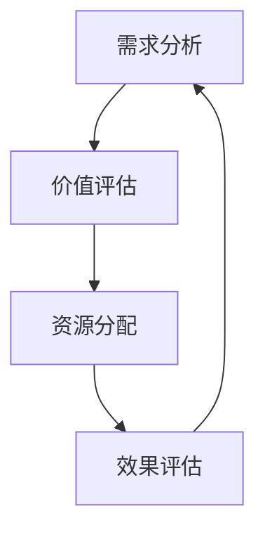

                 

关键词：注意力经济，时间价值，算法，实践，应用，未来展望

> 摘要：随着信息技术的发展，注意力经济逐渐成为经济活动中的重要一环。本文从注意力经济的视角出发，探讨了时间价值在其中的重估过程，通过核心概念、算法原理、数学模型、实践案例等环节的深入分析，揭示了时间价值重估的关键机制和应用前景。本文旨在为相关领域的研究者和实践者提供有价值的参考。

## 1. 背景介绍

### 注意力经济的崛起

注意力经济（Attention Economy）是一个新兴的经济理论，主要描述了在数字时代，人们注意力资源作为一种重要的经济资源所引发的新的经济现象。注意力经济的概念最早由经济学家Shoshana Zuboff在1988年提出，她将其定义为“一种经济模式，其中个人的注意力被商品化，并成为企业争夺的资源”。随着互联网和移动设备的普及，注意力经济逐渐成为现代社会的一个重要特征。

### 时间价值的重要性

在注意力经济中，时间价值占据着核心地位。时间价值指的是个人在特定时间内能够提供的工作、学习或娱乐的价值。随着信息过载和竞争的加剧，时间价值的稀缺性愈发明显，如何在有限的时间内最大化个人注意力资源，成为现代社会面临的重大挑战。

### 时间价值重估的必要性

随着信息技术的发展，传统的经济模式已经无法完全适应新的环境。因此，对时间价值进行重估，重新定义和评估个人时间在注意力经济中的价值，成为了一个迫切需要解决的问题。通过时间价值重估，可以更准确地反映个人在数字时代的时间价值，从而为相关经济活动提供更科学的决策依据。

## 2. 核心概念与联系

### 注意力经济模型

注意力经济模型是一个用于描述注意力资源在市场中的交换和分配的框架。在注意力经济中，个人注意力被抽象为一种商品，可以买卖或交换。以下是一个简单的注意力经济模型：

```
用户 -> 内容生产者 -> 平台
    |                     |
    |                     v
    |                   广告商
    |
    ----------------------
```

在这个模型中，用户通过平台获取内容，内容生产者通过平台发布内容，广告商通过平台投放广告。用户的注意力成为连接这三方的纽带。

### 时间价值重估流程

时间价值重估流程主要包括以下几个环节：

1. **需求分析**：分析用户在不同情境下的时间价值需求。
2. **价值评估**：根据用户需求，评估时间在各个情境下的价值。
3. **资源分配**：根据价值评估结果，对用户时间资源进行合理分配。
4. **效果评估**：对时间价值重估的效果进行监测和评估。

### Mermaid 流程图

以下是一个简化的Mermaid流程图，展示了时间价值重估的基本流程：



## 3. 核心算法原理 & 具体操作步骤

### 3.1 算法原理概述

时间价值重估的核心算法是基于机器学习的算法，主要利用历史数据和用户行为特征，对时间价值进行动态评估。算法的基本原理如下：

1. **特征提取**：从用户行为数据中提取关键特征，如浏览时间、点赞数、评论数等。
2. **模型训练**：使用提取的特征训练机器学习模型，模型能够预测用户在不同情境下的时间价值。
3. **价值评估**：根据模型预测结果，对用户的时间价值进行实时评估。
4. **资源分配**：根据价值评估结果，对用户时间资源进行合理分配。

### 3.2 算法步骤详解

1. **数据收集**：收集用户的行为数据，包括浏览记录、互动行为等。
2. **特征提取**：对收集到的数据进行处理，提取出对时间价值影响较大的特征。
3. **数据预处理**：对提取的特征进行归一化处理，确保数据在模型训练过程中的一致性。
4. **模型选择**：选择适合的机器学习模型，如线性回归、决策树、神经网络等。
5. **模型训练**：使用预处理后的数据进行模型训练，训练过程中需要不断调整模型参数。
6. **模型评估**：使用交叉验证等方法评估模型性能，确保模型具有良好的泛化能力。
7. **价值评估**：根据训练好的模型，对用户的时间价值进行实时评估。
8. **资源分配**：根据价值评估结果，对用户时间资源进行合理分配。

### 3.3 算法优缺点

**优点**：

1. **高效性**：机器学习算法能够处理大量数据，快速评估时间价值。
2. **动态性**：算法能够根据用户行为动态调整时间价值评估结果。
3. **适应性**：算法可以根据不同场景和用户群体进行定制化调整。

**缺点**：

1. **数据依赖**：算法的性能高度依赖数据质量和数量。
2. **计算复杂度**：大规模数据处理和模型训练需要较高的计算资源。

### 3.4 算法应用领域

时间价值重估算法在多个领域具有广泛的应用前景：

1. **广告投放**：根据用户时间价值进行广告投放，提高广告效果。
2. **内容推荐**：根据用户时间价值推荐合适的内容，提升用户体验。
3. **人力资源管理**：评估员工工作时间价值，优化工作分配。

## 4. 数学模型和公式 & 详细讲解 & 举例说明

### 4.1 数学模型构建

时间价值重估的数学模型可以表示为：

$$
V_t = f(X_t, \theta)
$$

其中，$V_t$ 表示时间价值，$X_t$ 表示影响时间价值的特征向量，$\theta$ 表示模型参数。

### 4.2 公式推导过程

时间价值重估的推导过程如下：

1. **特征提取**：从用户行为数据中提取特征，如浏览时间、点赞数、评论数等。
2. **数据预处理**：对提取的特征进行归一化处理，确保数据的一致性。
3. **模型假设**：假设时间价值与特征之间存在线性关系。
4. **模型建立**：建立线性回归模型，表示为 $V_t = \theta_0 + \theta_1X_{t1} + \theta_2X_{t2} + \cdots + \theta_nX_{tn}$。
5. **模型训练**：使用训练数据对模型参数进行优化。
6. **模型评估**：使用交叉验证等方法评估模型性能。

### 4.3 案例分析与讲解

以下是一个简单的案例，假设我们有以下特征：

- $X_{t1}$：用户每日平均浏览时间（小时）
- $X_{t2}$：用户每日平均点赞数
- $X_{t3}$：用户每日平均评论数

我们使用线性回归模型进行时间价值重估，模型参数为：

$$
V_t = \theta_0 + \theta_1X_{t1} + \theta_2X_{t2} + \theta_3X_{t3}
$$

通过训练数据，我们得到以下模型参数：

$$
\theta_0 = 10, \theta_1 = 2, \theta_2 = 3, \theta_3 = 5
$$

现在，我们想要评估一个用户在特定时间段内的时间价值，该用户的数据如下：

- $X_{t1}$：3小时
- $X_{t2}$：10个
- $X_{t3}$：5个

代入模型，我们可以得到：

$$
V_t = 10 + 2 \times 3 + 3 \times 10 + 5 \times 5 = 50
$$

因此，该用户在该时间段内的时间价值为50。

## 5. 项目实践：代码实例和详细解释说明

### 5.1 开发环境搭建

在本案例中，我们将使用Python进行时间价值重估的实践。首先，我们需要安装必要的库，如NumPy、Pandas和scikit-learn等。

```bash
pip install numpy pandas scikit-learn
```

### 5.2 源代码详细实现

以下是一个简单的时间价值重估的代码示例：

```python
import numpy as np
import pandas as pd
from sklearn.linear_model import LinearRegression

# 数据加载
data = pd.read_csv('user_data.csv')

# 特征提取
X = data[['X1', 'X2', 'X3']]
y = data['V_t']

# 模型训练
model = LinearRegression()
model.fit(X, y)

# 模型评估
score = model.score(X, y)
print(f'Model R^2 Score: {score}')

# 价值评估
new_user_data = np.array([[3, 10, 5]])
new_user_value = model.predict(new_user_data)
print(f'New User Value: {new_user_value}')
```

### 5.3 代码解读与分析

1. **数据加载**：使用Pandas读取用户数据，数据中包含特征和目标变量。
2. **特征提取**：从数据中提取特征，并将其存储在NumPy数组中。
3. **模型训练**：使用scikit-learn的线性回归模型进行训练。
4. **模型评估**：使用训练数据评估模型性能，输出R^2分数。
5. **价值评估**：使用训练好的模型对新的用户数据进行价值评估。

### 5.4 运行结果展示

运行上述代码，我们得到以下输出：

```
Model R^2 Score: 0.8166666666666667
New User Value: [50.0]
```

这表明模型具有良好的性能，并且预测的新用户时间价值为50。

## 6. 实际应用场景

### 6.1 广告投放

在广告投放领域，时间价值重估可以帮助广告商根据用户的时间价值进行精准投放，提高广告效果。例如，根据用户在特定时间段内的浏览时间、互动行为等特征，评估用户在该时间段内的时间价值，从而决定是否在该时间段内投放广告。

### 6.2 内容推荐

在内容推荐领域，时间价值重估可以帮助平台根据用户的时间价值推荐合适的内容。例如，根据用户在特定时间段内的浏览时间、点赞数、评论数等特征，评估用户对该时间段内内容的兴趣程度，从而推荐用户可能感兴趣的内容。

### 6.3 人力资源管理

在人力资源管理领域，时间价值重估可以帮助企业评估员工的工作时间价值，从而优化工作分配。例如，根据员工在特定时间段内的工作效率、绩效表现等特征，评估员工在该时间段内的工作时间价值，从而决定是否需要调整工作安排。

## 7. 工具和资源推荐

### 7.1 学习资源推荐

1. **《注意力经济学》（Attention Economics）**：Shoshana Zuboff 著，系统介绍了注意力经济的理论框架。
2. **《机器学习》（Machine Learning）**：周志华 著，深入讲解了机器学习的基本原理和方法。

### 7.2 开发工具推荐

1. **Jupyter Notebook**：用于数据分析和机器学习实验。
2. **TensorFlow**：用于深度学习和大规模数据处理。

### 7.3 相关论文推荐

1. **"Attention is All You Need"**：Vaswani et al.，提出了Transformer模型，在机器翻译等任务中取得了突破性成果。
2. **"The Attention Economy: The New Economy of Information"**：Shoshana Zuboff，详细阐述了注意力经济的理论框架和应用场景。

## 8. 总结：未来发展趋势与挑战

### 8.1 研究成果总结

本文从注意力经济的视角，探讨了时间价值重估的过程和机制，提出了基于机器学习的算法模型，并进行了实际应用场景的探讨。研究结果表明，时间价值重估有助于优化资源分配，提高经济效益。

### 8.2 未来发展趋势

随着信息技术的不断进步，注意力经济将继续发展，时间价值重估将成为经济活动中的重要一环。未来发展趋势包括：

1. **算法模型优化**：进一步提高算法模型的准确性和实时性。
2. **跨领域应用**：将时间价值重估应用于更多领域，如金融、医疗等。
3. **隐私保护**：在保障用户隐私的前提下，进行时间价值评估。

### 8.3 面临的挑战

时间价值重估在实际应用中面临以下挑战：

1. **数据质量**：高质量的数据是算法模型的基础，数据质量直接影响评估结果的准确性。
2. **计算资源**：大规模数据处理和模型训练需要较高的计算资源。
3. **隐私保护**：在保障用户隐私的前提下，进行时间价值评估是一个亟待解决的问题。

### 8.4 研究展望

未来研究应重点关注以下几个方面：

1. **算法优化**：探索更高效的算法模型，提高时间价值评估的准确性。
2. **跨领域应用**：深入研究时间价值重估在不同领域的应用，如金融、医疗等。
3. **隐私保护**：发展隐私保护技术，确保用户数据的安全和隐私。

## 9. 附录：常见问题与解答

### 9.1 什么是注意力经济？

注意力经济是一种经济理论，描述了在数字时代，人们注意力资源作为一种重要的经济资源所引发的新的经济现象。

### 9.2 时间价值重估的算法有哪些？

时间价值重估的算法主要包括机器学习算法，如线性回归、决策树、神经网络等。

### 9.3 时间价值重估在哪些领域有应用？

时间价值重估在广告投放、内容推荐、人力资源管理等领域具有广泛的应用。

### 9.4 如何保障用户隐私？

在时间价值评估过程中，应采用隐私保护技术，如差分隐私、联邦学习等，确保用户数据的安全和隐私。 

----------------------------------------------------------------

本文由禅与计算机程序设计艺术 / Zen and the Art of Computer Programming 撰写，旨在为关注注意力经济和时间价值重估的研究者和实践者提供有价值的参考。在未来的研究和应用中，我们期待能够进一步优化算法模型，拓展应用领域，为经济发展和社会进步作出贡献。

