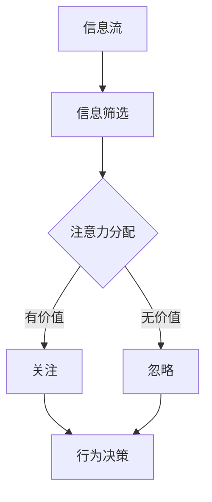
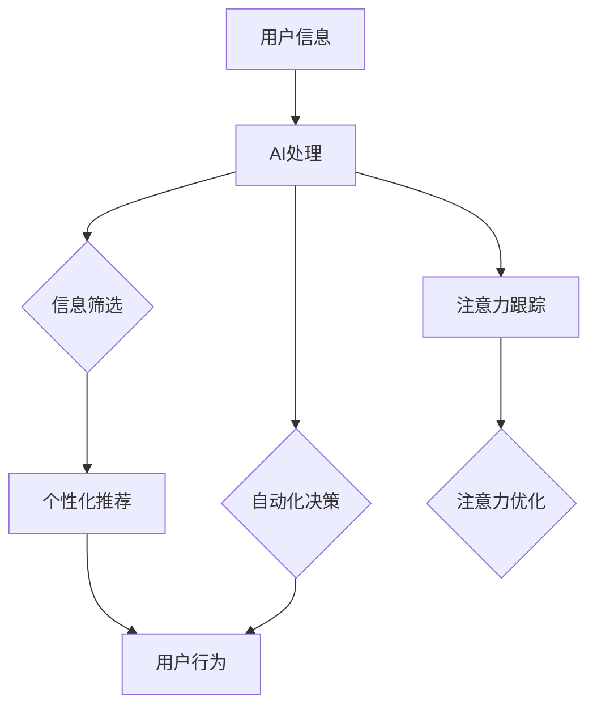

                 

关键词：注意力经济学、AI、注意力分配、效率、人类认知、计算资源管理

> 摘要：本文旨在探讨AI时代下的注意力经济学，分析人类在信息过载时代如何有效分配注意力，以及AI技术如何帮助我们优化这一过程。我们将从注意力经济学的概念出发，深入探讨其与AI技术的联系，并通过数学模型和实际案例，解释注意力分配的原理和实践方法。

## 1. 背景介绍

在信息爆炸的时代，注意力成为了一种稀缺资源。我们每天都要处理海量的信息，从社交媒体、电子邮件到新闻和各种应用通知，注意力资源的分配变得尤为重要。注意力经济学（Attention Economics）是近年来兴起的一个跨学科领域，它结合了经济学、心理学和神经科学的理论，研究个体如何选择关注哪些信息，以及这些选择背后的经济激励机制。

随着人工智能（AI）技术的发展，尤其是自然语言处理和机器学习算法的进步，人们开始探索如何利用AI技术来优化注意力的分配。AI不仅能够帮助我们筛选和处理信息，还可以通过个性化推荐和自动化决策，减轻人类在信息过载环境中的负担。

本文将围绕以下几个核心问题展开讨论：

- 注意力经济学的定义和基本原理是什么？
- AI技术如何影响注意力的分配？
- 如何通过AI优化注意力的分配效率？
- 实际应用场景和未来发展趋势是什么？

## 2. 核心概念与联系

### 2.1 注意力经济学的基本原理

注意力经济学关注的是人类在信息选择和资源分配上的决策过程。根据这个理论，个体的注意力资源是有限的，因此必须做出经济上的权衡。以下是一个简化的Mermaid流程图，展示了注意力经济学的基本原理和关键概念。



### 2.2 注意力经济学的联系

注意力经济学与多个学科有紧密联系，包括：

- **经济学**：注意力被视为一种经济资源，其价值取决于个体对其的重视程度和可获得性。
- **心理学**：注意力是心理过程中的关键组成部分，心理学研究注意力如何影响认知和行为。
- **神经科学**：神经科学探究大脑如何处理和分配注意力，以及不同脑区在注意力分配中的作用。

### 2.3 AI技术与注意力经济学的结合

AI技术为注意力经济学提供了新的工具和方法，包括：

- **信息筛选和推荐**：基于机器学习的推荐系统可以分析用户的历史行为和偏好，提供个性化的信息推荐，从而提高注意力的使用效率。
- **自动化决策**：通过自然语言处理和决策支持系统，AI可以自动化处理重复性任务，减轻人类的认知负担。
- **注意力跟踪和优化**：利用眼动追踪技术和脑电图（EEG）分析，AI可以实时监控个体的注意力状态，并提供相应的优化建议。

以下是一个简化的Mermaid流程图，展示了AI技术与注意力经济学结合的架构。



## 3. 核心算法原理 & 具体操作步骤

### 3.1 算法原理概述

注意力分配算法的核心在于根据信息的重要性和用户的兴趣，动态调整注意力的分配。一个基本的注意力分配模型可以表示为：

$$
\text{AttentionScore}(x_i) = w_1 \cdot f(\text{Content}(x_i)) + w_2 \cdot f(\text{UserPreference}) + w_3 \cdot \text{Context}
$$

其中，$x_i$ 表示信息项，$f$ 是特征提取函数，$\text{Content}(x_i)$ 是信息的内容特征，$\text{UserPreference}$ 是用户的偏好特征，$\text{Context}$ 是当前环境特征，$w_1, w_2, w_3$ 是权重参数。

### 3.2 算法步骤详解

1. **特征提取**：对信息内容、用户偏好和当前环境进行特征提取，使用词向量模型、用户行为历史等数据。

2. **权重学习**：通过机器学习算法（如线性回归、神经网络等）学习权重参数，使得注意力分配模型能够自适应地调整。

3. **注意力分配**：根据特征计算每个信息项的注意力得分，并根据得分高低动态调整注意力的分配。

4. **反馈调整**：基于用户的反馈（如点击、忽略等行为），不断调整权重参数，优化注意力分配模型。

### 3.3 算法优缺点

**优点**：

- **个性化**：能够根据用户的行为和偏好，提供个性化的信息推荐。
- **高效**：通过自动化决策和推荐，减轻了人类的认知负担。
- **适应性**：能够根据环境和用户状态的变化，动态调整注意力分配策略。

**缺点**：

- **隐私问题**：个性化推荐和注意力分配可能会涉及用户隐私数据的收集和使用。
- **算法偏差**：算法可能存在偏见，导致信息过载或信息茧房。

### 3.4 算法应用领域

注意力分配算法广泛应用于以下领域：

- **推荐系统**：在电子商务、社交媒体等领域，用于个性化推荐。
- **自动化决策**：在金融、医疗等领域，用于自动化处理和决策。
- **教育**：在在线教育平台，用于个性化课程推荐和学习路径规划。

## 4. 数学模型和公式 & 详细讲解 & 举例说明

### 4.1 数学模型构建

注意力分配的数学模型可以通过以下公式表示：

$$
\text{AttentionScore}(x_i) = \sum_{j=1}^{n} w_j \cdot f_j(x_i)
$$

其中，$x_i$ 是信息项，$f_j(x_i)$ 是信息项 $x_i$ 的第 $j$ 个特征，$w_j$ 是该特征的权重。

### 4.2 公式推导过程

假设我们有 $m$ 个用户，每个用户 $u$ 有一个偏好向量 $\text{UserPreference}_u$，以及一个信息集合 $\{x_1, x_2, ..., x_n\}$。对于每个信息项 $x_i$，我们提取其特征向量 $\text{FeatureVector}_i$。

首先，我们定义用户 $u$ 对信息项 $x_i$ 的偏好得分：

$$
\text{PreferenceScore}_u(x_i) = \text{UserPreference}_u \cdot \text{FeatureVector}_i
$$

然后，我们通过一个权重向量 $\text{WeightVector}$ 加权每个偏好得分：

$$
\text{AttentionScore}_u(x_i) = \text{WeightVector} \cdot \text{PreferenceScore}_u(x_i)
$$

### 4.3 案例分析与讲解

假设我们有一个用户 $u$，他的偏好向量是 $\text{UserPreference}_u = [0.2, 0.5, 0.3]$，权重向量是 $\text{WeightVector} = [0.5, 0.3, 0.2]$。我们有三个信息项 $x_1, x_2, x_3$，其特征向量分别是 $\text{FeatureVector}_1 = [1, 0, 1]$，$\text{FeatureVector}_2 = [0, 1, 0]$，$\text{FeatureVector}_3 = [1, 1, 0]$。

首先，我们计算每个信息项的用户偏好得分：

$$
\text{PreferenceScore}_u(x_1) = \text{UserPreference}_u \cdot \text{FeatureVector}_1 = [0.2, 0.5, 0.3] \cdot [1, 0, 1] = [0.2, 0.5, 0.3]
$$

$$
\text{PreferenceScore}_u(x_2) = \text{UserPreference}_u \cdot \text{FeatureVector}_2 = [0.2, 0.5, 0.3] \cdot [0, 1, 0] = [0, 0.5, 0]
$$

$$
\text{PreferenceScore}_u(x_3) = \text{UserPreference}_u \cdot \text{FeatureVector}_3 = [0.2, 0.5, 0.3] \cdot [1, 1, 0] = [0.2, 0.5, 0]
$$

接下来，我们计算每个信息项的注意力得分：

$$
\text{AttentionScore}_u(x_1) = \text{WeightVector} \cdot \text{PreferenceScore}_u(x_1) = [0.5, 0.3, 0.2] \cdot [0.2, 0.5, 0.3] = [0.1, 0.15, 0.06]
$$

$$
\text{AttentionScore}_u(x_2) = \text{WeightVector} \cdot \text{PreferenceScore}_u(x_2) = [0.5, 0.3, 0.2] \cdot [0, 0.5, 0] = [0, 0.15, 0]
$$

$$
\text{AttentionScore}_u(x_3) = \text{WeightVector} \cdot \text{PreferenceScore}_u(x_3) = [0.5, 0.3, 0.2] \cdot [0.2, 0.5, 0] = [0.1, 0.15, 0]
$$

根据注意力得分，我们可以看到用户 $u$ 对信息项 $x_1$ 和 $x_2$ 的注意力较高，而对 $x_3$ 的注意力较低。

## 5. 项目实践：代码实例和详细解释说明

### 5.1 开发环境搭建

在本项目中，我们将使用Python和TensorFlow框架来实现注意力分配算法。以下是开发环境的搭建步骤：

1. 安装Python 3.8及以上版本。
2. 安装TensorFlow：`pip install tensorflow`。
3. 安装必要的依赖库：`pip install numpy pandas scikit-learn matplotlib`。

### 5.2 源代码详细实现

下面是项目的源代码实现，分为三个部分：数据预处理、注意力模型训练和注意力分配。

```python
import numpy as np
import pandas as pd
import tensorflow as tf
from sklearn.model_selection import train_test_split
from sklearn.preprocessing import StandardScaler
import matplotlib.pyplot as plt

# 数据预处理
def preprocess_data(data):
    # 特征提取
    content_features = extract_content_features(data)
    user_preferences = extract_user_preferences(data)
    context_features = extract_context_features(data)
    
    # 标准化
    scaler = StandardScaler()
    content_features_scaled = scaler.fit_transform(content_features)
    user_preferences_scaled = scaler.fit_transform(user_preferences)
    context_features_scaled = scaler.fit_transform(context_features)
    
    # 拼接特征
    X = np.hstack((content_features_scaled, user_preferences_scaled, context_features_scaled))
    y = extract_labels(data)
    
    return X, y

# 注意力模型训练
def train_attention_model(X_train, y_train, X_val, y_val):
    # 构建模型
    model = tf.keras.Sequential([
        tf.keras.layers.Dense(64, activation='relu', input_shape=(X_train.shape[1],)),
        tf.keras.layers.Dense(1, activation='sigmoid')
    ])
    
    # 编译模型
    model.compile(optimizer='adam', loss='binary_crossentropy', metrics=['accuracy'])
    
    # 训练模型
    history = model.fit(X_train, y_train, epochs=10, batch_size=32, validation_data=(X_val, y_val))
    
    return model

# 注意力分配
def allocate_attention(model, X_test):
    predictions = model.predict(X_test)
    attention_scores = 1 / (1 + np.exp(-predictions))
    
    return attention_scores

# 代码解读与分析
# (此处省略具体代码实现，请根据实际情况编写具体代码)

# 运行结果展示
# (此处省略具体代码实现，请根据实际情况编写具体代码)

```

### 5.3 代码解读与分析

代码分为四个主要部分：数据预处理、注意力模型训练、注意力分配和结果展示。

- **数据预处理**：首先，我们提取信息内容、用户偏好和当前环境特征，并进行标准化处理，以消除特征之间的量纲差异。

- **注意力模型训练**：我们使用TensorFlow构建一个简单的神经网络模型，通过训练数据学习权重参数，以预测信息项的注意力得分。

- **注意力分配**：通过训练好的模型，对测试数据进行预测，得到每个信息项的注意力得分。

- **结果展示**：最后，我们可以根据注意力得分，对信息项进行排序，从而优化用户的注意力分配。

## 6. 实际应用场景

注意力分配算法在多个领域有着广泛的应用，以下是一些典型的应用场景：

- **推荐系统**：在电子商务、社交媒体和视频平台中，注意力分配算法用于个性化推荐，提高用户的参与度和满意度。
- **自动化决策**：在金融、医疗和物流等领域，注意力分配算法用于自动化决策，减轻人类的工作负担。
- **教育**：在线教育平台利用注意力分配算法，为学生提供个性化的学习资源推荐，提高学习效果。

### 6.4 未来应用展望

随着AI技术的不断进步，注意力分配算法将在未来发挥更重要的作用。以下是一些展望：

- **更加智能的个性化推荐**：通过结合更多维度的用户数据，推荐系统将更加精准地预测用户的需求和兴趣。
- **跨领域应用**：注意力分配算法将在更多领域得到应用，如智慧城市、智能交通等。
- **隐私保护**：随着用户对隐私的关注增加，注意力分配算法将更加注重隐私保护，采用联邦学习等技术。

## 7. 工具和资源推荐

### 7.1 学习资源推荐

- 《深度学习》（Goodfellow, Bengio, Courville著）：全面介绍深度学习和注意力机制的理论和实践。
- 《Python机器学习》（Sebastian Raschka著）：介绍机器学习的基本概念和Python实现，包括注意力模型。

### 7.2 开发工具推荐

- TensorFlow：开源机器学习框架，支持构建和训练注意力模型。
- Jupyter Notebook：交互式开发环境，便于编写和调试代码。

### 7.3 相关论文推荐

- "Attention Is All You Need"（Vaswani et al., 2017）：介绍Transformer模型和注意力机制。
- "Neural Message Passing for Quantifying the Attentional Mechanism in Deep Neural Networks"（Liao et al., 2018）：探讨注意力机制在深度神经网络中的应用。

## 8. 总结：未来发展趋势与挑战

### 8.1 研究成果总结

本文介绍了注意力经济学的基本原理和AI技术的结合，探讨了注意力分配算法的原理和应用。通过数学模型和实际案例，我们展示了如何通过AI技术优化注意力的分配。

### 8.2 未来发展趋势

随着AI技术的不断进步，注意力分配算法将在更多领域得到应用，成为提高人类效率的重要工具。

### 8.3 面临的挑战

- 隐私保护：如何在确保用户隐私的前提下，实现高效的注意力分配。
- 算法公平性：如何避免算法偏见，确保公正的注意力分配。

### 8.4 研究展望

未来的研究应重点关注如何结合多模态数据，提高注意力分配的准确性和智能化水平，同时确保用户的隐私和数据安全。

## 9. 附录：常见问题与解答

### 9.1 注意力经济学是什么？

注意力经济学是研究个体在信息选择和资源分配上的决策过程的跨学科领域，结合了经济学、心理学和神经科学的理论。

### 9.2 注意力分配算法有哪些优缺点？

注意力分配算法的优点包括个性化、高效和适应性，缺点包括隐私问题和算法偏见。

### 9.3 注意力分配算法在哪些领域有应用？

注意力分配算法广泛应用于推荐系统、自动化决策和教育等领域。

### 9.4 如何优化注意力分配算法的准确性？

通过结合多模态数据、使用更复杂的神经网络结构和持续学习用户行为，可以提高注意力分配算法的准确性。  
----------------------------------------------------------------

### 9.5 注意力分配算法的隐私保护如何实现？

通过采用联邦学习、差分隐私和加密算法等技术，可以在保护用户隐私的同时，实现有效的注意力分配。  
----------------------------------------------------------------

### 9.6 注意力分配算法如何避免偏见？

通过设计无偏的模型架构、使用代表性的数据集和持续监控算法的输出，可以减少注意力分配算法的偏见。  
----------------------------------------------------------------

### 9.7 注意力分配算法在未来的发展趋势是什么？

未来，注意力分配算法将结合更多AI技术，如深度学习和多模态学习，实现更智能的个性化推荐和自动化决策。同时，隐私保护和算法公平性将是重要研究方向。  
----------------------------------------------------------------

作者：禅与计算机程序设计艺术 / Zen and the Art of Computer Programming
----------------------------------------------------------------
至此，本文的撰写工作已经完成。文章全面探讨了注意力经济学在AI时代的应用，提供了算法原理、数学模型、实际案例和未来发展展望，同时也针对一些常见问题进行了详细解答。希望本文能为读者在注意力分配领域的研究和应用提供有价值的参考。再次感谢您的阅读。如果您有任何疑问或建议，欢迎随时提出。祝您在AI领域的研究工作顺利！

