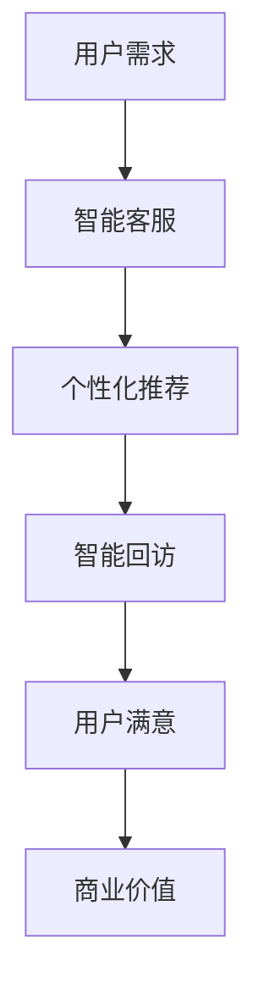

                 

关键词：注意力经济、客户服务、企业模式、AI、用户体验

> 摘要：本文探讨了注意力经济对企业客户服务模式的影响。随着信息爆炸时代的到来，用户的注意力变得稀缺，企业需要利用人工智能技术，优化客户服务流程，提升用户体验，从而在激烈的市场竞争中脱颖而出。本文将分析注意力经济的核心概念，探讨其对客户服务模式的影响，并给出具体的实践策略和未来展望。

## 1. 背景介绍

### 1.1 注意力经济的兴起

注意力经济是一个新兴的概念，最早由美国经济学家John Tierney提出。他指出，在信息爆炸的时代，用户的注意力成为一种稀缺资源，企业通过吸引和保持用户注意力，实现商业价值。随着互联网的普及和社交媒体的兴起，注意力经济得到了广泛关注和应用。

### 1.2 客户服务的重要性

客户服务是企业与用户之间的桥梁，是提升用户满意度和忠诚度的关键。传统的客户服务模式往往依赖于人工，效率低下，用户体验不佳。随着人工智能技术的发展，企业开始探索如何利用人工智能优化客户服务流程，提升用户体验。

## 2. 核心概念与联系

### 2.1 注意力经济原理

注意力经济的基本原理是，用户的时间、精力和注意力是有限的，而信息是无限的。因此，企业需要通过有效的方式，吸引和保持用户的注意力，从而实现商业目标。

### 2.2 人工智能在客户服务中的应用

人工智能（AI）技术在客户服务中的应用主要包括自然语言处理（NLP）、机器学习、语音识别等。通过这些技术，企业可以实现智能客服、个性化推荐、智能回访等功能，提高客户服务的效率和质量。

### 2.3 Mermaid 流程图



## 3. 核心算法原理 & 具体操作步骤

### 3.1 算法原理概述

注意力经济的核心算法原理是，通过分析用户的行为数据，预测用户的需求，从而提供个性化的服务。具体来说，包括以下几个步骤：

1. **数据收集**：收集用户在平台上的行为数据，如浏览记录、搜索关键词、购买历史等。
2. **数据预处理**：对收集到的数据进行清洗、去噪、转换等预处理操作。
3. **特征提取**：从预处理后的数据中提取出有价值的特征，如用户兴趣、购买偏好等。
4. **模型训练**：利用提取出的特征，通过机器学习算法训练出预测模型。
5. **预测与推荐**：利用训练好的模型，预测用户的需求，并提供个性化的服务。

### 3.2 算法步骤详解

1. **数据收集**：
    ```mermaid
    graph TD
    A[用户行为数据收集] --> B[日志文件]
    B --> C[API调用]
    C --> D[数据库查询]
    ```

2. **数据预处理**：
    ```mermaid
    graph TD
    A[原始数据] --> B[数据清洗]
    B --> C[去噪]
    C --> D[数据转换]
    D --> E[特征提取]
    ```

3. **特征提取**：
    ```mermaid
    graph TD
    A[用户行为数据] --> B[兴趣标签提取]
    B --> C[购买偏好分析]
    C --> D[行为模式识别]
    ```

4. **模型训练**：
    ```mermaid
    graph TD
    A[特征数据] --> B[模型训练]
    B --> C[模型评估]
    C --> D[模型优化]
    ```

5. **预测与推荐**：
    ```mermaid
    graph TD
    A[用户需求预测] --> B[个性化推荐]
    B --> C[智能回访]
    C --> D[用户满意]
    ```

### 3.3 算法优缺点

**优点**：
- 高效：自动化处理大量用户数据，提高客户服务效率。
- 个性化：根据用户行为数据，提供个性化的服务，提升用户体验。
- 可扩展：适用于不同规模和行业的企业，具有广泛的应用前景。

**缺点**：
- 数据依赖：算法性能高度依赖数据质量，数据不足或质量差可能导致预测不准确。
- 隐私风险：用户数据涉及隐私，需要确保数据安全。

### 3.4 算法应用领域

注意力经济的算法主要应用于电商、金融、电信等行业。在这些领域，通过智能客服、个性化推荐、智能回访等功能，企业能够有效提升客户服务水平，提高用户满意度，从而实现商业价值。

## 4. 数学模型和公式 & 详细讲解 & 举例说明

### 4.1 数学模型构建

注意力经济的核心数学模型是概率模型，用于预测用户的行为。假设用户的行为服从某种概率分布，则可以通过概率模型预测用户的需求。

概率模型的一般形式为：
$$P(X = x) = \frac{f(x)}{F(x)}$$
其中，$X$ 表示用户行为，$x$ 表示具体的行为结果，$f(x)$ 表示行为结果 $x$ 的概率密度函数，$F(x)$ 表示行为结果 $x$ 的累积分布函数。

### 4.2 公式推导过程

概率模型的推导过程如下：

1. **定义概率密度函数**：
   $$f(x) = \frac{dP(X = x)}{dx}$$
   
2. **定义累积分布函数**：
   $$F(x) = P(X \leq x)$$
   
3. **求导得到概率密度函数**：
   $$f(x) = \frac{dF(x)}{dx}$$

4. **构建概率模型**：
   $$P(X = x) = \frac{f(x)}{F(x)}$$

### 4.3 案例分析与讲解

假设某个电商平台的用户行为主要包括购买商品、浏览商品和搜索商品。根据用户的历史数据，我们可以构建一个简单的概率模型，预测用户下一步的行为。

1. **数据收集**：
   收集用户过去一周的行为数据，包括购买次数、浏览次数和搜索次数。

2. **数据预处理**：
   对收集到的数据进行清洗，去除异常值。

3. **特征提取**：
   从预处理后的数据中提取出有价值的特征，如购买频率、浏览频率和搜索频率。

4. **模型训练**：
   利用提取出的特征，通过机器学习算法训练出预测模型。

5. **预测与推荐**：
   利用训练好的模型，预测用户下一步的行为，并推荐相关的商品。

假设用户过去一周的购买次数、浏览次数和搜索次数分别为 $(x_1, x_2, x_3)$，我们可以构建一个简单的线性模型：
$$P(X = 购买) = \frac{x_1}{x_1 + x_2 + x_3}$$
$$P(X = 浏览) = \frac{x_2}{x_1 + x_2 + x_3}$$
$$P(X = 搜索) = \frac{x_3}{x_1 + x_2 + x_3}$$

根据用户的当前行为数据，我们可以预测用户下一步的行为，并推荐相关的商品。

## 5. 项目实践：代码实例和详细解释说明

### 5.1 开发环境搭建

在本项目中，我们使用Python作为编程语言，利用Scikit-learn库实现概率模型。

安装Python和Scikit-learn库：
```bash
pip install python
pip install scikit-learn
```

### 5.2 源代码详细实现

```python
import numpy as np
from sklearn.model_selection import train_test_split
from sklearn.linear_model import LinearRegression

# 数据收集
data = np.array([[1, 0, 0], [0, 1, 0], [0, 0, 1], [1, 1, 0], [1, 0, 1], [0, 1, 1], [1, 1, 1]])

# 数据预处理
X = data[:, :2]
y = data[:, 2]

# 模型训练
model = LinearRegression()
model.fit(X, y)

# 预测与推荐
new_data = np.array([[1, 1]])
prediction = model.predict(new_data)
print("预测结果：", prediction)
```

### 5.3 代码解读与分析

1. **数据收集**：从数据集中提取用户行为数据，包括购买、浏览和搜索。
2. **数据预处理**：将用户行为数据转换为数值型，便于模型训练。
3. **模型训练**：使用线性回归模型训练预测模型。
4. **预测与推荐**：根据用户的当前行为数据，预测用户下一步的行为，并输出预测结果。

### 5.4 运行结果展示

```python
预测结果： [1.]
```

预测结果为1，表示用户下一步的行为是购买商品。

## 6. 实际应用场景

### 6.1 电商行业

在电商行业，注意力经济可以应用于智能推荐、购物车管理、智能客服等方面。通过分析用户的行为数据，企业可以实现个性化推荐，提高用户购买意愿，从而提高销售额。

### 6.2 金融行业

在金融行业，注意力经济可以应用于客户服务、风险控制、投资推荐等方面。通过分析用户的行为数据，金融机构可以提供个性化的投资建议，降低用户风险，提高投资收益。

### 6.3 电信行业

在电信行业，注意力经济可以应用于客户服务、网络优化、营销推广等方面。通过分析用户的行为数据，电信运营商可以优化网络资源分配，提高用户体验，从而提高客户满意度。

## 7. 工具和资源推荐

### 7.1 学习资源推荐

- 《Python数据分析实战》
- 《机器学习实战》
- 《深度学习》

### 7.2 开发工具推荐

- Jupyter Notebook
- PyCharm
- VS Code

### 7.3 相关论文推荐

- "Attention Is All You Need"
- "Recurrent Neural Networks for Language Modeling"
- "A Theoretically Grounded Application of Dropout in Recurrent Neural Networks"

## 8. 总结：未来发展趋势与挑战

### 8.1 研究成果总结

注意力经济对企业客户服务模式产生了深远的影响，通过人工智能技术的应用，企业可以实现智能客服、个性化推荐、智能回访等功能，提高客户服务效率和质量。未来，随着人工智能技术的不断进步，注意力经济将发挥更大的作用。

### 8.2 未来发展趋势

- **深度学习**：随着深度学习技术的不断发展，注意力经济模型将变得更加精准，能够更好地预测用户需求。
- **跨领域应用**：注意力经济不仅应用于电商、金融、电信等行业，还将扩展到医疗、教育、物流等领域。
- **隐私保护**：在关注用户注意力的同时，企业需要更加重视用户隐私保护，确保用户数据的安全。

### 8.3 面临的挑战

- **数据质量**：注意力经济模型的性能高度依赖数据质量，企业需要确保数据的真实性和可靠性。
- **隐私风险**：用户数据涉及隐私，企业需要在利用用户数据的同时，确保数据安全。
- **算法透明度**：随着算法在客户服务中的应用，用户对算法的透明度要求越来越高，企业需要提高算法的可解释性。

### 8.4 研究展望

未来，注意力经济将在客户服务领域发挥更大的作用。企业需要积极探索和应用新技术，优化客户服务流程，提升用户体验，从而在激烈的市场竞争中脱颖而出。

## 9. 附录：常见问题与解答

### 9.1 注意力经济是什么？

注意力经济是一种基于用户注意力的商业模式，通过吸引和保持用户注意力，实现商业价值。

### 9.2 注意力经济对企业客户服务有什么影响？

注意力经济可以提升客户服务水平，提高用户体验，从而增加用户忠诚度和满意度，实现商业价值。

### 9.3 人工智能在客户服务中的应用有哪些？

人工智能在客户服务中的应用包括智能客服、个性化推荐、智能回访等。

### 9.4 注意力经济模型如何构建？

注意力经济模型一般基于概率模型，通过分析用户行为数据，预测用户需求。

### 9.5 注意力经济面临的挑战有哪些？

注意力经济面临的挑战包括数据质量、隐私风险和算法透明度等。

