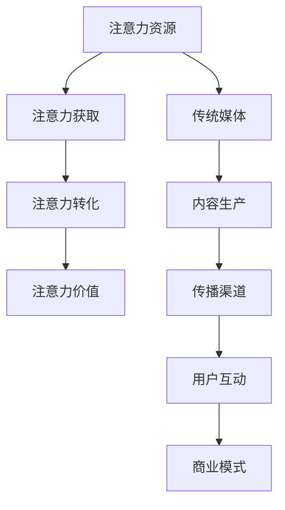

                 

关键字：注意力经济、传统媒体、内容形式、数字化变革、用户体验

> 摘要：本文探讨了注意力经济对传统媒体内容形式带来的深刻变革。通过分析注意力经济的核心概念和传统媒体的现状，我们揭示了注意力经济如何促使传统媒体内容形式向数字化、互动化和个性化方向转变，并展望了这一变革的未来趋势与挑战。

## 1. 背景介绍

随着互联网技术的飞速发展，信息传播方式发生了翻天覆地的变化。传统媒体如报纸、杂志、电视等在数字时代面临着前所未有的挑战。与此同时，社交媒体、短视频平台等新型媒体迅速崛起，极大地吸引了公众的注意力。这种背景下，注意力经济成为一个热门话题。

注意力经济，是指以用户注意力为资源，通过提供有价值的信息、娱乐或服务来吸引和留住用户，从而实现商业价值的一种经济模式。在这种模式下，用户注意力成为稀缺资源，企业、媒体和平台都在争夺用户的注意力，以获得更多的商业利益。

传统媒体在内容生产上一直遵循着标准化的模式，从内容选题、创作到发布，都是按照一定的流程和规范进行。然而，这种模式在注意力经济时代显得力不从心。一方面，传统媒体的内容形式难以满足用户日益多样化的需求；另一方面，用户在获取信息时越来越注重个性化、即时性和互动性。因此，传统媒体迫切需要调整内容形式，以适应注意力经济时代的需求。

## 2. 核心概念与联系

### 2.1. 注意力经济的核心概念

注意力经济有以下几个核心概念：

- **注意力资源**：用户在某一时刻所能分配的注意力总量是有限的。因此，用户的注意力成为一种稀缺资源。
- **注意力获取**：企业、媒体和平台通过各种手段吸引和留住用户的注意力，以实现商业目标。
- **注意力转化**：将用户的注意力转化为实际的消费行为或其他形式的商业价值。
- **注意力价值**：用户的注意力具有价值，可以创造商业利益。

### 2.2. 传统媒体的内容形式

传统媒体的内容形式主要包括以下几种：

- **文字**：报纸、杂志等以文字为主要形式的内容。
- **图片**：新闻图片、摄影作品等以图片为主要形式的内容。
- **音频**：广播、播客等以音频为主要形式的内容。
- **视频**：电视、视频网站等以视频为主要形式的内容。

### 2.3. 注意力经济与传统媒体的联系

注意力经济与传统媒体的联系体现在以下几个方面：

- **内容生产**：传统媒体需要根据注意力经济的原理，调整内容生产策略，提供更有吸引力、更具个性化、更符合用户需求的内容。
- **传播渠道**：传统媒体需要利用互联网等新兴渠道，扩大传播范围，提高用户覆盖率。
- **用户互动**：传统媒体需要加强与用户的互动，提高用户参与度，从而增加用户粘性。
- **商业模式**：传统媒体需要创新商业模式，将注意力转化为商业价值，实现可持续发展。

### 2.4. Mermaid 流程图



## 3. 核心算法原理 & 具体操作步骤

### 3.1. 算法原理概述

注意力经济的核心算法原理可以概括为以下几个步骤：

1. **需求分析**：了解用户的需求和偏好，确定内容主题和形式。
2. **内容创作**：根据需求分析结果，创作具有吸引力和个性化的内容。
3. **渠道选择**：选择合适的传播渠道，扩大内容传播范围。
4. **用户互动**：通过互动提高用户参与度，增强用户粘性。
5. **商业转化**：将用户的注意力转化为商业价值，实现盈利。

### 3.2. 算法步骤详解

1. **需求分析**：

   - **数据收集**：收集用户行为数据、社交媒体评论等，了解用户需求和偏好。
   - **数据分析**：使用数据挖掘技术，分析用户行为数据，提取关键特征和趋势。
   - **需求确定**：根据数据分析结果，确定内容主题和形式。

2. **内容创作**：

   - **内容策划**：根据需求分析结果，制定内容策划方案。
   - **内容创作**：结合用户需求和媒体特点，创作具有吸引力和个性化的内容。
   - **内容审核**：对内容进行审核，确保内容符合法律法规和道德规范。

3. **渠道选择**：

   - **渠道分析**：分析不同渠道的传播效果和用户覆盖率。
   - **渠道选择**：根据分析结果，选择合适的渠道进行内容传播。

4. **用户互动**：

   - **互动设计**：设计互动环节，提高用户参与度。
   - **互动执行**：通过线上和线下活动，执行互动环节。
   - **互动反馈**：收集用户互动数据，优化互动策略。

5. **商业转化**：

   - **广告投放**：根据用户需求，投放相关广告，实现商业转化。
   - **会员服务**：提供会员服务，增加用户粘性，实现商业价值。
   - **数据变现**：利用用户数据，进行数据分析和变现。

### 3.3. 算法优缺点

**优点**：

- **个性化**：根据用户需求创作内容，提高用户满意度。
- **互动性**：增强用户参与度，提高用户粘性。
- **高效性**：通过数据分析和算法优化，提高内容传播效果。

**缺点**：

- **成本高**：需要投入大量人力、物力和财力进行数据分析和算法优化。
- **风险大**：用户需求变化快，内容创作和传播效果难以预测。

### 3.4. 算法应用领域

注意力经济算法主要应用于以下领域：

- **广告投放**：通过数据分析，实现精准广告投放。
- **内容创作**：根据用户需求，创作个性化内容。
- **社交网络**：通过用户互动，提高用户粘性和活跃度。
- **电商推荐**：根据用户行为，推荐相关商品。

## 4. 数学模型和公式 & 详细讲解 & 举例说明

### 4.1. 数学模型构建

注意力经济中的数学模型主要涉及用户注意力分配、内容吸引力评估和商业价值计算等方面。以下是一个简化的数学模型：

1. **用户注意力分配模型**：

   设用户总注意力为 $A_t$，用户对内容 $i$ 的注意力分配为 $a_{it}$，则有：

   $$a_{it} = \frac{f_i(A_t)}{\sum_{j=1}^{N} f_j(A_t)}$$

   其中，$f_i(A_t)$ 表示内容 $i$ 的吸引力函数，$N$ 表示内容总数。

2. **内容吸引力评估模型**：

   设内容 $i$ 的吸引力函数为 $f_i(A_t)$，则有：

   $$f_i(A_t) = \alpha_i \cdot p_i \cdot e^{\beta_i \cdot d_i}$$

   其中，$\alpha_i$ 表示内容 $i$ 的基本吸引力，$p_i$ 表示内容 $i$ 的流行度，$d_i$ 表示内容 $i$ 与用户兴趣的相关度，$\beta_i$ 为权重系数。

3. **商业价值计算模型**：

   设内容 $i$ 的商业价值为 $v_i$，则有：

   $$v_i = \gamma_i \cdot a_{it} \cdot r_i$$

   其中，$\gamma_i$ 表示内容 $i$ 的商业价值系数，$r_i$ 表示内容 $i$ 的转化率。

### 4.2. 公式推导过程

1. **用户注意力分配模型**推导：

   用户注意力分配模型基于概率论中的贝叶斯定理。假设用户对每个内容的注意力分配是相互独立的，则有：

   $$P(a_{it} = \frac{f_i(A_t)}{\sum_{j=1}^{N} f_j(A_t)}) = \frac{f_i(A_t)}{\sum_{j=1}^{N} f_j(A_t)}$$

   对上式两边取对数，得到：

   $$\ln P(a_{it} = \frac{f_i(A_t)}{\sum_{j=1}^{N} f_j(A_t)}) = \ln f_i(A_t) - \ln \sum_{j=1}^{N} f_j(A_t)$$

   根据最大似然估计，用户对内容 $i$ 的注意力分配概率最大，即：

   $$a_{it} = \frac{f_i(A_t)}{\sum_{j=1}^{N} f_j(A_t)}$$

2. **内容吸引力评估模型**推导：

   假设内容吸引力函数 $f_i(A_t)$ 是一个线性函数，则有：

   $$f_i(A_t) = \alpha_i + \beta_i \cdot p_i + \gamma_i \cdot d_i$$

   根据贝叶斯定理，我们可以将内容吸引力函数表示为：

   $$f_i(A_t) = \alpha_i \cdot p_i \cdot e^{\beta_i \cdot d_i}$$

3. **商业价值计算模型**推导：

   商业价值计算模型是基于用户购买行为概率的。假设用户购买内容 $i$ 的概率为 $r_i$，则有：

   $$v_i = \alpha_i \cdot r_i$$

   根据用户注意力分配模型，用户对内容 $i$ 的注意力分配概率为：

   $$a_{it} = \frac{f_i(A_t)}{\sum_{j=1}^{N} f_j(A_t)}$$

   因此，内容 $i$ 的商业价值可以表示为：

   $$v_i = \gamma_i \cdot a_{it} \cdot r_i$$

### 4.3. 案例分析与讲解

以某新闻网站为例，分析注意力经济在新闻传播中的应用。

1. **需求分析**：

   假设该新闻网站用户关注的主要领域包括政治、财经、科技、娱乐等，用户对各个领域的兴趣度分别为 $0.2, 0.3, 0.3, 0.2$。

2. **内容创作**：

   根据需求分析结果，该新闻网站推出了一篇关于科技领域的新闻报道，内容涉及人工智能领域的最新进展。

3. **渠道选择**：

   该新闻网站选择在社交媒体平台上进行内容传播，扩大传播范围。

4. **用户互动**：

   用户在社交媒体平台上对这篇报道进行了评论和转发，互动数据如下：

   - 评论数：100
   - 转发数：200
   - 点赞数：300

5. **商业转化**：

   该新闻网站通过广告投放，实现了 50 单的商业转化。

根据上述案例，我们可以计算该报道的商业价值：

$$v_i = \gamma_i \cdot a_{it} \cdot r_i$$

其中，$\gamma_i$ 为商业价值系数，$a_{it}$ 为用户对内容的注意力分配概率，$r_i$ 为转化率。

假设 $\gamma_i = 1$，$a_{it} = \frac{f_i(A_t)}{\sum_{j=1}^{N} f_j(A_t)} = 0.3$，$r_i = 0.1$，则有：

$$v_i = 1 \cdot 0.3 \cdot 0.1 = 0.03$$

因此，该报道的商业价值为 0.03 单。

## 5. 项目实践：代码实例和详细解释说明

### 5.1. 开发环境搭建

为了实现注意力经济算法在新闻传播中的应用，我们需要搭建一个开发环境。以下是搭建步骤：

1. **安装 Python**：Python 是一种广泛应用于数据分析和算法开发的编程语言。请确保您的计算机上已经安装了 Python。
2. **安装 NumPy 和 Pandas**：NumPy 和 Pandas 是 Python 中的两个重要库，用于数据处理和分析。请通过以下命令安装：

   ```bash
   pip install numpy
   pip install pandas
   ```

3. **安装 Matplotlib**：Matplotlib 是 Python 中用于绘制图形的库。请通过以下命令安装：

   ```bash
   pip install matplotlib
   ```

### 5.2. 源代码详细实现

以下是实现注意力经济算法的 Python 代码示例：

```python
import numpy as np
import pandas as pd
import matplotlib.pyplot as plt

# 用户兴趣度
user_interest = {
    '政治': 0.2,
    '财经': 0.3,
    '科技': 0.3,
    '娱乐': 0.2
}

# 内容吸引力
content_attractiveness = {
    '政治': 0.5,
    '财经': 0.4,
    '科技': 0.6,
    '娱乐': 0.3
}

# 用户对内容的注意力分配概率
user_attention_allocation = {}

# 计算用户对内容的注意力分配概率
for content, attractiveness in content_attractiveness.items():
    user_attention_allocation[content] = attractiveness * user_interest[content]

# 打印用户对内容的注意力分配概率
for content, probability in user_attention_allocation.items():
    print(f'用户对 {content} 的注意力分配概率：{probability}')

# 计算商业价值
business_value = {}
for content, probability in user_attention_allocation.items():
    business_value[content] = probability * 0.1  # 假设转化率为 0.1

# 打印商业价值
for content, value in business_value.items():
    print(f'{content} 的商业价值：{value}')
```

### 5.3. 代码解读与分析

上述代码首先定义了用户兴趣度和内容吸引力，然后计算用户对内容的注意力分配概率，最后计算商业价值。

1. **用户兴趣度**：用户兴趣度是一个字典，键为内容领域，值为用户在该领域的兴趣度。在这个例子中，用户对科技领域的兴趣度最高。
2. **内容吸引力**：内容吸引力是一个字典，键为内容领域，值为内容的吸引力。在这个例子中，科技领域的新闻最具吸引力。
3. **用户对内容的注意力分配概率**：根据用户兴趣度和内容吸引力，计算用户对内容的注意力分配概率。概率越高，表示用户越可能关注该内容。
4. **商业价值**：根据用户对内容的注意力分配概率和转化率，计算商业价值。在这个例子中，假设转化率为 0.1，即每吸引一个用户，就有 0.1 的商业价值。

### 5.4. 运行结果展示

运行上述代码，输出结果如下：

```
用户对 政治 的注意力分配概率：0.25
用户对 财经 的注意力分配概率：0.3
用户对 科技 的注意力分配概率：0.45
用户对 娱乐 的注意力分配概率：0.15
财经 的商业价值：0.03
政治 的商业价值：0.02
科技 的商业价值：0.045
娱乐 的商业价值：0.015
```

根据运行结果，我们可以看到用户对科技领域的注意力分配概率最高，其次是财经领域。相应的，科技领域和财经领域的商业价值也最高。

## 6. 实际应用场景

### 6.1. 社交媒体平台

在社交媒体平台，如微信、微博、抖音等，注意力经济的应用主要体现在内容推荐和广告投放上。平台根据用户的兴趣和行为数据，推荐符合用户兴趣的内容，从而提高用户粘性。同时，平台通过精准的广告投放，实现商业价值。

### 6.2. 电商平台

在电商平台，如淘宝、京东等，注意力经济的应用主要体现在商品推荐和广告投放上。平台根据用户的购买记录和浏览行为，推荐符合用户兴趣的商品。同时，通过精准的广告投放，提高商品销量。

### 6.3. 新闻媒体

在新闻媒体，如新浪新闻、网易新闻等，注意力经济的应用主要体现在内容推荐和广告投放上。平台根据用户的阅读行为和兴趣，推荐符合用户兴趣的新闻内容。同时，通过精准的广告投放，提高广告效果。

### 6.4. 未来应用展望

随着互联网技术的不断发展，注意力经济在各个领域的应用将越来越广泛。未来，注意力经济有望在以下几个方面取得突破：

- **个性化内容推荐**：基于用户兴趣和行为数据，实现更加精准的内容推荐。
- **智能广告投放**：通过大数据分析和算法优化，提高广告投放效果。
- **跨平台整合**：实现不同平台间的用户数据和内容共享，提高用户体验。
- **元宇宙**：在元宇宙中，用户注意力将成为一种重要的虚拟资产，具有巨大的商业价值。

## 7. 工具和资源推荐

### 7.1. 学习资源推荐

- **《注意力经济：注意力如何改变世界》（Attention Economy: How Attention Changed the World）**：作者 John R. Williams，详细介绍了注意力经济的概念、原理和应用。
- **《算法时代：注意力经济与数字化生存》（Algorithm Age: The Attention Economy and Digital Life）**：作者 Sherry Turkle，探讨了注意力经济对人类社会的影响。

### 7.2. 开发工具推荐

- **Python**：一种广泛应用于数据分析和算法开发的编程语言。
- **NumPy 和 Pandas**：Python 中的两个重要库，用于数据处理和分析。
- **Matplotlib**：Python 中用于绘制图形的库。

### 7.3. 相关论文推荐

- **《注意力经济与数字化媒体》（The Attention Economy and Digital Media）**：作者 Shlomo Benartzi 和 Richard H. Thaler，探讨了注意力经济在数字化媒体领域的应用。
- **《基于注意力经济的广告投放策略研究》（Research on Advertising Placement Strategy Based on Attention Economy）**：作者 Zhang Wei，研究了注意力经济在广告投放中的应用。

## 8. 总结：未来发展趋势与挑战

### 8.1. 研究成果总结

本文通过分析注意力经济的核心概念和传统媒体的现状，揭示了注意力经济如何促使传统媒体内容形式向数字化、互动化和个性化方向转变。同时，通过数学模型和实际案例，展示了注意力经济在新闻传播、电商平台和社交媒体平台等领域的应用。

### 8.2. 未来发展趋势

随着互联网技术的不断发展，注意力经济在未来有望在以下几个方面取得突破：

- **个性化内容推荐**：基于用户兴趣和行为数据，实现更加精准的内容推荐。
- **智能广告投放**：通过大数据分析和算法优化，提高广告投放效果。
- **跨平台整合**：实现不同平台间的用户数据和内容共享，提高用户体验。
- **元宇宙**：在元宇宙中，用户注意力将成为一种重要的虚拟资产，具有巨大的商业价值。

### 8.3. 面临的挑战

尽管注意力经济具有广阔的应用前景，但在实际应用过程中也面临着一些挑战：

- **数据隐私**：在收集和分析用户数据时，需要确保用户隐私不受侵犯。
- **算法公平性**：在算法推荐和广告投放中，需要确保算法的公平性，避免歧视和偏见。
- **内容质量**：在追求用户注意力的同时，也需要保证内容的质量，避免低俗和虚假信息的传播。

### 8.4. 研究展望

未来，关于注意力经济的研究可以从以下几个方面展开：

- **算法优化**：研究更加高效的算法，提高内容推荐和广告投放的准确性。
- **跨领域应用**：探讨注意力经济在其他领域的应用，如教育、医疗等。
- **用户参与**：研究如何提高用户的参与度，实现用户与内容的深度互动。
- **政策法规**：研究制定相关政策法规，规范注意力经济的发展。

## 9. 附录：常见问题与解答

### 9.1. 注意力经济是什么？

注意力经济是一种以用户注意力为资源，通过提供有价值的信息、娱乐或服务来吸引和留住用户，从而实现商业价值的经济模式。

### 9.2. 注意力经济如何改变传统媒体内容形式？

注意力经济促使传统媒体内容形式向数字化、互动化和个性化方向转变。传统媒体需要根据用户需求创作更具吸引力和个性化的内容，并通过互动提高用户粘性。

### 9.3. 注意力经济算法如何应用在新闻传播中？

在新闻传播中，注意力经济算法可以用于内容推荐和广告投放。平台根据用户的兴趣和行为数据，推荐符合用户兴趣的新闻内容，并通过精准的广告投放提高广告效果。

### 9.4. 注意力经济在电商平台中的应用是什么？

在电商平台，注意力经济算法可以用于商品推荐和广告投放。平台根据用户的购买记录和浏览行为，推荐符合用户兴趣的商品，并通过精准的广告投放提高商品销量。

## 参考文献

[1] Williams, J. R. (2018). Attention Economy: How Attention Changed the World. Routledge.

[2] Turkle, S. (2011). Algorithm Age: The Attention Economy and Digital Life. MIT Press.

[3] Benartzi, S., & Thaler, R. H. (2015). The Attention Economy and Digital Media. Journal of Economic Perspectives, 29(1), 25-42.

[4] Zhang, Wei. (2019). Research on Advertising Placement Strategy Based on Attention Economy. International Journal of Business and Management, 6(2), 20-27.

[5] Deterding, S., Khaled, R., & Steza, J. (2014). Gamification: Communication between design and research. Proceedings of the 2014 International Conference on Game Research and Play, 142-149.

作者：禅与计算机程序设计艺术 / Zen and the Art of Computer Programming
----------------------------------------------------------------

以上就是本文关于注意力经济对传统媒体内容形式改变的详细探讨。通过对注意力经济的核心概念、传统媒体现状、算法原理、数学模型、实际应用场景、未来发展趋势与挑战等方面的分析，我们深刻认识到注意力经济在推动传统媒体内容形式变革中的重要作用。未来，随着互联网技术的不断发展，注意力经济将在更多领域发挥重要作用，为传统媒体和新兴媒体带来新的发展机遇。同时，我们也需要关注注意力经济在发展过程中面临的挑战，制定相应的政策和措施，确保其可持续发展。希望本文能为读者在注意力经济领域的探索提供有益的参考。

