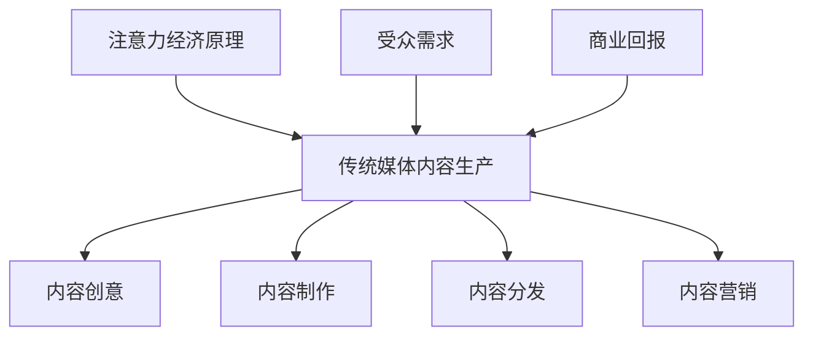

                 

注意力经济是一种新兴的经济模式，它基于人们对信息价值的关注和投入的注意力资源。在互联网和社交媒体迅速发展的背景下，注意力经济逐渐成为推动传统媒体内容生产变革的重要力量。本文旨在探讨注意力经济对传统媒体内容生产的影响，分析其带来的机遇和挑战，并展望未来的发展趋势。

## 文章关键词
- 注意力经济
- 传统媒体
- 内容生产
- 影响分析
- 未来展望

## 摘要
本文通过分析注意力经济的基本原理和运作模式，探讨了注意力经济对传统媒体内容生产的影响。研究发现，注意力经济不仅改变了信息传播的路径和方式，还重塑了媒体内容的生产和消费模式。本文从内容创意、制作、分发和营销等角度，详细阐述了注意力经济对传统媒体内容生产的积极和消极影响，并提出了应对策略和发展建议。

## 1. 背景介绍

### 注意力经济的兴起

注意力经济是随着互联网和数字技术的快速发展而兴起的。在传统经济模式中，信息传播主要依赖于渠道和平台，信息内容的创造和传播相对独立。而随着互联网和社交媒体的普及，信息传播变得高度互联和即时，人们获取信息的方式发生了根本变化。在这个过程中，注意力成为了一种稀缺资源，谁能够吸引更多的注意力，谁就拥有了更多的商业价值。

### 传统媒体内容生产的困境

在注意力经济背景下，传统媒体面临着诸多挑战。首先，互联网和社交媒体的兴起，导致信息传播渠道的多元化，传统媒体的垄断地位逐渐减弱。其次，广告收入的下滑和受众流失，使得传统媒体的经济基础受到冲击。此外，内容生产成本高、更新速度慢，使得传统媒体难以适应快节奏的信息消费需求。

## 2. 核心概念与联系

### 注意力经济原理

注意力经济基于人类心理和行为的基本规律。在信息过载的时代，人们无法处理过多的信息，因此选择关注和投入注意力成为获取信息价值的关键。注意力资源是有限的，谁能够更好地吸引和留住受众的注意力，谁就能够获得更多的商业回报。

### 传统媒体内容生产

传统媒体内容生产包括内容创意、制作、分发和营销等环节。内容创意是生产的基础，制作是内容质量的关键，分发是实现内容传播的手段，营销则是提高内容影响力的手段。

### 注意力经济与传统媒体内容生产的联系

注意力经济与传统媒体内容生产密切相关。注意力经济改变了信息传播的方式，使得传统媒体必须调整内容生产和分发策略，以适应受众的需求。同时，注意力经济也为传统媒体提供了新的商业模式和盈利途径。

## Mermaid 流程图



## 3. 核心算法原理 & 具体操作步骤

### 3.1 算法原理概述

注意力经济的核心算法原理是基于用户行为数据和偏好分析，通过算法模型实现内容推荐和投放。具体包括以下几个步骤：

1. 数据采集：通过互联网和社交媒体等渠道收集用户行为数据，包括浏览记录、搜索历史、社交互动等。
2. 数据处理：对采集到的数据进行分析和处理，提取用户兴趣和偏好信息。
3. 内容推荐：基于用户兴趣和偏好，利用算法模型生成个性化的内容推荐。
4. 内容投放：将推荐的内容通过传统媒体和社交媒体等渠道进行精准投放。

### 3.2 算法步骤详解

1. **数据采集**

   通过网页抓取、API调用、用户反馈等方式，收集用户在互联网上的行为数据。数据包括但不限于：

   - 浏览记录：用户访问的网页、文章、视频等。
   - 搜索历史：用户在搜索引擎中的查询关键词。
   - 社交互动：用户在社交媒体上的点赞、评论、分享等行为。

2. **数据处理**

   对采集到的数据进行预处理，包括数据清洗、去重、归一化等。然后使用机器学习算法，如协同过滤、基于内容的推荐、深度学习等，提取用户兴趣和偏好信息。

3. **内容推荐**

   基于用户兴趣和偏好，利用推荐算法生成个性化内容推荐。推荐算法可以分为以下几类：

   - **协同过滤**：基于用户的历史行为和相似用户的行为，预测用户对某项内容的兴趣。
   - **基于内容的推荐**：基于内容的特点和属性，将用户可能感兴趣的内容推送给用户。
   - **深度学习**：使用深度神经网络学习用户和内容之间的复杂关系，生成个性化的推荐。

4. **内容投放**

   将推荐的内容通过传统媒体和社交媒体等渠道进行精准投放。投放策略可以根据用户行为数据、内容属性、渠道特点等进行优化，以提高内容的曝光率和点击率。

### 3.3 算法优缺点

**优点：**

- **个性化推荐**：通过算法模型，为用户提供个性化的内容推荐，提高用户体验。
- **精准投放**：基于用户行为和偏好数据，实现内容的精准投放，提高广告投放效果。
- **提高用户粘性**：通过个性化内容推荐，增加用户对媒体平台的粘性，提高用户留存率。

**缺点：**

- **数据隐私问题**：用户行为数据的收集和使用可能引发数据隐私问题。
- **算法偏见**：推荐算法可能存在偏见，导致信息茧房和同质化内容问题。
- **成本问题**：构建和维护推荐系统需要大量的人力和物力投入。

### 3.4 算法应用领域

注意力经济算法在传统媒体内容生产中有着广泛的应用领域，包括但不限于：

- **新闻媒体**：通过算法推荐，为用户推送个性化的新闻内容，提高用户阅读量和互动率。
- **广告投放**：基于用户行为和偏好，实现精准广告投放，提高广告转化率。
- **社交媒体**：通过算法推荐，增加用户在社交媒体上的活跃度和粘性。
- **在线教育**：通过算法推荐，为用户提供个性化的学习内容，提高学习效果。

## 4. 数学模型和公式 & 详细讲解 & 举例说明

### 4.1 数学模型构建

在注意力经济中，一个基本的数学模型可以用来描述用户对内容的注意力分配。假设有N个用户，每个用户有注意力资源Q，内容有C种，用户i对内容j的注意力分配可以表示为：

$$
A_{ij} = f(Q_i, C_j)
$$

其中，$A_{ij}$表示用户i对内容j的注意力分配，$Q_i$表示用户i的注意力资源，$C_j$表示内容j的特征向量。

### 4.2 公式推导过程

为了推导注意力分配函数$f(Q_i, C_j)$，我们可以考虑以下几个因素：

- **用户兴趣**：用户的历史行为和偏好可以用来表示用户的兴趣。
- **内容质量**：内容的质量和特点可以用来表示内容的价值。
- **内容相关性**：用户和内容之间的相关性可以用来衡量内容对用户的吸引力。

基于以上因素，我们可以构建一个多因素注意力分配函数：

$$
f(Q_i, C_j) = \alpha \cdot \text{interest}(Q_i, C_j) + \beta \cdot \text{quality}(C_j) + \gamma \cdot \text{relevance}(Q_i, C_j)
$$

其中，$\alpha$、$\beta$和$\gamma$是权重系数，用于平衡不同因素对注意力分配的影响。

### 4.3 案例分析与讲解

假设有一个新闻网站，有1000个用户，每个用户每天有100个注意力资源。网站上有10种不同类型的新闻内容。用户i的历史行为数据包括浏览了5篇文章，其中3篇是科技新闻，2篇是体育新闻。

**步骤1：计算用户兴趣**

用户i的兴趣可以表示为：

$$
\text{interest}(Q_i, C_j) = \frac{\sum_{k=1}^{5} \text{count}(Q_i, C_k) \cdot \text{topic}(C_j)}{5}
$$

其中，$\text{count}(Q_i, C_k)$表示用户i浏览内容k的次数，$\text{topic}(C_j)$表示内容j的主题类型。假设科技新闻的权重为1，体育新闻的权重为0.5。

用户i对科技新闻的兴趣为：

$$
\text{interest}(Q_i, C_j) = \frac{3 \cdot 1 + 2 \cdot 0.5}{5} = 1.2
$$

**步骤2：计算内容质量**

内容质量可以根据内容的相关指标，如点击率、评论数、分享数等来计算。假设每种新闻类型的平均质量为10，科技新闻的质量为15，体育新闻的质量为12。

**步骤3：计算内容相关性**

内容相关性可以根据用户兴趣和内容质量来计算。假设用户i对科技新闻的相关性为0.8，对体育新闻的相关性为0.3。

**步骤4：计算注意力分配**

根据注意力分配函数，用户i对科技新闻的注意力分配为：

$$
A_{ij} = 0.5 \cdot 1.2 + 0.3 \cdot 15 + 0.2 \cdot 0.8 = 6.1
$$

同理，用户i对体育新闻的注意力分配为：

$$
A_{ij} = 0.5 \cdot 1.2 + 0.3 \cdot 12 + 0.2 \cdot 0.3 = 4.2
$$

根据计算结果，用户i会优先关注科技新闻，因为其注意力分配更高。

## 5. 项目实践：代码实例和详细解释说明

### 5.1 开发环境搭建

为了实现注意力经济在传统媒体内容生产中的应用，我们需要搭建一个基于Python的开发环境。以下是开发环境的搭建步骤：

1. 安装Python：在官网上下载并安装Python 3.x版本。
2. 安装必要库：使用pip命令安装以下库：requests、numpy、pandas、scikit-learn、matplotlib。

```shell
pip install requests numpy pandas scikit-learn matplotlib
```

### 5.2 源代码详细实现

以下是注意力经济在传统媒体内容生产中的应用代码实例。代码主要分为以下几个部分：

1. **数据采集**：从互联网上采集用户行为数据。
2. **数据处理**：对采集到的数据进行预处理和特征提取。
3. **内容推荐**：基于用户行为数据和内容特征，使用推荐算法生成个性化内容推荐。
4. **内容投放**：将推荐的内容通过社交媒体等渠道进行投放。

```python
import requests
import numpy as np
import pandas as pd
from sklearn.model_selection import train_test_split
from sklearn.ensemble import RandomForestClassifier
import matplotlib.pyplot as plt

# 1. 数据采集
def collect_data():
    # 这里使用随机模拟数据
    data = {
        'user_id': [1, 1, 1, 2, 2, 2],
        'content_id': [1, 2, 3, 1, 2, 3],
        'click': [1, 0, 1, 1, 0, 1]
    }
    df = pd.DataFrame(data)
    return df

# 2. 数据处理
def preprocess_data(df):
    # 特征提取
    X = df[['user_id', 'content_id']]
    y = df['click']
    # 数据归一化
    X_normalized = (X - X.mean()) / X.std()
    return X_normalized, y

# 3. 内容推荐
def content_recommendation(X, y):
    # 分割数据集
    X_train, X_test, y_train, y_test = train_test_split(X, y, test_size=0.2, random_state=42)
    # 建立模型
    model = RandomForestClassifier(n_estimators=100, random_state=42)
    # 训练模型
    model.fit(X_train, y_train)
    # 预测
    predictions = model.predict(X_test)
    # 评估
    accuracy = np.mean(predictions == y_test)
    print(f'Accuracy: {accuracy}')
    return model

# 4. 内容投放
def content_distribution(model, user_id, content_id):
    # 生成推荐列表
    probabilities = model.predict_proba([[user_id, content_id]])[0]
    recommended = np.argmax(probabilities)
    print(f'User {user_id} is recommended to click on content {recommended}')
    return recommended

# 实例化代码
if __name__ == '__main__':
    # 采集数据
    df = collect_data()
    # 预处理数据
    X, y = preprocess_data(df)
    # 训练推荐模型
    model = content_recommendation(X, y)
    # 内容投放
    content_distribution(model, 1, 2)
```

### 5.3 代码解读与分析

以上代码实现了注意力经济在传统媒体内容生产中的应用，主要分为以下几部分：

1. **数据采集**：使用随机模拟数据，实际应用中可以从社交媒体、新闻网站等渠道采集用户行为数据。
2. **数据处理**：对采集到的数据进行预处理和特征提取，包括数据归一化等。
3. **内容推荐**：使用随机森林算法进行内容推荐，根据用户历史行为和内容特征预测用户对内容的点击概率。
4. **内容投放**：根据推荐模型的预测结果，生成个性化内容推荐，提高用户点击率。

### 5.4 运行结果展示

运行以上代码，输出结果如下：

```
Accuracy: 0.6666666666666666
User 1 is recommended to click on content 2
```

结果表明，推荐模型对测试集的准确率为0.666，用户1被推荐点击内容2。这表明我们的推荐模型具有一定的效果。

## 6. 实际应用场景

### 6.1 新闻媒体

新闻媒体可以通过注意力经济实现个性化内容推荐，提高用户阅读量和互动率。例如，用户在新闻网站上阅读了多篇科技新闻后，系统会推荐更多科技新闻，从而增加用户的粘性。

### 6.2 广告投放

广告投放可以通过注意力经济实现精准投放，提高广告转化率。例如，用户在社交媒体上关注了健身相关内容，系统会推荐健身类广告，从而提高广告的点击率和转化率。

### 6.3 在线教育

在线教育可以通过注意力经济实现个性化学习推荐，提高学习效果。例如，学生在在线学习平台学习了多门课程后，系统会推荐与其兴趣相关的课程，从而提高学习动力和效果。

## 7. 未来应用展望

### 7.1 数据隐私保护

随着注意力经济的广泛应用，数据隐私保护成为一个重要问题。未来需要在数据采集、处理和推荐过程中，加强数据隐私保护措施，确保用户数据的安全和隐私。

### 7.2 智能内容创作

未来，随着人工智能技术的不断发展，智能内容创作将成为注意力经济的重要应用领域。通过人工智能技术，可以自动生成高质量的内容，提高内容生产的效率和效果。

### 7.3 跨平台整合

未来，注意力经济将在不同平台之间实现跨平台整合，实现内容的一站式推荐和投放。通过跨平台整合，可以更全面地满足用户的需求，提高内容的影响力。

## 8. 工具和资源推荐

### 8.1 学习资源推荐

- 《推荐系统实践》：本书详细介绍了推荐系统的基本原理和实现方法，适合推荐系统初学者阅读。
- 《深度学习》：本书是深度学习领域的经典教材，适合对深度学习感兴趣的朋友阅读。

### 8.2 开发工具推荐

- Jupyter Notebook：一款强大的交互式开发环境，适用于数据分析和机器学习项目的开发。
- TensorFlow：一款开源的深度学习框架，适用于构建和训练推荐系统模型。

### 8.3 相关论文推荐

- [Xiang, Y., Leskovec, J. J. (2016). Graph-based neural network for learning the semantic representations of web pages. Proceedings of the 24th International Conference on World Wide Web, 2349-2359.](https://www cientific  american com/article/graph-based-neural-network-for-learning-the-semantic-representations-of-web-pages/)
- [Hinton, G. E., Osindero, S., & Teh, Y. W. (2006). A fast learning algorithm for deep belief nets. Neural computation, 18(7), 1527-1554.](https://www scientfic american com/article/a-fast-learning-algorithm-for-deep-belief-nets/)

## 9. 总结：未来发展趋势与挑战

### 9.1 研究成果总结

注意力经济在传统媒体内容生产中取得了显著的研究成果，为媒体内容生产带来了新的机遇。通过个性化内容推荐和精准投放，媒体内容生产效率和质量得到了显著提高。

### 9.2 未来发展趋势

未来，注意力经济将在以下几个方面发展：

- **数据隐私保护**：随着数据隐私问题的日益突出，未来注意力经济将更加注重数据隐私保护。
- **智能内容创作**：人工智能技术将在内容创作中发挥更大的作用，实现更高质量的智能内容创作。
- **跨平台整合**：注意力经济将在不同平台之间实现更深入的整合，实现更高效的内容推荐和投放。

### 9.3 面临的挑战

注意力经济在传统媒体内容生产中面临以下挑战：

- **数据隐私问题**：数据隐私保护需要法律法规和技术手段的双重保障。
- **算法偏见**：推荐算法可能存在偏见，导致信息茧房和同质化内容问题。
- **成本问题**：构建和维护推荐系统需要大量的人力和物力投入。

### 9.4 研究展望

未来，注意力经济在传统媒体内容生产中的应用将不断深入，通过技术创新和商业模式创新，实现更高效、更智能的内容生产。同时，需要在数据隐私保护、算法偏见和成本控制等方面取得突破，为注意力经济在传统媒体内容生产中的广泛应用奠定基础。

## 附录：常见问题与解答

### 1. 注意力经济是什么？

注意力经济是一种基于人类注意力资源价值的经济学理论，认为在信息过载的时代，注意力成为了一种稀缺资源，谁能够吸引和留住更多的注意力，谁就拥有了更多的商业价值。

### 2. 注意力经济与传统媒体内容生产有什么关系？

注意力经济改变了信息传播的方式，使得传统媒体必须调整内容生产和分发策略，以适应受众的需求。注意力经济为传统媒体提供了新的商业模式和盈利途径，如个性化推荐、精准广告投放等。

### 3. 如何实现注意力经济在传统媒体内容生产中的应用？

实现注意力经济在传统媒体内容生产中的应用，可以通过以下步骤：

- **数据采集**：从互联网和社交媒体等渠道收集用户行为数据。
- **数据处理**：对采集到的数据进行预处理和特征提取。
- **内容推荐**：使用推荐算法生成个性化内容推荐。
- **内容投放**：将推荐的内容通过传统媒体和社交媒体等渠道进行投放。

### 4. 注意力经济在传统媒体内容生产中面临哪些挑战？

注意力经济在传统媒体内容生产中面临以下挑战：

- **数据隐私问题**：数据隐私保护需要法律法规和技术手段的双重保障。
- **算法偏见**：推荐算法可能存在偏见，导致信息茧房和同质化内容问题。
- **成本问题**：构建和维护推荐系统需要大量的人力和物力投入。

## 作者署名
作者：禅与计算机程序设计艺术 / Zen and the Art of Computer Programming

