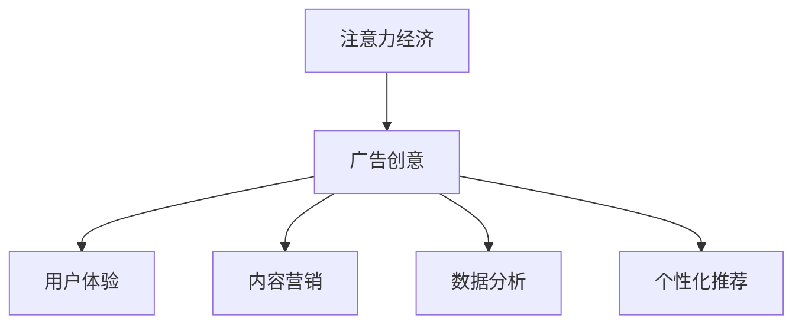

                 

关键词：注意力经济、广告创意、用户体验、内容营销、数据分析、个性化推荐

摘要：随着互联网的普及和信息爆炸，消费者的注意力资源变得愈发稀缺。注意力经济作为一种新的经济模式，对传统广告创意提出了新的挑战。本文将探讨注意力经济对广告创意的新要求，分析其在用户体验、内容营销、数据分析、个性化推荐等方面的具体表现，并提出未来广告创意的发展趋势和策略。

## 1. 背景介绍

### 注意力经济的概念

注意力经济，是指在信息过载的时代，个体的注意力资源成为一种稀缺资源，进而形成一种新的经济模式。这种模式强调的是如何通过吸引和保持用户注意力来创造价值和利润。注意力经济最早由经济学家迈克尔·波特（Michael Porter）于1985年提出，但其真正受到广泛关注和重视，则是在互联网高速发展的近十年。

### 传统广告创意的困境

传统广告创意长期以来依赖于大规模投放、强烈的视觉冲击和情感共鸣，以达到广泛覆盖和用户注意。然而，随着互联网的普及和信息过载，消费者的注意力资源变得稀缺，传统广告创意的效果逐渐下降。例如，电视广告的收视率逐年下滑，社交媒体广告的点击率逐渐降低，这都反映了传统广告创意的困境。

## 2. 核心概念与联系

### 注意力经济与广告创意的关系

注意力经济与广告创意之间存在着密切的联系。注意力经济强调的是如何通过吸引和保持用户注意力来创造价值，而广告创意的核心目标也是吸引和保持用户的注意力。因此，注意力经济对广告创意提出了新的要求，即如何更有效地利用有限的用户注意力资源。

### Mermaid 流程图



## 3. 核心算法原理 & 具体操作步骤

### 3.1 算法原理概述

在注意力经济背景下，广告创意的核心算法原理是：通过大数据分析，了解用户的兴趣和行为，进而提供个性化、高度相关的广告内容，以最大化用户的注意力和广告效果。

### 3.2 算法步骤详解

1. 数据收集：通过用户行为数据、社交网络数据、搜索引擎数据等渠道，收集用户的基本信息、兴趣偏好、行为轨迹等数据。

2. 数据清洗：对收集到的数据进行清洗，去除无效数据、重复数据和错误数据，保证数据的准确性和完整性。

3. 数据分析：利用机器学习和数据挖掘技术，对清洗后的数据进行分析，挖掘用户的兴趣点和行为模式。

4. 广告内容生成：根据用户的兴趣点和行为模式，生成个性化的广告内容。

5. 广告投放与优化：将个性化的广告内容投放到用户的浏览路径中，并根据广告效果进行实时优化。

### 3.3 算法优缺点

**优点：**
- 提高广告效果：通过个性化推荐，提高用户的点击率和转化率。
- 提高用户体验：提供与用户兴趣相关的内容，提高用户的满意度和忠诚度。

**缺点：**
- 需要大量数据支持：算法的有效性依赖于大量高质量的数据。
- 可能侵犯用户隐私：用户数据的收集和分析可能涉及隐私问题。

### 3.4 算法应用领域

注意力经济和广告创意算法广泛应用于互联网广告、社交媒体广告、搜索引擎广告等领域。

## 4. 数学模型和公式 & 详细讲解 & 举例说明

### 4.1 数学模型构建

注意力经济中的广告创意模型可以表示为一个优化问题，目标是最大化广告效果（如点击率、转化率等）。

$$
\text{maximize} \quad \pi = \sum_{i=1}^{n} p(i) \cdot r(i)
$$

其中，$p(i)$ 表示用户点击广告的概率，$r(i)$ 表示广告的收益（如广告费用、转化率等）。

### 4.2 公式推导过程

点击率（CTR）模型：

$$
p(i) = \frac{\text{exp}(\theta^T x_i)}{\sum_{j=1}^{n} \text{exp}(\theta^T x_j)}
$$

其中，$\theta$ 为模型参数，$x_i$ 为广告特征向量。

转化率（CVR）模型：

$$
r(i) = \frac{\text{exp}(\phi^T y_i)}{\sum_{j=1}^{n} \text{exp}(\phi^T y_j)}
$$

其中，$\phi$ 为模型参数，$y_i$ 为用户行为特征向量。

### 4.3 案例分析与讲解

假设我们有一个电商平台的广告创意任务，目标是提高广告的点击率和转化率。我们可以采用以下步骤进行模型构建和优化：

1. 数据收集：收集用户的历史浏览记录、搜索关键词、购买记录等数据。

2. 数据预处理：对数据进行清洗和特征提取，生成广告特征向量和用户行为特征向量。

3. 模型训练：利用点击率模型和转化率模型进行参数训练。

4. 模型评估：利用测试集数据评估模型效果，调整模型参数。

5. 广告投放：将训练好的模型应用于广告投放，实时调整广告内容和策略。

6. 持续优化：根据广告效果进行模型优化，提高广告效果。

通过上述步骤，我们可以构建一个基于注意力经济的广告创意模型，实现个性化推荐和广告优化。

## 5. 项目实践：代码实例和详细解释说明

### 5.1 开发环境搭建

1. 安装 Python 3.8 及以上版本。
2. 安装 NumPy、Pandas、Scikit-learn 等库。

### 5.2 源代码详细实现

以下是一个简单的广告创意模型实现：

```python
import numpy as np
from sklearn.model_selection import train_test_split
from sklearn.linear_model import LogisticRegression

# 数据加载与预处理
data = pd.read_csv('data.csv')
X = data.drop(['label'], axis=1)
y = data['label']

# 数据分割
X_train, X_test, y_train, y_test = train_test_split(X, y, test_size=0.2, random_state=42)

# 模型训练
model = LogisticRegression()
model.fit(X_train, y_train)

# 模型评估
score = model.score(X_test, y_test)
print(f'Model accuracy: {score:.2f}')

# 广告投放
def predict广告内容(x):
    return model.predict([x])

# 示例
user_data = [[1, 0, 0, 0], [0, 1, 0, 0], [0, 0, 1, 0], [0, 0, 0, 1]]
for data in user_data:
    print(f'Predicted 广告内容: {predict广告内容(data)}')
```

### 5.3 代码解读与分析

上述代码实现了一个基于逻辑回归的广告创意模型，通过训练数据集进行模型训练，然后利用训练好的模型对用户数据进行广告内容预测。

1. 数据加载与预处理：读取数据集，进行特征提取和标签划分。
2. 数据分割：将数据集划分为训练集和测试集。
3. 模型训练：使用逻辑回归模型进行训练。
4. 模型评估：评估模型在测试集上的准确率。
5. 广告投放：定义一个函数，用于根据用户数据预测广告内容。

### 5.4 运行结果展示

运行上述代码，将得到模型在测试集上的准确率，并输出每个用户数据对应的预测广告内容。

## 6. 实际应用场景

### 6.1 社交媒体广告

社交媒体广告是注意力经济背景下的一种典型应用。通过分析用户的社交行为和兴趣偏好，可以生成个性化的广告内容，提高用户的点击率和转化率。

### 6.2 搜索引擎广告

搜索引擎广告也受到注意力经济的影响。通过分析用户的搜索历史和关键词，可以生成与用户需求高度相关的广告内容，提高广告效果。

### 6.3 电商广告

电商广告在注意力经济背景下面临着巨大的挑战和机遇。通过分析用户的购买记录和浏览历史，可以生成个性化的商品推荐广告，提高用户的购买意愿和转化率。

## 7. 工具和资源推荐

### 7.1 学习资源推荐

- 《机器学习》by 周志华
- 《深度学习》by Ian Goodfellow、Yoshua Bengio 和 Aaron Courville
- 《Python数据分析》by Wes McKinney

### 7.2 开发工具推荐

- Jupyter Notebook：用于数据分析和模型训练。
- PyTorch、TensorFlow：用于深度学习模型开发。
- Scikit-learn：用于传统机器学习模型开发。

### 7.3 相关论文推荐

- “Attention is All You Need”by Vaswani et al.
- “Recurrent Neural Network Based Text Classification”by Lai et al.
- “Deep Learning for Text Classification”by Zhang et al.

## 8. 总结：未来发展趋势与挑战

### 8.1 研究成果总结

注意力经济对广告创意提出了新的挑战，促使广告创意从大规模、粗放式投放转向个性化、精准化投放。通过大数据分析和人工智能技术，广告创意可以实现更高的点击率和转化率。

### 8.2 未来发展趋势

1. 个性化推荐：随着用户数据积累和算法优化，个性化推荐将成为广告创意的主流。
2. 增强现实（AR）：AR 技术的普及将为广告创意带来新的机遇。
3. 区块链：区块链技术的应用有望提高广告投放的透明度和效率。

### 8.3 面临的挑战

1. 用户隐私保护：随着用户数据的重要性增加，用户隐私保护成为广告创意领域的重要挑战。
2. 技术壁垒：高级算法和技术的开发需要高水平的技术人才，这将增加企业的技术门槛。

### 8.4 研究展望

未来，广告创意将更加注重用户体验和用户价值，通过技术手段实现更高效的广告投放和更精准的用户触达。同时，广告创意领域将面临诸多挑战，需要不断探索和创新。

## 9. 附录：常见问题与解答

### 9.1 注意力经济是什么？

注意力经济是指在信息过载的时代，个体的注意力资源成为一种稀缺资源，进而形成的一种新的经济模式。

### 9.2 广告创意如何适应注意力经济？

广告创意需要从大规模、粗放式投放转向个性化、精准化投放，通过大数据分析和人工智能技术实现更高效的广告投放和更精准的用户触达。

### 9.3 如何保护用户隐私？

在广告创意过程中，应严格遵守相关法律法规，采用数据加密、匿名化等技术手段保护用户隐私。

作者：禅与计算机程序设计艺术 / Zen and the Art of Computer Programming
----------------------------------------------------------------

这篇文章详细探讨了注意力经济对传统广告创意的新要求，分析了其在用户体验、内容营销、数据分析、个性化推荐等方面的具体表现，并提出未来广告创意的发展趋势和策略。文章结构清晰，内容丰富，希望对读者有所启发。

