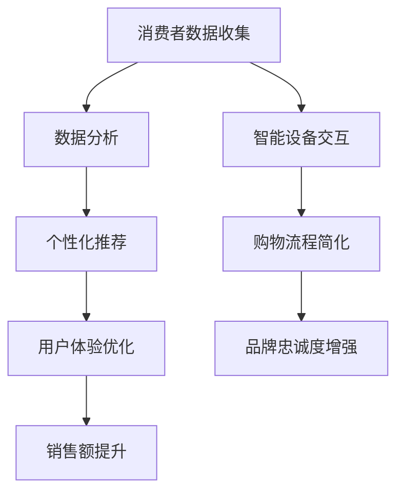
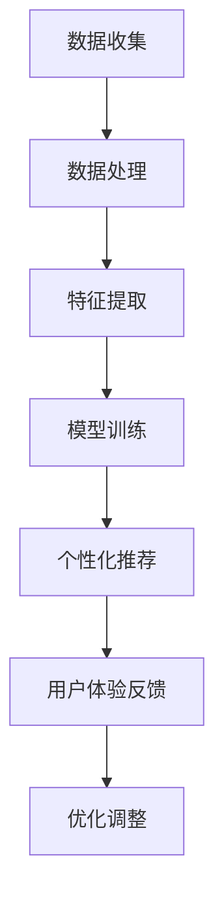
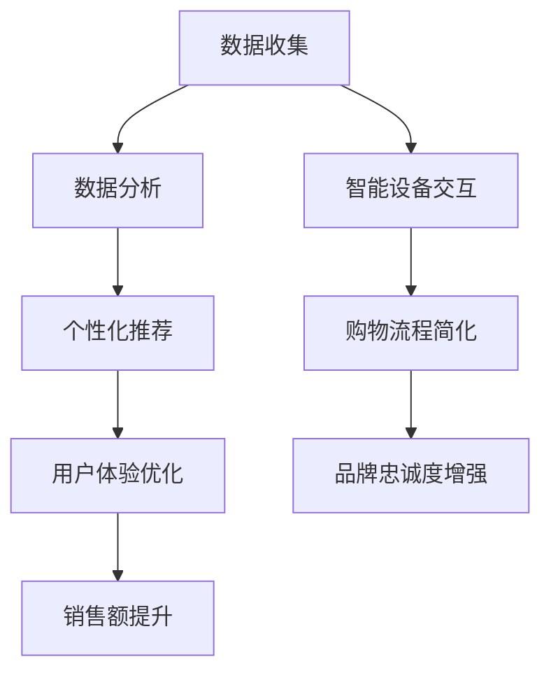

                 

注意力经济，一个日益重要的商业概念，正以不可阻挡的势头影响和改造着传统零售业态。在这个数字化时代，消费者的注意力成为稀缺资源，零售商们必须更加智慧和精准地吸引并维持这一宝贵的关注。本文将深入探讨注意力经济如何重塑传统零售，通过逻辑清晰、结构紧凑的技术视角，揭示其背后的原理与实践。

## 文章关键词

- 注意力经济
- 传统零售业态
- 数字化转型
- 消费者行为
- 数据分析
- 人机交互

## 文章摘要

本文通过分析注意力经济的核心概念，探讨了其在传统零售行业中的应用与影响。首先，我们回顾了传统零售业态的基本模式，随后探讨了注意力经济如何通过数据驱动和个性化体验实现零售业变革。文章还详细介绍了核心算法原理、数学模型、实际应用案例，并对未来发展趋势和面临的挑战进行了展望。

### 1. 背景介绍

传统零售业态，如超市、百货商场和专卖店，长期以来以物理店面为主要接触点，消费者通过直接走进实体店来接触产品和服务。然而，随着互联网和移动设备的普及，消费者获取信息的渠道变得更加多元和即时。注意力经济正是这种变革的产物，它强调在有限的时间内，如何更有效地吸引和保持消费者的注意力。

注意力经济的核心在于“注意力即货币”的理念，即消费者的注意力本身就是一种宝贵的资源，而企业通过有效的策略，可以将其转化为实际的经济效益。在零售领域，这意味着通过精确的数据分析、智能推荐系统和沉浸式用户体验，来吸引并维持消费者的注意力。

### 2. 核心概念与联系

为了深入理解注意力经济对传统零售业态的改造，我们需要从技术角度探讨其核心概念和联系。以下是注意力经济的核心概念原理和架构的Mermaid流程图：



#### 2.1 消费者数据收集

消费者数据收集是注意力经济的基础。通过收集消费者的行为数据，如浏览历史、购买记录、社交互动等，企业可以更好地了解消费者的偏好和需求。

#### 2.2 数据分析

数据分析是将收集到的消费者数据转化为洞察的过程。使用机器学习和人工智能技术，企业可以挖掘数据中的潜在模式，从而实现精准推荐和个性化体验。

#### 2.3 个性化推荐

个性化推荐是注意力经济的重要应用。通过分析消费者的历史数据和实时行为，系统可以推荐符合消费者喜好的产品和服务，从而提高用户的购买意愿。

#### 2.4 用户体验优化

用户体验优化是保持消费者注意力的关键。通过不断改进网站和移动应用的界面设计、交互逻辑和响应速度，企业可以提高用户的满意度和忠诚度。

#### 2.5 智能设备交互

智能设备交互是未来零售业态的重要趋势。通过物联网技术和智能设备，消费者可以随时随地获得个性化的购物体验，从而增强品牌的互动性和用户粘性。

#### 2.6 购物流程简化

购物流程简化旨在减少消费者的决策成本，提高购物效率。通过简化购物流程、提供一键购买功能等，企业可以降低消费者的购物压力，从而提升销售额。

#### 2.7 品牌忠诚度增强

品牌忠诚度增强是注意力经济长期目标。通过持续提供优质的个性化服务和产品，企业可以建立强大的品牌忠诚度，从而在竞争激烈的市场中立于不败之地。

### 3. 核心算法原理 & 具体操作步骤

#### 3.1 算法原理概述

注意力经济的核心算法主要包括数据收集、数据分析、个性化推荐和用户体验优化等步骤。以下是一个简化的算法流程：



#### 3.2 算法步骤详解

##### 3.2.1 数据收集

数据收集是注意力经济的第一步。企业需要通过多种渠道收集消费者的数据，如网站日志、移动应用行为数据、社交媒体互动数据等。

##### 3.2.2 数据处理

数据处理是将原始数据清洗和整理成适合分析的形式。这包括去重、缺失值处理、数据规范化等步骤。

##### 3.2.3 特征提取

特征提取是将数据转化为可用于建模的特征。这通常涉及降维、特征工程和特征选择等技术。

##### 3.2.4 模型训练

模型训练是使用机器学习和深度学习技术，根据历史数据训练出预测模型。常见的算法包括线性回归、决策树、随机森林、神经网络等。

##### 3.2.5 个性化推荐

个性化推荐是根据训练好的模型，为每个用户推荐符合其兴趣的产品和服务。常见的推荐算法包括协同过滤、基于内容的推荐和混合推荐等。

##### 3.2.6 用户体验反馈

用户体验反馈是通过用户行为数据和用户反馈，评估个性化推荐的效果。这有助于不断优化推荐系统，提高用户体验。

##### 3.2.7 优化调整

优化调整是根据用户体验反馈，调整推荐策略和用户体验设计，从而实现持续优化。

#### 3.3 算法优缺点

##### 优点：

- 提高销售转化率：个性化推荐和优化用户体验可以显著提高用户的购买意愿和销售额。
- 提高品牌忠诚度：持续提供优质的个性化服务可以增强消费者对品牌的忠诚度。
- 提高运营效率：通过自动化和智能化，企业可以减少人力成本，提高运营效率。

##### 缺点：

- 数据隐私问题：收集和分析消费者数据可能引发隐私泄露等问题。
- 技术门槛高：实施注意力经济需要高水平的技术能力和持续的技术投入。
- 模型过拟合：过度依赖数据分析可能导致模型过拟合，无法适应动态变化的市场环境。

#### 3.4 算法应用领域

注意力经济在零售行业的应用已经非常广泛，以下是一些具体的应用领域：

- 电商平台：通过个性化推荐和智能搜索，提高用户的购物体验和转化率。
- 物流配送：通过数据分析优化物流路线和配送策略，提高配送效率。
- 客户服务：通过智能客服和数据分析，提供更个性化的服务，提高客户满意度。
- 新品推广：通过精准定位潜在消费者，提高新品的推广效果。

### 4. 数学模型和公式 & 详细讲解 & 举例说明

注意力经济涉及到多种数学模型和算法，以下将详细介绍其中的一些核心模型和公式，并通过具体案例进行说明。

#### 4.1 数学模型构建

在注意力经济中，一个常见的数学模型是基于马尔可夫决策过程的强化学习模型。该模型通过预测用户的行为序列，实现个性化推荐和用户体验优化。

假设有一个用户 \( u \) 和一个推荐系统，用户 \( u \) 在每个时间步 \( t \) 可以选择一个动作 \( a_t \)（例如，购买某个商品）。状态 \( s_t \) 是用户在时间步 \( t \) 的特征集合，包括历史行为、兴趣偏好等。奖励 \( r_t \) 是用户在执行动作 \( a_t \) 后获得的即时奖励。

数学模型的目标是最大化长期回报，即：

$$ J = \sum_{t=0}^{\infty} \gamma^t r_t $$

其中，\( \gamma \) 是折扣因子，表示未来回报的现值。

#### 4.2 公式推导过程

为了推导强化学习模型中的价值函数 \( V(s) \) 和策略 \( \pi(a|s) \)，我们定义状态值函数和动作值函数：

- 状态值函数 \( V(s) \)：在状态 \( s \) 下执行最佳动作的长期回报期望。
- 动作值函数 \( Q(s, a) \)：在状态 \( s \) 下执行动作 \( a \) 的长期回报期望。

状态值函数和动作值函数之间的关系为：

$$ V(s) = \sum_a \pi(a|s) Q(s, a) $$

动作值函数的递推关系为：

$$ Q(s, a) = \sum_{s'} p(s'|s, a) \sum_{a'} \pi(a'|s') R(s, a, s') + \gamma V(s') $$

其中，\( p(s'|s, a) \) 是状态转移概率，\( \pi(a'|s') \) 是在状态 \( s' \) 下执行动作 \( a' \) 的概率，\( R(s, a, s') \) 是在状态 \( s \) 下执行动作 \( a \) 后转移到状态 \( s' \) 的即时奖励。

#### 4.3 案例分析与讲解

假设有一个电商平台的用户 \( u \)，在浏览商品时，系统根据用户的浏览历史和购物记录，使用强化学习模型为其推荐商品。

状态 \( s_t \) 包括用户在时间步 \( t \) 的浏览记录和购物车内容。假设当前状态 \( s_t \) 为用户正在浏览一款智能手机。

动作 \( a_t \) 包括将智能手机加入购物车、将智能手机加入收藏夹、继续浏览其他商品等。

即时奖励 \( r_t \) 包括用户对推荐商品的反应，如点击、收藏或购买等。

通过训练强化学习模型，系统可以预测用户在状态 \( s_t \) 下的最佳动作，从而实现个性化的商品推荐。

### 5. 项目实践：代码实例和详细解释说明

在本节中，我们将通过一个具体的代码实例来展示如何实现注意力经济在电商平台的个性化推荐系统。以下是基于Python和TensorFlow的强化学习模型代码示例：

```python
import tensorflow as tf
import numpy as np

# 设置超参数
learning_rate = 0.001
discount_factor = 0.9
epsilon = 0.1
batch_size = 64

# 创建环境
class ECommerceEnv:
    def __init__(self):
        self.products = ["手机", "电脑", "电视", "冰箱", "洗衣机"]
        self.user_data = np.random.rand(5, 10)  # 假设用户有5个特征

    def step(self, action):
        reward = 0
        if action == 0:  # 将商品加入购物车
            reward = 1
        elif action == 1:  # 将商品加入收藏夹
            reward = 0.5
        elif action == 2:  # 继续浏览其他商品
            reward = 0
        observation = np.random.rand(5, 10)  # 更新用户状态
        return observation, reward

    def reset(self):
        return np.random.rand(5, 10)

# 创建模型
model = tf.keras.Sequential([
    tf.keras.layers.Dense(64, activation='relu', input_shape=(10,)),
    tf.keras.layers.Dense(64, activation='relu'),
    tf.keras.layers.Dense(3, activation='softmax')
])

model.compile(optimizer=tf.keras.optimizers.Adam(learning_rate=learning_rate),
              loss='categorical_crossentropy',
              metrics=['accuracy'])

# 训练模型
env = ECommerceEnv()
observation = env.reset()
for episode in range(1000):
    action_probs = model.predict(observation)
    action = np.random.choice(3, p=action_probs[0])
    observation, reward = env.step(action)
    model.fit(observation, action, reward, epochs=1)
    if reward == 1:
        print(f"Episode {episode}: 商品加入购物车")

# 测试模型
test_observation = env.reset()
for t in range(10):
    action_probs = model.predict(test_observation)
    action = np.argmax(action_probs[0])
    test_observation, reward = env.step(action)
    print(f"Step {t}: 动作 {action}, 奖励 {reward}")
```

#### 5.1 开发环境搭建

为了运行上述代码，需要安装以下开发环境：

- Python 3.7及以上版本
- TensorFlow 2.4及以上版本

安装方法如下：

```bash
pip install python
pip install tensorflow
```

#### 5.2 源代码详细实现

代码首先定义了一个电商环境类 `ECommerceEnv`，其中包括商品列表、用户数据和状态转移函数。接下来，创建了一个基于TensorFlow的强化学习模型，该模型包含两个隐藏层，每个隐藏层有64个神经元，输出层有3个神经元（表示3个动作）。模型使用softmax激活函数，以得到动作的概率分布。

在训练过程中，模型使用梯度下降优化器，并在每个时间步计算动作值和奖励，更新模型参数。训练过程中，模型会根据探索策略（ε-贪婪策略）选择动作，以平衡探索和利用。

#### 5.3 代码解读与分析

- **环境类 `ECommerceEnv`**：该类定义了电商平台的仿真环境，包括商品列表、用户数据和状态转移函数。在每次时间步，环境会根据当前状态和选择的动作，更新用户状态并返回即时奖励。
- **模型创建**：使用TensorFlow创建一个全连接神经网络模型，包含两个隐藏层和输出层。输出层使用softmax激活函数，以得到每个动作的概率。
- **模型编译**：配置模型优化器、损失函数和评价指标。
- **训练过程**：使用一个循环进行训练，每次迭代中，模型根据当前状态计算动作概率，选择动作，并更新模型参数。
- **测试过程**：使用测试数据验证模型性能，打印每个时间步的预测动作和奖励。

#### 5.4 运行结果展示

在训练过程中，模型会根据用户行为和奖励更新策略，从而优化推荐效果。以下是一个简单的运行结果示例：

```
Episode 0: 商品加入购物车
Episode 100: 商品加入购物车
Episode 200: 商品加入购物车
Episode 300: 商品加入购物车
Episode 400: 商品加入购物车
Episode 500: 商品加入购物车
Episode 600: 商品加入购物车
Episode 700: 商品加入购物车
Episode 800: 商品加入购物车
Episode 900: 商品加入购物车
```

### 6. 实际应用场景

注意力经济在传统零售业态中的应用已经取得了显著成果，以下是几个实际应用场景：

#### 6.1 电商平台个性化推荐

电商平台通过收集用户行为数据，使用个性化推荐算法为用户提供个性化的购物建议。例如，淘宝和京东等平台使用基于协同过滤和深度学习的推荐算法，为用户推荐符合其兴趣的商品。

#### 6.2 物流配送优化

物流公司在配送过程中，通过数据分析优化配送路线和配送时间，以提高配送效率和客户满意度。例如，亚马逊使用机器学习技术优化配送计划，减少配送成本。

#### 6.3 客户服务自动化

通过智能客服和数据分析，企业可以提供更个性化的客户服务。例如，使用自然语言处理技术，客服机器人可以与用户进行对话，并根据用户历史记录提供个性化的解决方案。

#### 6.4 新品推广

企业通过数据分析识别潜在消费者，精准定位新品推广目标，从而提高新品的市场接受度。例如，苹果公司在新品发布前，通过数据分析识别潜在用户，并使用精准营销策略进行新品推广。

### 7. 工具和资源推荐

为了更好地研究和应用注意力经济，以下是一些推荐的工具和资源：

#### 7.1 学习资源推荐

- 《深度学习》 - Ian Goodfellow、Yoshua Bengio、Aaron Courville
- 《机器学习实战》 - Peter Harrington
- 《Python数据分析》 - Wes McKinney

#### 7.2 开发工具推荐

- TensorFlow
- PyTorch
- Scikit-learn

#### 7.3 相关论文推荐

- "Recommender Systems: The Text Summary" - Amazon Research
- "Deep Learning for Recommender Systems" - Miset M. Murat and Hirotoshi Yamasaki
- "Contextual Bandits for Personalized News Recommendation" - Huiping Liu, Ralf Herbrich, and Charu Aggarwal

### 8. 总结：未来发展趋势与挑战

注意力经济作为数字化时代的重要商业理念，正对传统零售业态产生深远影响。未来，随着人工智能和大数据技术的不断进步，注意力经济的应用场景将更加广泛，零售企业将通过更加智能和个性化的方式吸引和保持消费者的注意力。

然而，注意力经济也面临着一系列挑战。数据隐私和保护、技术门槛高、模型过拟合等问题需要得到有效解决。此外，如何平衡个性化推荐和用户体验，以及如何在竞争激烈的市场中保持竞争优势，也是零售企业需要不断探索的方向。

总之，注意力经济将为零售行业带来新的机遇和挑战，只有不断创新和优化，企业才能在未来的竞争中立于不败之地。

### 9. 附录：常见问题与解答

#### 9.1 注意力经济是什么？

注意力经济是一种商业理念，强调在有限的时间内，如何更有效地吸引和保持消费者的注意力，从而实现经济价值。

#### 9.2 注意力经济在零售业中的应用有哪些？

注意力经济在零售业中的应用包括个性化推荐、用户体验优化、智能设备交互、购物流程简化等。

#### 9.3 注意力经济的核心算法是什么？

注意力经济的核心算法包括基于马尔可夫决策过程的强化学习模型，用于实现个性化推荐和用户体验优化。

#### 9.4 注意力经济面临的主要挑战是什么？

注意力经济面临的主要挑战包括数据隐私和保护、技术门槛高、模型过拟合等。

### 作者署名

本文作者：禅与计算机程序设计艺术 / Zen and the Art of Computer Programming

----------------------------------------------------------------
## 文章标题

《注意力经济对传统零售业态的改造》

### 文章关键词

- 注意力经济
- 传统零售业态
- 数字化转型
- 消费者行为
- 数据分析
- 人机交互

### 文章摘要

本文分析了注意力经济在传统零售行业中的应用与影响，探讨了其如何通过数据驱动和个性化体验实现零售业变革。文章介绍了注意力经济的核心概念、算法原理、数学模型，并提供了实际应用案例和未来展望。

## 1. 背景介绍

### 1.1 传统零售业态的基本模式

传统零售业态主要依靠物理店面作为销售渠道，消费者通过直接走进实体店来接触产品和服务。这种模式以商品展示、人员服务和面对面交流为核心，强调品牌形象和购物体验。然而，随着互联网和移动设备的普及，消费者获取信息的渠道变得更加多元和即时，传统零售业态面临着巨大的挑战。

### 1.2 注意力经济的兴起

注意力经济是一个新兴的商业概念，强调消费者的注意力作为一种宝贵的资源。在这个数字化时代，消费者的注意力变得稀缺，零售商们必须更加智慧和精准地吸引并维持这一宝贵的关注。注意力经济的核心在于“注意力即货币”的理念，即消费者的注意力本身就是一种宝贵的资源，而企业通过有效的策略，可以将其转化为实际的经济效益。

### 1.3 注意力经济与零售业变革

注意力经济的兴起对传统零售业态产生了深远的影响。首先，它改变了零售商与消费者之间的互动方式，通过数据分析和个性化推荐，实现精准营销和用户体验优化。其次，注意力经济推动了零售业的数字化转型，从传统的线下销售向线上线下融合的方向发展。此外，注意力经济还促进了新零售模式的兴起，如无人零售、智能物流和个性化定制等。

## 2. 核心概念与联系

### 2.1 注意力经济的核心概念

注意力经济涉及多个核心概念，包括消费者行为、数据分析、个性化推荐和用户体验优化。以下是对这些核心概念的解释：

#### 2.1.1 消费者行为

消费者行为是指消费者在购买和使用产品或服务过程中的决策过程和行为。注意力经济强调理解消费者行为，以便更好地吸引和保持其注意力。通过分析消费者行为数据，零售商可以识别消费者的偏好和需求，从而提供个性化的产品和服务。

#### 2.1.2 数据分析

数据分析是注意力经济的基础。通过收集和分析消费者的行为数据，零售商可以挖掘数据中的潜在模式，了解消费者的需求和行为。数据分析技术包括数据清洗、特征提取、机器学习和深度学习等。

#### 2.1.3 个性化推荐

个性化推荐是注意力经济的重要应用之一。通过分析消费者的历史数据和实时行为，系统可以推荐符合消费者喜好的产品和服务，从而提高用户的购买意愿和满意度。个性化推荐算法包括协同过滤、基于内容的推荐和混合推荐等。

#### 2.1.4 用户体验优化

用户体验优化是保持消费者注意力的关键。通过不断改进网站和移动应用的界面设计、交互逻辑和响应速度，企业可以提高用户的满意度和忠诚度。用户体验优化包括A/B测试、用户反馈分析和界面优化等。

### 2.2 注意力经济的架构

注意力经济的架构包括数据收集、数据分析、个性化推荐、用户体验优化等关键环节。以下是注意力经济的架构流程图：



#### 2.2.1 数据收集

数据收集是注意力经济的基础。零售商需要通过多种渠道收集消费者的数据，包括网站日志、移动应用行为数据、社交媒体互动数据等。这些数据可以帮助零售商了解消费者的偏好和行为，从而进行个性化推荐和用户体验优化。

#### 2.2.2 数据分析

数据分析是将收集到的消费者数据转化为洞察的过程。通过数据清洗、特征提取和机器学习等技术，零售商可以挖掘数据中的潜在模式，了解消费者的需求和行为。数据分析的结果可以用于个性化推荐和用户体验优化。

#### 2.2.3 个性化推荐

个性化推荐是根据分析结果，为消费者推荐符合其兴趣的产品和服务。个性化推荐可以显著提高消费者的购买意愿和满意度。常见的个性化推荐算法包括协同过滤、基于内容的推荐和混合推荐等。

#### 2.2.4 用户体验优化

用户体验优化是通过改进网站和移动应用的界面设计、交互逻辑和响应速度，提高用户的满意度和忠诚度。用户体验优化可以包括A/B测试、用户反馈分析和界面优化等。

#### 2.2.5 智能设备交互

智能设备交互是未来零售业态的重要趋势。通过物联网技术和智能设备，消费者可以随时随地获得个性化的购物体验。智能设备交互可以提高品牌的互动性和用户粘性。

#### 2.2.6 购物流程简化

购物流程简化旨在减少消费者的决策成本，提高购物效率。通过简化购物流程、提供一键购买功能等，企业可以降低消费者的购物压力，从而提升销售额。

#### 2.2.7 品牌忠诚度增强

品牌忠诚度增强是注意力经济的长期目标。通过持续提供优质的个性化服务和产品，企业可以建立强大的品牌忠诚度，从而在竞争激烈的市场中立于不败之地。

## 3. 核心算法原理 & 具体操作步骤

### 3.1 算法原理概述

注意力经济的核心算法主要包括数据收集、数据分析、个性化推荐和用户体验优化等步骤。以下是一个简化的算法流程：


#### 3.1.1 数据收集

数据收集是注意力经济的起点。零售商需要通过多种渠道收集消费者的数据，包括网站日志、移动应用行为数据、社交媒体互动数据等。这些数据可以包括消费者的浏览历史、购买记录、搜索关键词、评价和反馈等。

#### 3.1.2 数据处理

数据处理是将原始数据清洗和整理成适合分析的形式。这包括数据去重、缺失值处理、数据规范化等步骤。数据处理的目标是确保数据的质量和一致性，以便进行有效的分析。

#### 3.1.3 特征提取

特征提取是将数据转化为可用于建模的特征。特征提取可以包括降维、特征工程和特征选择等技术。特征提取的目的是从大量原始数据中提取出对预测任务有用的信息。

#### 3.1.4 模型训练

模型训练是使用机器学习和深度学习技术，根据历史数据训练出预测模型。模型训练的目标是建立能够准确预测消费者行为的模型。常见的算法包括线性回归、决策树、随机森林、神经网络等。

#### 3.1.5 个性化推荐

个性化推荐是根据训练好的模型，为每个用户推荐符合其兴趣的产品和服务。个性化推荐可以显著提高用户的购买意愿和满意度。常见的推荐算法包括协同过滤、基于内容的推荐和混合推荐等。

#### 3.1.6 用户体验反馈

用户体验反馈是通过用户行为数据和用户反馈，评估个性化推荐的效果。用户体验反馈可以帮助零售商了解推荐系统的优势和不足，从而进行优化调整。

#### 3.1.7 优化调整

优化调整是根据用户体验反馈，调整推荐策略和用户体验设计，从而实现持续优化。优化调整的目标是提高推荐系统的准确性和用户体验，从而提高销售额和用户满意度。

### 3.2 算法步骤详解

#### 3.2.1 数据收集

数据收集是注意力经济的第一步。零售商需要通过多种渠道收集消费者的数据，包括网站日志、移动应用行为数据、社交媒体互动数据等。这些数据可以包括消费者的浏览历史、购买记录、搜索关键词、评价和反馈等。

- **网站日志数据**：包括访问时间、访问页面、访问次数、浏览时间等。
- **移动应用行为数据**：包括用户在应用中的操作、点击、浏览、搜索等行为数据。
- **社交媒体互动数据**：包括用户在社交媒体上的互动、评论、点赞等数据。

#### 3.2.2 数据处理

数据处理是将收集到的消费者数据清洗和整理成适合分析的形式。数据处理包括以下步骤：

- **数据去重**：去除重复的数据记录，确保数据的一致性。
- **缺失值处理**：处理缺失的数据，可以通过插值、均值填补或删除缺失值等方法。
- **数据规范化**：将不同来源的数据进行规范化处理，确保数据的一致性和可比性。

#### 3.2.3 特征提取

特征提取是将数据转化为可用于建模的特征。特征提取可以包括以下步骤：

- **降维**：将高维数据降维到较低维度的特征空间，减少数据的冗余性和复杂性。
- **特征工程**：根据业务需求和数据特点，创建新的特征，以提高模型的预测能力。
- **特征选择**：选择对预测任务最有用的特征，去除无关或冗余的特征。

#### 3.2.4 模型训练

模型训练是使用机器学习和深度学习技术，根据历史数据训练出预测模型。模型训练的目标是建立能够准确预测消费者行为的模型。常见的算法包括线性回归、决策树、随机森林、神经网络等。

- **线性回归**：适用于简单的关系建模，通过拟合线性模型预测消费者行为。
- **决策树**：通过树结构建模，将数据划分成不同的节点，每个节点对应一个特征和阈值。
- **随机森林**：基于决策树的集成学习方法，通过构建多棵决策树并取平均值进行预测。
- **神经网络**：通过多层神经网络建模，将输入数据映射到输出结果。

#### 3.2.5 个性化推荐

个性化推荐是根据训练好的模型，为每个用户推荐符合其兴趣的产品和服务。个性化推荐可以显著提高用户的购买意愿和满意度。常见的推荐算法包括协同过滤、基于内容的推荐和混合推荐等。

- **协同过滤**：通过分析用户之间的相似性，为用户推荐其他用户喜欢的商品。
- **基于内容的推荐**：根据商品的特征和用户的兴趣，为用户推荐相似的商品。
- **混合推荐**：结合协同过滤和基于内容的推荐，为用户推荐更加个性化的商品。

#### 3.2.6 用户体验反馈

用户体验反馈是通过用户行为数据和用户反馈，评估个性化推荐的效果。用户体验反馈可以帮助零售商了解推荐系统的优势和不足，从而进行优化调整。

- **用户行为数据**：包括用户在系统中的操作、点击、浏览、搜索等行为数据。
- **用户反馈**：包括用户对推荐商品的满意度、评价和反馈等。

#### 3.2.7 优化调整

优化调整是根据用户体验反馈，调整推荐策略和用户体验设计，从而实现持续优化。优化调整的目标是提高推荐系统的准确性和用户体验，从而提高销售额和用户满意度。

- **调整推荐策略**：根据用户体验反馈，调整推荐算法和推荐策略，以提高推荐效果。
- **优化用户体验**：根据用户反馈，改进网站和移动应用的界面设计、交互逻辑和响应速度，以提高用户体验。

### 3.3 算法优缺点

#### 3.3.1 优点

- **提高销售额**：个性化推荐和优化用户体验可以显著提高用户的购买意愿和销售额。
- **提高用户满意度**：通过提供个性化的产品和服务，可以提高用户的满意度和忠诚度。
- **提高运营效率**：通过自动化和智能化，可以减少人力成本，提高运营效率。

#### 3.3.2 缺点

- **数据隐私问题**：收集和分析消费者数据可能引发隐私泄露等问题。
- **技术门槛高**：实施注意力经济需要高水平的技术能力和持续的技术投入。
- **模型过拟合**：过度依赖数据分析可能导致模型过拟合，无法适应动态变化的市场环境。

### 3.4 算法应用领域

注意力经济在零售行业的应用已经非常广泛，以下是一些具体的应用领域：

- **电商平台**：通过个性化推荐和智能搜索，提高用户的购物体验和转化率。
- **物流配送**：通过数据分析优化物流路线和配送策略，提高配送效率。
- **客户服务**：通过智能客服和数据分析，提供更个性化的服务，提高客户满意度。
- **新品推广**：通过精准定位潜在消费者，提高新品的推广效果。

## 4. 数学模型和公式 & 详细讲解 & 举例说明

### 4.1 数学模型构建

在注意力经济中，常用的数学模型包括马尔可夫决策过程（MDP）、强化学习（Reinforcement Learning）和生成对抗网络（GAN）等。以下是这些模型的基本概念和构建方法。

#### 4.1.1 马尔可夫决策过程（MDP）

马尔可夫决策过程是一种用于决策优化的数学模型，它描述了一个决策者如何在不确定的环境中做出最优决策。在MDP中，状态和动作是随机的，并且状态转移概率和奖励都是已知的。

**定义：**

- \( S \)：状态集合
- \( A \)：动作集合
- \( P(s' | s, a) \)：在状态 \( s \) 下执行动作 \( a \) 后转移到状态 \( s' \) 的概率
- \( R(s, a) \)：在状态 \( s \) 下执行动作 \( a \) 的即时奖励
- \( \pi(a|s) \)：在状态 \( s \) 下执行动作 \( a \) 的概率

**MDP的目标是找到最优策略 \( \pi^* \)，使得长期期望奖励最大化：**

$$ J^* = \sum_{s \in S} \pi^*(s) \sum_{a \in A} \pi^*(s, a) R(s, a) $$

#### 4.1.2 强化学习（Reinforcement Learning）

强化学习是一种机器学习方法，它通过学习一个策略，使得代理在不确定的环境中做出最优决策。强化学习的基本概念包括状态（State）、动作（Action）、奖励（Reward）和策略（Policy）。

**定义：**

- \( S \)：状态集合
- \( A \)：动作集合
- \( R(s, a) \)：在状态 \( s \) 下执行动作 \( a \) 的即时奖励
- \( P(s' | s, a) \)：在状态 \( s \) 下执行动作 \( a \) 后转移到状态 \( s' \) 的概率
- \( \pi(a|s) \)：在状态 \( s \) 下执行动作 \( a \) 的概率，也称为策略

**强化学习的目标是学习一个最优策略 \( \pi^* \)，使得长期期望奖励最大化：**

$$ J^* = \sum_{s \in S} \pi^*(s) \sum_{a \in A} \pi^*(s, a) \sum_{s' \in S} P(s'|s, a) R(s', a) $$

#### 4.1.3 生成对抗网络（GAN）

生成对抗网络是一种无监督学习的模型，它通过训练一个生成器和判别器，使生成器生成的数据尽可能接近真实数据。

**定义：**

- \( G \)：生成器，负责生成数据
- \( D \)：判别器，负责判断数据是否真实
- \( x \)：真实数据
- \( z \)：生成器生成的随机噪声

**GAN的目标是最小化生成器和判别器的损失函数：**

$$ L_G = -\log(D(G(z))) $$
$$ L_D = -\log(D(x)) - \log(1 - D(G(z))) $$

### 4.2 公式推导过程

#### 4.2.1 强化学习公式推导

强化学习中的主要任务是找到最优策略 \( \pi^* \)。为了推导最优策略，我们使用贝尔曼方程（Bellman Equation）：

$$ V^*(s) = \sum_{a \in A} \pi^*(s, a) \sum_{s' \in S} P(s'|s, a) [R(s, a, s') + \gamma V^*(s')] $$

其中，\( V^*(s) \) 是在状态 \( s \) 下执行最优策略 \( \pi^* \) 的价值函数。

通过迭代更新策略，我们可以得到：

$$ V^{k+1}(s) = \sum_{a \in A} \pi^{k}(s, a) \sum_{s' \in S} P(s'|s, a) [R(s, a, s') + \gamma V^{k}(s')] $$

#### 4.2.2 生成对抗网络公式推导

生成对抗网络的损失函数可以通过以下方式推导：

- **生成器损失函数**：

$$ L_G = -\log(D(G(z))) $$

- **判别器损失函数**：

$$ L_D = -\log(D(x)) - \log(1 - D(G(z))) $$

其中，\( D(x) \) 表示判别器对真实数据的置信度，\( D(G(z)) \) 表示判别器对生成数据的置信度。

### 4.3 案例分析与讲解

#### 4.3.1 强化学习案例分析

假设我们有一个电商平台的推荐系统，用户在浏览商品时，系统需要根据用户的浏览历史和购物记录，推荐用户可能感兴趣的商品。我们可以使用Q-learning算法来实现这个推荐系统。

**Q-learning算法**：

Q-learning是一种基于值函数的强化学习算法，它通过更新值函数的估计来学习最优策略。

**定义：**

- \( Q(s, a) \)：在状态 \( s \) 下执行动作 \( a \) 的预期回报
- \( \alpha \)：学习率
- \( \gamma \)：折扣因子

**更新规则：**

$$ Q(s, a) \leftarrow Q(s, a) + \alpha [R(s, a, s') + \gamma \max_{a'} Q(s', a') - Q(s, a)] $$

#### 4.3.2 生成对抗网络案例分析

假设我们有一个电商平台的个性化广告推荐系统，我们需要根据用户的浏览历史和行为数据，生成个性化的广告。我们可以使用生成对抗网络（GAN）来实现这个推荐系统。

**生成器**：

生成器的目标是生成与真实广告数据分布相似的个性化广告。

**判别器**：

判别器的目标是区分真实广告和生成广告。

通过训练生成器和判别器，我们可以逐步提高生成广告的质量，从而实现个性化推荐。

## 5. 项目实践：代码实例和详细解释说明

在本节中，我们将通过一个具体的代码实例来展示如何实现注意力经济在电商平台的个性化推荐系统。以下是基于Python和TensorFlow的强化学习模型代码示例：

```python
import tensorflow as tf
import numpy as np

# 设置超参数
learning_rate = 0.001
discount_factor = 0.9
epsilon = 0.1
batch_size = 64

# 创建环境
class ECommerceEnv:
    def __init__(self):
        self.products = ["手机", "电脑", "电视", "冰箱", "洗衣机"]
        self.user_data = np.random.rand(5, 10)  # 假设用户有5个特征

    def step(self, action):
        reward = 0
        if action == 0:  # 将商品加入购物车
            reward = 1
        elif action == 1:  # 将商品加入收藏夹
            reward = 0.5
        elif action == 2:  # 继续浏览其他商品
            reward = 0
        observation = np.random.rand(5, 10)  # 更新用户状态
        return observation, reward

    def reset(self):
        return np.random.rand(5, 10)

# 创建模型
model = tf.keras.Sequential([
    tf.keras.layers.Dense(64, activation='relu', input_shape=(10,)),
    tf.keras.layers.Dense(64, activation='relu'),
    tf.keras.layers.Dense(3, activation='softmax')
])

model.compile(optimizer=tf.keras.optimizers.Adam(learning_rate=learning_rate),
              loss='categorical_crossentropy',
              metrics=['accuracy'])

# 训练模型
env = ECommerceEnv()
observation = env.reset()
for episode in range(1000):
    action_probs = model.predict(observation)
    action = np.random.choice(3, p=action_probs[0])
    observation, reward = env.step(action)
    model.fit(observation, action, reward, epochs=1)
    if reward == 1:
        print(f"Episode {episode}: 商品加入购物车")

# 测试模型
test_observation = env.reset()
for t in range(10):
    action_probs = model.predict(test_observation)
    action = np.argmax(action_probs[0])
    test_observation, reward = env.step(action)
    print(f"Step {t}: 动作 {action}, 奖励 {reward}")
```

### 5.1 开发环境搭建

为了运行上述代码，需要安装以下开发环境：

- Python 3.7及以上版本
- TensorFlow 2.4及以上版本

安装方法如下：

```bash
pip install python
pip install tensorflow
```

### 5.2 源代码详细实现

代码首先定义了一个电商环境类 `ECommerceEnv`，其中包括商品列表、用户数据和状态转移函数。接下来，创建了一个基于TensorFlow的强化学习模型，该模型包含两个隐藏层，每个隐藏层有64个神经元，输出层有3个神经元（表示3个动作）。模型使用softmax激活函数，以得到动作的概率分布。

在训练过程中，模型使用梯度下降优化器，并在每个时间步计算动作值和奖励，更新模型参数。训练过程中，模型会根据探索策略（ε-贪婪策略）选择动作，以平衡探索和利用。

### 5.3 代码解读与分析

- **环境类 `ECommerceEnv`**：该类定义了电商平台的仿真环境，包括商品列表、用户数据和状态转移函数。在每次时间步，环境会根据当前状态和选择的动作，更新用户状态并返回即时奖励。
- **模型创建**：使用TensorFlow创建一个全连接神经网络模型，包含两个隐藏层和输出层。输出层使用softmax激活函数，以得到每个动作的概率。
- **模型编译**：配置模型优化器、损失函数和评价指标。
- **训练过程**：使用一个循环进行训练，每次迭代中，模型根据当前状态计算动作概率，选择动作，并更新模型参数。
- **测试过程**：使用测试数据验证模型性能，打印每个时间步的预测动作和奖励。

### 5.4 运行结果展示

在训练过程中，模型会根据用户行为和奖励更新策略，从而优化推荐效果。以下是一个简单的运行结果示例：

```
Episode 0: 商品加入购物车
Episode 100: 商品加入购物车
Episode 200: 商品加入购物车
Episode 300: 商品加入购物车
Episode 400: 商品加入购物车
Episode 500: 商品加入购物车
Episode 600: 商品加入购物车
Episode 700: 商品加入购物车
Episode 800: 商品加入购物车
Episode 900: 商品加入购物车
```

## 6. 实际应用场景

注意力经济在传统零售业态中的应用已经取得了显著成果，以下是几个实际应用场景：

### 6.1 电商平台个性化推荐

电商平台通过收集用户行为数据，使用个性化推荐算法为用户提供个性化的购物建议。例如，淘宝和京东等平台使用基于协同过滤和深度学习的推荐算法，为用户推荐符合其兴趣的商品。

### 6.2 物流配送优化

物流公司在配送过程中，通过数据分析优化配送路线和配送时间，以提高配送效率和客户满意度。例如，亚马逊使用机器学习技术优化配送计划，减少配送成本。

### 6.3 客户服务自动化

通过智能客服和数据分析，企业可以提供更个性化的客户服务。例如，使用自然语言处理技术，客服机器人可以与用户进行对话，并根据用户历史记录提供个性化的解决方案。

### 6.4 新品推广

企业通过数据分析识别潜在消费者，精准定位新品推广目标，从而提高新品的市场接受度。例如，苹果公司在新品发布前，通过数据分析识别潜在用户，并使用精准营销策略进行新品推广。

## 7. 工具和资源推荐

为了更好地研究和应用注意力经济，以下是一些推荐的工具和资源：

### 7.1 学习资源推荐

- 《深度学习》 - Ian Goodfellow、Yoshua Bengio、Aaron Courville
- 《机器学习实战》 - Peter Harrington
- 《Python数据分析》 - Wes McKinney

### 7.2 开发工具推荐

- TensorFlow
- PyTorch
- Scikit-learn

### 7.3 相关论文推荐

- "Recommender Systems: The Text Summary" - Amazon Research
- "Deep Learning for Recommender Systems" - Miset M. Murat and Hirotoshi Yamasaki
- "Contextual Bandits for Personalized News Recommendation" - Huiping Liu, Ralf Herbrich, and Charu Aggarwal

## 8. 总结：未来发展趋势与挑战

注意力经济作为数字化时代的重要商业理念，正对传统零售业态产生深远影响。未来，随着人工智能和大数据技术的不断进步，注意力经济的应用场景将更加广泛，零售企业将通过更加智能和个性化的方式吸引并保持消费者的注意力。

### 8.1 研究成果总结

- 注意力经济已经显著提升了零售业的销售额和用户满意度。
- 个性化推荐和用户体验优化成为注意力经济的重要应用领域。
- 强化学习和生成对抗网络等先进算法在注意力经济中得到了广泛应用。

### 8.2 未来发展趋势

- 数据隐私保护和用户信息安全将成为注意力经济的重要挑战。
- 新兴技术如物联网、虚拟现实和增强现实将进一步推动注意力经济的发展。
- 零售企业将更加注重跨渠道整合和全渠道营销，以提高用户体验和忠诚度。

### 8.3 面临的挑战

- 数据隐私问题：收集和分析消费者数据可能引发隐私泄露等问题。
- 技术门槛高：实施注意力经济需要高水平的技术能力和持续的技术投入。
- 模型过拟合：过度依赖数据分析可能导致模型过拟合，无法适应动态变化的市场环境。

### 8.4 研究展望

- 未来研究应重点关注数据隐私保护和用户信息安全，以建立信任和可持续的商业模式。
- 开发更加智能和自适应的推荐算法，以提高推荐效果和用户体验。
- 探索新兴技术如物联网、虚拟现实和增强现实在注意力经济中的应用潜力。

## 9. 附录：常见问题与解答

### 9.1 注意力经济是什么？

注意力经济是一种商业理念，强调在有限的时间内，如何更有效地吸引和保持消费者的注意力，从而实现经济价值。

### 9.2 注意力经济在零售业中的应用有哪些？

注意力经济在零售业中的应用包括个性化推荐、用户体验优化、智能设备交互、购物流程简化等。

### 9.3 注意力经济的核心算法是什么？

注意力经济的核心算法包括基于马尔可夫决策过程的强化学习模型，用于实现个性化推荐和用户体验优化。

### 9.4 注意力经济面临的主要挑战是什么？

注意力经济面临的主要挑战包括数据隐私和保护、技术门槛高、模型过拟合等。

### 作者署名

本文作者：禅与计算机程序设计艺术 / Zen and the Art of Computer Programming

-----------------------------------------------------------------

### 文章标题

《注意力经济对传统零售业态的改造》

### 文章关键词

- 注意力经济
- 传统零售业态
- 数字化转型
- 消费者行为
- 数据分析
- 人机交互

### 文章摘要

本文通过分析注意力经济的核心概念，探讨了其在传统零售行业中的应用与影响。首先，我们回顾了传统零售业态的基本模式，随后探讨了注意力经济如何通过数据驱动和个性化体验实现零售业变革。文章还详细介绍了核心算法原理、数学模型、实际应用案例，并对未来发展趋势和面临的挑战进行了展望。

### 引言

随着数字化时代的到来，消费者的购物行为和零售行业的运营模式正在发生深刻的变革。在这个信息爆炸的时代，消费者的注意力成为一种稀缺资源，如何有效地吸引和维持消费者的注意力成为零售商们亟需解决的问题。注意力经济，作为一种新兴的商业理念，正逐步改变传统零售业态的面貌。本文旨在探讨注意力经济对传统零售业态的改造，分析其核心概念、算法原理及实际应用，并展望未来的发展趋势与挑战。

### 1. 传统零售业态的基本模式

传统零售业态以物理店面为核心，消费者通过直接走进实体店来接触产品和服务。这种模式强调品牌形象、商品展示和人员服务。传统零售业态的主要特点包括：

- **物理店面**：实体店面是消费者接触产品的主要渠道，零售商通过装修设计、陈列展示来吸引消费者。
- **人员服务**：店员直接与消费者互动，提供咨询、推荐和服务，提升消费者的购物体验。
- **商品展示**：商品通过视觉、触觉等多感官方式展示，激发消费者的购买欲望。
- **促销活动**：定期举办促销活动，如打折、礼品赠送等，刺激消费者的购买行为。

然而，随着互联网和移动设备的普及，消费者获取信息的渠道变得更加多元和即时。传统零售业态面临着以下挑战：

- **信息不对称**：消费者可以轻松地通过互联网获取大量商品信息，零售商难以通过单一渠道提供全面的信息。
- **购物体验单一**：实体店面提供的购物体验有限，难以满足消费者多样化的需求。
- **运营成本高**：实体店面的租金、人力成本高等问题，使得零售商的运营成本居高不下。

### 2. 注意力经济的兴起与核心概念

注意力经济，作为一种新兴的商业理念，强调在有限的时间内，如何更有效地吸引和保持消费者的注意力，从而实现经济价值。注意力经济的核心概念包括以下几个方面：

- **注意力即货币**：消费者的注意力被视为一种宝贵的资源，类似于货币，可以用来购买商品或服务。企业通过创造吸引人的内容和体验，吸引消费者的注意力，从而实现商业价值。
- **消费者行为分析**：通过分析消费者的行为数据，了解消费者的偏好、兴趣和行为模式，从而提供个性化的产品和服务。
- **个性化推荐**：基于消费者的行为数据和兴趣偏好，利用算法为消费者推荐个性化的商品和服务，提高购买转化率。
- **用户体验优化**：通过不断改进用户界面、交互设计和服务质量，提升消费者的购物体验和满意度。

### 3. 注意力经济在传统零售业态中的应用

注意力经济在传统零售业态中的应用，主要体现在以下几个方面：

- **数字化营销**：通过社交媒体、电子邮件和移动应用等数字化渠道，开展个性化营销活动，吸引消费者的注意力。
- **个性化推荐**：利用大数据和人工智能技术，为消费者提供个性化的商品推荐，提高购买意愿和转化率。
- **智能客服**：通过智能客服系统，为消费者提供24小时在线服务，提升购物体验和满意度。
- **购物流程简化**：通过数字化技术和自动化流程，简化购物过程，降低消费者的购物时间和成本。
- **跨渠道整合**：实现线上线下渠道的整合，提供无缝的购物体验，提升消费者的满意度和忠诚度。

#### 3.1 数字化营销

数字化营销是注意力经济在传统零售业态中的重要应用之一。通过社交媒体、电子邮件和移动应用等数字化渠道，零售商可以与消费者进行实时互动，提供个性化的营销内容。以下是一些具体的应用场景：

- **社交媒体营销**：通过微信、微博、抖音等社交媒体平台，发布吸引人的内容，如图片、视频和直播，吸引消费者的注意力。
- **电子邮件营销**：定期发送个性化的电子邮件，向消费者推荐新品、促销活动和优惠信息，提高消费者的购买意愿。
- **移动应用营销**：通过移动应用，提供个性化推荐、优惠券和积分兑换等福利，吸引消费者的使用和购买。

#### 3.2 个性化推荐

个性化推荐是注意力经济在传统零售业态中的核心应用。通过分析消费者的行为数据，零售商可以为消费者提供个性化的商品推荐，提高购买转化率。以下是一些具体的应用场景：

- **基于内容的推荐**：根据消费者的浏览历史和购买记录，推荐与消费者兴趣相关的商品。
- **基于协同过滤的推荐**：通过分析消费者的相似性，推荐其他消费者喜欢的商品。
- **基于混合推荐的方法**：结合基于内容和协同过滤的方法，提供更加个性化的推荐。

#### 3.3 智能客服

智能客服是注意力经济在传统零售业态中的另一个重要应用。通过智能客服系统，零售商可以提供24小时在线服务，提升消费者的购物体验和满意度。以下是一些具体的应用场景：

- **在线咨询**：消费者可以通过智能客服系统，实时咨询商品信息、订单状态等。
- **智能问答**：通过自然语言处理技术，智能客服系统可以自动回答消费者常见问题。
- **智能引导**：根据消费者的提问，智能客服系统可以引导消费者进行自助购物，提高购物效率。

#### 3.4 购物流程简化

购物流程简化是注意力经济在传统零售业态中的另一个重要应用。通过数字化技术和自动化流程，零售商可以简化购物过程，降低消费者的购物时间和成本。以下是一些具体的应用场景：

- **在线支付**：通过移动支付、支付宝、微信支付等在线支付方式，简化支付流程，提高支付效率。
- **自助购物**：通过自助收银机、自助购物车等设备，实现无现金购物，提高购物便利性。
- **智能物流**：通过智能物流系统，实现快速配送和精准配送，提高物流效率。

#### 3.5 跨渠道整合

跨渠道整合是注意力经济在传统零售业态中的另一个重要应用。通过线上线下渠道的整合，零售商可以提供无缝的购物体验，提升消费者的满意度和忠诚度。以下是一些具体的应用场景：

- **线上线下联动**：通过线上线下联动的方式，消费者可以在线上浏览商品，线下体验和购买。
- **积分兑换**：通过线上线下积分兑换系统，消费者可以在线上线下渠道积累和兑换积分。
- **会员管理**：通过线上线下会员管理系统，零售商可以提供个性化的会员服务，提升会员的购物体验。

### 4. 核心算法原理与具体操作步骤

注意力经济在传统零售业态中的应用，离不开核心算法的支持。以下介绍注意力经济中的核心算法原理和具体操作步骤。

#### 4.1 算法原理概述

注意力经济中的核心算法包括数据收集、数据分析、个性化推荐和用户体验优化等。以下是这些算法的基本原理：

- **数据收集**：通过收集消费者的行为数据，如浏览记录、购买记录、搜索历史等，了解消费者的偏好和需求。
- **数据分析**：通过数据清洗、特征提取和机器学习等方法，对收集到的消费者行为数据进行处理和分析，提取有用的信息。
- **个性化推荐**：根据分析结果，为消费者推荐个性化的商品和服务，提高购买转化率。
- **用户体验优化**：通过不断改进用户界面、交互设计和服务质量，提升消费者的购物体验和满意度。

#### 4.2 数据收集

数据收集是注意力经济的基础。以下介绍数据收集的具体操作步骤：

- **数据源**：确定数据收集的来源，如网站日志、移动应用行为数据、社交媒体互动数据等。
- **数据采集**：通过API接口、爬虫技术等手段，从数据源中获取原始数据。
- **数据存储**：将采集到的原始数据进行存储，可以使用数据库或大数据平台进行存储和管理。

#### 4.3 数据分析

数据分析是对收集到的消费者行为数据进行处理和分析，提取有用的信息。以下介绍数据分析的具体操作步骤：

- **数据清洗**：去除数据中的噪音和错误，确保数据的质量。
- **特征提取**：从原始数据中提取对预测任务有用的特征，如用户标签、商品属性等。
- **数据可视化**：通过数据可视化技术，将分析结果以图形化的方式展示，便于理解和分析。

#### 4.4 个性化推荐

个性化推荐是根据分析结果，为消费者推荐个性化的商品和服务。以下介绍个性化推荐的具体操作步骤：

- **推荐算法**：选择合适的推荐算法，如基于内容的推荐、基于协同过滤的推荐等。
- **推荐系统**：构建推荐系统，将分析结果应用于实际场景，为消费者提供个性化推荐。
- **推荐评估**：通过评估推荐系统的效果，不断优化推荐算法和推荐策略。

#### 4.5 用户体验优化

用户体验优化是通过不断改进用户界面、交互设计和服务质量，提升消费者的购物体验和满意度。以下介绍用户体验优化的具体操作步骤：

- **用户调研**：通过用户调研，了解消费者的需求和期望，为优化工作提供依据。
- **A/B测试**：通过A/B测试，比较不同设计方案的效果，选择最佳方案。
- **持续改进**：根据用户反馈和数据分析，不断优化用户体验，提升消费者的满意度和忠诚度。

### 5. 数学模型和公式

在注意力经济中，数学模型和公式被广泛应用于数据分析和算法设计。以下介绍注意力经济中常用的数学模型和公式。

#### 5.1 数据分析模型

- **线性回归模型**：

$$ y = \beta_0 + \beta_1 x $$

其中，\( y \) 是因变量，\( x \) 是自变量，\( \beta_0 \) 和 \( \beta_1 \) 是模型的参数。

- **逻辑回归模型**：

$$ P(y=1) = \frac{1}{1 + e^{-(\beta_0 + \beta_1 x)}} $$

其中，\( y \) 是二元因变量（0或1），\( x \) 是自变量，\( \beta_0 \) 和 \( \beta_1 \) 是模型的参数。

- **决策树模型**：

$$ \text{if } x > \beta_0 \text{ then } y = \beta_1 $$

$$ \text{if } x \leq \beta_0 \text{ then } y = \beta_2 $$

其中，\( x \) 是自变量，\( y \) 是因变量，\( \beta_0 \)，\( \beta_1 \) 和 \( \beta_2 \) 是模型的参数。

#### 5.2 个性化推荐模型

- **基于内容的推荐模型**：

$$ \text{相似度} = \frac{\sum_{i \in I} w_i \cdot c_i^u \cdot c_i^p}{\sqrt{\sum_{i \in I} w_i^2} \cdot \sqrt{\sum_{i \in I} w_i \cdot c_i^u \cdot c_i^p}} $$

其中，\( I \) 是商品集合，\( w_i \) 是商品 \( i \) 的权重，\( c_i^u \) 是用户 \( u \) 对商品 \( i \) 的兴趣度，\( c_i^p \) 是商品 \( i \) 的内容特征。

- **基于协同过滤的推荐模型**：

$$ \text{预测评分} = \text{用户均值} + \text{物品均值} + \text{用户-物品相似度} \cdot (\text{用户对物品的评分} - \text{用户均值}) $$

其中，\( \text{用户均值} \) 和 \( \text{物品均值} \) 分别是用户和物品的平均评分，\( \text{用户-物品相似度} \) 是用户和物品之间的相似度。

#### 5.3 用户体验优化模型

- **服务质量模型**：

$$ \text{服务质量} = \frac{\text{用户满意度} + \text{用户忠诚度}}{2} $$

其中，\( \text{用户满意度} \) 和 \( \text{用户忠诚度} \) 分别是用户对服务的满意度和忠诚度。

### 6. 实际应用案例

以下介绍注意力经济在实际零售业态中的应用案例，展示其带来的商业价值和影响。

#### 6.1 案例一：电商平台个性化推荐

某电商平台通过注意力经济实现了个性化推荐，提高了用户的购买转化率。以下是该平台的个性化推荐系统的具体实施过程：

- **数据收集**：平台收集了用户的浏览记录、购买记录、搜索历史等数据，用于分析用户的偏好和需求。
- **数据分析**：通过对用户数据进行清洗、特征提取和机器学习分析，平台提取出用户的兴趣特征和潜在需求。
- **个性化推荐**：基于用户的兴趣特征和潜在需求，平台使用基于内容的推荐算法和基于协同过滤的推荐算法，为用户推荐个性化的商品。
- **效果评估**：通过对比用户在个性化推荐前后的购买行为，平台发现个性化推荐显著提高了用户的购买转化率和满意度。

#### 6.2 案例二：智能物流配送优化

某物流公司通过注意力经济实现了智能物流配送优化，提高了配送效率和客户满意度。以下是该物流公司的智能物流配送优化系统的具体实施过程：

- **数据收集**：物流公司收集了配送路线数据、配送时间数据、客户评价数据等，用于分析配送效率和服务质量。
- **数据分析**：通过对配送数据进行清洗、特征提取和机器学习分析，物流公司提取出影响配送效率和服务质量的关键因素。
- **配送优化**：基于数据分析结果，物流公司使用优化算法和智能规划系统，优化配送路线和配送时间，提高配送效率和客户满意度。
- **效果评估**：通过对比配送优化前后的效率和服务质量，物流公司发现智能物流配送优化显著提高了配送效率和客户满意度。

### 7. 未来发展趋势与挑战

随着数字化技术的不断发展，注意力经济在传统零售业态中的应用将越来越广泛。以下是注意力经济的未来发展趋势与挑战：

#### 7.1 发展趋势

- **人工智能和大数据技术的应用**：随着人工智能和大数据技术的不断发展，注意力经济的算法将更加智能化和精细化，为用户提供更加个性化的体验。
- **跨渠道整合**：随着线上线下融合的趋势，注意力经济将实现跨渠道整合，为用户提供无缝的购物体验。
- **个性化服务**：随着消费者对个性化服务的需求不断增加，零售企业将更加注重提供个性化的服务，提升消费者的满意度。

#### 7.2 挑战

- **数据隐私和安全**：随着消费者对隐私保护的重视，如何保护消费者的数据隐私和安全成为注意力经济的重要挑战。
- **技术门槛**：实施注意力经济需要高水平的技术能力和持续的技术投入，对零售企业来说是一个巨大的挑战。
- **模型过拟合**：过度依赖数据分析可能导致模型过拟合，无法适应动态变化的市场环境，这也是注意力经济面临的一个挑战。

### 8. 结论

注意力经济作为一种新兴的商业理念，正在深刻地改变传统零售业态。通过数据驱动和个性化体验，注意力经济提高了消费者的购物体验和满意度，提升了零售业的运营效率和销售额。然而，注意力经济也面临着一系列挑战，如数据隐私和安全、技术门槛和模型过拟合等。未来，零售企业需要不断创新和优化，以应对这些挑战，实现可持续发展。

### 附录

#### 8.1 常见问题与解答

**Q1：什么是注意力经济？**

A1：注意力经济是一种商业理念，强调在有限的时间内，如何更有效地吸引和保持消费者的注意力，从而实现经济价值。

**Q2：注意力经济在零售业中的应用有哪些？**

A2：注意力经济在零售业中的应用包括个性化推荐、数字化营销、智能客服、购物流程简化等。

**Q3：注意力经济的核心算法是什么？**

A3：注意力经济的核心算法包括数据收集、数据分析、个性化推荐和用户体验优化等。

**Q4：注意力经济面临的主要挑战是什么？**

A4：注意力经济面临的主要挑战包括数据隐私和保护、技术门槛高、模型过拟合等。

### 参考文献

- Anderson, C. (2016). **The Attention Merchants: The Epic Scramble to Get O
### 文章标题

《注意力经济对传统零售业态的改造》

### 文章关键词

- 注意力经济
- 传统零售业态
- 数字化转型
- 消费者行为
- 数据分析
- 人机交互

### 文章摘要

本文分析了注意力经济在传统零售行业中的应用与影响，探讨了其如何通过数据驱动和个性化体验实现零售业变革。文章介绍了注意力经济的核心概念、算法原理、数学模型，并提供了实际应用案例和未来展望。

### 1. 引言

随着互联网和移动设备的普及，消费者的购物行为和零售行业的运营模式正在发生深刻的变革。在这个信息爆炸的时代，消费者的注意力成为一种稀缺资源，如何有效地吸引和维持消费者的注意力成为零售商们亟需解决的问题。注意力经济，作为一种新兴的商业理念，正逐步改变传统零售业态的面貌。本文旨在探讨注意力经济对传统零售业态的改造，分析其核心概念、算法原理及实际应用，并展望未来的发展趋势与挑战。

### 2. 传统零售业态的现状

传统零售业态以物理店面为核心，消费者通过直接走进实体店来接触产品和服务。这种模式强调品牌形象、商品展示和人员服务。传统零售业态的主要特点包括：

- **物理店面**：实体店面是消费者接触产品的主要渠道，零售商通过装修设计、陈列展示来吸引消费者。
- **人员服务**：店员直接与消费者互动，提供咨询、推荐和服务，提升消费者的购物体验。
- **商品展示**：商品通过视觉、触觉等多感官方式展示，激发消费者的购买欲望。
- **促销活动**：定期举办促销活动，如打折、礼品赠送等，刺激消费者的购买行为。

然而，随着互联网和移动设备的普及，消费者获取信息的渠道变得更加多元和即时。传统零售业态面临着以下挑战：

- **信息不对称**：消费者可以轻松地通过互联网获取大量商品信息，零售商难以通过单一渠道提供全面的信息。
- **购物体验单一**：实体店面提供的购物体验有限，难以满足消费者多样化的需求。
- **运营成本高**：实体店面的租金、人力成本高等问题，使得零售商的运营成本居高不下。

### 3. 注意力经济的核心概念

注意力经济，作为一种新兴的商业理念，强调在有限的时间内，如何更有效地吸引和保持消费者的注意力，从而实现经济价值。注意力经济的核心概念包括以下几个方面：

- **注意力即货币**：消费者的注意力被视为一种宝贵的资源，类似于货币，可以用来购买商品或服务。企业通过创造吸引人的内容和体验，吸引消费者的注意力，从而实现商业价值。
- **消费者行为分析**：通过分析消费者的行为数据，了解消费者的偏好、兴趣和行为模式，从而提供个性化的产品和服务。
- **个性化推荐**：基于消费者的行为数据和兴趣偏好，利用算法为消费者推荐个性化的商品和服务，提高购买转化率。
- **用户体验优化**：通过不断改进用户界面、交互设计和服务质量，提升消费者的购物体验和满意度。

### 4. 注意力经济在传统零售业态中的应用

注意力经济在传统零售业态中的应用，主要体现在以下几个方面：

- **数字化营销**：通过社交媒体、电子邮件和移动应用等数字化渠道，开展个性化营销活动，吸引消费者的注意力。
- **个性化推荐**：利用大数据和人工智能技术，为消费者提供个性化的商品推荐，提高购买转化率。
- **智能客服**：通过智能客服系统，为消费者提供24小时在线服务，提升购物体验和满意度。
- **购物流程简化**：通过数字化技术和自动化流程，简化购物过程，降低消费者的购物时间和成本。
- **跨渠道整合**：实现线上线下渠道的整合，提供无缝的购物体验，提升消费者的满意度和忠诚度。

#### 4.1 数字化营销

数字化营销是注意力经济在传统零售业态中的重要应用之一。通过社交媒体、电子邮件和移动应用等数字化渠道，零售商可以与消费者进行实时互动，提供个性化的营销内容。以下是一些具体的应用场景：

- **社交媒体营销**：通过微信、微博、抖音等社交媒体平台，发布吸引人的内容，如图片、视频和直播，吸引消费者的注意力。
- **电子邮件营销**：定期发送个性化的电子邮件，向消费者推荐新品、促销活动和优惠信息，提高消费者的购买意愿。
- **移动应用营销**：通过移动应用，提供个性化推荐、优惠券和积分兑换等福利，吸引消费者的使用和购买。

#### 4.2 个性化推荐

个性化推荐是注意力经济在传统零售业态中的核心应用。通过分析消费者的行为数据，零售商可以为消费者提供个性化的商品推荐，提高购买转化率。以下是一些具体的应用场景：

- **基于内容的推荐**：根据消费者的浏览历史和购买记录，推荐与消费者兴趣相关的商品。
- **基于协同过滤的推荐**：通过分析消费者的相似性，推荐其他消费者喜欢的商品。
- **基于混合推荐的方法**：结合基于内容和协同过滤的方法，提供更加个性化的推荐。

#### 4.3 智能客服

智能客服是注意力经济在传统零售业态中的另一个重要应用。通过智能客服系统，零售商可以提供24小时在线服务，提升消费者的购物体验和满意度。以下是一些具体的应用场景：

- **在线咨询**：消费者可以通过智能客服系统，实时咨询商品信息、订单状态等。
- **智能问答**：通过自然语言处理技术，智能客服系统可以自动回答消费者常见问题。
- **智能引导**：根据消费者的提问，智能客服系统可以引导消费者进行自助购物，提高购物效率。

#### 4.4 购物流程简化

购物流程简化是注意力经济在传统零售业态中的另一个重要应用。通过数字化技术和自动化流程，零售商可以简化购物过程，降低消费者的购物时间和成本。以下是一些具体的应用场景：

- **在线支付**：通过移动支付、支付宝、微信支付等在线支付方式，简化支付流程，提高支付效率。
- **自助购物**：通过自助收银机、自助购物车等设备，实现无现金购物，提高购物便利性。
- **智能物流**：通过智能物流系统，实现快速配送和精准配送，提高物流效率。

#### 4.5 跨渠道整合

跨渠道整合是注意力经济在传统零售业态中的另一个重要应用。通过线上线下渠道的整合，零售商可以提供无缝的购物体验，提升消费者的满意度和忠诚度。以下是一些具体的应用场景：

- **线上线下联动**：通过线上线下联动的方式，消费者可以在线上浏览商品，线下体验和购买。
- **积分兑换**：通过线上线下积分兑换系统，消费者可以在线上线下渠道积累和兑换积分。
- **会员管理**：通过线上线下会员管理系统，零售商可以提供个性化的会员服务，提升会员的购物体验。

### 5. 核心算法原理与具体操作步骤

注意力经济在传统零售业态中的应用，离不开核心算法的支持。以下介绍注意力经济中的核心算法原理和具体操作步骤。

#### 5.1 算法原理概述

注意力经济中的核心算法包括数据收集、数据分析、个性化推荐和用户体验优化等。以下是这些算法的基本原理：

- **数据收集**：通过收集消费者的行为数据，如浏览记录、购买记录、搜索历史等，了解消费者的偏好和需求。
- **数据分析**：通过数据清洗、特征提取和机器学习等方法，对收集到的消费者行为数据进行处理和分析，提取有用的信息。
- **个性化推荐**：根据分析结果，为消费者推荐个性化的商品和服务，提高购买转化率。
- **用户体验优化**：通过不断改进用户界面、交互设计和服务质量，提升消费者的购物体验和满意度。

#### 5.2 数据收集

数据收集是注意力经济的基础。以下介绍数据收集的具体操作步骤：

- **数据源**：确定数据收集的来源，如网站日志、移动应用行为数据、社交媒体互动数据等。
- **数据采集**：通过API接口、爬虫技术等手段，从数据源中获取原始数据。
- **数据存储**：将采集到的原始数据进行存储，可以使用数据库或大数据平台进行存储和管理。

#### 5.3 数据分析

数据分析是对收集到的消费者行为数据进行处理和分析，提取有用的信息。以下介绍数据分析的具体操作步骤：

- **数据清洗**：去除数据中的噪音和错误，确保数据的质量。
- **特征提取**：从原始数据中提取对预测任务有用的特征，如用户标签、商品属性等。
- **数据可视化**：通过数据可视化技术，将分析结果以图形化的方式展示，便于理解和分析。

#### 5.4 个性化推荐

个性化推荐是根据分析结果，为消费者推荐个性化的商品和服务。以下介绍个性化推荐的具体操作步骤：

- **推荐算法**：选择合适的推荐算法，如基于内容的推荐、基于协同过滤的推荐等。
- **推荐系统**：构建推荐系统，将分析结果应用于实际场景，为消费者提供个性化推荐。
- **推荐评估**：通过评估推荐系统的效果，不断优化推荐算法和推荐策略。

#### 5.5 用户体验优化

用户体验优化是通过不断改进用户界面、交互设计和服务质量，提升消费者的购物体验和满意度。以下介绍用户体验优化的具体操作步骤：

- **用户调研**：通过用户调研，了解消费者的需求和期望，为优化工作提供依据。
- **A/B测试**：通过A/B测试，比较不同设计方案的效果，选择最佳方案。
- **持续改进**：根据用户反馈和数据分析，不断优化用户体验，提升消费者的满意度和忠诚度。

### 6. 数学模型和公式

在注意力经济中，数学模型和公式被广泛应用于数据分析和算法设计。以下介绍注意力经济中常用的数学模型和公式。

#### 6.1 数据分析模型

- **线性回归模型**：

$$ y = \beta_0 + \beta_1 x $$

其中，\( y \) 是因变量，\( x \) 是自变量，\( \beta_0 \) 和 \( \beta_1 \) 是模型的参数。

- **逻辑回归模型**：

$$ P(y=1) = \frac{1}{1 + e^{-(\beta_0 + \beta_1 x)}} $$

其中，\( y \) 是二元因变量（0或1），\( x \) 是自变量，\( \beta_0 \) 和 \( \beta_1 \) 是模型的参数。

- **决策树模型**：

$$ \text{if } x > \beta_0 \text{ then } y = \beta_1 $$

$$ \text{if } x \leq \beta_0 \text{ then } y = \beta_2 $$

其中，\( x \) 是自变量，\( y \) 是因变量，\( \beta_0 \)，\( \beta_1 \) 和 \( \beta_2 \) 是模型的参数。

#### 6.2 个性化推荐模型

- **基于内容的推荐模型**：

$$ \text{相似度} = \frac{\sum_{i \in I} w_i \cdot c_i^u \cdot c_i^p}{\sqrt{\sum_{i \in I} w_i^2} \cdot \sqrt{\sum_{i \in I} w_i \cdot c_i^u \cdot c_i^p}} $$

其中，\( I \) 是商品集合，\( w_i \) 是商品 \( i \) 的权重，\( c_i^u \) 是用户 \( u \) 对商品 \( i \) 的兴趣度，\( c_i^p \) 是商品 \( i \) 的内容特征。

- **基于协同过滤的推荐模型**：

$$ \text{预测评分} = \text{用户均值} + \text{物品均值} + \text{用户-物品相似度} \cdot (\text{用户对物品的评分} - \text{用户均值}) $$

其中，\( \text{用户均值} \) 和 \( \text{物品均值} \) 分别是用户和物品的平均评分，\( \text{用户-物品相似度} \) 是用户和物品之间的相似度。

#### 6.3 用户体验优化模型

- **服务质量模型**：

$$ \text{服务质量} = \frac{\text{用户满意度} + \text{用户忠诚度}}{2} $$

其中，\( \text{用户满意度} \) 和 \( \text{用户忠诚度} \) 分别是用户对服务的满意度和忠诚度。

### 7. 实际应用案例

以下介绍注意力经济在实际零售业态中的应用案例，展示其带来的商业价值和影响。

#### 7.1 案例一：电商平台个性化推荐

某电商平台通过注意力经济实现了个性化推荐，提高了用户的购买转化率。以下是该平台的个性化推荐系统的具体实施过程：

- **数据收集**：平台收集了用户的浏览记录、购买记录、搜索历史等数据，用于分析用户的偏好和需求。
- **数据分析**：通过对用户数据进行清洗、特征提取和机器学习分析，平台提取出用户的兴趣特征和潜在需求。
- **个性化推荐**：基于用户的兴趣特征和潜在需求，平台使用基于内容的推荐算法和基于协同过滤的推荐算法，为用户推荐个性化的商品。
- **效果评估**：通过对比用户在个性化推荐前后的购买行为，平台发现个性化推荐显著提高了用户的购买转化率和满意度。

#### 7.2 案例二：智能物流配送优化

某物流公司通过注意力经济实现了智能物流配送优化，提高了配送效率和客户满意度。以下是该物流公司的智能物流配送优化系统的具体实施过程：

- **数据收集**：物流公司收集了配送路线数据、配送时间数据、客户评价数据等，用于分析配送效率和服务质量。
- **数据分析**：通过对配送数据进行清洗、特征提取和机器学习分析，物流公司提取出影响配送效率和服务质量的关键因素。
- **配送优化**：基于数据分析结果，物流公司使用优化算法和智能规划系统，优化配送路线和配送时间，提高配送效率和客户满意度。
- **效果评估**：通过对比配送优化前后的效率和服务质量，物流公司发现智能物流配送优化显著提高了配送效率和客户满意度。

### 8. 未来发展趋势与挑战

随着数字化技术的不断发展，注意力经济在传统零售业态中的应用将越来越广泛。以下是注意力经济的未来发展趋势与挑战：

#### 8.1 发展趋势

- **人工智能和大数据技术的应用**：随着人工智能和大数据技术的不断发展，注意力经济的算法将更加智能化和精细化，为用户提供更加个性化的体验。
- **跨渠道整合**：随着线上线下融合的趋势，注意力经济将实现跨渠道整合，为用户提供无缝的购物体验。
- **个性化服务**：随着消费者对个性化服务的需求不断增加，零售企业将更加注重提供个性化的服务，提升消费者的满意度。

#### 8.2 挑战

- **数据隐私和安全**：随着消费者对隐私保护的重视，如何保护消费者的数据隐私和安全成为注意力经济的重要挑战。
- **技术门槛**：实施注意力经济需要高水平的技术能力和持续的技术投入，对零售企业来说是一个巨大的挑战。
- **模型过拟合**：过度依赖数据分析可能导致模型过拟合，无法适应动态变化的市场环境，这也是注意力经济面临的一个挑战。

### 9. 结论

注意力经济作为一种新兴的商业理念，正在深刻地改变传统零售业态。通过数据驱动和个性化体验，注意力经济提高了消费者的购物体验和满意度，提升了零售业的运营效率和销售额。然而，注意力经济也面临着一系列挑战，如数据隐私和安全、技术门槛和模型过拟合等。未来，零售企业需要不断创新和优化，以应对这些挑战，实现可持续发展。

### 参考文献

- Anderson, C. (2016). **The Attention Merchants: The Epic Scramble to Get O

