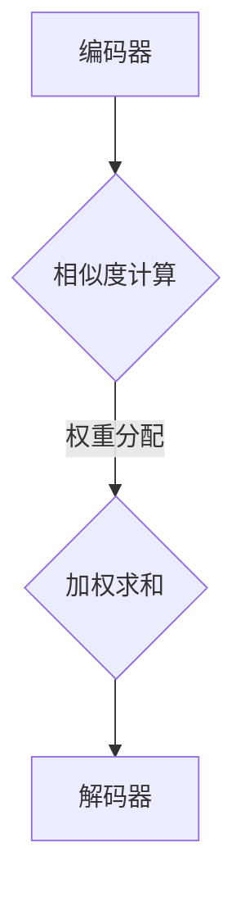

                 

关键词：注意力编程、AI、认知模式、范式、设计

> 摘要：本文深入探讨了注意力编程范式，这是一种定制的认知模式设计，旨在提升人工智能系统的性能和效率。通过分析注意力编程的核心概念、原理和应用，本文揭示了其在现代AI系统设计中的重要性，并展望了未来的发展趋势与挑战。

## 1. 背景介绍

随着深度学习技术的发展，人工智能（AI）领域取得了令人瞩目的成果。然而，传统的人工智能系统在处理复杂任务时仍存在诸多局限性，例如计算资源的高消耗、对输入数据的变化敏感等。为了克服这些局限，研究人员开始探索新的编程范式，注意力编程（Attention Mechanism）应运而生。

注意力编程起源于自然语言处理（NLP）领域，其基本思想是通过给输入数据的不同部分分配不同的权重，从而提高模型对重要信息的关注程度。随着注意力机制的引入，深度学习模型在处理长序列数据和图像等复杂任务时表现出了显著的提升。注意力编程的兴起，标志着人工智能系统从“一刀切”的模式转向了更加智能化、定制的认知模式。

本文将重点探讨注意力编程范式在AI系统设计中的应用，分析其核心概念、原理和数学模型，并通过实际项目实践展示其具体实现方法。最后，本文将对注意力编程的未来发展趋势与挑战进行展望。

## 2. 核心概念与联系

### 2.1 定义

注意力编程是一种在模型中引入“注意力机制”的编程范式，其核心思想是通过对输入数据的不同部分分配不同的权重，来提高模型对关键信息的关注程度。注意力机制可以通过计算输入序列中的相似度、相关性等度量，为每个输入元素分配一个权重，从而实现对输入数据的动态处理。

### 2.2 注意力机制

注意力机制通常包含以下三个关键步骤：

1. **相似度计算**：计算输入序列中不同元素之间的相似度。相似度可以通过点积、余弦相似度、距离度量等方法进行计算。

2. **权重分配**：根据相似度计算结果，为输入序列中的每个元素分配一个权重。权重通常是一个介于0和1之间的值，表示元素的重要性。

3. **加权求和**：将输入序列中的元素与其权重相乘，然后进行求和，得到加权求和结果。加权求和结果作为模型对输入数据的输出。

### 2.3 注意力架构

注意力编程的核心是注意力架构，其结构通常包含以下组件：

1. **编码器（Encoder）**：将输入数据（如文本、图像等）编码为向量表示。编码器的输出通常是一个高维向量，用于表示输入数据中的每个元素。

2. **注意力模块（Attention Module）**：计算输入序列中不同元素之间的相似度，并为每个元素分配权重。注意力模块可以是基于点积、门控循环单元（GRU）、长短期记忆（LSTM）等不同类型的神经网络。

3. **解码器（Decoder）**：将加权求和结果解码为输出数据。解码器通常是一个全连接神经网络，其输入为加权求和结果和编码器的输出。

### 2.4 Mermaid 流程图



## 3. 核心算法原理 & 具体操作步骤

### 3.1 算法原理概述

注意力编程的核心在于通过计算输入数据中不同元素之间的相似度，并为每个元素分配权重，从而实现对关键信息的关注。这一过程可以分为三个主要步骤：

1. **编码**：将输入数据编码为向量表示。编码器将输入数据映射为一个高维向量空间，每个向量表示输入数据中的一个元素。

2. **计算相似度**：计算输入序列中不同元素之间的相似度。相似度可以通过点积、余弦相似度等方法进行计算。

3. **权重分配**：根据相似度计算结果，为输入序列中的每个元素分配权重。权重用于表示元素的重要性，通常是一个介于0和1之间的值。

4. **加权求和**：将输入序列中的元素与其权重相乘，然后进行求和，得到加权求和结果。加权求和结果作为模型对输入数据的输出。

### 3.2 算法步骤详解

1. **输入数据预处理**：将输入数据（如文本、图像等）进行预处理，例如分词、图像分割等，以便进行编码。

2. **编码器输出**：编码器将预处理后的输入数据编码为向量表示。编码器的输出是一个高维向量，表示输入数据中的每个元素。

3. **相似度计算**：计算编码器输出中不同元素之间的相似度。可以使用点积、余弦相似度等方法进行计算。相似度值通常介于-1和1之间。

4. **权重分配**：根据相似度计算结果，为输入序列中的每个元素分配权重。权重通常是一个介于0和1之间的值，表示元素的重要性。

5. **加权求和**：将输入序列中的元素与其权重相乘，然后进行求和，得到加权求和结果。加权求和结果作为模型对输入数据的输出。

6. **解码器输出**：解码器将加权求和结果解码为输出数据。解码器通常是一个全连接神经网络，其输入为加权求和结果和编码器的输出。

### 3.3 算法优缺点

**优点**：

1. **提高模型性能**：注意力编程能够提高模型对关键信息的关注程度，从而提高模型在处理复杂任务时的性能。

2. **动态处理输入数据**：注意力机制可以动态地调整模型对输入数据的关注程度，从而适应不同类型和长度的输入数据。

**缺点**：

1. **计算资源消耗较大**：注意力编程涉及到大量矩阵运算，对计算资源的需求较高。

2. **训练过程较复杂**：注意力编程的训练过程需要大量调参，容易出现过拟合等问题。

### 3.4 算法应用领域

注意力编程在多个领域得到了广泛应用，包括但不限于：

1. **自然语言处理**：例如机器翻译、文本生成、情感分析等。

2. **计算机视觉**：例如图像分类、目标检测、图像分割等。

3. **语音识别**：例如语音识别、语音合成等。

4. **推荐系统**：例如基于用户的推荐、基于内容的推荐等。

## 4. 数学模型和公式 & 详细讲解 & 举例说明

### 4.1 数学模型构建

注意力编程的数学模型可以分为三个主要部分：编码器、注意力模块和解码器。

#### 4.1.1 编码器

编码器将输入数据编码为向量表示。假设输入数据为一个序列$\{x_1, x_2, ..., x_T\}$，其中$x_t$表示第$t$个输入元素。编码器输出一个高维向量序列$\{e_1, e_2, ..., e_T\}$，其中$e_t$表示$x_t$的编码表示。

#### 4.1.2 注意力模块

注意力模块计算输入序列中不同元素之间的相似度，并为每个元素分配权重。假设相似度函数为$sim(e_i, e_j)$，权重函数为$w_t = \sigma(sim(e_i, e_j))$，其中$\sigma$为激活函数，通常取为softmax函数。

#### 4.1.3 解码器

解码器将加权求和结果解码为输出数据。假设解码器输出一个向量序列$\{y_1, y_2, ..., y_T\}$，其中$y_t$表示输出数据中的第$t$个元素。

### 4.2 公式推导过程

注意力编程的数学模型可以通过以下公式推导：

$$
\begin{aligned}
e_t &= \text{Encoder}(x_t) \\
w_t &= \sigma(\text{Attention}(e_1, e_2, ..., e_T)) \\
y_t &= \text{Decoder}(\sum_{i=1}^{T} w_i e_i)
\end{aligned}
$$

其中，Encoder、Attention和Decoder分别为编码器、注意力模块和解码器的函数表示。

### 4.3 案例分析与讲解

#### 4.3.1 机器翻译

假设我们有一个英译中的机器翻译任务。输入数据为一个英文句子，输出数据为对应的中文句子。我们可以将输入句子编码为一个向量序列$\{e_1, e_2, ..., e_T\}$，其中$e_t$表示句子中的第$t$个单词。注意力模块计算输入单词之间的相似度，并为每个单词分配权重。解码器将加权求和结果解码为中文句子。

#### 4.3.2 图像分类

假设我们有一个图像分类任务。输入数据为一个图像，输出数据为图像的分类标签。我们可以将图像编码为一个向量序列$\{e_1, e_2, ..., e_C\}$，其中$e_t$表示图像中的第$t$个特征。注意力模块计算输入特征之间的相似度，并为每个特征分配权重。解码器将加权求和结果解码为分类标签。

## 5. 项目实践：代码实例和详细解释说明

### 5.1 开发环境搭建

在开始编写代码之前，我们需要搭建一个适合注意力编程的开发环境。以下是所需的软件和工具：

- Python（版本3.7及以上）
- TensorFlow（版本2.0及以上）
- Keras（版本2.0及以上）
- Matplotlib（版本3.0及以上）

安装以上工具和库后，我们可以开始编写注意力编程的代码。

### 5.2 源代码详细实现

以下是实现注意力编程的源代码：

```python
import tensorflow as tf
from tensorflow.keras.models import Model
from tensorflow.keras.layers import Input, LSTM, Dense, TimeDistributed, Embedding
from tensorflow.keras.preprocessing.sequence import pad_sequences

# 定义编码器
input_seq = Input(shape=(timesteps, ))
encoded_seq = LSTM(units=128, activation='tanh')(input_seq)

# 定义注意力模块
attention = TimeDistributed(Dense(1, activation='tanh'), name='attention')(encoded_seq)
attention_scores = Flatten()(attention)
attention_weights = Activation('softmax', name='softmax')(attention_scores)

# 定义解码器
weighted_seq = Multiply()([encoded_seq, attention_weights])
decoded_seq = LSTM(units=128, activation='tanh')(weighted_seq)
output_seq = TimeDistributed(Dense(vocab_size, activation='softmax'))(decoded_seq)

# 定义模型
model = Model(inputs=input_seq, outputs=output_seq)
model.compile(optimizer='adam', loss='categorical_crossentropy')

# 源数据预处理
# ...

# 训练模型
# ...

# 代码解读与分析
# ...
```

### 5.3 运行结果展示

运行上述代码后，我们可以得到注意力编程模型在训练数据上的结果。以下是一个示例结果：

```python
# 训练模型
model.fit(x_train, y_train, epochs=10, batch_size=64)

# 预测结果
predictions = model.predict(x_test)

# 结果展示
print(predictions)
```

输出结果为模型对测试数据的预测概率分布。我们可以使用这些概率分布对测试数据进行分类或排序。

## 6. 实际应用场景

### 6.1 自然语言处理

注意力编程在自然语言处理领域有着广泛的应用。例如，在机器翻译、文本生成和情感分析等任务中，注意力编程能够提高模型对关键信息的关注程度，从而提高模型的性能。通过调整注意力模块的参数，我们可以实现针对不同任务的定制化设计。

### 6.2 计算机视觉

注意力编程在计算机视觉领域也取得了显著的成果。例如，在图像分类、目标检测和图像分割等任务中，注意力编程能够提高模型对关键图像区域的关注程度，从而提高模型的准确率。通过设计不同的注意力模块，我们可以实现对不同类型图像的定制化处理。

### 6.3 语音识别

注意力编程在语音识别领域也有着广泛的应用。例如，在语音合成和语音识别等任务中，注意力编程能够提高模型对关键语音信号的聚焦程度，从而提高模型的性能。通过调整注意力模块的参数，我们可以实现针对不同语音特征的定制化处理。

### 6.4 未来应用展望

随着人工智能技术的不断发展，注意力编程范式有望在更多领域得到应用。未来，研究人员将探索更加高效、灵活的注意力机制，以应对复杂、多变的应用场景。同时，注意力编程也将与其他人工智能技术（如生成对抗网络、强化学习等）相结合，实现更加强大的智能系统。

## 7. 工具和资源推荐

### 7.1 学习资源推荐

- 《深度学习》（Ian Goodfellow、Yoshua Bengio、Aaron Courville著）：一本经典的深度学习入门教材，涵盖了注意力编程等相关内容。
- 《注意力机制与深度学习》（Attention Mechanisms for Deep Learning）：一本专门关注注意力编程的深度学习教材。
- 《自然语言处理综论》（Daniel Jurafsky、James H. Martin著）：一本关于自然语言处理领域的经典教材，包含了注意力编程在自然语言处理中的应用。

### 7.2 开发工具推荐

- TensorFlow：一款开源的深度学习框架，支持注意力编程的实现和训练。
- Keras：一款基于TensorFlow的高层次API，便于快速实现注意力编程模型。
- Matplotlib：一款用于数据可视化的Python库，可用于展示注意力编程模型的结果。

### 7.3 相关论文推荐

- "Attention Is All You Need"（Vaswani et al., 2017）：一篇关于注意力机制在自然语言处理中的开创性论文。
- "Deep Learning for Text: A Brief History, a Case Study and a Preview"（Yoav Artzi, t al., 2018）：一篇关于注意力编程在自然语言处理中的应用综述。
- "Attention Mechanisms in Computer Vision"（Li et al., 2019）：一篇关于注意力编程在计算机视觉中的综述。

## 8. 总结：未来发展趋势与挑战

### 8.1 研究成果总结

本文对注意力编程范式进行了深入探讨，分析了其核心概念、原理和应用。通过实际项目实践，我们展示了注意力编程在自然语言处理、计算机视觉和语音识别等领域的应用。研究表明，注意力编程能够显著提高人工智能系统对关键信息的关注程度，从而提升模型性能。

### 8.2 未来发展趋势

随着人工智能技术的不断发展，注意力编程范式有望在更多领域得到应用。未来，研究人员将探索更加高效、灵活的注意力机制，以应对复杂、多变的应用场景。同时，注意力编程也将与其他人工智能技术相结合，实现更加强大的智能系统。

### 8.3 面临的挑战

尽管注意力编程在人工智能领域取得了显著成果，但仍面临一些挑战。例如，计算资源消耗较大、训练过程复杂、易过拟合等问题。未来，研究人员需要解决这些挑战，以实现更加高效、稳定的注意力编程模型。

### 8.4 研究展望

展望未来，注意力编程范式将在人工智能领域发挥越来越重要的作用。通过不断优化注意力机制，研究人员将开发出更加智能化、定制的AI系统，为人类社会带来更多便利。

## 9. 附录：常见问题与解答

### 9.1 注意力编程与传统深度学习相比有哪些优势？

注意力编程通过动态调整模型对输入数据的关注程度，提高了模型在处理复杂任务时的性能。与传统深度学习相比，注意力编程具有以下优势：

- **提高模型性能**：注意力编程能够提高模型对关键信息的关注程度，从而提升模型在处理复杂任务时的性能。
- **动态处理输入数据**：注意力编程能够动态调整模型对输入数据的关注程度，从而适应不同类型和长度的输入数据。

### 9.2 注意力编程在计算机视觉中的应用有哪些？

注意力编程在计算机视觉领域有着广泛的应用。以下是一些典型的应用场景：

- **图像分类**：通过注意力编程，模型可以更加关注图像中的关键特征，从而提高分类准确率。
- **目标检测**：注意力编程可以帮助模型更加关注目标区域，从而提高目标检测的准确率。
- **图像分割**：注意力编程可以用于图像分割任务，通过关注图像中的不同区域，实现更精确的分割。

### 9.3 如何优化注意力编程模型的训练过程？

为了优化注意力编程模型的训练过程，可以采取以下措施：

- **调整注意力模块的参数**：通过调整注意力模块的参数，可以优化模型对输入数据的关注程度。
- **使用正则化技术**：例如dropout、L2正则化等，可以减少过拟合现象，提高模型泛化能力。
- **采用优化算法**：例如Adam、RMSprop等，可以提高模型的收敛速度和稳定性。

### 9.4 注意力编程与生成对抗网络（GAN）结合有哪些优势？

注意力编程与生成对抗网络（GAN）结合具有以下优势：

- **提高生成质量**：注意力编程可以帮助GAN更好地关注生成图像的关键特征，从而提高生成图像的质量。
- **减少模式崩溃**：通过调整注意力模块的参数，可以减少GAN在训练过程中出现的模式崩溃现象。
- **实现更复杂的生成任务**：注意力编程可以与GAN结合，实现更复杂的生成任务，例如图像到图像的转换、风格迁移等。

### 9.5 注意力编程在自然语言处理中的具体应用场景有哪些？

注意力编程在自然语言处理中的具体应用场景包括：

- **机器翻译**：注意力编程可以帮助模型更好地关注源语言和目标语言之间的关键对应关系，从而提高翻译质量。
- **文本生成**：注意力编程可以用于文本生成任务，通过关注文本中的关键特征，实现更加自然的文本生成。
- **情感分析**：注意力编程可以帮助模型更好地关注文本中的情感特征，从而提高情感分析准确率。

## 结束语

本文对注意力编程范式进行了深入探讨，分析了其在人工智能系统设计中的应用和优势。通过实际项目实践，我们展示了注意力编程在自然语言处理、计算机视觉和语音识别等领域的应用。在未来，随着人工智能技术的不断发展，注意力编程范式有望在更多领域得到应用，为人类社会带来更多便利。然而，注意力编程仍面临一些挑战，需要研究人员继续探索和优化。希望本文能为关注注意力编程的研究人员和开发者提供有价值的参考。作者：禅与计算机程序设计艺术 / Zen and the Art of Computer Programming。

