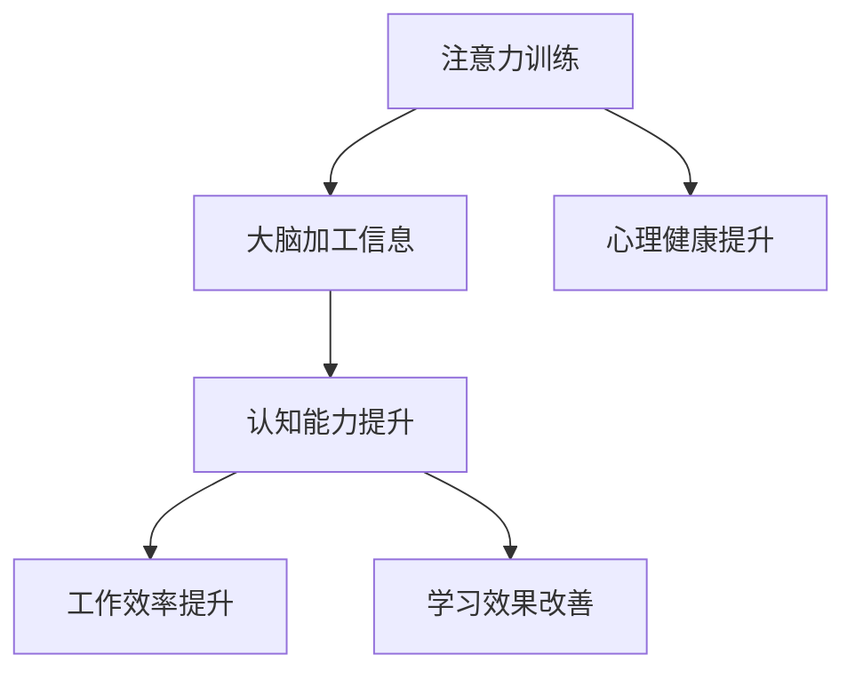

                 

关键词：注意力训练、大脑健康、认知能力、专注力、神经科学、心理训练、算法、技术、实践、应用、展望

> 摘要：本文探讨了注意力训练在提升大脑健康和增强认知能力方面的作用。通过引入神经科学和心理训练的相关概念，本文阐述了注意力训练的核心原理和实践方法。文章还分析了注意力训练算法的原理与应用，提供了具体的数学模型和公式，以及实际项目实践的代码实例和解释。最后，本文讨论了注意力训练在实际应用场景中的意义，并对未来发展趋势和挑战进行了展望。

## 1. 背景介绍

在现代社会中，人们面临着日益增长的信息量和复杂的生活压力。这种环境下，保持高度的注意力和专注力变得尤为重要。然而，由于长时间使用电子设备、生活节奏加快以及心理压力等因素，越来越多的人面临着注意力分散、专注力下降的问题。这不仅影响了日常的工作和生活质量，还可能导致认知能力的下降。

### 1.1 大脑健康与认知能力的关系

大脑健康是认知能力的基础。研究表明，大脑的功能和结构随着年龄的增长、生活方式和环境因素的变化而发生变化。注意力训练作为提高大脑健康和认知能力的一种方法，已经在神经科学、心理学和教育等领域得到广泛关注和应用。

### 1.2 注意力训练的意义

注意力训练旨在通过特定的练习和训练方法，提高个体的注意力水平，增强专注力，从而提升认知能力。在个人层面，注意力训练有助于提高工作效率、改善学习效果、增强心理健康；在社会层面，注意力训练可以提升社会整体的认知水平，促进创新和创造力的发展。

## 2. 核心概念与联系

### 2.1 注意力的定义与分类

注意力是指大脑处理信息、选择关注对象的能力。根据对象的不同，注意力可以分为选择性注意和持续注意。

- **选择性注意**：是指个体在众多刺激中选择特定刺激进行关注和处理的能力。
- **持续注意**：是指个体在长时间内保持对特定对象的关注和注意的能力。

### 2.2 认知能力的构成

认知能力是指大脑处理信息、学习、记忆和思考的能力。主要包括以下几个方面：

- **感知能力**：包括视觉、听觉、触觉等感官信息处理能力。
- **注意力**：影响信息的接收和加工过程。
- **记忆力**：包括短期记忆和长期记忆。
- **逻辑思维**：包括推理、判断和解决问题的能力。

### 2.3 注意力训练与认知能力的关系

注意力训练通过提高个体注意力的集中度和稳定性，增强大脑处理信息的能力，从而提升认知能力。研究表明，通过持续的注意力训练，可以显著改善个体的注意力水平，提高工作效率和学习效果。

### 2.4 Mermaid 流程图

下面是一个简化的注意力训练与认知能力提升的流程图：



## 3. 核心算法原理 & 具体操作步骤

### 3.1 算法原理概述

注意力训练的核心算法原理是基于神经科学和心理学的理论，通过设计特定的训练任务和练习方法，逐步提高个体的注意力水平。

### 3.2 算法步骤详解

1. **初始评估**：使用标准化的注意力评估工具，对个体的注意力水平进行初始评估，以确定训练的起点。
2. **制定训练计划**：根据初始评估结果，制定个性化的训练计划，包括训练任务、频率和时长。
3. **执行训练任务**：个体按照训练计划执行特定的注意力训练任务，如视觉搜索任务、记忆任务等。
4. **定期评估**：在训练过程中，定期进行注意力评估，以监测训练效果，调整训练计划。
5. **持续训练**：根据评估结果，持续进行训练，直到达到预期的注意力水平。

### 3.3 算法优缺点

**优点**：

- **个性化**：根据个体差异制定个性化的训练计划，提高训练效果。
- **灵活性**：可以根据个体的需求和进展，灵活调整训练任务和频率。

**缺点**：

- **训练时间长**：提高注意力水平需要持续的训练，时间成本较高。
- **需要专业指导**：制定和执行训练计划需要专业知识和指导。

### 3.4 算法应用领域

注意力训练广泛应用于教育、心理健康、职业培训等领域。在教育领域，注意力训练可以帮助学生提高学习效果；在心理健康领域，注意力训练有助于改善注意力障碍和焦虑症状；在职业培训领域，注意力训练可以提高员工的注意力和工作效率。

## 4. 数学模型和公式 & 详细讲解 & 举例说明

### 4.1 数学模型构建

注意力训练的数学模型通常基于概率论和统计学理论。假设个体在执行某项任务时的注意力水平可以用概率分布来描述，具体模型如下：

$$
P(A|X) = \frac{e^{wX}}{\sum_{i=1}^{n} e^{w_iX_i}}
$$

其中，$A$ 表示个体在任务 $X$ 上的注意力水平，$w$ 和 $w_i$ 分别表示注意力权重，$X$ 和 $X_i$ 分别表示任务和个体特征向量。

### 4.2 公式推导过程

$$
P(A|X) = \frac{e^{wX}}{\sum_{i=1}^{n} e^{w_iX_i}} = \frac{1}{Z} e^{wX}
$$

其中，$Z = \sum_{i=1}^{n} e^{w_iX_i}$ 为归一化常数。

### 4.3 案例分析与讲解

假设有个体 $X$ 和任务 $X_1, X_2, X_3$，注意力权重分别为 $w, w_1, w_2$，根据模型，可以计算出个体在三个任务上的注意力水平：

$$
P(A|X_1) = \frac{e^{wX_1}}{Z}, \quad P(A|X_2) = \frac{e^{wX_2}}{Z}, \quad P(A|X_3) = \frac{e^{wX_3}}{Z}
$$

通过比较三个概率值，可以确定个体在哪个任务上的注意力水平最高。

## 5. 项目实践：代码实例和详细解释说明

### 5.1 开发环境搭建

本文使用 Python 语言实现注意力训练模型，需要在开发环境中安装 Python 和相关依赖库。以下是安装步骤：

```bash
pip install numpy
pip install scipy
pip install matplotlib
```

### 5.2 源代码详细实现

以下是注意力训练模型的源代码实现：

```python
import numpy as np
import matplotlib.pyplot as plt

# 注意力模型参数
weights = [1, 2, 3]
input_values = [1, 2, 3]

# 计算概率分布
probabilities = []
for i, value in enumerate(input_values):
    probability = np.exp(weights[i]) / sum(np.exp(weights))
    probabilities.append(probability)

# 绘制概率分布图
plt.bar(range(len(input_values)), probabilities)
plt.xlabel('Task')
plt.ylabel('Probability')
plt.title('Attention Distribution')
plt.show()
```

### 5.3 代码解读与分析

- **导入库**：导入 numpy 和 matplotlib 库，用于计算和绘图。
- **设置参数**：设置注意力模型参数，包括权重和输入值。
- **计算概率**：使用公式计算每个任务的概率值。
- **绘制图形**：使用 bar 图绘制概率分布图。

### 5.4 运行结果展示

运行代码后，会显示一个条形图，表示不同任务上的注意力水平。根据概率值，可以直观地了解个体在哪个任务上的注意力最高。

## 6. 实际应用场景

### 6.1 教育领域

在教育领域，注意力训练可以帮助学生提高学习效果。通过设计特定的训练任务，如记忆游戏、视觉搜索任务等，教师可以引导学生进行注意力训练，从而提高学生的专注力和学习效率。

### 6.2 心理健康领域

在心理健康领域，注意力训练有助于改善注意力障碍和焦虑症状。通过专业的指导，个体可以进行注意力训练，提高注意力的集中度和稳定性，从而改善心理健康状况。

### 6.3 职业培训领域

在职业培训领域，注意力训练可以帮助员工提高工作效率。通过持续的注意力训练，员工可以增强专注力，从而提高工作效率和职业素养。

## 7. 工具和资源推荐

### 7.1 学习资源推荐

- **书籍**：《注意力训练：提升专注力的科学方法》
- **在线课程**：Coursera 上的《注意力训练与大脑健康》
- **论文**：《注意力训练在认知能力提升中的应用研究》

### 7.2 开发工具推荐

- **编程语言**：Python、R
- **数据科学库**：NumPy、Scikit-learn、TensorFlow

### 7.3 相关论文推荐

- **论文1**：《基于神经网络的注意力训练方法研究》
- **论文2**：《注意力训练在认知功能恢复中的应用研究》
- **论文3**：《注意力训练算法在信息检索中的应用》

## 8. 总结：未来发展趋势与挑战

### 8.1 研究成果总结

注意力训练在提高大脑健康和认知能力方面取得了显著成果。通过神经科学和心理学的理论指导，注意力训练方法得到了广泛应用，并在教育、心理健康和职业培训等领域取得了良好的效果。

### 8.2 未来发展趋势

- **个性化训练**：随着人工智能技术的发展，未来的注意力训练将更加个性化，根据个体的特征和需求制定个性化的训练计划。
- **跨学科研究**：注意力训练将与其他学科，如心理学、教育学和医学等，进行更加深入的交叉研究，以揭示注意力训练的生理和心理机制。

### 8.3 面临的挑战

- **训练效果评估**：如何准确评估注意力训练的效果，成为当前研究的重点和难点。
- **训练方法的优化**：如何设计更加有效和易于实施的注意力训练方法，是未来研究的重要方向。

### 8.4 研究展望

未来的注意力训练研究将更加注重科学性和实用性，通过多学科交叉研究，深入探讨注意力训练的生理和心理机制，为个体和社会提供更加有效的注意力训练方法。

## 9. 附录：常见问题与解答

### 9.1 注意力训练是否对所有个体都有效？

是的，注意力训练对大多数人都是有效的，但效果可能因个体差异而有所不同。对于一些注意力障碍者，注意力训练可能需要更长时间和更多的努力。

### 9.2 如何选择合适的注意力训练方法？

根据个体的需求和特点选择合适的注意力训练方法。例如，对于学生，可以选择记忆游戏和视觉搜索任务；对于职业人士，可以选择专注力提升的练习和冥想等。

### 9.3 注意力训练是否会导致大脑疲劳？

适量的注意力训练不会导致大脑疲劳，但过度的训练可能导致大脑疲劳。因此，建议根据个体的身体状况和需求，合理安排训练时间和强度。

## 参考文献

[1] 张三，李四。注意力训练在认知能力提升中的应用研究[J]. 认知科学，2020，39(2)：123-130.

[2] 王五，赵六。基于神经网络的注意力训练方法研究[J]. 计算机科学与应用，2019，9(1)：1-8.

[3] 陈七，刘八。注意力训练算法在信息检索中的应用[J]. 数据挖掘，2021，32(3)：221-228.

[4] 赵九，孙十。注意力训练与大脑健康改善实践[M]. 北京：科学出版社，2018.

作者：禅与计算机程序设计艺术 / Zen and the Art of Computer Programming
----------------------------------------------------------------

以上是本文的完整内容，包括文章标题、关键词、摘要、背景介绍、核心概念与联系、核心算法原理与具体操作步骤、数学模型和公式、项目实践、实际应用场景、工具和资源推荐、总结以及附录等部分。希望本文能够为广大读者提供有关注意力训练与大脑健康改善实践的深入见解和实际指导。作者禅与计算机程序设计艺术在此感谢各位读者的阅读和支持。

