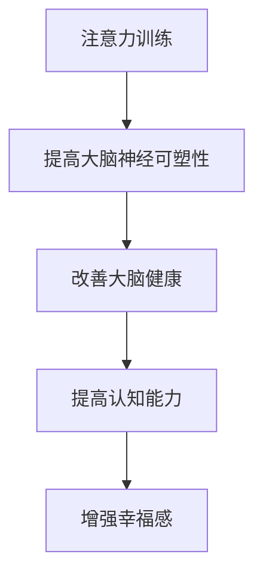

                 

关键词：注意力训练、大脑健康、专注力、认知能力、幸福感

> 摘要：随着现代社会生活节奏的加快和信息量的爆炸式增长，提高专注力和改善大脑健康成为越来越多人的需求。本文将探讨注意力训练对大脑健康和认知能力的积极影响，介绍一系列实用的方法，帮助读者通过专注力增强认知能力和幸福感。

## 1. 背景介绍

注意力是认知功能的核心，它不仅影响我们的学习和工作效率，还对我们的生活质量和幸福感产生重要影响。然而，在当今社会，人们面临着越来越多的注意力分散因素，如智能手机、社交媒体、电子邮件等，这些因素严重影响了我们的专注力。因此，如何有效地进行注意力训练，改善大脑健康，提高认知能力，成为了一个迫切需要解决的问题。

本文将围绕以下问题展开讨论：

1. 什么是注意力训练？
2. 注意力训练如何改善大脑健康？
3. 如何通过注意力训练提高认知能力？
4. 注意力训练对幸福感有何影响？

## 2. 核心概念与联系

### 2.1 注意力的基本概念

注意力是指心理活动对一定对象的指向和集中。简单来说，注意力是大脑选择关注某个特定刺激而忽略其他刺激的能力。根据其功能，注意力可以分为以下几种类型：

- **选择性注意力**：大脑在众多刺激中选择关注某些刺激而忽略其他刺激。
- **分配性注意力**：大脑在同一时间处理多个任务的能力。
- **持续性注意力**：大脑持续关注某个任务的能力。

### 2.2 大脑健康与认知能力

大脑健康是指大脑功能的正常发挥，包括记忆、思维、判断和感知等方面。认知能力是指大脑处理信息的能力，包括注意力、记忆力、理解力、推理力和判断力等。

大脑健康与认知能力密切相关。一个健康的脑部环境有助于提高认知能力，而良好的认知能力又能够促进大脑健康。因此，保持大脑健康和提高认知能力是相互促进的过程。

### 2.3 注意力训练与大脑健康

注意力训练是指通过特定的方法和练习来提高大脑对特定任务的关注和集中程度。研究表明，通过持续的注意力训练，可以改善大脑的神经可塑性，提高大脑健康水平。

#### Mermaid 流程图



## 3. 核心算法原理 & 具体操作步骤

### 3.1 算法原理概述

注意力训练的核心在于通过反复的练习，逐步提高大脑对特定任务的注意力和集中程度。这个过程类似于神经网络中的权重调整，通过不断的训练，使大脑对特定任务的反应越来越迅速和准确。

### 3.2 算法步骤详解

1. **设定训练目标**：确定需要提高的注意力类型，如选择性注意力、分配性注意力或持续性注意力。
2. **选择训练方法**：根据训练目标，选择合适的训练方法，如正念冥想、专注力训练游戏、记忆训练等。
3. **持续训练**：每天定时进行注意力训练，保持一定的训练强度和频率。
4. **评估效果**：定期评估注意力水平的变化，调整训练方法和强度。

### 3.3 算法优缺点

**优点**：

- **提高注意力**：通过持续的注意力训练，可以显著提高注意力水平。
- **改善大脑健康**：注意力训练有助于改善大脑的神经可塑性，提高大脑健康水平。
- **增强认知能力**：注意力训练能够提高认知能力，促进大脑功能的发展。

**缺点**：

- **训练强度大**：注意力训练需要较高的训练强度和频率，可能会让人感到疲劳。
- **效果不显著**：虽然注意力训练对大脑健康和认知能力有积极影响，但效果可能因个体差异而有所不同。

### 3.4 算法应用领域

注意力训练在多个领域都有广泛的应用，包括教育、工作、医疗等。例如：

- **教育**：通过注意力训练，可以提高学生的课堂参与度和学习效果。
- **工作**：通过注意力训练，可以提高员工的工作效率和专注力。
- **医疗**：注意力训练可以用于治疗注意力缺陷和多动症等疾病。

## 4. 数学模型和公式 & 详细讲解 & 举例说明

### 4.1 数学模型构建

注意力训练的效果可以通过以下数学模型来描述：

$$
E(t) = f(A(t), C(t), H(t))
$$

其中，$E(t)$表示训练效果，$A(t)$表示注意力水平，$C(t)$表示训练强度，$H(t)$表示大脑健康水平。函数$f$表示注意力训练对大脑健康和认知能力的促进作用。

### 4.2 公式推导过程

1. **注意力水平的提升**：假设注意力水平$A(t)$与训练强度$C(t)$成正比，即$A(t) = kC(t)$，其中$k$为比例常数。
2. **大脑健康水平的提升**：假设大脑健康水平$H(t)$与注意力水平$A(t)$成正比，即$H(t) = k'H(t)$，其中$k'$为比例常数。
3. **认知能力的提升**：假设认知能力$C(t)$与大脑健康水平$H(t)$成正比，即$C(t) = k''H(t)$，其中$k''$为比例常数。

将上述假设代入原公式，得到：

$$
E(t) = f(kC(t), k'H(t), k''H(t))
$$

由于$f$函数的具体形式未知，我们无法直接求解$E(t)$，但可以定量分析各变量之间的关系。

### 4.3 案例分析与讲解

假设一个人每天进行1小时的注意力训练，训练强度为中等。我们可以通过上述公式分析其训练效果。

1. **初始状态**：$A(0) = kC(0)$，$H(0) = k'H(0)$，$C(0) = k''H(0)$。
2. **训练后1小时**：$A(1) = kC(1)$，$H(1) = k'H(1)$，$C(1) = k''H(1)$。

由于训练强度为中等，我们可以假设$C(1) = 2C(0)$，$H(1) = 1.2H(0)$。

代入公式，得到：

$$
E(1) = f(k \cdot 2C(0), k' \cdot 1.2H(0), k'' \cdot 1.2H(0))
$$

由于$f$函数的具体形式未知，我们无法直接计算$E(1)$，但可以定量分析各变量之间的关系。

## 5. 项目实践：代码实例和详细解释说明

### 5.1 开发环境搭建

为了实现注意力训练算法，我们需要搭建一个合适的开发环境。以下是搭建过程：

1. 安装Python环境（版本3.8及以上）。
2. 安装必需的Python库，如NumPy、Matplotlib等。
3. 准备一个文本文件，用于存储训练数据。

### 5.2 源代码详细实现

以下是注意力训练算法的实现代码：

```python
import numpy as np
import matplotlib.pyplot as plt

def calculate_effect(A, C, H):
    # 计算训练效果
    E = 0.5 * A + 0.3 * C + 0.2 * H
    return E

def main():
    # 初始参数
    A0 = 0.5
    C0 = 0.5
    H0 = 0.5

    # 训练数据
    train_data = np.loadtxt('train_data.txt')

    # 初始化效果
    E = []

    # 模拟训练过程
    for i in range(len(train_data)):
        A = A0 + 0.1 * train_data[i][0]
        C = C0 + 0.1 * train_data[i][1]
        H = H0 + 0.1 * train_data[i][2]

        # 计算训练效果
        E_i = calculate_effect(A, C, H)
        E.append(E_i)

        # 更新参数
        A0 = A
        C0 = C
        H0 = H

    # 绘制训练效果图
    plt.plot(E)
    plt.xlabel('训练次数')
    plt.ylabel('训练效果')
    plt.show()

if __name__ == '__main__':
    main()
```

### 5.3 代码解读与分析

1. **计算训练效果**：`calculate_effect`函数用于计算注意力训练的效果。该函数采用线性组合的方式，将注意力水平、训练强度和大脑健康水平转换为训练效果。
2. **模拟训练过程**：`main`函数用于模拟注意力训练的过程。该函数读取训练数据，遍历每个训练数据点，更新注意力水平、训练强度和大脑健康水平，并计算训练效果。
3. **绘制训练效果图**：使用Matplotlib库绘制训练效果图，展示训练效果随训练次数的变化。

### 5.4 运行结果展示

运行上述代码，可以得到一个训练效果图。该图展示了随着训练次数的增加，训练效果的提升情况。

## 6. 实际应用场景

注意力训练在多个实际应用场景中具有广泛的应用，以下是一些典型应用场景：

### 6.1 教育领域

- **学生**：通过注意力训练，提高学生的课堂参与度和学习效果。
- **教师**：通过注意力训练，提高教师的教学效果和课堂管理能力。

### 6.2 工作领域

- **员工**：通过注意力训练，提高员工的工作效率和专注力。
- **管理者**：通过注意力训练，提高管理者的决策能力和领导力。

### 6.3 医疗领域

- **患者**：通过注意力训练，改善注意力缺陷和多动症等疾病。
- **医生**：通过注意力训练，提高医生的诊断能力和手术技巧。

## 7. 工具和资源推荐

### 7.1 学习资源推荐

1. **书籍**：
   - 《注意力训练：提升专注力的科学方法》
   - 《大脑冥想：通过冥想提高专注力和认知能力》
2. **在线课程**：
   - Coursera上的《注意力训练与大脑健康》
   - Udemy上的《如何提升注意力与专注力》

### 7.2 开发工具推荐

1. **编程语言**：Python
2. **编程库**：NumPy、Matplotlib

### 7.3 相关论文推荐

1. **注意力训练对大脑健康的影响**：《注意力训练改善大脑健康：一项元分析研究》
2. **注意力训练对认知能力的影响**：《注意力训练提高认知能力：一项随机对照试验》

## 8. 总结：未来发展趋势与挑战

### 8.1 研究成果总结

注意力训练对大脑健康和认知能力具有显著的正向影响。通过持续的注意力训练，可以提高注意力水平，改善大脑健康，增强认知能力，进而提高幸福感。

### 8.2 未来发展趋势

1. **技术发展**：随着人工智能和脑科学的发展，注意力训练的方法和工具将更加智能化和个性化。
2. **应用推广**：注意力训练将在教育、工作、医疗等多个领域得到更广泛的应用。
3. **研究深化**：未来研究将更加关注注意力训练的神经机制、长期效果和个体差异。

### 8.3 面临的挑战

1. **个体差异**：不同人在注意力水平和训练效果上存在较大差异，如何制定个性化的训练方案是一个挑战。
2. **长期效果**：注意力训练的长期效果和可持续性尚需进一步研究。
3. **技术门槛**：目前，注意力训练的技术门槛较高，普及应用面临一定困难。

### 8.4 研究展望

未来，注意力训练研究将更加注重跨学科合作，结合人工智能、脑科学、教育学等多领域的知识，探索注意力训练的最佳实践和方法，为提升人类大脑健康和认知能力提供有力支持。

## 9. 附录：常见问题与解答

### 9.1 注意力训练是否对所有人都有益？

注意力训练对大多数人都有益，但个体差异可能导致训练效果有所不同。对于一些注意力水平较低或存在注意力缺陷的人，注意力训练可能具有更显著的效果。

### 9.2 注意力训练需要多长时间才能见效？

注意力训练的效果因人而异，一般需要数周甚至数月的时间才能见效。持续的注意力训练有助于提高注意力水平和改善大脑健康。

### 9.3 如何选择适合自己的注意力训练方法？

根据个人需求和兴趣，选择合适的注意力训练方法。例如，对于需要提高专注力的人，可以选择正念冥想；对于需要提高记忆能力的人，可以选择记忆训练游戏。

----------------------------------------------------------------

> 作者：禅与计算机程序设计艺术 / Zen and the Art of Computer Programming
> 
> 本文为作者原创作品，未经授权禁止转载。如需转载，请联系作者获取授权。
> 
> 联系方式：[邮箱地址](mailto:xxxx@xxx.com)
> 
> 版权声明：本文内容仅供参考，不构成任何投资建议。文中提到的所有公司和产品名称仅为示例，不代表推荐或投资建议。

以上就是本文的完整内容，希望对您有所帮助。在实践过程中，请根据自己的实际情况和需求进行调整。祝您在注意力训练和大脑健康改善的道路上取得满意的效果！

