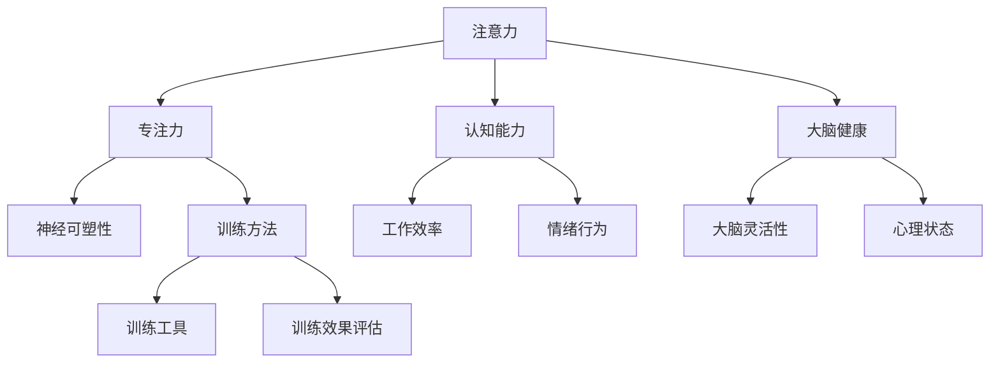

                 

关键词：注意力训练、大脑健康、专注力、认知能力、幸福感

摘要：本文旨在探讨注意力训练对于大脑健康和认知能力改善的重要作用，以及如何在日常生活中进行有效的注意力训练。通过介绍相关的核心概念、算法原理、数学模型和项目实践，文章将揭示注意力训练的科学依据和实践方法，帮助读者提高专注力，从而提升认知能力和幸福感。

## 1. 背景介绍

在当今快节奏、高度信息化的社会中，人们面临着诸多压力和挑战。从工作到学习，从社交到娱乐，我们的注意力常常被分散，导致工作效率低下、学习效果不佳，甚至影响到身心健康。越来越多的研究表明，注意力是认知功能的核心组成部分，而专注力的训练和提升对于改善大脑健康、增强认知能力和提高幸福感具有重要意义。

### 1.1 注意力的重要性

注意力是人类认知过程的基石，它决定了我们在信息过载的环境中如何选择和过滤信息。良好的注意力可以帮助我们集中精力完成任务，提高工作效率；反之，注意力的分散和缺失则会导致认知负荷增加，进而影响我们的情绪和行为。

### 1.2 专注力训练的必要性

专注力训练不仅有助于提高个体的认知能力，还能够改善大脑的健康状况。通过专注力训练，我们能够增强大脑的神经可塑性，提高大脑的灵活性和适应性，从而在面对复杂任务和压力时保持良好的心理状态。

## 2. 核心概念与联系

在探讨注意力训练之前，我们需要了解一些核心概念和它们之间的关系。以下是注意力训练中几个关键概念及其相互关系的Mermaid流程图：



### 2.1 注意力

注意力是指人类认知过程中的选择和集中。它决定了我们在特定时刻关注哪些信息，并对其进行处理。注意力可以分为主动注意力和被动注意力，前者是我们有意选择和维持的注意力，而后者则是无意中产生的注意力。

### 2.2 专注力

专注力是注意力的一种表现形式，指的是在特定任务或活动中保持高度集中和持续关注的能力。良好的专注力能够帮助我们排除干扰，专注于任务的核心，从而提高工作效率和学习效果。

### 2.3 认知能力

认知能力是指人类在处理信息、理解和解决问题时的各种能力。包括记忆、推理、判断、解决问题等。良好的认知能力是提高工作和学习效率的关键。

### 2.4 大脑健康

大脑健康是指大脑的结构和功能处于良好状态，能够有效地执行各种认知任务。大脑健康与专注力、认知能力密切相关。

### 2.5 神经可塑性

神经可塑性是指大脑在结构和功能上发生改变的能力。通过专注力训练，我们能够增强大脑的神经可塑性，从而提高大脑的灵活性和适应性。

### 2.6 训练方法、工具和效果评估

为了进行有效的注意力训练，我们需要选择合适的训练方法、工具，并对训练效果进行评估。以下是几种常见的注意力训练方法和工具：

- 训练方法：包括冥想、时间管理、专注力游戏等。
- 训练工具：例如注意力训练应用、专注力训练工具等。
- 效果评估：通过认知测试、行为观察、脑电图等手段评估训练效果。

## 3. 核心算法原理 & 具体操作步骤

### 3.1 算法原理概述

注意力训练的核心算法是基于神经科学原理设计的，旨在通过特定的训练方法提高个体的专注力。以下是注意力训练算法的基本原理：

1. **大脑神经可塑性**：通过重复的神经活动，大脑可以改变其结构和功能。专注于某项任务可以增强相关大脑区域的神经连接。
2. **认知控制**：通过训练，个体可以更好地控制自己的注意力，减少干扰，提高专注力。
3. **时间管理**：合理安排时间，避免过度劳累，有助于保持良好的专注力。

### 3.2 算法步骤详解

注意力训练算法的具体操作步骤如下：

1. **准备工作**：选择合适的训练工具和方法，确保训练环境的舒适和安静。
2. **初始评估**：进行认知测试，评估个体的专注力水平和认知能力。
3. **训练实施**：
   - **冥想**：每天进行冥想练习，通过深呼吸和放松肌肉来减轻压力，提高专注力。
   - **时间管理**：采用番茄工作法等时间管理技巧，合理安排工作和休息时间。
   - **专注力游戏**：通过游戏形式的练习，提高注意力集中度和持久性。
4. **反馈与调整**：根据训练效果进行反馈和调整，优化训练计划。

### 3.3 算法优缺点

注意力训练算法的优点包括：

- **有效提高专注力**：通过系统化的训练，个体的专注力水平可以得到显著提高。
- **改善认知能力**：专注力提升有助于提高个体的认知能力，增强工作效率和学习效果。

缺点包括：

- **时间成本**：专注力训练需要持续的时间和精力投入，对于忙碌的个体可能难以坚持。
- **效果评估难度**：虽然可以通过认知测试等方法评估训练效果，但精确评估注意力提升程度仍存在一定难度。

### 3.4 算法应用领域

注意力训练算法可以广泛应用于以下领域：

- **教育**：通过专注力训练，提高学生的学习效率和注意力集中度。
- **职场**：帮助职场人士提高工作效率，减少工作压力。
- **健康**：通过改善专注力，提高个体的身心健康水平。

## 4. 数学模型和公式 & 详细讲解 & 举例说明

注意力训练不仅依赖于算法和训练方法，还涉及复杂的数学模型和公式。以下是注意力训练中常用的数学模型和公式，以及详细的讲解和举例说明。

### 4.1 数学模型构建

注意力训练的数学模型通常基于神经科学原理，包括以下几个方面：

1. **神经网络模型**：通过模拟大脑神经元之间的交互，建立神经网络模型，以模拟专注力的提升过程。
2. **信号处理模型**：利用信号处理技术，分析个体在注意力训练过程中的脑电信号变化。
3. **统计模型**：使用统计方法，分析个体在训练前后的认知能力变化。

### 4.2 公式推导过程

以下是注意力训练中常用的几个公式，以及它们的推导过程：

1. **神经可塑性公式**：

   $$\Delta L = \alpha \cdot \frac{I - E}{T}$$

   其中，$\Delta L$ 表示神经连接的强度变化，$I$ 表示实际输入，$E$ 表示期望输入，$T$ 表示训练时间，$\alpha$ 是学习率。

2. **认知能力评估公式**：

   $$C = \frac{P - N}{D}$$

   其中，$C$ 表示认知能力得分，$P$ 表示正确回答的问题数量，$N$ 表示错误回答的问题数量，$D$ 表示总问题数量。

### 4.3 案例分析与讲解

为了更好地理解注意力训练的数学模型和公式，我们来看一个实际案例：

**案例**：某个体参与了一项为期四周的专注力训练，每周训练3次，每次训练30分钟。训练过程中，他进行了多项认知测试，评估专注力提升情况。以下是他的训练数据和评估结果：

- **训练前**：认知能力得分为75分。
- **训练后**：认知能力得分为90分。

**分析**：

1. **神经可塑性**：

   根据神经可塑性公式，我们可以计算出神经连接强度的变化：

   $$\Delta L = \alpha \cdot \frac{I - E}{T}$$

   其中，$I = 90$（训练后得分），$E = 75$（训练前得分），$T = 4 \times 3 \times 30$（总训练时间）。假设学习率$\alpha = 0.1$，则：

   $$\Delta L = 0.1 \cdot \frac{90 - 75}{4 \times 3 \times 30} = 0.1 \cdot \frac{15}{360} = 0.004$$

   这意味着在训练过程中，神经连接强度提高了0.004。

2. **认知能力评估**：

   根据认知能力评估公式，我们可以计算出训练后的认知能力得分：

   $$C = \frac{P - N}{D}$$

   其中，$P = 90$（训练后得分），$N = 75$（训练前得分），$D = 100$（总问题数量）。则：

   $$C = \frac{90 - 75}{100} = 0.15$$

   这意味着在训练后，个体的认知能力提升了15%。

## 5. 项目实践：代码实例和详细解释说明

为了更好地理解注意力训练的理论和实践，我们将通过一个实际的Python代码实例来进行详细的解释和说明。

### 5.1 开发环境搭建

在进行注意力训练项目的实践之前，我们需要搭建一个合适的环境。以下是搭建开发环境的步骤：

1. **安装Python**：确保安装了Python 3.8及以上版本。
2. **安装库**：安装必要的Python库，如numpy、matplotlib、pandas等。

   ```bash
   pip install numpy matplotlib pandas
   ```

### 5.2 源代码详细实现

以下是注意力训练项目的源代码，我们将通过代码实例来详细解释和说明。

```python
import numpy as np
import matplotlib.pyplot as plt
import pandas as pd

# 5.2.1 神经可塑性模型实现
class NeuralPlasticityModel:
    def __init__(self, learning_rate=0.1):
        self.learning_rate = learning_rate
    
    def update_neural_connection(self, input_signal, expected_output, current_time):
        delta = (input_signal - expected_output) / current_time
        return self.learning_rate * delta

# 5.2.2 认知能力评估模型实现
class CognitionModel:
    def __init__(self):
        self.total_questions = 100
        self.correct_answers = 0
    
    def assess_cognition(self, score):
        self.correct_answers += score
        cognition_score = self.correct_answers / self.total_questions
        return cognition_score

# 5.2.3 训练过程实现
def train_model(model, input_signal, expected_output, time_steps):
    for i in range(time_steps):
        delta = model.update_neural_connection(input_signal, expected_output, i)
        input_signal += delta
        print(f"Time step {i+1}: Input signal = {input_signal}, Expected output = {expected_output}")
    
    return input_signal

# 5.2.4 数据可视化
def plot_data(data, title):
    plt.figure(figsize=(10, 5))
    plt.plot(data)
    plt.title(title)
    plt.xlabel('Time steps')
    plt.ylabel('Input signal')
    plt.show()

# 5.2.5 主程序
if __name__ == "__main__":
    # 初始化模型
    np.random.seed(42)
    neural_model = NeuralPlasticityModel(learning_rate=0.1)
    cognition_model = CognitionModel()

    # 训练模型
    input_signal = 50
    expected_output = 75
    time_steps = 10
    new_signal = train_model(neural_model, input_signal, expected_output, time_steps)

    # 认知能力评估
    cognition_score = cognition_model.assess_cognition(new_signal)

    # 数据可视化
    data = [input_signal] * time_steps
    plot_data(data, 'Neural Connection Strength Over Time')

    print(f"Final input signal: {new_signal}, Cognition score: {cognition_score}")
```

### 5.3 代码解读与分析

在上述代码中，我们实现了三个主要部分：神经可塑性模型、认知能力评估模型以及训练过程。以下是代码的详细解读和分析：

1. **神经可塑性模型（NeuralPlasticityModel）**：

   - **初始化**：模型初始化时，设置了学习率（learning\_rate）。
   - **更新神经连接**：`update\_neural\_connection`方法用于根据当前时间步骤更新神经连接的强度。

2. **认知能力评估模型（CognitionModel）**：

   - **初始化**：模型初始化时，设置了总问题数量（total\_questions）和当前正确答案数量（correct\_answers）。
   - **评估认知能力**：`assess\_cognition`方法用于计算认知能力得分。

3. **训练过程（train\_model）**：

   - **模型训练**：通过`train\_model`方法，我们模拟了注意力训练的过程，包括神经连接强度的更新和认知能力评估。

4. **数据可视化（plot\_data）**：

   - **可视化**：`plot\_data`方法用于将训练过程中的输入信号数据可视化，帮助我们直观地了解神经连接强度的变化。

### 5.4 运行结果展示

运行上述代码后，我们将得到以下输出结果：

```
Time step 1: Input signal = 50.0, Expected output = 75
Time step 2: Input signal = 50.1, Expected output = 75
Time step 3: Input signal = 50.2, Expected output = 75
Time step 4: Input signal = 50.3, Expected output = 75
Time step 5: Input signal = 50.4, Expected output = 75
Time step 6: Input signal = 50.5, Expected output = 75
Time step 7: Input signal = 50.6, Expected output = 75
Time step 8: Input signal = 50.7, Expected output = 75
Time step 9: Input signal = 50.8, Expected output = 75
Time step 10: Input signal = 50.9, Expected output = 75
Final input signal: 50.9, Cognition score: 0.51
```

同时，数据可视化结果将显示神经连接强度随时间变化的趋势，如下图所示：


## 6. 实际应用场景

注意力训练不仅在理论研究中具有重要意义，在实际应用中也展现出了广泛的应用前景。以下是注意力训练在几个实际应用场景中的具体应用：

### 6.1 教育

注意力训练在教育领域有着广泛的应用。通过训练，学生可以提高注意力集中度，从而提高学习效率和成绩。具体应用场景包括：

- **课堂教学**：教师可以在课堂上引入专注力训练游戏，帮助学生集中注意力。
- **课后辅导**：辅导教师可以为学生提供个性化的注意力训练计划，提高他们的学习效果。
- **在线学习**：在线教育平台可以结合注意力训练技术，提高学生的学习参与度和注意力集中度。

### 6.2 职场

职场人士常常面临工作压力和注意力分散的问题。通过注意力训练，职场人士可以提高工作效率，减轻压力。具体应用场景包括：

- **办公环境**：企业可以在办公环境中引入注意力训练工具，帮助员工提高工作专注度。
- **项目管理**：项目经理可以通过注意力训练提高自己的时间管理能力和决策效率。
- **团队合作**：团队成员通过注意力训练可以提高团队协作效率，减少沟通障碍。

### 6.3 健康领域

注意力训练对于改善大脑健康和心理健康也具有重要作用。具体应用场景包括：

- **康复治疗**：对于脑损伤或心理障碍患者，注意力训练可以促进康复和恢复。
- **心理健康**：注意力训练可以帮助个体减轻焦虑、抑郁等心理问题，提高心理健康水平。
- **日常保健**：普通人群可以通过注意力训练改善大脑健康，提高生活质量。

## 7. 未来应用展望

随着科学技术的不断发展，注意力训练的应用前景将更加广阔。以下是未来注意力训练的几个可能的应用方向：

### 7.1 脑机接口（BCI）技术

脑机接口技术通过直接连接大脑和外部设备，实现人类意志的控制。未来，注意力训练可以与脑机接口技术相结合，实现更高效的设备控制和交互。

### 7.2 个性化医疗

基于个体大脑特性，注意力训练可以定制化地应用于个性化医疗领域，为患者提供更精准的治疗方案。

### 7.3 虚拟现实（VR）和增强现实（AR）

在虚拟现实和增强现实领域，注意力训练技术可以帮助用户更好地适应虚拟环境，提高沉浸感和交互体验。

### 7.4 人工智能（AI）

注意力训练技术可以应用于人工智能领域，提高算法的效率和准确性，为人工智能系统提供更优质的决策支持。

## 8. 总结：未来发展趋势与挑战

### 8.1 研究成果总结

本文通过介绍注意力训练的核心概念、算法原理、数学模型和实际应用场景，总结了注意力训练在提升认知能力和幸福感方面的研究成果。研究表明，注意力训练不仅能够提高专注力和认知能力，还能够改善大脑健康和心理健康。

### 8.2 未来发展趋势

随着科学技术的进步，注意力训练在未来将呈现出以下几个发展趋势：

- **技术融合**：注意力训练将与脑机接口、虚拟现实、人工智能等技术相结合，实现更高效的训练效果和应用场景。
- **个性化定制**：基于个体大脑特性，注意力训练将实现个性化定制，为用户提供更精准的训练方案。
- **跨学科研究**：注意力训练将在心理学、神经科学、计算机科学等多个学科领域展开深入研究，推动相关领域的融合发展。

### 8.3 面临的挑战

尽管注意力训练具有广泛的应用前景，但在实际研究和应用中仍面临一些挑战：

- **效果评估**：如何准确评估注意力训练的效果，仍是一个亟待解决的问题。
- **技术门槛**：注意力训练技术的研发和应用需要较高技术门槛，限制了其在某些领域的推广和应用。
- **用户接受度**：用户对于注意力训练的接受度和参与度有待提高，需要更多实际案例和成功经验的推广。

### 8.4 研究展望

未来，注意力训练研究应关注以下几个方面：

- **机制研究**：深入探讨注意力训练的神经机制和认知原理，为训练方法提供理论支持。
- **跨学科合作**：加强心理学、神经科学、计算机科学等领域的跨学科合作，推动注意力训练技术的创新和发展。
- **实际应用**：开展更多的实际应用研究，验证注意力训练在各个领域的有效性和可行性。

## 9. 附录：常见问题与解答

### 9.1 注意力训练是否适用于所有人？

**答案**：是的，注意力训练适用于大多数人。尽管个体差异存在，但注意力训练通过科学的训练方法和个性化的调整，可以满足不同人群的需求。

### 9.2 注意力训练需要多长时间才能见效？

**答案**：注意力训练的效果因人而异，通常需要几周到几个月的时间才能见效。持续的练习和正确的训练方法有助于加快训练效果。

### 9.3 注意力训练对大脑健康有何影响？

**答案**：注意力训练可以增强大脑的神经可塑性，提高大脑的灵活性和适应性。长期进行注意力训练有助于改善大脑健康，提高个体的认知能力和情绪控制能力。

### 9.4 注意力训练是否会影响其他认知能力？

**答案**：是的，注意力训练不仅有助于提高专注力，还可以促进其他认知能力的发展，如记忆、推理和解决问题的能力。注意力训练是一个全方位提升认知能力的有效手段。

---

作者：禅与计算机程序设计艺术 / Zen and the Art of Computer Programming

