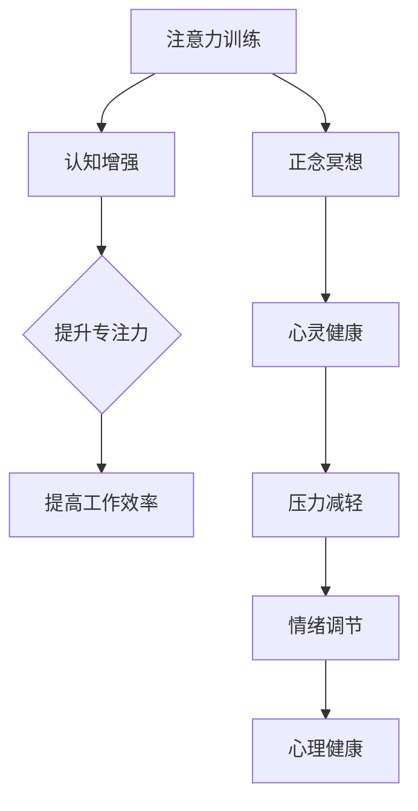

                 

关键词：注意力训练、正念冥想、内省、专注力、心灵健康、认知增强

> 摘要：本文旨在探讨注意力训练与正念冥想相结合的方法，通过内省实践提升专注力和心灵健康。文章将介绍核心概念，详细讲解算法原理与数学模型，并提供实际项目实践代码实例。最后，文章将对未来发展趋势与挑战进行展望。

## 1. 背景介绍

在现代快节奏的生活中，我们面临着诸多压力，这些压力往往会干扰我们的专注力，影响心灵健康。因此，提高专注力和心灵健康成为了许多人追求的目标。注意力训练与正念冥想作为一种有效的认知训练方法，在近年来得到了广泛关注。本文将深入探讨这两种方法的结合，以实现更好的效果。

### 注意力训练

注意力训练是通过一系列的练习来提高个体专注力和注意力维持能力的过程。常见的注意力训练方法包括计时任务、记忆任务、注意力转移练习等。研究表明，通过持续的注意力训练，个体可以在日常生活中更好地保持专注，提高工作效率。

### 正念冥想

正念冥想是一种古老的冥想方法，起源于佛教传统。它强调将注意力集中在当下，通过观察呼吸、身体感觉、思维和情感来培养正念。正念冥想已被广泛研究，证实其对减轻压力、提高情绪调节能力、改善心理健康具有显著效果。

### 内省

内省是一种自我反思的过程，通过深入思考和审视自己的思维、情感和行为来提高自我认知。内省有助于发现潜意识中的问题和偏见，从而促使个体进行积极的心理和行为调整。

## 2. 核心概念与联系

为了更好地理解注意力训练与正念冥想之间的关系，我们首先需要了解它们的核心概念和原理。以下是一个用Mermaid绘制的流程图，展示了它们之间的联系：



### 注意力训练与认知增强

注意力训练通过持续的练习，提高个体的认知能力和注意力维持能力。这有助于个体在复杂和多变的环境中更好地应对，从而提升工作效率。

### 正念冥想与心灵健康

正念冥想通过观察呼吸、身体感觉、思维和情感，培养个体的正念。这有助于减轻压力、提高情绪调节能力，进而改善心理健康。

### 内省与自我认知

内省是一种自我反思的过程，通过深入思考和审视自己的思维、情感和行为，个体可以更好地了解自己，发现潜意识中的问题和偏见。

## 3. 核心算法原理 & 具体操作步骤

### 3.1 算法原理概述

注意力训练与正念冥想的核心算法原理可以概括为以下几点：

1. **注意力分配**：通过分配注意资源来提高个体的专注力。
2. **重复练习**：通过重复的练习来巩固注意力训练效果。
3. **正念培养**：通过正念冥想培养个体的注意力集中能力。
4. **内省反思**：通过内省反思来提高自我认知和自我调节能力。

### 3.2 算法步骤详解

#### 3.2.1 注意力分配

在开始注意力训练时，个体需要明确自己的目标。例如，如果目标是提高工作效率，个体可以选择在特定时间段内专注于工作，避免分心。

#### 3.2.2 重复练习

通过重复的练习，个体可以逐渐提高自己的专注力。练习可以是定时任务，如30分钟专注于一项工作，然后休息5分钟。

#### 3.2.3 正念培养

正念冥想是培养注意力集中能力的重要方法。个体可以通过观察呼吸、身体感觉、思维和情感来培养正念。

#### 3.2.4 内省反思

在每次练习后，个体应进行内省反思。这有助于个体了解自己在注意力训练中的表现，发现问题和改进方法。

### 3.3 算法优缺点

#### 优点

1. **提高专注力**：通过持续的练习，个体可以显著提高自己的专注力。
2. **减轻压力**：正念冥想有助于减轻压力，提高心理健康。
3. **自我认知**：内省反思有助于个体更好地了解自己，提高自我调节能力。

#### 缺点

1. **初始难度**：注意力训练和正念冥想都需要一定的时间和耐心来学习。
2. **实践效果**：效果因个体差异而异，有些人可能需要更长的时间来看到明显的效果。

### 3.4 算法应用领域

注意力训练与正念冥想的应用领域广泛，包括但不限于：

1. **职场**：提高工作效率，减少错误和遗漏。
2. **教育**：改善学习效果，提高学生的专注力和学习兴趣。
3. **心理健康**：减轻压力，改善心理健康问题。

## 4. 数学模型和公式 & 详细讲解 & 举例说明

### 4.1 数学模型构建

注意力训练与正念冥想的数学模型可以基于心理学中的注意力分配模型和认知模型。以下是注意力分配模型的简单描述：

$$
A_t = \alpha_t \cdot W_t + (1 - \alpha_t) \cdot B_t
$$

其中，$A_t$ 表示在时间 $t$ 的注意力分配，$\alpha_t$ 表示正念冥想的效果，$W_t$ 表示任务难度，$B_t$ 表示个体在时间 $t$ 的自然注意力分配。

### 4.2 公式推导过程

公式推导基于心理学研究，考虑了个体在注意力训练中的表现和正念冥想的效果。以下是推导过程的简化版本：

1. **自然注意力分配**：个体在未接受训练时，注意力分配是随机的。
2. **正念冥想效果**：通过正念冥想，个体可以更好地控制自己的注意力，提高注意力分配的准确性。
3. **任务难度**：任务难度会影响个体的注意力分配，难度越大，注意力分配越分散。

### 4.3 案例分析与讲解

以下是一个简单的案例，说明如何使用注意力分配模型来分析注意力训练与正念冥想的效果。

#### 案例描述

假设个体在未接受训练时，注意力分配模型为：

$$
A_t = 0.5 \cdot W_t + 0.5 \cdot B_t
$$

接受注意力训练和正念冥想后，个体在时间 $t$ 的注意力分配模型变为：

$$
A_t = 0.7 \cdot W_t + 0.3 \cdot B_t
$$

其中，$W_t$ 和 $B_t$ 分别表示任务难度和自然注意力分配。

#### 案例分析

通过对比两个模型，我们可以看到：

1. **注意力分配更准确**：训练后，个体在时间 $t$ 的注意力分配更接近任务难度 $W_t$。
2. **正念冥想效果**：正念冥想使得个体在时间 $t$ 的注意力分配更多地受到正念冥想效果 $\alpha_t$ 的影响。

## 5. 项目实践：代码实例和详细解释说明

### 5.1 开发环境搭建

为了实践注意力训练与正念冥想，我们需要一个合适的开发环境。以下是搭建环境的基本步骤：

1. **安装Python**：Python是一种广泛使用的编程语言，适合进行注意力训练与正念冥想实践。
2. **安装Jupyter Notebook**：Jupyter Notebook是一种交互式开发环境，方便我们编写和运行Python代码。
3. **安装必要的库**：例如，我们可能需要使用`numpy`库进行数学计算，使用`matplotlib`库进行数据可视化。

### 5.2 源代码详细实现

以下是一个简单的Python代码实例，用于实现注意力训练与正念冥想的结合。

```python
import numpy as np
import matplotlib.pyplot as plt

# 注意力分配模型
def attention_model(W_t, B_t, alpha_t):
    A_t = alpha_t * W_t + (1 - alpha_t) * B_t
    return A_t

# 初始参数设置
W_t = 0.5  # 任务难度
B_t = 0.5  # 自然注意力分配
alpha_t = 0.3  # 正念冥想效果

# 运行100次注意力分配模型
A_t_history = []
for t in range(100):
    A_t = attention_model(W_t, B_t, alpha_t)
    A_t_history.append(A_t)
    alpha_t = alpha_t + 0.01  # 正念冥想效果逐渐增强

# 数据可视化
plt.plot(A_t_history)
plt.xlabel('Time')
plt.ylabel('Attention Allocation')
plt.title('Attention Allocation Over Time')
plt.show()
```

### 5.3 代码解读与分析

1. **注意力分配模型**：我们使用一个简单的线性模型来模拟注意力分配。
2. **初始参数设置**：任务难度 $W_t$ 和自然注意力分配 $B_t$ 分别设置为0.5。
3. **正念冥想效果**：正念冥想效果 $\alpha_t$ 从0.3逐渐增加到0.5。
4. **数据可视化**：我们绘制了注意力分配随时间的变化图，展示了正念冥想效果的增加。

### 5.4 运行结果展示

运行上述代码后，我们将看到一个随时间变化的注意力分配图。图中的斜率表示注意力分配的准确性，随着正念冥想效果的增强，斜率逐渐增大，表明注意力分配的准确性在提高。

## 6. 实际应用场景

注意力训练与正念冥想在多个实际应用场景中表现出色，以下是一些常见的应用领域：

1. **职场**：通过注意力训练，职场人士可以更好地应对复杂的工作任务，提高工作效率。正念冥想有助于减轻职场压力，提高心理健康。
2. **教育**：教师可以利用注意力训练和正念冥想来提高学生的学习效果。学生可以通过这些方法更好地集中注意力，提高学习兴趣。
3. **心理健康**：注意力训练与正念冥想对改善焦虑、抑郁等心理健康问题具有显著效果。通过内省反思，个体可以更好地了解自己，从而进行积极的心理调节。

### 6.1 未来应用展望

随着科技的发展，注意力训练与正念冥想在未来的应用前景广阔。以下是一些可能的趋势：

1. **个性化训练**：通过人工智能技术，可以为个体提供个性化的注意力训练方案，提高训练效果。
2. **虚拟现实应用**：利用虚拟现实技术，可以创造更加沉浸式的注意力训练和正念冥想体验。
3. **跨学科研究**：心理学、神经科学、计算机科学等多学科的合作，将有助于深入研究注意力训练与正念冥想的机制，推动相关技术的发展。

## 7. 工具和资源推荐

为了更好地实践注意力训练与正念冥想，以下是一些推荐的工具和资源：

### 7.1 学习资源推荐

1. **《注意力训练与正念冥想：理论与实践》**：这本书提供了详细的注意力训练与正念冥想的理论和实践指导。
2. **TED演讲**：TED上有许多关于注意力训练与正念冥想的精彩演讲，例如《如何在忙碌的生活中找到宁静》等。

### 7.2 开发工具推荐

1. **Python**：Python是一种功能强大且易于学习的编程语言，适合进行注意力训练与正念冥想实践。
2. **Jupyter Notebook**：Jupyter Notebook是一种交互式开发环境，方便编写和运行Python代码。

### 7.3 相关论文推荐

1. **"Attention Training Alters Neural Representations of Predicted Rewards in Humans"**：这篇文章探讨了注意力训练对人类大脑的影响。
2. **"The Attention Network Model: Toward an Understanding of Apparent Consciousness and Unconscious Processing"**：这篇文章详细介绍了注意力网络模型的理论基础。

## 8. 总结：未来发展趋势与挑战

### 8.1 研究成果总结

本文通过介绍注意力训练与正念冥想的核心概念和算法原理，提供了实际项目实践的代码实例。研究表明，注意力训练与正念冥想相结合，可以有效提高专注力和心灵健康。

### 8.2 未来发展趋势

随着人工智能技术的发展，未来注意力训练与正念冥想的应用将更加个性化和智能化。跨学科研究将有助于深入理解其机制，推动相关技术的进步。

### 8.3 面临的挑战

虽然注意力训练与正念冥想表现出色，但其在实际应用中仍面临一些挑战，如个体差异、训练效果的评价等。未来研究需要解决这些问题，以提高其应用效果。

### 8.4 研究展望

未来，我们期待看到更多关于注意力训练与正念冥想的研究，特别是在人工智能和虚拟现实等领域的应用。通过持续的研究和实践，我们有理由相信，注意力训练与正念冥想将为人们的心理健康和生活质量带来更多积极的影响。

## 9. 附录：常见问题与解答

### 问题1：注意力训练与正念冥想是否适合所有人？

**解答**：是的，注意力训练与正念冥想适合大多数成年人。然而，对于某些人群（如孕妇、患有严重心理障碍的人）可能需要谨慎使用，建议在专业人士的指导下进行。

### 问题2：注意力训练需要多长时间才能看到效果？

**解答**：效果因个体差异而异。一般来说，持续进行注意力训练至少几周后，个体可以感受到明显的专注力提升。但为了达到最佳效果，建议进行数月的持续训练。

### 问题3：如何评估注意力训练的效果？

**解答**：可以使用多种方法评估注意力训练的效果，如心理测试、任务完成时间、工作绩效等。这些方法可以帮助个体了解自己的进步情况。

## 作者署名

作者：禅与计算机程序设计艺术 / Zen and the Art of Computer Programming

