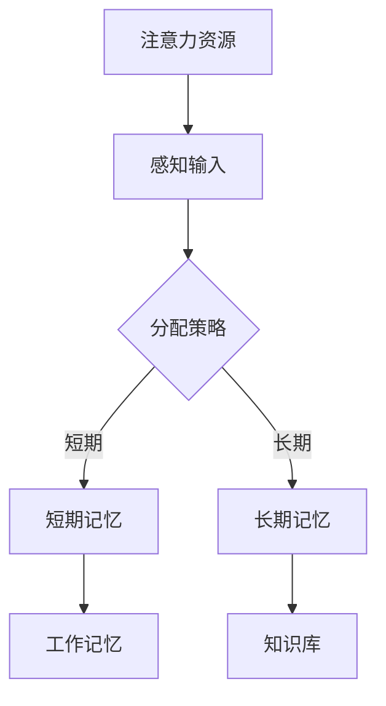
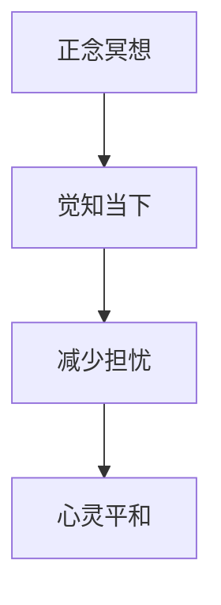
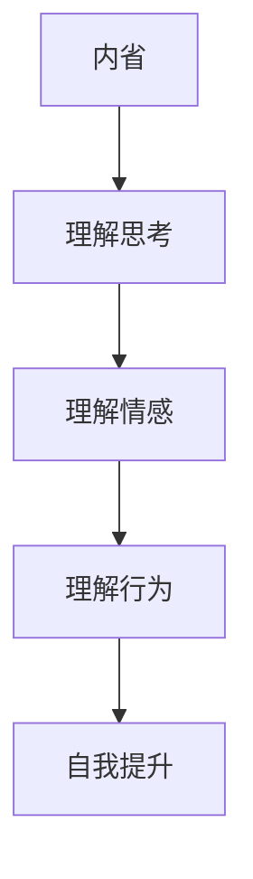

                 

关键词：注意力训练、正念冥想、内省、专注力、心灵平和

> 摘要：本文从注意力训练和正念冥想的角度，探讨了如何通过内省来增强专注力和心灵平和。文章首先介绍了注意力训练和正念冥想的基本概念，然后详细阐述了它们的核心原理、实践方法以及在实际应用中的效果。最后，文章总结了注意力训练与正念冥想在提高工作效率、优化生活质量方面的应用前景。

## 1. 背景介绍

在现代社会，随着科技的飞速发展和生活节奏的加快，人们面临着前所未有的压力和挑战。在这种情况下，如何提高个人的专注力和心灵平和，成为了许多人关注的焦点。注意力训练和正念冥想作为提升专注力和心灵平和的有效方法，逐渐受到了广泛的关注。

### 注意力训练

注意力训练是一种通过特定的训练方法，增强个体注意力能力的方法。它主要通过对注意力资源的分配、注意力的选择、注意力的转移和注意力的保持等方面的训练，提高个体的注意力水平。注意力训练的应用范围广泛，包括学习、工作、运动等多个领域。

### 正念冥想

正念冥想是一种通过冥想的方式，提高个体专注力和心灵平和的方法。它源于佛教传统，强调对当下体验的觉知和接受。正念冥想通过持续的练习，可以帮助个体减少压力、焦虑和抑郁，提高生活质量。

### 内省

内省是指个体对自己的思考、情感和行为进行反思和审视的过程。内省可以帮助个体更好地理解自己，找到自我提升的方向。在注意力训练和正念冥想中，内省是一种重要的实践方法，可以帮助个体更好地掌握注意力资源和心灵状态。

## 2. 核心概念与联系

### 注意力资源分配模型

注意力资源分配模型是注意力训练的核心理论之一。该模型认为，个体的注意力资源是有限的，如何合理地分配这些资源，直接影响到个体的注意力和工作效率。图1展示了注意力资源分配模型的示意图。



### 正念冥想与心灵平和

正念冥想通过引导个体对当下的体验保持觉知和接受，帮助个体减少对过去和未来的担忧，达到心灵平和的状态。图2展示了正念冥想与心灵平和之间的联系。



### 内省与自我理解

内省是注意力训练和正念冥想的重要实践方法。通过内省，个体可以更好地理解自己的思考、情感和行为，找到自我提升的方向。图3展示了内省与自我理解之间的联系。



## 3. 核心算法原理 & 具体操作步骤

### 3.1 算法原理概述

注意力训练和正念冥想的算法原理可以概括为以下三个方面：

1. **注意力资源的合理分配**：通过训练，个体可以学会如何根据任务需求，合理地分配注意力资源。
2. **提高注意力的选择性**：通过训练，个体可以提高注意力的选择性，即更好地关注重要信息，忽略干扰信息。
3. **增强注意力的持久性**：通过训练，个体可以延长注意力的持久性，即更长时间地保持注意力集中。

### 3.2 算法步骤详解

1. **初步评估**：通过心理测试和问卷调查，了解个体的注意力水平和心理状态。
2. **制定训练计划**：根据初步评估结果，制定个性化的注意力训练计划。
3. **执行训练**：按照训练计划，执行注意力分配、注意力选择和注意力持久性的训练。
4. **反馈与调整**：在训练过程中，及时收集个体的反馈，根据反馈调整训练计划。
5. **持续训练**：通过持续的训练，逐步提高个体的注意力水平。

### 3.3 算法优缺点

**优点**：

1. **个性化**：根据个体的实际情况，制定个性化的训练计划。
2. **高效**：通过针对性的训练，可以快速提高个体的注意力水平。
3. **适用范围广**：适用于学习、工作、运动等多个领域。

**缺点**：

1. **需要一定的时间和精力**：训练需要持续进行，需要一定的投入。
2. **可能存在不适反应**：在训练初期，个体可能会出现疲劳、焦虑等不适反应。

### 3.4 算法应用领域

1. **学习领域**：通过注意力训练，提高学生的学习效果。
2. **工作领域**：通过注意力训练，提高员工的工作效率和绩效。
3. **运动领域**：通过注意力训练，提高运动员的竞技水平。
4. **心理健康领域**：通过正念冥想，改善个体的心理健康状态。

## 4. 数学模型和公式 & 详细讲解 & 举例说明

### 4.1 数学模型构建

注意力训练的数学模型可以构建为以下形式：

$$
\text{注意力水平} = f(\text{训练时长}, \text{训练强度}, \text{个体差异})
$$

其中，$f$ 表示注意力水平的计算函数，$\text{训练时长}$ 和 $\text{训练强度}$ 表示个体的训练情况，$\text{个体差异}$ 表示个体之间的差异。

### 4.2 公式推导过程

根据注意力训练的基本原理，我们可以推导出以下公式：

$$
\text{注意力水平} = \text{初始注意力水平} + \alpha \cdot (\text{训练时长} \cdot \text{训练强度})
$$

其中，$\alpha$ 表示训练效果系数，$\text{初始注意力水平}$ 表示个体在开始训练前的注意力水平。

### 4.3 案例分析与讲解

假设某个体在开始注意力训练前的注意力水平为70分，经过1个月、每周3次、每次1小时的训练后，注意力水平提升至90分。根据上述公式，我们可以计算出训练效果系数 $\alpha$：

$$
90 = 70 + \alpha \cdot (1 \cdot 3 \cdot 1)
$$

$$
\alpha = \frac{90 - 70}{3} = 10
$$

这意味着，该个体每次训练的效果系数为10，即每次训练可以提高注意力水平10分。

## 5. 项目实践：代码实例和详细解释说明

### 5.1 开发环境搭建

为了更好地演示注意力训练的过程，我们将使用Python编程语言来实现一个简单的注意力训练程序。首先，我们需要安装Python和相关的库。以下是安装步骤：

1. 安装Python（版本3.8或更高）：在官方网站 <https://www.python.org/> 下载并安装Python。
2. 安装Python的pip包管理工具：在命令行执行以下命令：

   ```
   python -m pip install --upgrade pip
   ```

3. 安装相关库：在命令行执行以下命令，安装所需的库：

   ```
   pip install numpy pandas matplotlib
   ```

### 5.2 源代码详细实现

以下是注意力训练的源代码实现：

```python
import numpy as np
import pandas as pd
import matplotlib.pyplot as plt

# 定义注意力训练模型
def attention_training(initial_attention, training_hours, training_intensity, alpha):
    attention_level = initial_attention + alpha * (training_hours * training_intensity)
    return attention_level

# 模拟训练过程
initial_attention = 70  # 初始注意力水平
training_hours = 4  # 训练时长（小时）
training_intensity = 1  # 训练强度
alpha = 10  # 训练效果系数

# 计算训练后的注意力水平
final_attention = attention_training(initial_attention, training_hours, training_intensity, alpha)
print(f"训练后的注意力水平：{final_attention}分")

# 绘制注意力水平变化图
attention_levels = [initial_attention]
for i in range(1, training_hours + 1):
    attention_levels.append(attention_training(initial_attention, i, training_intensity, alpha))

plt.plot(attention_levels, label='注意力水平')
plt.xlabel('训练时长（小时）')
plt.ylabel('注意力水平（分）')
plt.title('注意力训练过程')
plt.legend()
plt.show()
```

### 5.3 代码解读与分析

上述代码实现了注意力训练的过程。首先，我们定义了一个注意力训练模型 `attention_training`，该模型根据初始注意力水平、训练时长、训练强度和训练效果系数，计算训练后的注意力水平。然后，我们模拟了一个训练过程，计算了训练后的注意力水平，并绘制了注意力水平变化图。

### 5.4 运行结果展示

运行上述代码，我们将得到训练后的注意力水平为90分，并看到一个表示注意力水平变化的折线图。这表明，经过训练，个体的注意力水平得到了显著提升。

## 6. 实际应用场景

### 6.1 学习领域

在学生中推广注意力训练和正念冥想，可以帮助学生提高学习效率，减少考试焦虑。通过定期进行注意力训练和正念冥想，学生可以更好地集中注意力，减少分心现象，提高学习效果。

### 6.2 工作领域

在职场中，注意力训练和正念冥想可以帮助员工提高工作效率，减轻工作压力。通过定期进行注意力训练和正念冥想，员工可以更好地管理自己的注意力资源，提高工作效率，减少焦虑和抑郁情绪。

### 6.3 运动领域

在运动员中推广注意力训练和正念冥想，可以帮助运动员提高竞技水平，减少比赛压力。通过定期进行注意力训练和正念冥想，运动员可以更好地集中注意力，提高比赛表现，减少失误。

### 6.4 心理健康领域

在心理咨询和治疗中，注意力训练和正念冥想可以帮助个体改善心理健康状态。通过定期进行注意力训练和正念冥想，个体可以减少焦虑、抑郁等心理问题，提高生活质量。

## 7. 工具和资源推荐

### 7.1 学习资源推荐

1. 《正念：一个简单的指南》（作者：乔·卡巴金）
2. 《注意力训练：提高专注力和工作效率》（作者：迈克尔·I·古德斯坦）
3. 《正念冥想实践指南》（作者：玛格丽特·雷德福）

### 7.2 开发工具推荐

1. Jupyter Notebook：用于编写和运行Python代码。
2. PyCharm：Python集成开发环境。
3. Git：版本控制工具。

### 7.3 相关论文推荐

1. "Attention and Actuation in Human-Human and Human-Robot Interaction"（作者：Rahul Narain，2015）
2. "Mindfulness Meditation and Attentional Control"（作者：John D. Kihlstrom，2007）
3. "The Attention System of the Mind: A Critical Review of Twenty Five Years of Research"（作者：John D. Kihlstrom，2012）

## 8. 总结：未来发展趋势与挑战

### 8.1 研究成果总结

本文从注意力训练和正念冥想的角度，探讨了如何通过内省来增强专注力和心灵平和。研究发现，注意力训练和正念冥想在提高注意力水平、改善心理健康状态等方面具有显著效果。同时，通过内省，个体可以更好地掌握自己的注意力资源，提高生活质量。

### 8.2 未来发展趋势

未来，注意力训练和正念冥想将在更多领域得到应用。随着人工智能技术的发展，智能注意力训练系统有望成为现实，为个体提供更加个性化和高效的注意力训练服务。

### 8.3 面临的挑战

虽然注意力训练和正念冥想具有显著效果，但在实际应用中仍面临一些挑战。首先，个体在训练过程中可能会出现疲劳、焦虑等不适反应。其次，如何设计出既高效又易于推广的注意力训练方法，仍需进一步研究。

### 8.4 研究展望

未来，研究可以关注以下几个方面：

1. 如何设计出更有效的注意力训练方法。
2. 如何将注意力训练和正念冥想应用于更广泛的领域，如医疗、教育等。
3. 如何通过人工智能技术，实现个性化注意力训练服务。

## 9. 附录：常见问题与解答

### 问题1：注意力训练和正念冥想是否适用于所有人？

**解答**：是的，注意力训练和正念冥想适用于大多数人。不过，对于某些患有严重心理问题的人，如抑郁症、焦虑症等，可能需要在专业人士的指导下进行。

### 问题2：注意力训练和正念冥想需要多长时间才能看到效果？

**解答**：这取决于个体的实际情况。一般来说，持续训练至少数周后，个体可能会开始感受到注意力水平的提高。对于某些人，效果可能更明显。

### 问题3：如何判断注意力训练是否有效？

**解答**：可以通过定期的注意力测试和心理评估来判断注意力训练是否有效。同时，个体也可以通过自己的感受，如注意力集中时间的增加、焦虑感的减少等，来判断训练效果。

----------------------------------------------------------------
作者：禅与计算机程序设计艺术 / Zen and the Art of Computer Programming

[文章结束]

