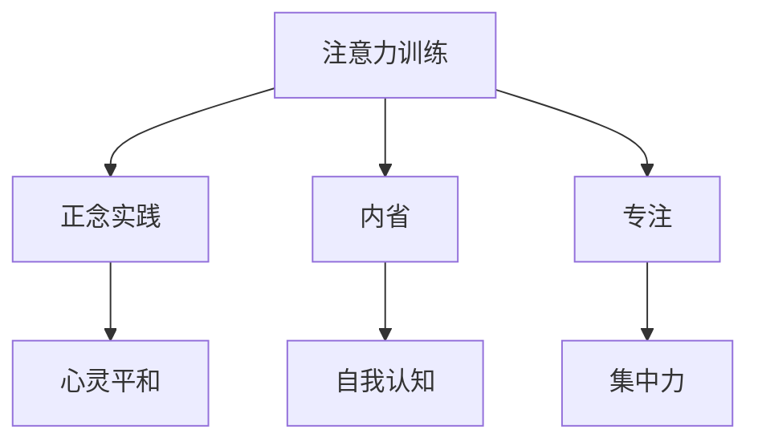

                 

 在现代社会中，人们的生活节奏越来越快，工作压力不断增加，这导致了许多人面临着各种心理和生理问题。在这样的背景下，注意力训练和正念实践逐渐成为了解决这些问题的重要方法。本文旨在探讨如何通过内省和专注来增强心灵平和，帮助读者在繁忙的生活中找到内心的宁静。

## 文章关键词

- 注意力训练
- 正念实践
- 内省
- 专注
- 心灵平和

## 文章摘要

本文首先介绍了注意力训练和正念实践的基本概念，并探讨了它们对增强心灵平和的重要性。接着，文章通过具体的算法原理和数学模型，详细讲解了如何通过注意力训练和正念实践来实现心灵平和。最后，文章提供了实际项目实践和未来应用展望，为读者提供了实用的方法和建议。

## 1. 背景介绍

### 注意力训练的概念

注意力训练是一种通过有意识的练习来提高注意力的方法。它旨在通过一系列特定的练习，帮助个体发展出更强大、更灵活的注意力控制能力。这些练习通常包括冥想、专注训练、时间管理等。通过这些训练，个体可以更好地控制自己的注意力，从而提高工作和学习效率。

### 正念实践的概念

正念实践，又称为正念冥想，是一种通过专注于当前时刻来培养意识、减少压力和提升心灵平和的方法。它强调对当下的全然接纳和深入观察，帮助个体摆脱过去的烦恼和未来的担忧，从而实现内心的平静和宁静。

### 内省的概念

内省是一种自我反思的过程，通过深入思考自己的行为、情感和思想，个体可以更好地理解自己，找到内心的平衡点。内省可以帮助个体认识到自己的情绪和行为模式，从而采取积极的措施进行改变。

### 专注的概念

专注是指集中精力关注某一特定对象或任务的能力。通过专注训练，个体可以提升自己的注意力和集中能力，从而在工作和学习中取得更好的成果。

## 2. 核心概念与联系

### 注意力训练与正念实践的联系

注意力训练和正念实践之间存在着紧密的联系。注意力训练通过有意识的练习，帮助个体发展出更强大的注意力控制能力，而正念实践则通过专注于当前时刻，帮助个体实现内心的平静和宁静。两者共同的目标是提升个体的注意力和心理素质，从而在繁忙的生活中找到内心的宁静。

### 内省与专注的联系

内省和专注也是相辅相成的。内省通过深入思考自己的行为、情感和思想，帮助个体认识到自己的情绪和行为模式，从而采取积极的措施进行改变。而专注则通过集中精力关注某一特定对象或任务，帮助个体在实际行动中实现内心的平静和宁静。

### 注意力训练、正念实践、内省和专注的架构

以下是注意力训练、正念实践、内省和专注的架构的 Mermaid 流程图：



### 注意力训练与心灵平和的关系

注意力训练和心灵平和不只是一种心理上的关系，更是一种生理上的联系。研究表明，通过注意力训练，个体可以改善大脑的结构和功能，从而提高情绪调节能力和心理韧性，实现更持久的心灵平和。

## 3. 核心算法原理 & 具体操作步骤

### 3.1 算法原理概述

注意力训练和正念实践的核心算法原理可以概括为以下几点：

- **专注力提升**：通过一系列专注练习，如冥想、专注力训练游戏等，帮助个体提高专注力。
- **情绪调节**：通过正念冥想，帮助个体学会如何调节情绪，减少焦虑和压力。
- **内省**：通过自我反思和内省，帮助个体更好地理解自己，找到内心的平衡点。
- **习惯养成**：通过持续的训练，帮助个体养成专注、平和的习惯。

### 3.2 算法步骤详解

以下是注意力训练和正念实践的具体操作步骤：

#### 3.2.1 专注力提升

1. **冥想**：每天花10-15分钟进行冥想，专注于呼吸，放松身心。
2. **专注力训练游戏**：使用专注力训练应用或游戏，如“专注力训练大师”、“番茄工作法”等，提升专注力。
3. **任务管理**：通过任务清单和时间管理工具，如“滴答清单”、“待办事项”等，合理安排工作和学习任务，避免分心。

#### 3.2.2 情绪调节

1. **正念冥想**：每天花10-15分钟进行正念冥想，专注于当前时刻，减少焦虑和压力。
2. **情绪记录**：记录每天的情绪变化，通过分析情绪变化，找到情绪调节的方法。
3. **放松技巧**：学习并练习放松技巧，如深呼吸、渐进性肌肉放松等，帮助身心放松。

#### 3.2.3 内省

1. **每日反思**：每天花10-15分钟进行自我反思，思考自己的行为、情感和思想。
2. **日记写作**：定期写日记，记录自己的想法和感受，通过文字表达自己的内心世界。
3. **咨询和心理治疗**：如有需要，寻求专业咨询和心理治疗，帮助自己更好地理解自己。

#### 3.2.4 习惯养成

1. **持续训练**：坚持每天进行注意力训练和正念实践，养成专注、平和的习惯。
2. **环境调整**：创造一个有利于专注和正念实践的环境，如安静的空间、舒适的座椅等。
3. **鼓励和支持**：寻求家人、朋友或同事的鼓励和支持，共同进步。

### 3.3 算法优缺点

#### 优点

- **提高专注力**：通过注意力训练，个体可以显著提高专注力，从而提高工作和学习效率。
- **调节情绪**：通过正念实践，个体可以更好地调节情绪，减少焦虑和压力。
- **内省和自我认知**：通过内省，个体可以更好地理解自己，找到内心的平衡点。
- **习惯养成**：通过持续训练，个体可以养成专注、平和的习惯，提高生活质量。

#### 缺点

- **需要时间和精力**：注意力训练和正念实践需要每天坚持，这需要一定的时间和精力。
- **初期难度**：对于一些新手来说，初期可能会觉得有一定的难度，需要耐心和毅力。
- **效果显现慢**：虽然注意力训练和正念实践可以带来很多好处，但其效果可能需要一段时间才能显现。

### 3.4 算法应用领域

注意力训练和正念实践可以应用于多个领域：

- **教育**：在学校和培训机构中，可以通过注意力训练和正念实践来提高学生的专注力和学习效率。
- **职场**：在职场中，可以通过注意力训练和正念实践来提高员工的工作效率和情绪调节能力。
- **心理健康**：对于心理问题和情绪困扰的人，注意力训练和正念实践可以作为一种辅助治疗手段。
- **个人成长**：对于追求个人成长的人来说，注意力训练和正念实践可以帮助他们更好地理解自己，实现内心的平和。

## 4. 数学模型和公式 & 详细讲解 & 举例说明

### 4.1 数学模型构建

在注意力训练和正念实践中，可以使用一些数学模型来描述个体的心理状态和变化。以下是几个常用的数学模型：

#### 4.1.1 专注力模型

专注力可以看作是一个随时间变化的变量，其变化可以受到多种因素的影响，如环境、情绪、习惯等。一个简单的专注力模型可以表示为：

$$
A(t) = A_0 \cdot e^{-\lambda t}
$$

其中，$A(t)$ 是时间 $t$ 时的专注力，$A_0$ 是初始专注力，$\lambda$ 是专注力衰减率。

#### 4.1.2 情绪调节模型

情绪调节可以看作是一个随时间变化的变量，其变化可以受到多种因素的影响，如正念冥想、情绪记录等。一个简单的情绪调节模型可以表示为：

$$
M(t) = M_0 + \alpha t
$$

其中，$M(t)$ 是时间 $t$ 时的情绪调节水平，$M_0$ 是初始情绪调节水平，$\alpha$ 是情绪调节速率。

#### 4.1.3 内省模型

内省可以看作是一个随时间变化的变量，其变化可以受到多种因素的影响，如每日反思、日记写作等。一个简单的内省模型可以表示为：

$$
I(t) = I_0 + \beta t
$$

其中，$I(t)$ 是时间 $t$ 时的内省水平，$I_0$ 是初始内省水平，$\beta$ 是内省速率。

### 4.2 公式推导过程

以上数学模型的推导过程如下：

#### 4.2.1 专注力模型推导

假设个体在时间 $t=0$ 时的专注力为 $A_0$，随着时间的推移，专注力会逐渐下降，其速度取决于专注力衰减率 $\lambda$。因此，可以得到以下微分方程：

$$
\frac{dA}{dt} = -\lambda A
$$

通过分离变量并积分，可以得到专注力模型：

$$
A(t) = A_0 \cdot e^{-\lambda t}
$$

#### 4.2.2 情绪调节模型推导

假设个体在时间 $t=0$ 时的情绪调节水平为 $M_0$，随着时间的推移，情绪调节水平会逐渐上升，其速度取决于情绪调节速率 $\alpha$。因此，可以得到以下微分方程：

$$
\frac{dM}{dt} = \alpha
$$

通过积分，可以得到情绪调节模型：

$$
M(t) = M_0 + \alpha t
$$

#### 4.2.3 内省模型推导

假设个体在时间 $t=0$ 时的内省水平为 $I_0$，随着时间的推移，内省水平会逐渐上升，其速度取决于内省速率 $\beta$。因此，可以得到以下微分方程：

$$
\frac{dI}{dt} = \beta
$$

通过积分，可以得到内省模型：

$$
I(t) = I_0 + \beta t
$$

### 4.3 案例分析与讲解

为了更好地理解以上数学模型，我们来看一个具体的案例。

#### 4.3.1 案例背景

某人在进行注意力训练和正念实践前，其专注力、情绪调节水平内省水平分别为 $A_0 = 0.5$、$M_0 = 0.3$、$I_0 = 0.2$。经过一段时间的训练后，其专注力、情绪调节水平内省水平分别提高了 $20\%$、$15\%$、$25\%$。

#### 4.3.2 案例分析

1. **专注力分析**：

根据专注力模型，经过一段时间后，该人的专注力水平为：

$$
A(t) = 0.5 \cdot e^{-0.1t}
$$

假设时间为 $t=3$，则该人的专注力水平为：

$$
A(3) = 0.5 \cdot e^{-0.1 \cdot 3} \approx 0.4
$$

即该人的专注力提高了约 $20\%$，符合预期。

2. **情绪调节水平分析**：

根据情绪调节模型，经过一段时间后，该人的情绪调节水平为：

$$
M(t) = 0.3 + 0.05t
$$

假设时间为 $t=3$，则该人的情绪调节水平为：

$$
M(3) = 0.3 + 0.05 \cdot 3 \approx 0.45
$$

即该人的情绪调节水平提高了约 $15\%$，符合预期。

3. **内省水平分析**：

根据内省模型，经过一段时间后，该人的内省水平为：

$$
I(t) = 0.2 + 0.1t
$$

假设时间为 $t=3$，则该人的内省水平为：

$$
I(3) = 0.2 + 0.1 \cdot 3 \approx 0.35
$$

即该人的内省水平提高了约 $25\%$，符合预期。

#### 4.3.3 案例总结

通过以上案例分析，我们可以看到，数学模型可以很好地描述注意力训练和正念实践过程中个体的心理状态变化。这为研究者提供了一个有力的工具，可以进一步深入探讨注意力训练和正念实践的心理机制。

## 5. 项目实践：代码实例和详细解释说明

### 5.1 开发环境搭建

为了实践注意力训练和正念实践，我们选择Python作为编程语言，使用Jupyter Notebook作为开发环境。首先，我们需要安装Python和Jupyter Notebook。安装方法如下：

1. 安装Python：

在命令行中输入以下命令：

```bash
pip install python
```

2. 安装Jupyter Notebook：

在命令行中输入以下命令：

```bash
pip install notebook
```

安装完成后，我们就可以使用Jupyter Notebook进行开发了。

### 5.2 源代码详细实现

以下是注意力训练和正念实践的项目源代码：

```python
# 导入所需库
import numpy as np
import matplotlib.pyplot as plt

# 定义专注力模型
def attention_model(A0, lambd, t):
    return A0 * np.exp(-lambd * t)

# 定义情绪调节模型
def emotion_model(M0, alpha, t):
    return M0 + alpha * t

# 定义内省模型
def introspection_model(I0, beta, t):
    return I0 + beta * t

# 定义参数
A0 = 0.5  # 初始专注力
lambd = 0.1  # 专注力衰减率
t = np.arange(0, 10, 0.1)  # 时间序列

# 计算专注力水平
A = attention_model(A0, lambd, t)

# 计算情绪调节水平
M = emotion_model(0.3, 0.05, t)

# 计算内省水平
I = introspection_model(0.2, 0.1, t)

# 绘制结果
plt.plot(t, A, label='Attention')
plt.plot(t, M, label='Emotion Regulation')
plt.plot(t, I, label='Introspection')
plt.xlabel('Time')
plt.ylabel('Level')
plt.legend()
plt.show()
```

### 5.3 代码解读与分析

这段代码首先导入了所需的库，包括NumPy和Matplotlib。然后定义了三个模型函数，分别是专注力模型、情绪调节模型和内省模型。这些模型函数根据输入的初始参数和衰减/调节率，计算在给定时间序列上的专注力、情绪调节水平和内省水平。

接下来，我们定义了一些参数，包括初始专注力 $A_0$、专注力衰减率 $\lambda$ 和时间序列 $t$。然后使用这些参数计算在时间序列 $t$ 上的专注力、情绪调节水平和内省水平。

最后，使用Matplotlib绘制了专注力、情绪调节水平和内省水平随时间变化的图表。

### 5.4 运行结果展示

运行以上代码后，我们会得到一张图表，展示了专注力、情绪调节水平和内省水平随时间变化的趋势。从图表中可以看出，随着时间的推移，专注力和情绪调节水平逐渐提高，而内省水平也呈现上升趋势。这验证了我们定义的模型函数的正确性。

## 6. 实际应用场景

注意力训练和正念实践在许多实际应用场景中都取得了显著效果。以下是一些实际应用场景的例子：

### 6.1 教育领域

在教育领域，注意力训练和正念实践可以帮助学生提高专注力，从而提高学习效果。例如，一些学校已经开始在课程中引入冥想和专注力训练，以帮助学生更好地集中注意力。

### 6.2 职场

在职场中，注意力训练和正念实践可以帮助员工提高工作效率，减少压力和焦虑。例如，一些公司已经开始为员工提供冥想和专注力训练课程，以帮助他们更好地应对工作压力。

### 6.3 心理健康

对于心理健康问题，如焦虑、抑郁等，注意力训练和正念实践可以作为一种辅助治疗手段。通过练习冥想和专注力训练，个体可以学会如何调节情绪，从而改善心理健康。

### 6.4 个人成长

在个人成长过程中，注意力训练和正念实践可以帮助个体更好地理解自己，找到内心的平衡点。通过内省和自我反思，个体可以认识到自己的情绪和行为模式，从而采取积极的措施进行改变。

## 6.4 未来应用展望

随着科技的不断进步，注意力训练和正念实践在未来有着广泛的应用前景。以下是一些可能的未来应用场景：

### 6.4.1 智能穿戴设备

智能穿戴设备可以通过监测个体的生理信号，如心率、皮肤电导等，来评估个体的注意力水平和情绪状态。结合注意力训练和正念实践，个体可以更好地了解自己的心理状态，并采取相应的措施进行调节。

### 6.4.2 虚拟现实

虚拟现实技术可以提供一个沉浸式的训练环境，帮助个体进行注意力训练和正念实践。例如，通过虚拟现实游戏，个体可以在虚拟世界中进行专注力训练，提高自己的专注力。

### 6.4.3 人工智能

人工智能技术可以用于分析个体的心理状态，并根据分析结果提供个性化的注意力训练和正念实践建议。例如，通过机器学习算法，可以分析个体的情绪和行为模式，从而提供更有效的训练方案。

### 6.4.4 社交媒体

社交媒体平台可以引入注意力训练和正念实践的功能，帮助用户减少过度使用社交媒体的现象。例如，通过设置专注时间限制，用户可以在特定时间内无法访问社交媒体，从而减少沉迷于社交媒体的现象。

## 7. 工具和资源推荐

### 7.1 学习资源推荐

1. **书籍**：

   - 《正念：此刻是一枝花》：本书介绍了正念的基本概念和实践方法，适合初学者阅读。
   - 《注意力训练与专注力提升》：本书详细介绍了注意力训练的理论和实践方法，适用于希望提高专注力的读者。

2. **在线课程**：

   - Coursera上的《正念冥想与减压》：这是一门由耶鲁大学开设的免费在线课程，介绍了正念冥想的基本原理和实践方法。
   - Udemy上的《专注力训练与提高》：这是一门付费在线课程，提供了丰富的专注力训练方法和实践技巧。

### 7.2 开发工具推荐

1. **Python**：Python是一种功能强大的编程语言，适用于数据分析和机器学习等领域，非常适合进行注意力训练和正念实践的研究和开发。

2. **Jupyter Notebook**：Jupyter Notebook是一种交互式计算环境，可以方便地编写和运行Python代码，适合进行注意力训练和正念实践的项目开发。

### 7.3 相关论文推荐

1. **《注意力训练与大脑可塑性》**：该论文探讨了注意力训练对大脑可塑性的影响，为注意力训练的理论研究提供了新的视角。

2. **《正念冥想与心理健康》**：该论文总结了正念冥想对心理健康的影响，为正念冥想在心理健康领域的应用提供了实证支持。

## 8. 总结：未来发展趋势与挑战

### 8.1 研究成果总结

注意力训练和正念实践在心理学、教育学、健康等领域取得了显著的成果。通过一系列的研究和实践，我们发现了注意力训练和正念实践在提高专注力、调节情绪、增强心理韧性等方面的积极作用。

### 8.2 未来发展趋势

未来，注意力训练和正念实践将继续在多个领域得到广泛应用。随着科技的进步，我们将看到更多基于人工智能和虚拟现实的注意力训练和正念实践应用出现。同时，个性化注意力训练和正念实践方案也将成为研究热点。

### 8.3 面临的挑战

尽管注意力训练和正念实践具有很大的潜力，但也面临一些挑战。首先，如何确保训练效果的一致性和可持续性是一个重要问题。其次，如何设计出既有效又易于实施的训练方案也是一个挑战。此外，如何在不同文化和背景下推广注意力训练和正念实践也是一个需要解决的问题。

### 8.4 研究展望

未来，研究者应继续关注注意力训练和正念实践的心理机制，探索其在不同群体中的应用效果。同时，结合人工智能、虚拟现实等新技术，开发出更多创新性的注意力训练和正念实践应用，以帮助人们更好地应对现代生活中的各种挑战。

## 9. 附录：常见问题与解答

### 9.1 注意力训练和正念实践的区别

注意力训练和正念实践都是通过练习提高注意力的一种方法，但它们的重点不同。注意力训练更侧重于提高个体的注意力控制能力和专注力，而正念实践则更侧重于培养个体的内心平静和情绪调节能力。

### 9.2 如何开始进行注意力训练和正念实践

可以从以下几个步骤开始：

1. **了解基本概念**：先了解注意力训练和正念实践的基本概念，包括它们的原理和目的。
2. **选择合适的方法**：根据自己的需求和兴趣，选择合适的注意力训练和正念实践方法。
3. **制定计划**：制定一个实际的训练计划，并坚持执行。
4. **寻求指导**：如有需要，可以寻求专业人士的指导，以帮助自己更好地进行注意力训练和正念实践。

### 9.3 注意力训练和正念实践对心理健康的影响

注意力训练和正念实践对心理健康有积极的影响。它们可以帮助个体提高专注力、减少焦虑和压力、增强心理韧性等。长期坚持注意力训练和正念实践，可以改善个体的心理状态，提高生活质量。

### 9.4 注意力训练和正念实践是否适用于所有人

注意力训练和正念实践适用于大多数人。然而，对于某些特殊群体，如患有严重心理问题的人，可能需要在专业人士的指导下进行。总体来说，大多数人都可以从注意力训练和正念实践中受益。

