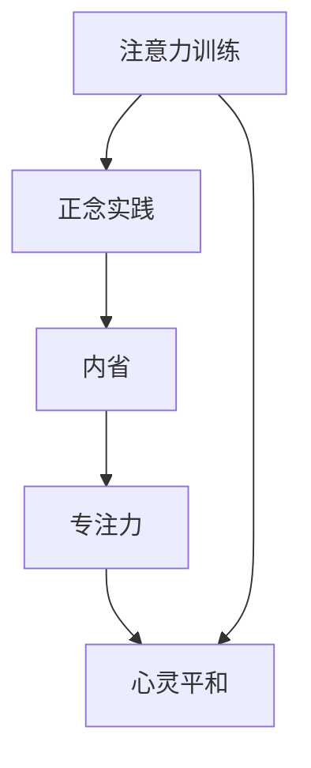

                 

 **关键词**: 注意力训练、正念实践、内省、专注、心灵平和、技术领域、算法、数学模型

**摘要**: 在快节奏的现代生活中，压力和焦虑成为常见的困扰。本文探讨了一种结合技术领域的注意力训练与正念实践的解决方案，通过内省和专注的方法，帮助读者提升心灵平和，提高工作效率和创造力。本文将介绍核心概念、算法原理、数学模型以及实际应用场景，并通过项目实践和工具资源推荐，为读者提供具体的操作指南和未来展望。

## 1. 背景介绍

在现代科技飞速发展的背景下，信息技术领域对人类智力的要求越来越高。然而，随着工作压力的增加、信息过载的困扰，许多技术人员感到难以集中注意力，导致工作效率和创造力下降。正念（Mindfulness）作为一种古老的冥想实践，已经被证明可以显著改善心理健康和注意力水平。本文旨在探讨如何将注意力训练与正念实践相结合，为IT专业人士提供一套实用的方法，帮助他们提升心灵平和，提高工作效率。

### 1.1 注意力训练的重要性

注意力是人类心智活动的基础，对于解决问题、创新思维和高效工作至关重要。然而，现代生活充满了干扰，从社交媒体的即时通知到不间断的工作邮件，这些因素都会分散我们的注意力，导致“注意力贫困”。注意力训练旨在通过特定的方法和实践，提高个体对注意力的控制和利用能力，从而提高工作效果和心理健康水平。

### 1.2 正念实践的基本原理

正念是一种通过培养对当前时刻的关注和接纳来提升心理健康的实践。它起源于佛教冥想，经过多年的研究和实践，已被广泛应用于心理健康和压力管理。正念的核心在于培养“有意识的注意”，即在没有评判和批判的心态下，对当前发生的事情保持觉察。这种练习可以帮助人们更好地应对压力，提高情绪调节能力，增强专注力和决策能力。

## 2. 核心概念与联系

为了更好地理解注意力训练与正念实践的结合，我们首先需要介绍一些核心概念，并展示它们之间的联系。以下是一个简化的Mermaid流程图，展示了注意力训练和正念实践的基本原理和结构。



### 2.1 内省

内省是指对自己的思维、情感和行为进行深入反思的过程。通过内省，个体可以更好地了解自己的内心世界，识别和改变负面思维模式，从而提高自我觉察和自我控制能力。

### 2.2 专注力

专注力是注意力训练的核心。它是指集中注意力于一个特定任务或目标，不受外界干扰的能力。通过专注力的训练，个体可以提高注意力集中时间，减少分心现象，从而提高工作效率和创造力。

### 2.3 心灵平和

心灵平和是正念实践的一个重要目标。它指的是在心理上达到一种平静、安宁的状态，对生活中的挑战和变化保持平和的态度。通过心灵平和的练习，个体可以更好地应对压力，提高情绪调节能力，增强心理健康。

## 3. 核心算法原理 & 具体操作步骤

### 3.1 算法原理概述

注意力训练与正念实践的结合，可以看作是一种基于自我调节的算法。该算法的核心在于通过以下几个步骤实现：

1. **自我觉察**：通过内省，个体意识到自己在哪些情况下容易分心，以及自己的情绪和行为模式。
2. **设定目标**：根据自我觉察的结果，设定具体的注意力训练和正念实践目标，如每天进行一定时间的专注练习。
3. **执行练习**：通过持续的练习，如正念冥想、专注力训练等，提高注意力和心灵平和水平。
4. **反馈与调整**：通过记录练习的进展和效果，不断调整练习方法，以达到最佳效果。

### 3.2 算法步骤详解

#### 3.2.1 自我觉察

自我觉察是注意力训练与正念实践的第一步。个体可以通过以下方法进行自我觉察：

- **日志记录**：每天记录自己的注意力分散时刻、情绪变化和思维模式。
- **专注练习**：通过专注于呼吸、声音或其他感觉，练习集中注意力。
- **反思**：定期回顾日志记录，识别自己的分心模式和情绪触发点。

#### 3.2.2 设定目标

在自我觉察的基础上，个体可以设定具体的注意力训练和正念实践目标。这些目标可以是：

- **每日练习时间**：每天安排一定时间进行注意力训练和正念练习。
- **分心挑战**：设定在特定情境下保持专注的目标，如工作时间内不查看手机。
- **心灵平和**：设定达到心灵平和状态的目标，如每周进行一次深度的冥想练习。

#### 3.2.3 执行练习

执行练习是注意力训练与正念实践的核心。以下是一些具体的练习方法：

- **正念冥想**：每天花15-30分钟进行正念冥想，专注于呼吸或身体感觉。
- **专注训练**：通过专注于特定任务，如编程、写作等，练习集中注意力。
- **身心放松**：进行瑜伽、冥想或其他放松练习，以减轻压力和焦虑。

#### 3.2.4 反馈与调整

通过记录练习的进展和效果，个体可以不断调整练习方法，以达到最佳效果。以下是一些反馈和调整的方法：

- **定期评估**：每周或每月评估注意力水平和心灵平和状态，记录进展。
- **调整计划**：根据评估结果，调整每日练习时间和内容。
- **求助专业**：如果遇到困难，可以寻求心理专业人士的帮助。

### 3.3 算法优缺点

#### 优点

- **提高注意力**：通过持续的注意力训练，个体可以提高注意力的集中程度，减少分心现象。
- **增强心灵平和**：正念实践可以帮助个体达到心灵平和的状态，提高情绪调节能力。
- **改善心理健康**：注意力训练与正念实践的结合有助于改善心理健康，减轻压力和焦虑。
- **提升工作效率**：提高注意力和心灵平和水平，有助于提高工作效率和创造力。

#### 缺点

- **需要持之以恒**：注意力训练和正念实践需要长期的坚持和努力，短期内难以看到显著效果。
- **可能产生不适**：初学者在进行正念冥想等练习时，可能会出现不适或心理压力，需要适当调整。
- **个体差异**：不同个体对于注意力训练和正念实践的反应可能存在差异，需要根据自身情况进行调整。

### 3.4 算法应用领域

注意力训练与正念实践可以在多个领域得到应用：

- **信息技术**：IT专业人士通过注意力训练和正念实践，可以提高工作效率和创造力，减少编程错误。
- **教育领域**：教师和学生可以通过这些方法提高专注力和学习效果。
- **医疗保健**：医生和患者可以通过这些方法减轻压力和焦虑，改善心理健康。
- **企业管理**：企业管理者可以通过这些方法提高员工的工作满意度和生产力。

## 4. 数学模型和公式 & 详细讲解 & 举例说明

### 4.1 数学模型构建

在注意力训练与正念实践中，我们可以构建一个简单的数学模型来描述个体在练习过程中的变化。假设个体在练习前的注意力水平为A，心灵平和水平为P，经过一段时间练习后，这些水平会发生变化。我们可以使用以下公式描述这种变化：

$$
\Delta A = k_1 \cdot (B - A)
$$

$$
\Delta P = k_2 \cdot (C - P)
$$

其中，$k_1$ 和 $k_2$ 是学习率，$B$ 和 $C$ 分别表示注意力训练和正念实践的理想水平。

### 4.2 公式推导过程

#### 4.2.1 注意力水平变化

假设个体在练习前的注意力水平为 $A_0$，经过 $t$ 单位的练习后，注意力水平变为 $A_t$。根据经验数据，我们可以假设注意力水平的改变与练习时间和当前注意力水平之间存在线性关系。因此，我们可以得到以下公式：

$$
A_t = A_0 + k_1 \cdot t
$$

其中，$k_1$ 是注意力训练的学习率。

#### 4.2.2 心灵平和水平变化

同样地，假设个体在练习前的心灵平和水平为 $P_0$，经过 $t$ 单位的练习后，心灵平和水平变为 $P_t$。我们可以使用类似的方法得到以下公式：

$$
P_t = P_0 + k_2 \cdot t
$$

其中，$k_2$ 是正念实践的学习率。

### 4.3 案例分析与讲解

假设一位IT专业人士在开始注意力训练与正念实践前，注意力水平为5，心灵平和水平为3。经过一个月的练习，他的注意力水平提升到8，心灵平和水平提升到6。我们可以使用上述公式计算学习率：

$$
k_1 = \frac{A_t - A_0}{t} = \frac{8 - 5}{1} = 3
$$

$$
k_2 = \frac{P_t - P_0}{t} = \frac{6 - 3}{1} = 3
$$

根据计算结果，这位专业人士的注意力训练和正念实践学习率都为3。这意味着他每进行一次练习，注意力水平会增加3点，心灵平和水平会增加3点。

### 4.4 应用示例

假设另一位IT专业人士在开始练习前，注意力水平为3，心灵平和水平为4。如果我们希望他的注意力水平提升到7，心灵平和水平提升到8，我们可以计算所需的练习时间：

$$
t = \frac{A_t - A_0}{k_1} = \frac{7 - 3}{3} = 2
$$

$$
t = \frac{P_t - P_0}{k_2} = \frac{8 - 4}{3} = 4/3
$$

由于注意力水平和心灵平和水平的提升需要不同时间，我们取两者中的较大值，即需要练习大约4个时间单位。

## 5. 项目实践：代码实例和详细解释说明

### 5.1 开发环境搭建

为了实现注意力训练与正念实践，我们可以使用Python编程语言来构建一个简单的应用程序。以下是搭建开发环境的基本步骤：

1. 安装Python：从[Python官网](https://www.python.org/)下载并安装Python 3.x版本。
2. 安装必备库：打开命令行，执行以下命令安装必要的库：

```bash
pip install numpy matplotlib
```

### 5.2 源代码详细实现

以下是一个简单的Python代码实例，用于跟踪和可视化注意力训练与正念实践的进展。

```python
import numpy as np
import matplotlib.pyplot as plt

# 定义数学模型参数
A0 = 5  # 初始注意力水平
P0 = 3  # 初始心灵平和水平
k1 = 3  # 注意力训练学习率
k2 = 3  # 正念实践学习率

# 定义练习时间
days = np.arange(1, 31)

# 计算注意力水平和心灵平和水平
At = A0 + k1 * days
Pt = P0 + k2 * days

# 可视化练习进展
plt.plot(days, At, label='Attention Level')
plt.plot(days, Pt, label='Mindfulness Level')
plt.xlabel('Days')
plt.ylabel('Level')
plt.legend()
plt.title('Practice Progress')
plt.show()
```

### 5.3 代码解读与分析

1. **导入库**：首先，我们导入`numpy`和`matplotlib.pyplot`库，用于数学运算和数据可视化。
2. **定义参数**：我们定义了初始注意力水平A0、初始心灵平和水平P0、注意力训练学习率k1和正念实践学习率k2。
3. **定义练习时间**：使用`np.arange`函数生成一个包含1到30天的数组，表示练习的时间范围。
4. **计算水平**：使用线性公式计算每天的注意力水平At和心灵平和水平Pt。
5. **可视化**：使用`plt.plot`函数将注意力水平和心灵平和水平绘制在图表上，并添加标签、标题和图例。

### 5.4 运行结果展示

运行上述代码后，我们将看到一个图表，展示了在一个月内注意力训练和正念实践的进展。图表中的红色线条表示注意力水平的变化，蓝色线条表示心灵平和水平的变化。通过观察图表，我们可以直观地看到练习对注意力水平和心灵平和水平的提升效果。

## 6. 实际应用场景

注意力训练与正念实践在多个实际应用场景中表现出色，以下是一些具体的例子：

### 6.1 IT行业

在IT行业中，技术人员经常需要长时间集中注意力进行编程、分析问题或编写文档。通过注意力训练与正念实践，可以提高他们的注意力集中时间，减少编程错误，提高工作效率。同时，正念实践可以帮助他们更好地应对工作压力，保持心理健康。

### 6.2 教育领域

在教育领域，教师和学生都可以从注意力训练与正念实践中受益。教师可以通过这些方法提高课堂上的注意力管理能力，帮助学生更好地集中注意力。学生则可以通过正念冥想和专注力训练，提高学习效率和记忆力。

### 6.3 医疗保健

在医疗保健领域，医生和患者都可以通过注意力训练与正念实践来减轻压力和焦虑。医生可以更好地处理复杂病例，提高诊断准确率。患者则可以通过这些方法更好地应对疾病带来的心理压力，提高生活质量。

### 6.4 企业管理

在企业管理中，注意力训练与正念实践可以帮助管理者提高员工的注意力和工作效率，从而提高整体生产力。同时，这些方法还可以帮助员工更好地应对工作压力，提高工作满意度。

## 7. 工具和资源推荐

为了更好地实践注意力训练与正念方法，以下是一些推荐的工具和资源：

### 7.1 学习资源推荐

- 《正念：一款提升注意力的冥想指南》：这是一本关于正念冥想的入门书籍，详细介绍了冥想的方法和技巧。
- 《注意力的艺术：如何在纷繁复杂的世界中保持专注》：这本书提供了许多实用的注意力训练方法，帮助读者提高专注力。

### 7.2 开发工具推荐

- Jupyter Notebook：用于编写和运行Python代码的交互式环境，方便进行数据可视化和数据分析。
- PyCharm：一款功能强大的Python集成开发环境（IDE），支持代码调试和自动化测试。

### 7.3 相关论文推荐

- “Mindfulness-based Stress Reduction: Conceptual Foundations and Clinical Applications” by Jon Kabat-Zinn：这篇论文介绍了正念减压法的概念和应用。
- “The Attention Paradox: How Mindfulness Training Improves Performance and Well-being by Increasing Perceived Control” by David M. Rock：这篇论文探讨了注意力训练如何通过提高个体对环境的感知控制来改善表现和心理健康。

## 8. 总结：未来发展趋势与挑战

### 8.1 研究成果总结

近年来，注意力训练与正念实践在心理学、医学和IT等领域取得了显著成果。研究发现，这些方法可以有效提高个体的注意力集中时间、心灵平和水平和工作效率。同时，这些方法在应对压力和焦虑方面也表现出色。

### 8.2 未来发展趋势

随着信息技术的发展，注意力训练与正念实践在未来有望在更多领域得到应用。例如，智能穿戴设备可以实时监测个体的注意力水平和心理状态，提供个性化的训练建议。此外，虚拟现实（VR）技术也可以为注意力训练和正念实践提供新的场景和体验。

### 8.3 面临的挑战

尽管注意力训练与正念实践具有显著优势，但在实际应用中仍面临一些挑战。首先，这些方法需要长期的坚持和努力，短期内难以看到显著效果。其次，个体差异可能导致不同的训练方法对不同个体产生不同的效果。因此，未来研究需要关注如何根据个体差异制定个性化的训练方案。

### 8.4 研究展望

未来，注意力训练与正念实践的研究将朝着更加个性化和智能化的方向发展。通过结合人工智能和大数据分析技术，可以开发出更加精准和有效的注意力训练系统。同时，这些方法在心理健康、教育、医疗和企业管理等领域具有巨大的应用潜力，有望为人类带来更健康、更高效的生活方式。

## 9. 附录：常见问题与解答

### 9.1 注意力训练与正念实践的区别是什么？

注意力训练是一种专门针对注意力水平的训练方法，旨在提高个体的注意力集中能力和持续时间。而正念实践则是一种更广泛的冥想方法，旨在培养个体对当前时刻的觉察和接纳能力，从而提高心理健康和情绪调节能力。

### 9.2 注意力训练与正念实践需要多久才能看到效果？

注意力训练与正念实践的效果因个体差异而异。一般来说，持续的练习至少需要几周到几个月才能看到显著效果。关键在于坚持和持之以恒。

### 9.3 注意力训练与正念实践是否适用于所有人？

注意力训练与正念实践适用于大多数人，但某些个体可能需要更多的支持和指导。例如，患有严重焦虑或抑郁症状的人可能需要专业的心理治疗。

### 9.4 如何应对练习过程中的不适？

初学者在进行正念冥想等练习时可能会感到不适，如焦虑、头痛等。在这种情况下，可以适当减少练习时间，或寻求专业的指导和支持。

## 作者署名

作者：禅与计算机程序设计艺术 / Zen and the Art of Computer Programming

### 注意力训练与正念实践：通过内省和专注增强心灵平和

关键词：注意力训练、正念实践、内省、专注、心灵平和、技术领域、算法、数学模型

摘要：本文探讨了如何通过注意力训练与正念实践相结合，帮助IT专业人士提升心灵平和，提高工作效率和创造力。文章介绍了核心概念、算法原理、数学模型以及实际应用场景，并通过项目实践和工具资源推荐，为读者提供了具体的操作指南和未来展望。

