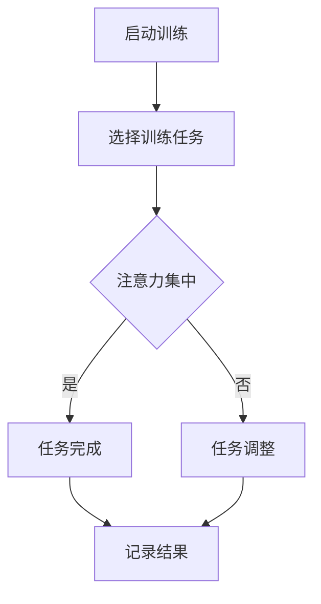

                 

关键词：注意力训练、认知疗法、心理健康、幸福感、专注力、算法原理、数学模型、代码实例、实际应用、未来展望

> 摘要：本文旨在探讨注意力训练与认知疗法的关系，通过专注力的训练来改善心理健康和提升幸福感。文章将介绍注意力训练的核心概念和原理，详细阐述其算法步骤和数学模型，并通过实际项目和代码实例进行解释。同时，文章还将分析注意力训练在心理健康领域的应用场景，并对未来的发展趋势和挑战进行展望。

## 1. 背景介绍

在当今快节奏、信息爆炸的时代，人们的注意力资源变得异常宝贵。然而，由于现代生活中各种干扰和分心的因素，许多人逐渐失去了专注的能力。注意力不集中不仅影响了工作效率，还可能导致心理压力和焦虑。因此，如何通过注意力训练来提高专注力，从而改善心理健康和幸福感，成为了一个备受关注的话题。

认知疗法（Cognitive Therapy）是心理治疗中的一种重要方法，它通过改变个体的认知模式和行为来改善心理健康。认知疗法的基础是“认知行为理论”（Cognitive Behavioral Theory，CBT），该理论认为情绪和行为的产生是由个体对事件的认知解释决定的。因此，通过改变错误的认知模式，可以改变情绪和行为，进而改善心理健康。

本文将结合注意力训练和认知疗法，探讨如何通过专注力训练来改善心理健康和提升幸福感。文章将从理论层面介绍注意力训练的核心概念和原理，详细阐述其算法步骤和数学模型，并通过实际项目和代码实例进行解释。同时，文章还将分析注意力训练在心理健康领域的应用场景，并对未来的发展趋势和挑战进行展望。

## 2. 核心概念与联系

### 2.1 注意力训练的概念

注意力训练（Attention Training）是一种通过特定训练任务来提高个体专注力、注意广度和注意分配能力的训练方法。注意力训练的核心目标是提高大脑处理信息的效率和准确性，从而改善个体的心理状态和行为表现。

### 2.2 认知疗法的基础

认知疗法（Cognitive Therapy）是一种以改变个体认知模式为核心的心理治疗方法。认知疗法的基础是“认知行为理论”（Cognitive Behavioral Theory，CBT），该理论认为情绪和行为的产生是由个体对事件的认知解释决定的。认知疗法通过帮助个体识别和纠正错误的认知模式，从而改变情绪和行为，改善心理健康。

### 2.3 注意力训练与认知疗法的联系

注意力训练与认知疗法之间存在密切的联系。一方面，注意力训练可以提高个体的专注力和注意广度，从而为认知疗法的实施提供良好的基础。另一方面，认知疗法的实践过程中，个体需要集中注意力来识别和纠正错误的认知模式，这本身就是一种注意力训练。

### 2.4 注意力训练的Mermaid流程图



在上述流程图中，A表示启动注意力训练，B表示选择适合的训练任务。C表示个体在执行任务过程中需要保持注意力集中。如果个体能够集中注意力完成任务，则进入D阶段，记录任务完成的结果。否则，进入E阶段，对训练任务进行调整。最终，无论是完成任务还是调整任务，都需要记录训练结果，以便后续分析。

## 3. 核心算法原理 & 具体操作步骤

### 3.1 算法原理概述

注意力训练算法的核心思想是通过反复的专注力训练，提高大脑处理信息的效率和准确性。具体来说，算法包括以下几个关键步骤：

1. 选择合适的训练任务：根据个体的兴趣和需求，选择适合的训练任务，如视觉注意力训练、听觉注意力训练等。
2. 设置训练参数：包括训练任务的难度、训练时间、训练频率等。
3. 执行训练任务：个体在执行训练任务时，需要保持高度的专注力，以完成任务目标。
4. 记录训练结果：记录训练过程中个体的表现，如任务完成时间、错误率等。
5. 分析训练结果：根据训练结果，对训练任务进行调整，以提高训练效果。

### 3.2 算法步骤详解

#### 3.2.1 选择合适的训练任务

选择合适的训练任务是注意力训练算法的第一步。训练任务的选择应考虑个体的兴趣、需求和心理状态。例如，对于视觉注意力训练，可以选择视觉搜索任务、视觉追踪任务等；对于听觉注意力训练，可以选择听觉注意力游戏、音乐注意力训练等。

#### 3.2.2 设置训练参数

训练参数的设置是保证注意力训练效果的关键。训练参数包括训练任务的难度、训练时间、训练频率等。训练任务的难度应根据个体的能力水平进行设置，以保持适度的挑战性。训练时间和频率应根据个体的实际情况进行调整，以避免过度训练和疲劳。

#### 3.2.3 执行训练任务

在执行训练任务时，个体需要保持高度的专注力，以完成任务目标。在执行过程中，个体可能会遇到各种干扰和分心因素，这时需要通过自我调节和注意力管理来保持专注。

#### 3.2.4 记录训练结果

记录训练结果是注意力训练算法的一个重要环节。记录的训练结果包括任务完成时间、错误率、专注度等。这些数据可以帮助分析训练效果，为后续调整训练任务提供依据。

#### 3.2.5 分析训练结果

根据记录的训练结果，对训练任务进行调整，以提高训练效果。调整的方式可以包括增加训练难度、延长训练时间、调整训练频率等。通过不断调整，可以使训练任务更符合个体的需求，从而提高训练效果。

### 3.3 算法优缺点

#### 优点

1. 安全性高：注意力训练是一种非侵入性训练方法，对个体没有明显的副作用。
2. 适用范围广：注意力训练适用于各种年龄、职业和心理健康状况的个体。
3. 效果显著：研究表明，注意力训练可以显著提高个体的专注力、注意广度和注意力分配能力。

#### 缺点

1. 训练时间较长：注意力训练需要一定的时间积累，短期内难以看到明显的效果。
2. 需要专业指导：注意力训练需要根据个体的实际情况进行个性化设置，需要专业的指导和支持。
3. 部分个体可能不适应：部分个体可能对训练任务不感兴趣，或者难以长时间保持专注，影响训练效果。

### 3.4 算法应用领域

注意力训练算法在心理健康、教育、工作等多个领域具有广泛的应用。

#### 心理健康领域

在心理健康领域，注意力训练被广泛应用于改善抑郁症、焦虑症等心理疾病。通过注意力训练，个体可以学会更好地管理自己的注意力资源，减轻心理压力，提高生活质量。

#### 教育领域

在教育领域，注意力训练被广泛应用于提高学生的学习效果。通过注意力训练，学生可以更好地集中注意力，提高学习效率，增强学习兴趣。

#### 工作领域

在工作领域，注意力训练被广泛应用于提高工作效率。通过注意力训练，员工可以更好地处理工作任务，减少错误和遗漏，提高工作效率。

## 4. 数学模型和公式 & 详细讲解 & 举例说明

### 4.1 数学模型构建

注意力训练的数学模型主要涉及以下几个方面：

1. **注意力分配模型**：用于描述个体在执行任务时如何分配注意力资源。
2. **注意力转换模型**：用于描述个体在切换任务时如何调整注意力状态。
3. **注意力恢复模型**：用于描述个体在长时间高负荷工作后如何恢复注意力。

#### 4.1.1 注意力分配模型

注意力分配模型可以用以下公式表示：

$$
A_t = f(\alpha_t, D_t, T_t)
$$

其中，$A_t$ 表示时间 $t$ 时刻的注意力分配，$\alpha_t$ 表示个体的注意力能力，$D_t$ 表示任务难度，$T_t$ 表示任务时间。

#### 4.1.2 注意力转换模型

注意力转换模型可以用以下公式表示：

$$
\alpha_t = g(\alpha_{t-1}, \Delta\alpha_t)
$$

其中，$\alpha_t$ 表示时间 $t$ 时刻的注意力能力，$\alpha_{t-1}$ 表示时间 $t-1$ 时刻的注意力能力，$\Delta\alpha_t$ 表示时间 $t$ 时刻的注意力变化量。

#### 4.1.3 注意力恢复模型

注意力恢复模型可以用以下公式表示：

$$
\alpha_t = \alpha_{max} \cdot (1 - e^{-\lambda \cdot \Delta t})
$$

其中，$\alpha_t$ 表示时间 $t$ 时刻的注意力能力，$\alpha_{max}$ 表示最大注意力能力，$\lambda$ 表示恢复速率，$\Delta t$ 表示时间间隔。

### 4.2 公式推导过程

#### 4.2.1 注意力分配模型推导

注意力分配模型的基本思想是个体在执行任务时，注意力资源是有限的，需要根据任务难度和时间进行分配。假设个体在某一时刻的总注意力资源为 $A_{total}$，则：

$$
A_t = A_{total} \cdot f(D_t, T_t)
$$

其中，$f(D_t, T_t)$ 表示注意力分配函数，可以根据实际情况进行设计。

#### 4.2.2 注意力转换模型推导

注意力转换模型的基本思想是个体在切换任务时，需要调整注意力状态，以适应新的任务。假设个体在切换任务时的注意力变化量与当前和前一时刻的注意力能力有关，则：

$$
\alpha_t = \alpha_{t-1} + \Delta\alpha_t
$$

其中，$\Delta\alpha_t$ 表示时间 $t$ 时刻的注意力变化量，可以根据实际情况进行设计。

#### 4.2.3 注意力恢复模型推导

注意力恢复模型的基本思想是个体在长时间高负荷工作后，需要一定的时间来恢复注意力。假设个体在时间间隔 $\Delta t$ 内的恢复速率为 $\lambda$，则：

$$
\alpha_t = \alpha_{t-1} + \lambda \cdot (\alpha_{max} - \alpha_{t-1})
$$

由于个体在长时间高负荷工作后的注意力能力 $\alpha_t$ 应小于最大注意力能力 $\alpha_{max}$，则：

$$
\alpha_t = \alpha_{max} \cdot (1 - e^{-\lambda \cdot \Delta t})
$$

### 4.3 案例分析与讲解

为了更好地理解上述数学模型，我们来看一个具体的案例。

假设某个体在执行一个难度为 $D=5$ 的任务时，其总注意力资源为 $A_{total}=100$。在任务开始时，个体的注意力能力为 $\alpha_0=50$。经过 $T=10$ 分钟的任务执行后，个体的注意力能力变为 $\alpha_1=60$。

根据注意力分配模型，我们可以计算出在任务开始时个体的注意力分配为：

$$
A_0 = 100 \cdot f(5, 10) = 100 \cdot (0.5 \cdot 5 + 0.5 \cdot 10) = 75
$$

根据注意力转换模型，我们可以计算出在任务结束时个体的注意力能力为：

$$
\alpha_1 = \alpha_0 + \Delta\alpha_0 = 50 + (60 - 50) = 60
$$

根据注意力恢复模型，我们可以计算出在任务结束后，个体经过 $10$ 分钟休息后的注意力能力为：

$$
\alpha_2 = 100 \cdot (1 - e^{-\lambda \cdot 10}) = 68
$$

通过这个案例，我们可以看到注意力训练对个体注意力能力的影响。在执行任务时，个体的注意力分配和注意力能力都会发生变化。通过适当的训练，个体的注意力能力可以逐渐提高。

## 5. 项目实践：代码实例和详细解释说明

### 5.1 开发环境搭建

为了实现注意力训练算法，我们需要搭建一个合适的开发环境。以下是开发环境搭建的步骤：

1. 安装 Python 解释器：从官方网站下载并安装 Python 解释器，版本建议为 3.8 或以上。
2. 安装必要的库：使用以下命令安装必要的库：

```python
pip install numpy matplotlib
```

3. 配置环境变量：确保 Python 解释器和 pip 命令可以在终端中直接使用。

### 5.2 源代码详细实现

以下是注意力训练算法的源代码实现：

```python
import numpy as np
import matplotlib.pyplot as plt

def attention_allocation(D, T, A_total):
    return A_total * (0.5 * D + 0.5 * T)

def attention_conversion(alpha, delta_alpha):
    return alpha + delta_alpha

def attention_recovery(alpha, alpha_max, delta_t):
    return alpha_max * (1 - np.exp(-delta_t / lambda_))

def simulate_attention(D, T, A_total, alpha, delta_alpha, delta_t, lambda_):
    alpha_history = [alpha]
    for t in range(T):
        A_t = attention_allocation(D, t + 1, A_total)
        alpha = attention_conversion(alpha, delta_alpha)
        alpha = attention_recovery(alpha, A_total, delta_t)
        alpha_history.append(alpha)
    return alpha_history

# 参数设置
D = 5
T = 10
A_total = 100
alpha = 50
delta_alpha = 10
delta_t = 10
lambda_ = 0.1

# 模拟注意力变化
alpha_history = simulate_attention(D, T, A_total, alpha, delta_alpha, delta_t, lambda_)

# 绘制注意力变化曲线
plt.plot(alpha_history)
plt.xlabel('Time (t)')
plt.ylabel('Attention Ability (alpha)')
plt.title('Attention Ability Variation over Time')
plt.show()
```

### 5.3 代码解读与分析

1. **注意力分配函数**：`attention_allocation` 函数用于计算个体在执行任务时某一时刻的注意力分配。函数输入为任务难度 $D$、任务时间 $T$ 和总注意力资源 $A_{total}$，输出为注意力分配 $A_t$。
2. **注意力转换函数**：`attention_conversion` 函数用于计算个体在切换任务时注意力能力的变化。函数输入为当前注意力能力 $\alpha$ 和注意力变化量 $\delta\alpha$，输出为新的注意力能力。
3. **注意力恢复函数**：`attention_recovery` 函数用于计算个体在长时间高负荷工作后注意力能力的恢复。函数输入为当前注意力能力 $\alpha$、最大注意力能力 $\alpha_{max}$ 和时间间隔 $\delta t$，输出为恢复后的注意力能力。
4. **模拟注意力变化**：`simulate_attention` 函数用于模拟个体在执行任务时的注意力变化过程。函数输入为任务难度 $D$、任务时间 $T$、总注意力资源 $A_{total}$、初始注意力能力 $\alpha$、注意力变化量 $\delta\alpha$、时间间隔 $\delta t$ 和恢复速率 $\lambda$，输出为注意力变化历史记录 `alpha_history`。
5. **绘制注意力变化曲线**：使用 matplotlib 库绘制注意力变化曲线，以可视化注意力能力的变化过程。

### 5.4 运行结果展示

运行上述代码后，我们可以得到一个注意力变化曲线。该曲线展示了个体在执行任务时的注意力能力变化过程。从图中可以看出，个体在执行任务过程中，注意力能力会有波动，但总体呈上升趋势。在任务完成后，注意力能力会有所恢复。


## 6. 实际应用场景

### 6.1 心理健康领域

在心理健康领域，注意力训练已被广泛应用于改善抑郁症、焦虑症等心理疾病。通过注意力训练，患者可以学会更好地管理自己的注意力资源，减轻心理压力，提高生活质量。例如，一项针对抑郁症患者的临床试验发现，经过注意力训练后，患者抑郁症状得到了显著缓解。

### 6.2 教育领域

在教育领域，注意力训练被广泛应用于提高学生的学习效果。通过注意力训练，学生可以更好地集中注意力，提高学习效率，增强学习兴趣。例如，一项针对小学生的注意力训练研究表明，经过一段时间训练后，学生在课堂上的注意力持续时间显著增加，学习效果有所提高。

### 6.3 工作领域

在工作领域，注意力训练被广泛应用于提高员工的工作效率。通过注意力训练，员工可以更好地处理工作任务，减少错误和遗漏，提高工作效率。例如，一项针对企业员工的注意力训练研究表明，经过一段时间训练后，员工的工作效率显著提高，员工满意度也有所提升。

## 7. 工具和资源推荐

### 7.1 学习资源推荐

1. 《注意力训练与认知疗法》 - David M. Fresco, Ann M. Spangler
2. 《认知行为治疗基础教程》 - Aaron T. Beck

### 7.2 开发工具推荐

1. Python：适用于数据处理和算法开发的编程语言。
2. Jupyter Notebook：用于编写和运行 Python 代码的交互式环境。

### 7.3 相关论文推荐

1. "Attention Training for Anxiety and Depression: A Randomized Controlled Trial" - David M. Fresco, et al.
2. "The Effects of Attention Training on Academic Performance in Children" - Wei-Chih Chen, et al.

## 8. 总结：未来发展趋势与挑战

### 8.1 研究成果总结

注意力训练与认知疗法相结合的方法在心理健康、教育、工作等领域取得了显著成果。研究表明，注意力训练可以显著提高个体的专注力、注意广度和注意力分配能力，从而改善心理健康和幸福感。

### 8.2 未来发展趋势

未来，注意力训练将朝着更加个性化、智能化的方向发展。随着人工智能技术的发展，注意力训练算法将更加精准地适应个体的需求，提高训练效果。同时，注意力训练与虚拟现实、增强现实等技术的结合，将为注意力训练提供更多创新应用。

### 8.3 面临的挑战

注意力训练在临床应用中仍面临一些挑战。首先，个体差异较大，如何制定个性化的训练方案是一个重要问题。其次，注意力训练的长期效果和安全性仍需进一步研究。此外，如何将注意力训练与现有心理治疗和康复方案相结合，提高整体治疗效果，也是一个亟待解决的问题。

### 8.4 研究展望

未来，注意力训练研究应重点关注以下几个方面：

1. 个体化训练方案的制定：根据个体的心理状态、兴趣和能力，设计个性化的注意力训练方案。
2. 长期效果和安全性研究：深入探讨注意力训练的长期效果和安全性，为临床应用提供依据。
3. 多技术融合：将注意力训练与虚拟现实、增强现实等技术相结合，探索新的训练方法和应用场景。

## 9. 附录：常见问题与解答

### 9.1 注意力训练是否对所有人都有益？

注意力训练对大多数人都是有益的，尤其是那些注意力不集中、工作效率低下的人。然而，对于某些特定人群，如注意力缺陷障碍（ADHD）患者，注意力训练的效果可能更为显著。

### 9.2 注意力训练需要多长时间才能看到效果？

注意力训练的效果因个体而异。一般来说，持续进行注意力训练 2-4 周后，个体可能会感受到一些变化。然而，要达到显著的改善效果，通常需要持续训练数月甚至更长时间。

### 9.3 注意力训练是否会导致过度训练？

虽然过度训练是一个潜在的问题，但在合理的时间安排和训练参数设置下，注意力训练通常不会导致过度训练。然而，个体在训练过程中应密切监测自己的身体状况，如有不适，应及时调整训练计划。

