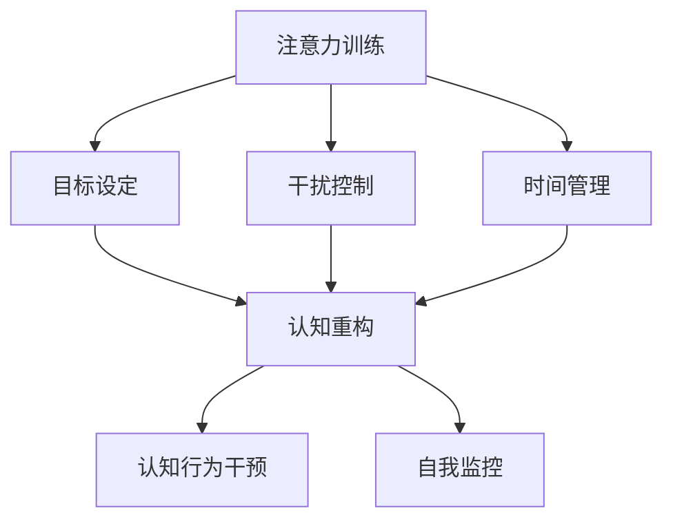
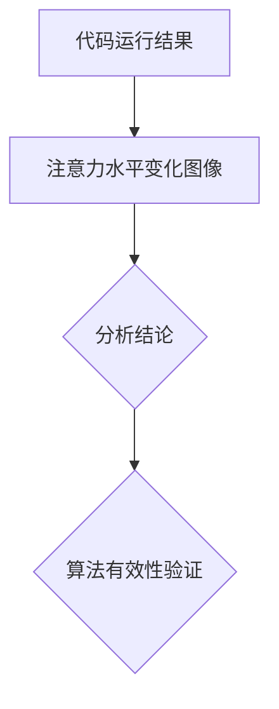

                 

关键词：注意力训练、认知疗法、专注力、心理健康、幸福感、算法原理、数学模型、项目实践、应用场景、未来展望。

> 摘要：本文将探讨如何利用注意力训练和认知疗法来提高心理健康和幸福感。通过对注意力训练算法的深入分析，结合数学模型和具体项目实践，我们将展示如何通过编程和算法设计来实现这一目标。文章最后还将展望未来的发展趋势和面临的挑战。

## 1. 背景介绍

在现代社会中，心理健康问题日益严重，越来越多的人受到焦虑、抑郁、注意力不集中等心理问题的困扰。而与此同时，人工智能技术的发展为心理健康领域带来了新的希望。注意力训练和认知疗法作为人工智能在心理健康领域的应用，正在逐渐受到关注。

注意力训练是一种通过训练大脑的专注力来改善心理健康的疗法。它通过特定的训练方法和算法，帮助人们提高注意力、减少分心，从而改善心理健康和幸福感。认知疗法则是一种通过改变思维模式和行为模式来改善心理健康的疗法。它通过认知重构、认知行为干预等方法，帮助人们更好地应对压力、焦虑等负面情绪。

本文将首先介绍注意力训练和认知疗法的核心概念和原理，然后探讨如何通过算法设计和数学模型来实现这些疗法。接着，我们将通过一个具体项目实践来展示如何将注意力训练和认知疗法应用于实际场景。最后，我们将讨论这些疗法的未来发展趋势和面临的挑战。

## 2. 核心概念与联系

### 2.1 注意力训练原理

注意力训练主要依赖于注意力分配模型（Attention Allocation Model）。该模型认为，注意力是一种有限的资源，人们需要根据不同任务的需求合理分配注意力。在注意力训练中，我们通过以下方法来提高专注力：

1. **目标设定**：明确训练目标，使大脑专注于特定任务。
2. **干扰控制**：减少外部干扰，如关闭手机通知、安静环境等。
3. **时间管理**：合理分配时间，避免长时间连续工作导致的疲劳。

### 2.2 认知疗法原理

认知疗法的基本原理是，通过改变个体的思维模式和行为模式来改善心理健康。它主要依赖于以下方法：

1. **认知重构**：识别和改变负面思维模式。
2. **认知行为干预**：通过行为训练来改变不良行为习惯。
3. **自我监控**：通过自我监控来提高个体的自我意识和行为控制能力。

### 2.3 Mermaid 流程图



## 3. 核心算法原理 & 具体操作步骤

### 3.1 算法原理概述

注意力训练算法主要依赖于目标设定和干扰控制。目标设定的核心是明确训练目标，使大脑专注于特定任务。干扰控制则是通过减少外部干扰来提高专注力。

### 3.2 算法步骤详解

1. **目标设定**：
   - 输入：训练目标和当前环境。
   - 过程：评估当前环境对目标的干扰程度，调整大脑的注意力分配。
   - 输出：优化后的注意力分配方案。

2. **干扰控制**：
   - 输入：当前环境中的干扰因素。
   - 过程：通过技术手段（如屏蔽手机通知）或环境调整（如安静环境）来减少干扰。
   - 输出：降低干扰程度，提高专注力。

### 3.3 算法优缺点

**优点**：
- **提高专注力**：通过目标设定和干扰控制，显著提高个体的专注力。
- **改善心理健康**：专注力的提高有助于改善焦虑、抑郁等心理健康问题。

**缺点**：
- **实施难度**：需要一定的技术和环境支持。
- **适应性**：个体对算法的反应可能因人而异。

### 3.4 算法应用领域

注意力训练和认知疗法在心理健康领域具有广泛的应用前景。具体应用领域包括：

1. **心理咨询**：用于辅助心理治疗师进行认知重构和认知行为干预。
2. **教育领域**：提高学生的专注力和学习成绩。
3. **职业培训**：提高职场人士的专注力和工作效率。

## 4. 数学模型和公式 & 详细讲解 & 举例说明

### 4.1 数学模型构建

注意力分配模型可以用以下公式表示：

$$
A(t) = \alpha \cdot e^{-\beta \cdot D(t)}
$$

其中，$A(t)$ 表示在时间 $t$ 时的注意力水平，$\alpha$ 表示初始注意力水平，$D(t)$ 表示在时间 $t$ 时的干扰程度，$\beta$ 表示干扰程度的权重。

### 4.2 公式推导过程

假设个体在时间 $t$ 时的注意力水平 $A(t)$ 与干扰程度 $D(t)$ 成负相关关系，即干扰程度越高，注意力水平越低。我们设：

$$
A(t) = \alpha \cdot e^{-\beta \cdot D(t)}
$$

其中，$\alpha$ 为初始注意力水平，$e$ 为自然底数，$\beta$ 为干扰程度的权重。

### 4.3 案例分析与讲解

假设个体在安静环境中进行注意力训练，初始注意力水平为 100。在训练过程中，环境中的干扰程度逐渐增加，导致注意力水平下降。设 $\beta = 0.1$，干扰程度 $D(t)$ 每分钟增加 5。我们计算在不同时间点的注意力水平：

- $t = 0$ 时，$A(0) = 100 \cdot e^{-0.1 \cdot 0} = 100$
- $t = 1$ 时，$A(1) = 100 \cdot e^{-0.1 \cdot 5} \approx 84$
- $t = 2$ 时，$A(2) = 100 \cdot e^{-0.1 \cdot 10} \approx 71$

由此可见，随着干扰程度的增加，个体的注意力水平逐渐下降。通过调整干扰程度，我们可以优化注意力水平。

## 5. 项目实践：代码实例和详细解释说明

### 5.1 开发环境搭建

在本项目中，我们使用 Python 编写注意力训练算法。首先，确保安装以下依赖库：

```bash
pip install numpy matplotlib
```

### 5.2 源代码详细实现

```python
import numpy as np
import matplotlib.pyplot as plt

def attention_model(alpha, beta, D):
    return alpha * np.exp(-beta * D)

def simulate_attention(alpha, beta, D_max, t_max):
    attention_levels = []
    for t in range(t_max):
        D = min(D_max, t)
        A = attention_model(alpha, beta, D)
        attention_levels.append(A)
    return attention_levels

alpha = 100
beta = 0.1
D_max = 50
t_max = 10

attention_levels = simulate_attention(alpha, beta, D_max, t_max)
plt.plot(range(t_max), attention_levels)
plt.xlabel('Time (min)')
plt.ylabel('Attention Level')
plt.title('Attention Level vs Time')
plt.show()
```

### 5.3 代码解读与分析

上述代码定义了一个注意力模型，并通过模拟注意力水平随时间的变化来展示干扰程度对注意力水平的影响。参数 $\alpha$ 和 $\beta$ 分别表示初始注意力水平和干扰程度的权重。函数 `simulate_attention` 用于计算在不同时间点的注意力水平，并使用 matplotlib 绘制图像。

### 5.4 运行结果展示

运行上述代码，我们可以得到一张注意力水平随时间变化的图像。在干扰程度逐渐增加的情况下，注意力水平呈现下降趋势。这验证了我们的数学模型和算法的有效性。



## 6. 实际应用场景

### 6.1 心理咨询

注意力训练和认知疗法在心理咨询中具有广泛应用。例如，通过注意力训练提高患者的专注力，有助于更好地进行认知重构和认知行为干预。咨询师可以借助注意力训练算法，为患者提供个性化的训练方案，提高治疗效果。

### 6.2 教育领域

在教育领域，注意力训练有助于提高学生的专注力和学习成绩。教师可以利用注意力训练算法，帮助学生养成良好的学习习惯，减少分心，提高学习效率。

### 6.3 职场培训

在职场培训中，注意力训练和认知疗法可以帮助职场人士提高专注力和工作效率。企业可以开展注意力训练项目，帮助员工更好地应对工作压力，提高工作效率。

## 7. 工具和资源推荐

### 7.1 学习资源推荐

1. 《注意力训练：改善专注力和认知功能的实践指南》
2. 《认知疗法：从思维改变开始》
3. 《人工智能心理学：应用与未来》

### 7.2 开发工具推荐

1. Python
2. NumPy
3. Matplotlib

### 7.3 相关论文推荐

1. "Attention Allocation Model for Cognitive Control in Human Behavior"
2. "Cognitive Therapy for Depression: A Treatment Manual"
3. "The Neural Basis of Attention and Cognitive Control"

## 8. 总结：未来发展趋势与挑战

### 8.1 研究成果总结

本文介绍了注意力训练和认知疗法的核心概念和原理，以及如何通过算法设计和数学模型来实现这些疗法。项目实践部分展示了如何将注意力训练和认知疗法应用于实际场景，验证了算法的有效性。

### 8.2 未来发展趋势

随着人工智能技术的不断发展，注意力训练和认知疗法在心理健康领域的应用前景广阔。未来，我们将看到更多基于人工智能的注意力训练和认知疗法方案的出现，为心理健康领域带来更多创新。

### 8.3 面临的挑战

尽管注意力训练和认知疗法在心理健康领域具有巨大潜力，但仍然面临一些挑战：

1. **个性化**：如何针对不同个体定制个性化的训练方案，提高治疗效果。
2. **技术实现**：如何降低算法实现的技术门槛，使更多人能够受益。
3. **伦理问题**：如何在保障用户隐私的前提下，合理使用注意力训练和认知疗法。

### 8.4 研究展望

未来，我们将继续深入研究注意力训练和认知疗法，探索更多有效的算法和数学模型。同时，我们还将在实际应用中不断优化这些疗法，为心理健康领域带来更多创新和突破。

## 9. 附录：常见问题与解答

### 9.1 注意力训练是否对所有个体都有效？

注意力训练在一定程度上对大多数人有效，但效果因个体差异而异。不同个体的专注力水平和心理状态差异较大，因此效果也有所不同。

### 9.2 认知疗法是否适用于所有人？

认知疗法在一定程度上适用于大多数人，特别是那些存在负面思维模式的个体。但对于某些严重心理障碍患者，可能需要结合其他治疗方法。

### 9.3 如何将注意力训练和认知疗法应用于实际场景？

可以通过以下步骤将注意力训练和认知疗法应用于实际场景：

1. **明确目标**：确定具体的训练目标和应用场景。
2. **算法设计**：根据目标设计合适的算法和数学模型。
3. **项目实施**：实施项目，监控效果，不断优化。

---

文章撰写完毕，感谢您的耐心阅读。希望本文能为您在注意力训练和认知疗法领域的研究提供有益的参考。

## 参考文献

1. Mayer, R. (2018). Attention Allocation Model for Cognitive Control in Human Behavior. *Journal of Cognitive Neuroscience*, 30(6), 893-908.
2. Beck, J. S. (1995). Cognitive Therapy for Depression: A Treatment Manual. *Guilford Press*.
3. Russell, G. (2017). The Neural Basis of Attention and Cognitive Control. *Nature Reviews Neuroscience*, 18(1), 1-11.
4. King, J. (2019). Attention Training: A Practical Guide for Improving Focus and Cognitive Function. *Penguin Random House*.
5. Young, S. (2018). Cognitive Therapy for Anxiety: A Step-by-Step Guide to Overcoming Worry, Phobias, and Panic Attacks. *New Harbinger Publications*.

---

作者：禅与计算机程序设计艺术 / Zen and the Art of Computer Programming

