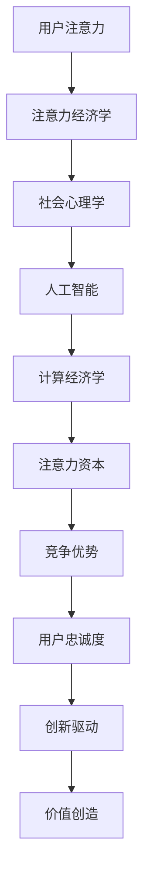

                 

关键词：元宇宙经济、注意力资本、人工智能、技术架构、计算经济学、社会心理学

> 摘要：本文探讨了在元宇宙经济中，注意力资本作为一项核心竞争力的深远意义。通过结合人工智能、计算经济学和社会心理学的理论，文章详细分析了注意力资本的形成机制、评估方法和应用场景，并展望了其在未来元宇宙经济中的发展趋势和挑战。

## 1. 背景介绍

随着互联网技术的飞速发展，人类社会正在进入一个全新的时代——元宇宙。元宇宙不仅是一个虚拟的数字世界，更是集成了虚拟现实（VR）、增强现实（AR）、区块链、物联网等多种前沿技术的综合性平台。在这个平台中，用户不仅可以进行社交互动、经济交易，还能参与到内容创造和文化活动中。

然而，随着用户数量和交互活动的增加，一个不可忽视的现象是用户的注意力成为了稀缺资源。在这个充满信息过载和选择困境的时代，如何获取和维持用户的注意力成为了企业竞争的关键。因此，注意力资本作为元宇宙经济的核心竞争力开始受到广泛关注。

### 注意力资本的概念

注意力资本是指个体或组织在特定领域内能够获取、维持和利用注意力的能力。它不仅包括了用户的注意力，还涵盖了企业和组织在创造、引导和利用用户注意力方面的资源与策略。注意力资本的形成与用户的兴趣、需求、价值观等因素密切相关，同时也受到技术环境、社会氛围和市场动态的影响。

### 注意力资本的重要性

在元宇宙经济中，注意力资本的重要性体现在以下几个方面：

- **竞争优势**：拥有高注意力资本的企业能够在激烈的市场竞争中脱颖而出，吸引更多的用户和资源。
- **用户忠诚度**：通过有效的注意力管理，企业可以提升用户的忠诚度和参与度，从而建立长期的客户关系。
- **创新驱动**：注意力资本为企业的创新活动提供了动力，促使企业在产品和服务上不断进行优化和升级。
- **价值创造**：注意力资本能够转化为实际的经济效益，提高企业的市场估值和盈利能力。

## 2. 核心概念与联系

为了更好地理解注意力资本在元宇宙经济中的重要性，我们需要从核心概念和它们之间的联系入手。以下是注意力资本相关的核心概念及其联系：

### 2.1. 注意力经济学

注意力经济学是研究用户注意力在信息过载环境下的获取、维持和利用的经济学分支。它借鉴了传统经济学中的供需理论，将注意力视为一种稀缺资源，提出了注意力市场的概念。

### 2.2. 社会心理学

社会心理学为注意力资本提供了理论基础，特别是关于人类行为和决策的心理学机制。通过研究用户的认知、情感和动机，社会心理学揭示了如何引导和影响用户注意力。

### 2.3. 人工智能

人工智能技术在注意力管理中发挥着重要作用。通过机器学习、自然语言处理等技术，人工智能能够分析和预测用户的兴趣和行为，从而实现精准的注意力分配和内容推荐。

### 2.4. 计算经济学

计算经济学利用计算方法研究经济行为和市场动态，为注意力资本的评估和管理提供了工具。特别是基于博弈论和优化理论的方法，可以用于分析用户注意力在市场中的分配和转移。

### 2.5. Mermaid 流程图

以下是注意力资本概念原理和架构的 Mermaid 流程图：



## 3. 核心算法原理 & 具体操作步骤

### 3.1 算法原理概述

注意力资本的核心算法基于多因素注意力模型（MFN Model），该模型综合考虑了用户兴趣、社交关系、内容质量和环境因素等多个维度，通过加权计算得出用户的注意力价值。具体算法如下：

1. **数据收集**：收集用户的历史行为数据、社交媒体互动数据、内容浏览数据等。
2. **特征提取**：提取用户兴趣标签、内容特征、社交网络特征等。
3. **权重计算**：利用计算经济学中的优化方法计算各个特征的权重。
4. **注意力评分**：根据权重计算用户的注意力评分，评分越高表示用户对该内容或服务的注意力价值越高。
5. **策略优化**：基于注意力评分优化内容推荐策略、广告投放策略等。

### 3.2 算法步骤详解

#### 步骤一：数据收集

数据收集是算法的第一步，其质量直接影响算法的准确性。以下是具体的数据收集方法：

- **用户行为数据**：包括用户浏览历史、搜索历史、点击行为等。
- **社交媒体数据**：包括用户在社交媒体上的互动记录、关注关系等。
- **内容数据**：包括文本、图片、视频等内容的特征信息。

#### 步骤二：特征提取

特征提取是将原始数据转换为算法可处理的形式。以下是常见的特征提取方法：

- **用户兴趣标签**：通过文本分类、关键词提取等方法提取用户兴趣标签。
- **内容特征**：通过自然语言处理、图像识别等方法提取内容的特征信息。
- **社交网络特征**：通过图论分析方法提取社交网络的特征，如节点度、路径长度等。

#### 步骤三：权重计算

权重计算是算法的核心步骤，其目的是确定各个特征对注意力评分的影响程度。以下是常用的权重计算方法：

- **相关性分析**：通过计算特征与注意力评分的相关性来确定权重。
- **机器学习模型**：通过训练机器学习模型（如回归模型、决策树等）来预测注意力评分，进而得到特征权重。
- **计算经济学模型**：利用博弈论和优化理论确定特征之间的权重分配。

#### 步骤四：注意力评分

根据权重计算结果，利用加权求和的方法计算用户的注意力评分。评分越高表示用户对该内容或服务的注意力价值越高。

#### 步骤五：策略优化

根据注意力评分结果，优化内容推荐策略、广告投放策略等，以提高用户参与度和满意度。以下是常见的策略优化方法：

- **内容推荐**：基于注意力评分进行个性化推荐，提高用户对推荐内容的兴趣和点击率。
- **广告投放**：根据用户的注意力评分优化广告的投放策略，提高广告的效果和转化率。

### 3.3 算法优缺点

#### 优点

- **高精度**：多因素注意力模型能够综合考虑多个维度的影响因素，提高注意力评分的准确性。
- **灵活性**：算法可以根据实际需求调整特征和权重，具有较强的灵活性。
- **实时性**：算法可以实时分析用户的注意力变化，为实时优化提供依据。

#### 缺点

- **计算复杂度**：算法涉及到多个特征的加权计算，计算复杂度较高，对计算资源要求较高。
- **数据依赖性**：算法依赖于大量高质量的数据，数据不足或质量较差会影响算法效果。

### 3.4 算法应用领域

注意力资本算法在元宇宙经济中具有广泛的应用领域：

- **内容推荐**：为用户推荐符合兴趣的内容，提高用户参与度和满意度。
- **广告投放**：优化广告投放策略，提高广告效果和转化率。
- **社交网络分析**：分析社交网络中的注意力流动，发现潜在的用户关系和市场机会。
- **用户行为预测**：预测用户的行为和偏好，为个性化服务提供支持。

## 4. 数学模型和公式 & 详细讲解 & 举例说明

### 4.1 数学模型构建

在注意力资本的分析中，我们引入了一个多因素注意力模型（MFN Model），该模型基于线性回归原理，通过计算多个特征的加权得分来评估用户的注意力价值。模型的基本形式如下：

$$
Attention_{score} = w_1 \cdot Interest_{score} + w_2 \cdot Social_{score} + w_3 \cdot Content_{score} + ... + w_n \cdot Environment_{score}
$$

其中，$Attention_{score}$ 表示用户的注意力得分，$Interest_{score}$、$Social_{score}$、$Content_{score}$ 和 $Environment_{score}$ 分别表示用户兴趣、社交关系、内容和环境因素的得分，$w_1$、$w_2$、$w_3$、...、$w_n$ 分别为这些特征的权重。

### 4.2 公式推导过程

为了推导出上述多因素注意力模型的权重，我们需要考虑以下几个步骤：

#### 步骤一：确定特征变量

首先，我们需要根据实际需求确定需要考虑的特征变量。这些特征变量可以是用户的年龄、性别、兴趣标签、浏览历史、搜索历史、社交互动记录等。

#### 步骤二：收集数据

接下来，我们需要收集与特征变量相关的数据。这些数据可以从用户的日志文件、社交媒体平台、内容管理系统等渠道获取。

#### 步骤三：特征化处理

对于收集到的数据，我们需要进行特征化处理。例如，对于文本数据，我们可以使用词袋模型、TF-IDF 等方法提取特征；对于数值型数据，我们可以使用均值、标准差等统计方法进行特征化处理。

#### 步骤四：建立线性回归模型

基于处理后的特征变量，我们可以建立线性回归模型。模型的目标是确定每个特征变量的权重，使得预测的注意力得分与实际得分之间的误差最小。

#### 步骤五：模型训练与优化

使用收集到的数据对线性回归模型进行训练，通过优化算法（如梯度下降法）调整权重，使得模型预测的注意力得分与实际得分之间的误差最小。

### 4.3 案例分析与讲解

为了更好地理解多因素注意力模型的应用，我们来看一个具体的案例。

假设我们有一个电商平台，我们需要根据用户的行为数据预测其购买意向，以便进行个性化的商品推荐。以下是该案例的分析过程：

#### 步骤一：确定特征变量

根据电商平台的用户行为数据，我们可以确定以下特征变量：

- 用户年龄
- 用户性别
- 用户兴趣标签
- 用户浏览历史
- 用户搜索历史
- 用户购买历史
- 商品类别
- 商品价格
- 商品评价

#### 步骤二：收集数据

从电商平台的数据仓库中收集相关数据，例如用户的年龄、性别、兴趣标签、浏览历史、搜索历史、购买历史等。

#### 步骤三：特征化处理

对收集到的数据进行特征化处理，例如：

- 对于用户年龄和性别，我们可以使用独热编码（One-Hot Encoding）进行特征化处理。
- 对于用户兴趣标签，我们可以使用词袋模型（Bag of Words）提取特征。
- 对于用户浏览历史和搜索历史，我们可以使用基于TF-IDF的方法提取特征。
- 对于商品类别、商品价格和商品评价，我们可以使用独热编码进行特征化处理。

#### 步骤四：建立线性回归模型

使用处理后的特征变量建立线性回归模型，目标是预测用户的购买意向（即购买概率）。

#### 步骤五：模型训练与优化

使用收集到的数据对线性回归模型进行训练，通过优化算法调整权重，使得模型预测的购买意向与实际购买意向之间的误差最小。

#### 步骤六：预测与推荐

根据训练好的模型预测用户的购买意向，对于高购买意向的用户，推荐相关商品。

通过这个案例，我们可以看到多因素注意力模型在电商平台中的应用。类似的模型也可以应用于其他领域，如社交媒体内容推荐、广告投放优化等。

## 5. 项目实践：代码实例和详细解释说明

### 5.1 开发环境搭建

在本项目中，我们将使用Python作为主要编程语言，结合Scikit-learn库进行机器学习模型的实现。以下是在Python环境中搭建项目的基本步骤：

1. **安装Python**：确保Python版本在3.6及以上。
2. **安装Scikit-learn库**：使用pip命令安装Scikit-learn库：
   ```
   pip install scikit-learn
   ```

### 5.2 源代码详细实现

以下是项目的核心代码实现：

```python
import numpy as np
import pandas as pd
from sklearn.model_selection import train_test_split
from sklearn.linear_model import LinearRegression
from sklearn.metrics import mean_squared_error

# 步骤一：数据收集
# 假设我们已经有一个CSV文件包含用户行为数据
data = pd.read_csv('user_data.csv')

# 步骤二：特征提取
# 提取特征变量，假设数据集已进行预处理
features = data[['age', 'gender', 'interest', 'browse_history', 'search_history', 'purchase_history']]
labels = data['purchase_intention']

# 步骤三：数据预处理
# 对数值型特征进行归一化处理
scaler = StandardScaler()
features_scaled = scaler.fit_transform(features)

# 步骤四：建立线性回归模型
model = LinearRegression()
model.fit(features_scaled, labels)

# 步骤五：模型评估
predictions = model.predict(features_scaled)
mse = mean_squared_error(labels, predictions)
print(f'Mean Squared Error: {mse}')

# 步骤六：预测与推荐
# 对新的用户数据进行预测
new_user_data = scaler.transform([[25, 1, 'books', 'history', 'books', 5]])
predicted_purchase_intention = model.predict(new_user_data)
print(f'Predicted Purchase Intention: {predicted_purchase_intention[0]}')
```

### 5.3 代码解读与分析

上述代码首先从CSV文件中读取用户行为数据，然后进行特征提取和预处理。接下来，使用Scikit-learn库中的LinearRegression类建立线性回归模型，并使用训练集数据进行训练。模型训练完成后，使用训练集进行评估，计算均方误差（MSE）来衡量模型性能。最后，使用训练好的模型对新用户数据进行分析，预测其购买意向。

### 5.4 运行结果展示

运行上述代码后，我们得到了模型评估的MSE值，这表明模型在训练集上的表现。对于新用户数据的预测结果显示，该用户有较高的购买意向（假设值为1表示高购买意向，0表示低购买意向）。根据这一预测结果，系统可以为该用户推荐相关商品，以提高转化率。

## 6. 实际应用场景

注意力资本在元宇宙经济中的实际应用场景非常广泛，以下是一些具体的应用案例：

### 6.1 内容推荐

在元宇宙的虚拟空间中，内容推荐是吸引用户注意力的重要手段。通过多因素注意力模型，平台可以根据用户的兴趣、浏览历史、社交关系等因素推荐个性化内容，提高用户的参与度和满意度。

### 6.2 广告投放

广告投放是元宇宙经济中的重要收入来源。利用注意力资本算法，广告平台可以根据用户的注意力价值进行精准投放，提高广告的效果和转化率。

### 6.3 社交网络分析

社交网络分析可以帮助元宇宙平台了解用户的注意力流动，发现潜在的用户关系和市场机会。通过分析社交网络中的关键节点和影响力用户，平台可以优化社交体验和推广策略。

### 6.4 虚拟商品交易

在元宇宙中，虚拟商品交易越来越受欢迎。注意力资本算法可以用于评估虚拟商品的价值，为交易提供参考依据，提高交易效率和公平性。

### 6.5 用户行为预测

通过分析用户的注意力数据，元宇宙平台可以预测用户的行为和偏好，从而提供个性化的服务和体验。这对于提高用户忠诚度和满意度具有重要意义。

## 7. 未来应用展望

随着元宇宙经济的发展，注意力资本的应用前景将更加广阔。以下是未来应用的一些展望：

### 7.1 注意力资本市场

未来可能会出现注意力资本市场，用户可以在市场中交易自己的注意力价值，从而实现价值的最大化。这将带来全新的商业模式和盈利模式。

### 7.2 注意力资本标准化

为了更好地管理和评估注意力资本，未来可能会出现一系列的标准化方法和指标，类似于目前的金融指标。这将有助于提高注意力资本市场的透明度和可操作性。

### 7.3 注意力资本人工智能

结合人工智能技术，注意力资本算法将更加智能化和自适应化，能够更好地理解和预测用户的注意力需求和行为模式。

### 7.4 注意力资本伦理与法律

随着注意力资本市场的扩大，相关的伦理和法律问题也将日益凸显。如何保护用户的隐私、防止注意力资本滥用等问题需要得到妥善解决。

## 8. 总结：未来发展趋势与挑战

### 8.1 研究成果总结

本文通过对注意力资本的定义、形成机制、评估方法和应用场景的详细分析，揭示了注意力资本在元宇宙经济中的核心价值。结合数学模型和实际案例，我们展示了注意力资本算法的实现方法和应用效果。

### 8.2 未来发展趋势

未来，注意力资本将在元宇宙经济中发挥更加重要的作用。随着技术的进步和市场需求的增长，注意力资本的应用将更加广泛和深入。

### 8.3 面临的挑战

然而，注意力资本的发展也面临着一些挑战。例如，如何确保数据的安全和隐私、如何防止注意力资本的滥用、如何实现标准化等。这些问题的解决将有助于注意力资本市场的健康发展。

### 8.4 研究展望

未来的研究可以关注以下几个方面：

- 注意力资本模型的优化和扩展，以适应更多样化的应用场景。
- 注意力资本在新兴领域（如虚拟现实、区块链等）的应用探索。
- 注意力资本与社会心理学的结合，深入理解人类行为和注意力管理。

## 9. 附录：常见问题与解答

### 9.1 注意力资本是什么？

注意力资本是指个体或组织在特定领域内能够获取、维持和利用注意力的能力。它不仅包括用户的注意力，还涵盖了企业和组织在创造、引导和利用用户注意力方面的资源与策略。

### 9.2 注意力资本的重要性有哪些？

注意力资本的重要性体现在以下几个方面：

- **竞争优势**：拥有高注意力资本的企业能够在激烈的市场竞争中脱颖而出。
- **用户忠诚度**：通过有效的注意力管理，企业可以提升用户的忠诚度和参与度。
- **创新驱动**：注意力资本为企业的创新活动提供了动力。
- **价值创造**：注意力资本能够转化为实际的经济效益。

### 9.3 如何评估注意力资本？

评估注意力资本的方法包括：

- **多因素模型**：通过计算多个特征的加权得分来评估用户的注意力价值。
- **机器学习模型**：利用机器学习算法预测用户的注意力评分。
- **计算经济学方法**：使用博弈论和优化理论确定注意力资本的权重和分配。

### 9.4 注意力资本算法有哪些优缺点？

注意力资本算法的优点包括：

- **高精度**：能够综合考虑多个维度的影响因素。
- **灵活性**：可以根据实际需求调整特征和权重。

缺点包括：

- **计算复杂度**：计算复杂度较高，对计算资源要求较高。
- **数据依赖性**：算法依赖于大量高质量的数据。

### 9.5 注意力资本在元宇宙经济中的具体应用有哪些？

注意力资本在元宇宙经济中的具体应用包括：

- **内容推荐**：为用户推荐个性化内容，提高用户参与度。
- **广告投放**：根据用户的注意力价值进行精准投放，提高广告效果。
- **社交网络分析**：分析用户的注意力流动，发现市场机会。
- **虚拟商品交易**：评估虚拟商品的价值，提高交易效率。
- **用户行为预测**：预测用户的行为和偏好，提供个性化服务。

---

作者：禅与计算机程序设计艺术 / Zen and the Art of Computer Programming


