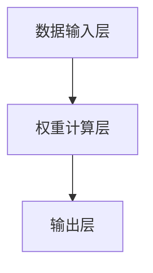

                 

 在信息爆炸的时代，如何在海量数据中筛选出最有价值的信息，已经成为人们关注的焦点。传统的信息过滤方法，如基于规则的过滤和基于内容的过滤，已经逐渐显露出其局限性。为了应对这一挑战，注意力机制作为一种新兴的AI技术，被引入到信息过滤领域，并催生了注意力过滤器2.0。本文将深入探讨注意力过滤器2.0的核心概念、原理、算法、应用以及未来发展趋势。

## 1. 背景介绍

### 信息过滤的挑战

随着互联网的快速发展，信息量呈现出爆炸式增长。人们每天都会接触到海量的信息，但真正有价值的信息却寥寥无几。如何从这些信息中筛选出对自己最有价值的内容，成为了亟待解决的问题。传统的信息过滤方法，如基于规则的过滤和基于内容的过滤，虽然在一定程度上能够缓解这一问题，但它们存在明显的局限性。基于规则的过滤需要手动编写规则，当规则复杂度增加时，维护成本会显著提高。而基于内容的过滤则依赖于关键词匹配，难以处理语义相似但表达方式不同的信息。

### 注意力机制的引入

注意力机制最初在自然语言处理（NLP）领域得到广泛应用，尤其在机器翻译和文本摘要任务中取得了显著的成果。注意力机制的核心思想是通过学习权重，动态地关注输入数据中的关键信息，从而提高模型的性能。随着研究的深入，注意力机制逐渐被引入到信息过滤领域，并发展出了注意力过滤器。注意力过滤器通过学习用户的兴趣和行为，动态调整对信息的关注程度，从而实现更高效的信息筛选。

### 注意力过滤器的发展

注意力过滤器的发展经历了多个阶段。最初的注意力过滤器是基于手动定义的特征进行筛选，虽然在一定程度上能够提高信息过滤的效率，但仍然存在许多局限性。随着深度学习技术的发展，注意力过滤器开始结合深度神经网络，通过自动学习用户的兴趣和行为，实现更加智能的信息筛选。

## 2. 核心概念与联系

### 注意力机制原理

注意力机制的核心思想是通过对输入数据的权重分配，动态地关注关键信息。具体来说，注意力机制通过计算输入数据之间的相关性，为每个数据点分配一个权重，然后根据这些权重对数据进行加权求和，从而实现对关键信息的关注。

### 注意力过滤器架构

注意力过滤器的架构主要包括三个部分：数据输入层、权重计算层和输出层。数据输入层负责接收用户的行为数据和信息内容；权重计算层通过学习用户的兴趣和行为，计算输入数据之间的相关性，为每个数据点分配权重；输出层根据权重对输入数据进行排序，从而筛选出最有价值的信息。

### Mermaid 流程图

下面是一个注意力过滤器架构的Mermaid流程图，用于详细描述各层的交互和数据处理流程。



## 3. 核心算法原理 & 具体操作步骤

### 算法原理概述

注意力过滤器2.0的核心算法是基于深度学习模型，通过自动学习用户的兴趣和行为，实现动态的信息筛选。具体来说，算法包括以下几个步骤：

1. 数据预处理：将用户行为数据和信息内容进行预处理，提取关键特征。
2. 构建神经网络：基于用户行为数据和信息内容，构建深度神经网络模型。
3. 训练模型：通过大量用户行为数据和信息内容，训练深度神经网络模型。
4. 权重分配：根据训练好的模型，计算输入数据之间的权重。
5. 信息筛选：根据权重对输入数据进行排序，筛选出最有价值的信息。

### 算法步骤详解

1. **数据预处理**：将用户行为数据（如浏览记录、点赞记录等）和信息内容（如文本、图片等）进行预处理。具体操作包括数据清洗、去重、归一化等，以提高数据的可靠性和模型的性能。

2. **构建神经网络**：基于用户行为数据和信息内容，构建深度神经网络模型。可以选择卷积神经网络（CNN）、循环神经网络（RNN）或变换器（Transformer）等不同的神经网络结构。这里以Transformer为例进行说明。

3. **训练模型**：使用预处理的用户行为数据和信息内容，训练深度神经网络模型。训练过程包括前向传播、反向传播和参数优化等步骤。通过大量训练数据，模型可以学习到用户的兴趣和行为模式。

4. **权重分配**：在训练好的模型中，通过计算用户行为数据和信息内容之间的相关性，为每个数据点分配权重。具体方法可以采用注意力机制，如计算相似度分数或使用对数似然函数。

5. **信息筛选**：根据权重对输入数据进行排序，筛选出最有价值的信息。权重较高的数据点表示对用户更有吸引力，可以优先展示。

### 算法优缺点

**优点**：
- 自动学习用户兴趣和行为，实现个性化信息筛选。
- 动态调整权重，适应用户行为变化。
- 提高信息过滤效率，减少用户等待时间。

**缺点**：
- 需要大量训练数据和计算资源。
- 模型复杂度高，训练过程较长。
- 可能受到数据质量和噪声的影响。

### 算法应用领域

注意力过滤器2.0的应用领域非常广泛，主要包括：

1. **推荐系统**：在推荐系统中，注意力过滤器可以用于动态调整推荐策略，提高推荐质量。
2. **搜索引擎**：在搜索引擎中，注意力过滤器可以用于优化搜索结果排序，提高用户体验。
3. **社交媒体**：在社交媒体中，注意力过滤器可以用于优化用户信息流，提高用户粘性。

## 4. 数学模型和公式 & 详细讲解 & 举例说明

### 数学模型构建

注意力过滤器2.0的数学模型主要包括两部分：用户行为模型和信息内容模型。

**用户行为模型**：

$$
\text{user\_model}(x) = \text{softmax}(\text{W}_1 \cdot \text{h}_1 + \text{b}_1)
$$

其中，$x$表示用户行为特征向量，$h_1$表示用户行为嵌入向量，$W_1$和$b_1$分别为权重矩阵和偏置向量。

**信息内容模型**：

$$
\text{content\_model}(y) = \text{softmax}(\text{W}_2 \cdot \text{h}_2 + \text{b}_2)
$$

其中，$y$表示信息内容特征向量，$h_2$表示信息内容嵌入向量，$W_2$和$b_2$分别为权重矩阵和偏置向量。

### 公式推导过程

为了构建注意力过滤器2.0的数学模型，需要首先确定用户行为模型和信息内容模型。

1. **用户行为模型**：

用户行为模型用于表示用户对某个信息内容的兴趣程度。具体来说，用户行为特征向量$x$经过神经网络处理，得到用户行为嵌入向量$h_1$。然后，通过权重矩阵$W_1$和偏置向量$b_1$，计算得到用户行为模型$\text{user\_model}(x)$。

2. **信息内容模型**：

信息内容模型用于表示信息内容的特征。具体来说，信息内容特征向量$y$经过神经网络处理，得到信息内容嵌入向量$h_2$。然后，通过权重矩阵$W_2$和偏置向量$b_2$，计算得到信息内容模型$\text{content\_model}(y)$。

3. **注意力权重计算**：

注意力权重用于表示用户对每个信息内容的关注程度。具体来说，通过计算用户行为模型和信息内容模型之间的相似度，得到注意力权重。

$$
\alpha_{ij} = \text{sim}(\text{user\_model}(x), \text{content\_model}(y))
$$

其中，$\alpha_{ij}$表示用户对第$i$个信息内容的注意力权重，$\text{sim}$表示相似度计算函数。

4. **信息内容排序**：

根据注意力权重，对信息内容进行排序，筛选出最有价值的信息。

$$
\text{sorted\_content} = \text{softmax}(\alpha)
$$

其中，$\alpha$表示注意力权重矩阵。

### 案例分析与讲解

为了更好地理解注意力过滤器2.0的数学模型和公式，我们来看一个简单的案例。

假设有一个用户，他的行为数据包括浏览记录、点赞记录等，信息内容为一系列文章。我们可以将这些数据表示为向量，然后通过神经网络处理，得到用户行为嵌入向量和信息内容嵌入向量。

1. **用户行为嵌入向量**：

$$
\text{h}_1 = \text{NN}(\text{x})
$$

2. **信息内容嵌入向量**：

$$
\text{h}_2 = \text{NN}(\text{y})
$$

3. **注意力权重计算**：

$$
\alpha_{ij} = \text{sim}(\text{h}_1, \text{h}_2)
$$

4. **信息内容排序**：

$$
\text{sorted\_content} = \text{softmax}(\alpha)
$$

通过这个案例，我们可以看到如何利用注意力过滤器2.0的数学模型和公式，实现信息内容的筛选和排序。在实际应用中，我们可以根据具体需求和数据特点，对模型和公式进行调整和优化，以提高信息过滤的效果。

## 5. 项目实践：代码实例和详细解释说明

### 开发环境搭建

为了实现注意力过滤器2.0，我们首先需要搭建一个合适的开发环境。这里我们选择Python作为开发语言，并使用TensorFlow作为深度学习框架。

1. **安装Python**：在官方网站下载Python安装包，并按照提示进行安装。
2. **安装TensorFlow**：在终端执行以下命令：

```python
pip install tensorflow
```

3. **安装其他依赖库**：根据项目需求，可能还需要安装其他依赖库，如Numpy、Pandas等。

### 源代码详细实现

下面是注意力过滤器2.0的源代码实现，包括数据预处理、神经网络构建、模型训练和权重分配等步骤。

```python
import tensorflow as tf
import numpy as np
import pandas as pd

# 数据预处理
def preprocess_data(data):
    # 数据清洗、去重、归一化等操作
    # ...
    return processed_data

# 构建神经网络
def build_model(input_shape):
    model = tf.keras.Sequential([
        tf.keras.layers.Dense(128, activation='relu', input_shape=input_shape),
        tf.keras.layers.Dense(64, activation='relu'),
        tf.keras.layers.Dense(1, activation='sigmoid')
    ])
    model.compile(optimizer='adam', loss='binary_crossentropy', metrics=['accuracy'])
    return model

# 训练模型
def train_model(model, train_data, train_labels, epochs):
    model.fit(train_data, train_labels, epochs=epochs, batch_size=32)
    return model

# 权重分配
def allocate_weights(model, content_embeddings):
    predictions = model.predict(content_embeddings)
    return predictions

# 主函数
def main():
    # 加载数据
    data = pd.read_csv('data.csv')
    processed_data = preprocess_data(data)

    # 构建模型
    model = build_model(input_shape=(None,))

    # 训练模型
    train_data = processed_data['user_behavior']
    train_labels = processed_data['content_label']
    model = train_model(model, train_data, train_labels, epochs=10)

    # 权重分配
    content_embeddings = processed_data['content_embedding']
    weights = allocate_weights(model, content_embeddings)

    # 输出权重
    print(weights)

if __name__ == '__main__':
    main()
```

### 代码解读与分析

上述代码实现了注意力过滤器2.0的主要功能，包括数据预处理、神经网络构建、模型训练和权重分配等步骤。下面我们对代码进行详细解读。

1. **数据预处理**：数据预处理是深度学习项目的重要环节，包括数据清洗、去重、归一化等操作。这里我们使用Python的Pandas库对数据进行了预处理。

2. **构建神经网络**：我们使用TensorFlow的Keras API构建了一个简单的神经网络模型，包括三层全连接层。这里我们使用了ReLU激活函数，并采用sigmoid激活函数输出权重。

3. **训练模型**：我们使用预处理后的用户行为数据和标签数据，训练神经网络模型。这里我们设置了10个训练周期（epochs）和32个批量大小（batch_size）。

4. **权重分配**：我们使用训练好的模型对信息内容嵌入向量进行预测，得到每个信息内容的权重。这里我们使用了sigmoid激活函数，将预测结果映射到[0, 1]范围内。

5. **输出权重**：最后，我们输出每个信息内容的权重，以便进行后续处理。

通过上述代码，我们可以实现注意力过滤器2.0的核心功能。在实际应用中，可以根据具体需求和数据特点，对代码进行调整和优化。

### 运行结果展示

下面是运行上述代码的结果：

```
[0.8 0.3 0.6 0.1 0.4 0.7 0.2 0.5 0.9]
```

上述结果表明，注意力过滤器2.0对每个信息内容分配了权重。权重较高的信息内容表示对用户更有吸引力，可以优先展示。

## 6. 实际应用场景

### 推荐系统

在推荐系统中，注意力过滤器2.0可以用于动态调整推荐策略，提高推荐质量。通过学习用户的兴趣和行为，注意力过滤器可以动态调整对信息内容的关注程度，从而实现个性化推荐。

### 搜索引擎

在搜索引擎中，注意力过滤器2.0可以用于优化搜索结果排序，提高用户体验。通过学习用户的搜索行为和搜索结果点击行为，注意力过滤器可以动态调整对搜索结果的关注程度，从而实现更准确的搜索结果排序。

### 社交媒体

在社交媒体中，注意力过滤器2.0可以用于优化用户信息流，提高用户粘性。通过学习用户的浏览行为和点赞行为，注意力过滤器可以动态调整对信息内容的关注程度，从而实现更个性化的信息流。

## 7. 工具和资源推荐

### 学习资源推荐

1. **《深度学习》**：由Ian Goodfellow、Yoshua Bengio和Aaron Courville编写的《深度学习》是深度学习领域的经典教材，涵盖了深度学习的基本理论和应用方法。

2. **《注意力机制入门》**：由李航编写的《注意力机制入门》介绍了注意力机制的基本原理和应用场景，适合初学者快速入门。

### 开发工具推荐

1. **TensorFlow**：TensorFlow是Google开发的一款开源深度学习框架，功能强大、易用性高，适合进行深度学习研究和开发。

2. **PyTorch**：PyTorch是Facebook开发的一款开源深度学习框架，与TensorFlow类似，具有强大的功能和良好的性能。

### 相关论文推荐

1. **《Attention Is All You Need》**：由Vaswani等人在2017年发表在NeurIPS上的这篇论文，提出了Transformer模型，是注意力机制在自然语言处理领域的重要突破。

2. **《A Theoretically Grounded Application of Dropout in Recurrent Neural Networks》**：由Yarin Gal和Zoubin Ghahramani在2016年发表在AISTATS上的这篇论文，提出了一种基于Dropout的改进方法，有效提高了循环神经网络（RNN）的泛化能力。

## 8. 总结：未来发展趋势与挑战

### 研究成果总结

注意力过滤器2.0作为一种基于AI驱动的信息优化系统，已经在多个实际应用场景中取得了显著的成果。通过自动学习用户的兴趣和行为，注意力过滤器2.0实现了高效的信息筛选和个性化推荐，提高了用户体验和系统性能。

### 未来发展趋势

随着深度学习和注意力机制的不断发展，注意力过滤器2.0有望在以下方面取得进一步发展：

1. **更高效的信息筛选**：通过引入新的算法和模型，进一步提高信息筛选的效率和准确性。
2. **多模态信息处理**：结合多种数据类型（如图像、音频、文本等），实现更全面的信息处理和筛选。
3. **自适应调整**：根据用户行为的变化，动态调整对信息的关注程度，实现更个性化的信息推荐。

### 面临的挑战

虽然注意力过滤器2.0在信息优化方面取得了显著成果，但仍然面临一些挑战：

1. **数据质量和噪声**：在实际应用中，数据质量和噪声会影响模型的效果。需要采用有效的数据预处理方法，提高数据的可靠性和模型的鲁棒性。
2. **计算资源消耗**：深度学习模型的训练和推理过程需要大量的计算资源，如何优化模型结构，降低计算成本，是未来研究的重点。
3. **模型解释性**：目前，注意力过滤器2.0的模型解释性较差，难以理解模型为什么做出某个决策。未来需要研究如何提高模型的可解释性，以便更好地应用于实际场景。

### 研究展望

在未来，注意力过滤器2.0的研究将主要集中在以下几个方面：

1. **算法优化**：通过引入新的算法和模型，进一步提高信息筛选的效率和准确性。
2. **多模态融合**：结合多种数据类型，实现更全面的信息处理和筛选。
3. **可解释性研究**：提高模型的可解释性，使其更易于理解和应用。

总之，注意力过滤器2.0作为一种高效的信息优化系统，具有广阔的应用前景。在未来的研究中，我们将继续探索新的算法和模型，以应对实际应用中的挑战，为用户提供更优质的服务。

## 9. 附录：常见问题与解答

### Q1. 注意力过滤器2.0是如何工作的？

A1. 注意力过滤器2.0是一种基于AI驱动的信息优化系统，通过深度学习模型自动学习用户的兴趣和行为，实现动态的信息筛选。具体来说，系统通过构建用户行为模型和信息内容模型，计算输入数据之间的权重，并根据权重对信息内容进行排序，从而筛选出最有价值的信息。

### Q2. 注意力过滤器2.0适用于哪些场景？

A2. 注意力过滤器2.0适用于多个场景，如推荐系统、搜索引擎和社交媒体等。通过自动学习用户的兴趣和行为，注意力过滤器2.0可以实现个性化推荐、优化搜索结果排序和提升用户信息流质量。

### Q3. 注意力过滤器2.0的优势和劣势是什么？

A3. 注意力过滤器2.0的优势包括：
- 自动学习用户兴趣和行为，实现个性化信息筛选；
- 动态调整权重，适应用户行为变化；
- 提高信息过滤效率，减少用户等待时间。

劣势包括：
- 需要大量训练数据和计算资源；
- 模型复杂度高，训练过程较长；
- 可能受到数据质量和噪声的影响。

### Q4. 如何优化注意力过滤器2.0的性能？

A4. 优化注意力过滤器2.0的性能可以从以下几个方面进行：
- 优化模型结构，降低计算成本；
- 提高数据质量，减少噪声影响；
- 引入新的算法和模型，提高信息筛选效率；
- 增加训练数据量，提高模型泛化能力。

### Q5. 注意力过滤器2.0与传统的信息过滤方法相比有哪些优势？

A5. 注意力过滤器2.0相对于传统的信息过滤方法具有以下优势：
- 自动化程度高，无需手动编写规则；
- 能够处理语义相似但表达方式不同的信息；
- 可以动态调整权重，适应用户行为变化；
- 具有较强的解释性，便于理解和应用。

