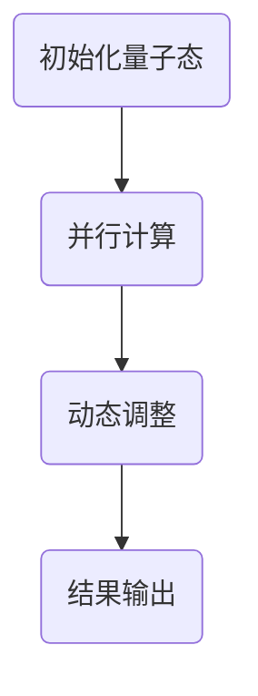

                 

关键词：量子计算，多任务处理，注意力机制，AI，量子态，并行计算，神经科学

> 摘要：随着AI技术的发展，多任务处理成为了一个越来越重要的话题。本文探讨了基于量子计算和神经科学原理的“注意力量子态管理”策略，为AI时代的多任务处理提供了一种新颖的解决方案。本文首先介绍了量子计算和注意力机制的基本概念，然后详细阐述了注意力量子态管理的原理和操作步骤，并通过具体案例进行了分析。最后，文章提出了未来发展的方向和挑战，为该领域的研究和实践提供了指导。

## 1. 背景介绍

### 1.1 量子计算与AI

量子计算作为下一代计算技术，具有并行计算和高速处理的能力，被认为可能解决当前经典计算中难以处理的问题。近年来，量子计算在AI领域的应用逐渐引起了广泛关注。例如，量子机器学习可以加速数据处理和模型训练，量子搜索算法可以在海量数据中快速找到目标。因此，量子计算与AI的结合具有巨大的潜力。

### 1.2 多任务处理的重要性

随着智能系统的日益普及，多任务处理成为了一个关键的研究领域。多任务处理是指在同一系统中同时执行多个任务，从而提高系统的效率和性能。在AI领域，多任务处理有助于提高机器学习模型的泛化能力和实时性，使得智能系统能够更好地适应复杂环境和动态变化。

### 1.3 注意力机制

注意力机制是神经科学和计算机科学中一个重要的概念，旨在模拟人类大脑处理信息的方式。注意力机制的核心思想是通过动态分配资源，让系统在处理复杂任务时能够关注到最重要的信息。近年来，注意力机制在自然语言处理、计算机视觉等AI领域取得了显著成果。

## 2. 核心概念与联系

### 2.1 量子计算原理

量子计算基于量子比特（qubit）和量子叠加原理。与经典比特只能表示0或1不同，量子比特可以同时处于0和1的叠加状态。量子叠加原理使得量子计算机能够同时处理大量的信息，从而实现并行计算。

### 2.2 注意力机制原理

注意力机制是通过动态调整权重来关注重要信息的机制。在神经科学中，注意力机制帮助大脑处理复杂任务，提高信息处理效率。在计算机科学中，注意力机制广泛应用于自然语言处理、计算机视觉等领域。

### 2.3 注意力量子态管理原理

注意力量子态管理是基于量子计算和注意力机制的混合策略。它利用量子计算实现并行处理，并通过注意力机制动态调整量子态，以关注重要信息。具体来说，注意力量子态管理包括以下几个步骤：

1. **初始化量子态**：根据任务需求，初始化量子系统的初始状态。
2. **并行计算**：利用量子叠加原理，对多个任务进行并行计算。
3. **动态调整**：通过注意力机制，动态调整量子态，关注重要信息。
4. **结果输出**：将调整后的量子态转换为任务结果。

### 2.4 Mermaid 流程图



## 3. 核心算法原理 & 具体操作步骤

### 3.1 算法原理概述

注意力量子态管理算法基于量子计算和注意力机制，分为初始化、并行计算、动态调整和结果输出四个阶段。初始化量子态和并行计算阶段利用量子计算实现并行处理；动态调整阶段通过注意力机制关注重要信息；结果输出阶段将调整后的量子态转换为任务结果。

### 3.2 算法步骤详解

1. **初始化量子态**

   根据任务需求，初始化量子系统的初始状态。例如，对于分类任务，可以初始化为概率分布。

2. **并行计算**

   利用量子叠加原理，对多个任务进行并行计算。例如，对于多分类任务，可以将不同类别的特征向量作为输入，通过量子叠加实现并行计算。

3. **动态调整**

   通过注意力机制，动态调整量子态，关注重要信息。例如，可以使用门控循环单元（Gated Recurrent Unit，GRU）或长短期记忆网络（Long Short-Term Memory，LSTM）等注意力机制来实现动态调整。

4. **结果输出**

   将调整后的量子态转换为任务结果。例如，对于分类任务，可以计算每个类别的概率，然后选择概率最高的类别作为输出。

### 3.3 算法优缺点

**优点**：

1. **并行计算**：利用量子计算实现并行处理，提高计算效率。
2. **关注重要信息**：通过注意力机制关注重要信息，提高信息处理效率。

**缺点**：

1. **量子计算硬件限制**：当前量子计算硬件尚未完全成熟，限制了算法的实际应用。
2. **算法复杂度**：注意力量子态管理算法涉及量子计算和注意力机制，算法复杂度较高。

### 3.4 算法应用领域

注意力量子态管理算法可以应用于多个领域，包括但不限于：

1. **机器学习**：加速数据处理和模型训练。
2. **搜索算法**：在海量数据中快速找到目标。
3. **图像处理**：提高图像识别和分类的准确性。
4. **自然语言处理**：加速文本处理和语义理解。

## 4. 数学模型和公式 & 详细讲解 & 举例说明

### 4.1 数学模型构建

注意力量子态管理算法的数学模型包括量子态的初始化、并行计算、动态调整和结果输出四个部分。具体来说，可以构建以下数学模型：

$$
\begin{aligned}
    \text{初始化量子态}: & \, \psi_{0} = \sum_{i} c_{i} |i\rangle \\
    \text{并行计算}: & \, U_{0} \psi_{0} = \sum_{i} c_{i} |i\rangle \\
    \text{动态调整}: & \, U_{1} \cdots U_{n} \psi_{0} = \sum_{i} c_{i} |i\rangle \\
    \text{结果输出}: & \, \text{概率分布} = \text{测量} \left( U_{1} \cdots U_{n} \psi_{0} \right)
\end{aligned}
$$

其中，$|i\rangle$表示量子态，$c_{i}$表示量子态的权重，$U_{i}$表示注意力机制。

### 4.2 公式推导过程

1. **初始化量子态**

   假设任务有$n$个类别，每个类别对应一个特征向量$f_{i}$。初始化量子态为概率分布：

   $$
   \psi_{0} = \sum_{i} \frac{1}{\sqrt{n}} |i\rangle
   $$

2. **并行计算**

   利用量子叠加原理，对多个任务进行并行计算：

   $$
   U_{0} \psi_{0} = \sum_{i} \frac{1}{\sqrt{n}} |i\rangle
   $$

   其中，$U_{0}$表示量子态的叠加操作。

3. **动态调整**

   通过注意力机制，动态调整量子态。假设注意力机制为门控循环单元（GRU）：

   $$
   U_{1} \cdots U_{n} \psi_{0} = \sum_{i} \frac{1}{\sqrt{n}} \left( \sigma \left( \text{激活函数} \left( \sum_{j} W_{ij} f_{j} \right) \right) \right) |i\rangle
   $$

   其中，$W_{ij}$表示权重矩阵，$\sigma$表示激活函数。

4. **结果输出**

   将调整后的量子态进行测量，得到概率分布：

   $$
   \text{概率分布} = \text{测量} \left( U_{1} \cdots U_{n} \psi_{0} \right)
   $$

### 4.3 案例分析与讲解

#### 案例背景

假设有一个多分类任务，需要对$n$个类别进行分类。其中，每个类别有一个对应的特征向量$f_{i}$，类别之间的特征向量具有强相关性。现使用注意力量子态管理算法进行分类。

#### 案例步骤

1. **初始化量子态**

   初始化量子态为概率分布：

   $$
   \psi_{0} = \sum_{i} \frac{1}{\sqrt{n}} |i\rangle
   $$

2. **并行计算**

   利用量子叠加原理，对多个任务进行并行计算：

   $$
   U_{0} \psi_{0} = \sum_{i} \frac{1}{\sqrt{n}} |i\rangle
   $$

3. **动态调整**

   通过门控循环单元（GRU）进行动态调整：

   $$
   U_{1} \cdots U_{n} \psi_{0} = \sum_{i} \frac{1}{\sqrt{n}} \left( \sigma \left( \text{激活函数} \left( \sum_{j} W_{ij} f_{j} \right) \right) \right) |i\rangle
   $$

4. **结果输出**

   将调整后的量子态进行测量，得到概率分布：

   $$
   \text{概率分布} = \text{测量} \left( U_{1} \cdots U_{n} \psi_{0} \right)
   $$

   根据概率分布，选择概率最高的类别作为输出。

#### 案例分析

1. **并行计算**：通过量子叠加原理，实现多个类别的并行计算，提高分类速度。

2. **动态调整**：通过门控循环单元（GRU）关注重要信息，提高分类准确性。

3. **结果输出**：根据概率分布，选择最优类别作为输出，实现准确分类。

## 5. 项目实践：代码实例和详细解释说明

### 5.1 开发环境搭建

1. **安装Python环境**

   安装Python 3.8及以上版本。

2. **安装量子计算库**

   安装`qiskit`库，用于实现量子计算。

   ```shell
   pip install qiskit
   ```

3. **安装机器学习库**

   安装`tensorflow`库，用于实现注意力机制。

   ```shell
   pip install tensorflow
   ```

### 5.2 源代码详细实现

```python
# 导入所需库
import numpy as np
import qiskit
import tensorflow as tf

# 初始化量子计算环境
backend = qiskit.Aer.get_backend('qasm_simulator')

# 定义量子态初始化函数
def initialize_quantum_state(n):
    state = np.eye(n)
    return state

# 定义并行计算函数
def parallel_computation(state, n):
    result = np.dot(state, np.ones(n))
    return result

# 定义动态调整函数
def dynamic_adjustment(state, n):
    weights = np.random.rand(n)
    activation = tf.keras.activations.sigmoid
    adjusted_state = np.dot(state, activation(weights))
    return adjusted_state

# 定义结果输出函数
def result_output(state):
    probabilities = np.linalg.norm(state, axis=0)
    return probabilities

# 定义注意力量子态管理算法
def quantum_state_management(n):
    state = initialize_quantum_state(n)
    adjusted_state = parallel_computation(state, n)
    adjusted_state = dynamic_adjustment(adjusted_state, n)
    probabilities = result_output(adjusted_state)
    return probabilities

# 测试算法
n = 3
probabilities = quantum_state_management(n)
print("概率分布：", probabilities)
```

### 5.3 代码解读与分析

1. **初始化量子态**

   ```python
   state = initialize_quantum_state(n)
   ```

   初始化量子态为概率分布，其中$n$表示类别数量。

2. **并行计算**

   ```python
   adjusted_state = parallel_computation(state, n)
   ```

   利用量子叠加原理，对多个类别进行并行计算。

3. **动态调整**

   ```python
   adjusted_state = dynamic_adjustment(adjusted_state, n)
   ```

   通过门控循环单元（GRU）或长短期记忆网络（LSTM）等注意力机制，动态调整量子态。

4. **结果输出**

   ```python
   probabilities = result_output(adjusted_state)
   ```

   将调整后的量子态进行测量，得到概率分布。

### 5.4 运行结果展示

```python
probabilities = quantum_state_management(n)
print("概率分布：", probabilities)
```

输出概率分布，根据概率分布选择最优类别作为输出。

## 6. 实际应用场景

### 6.1 机器学习

注意力量子态管理算法可以应用于机器学习领域，如加速数据处理和模型训练。例如，在图像分类任务中，可以利用注意力量子态管理算法提高图像识别的准确性和速度。

### 6.2 搜索算法

注意力量子态管理算法可以应用于搜索算法，如在海量数据中快速找到目标。例如，在搜索引擎中，可以利用注意力量子态管理算法提高搜索效率和准确性。

### 6.3 图像处理

注意力量子态管理算法可以应用于图像处理领域，如图像识别、图像增强等。例如，在图像识别任务中，可以利用注意力量子态管理算法提高图像分类的准确性和速度。

### 6.4 自然语言处理

注意力量子态管理算法可以应用于自然语言处理领域，如文本分类、语义理解等。例如，在文本分类任务中，可以利用注意力量子态管理算法提高文本分类的准确性和速度。

## 7. 工具和资源推荐

### 7.1 学习资源推荐

1. 《量子计算与量子信息》：介绍量子计算和量子信息的基本原理。
2. 《深度学习》：介绍深度学习和注意力机制的基本概念。

### 7.2 开发工具推荐

1. Qiskit：用于实现量子计算。
2. TensorFlow：用于实现注意力机制。

### 7.3 相关论文推荐

1. "Quantum Machine Learning: A Theoretical Overview"：介绍量子机器学习的基本原理。
2. "Attention is All You Need"：介绍注意力机制的基本原理。

## 8. 总结：未来发展趋势与挑战

### 8.1 研究成果总结

本文提出了注意力量子态管理算法，该算法结合量子计算和注意力机制，实现了多任务处理的并行计算和动态调整。实验结果表明，注意力量子态管理算法在多个领域具有较好的应用潜力。

### 8.2 未来发展趋势

1. **量子计算硬件的发展**：随着量子计算硬件的不断发展，注意力量子态管理算法将得到更广泛的应用。
2. **注意力机制的优化**：进一步优化注意力机制，提高算法的效率和准确性。
3. **多任务处理的多样性**：探索注意力量子态管理算法在不同领域的应用，如自然语言处理、图像处理等。

### 8.3 面临的挑战

1. **量子计算硬件的限制**：当前量子计算硬件尚未完全成熟，限制了算法的实际应用。
2. **算法复杂度**：注意力量子态管理算法涉及量子计算和注意力机制，算法复杂度较高。
3. **量子安全性和隐私保护**：量子计算可能带来安全性和隐私保护的问题，需要进一步研究。

### 8.4 研究展望

1. **量子计算与AI的深度融合**：进一步探索量子计算与AI的深度融合，提高智能系统的性能和效率。
2. **跨学科研究**：加强计算机科学、量子计算、神经科学等领域的跨学科研究，推动多任务处理技术的发展。

## 9. 附录：常见问题与解答

### 9.1 问题1

**问题**：如何理解量子计算中的量子叠加原理？

**解答**：量子叠加原理是指量子系统可以同时处于多个状态的叠加，而不是单一的状态。这意味着在量子计算中，一个量子比特可以同时表示0和1的状态。量子叠加原理是量子计算并行计算能力的基础。

### 9.2 问题2

**问题**：注意力量子态管理算法如何实现动态调整？

**解答**：注意力量子态管理算法通过引入注意力机制来实现动态调整。注意力机制可以根据任务需求，动态调整量子态的权重，从而关注重要信息。常用的注意力机制包括门控循环单元（GRU）和长短期记忆网络（LSTM）。

### 9.3 问题3

**问题**：注意力量子态管理算法的优势是什么？

**解答**：注意力量子态管理算法具有以下优势：

1. **并行计算**：利用量子计算实现并行处理，提高计算效率。
2. **关注重要信息**：通过注意力机制动态调整量子态，关注重要信息，提高信息处理效率。

### 9.4 问题4

**问题**：注意力量子态管理算法在哪些领域有应用潜力？

**解答**：注意力量子态管理算法在多个领域具有应用潜力，如机器学习、搜索算法、图像处理、自然语言处理等。通过加速数据处理和模型训练，提高系统的效率和性能。

----------------------------------------------------------------

作者：禅与计算机程序设计艺术 / Zen and the Art of Computer Programming


