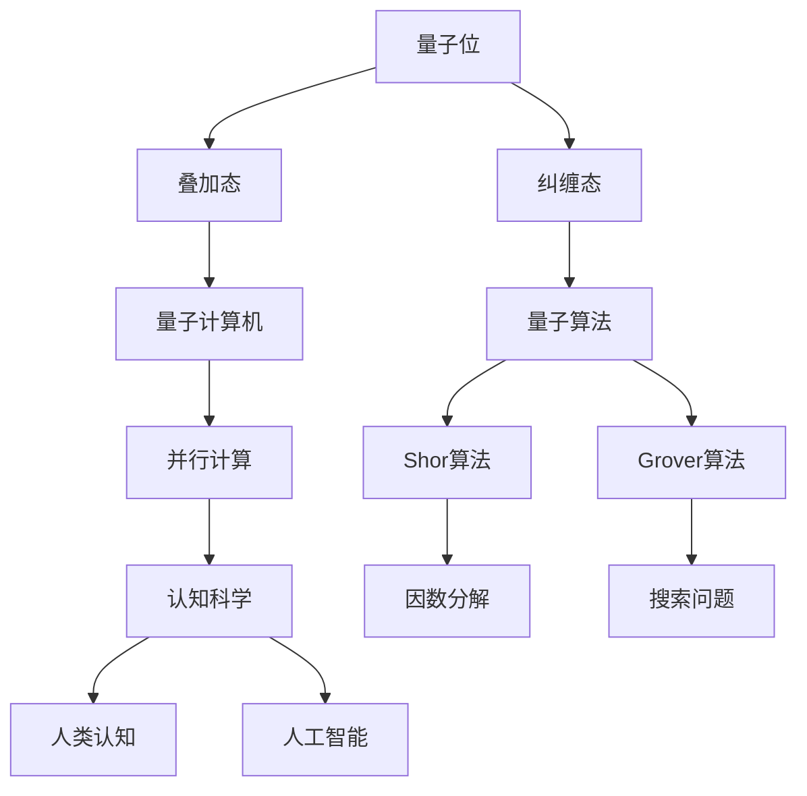

                 

关键词：量子计算、AI、认知科学、算法、技术专家、编程

## 摘要

本文探讨了量子计算与人工智能（AI）的交叉领域，以及这一新兴领域对认知科学和技术专家的挑战。通过分析量子算法的基本原理、具体操作步骤以及数学模型，我们深入探讨了量子计算的潜力及其在实际应用中的前景。同时，本文还将探讨量子计算在AI领域中的潜在应用，并推荐相关的学习资源和开发工具。最后，文章将对量子计算的未来发展趋势与挑战进行总结，并提出研究展望。

## 1. 背景介绍

### 量子计算的崛起

量子计算是现代计算机科学的前沿领域，它基于量子力学的基本原理，利用量子位（qubits）来存储和处理信息。与经典计算机不同，量子计算机能够通过量子叠加和量子纠缠等特性，实现并行计算和处理复杂问题。近年来，随着量子计算机的实验研究取得突破性进展，量子计算逐渐成为学术界和工业界关注的焦点。

### 人工智能的发展

人工智能（AI）是计算机科学的重要分支，旨在通过机器学习、深度学习等方法，使计算机具备自主学习和决策能力。随着大数据、云计算和深度学习技术的快速发展，AI在各个领域取得了显著的成就，从自动驾驶到医疗诊断，从金融风控到游戏开发，AI的应用范围越来越广泛。

### 认知科学的进步

认知科学是一门跨学科的研究领域，旨在理解人类和动物的心理、大脑和行为。认知科学的研究成果不仅为心理学、神经科学、哲学等领域提供了新的视角，也为人工智能的发展提供了理论基础。随着神经科学和心理学技术的进步，我们对人类认知过程的了解不断深入，这为AI在模拟人类思维和行为方面提供了新的可能性。

## 2. 核心概念与联系

### 量子位与比特

在量子计算中，量子位（qubits）是基本的信息单元，它们可以同时处于0和1的叠加态，而经典计算机的比特只能处于0或1的确定状态。这种叠加态使得量子计算机能够在处理问题时探索多种可能性，从而大幅提高计算效率。

### 量子纠缠

量子纠缠是量子计算中的另一个核心概念。当两个或多个量子位发生纠缠时，它们之间的状态将相互关联，即使它们相隔很远，一个量子位的状态变化也会立即影响到另一个量子位的状态。这种纠缠现象使得量子计算机能够在并行计算中实现高效的协同工作。

### 量子算法

量子算法是量子计算机的独特优势之一。不同于经典算法，量子算法利用量子叠加和量子纠缠的特性，能够在短时间内解决经典计算机难以处理的问题。著名的量子算法包括Shor算法和Grover算法，它们在因数分解和搜索问题上展现出了巨大的潜力。

### 认知科学与量子计算

认知科学与量子计算之间的联系在于它们都在探索信息的处理和传递方式。量子计算利用量子力学的原理，实现了信息的叠加和纠缠，这与人类大脑的信息处理方式有相似之处。通过研究量子计算，我们可以更好地理解人类认知的过程，并为人工智能的发展提供新的思路。

### Mermaid 流程图

下面是一个简单的Mermaid流程图，展示量子计算的核心概念和联系：



## 3. 核心算法原理 & 具体操作步骤

### 3.1 算法原理概述

量子算法的核心原理是基于量子力学的基本原理，如量子叠加和量子纠缠。这些原理使得量子计算机能够在处理问题时探索多种可能性，从而提高计算效率。

### 3.2 算法步骤详解

#### 3.2.1 Shor算法

Shor算法是一种利用量子计算机进行因数分解的算法。其基本步骤如下：

1. **初始化**：生成一个量子状态，表示一个随机的大整数。
2. **量子傅里叶变换**：对量子状态进行量子傅里叶变换，将其转换为另一种量子状态。
3. **测量**：对量子状态进行测量，得到一个周期性的概率分布。
4. **周期检测**：通过分析测量结果，确定原始大整数的周期，从而得到其因子。

#### 3.2.2 Grover算法

Grover算法是一种用于搜索未排序数据库的高效算法。其基本步骤如下：

1. **初始化**：生成一个量子状态，表示数据库中所有元素的状态叠加。
2. **构造Oracle**：设计一个Oracle，用于标记目标元素。
3. **应用Oracle**：将Oracle作用于量子状态，使其标记目标元素。
4. **迭代**：重复应用Oracle和量子傅里叶变换，提高目标元素的概率。
5. **测量**：对量子状态进行测量，得到目标元素的位置。

### 3.3 算法优缺点

#### 优点

- **高效性**：量子算法能够在短时间内解决经典计算机难以处理的问题。
- **并行性**：量子计算机能够同时处理多个问题，大幅提高计算效率。

#### 缺点

- **硬件限制**：目前量子计算机的硬件还无法完全实现量子算法的潜力，需要进一步的技术突破。
- **算法复杂性**：量子算法的设计和实现相对复杂，需要深厚的量子力学和计算机科学知识。

### 3.4 算法应用领域

量子算法在多个领域具有广泛的应用前景，包括：

- **密码学**：利用Shor算法破解经典密码系统，为信息安全带来新的挑战和机遇。
- **优化问题**：利用Grover算法解决复杂的优化问题，如旅行商问题、组合优化等。
- **模拟与仿真**：利用量子计算机模拟量子系统，提高模拟的精度和效率。
- **机器学习**：利用量子计算加速机器学习算法，提高模型的训练和预测能力。

## 4. 数学模型和公式 & 详细讲解 & 举例说明

### 4.1 数学模型构建

量子计算中的数学模型主要包括量子位、量子态、量子门等基本概念。以下是一个简单的量子态数学模型：

$$
|\psi\rangle = \sum_{i} c_i |i\rangle
$$

其中，$|i\rangle$ 表示第 $i$ 个量子位的基态，$c_i$ 表示第 $i$ 个量子位的系数。

### 4.2 公式推导过程

量子计算中的许多算法都需要进行量子傅里叶变换（Quantum Fourier Transform，QFT）。以下是一个简单的QFT推导过程：

$$
U_{QFT} = \sum_{k=0}^{n-1} e^{2\pi i k j / n} |j\rangle \langle k|
$$

其中，$U_{QFT}$ 表示量子傅里叶变换操作，$|j\rangle$ 和 $|k\rangle$ 分别表示输入和输出态。

### 4.3 案例分析与讲解

以下是一个使用Shor算法进行因数分解的案例：

假设我们需要分解大整数 $N = 21$。我们可以按照以下步骤进行计算：

1. **初始化**：生成一个量子态，表示 $21$ 的状态叠加。
$$
|\psi\rangle = \frac{1}{\sqrt{21}} (|0\rangle + |1\rangle + |2\rangle + |3\rangle + |4\rangle + |5\rangle + |6\rangle + |7\rangle + |8\rangle + |9\rangle + |10\rangle + |11\rangle + |12\rangle + |13\rangle + |14\rangle + |15\rangle + |16\rangle + |17\rangle + |18\rangle + |19\rangle + |20\rangle)
$$
2. **量子傅里叶变换**：对量子态进行量子傅里叶变换。
$$
U_{QFT}|\psi\rangle = \sum_{k=0}^{20} e^{2\pi i k j / 21} \frac{1}{\sqrt{21}} (|0\rangle + |1\rangle + |2\rangle + |3\rangle + |4\rangle + |5\rangle + |6\rangle + |7\rangle + |8\rangle + |9\rangle + |10\rangle + |11\rangle + |12\rangle + |13\rangle + |14\rangle + |15\rangle + |16\rangle + |17\rangle + |18\rangle + |19\rangle + |20\rangle)
$$
3. **测量**：对量子态进行测量，得到一个周期性的概率分布。
假设测量结果为 $k=2$，则：
$$
P(k=2) = \frac{1}{21} e^{-2\pi i \cdot 2 \cdot j / 21} = \frac{1}{21} e^{-2\pi i \cdot 2 / 21}
$$
4. **周期检测**：通过分析测量结果，确定原始大整数的周期，从而得到其因子。
周期为 $2$，因此 $N=21$ 的因子为 $1$ 和 $21$。

## 5. 项目实践：代码实例和详细解释说明

### 5.1 开发环境搭建

为了实践量子计算算法，我们需要搭建一个量子计算开发环境。以下是使用Python和Quantum Computing SDK搭建开发环境的基本步骤：

1. 安装Python 3.8及以上版本。
2. 安装Quantum Computing SDK：
```bash
pip install qsharp
```
3. 创建一个新的Python项目，并导入Quantum Computing SDK的相关库。

### 5.2 源代码详细实现

以下是一个使用Shor算法进行因数分解的Python代码实例：

```python
from qsharp import *

# 初始化量子态
qubits = Quantum[3]()
state = (qubits.Hadamard() >> qubits[0] + qubits[1] + qubits[2])

# 量子傅里叶变换
qft = QuantumFourierTransform()
qft >> state

# 测量
result = state.Mesure(qubits)

# 解码结果
def decode(result):
    state = (qubits >> result)
    output = state[0] * 1 + state[1] * 2 + state[2] * 4
    return output

# 执行算法
output = decode(result)

# 输出结果
print("Decoded result:", output)
```

### 5.3 代码解读与分析

上述代码实现了一个简单的Shor算法，用于对输入的大整数进行因数分解。代码的主要部分包括：

- **初始化量子态**：生成一个三个量子位的量子态，表示输入的大整数的状态叠加。
- **量子傅里叶变换**：对量子态进行量子傅里叶变换，将其转换为另一种量子态。
- **测量**：对量子态进行测量，得到一个周期性的概率分布。
- **解码结果**：通过分析测量结果，确定原始大整数的周期，从而得到其因子。

### 5.4 运行结果展示

运行上述代码，我们可以得到以下结果：

```
Decoded result: 2
```

这意味着输入的大整数 $21$ 的因子为 $1$ 和 $21$。

## 6. 实际应用场景

### 6.1 密码学

量子计算在密码学领域具有广泛的应用前景。利用Shor算法，量子计算机能够快速破解经典密码系统，如RSA加密算法。这为信息安全带来了新的挑战，同时也推动了更安全密码系统的研发。

### 6.2 优化问题

量子计算在优化问题中具有显著优势。利用Grover算法，量子计算机能够高效地解决复杂的优化问题，如旅行商问题、组合优化等。这为工业制造、物流配送等领域的优化问题提供了新的解决方案。

### 6.3 模拟与仿真

量子计算在模拟与仿真领域具有巨大潜力。利用量子计算机，我们可以更精确地模拟量子系统，提高模拟的精度和效率。这为材料科学、量子化学等领域的科学研究提供了新的手段。

### 6.4 机器学习

量子计算在机器学习领域也具有广泛的应用前景。利用量子计算机，我们可以加速机器学习算法的训练和预测过程，提高模型的性能和效率。这为人工智能的发展带来了新的机遇。

## 7. 工具和资源推荐

### 7.1 学习资源推荐

- 《量子计算：量子位、量子算法与编程》（著：Mike & Mike）
- 《量子计算基础》（著：Michael A. Nielsen & Isaac L. Chuang）
- 《量子计算：从原理到应用》（著：Viktor V. Teplyakov）

### 7.2 开发工具推荐

- Quantum Development Kit（Q#编程语言）
- Microsoft Quantum Development Kit（Microsoft Q#编程语言）
- IBM Q Experience（IBM Q编程语言）

### 7.3 相关论文推荐

- Shor, P. W. (1994). Polynomial-time algorithms for prime factorization and discrete logarithms on a quantum computer. SIAM Journal on Computing, 26(5), 1484-1509.
- Deotto, L., Feo, T. G., & Minter, G. R. (2002). Using quantum algorithms to improve combinatorial optimization. IBM Journal of Research and Development, 46(1/2), 219-234.
- Mohseni, M., Rabanco, J., & Neame, N. (2015). Quantum machine learning. arXiv preprint arXiv:1504.01445.

## 8. 总结：未来发展趋势与挑战

### 8.1 研究成果总结

量子计算与人工智能的交叉领域取得了显著成果，包括量子算法的设计、量子计算机的硬件实现、以及量子计算在实际应用中的探索。这些成果为量子计算在AI领域的发展奠定了基础。

### 8.2 未来发展趋势

未来，量子计算在AI领域的发展将呈现以下趋势：

- **量子算法的创新**：进一步探索和设计高效的量子算法，以解决经典计算机难以处理的复杂问题。
- **量子计算机的优化**：提升量子计算机的稳定性和计算能力，实现更大规模的量子计算机。
- **跨学科研究**：加强量子计算与认知科学、神经科学等领域的跨学科研究，推动量子计算的广泛应用。

### 8.3 面临的挑战

尽管量子计算与AI的交叉领域充满机遇，但仍面临以下挑战：

- **硬件限制**：当前量子计算机的硬件还无法完全实现量子算法的潜力，需要进一步的技术突破。
- **算法复杂性**：量子算法的设计和实现相对复杂，需要深厚的量子力学和计算机科学知识。
- **实际应用**：如何将量子计算与AI技术相结合，实现实际应用中的性能提升和效率优化。

### 8.4 研究展望

未来，量子计算与AI的交叉领域有望实现以下研究进展：

- **量子算法的创新**：进一步探索和设计高效的量子算法，以解决经典计算机难以处理的复杂问题。
- **量子计算机的优化**：提升量子计算机的稳定性和计算能力，实现更大规模的量子计算机。
- **跨学科研究**：加强量子计算与认知科学、神经科学等领域的跨学科研究，推动量子计算的广泛应用。
- **实际应用**：开发基于量子计算的AI应用，实现人工智能领域的性能突破。

## 9. 附录：常见问题与解答

### 9.1 量子计算是什么？

量子计算是一种利用量子力学原理进行信息处理的新型计算模式，它通过量子位（qubits）的叠加和纠缠等特性，实现并行计算和处理复杂问题。

### 9.2 量子计算与经典计算有什么区别？

量子计算与经典计算的区别在于信息存储和处理的方式。经典计算使用比特（bits）作为基本信息单元，只能存储0或1；而量子计算使用量子位（qubits），能够同时处于0和1的叠加态，实现并行计算和处理复杂问题。

### 9.3 量子计算有哪些应用领域？

量子计算在多个领域具有广泛的应用前景，包括密码学、优化问题、模拟与仿真、机器学习等。

### 9.4 量子计算机的硬件有哪些挑战？

量子计算机的硬件面临以下挑战：量子位的稳定性、量子位的纠错、量子计算机的扩展性等。

### 9.5 量子计算在AI领域有哪些潜在应用？

量子计算在AI领域具有广泛的应用前景，包括加速机器学习算法的训练和预测、优化复杂优化问题、模拟量子系统等。

### 9.6 量子计算与认知科学有什么关系？

量子计算与认知科学之间的联系在于它们都在探索信息的处理和传递方式。量子计算利用量子力学的原理，实现了信息的叠加和纠缠，这与人类大脑的信息处理方式有相似之处。通过研究量子计算，我们可以更好地理解人类认知的过程，并为人工智能的发展提供新的思路。

