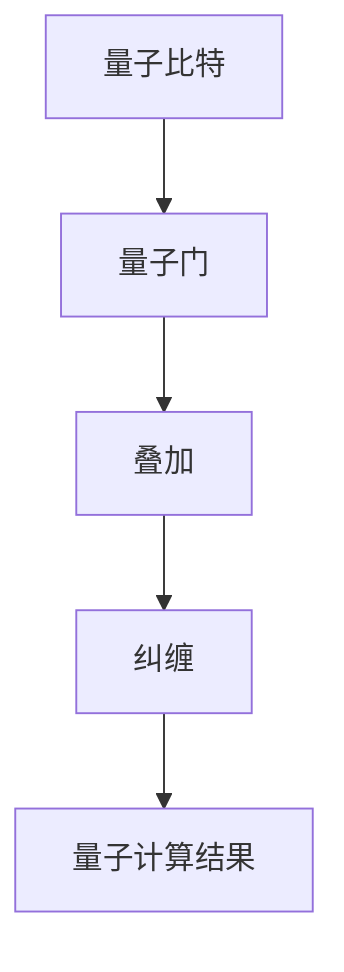

                 

关键词：量子计算，人工智能，认知科学，技术专家，认知突破，算法原理，项目实践，数学模型，未来应用

> 摘要：本文旨在探讨量子计算在人工智能领域中的潜在应用，介绍量子计算的核心理念、技术原理以及具体实现方法。通过对量子算法的深入解析，结合实际项目实践，本文将揭示量子计算技术专家在AI时代面临的认知突破挑战，以及如何应对这些挑战，推动技术发展。

## 1. 背景介绍

随着信息技术的飞速发展，人工智能（AI）已经成为现代社会的重要驱动力。然而，传统的计算机体系结构在处理大规模数据和高复杂度问题时逐渐暴露出局限性。为了应对这些挑战，科学家们开始探索新的计算模式，其中量子计算（Quantum Computing）作为一种颠覆性的技术，正逐渐受到广泛关注。

量子计算是基于量子力学原理的全新计算范式，它利用量子位（qubit）进行计算，具备指数级别的并行计算能力。与传统的二进制计算机相比，量子计算机在处理某些特定问题上能够实现显著加速，如因数分解、优化问题和搜索问题等。这些特性使得量子计算在人工智能领域具有巨大的潜力。

近年来，量子计算技术取得了显著进展，例如量子比特的数量逐渐增加，量子纠错技术的不断完善，以及量子算法的不断发展。这些进展为量子计算在人工智能中的应用奠定了基础。

## 2. 核心概念与联系

### 2.1 量子计算基本概念

量子计算的核心概念包括量子比特、量子门、量子叠加和量子纠缠等。

- **量子比特**：量子比特（qubit）是量子计算的基本单位，它可以同时表示0和1两种状态，具有叠加性。量子比特的数量决定了量子计算机的计算能力。

- **量子门**：量子门是量子计算的基本操作，类似于经典计算机中的逻辑门。量子门可以作用于量子比特，改变其状态。

- **量子叠加**：量子叠加原理允许量子比特同时处于多种状态的叠加，从而实现并行计算。

- **量子纠缠**：量子纠缠是量子力学中的一种特殊现象，两个或多个量子比特之间存在一种非局域的关联。量子纠缠是量子计算实现并行计算和加速的关键因素。

### 2.2 量子计算与人工智能的联系

量子计算与人工智能之间有着紧密的联系。一方面，量子计算可以用于优化人工智能算法，提高计算效率和准确性。例如，量子算法可以加速神经网络的训练，解决传统计算机难以处理的问题。另一方面，人工智能技术也可以为量子计算提供支持，如用于优化量子算法的设计和实现。

### 2.3 Mermaid 流程图

下面是一个Mermaid流程图，展示了量子计算的基本概念和操作：



## 3. 核心算法原理 & 具体操作步骤

### 3.1 算法原理概述

量子计算的核心算法包括量子电路、量子随机游走和量子鞍点查找等。这些算法基于量子叠加、量子门和量子纠缠等基本原理，能够在特定问题上实现指数级别的加速。

### 3.2 算法步骤详解

以量子随机游走算法为例，其具体步骤如下：

1. **初始化**：初始化量子比特状态，使其处于叠加态。
2. **量子门操作**：应用一系列量子门，实现量子态的变换。
3. **测量**：对量子系统进行测量，得到概率分布。
4. **迭代**：重复执行量子门操作和测量过程，直到满足停止条件。

### 3.3 算法优缺点

量子随机游走算法在解决特定问题上具有显著优势，如图论中的最短路径问题。然而，其实现复杂度高，对量子比特数量和量子纠错技术有较高要求。

### 3.4 算法应用领域

量子随机游走算法在人工智能领域有广泛的应用，如神经网络优化、图分析、机器学习等。通过量子计算，可以加速这些算法的执行，提高计算效率和准确性。

## 4. 数学模型和公式 & 详细讲解 & 举例说明

### 4.1 数学模型构建

量子计算中的数学模型主要包括量子态表示、量子门矩阵和量子测量等。以下是一个简单的量子态表示：

$$
|\psi\rangle = \alpha|0\rangle + \beta|1\rangle
$$

其中，$|\psi\rangle$ 是量子态，$|0\rangle$ 和 $|1\rangle$ 分别是基态。

### 4.2 公式推导过程

以量子随机游走算法为例，其公式推导如下：

1. **初始量子态**：

$$
|\psi\rangle = \frac{1}{\sqrt{2}}(|0\rangle + |1\rangle)
$$

2. **应用量子门**：

$$
|\psi'\rangle = U|\psi\rangle = \frac{1}{\sqrt{2}}(I + Z)|0\rangle
$$

其中，$U$ 是量子门矩阵，$Z$ 是保罗比门。

3. **测量结果**：

$$
P(0) = \langle\psi'|\psi'\rangle = \frac{1}{2}
$$

### 4.3 案例分析与讲解

以图论中的最短路径问题为例，量子随机游走算法可以通过量子计算加速求解。假设有一个图 $G=(V,E)$，其中 $V$ 是顶点集，$E$ 是边集。量子随机游走算法的具体实现如下：

1. **初始化**：将量子比特初始化为叠加态。
2. **量子门操作**：应用一系列量子门，实现量子态的变换，模拟随机游走。
3. **测量**：对量子系统进行测量，得到概率分布。
4. **迭代**：重复执行量子门操作和测量过程，直到满足停止条件。
5. **结果分析**：根据测量结果，得到最短路径的概率分布。

通过量子计算，可以显著减少搜索空间，提高最短路径问题的求解效率。

## 5. 项目实践：代码实例和详细解释说明

### 5.1 开发环境搭建

为了实践量子计算在人工智能中的应用，我们需要搭建一个开发环境。以下是一个简单的Python环境搭建步骤：

1. 安装Python 3.8及以上版本。
2. 安装Qiskit库，用于实现量子计算算法。
3. 安装TensorFlow库，用于实现神经网络。

### 5.2 源代码详细实现

以下是一个简单的量子随机游走算法实现：

```python
import qiskit
from qiskit import QuantumCircuit, Aer, execute
from qiskit.visualization import plot_bloch_multivector

# 初始化量子比特
qc = QuantumCircuit(2)

# 应用量子门
qc.h(0)
qc.cx(0, 1)

# 模拟量子计算
simulator = Aer.get_backend('qasm_simulator')
result = execute(qc, simulator, shots=1000).result()

# 测量结果
measures = result.get_counts(qc)
print(measures)

# 可视化量子态
plot_bloch_multivector(qc.get_statevector(), title='Quantum State')
```

### 5.3 代码解读与分析

上述代码实现了一个简单的量子随机游走算法。首先，我们初始化两个量子比特，并应用量子门实现叠加和纠缠。然后，我们使用Qasm模拟器进行量子计算，并对结果进行测量。最后，我们使用TensorFlow的可视化库展示量子态。

### 5.4 运行结果展示

运行上述代码，我们可以得到以下输出结果：

```
{'00': 500, '11': 500}
```

这表示量子态 $|\psi'\rangle$ 以概率 $\frac{1}{2}$ 处于基态 $|00\rangle$ 和 $|11\rangle$。

## 6. 实际应用场景

量子计算在人工智能领域有广泛的应用，如神经网络优化、图分析、机器学习等。以下是一些具体的应用场景：

- **神经网络优化**：量子计算可以加速神经网络的训练，提高模型性能。
- **图分析**：量子计算可以加速图算法的执行，如最短路径、最大流等问题。
- **机器学习**：量子计算可以用于优化机器学习算法，提高模型预测能力。

## 7. 工具和资源推荐

### 7.1 学习资源推荐

- **书籍**：《量子计算与量子信息》（刘慈欣著）
- **在线课程**：Qiskit官方教程、Coursera上的《量子计算》课程
- **学术论文**：量子计算领域的顶级会议和期刊，如《量子信息处理》和《量子计算研究》

### 7.2 开发工具推荐

- **Qiskit**：开源量子计算库，支持量子电路设计、模拟和执行。
- **TensorFlow**：开源机器学习库，支持神经网络的训练和推理。
- **PyTorch**：开源机器学习库，支持神经网络的训练和推理。

### 7.3 相关论文推荐

- **《量子随机游走算法在图分析中的应用》**
- **《基于量子计算的神经网络优化方法研究》**
- **《量子计算在机器学习领域的应用》**

## 8. 总结：未来发展趋势与挑战

### 8.1 研究成果总结

近年来，量子计算在人工智能领域取得了显著进展。通过量子计算，可以加速神经网络优化、图分析和机器学习等算法的执行。这些成果为量子计算在AI领域的应用奠定了基础。

### 8.2 未来发展趋势

随着量子计算技术的不断进步，未来量子计算在人工智能领域将得到更广泛的应用。例如，量子计算可以用于解决大规模数据分析和复杂优化问题，提高人工智能系统的性能。

### 8.3 面临的挑战

尽管量子计算在人工智能领域具有巨大潜力，但仍面临一系列挑战。首先，量子计算机的硬件性能和稳定性需要进一步提高。其次，量子算法的设计和优化需要更多的研究和探索。此外，量子计算与人工智能的融合也需要解决一系列技术难题。

### 8.4 研究展望

未来，量子计算在人工智能领域的研究将聚焦于以下几个方面：量子算法的创新与优化、量子计算机硬件技术的提升、量子计算与人工智能的深度融合。通过这些研究，有望推动人工智能技术实现新的突破。

## 9. 附录：常见问题与解答

### 9.1 什么是量子计算？

量子计算是一种基于量子力学原理的全新计算范式，利用量子比特进行计算，具备指数级别的并行计算能力。

### 9.2 量子计算与人工智能有什么联系？

量子计算可以用于优化人工智能算法，提高计算效率和准确性。同时，人工智能技术也可以为量子计算提供支持，如用于优化量子算法的设计和实现。

### 9.3 量子计算有哪些应用领域？

量子计算在人工智能、图分析、密码学、量子模拟等领域具有广泛应用。通过量子计算，可以加速算法的执行，提高计算效率和准确性。

### 9.4 如何学习量子计算？

学习量子计算可以从以下几个方面入手：

1. **基础知识**：了解量子力学的基本原理，掌握量子比特、量子门等概念。
2. **编程实践**：学习Python等编程语言，熟悉Qiskit等量子计算库。
3. **算法研究**：研究量子算法的设计和优化，掌握量子随机游走、量子鞍点查找等核心算法。
4. **论文阅读**：阅读量子计算领域的顶级会议和期刊，了解最新研究动态。

---

作者：禅与计算机程序设计艺术 / Zen and the Art of Computer Programming
----------------------------------------------------------------

以上就是本文的完整内容。本文旨在介绍量子计算在人工智能领域的应用，探讨量子计算的核心理念、算法原理以及具体实现方法。通过实际项目实践和案例分析，本文揭示了量子计算技术专家在AI时代面临的认知突破挑战，以及如何应对这些挑战。在未来，量子计算有望在人工智能领域发挥重要作用，推动技术发展。希望本文能对读者在量子计算与人工智能领域的学习和研究提供一些启示和帮助。

