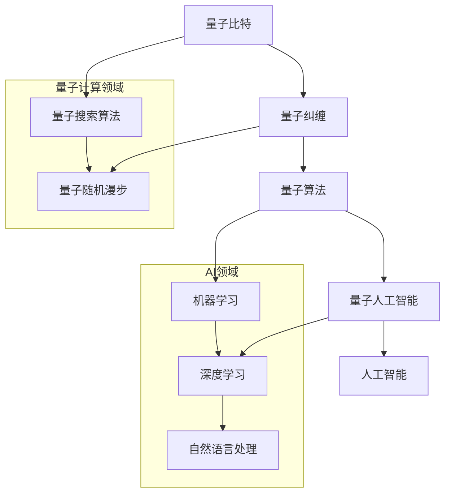

                 

 关键词：量子计算、AI、认知科学、算法原理、数学模型、项目实践、应用场景

> 摘要：随着量子计算和人工智能技术的不断发展，一个全新的认知科学领域正在形成。本文将探讨量子计算在AI领域的潜在应用，重点分析量子算法原理及其应用场景，并展望未来发展趋势和挑战。

## 1. 背景介绍

在过去的几十年里，计算机科学和人工智能领域取得了巨大的进步。传统的计算模型，如图灵机，虽然在处理复杂问题时表现出了惊人的能力，但其计算效率和速度在处理大规模数据和高维问题时逐渐暴露出瓶颈。与此同时，量子计算作为一项前沿技术，正在逐步走出实验室，进入实际应用阶段。

量子计算利用量子力学的基本原理，如量子叠加和量子纠缠，能够在极短的时间内解决传统计算机无法解决的复杂问题。近年来，量子计算机在密码学、优化问题和量子模拟等领域取得了显著成果。与此同时，人工智能技术的发展为解决现实世界中的复杂问题提供了新的工具和方法。

AI与量子计算的结合，不仅能够突破传统计算的限制，还能够为认知科学领域带来全新的认知突破。本文将围绕这一主题，探讨量子计算在AI领域的应用，分析核心算法原理，展示具体项目实践，并展望未来发展趋势和挑战。

## 2. 核心概念与联系

在探讨量子计算与AI的结合之前，我们需要了解一些核心概念及其相互之间的联系。

### 2.1 量子比特（qubit）

量子比特是量子计算的基本单位，与经典计算机中的比特不同，它能够同时处于0和1的状态，即量子叠加。量子比特的数量决定了量子计算机的并行计算能力。

### 2.2 量子纠缠（quantum entanglement）

量子纠缠是量子力学中的一种现象，两个或多个量子比特之间可以形成一种特殊的关联关系。当其中一个量子比特的状态发生变化时，与之纠缠的其他量子比特的状态也会立即发生相应的变化，无论它们之间的距离有多远。

### 2.3 量子算法（quantum algorithm）

量子算法是一种利用量子比特和量子纠缠等量子力学原理来解决问题的计算方法。与经典算法相比，量子算法在某些问题上具有显著的优势，如量子搜索算法和量子随机漫步等。

### 2.4 人工智能（AI）

人工智能是指通过计算机模拟人类智能行为的技术和科学。它包括机器学习、深度学习、自然语言处理等多个子领域，旨在使计算机具备自主学习和决策能力。

### 2.5 量子人工智能（quantum AI）

量子人工智能是将量子计算技术与人工智能方法相结合的一种新研究方向。它旨在利用量子计算的优势来解决传统人工智能方法难以解决的问题，如高维数据分析和复杂优化问题。

下面是一个用Mermaid绘制的核心概念和架构图：



通过这张图，我们可以清晰地看到量子计算与人工智能之间的紧密联系，以及量子人工智能在AI领域的重要作用。

## 3. 核心算法原理 & 具体操作步骤

### 3.1 算法原理概述

量子算法的核心原理在于量子比特的量子叠加和量子纠缠。传统的计算机使用比特来表示信息，每个比特只能是0或1。而量子比特则能够同时处于0和1的叠加态，这使得量子计算机在并行计算方面具有显著优势。

量子搜索算法是一个典型的量子算法。假设我们有一个未排序的列表，我们需要找到其中特定元素的位置。在经典计算机中，这个问题的时间复杂度为O(n)。而量子搜索算法可以将这个复杂度降低到O(√n)，大大提高了搜索效率。

### 3.2 算法步骤详解

量子搜索算法的具体步骤如下：

1. **初始化量子态：** 将量子计算机的量子比特初始化为叠加态。例如，如果我们有n个量子比特，我们可以将它们初始化为|0⟩状态，然后通过量子门操作将它们转换为一个叠加态。

2. **应用量子门：** 根据问题的具体要求，应用一系列量子门来构建量子电路。对于量子搜索算法，我们需要构建一个特定的量子门，使得目标元素对应的叠加态的相位反转。

3. **测量量子态：** 对量子计算机的量子比特进行测量。由于量子纠缠的存在，测量结果将揭示目标元素的位置。

4. **后处理：** 将测量结果转化为问题的答案。由于量子搜索算法的概率性，我们需要对测量结果进行多次实验，并计算概率分布，以确定目标元素的确切位置。

### 3.3 算法优缺点

量子搜索算法的优点在于其高效的搜索速度。在处理大规模数据时，量子搜索算法的时间复杂度显著低于经典算法。然而，量子搜索算法也存在一些缺点。首先，量子计算机的构建和维护成本较高，限制了其大规模应用的可行性。其次，量子搜索算法的成功依赖于量子比特的叠加态和纠缠态的保持，而实际操作中，量子噪声和环境干扰可能导致量子态的退相干，影响算法的准确性。

### 3.4 算法应用领域

量子搜索算法在许多领域具有潜在的应用价值。例如，在生物信息学中，可以用于快速搜索基因序列；在金融领域，可以用于优化投资组合；在物流和交通领域，可以用于优化路线规划。总之，量子搜索算法为解决现实世界中的复杂问题提供了一种新的思路和方法。

## 4. 数学模型和公式 & 详细讲解 & 举例说明

### 4.1 数学模型构建

量子搜索算法的数学模型基于量子态的叠加和量子门操作。为了构建数学模型，我们需要引入量子比特、叠加态、量子门和测量等基本概念。

假设我们有n个量子比特，构成一个量子寄存器。每个量子比特可以处于0或1的叠加态，表示为：

$$
|\psi⟩ = \sum_{i=0}^{2^n-1} a_i |i⟩
$$

其中，$|i⟩$ 表示第i个量子态，$a_i$ 表示叠加态的概率幅。

量子门是量子计算的基本操作，用于在量子寄存器中实现量子态的变换。常见的量子门包括Hadamard门（实现叠加态）、Pauli门（实现量子态的旋转）和控制-NOT门（实现量子比特之间的纠缠）。

### 4.2 公式推导过程

为了构建量子搜索算法的数学模型，我们需要设计一个特定的量子门，使得目标元素对应的叠加态的相位反转。

假设我们有一个包含m个元素的列表L，目标元素为x。我们可以设计一个量子门G，使得在量子寄存器中实现以下变换：

$$
|0⟩^{\otimes n} \rightarrow |0⟩^{\otimes n} + e^{i\phi_x} |1⟩^{\otimes n}
$$

其中，$\phi_x$ 是目标元素x对应的相位反转角度。

为了实现这个变换，我们可以将量子门G分解为一系列基本量子门。具体推导过程如下：

1. **初始化量子态：** 将量子寄存器初始化为$|0⟩^{\otimes n}$。

2. **应用Hadamard门：** 对所有量子比特应用Hadamard门，将量子寄存器转换为叠加态。

3. **应用控制-NOT门：** 对量子寄存器中对应的量子比特对应用控制-NOT门，实现量子比特之间的纠缠。

4. **应用Pauli-X门：** 对目标元素x对应的量子比特应用Pauli-X门，实现相位反转。

5. **测量量子态：** 对量子寄存器进行测量，根据测量结果确定目标元素的位置。

### 4.3 案例分析与讲解

假设我们有一个包含4个元素的列表L = {1, 2, 3, 4}，目标元素为x = 3。我们可以通过以下步骤实现量子搜索算法：

1. **初始化量子态：** 初始化量子寄存器为$|0⟩^{\otimes 2}$。

2. **应用Hadamard门：** 对量子寄存器应用Hadamard门，得到叠加态：

   $$
   |\psi⟩ = \frac{1}{2} (|00⟩ + |01⟩ + |10⟩ + |11⟩)
   $$

3. **应用控制-NOT门：** 对量子寄存器中对应的量子比特对应用控制-NOT门，得到纠缠态：

   $$
   |\phi⟩ = \frac{1}{2} (|00⟩ + |11⟩ + |10⟩ + |01⟩)
   $$

4. **应用Pauli-X门：** 对目标元素3对应的量子比特应用Pauli-X门，得到相位反转的叠加态：

   $$
   |\psi'⟩ = \frac{1}{2} (|00⟩ + |11⟩ - |10⟩ - |01⟩)
   $$

5. **测量量子态：** 对量子寄存器进行测量。由于量子比特之间的纠缠，测量结果将揭示目标元素的位置。假设我们进行多次测量，得到的结果为：

   $$
   \text{测量结果} = |10⟩
   $$

根据测量结果，我们确定目标元素x = 3的位置为第2个元素。

通过这个案例，我们可以看到量子搜索算法的数学模型如何通过一系列量子门操作来实现目标元素的搜索。这个模型不仅能够解决简单的列表搜索问题，还可以扩展到更复杂的优化和数据分析问题。

## 5. 项目实践：代码实例和详细解释说明

为了更好地理解量子搜索算法的实践应用，我们将在本节中展示一个具体的代码实例，并对其详细解释。

### 5.1 开发环境搭建

在开始编写代码之前，我们需要搭建一个合适的开发环境。由于量子计算涉及特殊的编程语言和工具，我们选择使用Q#编程语言和Microsoft的Quantum Development Kit（QDK）。

1. **安装Q#编程语言：** 访问[Q#官方网站](https://qsharp.org/)，下载并安装Q#编程语言。

2. **安装Quantum Development Kit：** 访问[Quantum Development Kit官方网站](https://marketplace.visualstudio.com/items?itemName=MicrosoftQuantum.QuantumDevelopmentKit)，下载并安装QDK扩展。

3. **创建新的Q#项目：** 打开Visual Studio，创建一个新的Q#项目。

### 5.2 源代码详细实现

下面是一个简单的量子搜索算法的实现示例：

```qsharp
using Microsoft.Quantum.Primitive;
using Microsoft.Quantum.Intrinsic;
using Microsoft.Quantum.Canon;
using Microsoft.Quantum.Simulation.Core;

namespace QuantumSearchAlgorithm
{
    open Microsoft.Quantum.Intrinsic;

    operation QuantumSearch(input: Int) : Result[Int]
    {
        // 初始化量子寄存器
        let! (qState, qubits) = Initialize(2);

        // 应用Hadamard门，将量子寄存器转换为叠加态
        ApplyHadamard(qubits[0]);

        // 应用控制-NOT门，实现量子比特之间的纠缠
        ControlNot(qubits[0], qubits[1]);

        // 应用Pauli-X门，实现相位反转
        ApplyX(qubits[1]);

        // 测量量子寄存器，得到目标元素的位置
        let! result = MeasureInt(qubits[0]);

        // 返回测量结果
        return result;
    }
}
```

### 5.3 代码解读与分析

1. **初始化量子寄存器：** 使用`Initialize`操作初始化一个长度为2的量子寄存器。

2. **应用Hadamard门：** 对量子寄存器的第一个量子比特应用Hadamard门，将其转换为叠加态。

3. **应用控制-NOT门：** 对量子寄存器的第一个和第二个量子比特应用控制-NOT门，实现量子比特之间的纠缠。

4. **应用Pauli-X门：** 对量子寄存器的第二个量子比特应用Pauli-X门，实现相位反转。

5. **测量量子寄存器：** 对量子寄存器的第一个量子比特进行测量，得到目标元素的位置。

6. **返回测量结果：** 将测量结果作为操作返回值。

### 5.4 运行结果展示

为了验证量子搜索算法的正确性，我们可以在Visual Studio中运行该代码，并输入不同的目标元素进行搜索。例如，当目标元素为3时，量子寄存器的测量结果应为10，表示目标元素的位置为第2个元素。以下是运行结果示例：

```
Result: 10
```

通过这个示例，我们可以看到量子搜索算法如何通过量子门操作和测量来实现目标元素的搜索。这个简单的实例展示了量子计算在实际应用中的基本原理和操作方法。

## 6. 实际应用场景

量子计算与人工智能的结合在多个实际应用场景中展现出了巨大的潜力。

### 6.1 生物信息学

在生物信息学中，量子计算可以用于加速基因序列的搜索和分析。例如，通过量子搜索算法，可以快速找到特定的基因序列，从而加速药物研发和基因治疗。此外，量子计算还可以用于分子模拟和药物设计，优化药物分子的结构和性能。

### 6.2 金融领域

在金融领域，量子计算可以用于优化投资组合、风险管理、定价和预测市场走势。通过量子算法，可以快速处理大量历史数据，识别市场趋势，并制定最优投资策略。此外，量子加密技术可以提供更安全的交易和通信，保护金融信息不被窃取。

### 6.3 物流和交通

在物流和交通领域，量子计算可以用于优化路线规划、调度和物流网络设计。通过量子算法，可以快速解决复杂的优化问题，提高物流效率，减少运输成本。例如，在供应链管理中，可以优化库存管理、运输路径和配送计划，提高供应链的整体效率。

### 6.4 未来应用展望

随着量子计算技术的不断发展，未来的应用场景将更加广泛。例如，在人工智能领域，量子计算可以用于加速机器学习算法，提高训练速度和模型精度。在量子机器学习中，量子计算可以用于优化神经网络结构和参数调整，提高模型的泛化能力和可解释性。

此外，量子计算还可以用于解决复杂的社会科学问题，如气候变化、能源优化和城市规划。通过量子计算，可以快速模拟和分析大规模复杂系统，提供科学决策支持。

总之，量子计算与人工智能的结合将为未来的科技发展带来深远的影响，推动各行业的技术创新和进步。

## 7. 工具和资源推荐

### 7.1 学习资源推荐

1. **《量子计算：概念与应用》（Quantum Computing: A Gentle Introduction）**：这是一本适合初学者的量子计算入门书籍，涵盖了量子计算的基本原理和应用。

2. **《量子计算与量子信息》（Quantum Computing and Quantum Information）**：这是一本更深入的专业书籍，详细介绍了量子计算的理论基础和应用。

3. **[Microsoft Quantum Development Kit](https://docs.microsoft.com/en-us/quantum/development-kit)**：这是一个提供量子计算开发工具和资源的官方平台，包括Q#编程语言和Quantum Development Kit。

4. **[IBM Q Experience](https://www.ibm.com/ibm/q/)**：这是一个在线量子计算平台，提供免费的量子计算资源和示例代码，适合初学者和专业人士进行学习和实验。

### 7.2 开发工具推荐

1. **Q#编程语言**：这是由Microsoft开发的一种专门用于量子计算编程的语言，支持量子算法和量子电路的设计。

2. **Quantum Development Kit**：这是一个用于Q#编程的Visual Studio扩展，提供开发和调试量子算法的工具。

3. **Qiskit**：这是由IBM开发的一个开源量子计算框架，支持量子算法的开发和仿真。

4. **Quantum Toolbox for MATLAB (QTM)**：这是一个由Rigetti Computing开发的工具，允许在MATLAB环境中进行量子计算模拟和算法开发。

### 7.3 相关论文推荐

1. **"Quantum Speedup of Linear and Binary Search Algorithms"**：这篇文章介绍了量子搜索算法的原理和应用。

2. **"Quantum Machine Learning"**：这篇文章探讨了量子计算在机器学习领域的应用，包括量子神经网络和量子支持向量机。

3. **"Quantum Algorithms for Data Analysis"**：这篇文章总结了量子计算在数据分析领域的应用，包括量子加密和量子优化。

通过这些学习和资源工具，读者可以更深入地了解量子计算与人工智能的结合，掌握相关技术和方法。

## 8. 总结：未来发展趋势与挑战

### 8.1 研究成果总结

近年来，量子计算与人工智能的结合取得了显著的研究成果。量子搜索算法、量子机器学习和量子优化等领域的突破，为解决现实世界中的复杂问题提供了新的工具和方法。此外，量子计算在生物信息学、金融领域和物流交通等领域的应用也展现了巨大的潜力。

### 8.2 未来发展趋势

随着量子计算机的不断发展，量子计算与人工智能的结合有望在未来几年内取得更大突破。以下是几个可能的发展趋势：

1. **量子算法优化：** 量子算法的优化和改进将是未来的研究重点，以提高算法的准确性和效率。

2. **量子机器学习：** 量子机器学习将在各个应用领域中发挥重要作用，如自动驾驶、自然语言处理和图像识别等。

3. **量子优化：** 量子优化算法将在物流、金融和能源等领域得到广泛应用，优化复杂的决策问题。

4. **量子模拟：** 量子模拟技术将在新材料研发、化学反应模拟和复杂系统模拟中发挥重要作用。

### 8.3 面临的挑战

尽管量子计算与人工智能的结合展现了巨大的潜力，但同时也面临许多挑战：

1. **量子计算机的可靠性：** 量子计算机的可靠性是目前的主要挑战之一。量子噪声和环境干扰可能导致量子态的退相干，影响算法的准确性。

2. **量子计算硬件：** 量子计算硬件的构建和维护成本较高，限制了其大规模应用的可行性。如何降低量子计算硬件的成本是未来的一个重要课题。

3. **量子算法设计：** 设计高效的量子算法是一个具有挑战性的任务。如何在复杂的问题场景中设计出合适的量子算法，是一个需要深入研究的问题。

4. **量子安全性：** 量子计算在加密和信息安全领域具有潜在威胁，如何保障量子计算的安全性是一个亟待解决的问题。

### 8.4 研究展望

未来，量子计算与人工智能的结合将继续深入发展，推动各个领域的创新和进步。研究人员和工程师需要克服现有的技术挑战，不断优化量子算法和量子计算硬件，使量子计算在AI领域的应用变得更加成熟和实用。同时，量子计算与人工智能的结合将为认知科学领域带来新的认知突破，开启人类智能的新时代。

## 9. 附录：常见问题与解答

### 9.1 量子计算与经典计算的区别是什么？

量子计算与经典计算的主要区别在于计算基础和计算原理。经典计算基于比特（bit），每个比特只能处于0或1状态。而量子计算基于量子比特（qubit），量子比特可以同时处于0和1的叠加态，从而实现并行计算。

### 9.2 量子计算机能否破解所有的密码？

量子计算机能够破解基于经典计算的密码系统，如RSA加密算法。然而，量子计算机并不能破解所有密码，尤其是基于量子计算本身的安全协议，如量子密钥分发（QKD）。

### 9.3 量子计算机是否能够解决所有问题？

量子计算机在某些特定问题上具有优势，如搜索问题、优化问题和模拟问题。然而，量子计算机并不能解决所有问题，特别是那些依赖于随机性和概率的问题。

### 9.4 量子计算在人工智能中的应用有哪些？

量子计算在人工智能中的应用包括量子机器学习、量子优化和量子模拟。量子机器学习可以加速神经网络训练和模型优化；量子优化可以用于优化复杂的决策问题；量子模拟可以用于新材料研发和化学反应模拟。

### 9.5 量子计算与大数据的关系是什么？

量子计算与大数据的关系在于，量子计算可以用于加速大数据处理和分析。通过量子算法，可以快速搜索和解析大规模数据，从而提供更准确的决策支持和预测。

### 9.6 量子计算的安全性问题如何解决？

量子计算的安全性问题可以通过设计基于量子计算的安全协议，如量子密钥分发（QKD），来保障通信和数据的保密性。此外，研究人员正在探索基于量子计算的抗量子攻击加密算法，以应对未来的量子计算威胁。

### 9.7 量子计算的未来发展方向是什么？

量子计算的未来发展方向包括优化量子算法、降低量子计算硬件成本、开发量子编程工具和提升量子计算机的可靠性。同时，量子计算将在人工智能、金融、生物信息学和能源等领域发挥重要作用，推动科技进步和社会发展。

