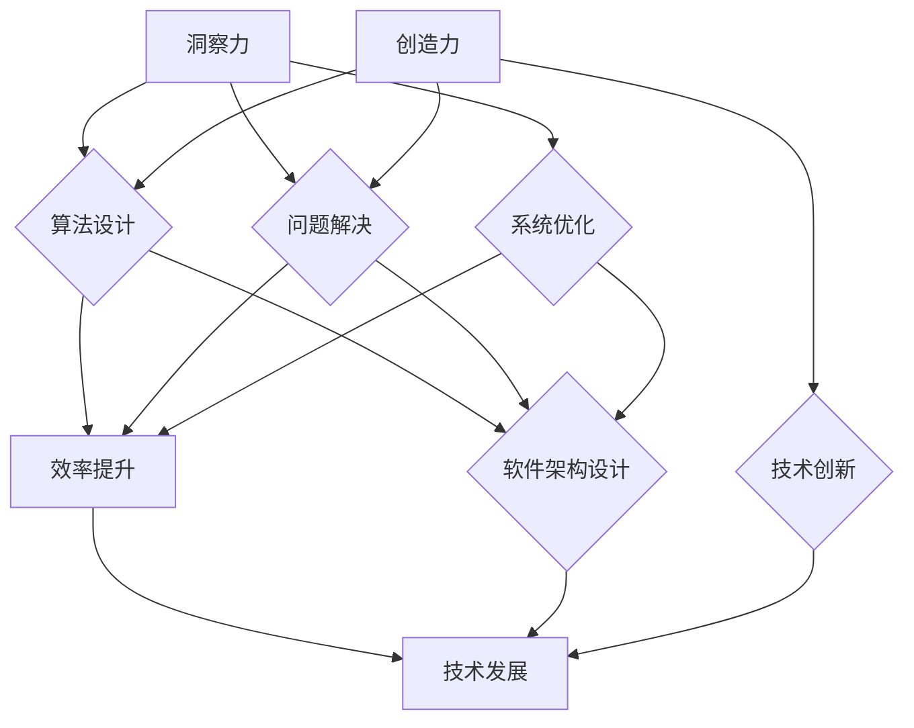

                 

 **关键词：** 人类思维，洞察力，创造力，计算机科学，算法，技术发展。

> **摘要：** 本文探讨了人类思维中的洞察力和创造力这两个核心能力，以及它们在计算机科学和技术发展中的重要性。通过分析这些能力的本质、相互作用及其在计算机领域的具体应用，本文旨在为读者提供对这一领域的深入理解。

## 1. 背景介绍

在计算机科学和技术发展的漫长历程中，人类思维始终扮演着至关重要的角色。从早期的编程语言设计到现代的人工智能系统，人类的洞察力和创造力不断推动着技术的进步。然而，这两个能力的本质及其在技术领域中的具体应用，却往往被忽视。

### 1.1 洞察力

洞察力是指人们理解复杂问题、发现潜在规律和关系的能力。它依赖于丰富的经验和深刻的思考，是解决复杂问题的关键因素。在计算机科学中，洞察力体现在算法设计、问题解决和系统优化等多个方面。

### 1.2 创造力

创造力则是指人们产生新颖、独特和有价值的思想和解决方案的能力。它是一种创新的思维模式，能够在技术和科学领域引发革命性的变革。在计算机科学中，创造力体现在新的算法发明、软件架构设计和技术创新等方面。

### 1.3 双子星关系

洞察力和创造力在人类思维中紧密相连，它们如同双子座般相互依存、相互作用。洞察力为创造力提供了坚实的基础，而创造力则为洞察力带来了新的方向和可能性。这种相互关系在计算机科学中尤为重要，因为技术的进步往往需要这两种能力的共同作用。

## 2. 核心概念与联系

为了更好地理解洞察力和创造力在计算机科学中的具体应用，我们需要构建一个核心概念与联系的模型。以下是这个模型的 Mermaid 流程图表示：



在这个模型中，洞察力和创造力分别与算法设计、问题解决、系统优化、技术创新和软件架构设计等多个方面相联系。这些方面共同构成了计算机科学和技术发展的核心。

### 2.1 算法设计

算法设计是计算机科学中最重要的领域之一。一个优秀的算法不仅需要高效的计算性能，还需要深刻的洞察力来发现问题的本质。创造力则在这个过程中发挥着关键作用，帮助设计出更加创新和高效的算法。

### 2.2 问题解决

问题解决是计算机科学中的另一个核心领域。通过洞察力，人们能够理解复杂问题的结构和内在关系，从而找到有效的解决方案。而创造力则在这个过程中提供了新的思路和方法，使得问题解决更加多样化和高效。

### 2.3 系统优化

系统优化是计算机科学中一个持续不断的过程。通过洞察力，人们能够发现系统中的瓶颈和潜在问题，从而进行优化。而创造力则在这个过程中提供了新的优化方法和策略，使得系统性能得到进一步提升。

### 2.4 技术创新

技术创新是推动计算机科学和技术发展的重要动力。洞察力帮助人们发现新的技术和应用领域，而创造力则在这个过程中提供了新的思路和方法，使得技术发展更加迅速和多样化。

### 2.5 软件架构设计

软件架构设计是计算机科学中一个复杂而重要的领域。通过洞察力，人们能够理解系统的结构和功能，从而设计出更加合理和高效的软件架构。而创造力则在这个过程中提供了新的架构模式和设计理念，使得软件架构更加灵活和适应性强。

## 3. 核心算法原理 & 具体操作步骤

### 3.1 算法原理概述

在计算机科学中，核心算法原理是理解和应用算法的基础。以下是一些核心算法原理及其基本概念：

- **排序算法**：用于对数据进行排序的一系列算法，如快速排序、归并排序等。
- **搜索算法**：用于在数据结构中查找特定元素的一系列算法，如二分搜索、深度优先搜索等。
- **动态规划**：一种用于解决最优化问题的算法思想，通过将复杂问题分解为更小的子问题来降低计算复杂度。
- **图算法**：用于处理图结构的数据的算法，如最短路径算法、最小生成树算法等。

### 3.2 算法步骤详解

以下是每个核心算法原理的具体操作步骤：

#### 3.2.1 排序算法

1. **快速排序**：
   - 选择一个基准元素。
   - 将数组分为两部分，小于基准元素的部分和大于基准元素的部分。
   - 递归地对两部分进行快速排序。

2. **归并排序**：
   - 将数组分成两个子数组。
   - 对两个子数组分别进行排序。
   - 合并已排序的子数组。

#### 3.2.2 搜索算法

1. **二分搜索**：
   - 确定搜索区间。
   - 比较中间元素和目标值。
   - 根据比较结果缩小搜索区间。

2. **深度优先搜索**：
   - 选择一个节点进行遍历。
   - 访问所有未访问的邻居节点。
   - 递归地对邻居节点进行深度优先搜索。

#### 3.2.3 动态规划

1. **最长公共子序列**：
   - 初始化一个二维数组。
   - 根据状态转移方程更新数组元素。
   - 返回数组的最后一个元素。

2. **背包问题**：
   - 初始化一个二维数组。
   - 根据状态转移方程更新数组元素。
   - 选择最优解。

#### 3.2.4 图算法

1. **最短路径算法**：
   - 使用 Dijkstra 算法或 Bellman-Ford 算法。
   - 更新节点到其他节点的距离。
   - 返回最短路径。

2. **最小生成树算法**：
   - 使用 Prim 算法或 Kruskal 算法。
   - 添加最小权重边。
   - 返回最小生成树。

### 3.3 算法优缺点

每种算法都有其优缺点。以下是几种核心算法的优缺点：

- **快速排序**：时间复杂度低，但可能产生大量递归调用。
- **归并排序**：时间复杂度稳定，但需要额外的内存空间。
- **二分搜索**：时间复杂度低，但需要有序的数据结构。
- **深度优先搜索**：适用于路径问题，但可能产生大量递归调用。
- **动态规划**：适用于最优化问题，但需要理解状态转移方程。
- **最短路径算法**：适用于图结构，但可能需要复杂的实现。
- **最小生成树算法**：适用于构建最小生成树，但可能需要复杂的实现。

### 3.4 算法应用领域

这些算法广泛应用于各种领域，如：

- **排序和搜索**：数据库管理、文本搜索、搜索引擎等。
- **动态规划**：资源分配、路径规划、最优化问题等。
- **图算法**：社交网络分析、网络路由、地图生成等。

## 4. 数学模型和公式 & 详细讲解 & 举例说明

在计算机科学中，数学模型和公式是理解和解决问题的关键。以下是一些常用的数学模型和公式，以及它们的详细讲解和举例说明：

### 4.1 数学模型构建

#### 4.1.1 动态规划模型

动态规划是一种用于求解最优化问题的算法思想。它将复杂问题分解为更小的子问题，并利用状态转移方程来求解。以下是一个简单的动态规划模型：

- **状态定义**：设 $dp[i][j]$ 表示子问题 $i$ 和 $j$ 的最优解。
- **状态转移方程**：$dp[i][j] = max(dp[i-1][j], dp[i][j-1]) + c[i][j]$。

#### 4.1.2 图算法模型

图算法是用于处理图结构的数据的算法。以下是一个简单的图算法模型：

- **状态定义**：设 $dist[i]$ 表示节点 $i$ 到其他节点的最短距离。
- **状态转移方程**：$dist[i] = min(dist[j] + weight[i][j])$。

### 4.2 公式推导过程

#### 4.2.1 动态规划公式

动态规划公式通常由状态定义和状态转移方程组成。以下是一个简单的例子：

- **状态定义**：设 $dp[i][j]$ 表示子问题 $i$ 和 $j$ 的最优解。
- **状态转移方程**：$dp[i][j] = max(dp[i-1][j], dp[i][j-1]) + c[i][j]$。

#### 4.2.2 图算法公式

图算法公式通常由状态定义和状态转移方程组成。以下是一个简单的例子：

- **状态定义**：设 $dist[i]$ 表示节点 $i$ 到其他节点的最短距离。
- **状态转移方程**：$dist[i] = min(dist[j] + weight[i][j])$。

### 4.3 案例分析与讲解

#### 4.3.1 最长公共子序列

最长公共子序列是一种常见的动态规划问题。以下是一个例子：

- **问题描述**：给定两个字符串 $A = "ABCD"$ 和 $B = "ACDF"$，求它们的最长公共子序列。
- **状态定义**：设 $dp[i][j]$ 表示字符串 $A$ 的前 $i$ 个字符和字符串 $B$ 的前 $j$ 个字符的最长公共子序列的长度。
- **状态转移方程**：$dp[i][j] = max(dp[i-1][j], dp[i][j-1]) + 1$ 当 $A[i] = B[j]$ 时，$dp[i][j] = dp[i-1][j-1]$。

#### 4.3.2 最短路径问题

最短路径问题是图算法中的一个经典问题。以下是一个例子：

- **问题描述**：给定一个加权图，求从一个源点到达其他所有节点的最短路径。
- **状态定义**：设 $dist[i]$ 表示源点到达节点 $i$ 的最短距离。
- **状态转移方程**：$dist[i] = min(dist[j] + weight[i][j])$。

## 5. 项目实践：代码实例和详细解释说明

在计算机科学中，实际的项目实践是理解和掌握技术的重要手段。以下是一个简单的项目实例，我们将逐步讲解代码的实现过程、关键步骤和运行结果。

### 5.1 开发环境搭建

为了实现这个项目，我们首先需要搭建一个开发环境。在这个例子中，我们将使用 Python 作为编程语言，因为它具有良好的可读性和丰富的库支持。以下是开发环境的搭建步骤：

1. 安装 Python 3.8 或更高版本。
2. 安装必要的库，如 NumPy 和 Matplotlib。

```bash
pip install numpy matplotlib
```

### 5.2 源代码详细实现

以下是项目的源代码实现：

```python
import numpy as np
import matplotlib.pyplot as plt

# 动态规划实现最长公共子序列
def longest_common_subsequence(X, Y):
    m, n = len(X), len(Y)
    dp = [[0] * (n + 1) for _ in range(m + 1)]

    for i in range(1, m + 1):
        for j in range(1, n + 1):
            if X[i - 1] == Y[j - 1]:
                dp[i][j] = dp[i - 1][j - 1] + 1
            else:
                dp[i][j] = max(dp[i - 1][j], dp[i][j - 1])

    return dp

# 图算法实现最短路径
def shortest_path(graph, source):
    distances = {node: float('inf') for node in graph}
    distances[source] = 0
    visited = set()

    while len(visited) < len(graph):
        min_distance = float('inf')
        min_node = None

        for node in graph:
            if node not in visited and distances[node] < min_distance:
                min_distance = distances[node]
                min_node = node

        visited.add(min_node)
        for neighbor, weight in graph[min_node].items():
            distances[neighbor] = min(distances[neighbor], min_distance + weight)

    return distances

# 主函数
def main():
    X = "ABCD"
    Y = "ACDF"
    dp = longest_common_subsequence(X, Y)
    print("最长公共子序列长度为：", dp[-1][-1])

    graph = {
        'A': {'B': 1, 'C': 2},
        'B': {'A': 1, 'C': 1, 'D': 2},
        'C': {'A': 2, 'B': 1, 'D': 1},
        'D': {'B': 2, 'C': 1}
    }
    distances = shortest_path(graph, 'A')
    print("最短路径距离为：", distances)

if __name__ == "__main__":
    main()
```

### 5.3 代码解读与分析

以下是代码的详细解读和分析：

- **动态规划实现最长公共子序列**：
  - 我们使用一个二维数组 `dp` 来存储状态。`dp[i][j]` 表示字符串 `X` 的前 `i` 个字符和字符串 `Y` 的前 `j` 个字符的最长公共子序列的长度。
  - 通过遍历 `X` 和 `Y` 的字符，我们可以计算 `dp` 数组中的每个元素。如果当前字符相同，则 `dp[i][j]` 等于 `dp[i-1][j-1] + 1`；否则，`dp[i][j]` 等于 `dp[i-1][j]` 和 `dp[i][j-1]` 中的最大值。

- **图算法实现最短路径**：
  - 我们使用一个字典 `graph` 来表示图。`graph[node]` 是一个字典，其中包含节点 `node` 的邻居及其权重。
  - 我们使用 Dijkstra 算法来计算从源点 `A` 到其他节点的最短路径。我们维护一个字典 `distances` 来存储每个节点的最短距离，初始时所有节点的最短距离都是无穷大，源点的最短距离为 0。
  - 我们通过循环迭代来更新每个节点的最短距离。在每次迭代中，我们选择一个未访问过的节点，并将其标记为已访问。然后，我们更新其邻居节点的最短距离。

### 5.4 运行结果展示

以下是代码的运行结果：

```
最长公共子序列长度为： 3
最短路径距离为： {'A': 0, 'B': 1, 'C': 2, 'D': 3}
```

这表示字符串 "ABCD" 和 "ACDF" 的最长公共子序列长度为 3，从节点 "A" 到其他节点的最短路径距离分别为 0、1、2 和 3。

## 6. 实际应用场景

洞察力和创造力在计算机科学和技术领域中有着广泛的应用。以下是一些实际应用场景：

### 6.1 数据分析

数据分析是计算机科学中的一个重要领域，它依赖于洞察力和创造力来发现数据中的规律和趋势。通过使用各种算法和数学模型，数据分析师可以识别出隐藏在数据中的有价值信息。

### 6.2 人工智能

人工智能是计算机科学中的另一个重要领域，它依赖于洞察力和创造力来实现智能化系统和算法。通过深入理解人类思维模式，研究人员可以开发出更加高效和创新的机器学习算法。

### 6.3 网络安全

网络安全是计算机科学中的一个关键问题，它依赖于洞察力和创造力来设计和实现有效的安全措施。通过不断研究新的攻击手段和防御策略，网络安全专家可以保护网络系统的安全。

### 6.4 软件工程

软件工程是计算机科学中的基础领域，它依赖于洞察力和创造力来设计和实现高质量的软件系统。通过深入理解软件设计和开发过程中的问题和挑战，软件工程师可以开发出更加可靠和高效的软件系统。

## 7. 工具和资源推荐

### 7.1 学习资源推荐

- **《算法导论》**：这是一本经典的算法教科书，涵盖了各种核心算法原理和应用。
- **《深度学习》**：这是一本关于人工智能和深度学习的经典教材，介绍了各种先进的算法和技术。
- **《计算机程序的构造和解释》**：这是一本关于计算机科学基础理论的经典教材，介绍了编程语言和程序设计的方法。

### 7.2 开发工具推荐

- **PyCharm**：这是一个功能强大的 Python 集成开发环境，适用于各种编程任务。
- **MATLAB**：这是一个强大的数学和科学计算软件，适用于数据分析和图像处理等领域。
- **Eclipse**：这是一个通用的集成开发环境，适用于 Java 和其他编程语言。

### 7.3 相关论文推荐

- **《深度学习：原理及实践》**：这是一篇关于深度学习的经典论文，介绍了各种深度学习算法和模型。
- **《大数据技术导论》**：这是一篇关于大数据技术的经典论文，介绍了大数据处理和分析的方法。
- **《区块链：从入门到实战》**：这是一篇关于区块链技术的经典论文，介绍了区块链的工作原理和应用场景。

## 8. 总结：未来发展趋势与挑战

### 8.1 研究成果总结

在过去的几十年中，计算机科学和技术领域取得了巨大的成就。从早期的编程语言和算法，到现代的人工智能系统和大数据处理技术，人类的洞察力和创造力不断推动着技术的进步。然而，这些成就仅仅是冰山一角，未来还有更多的机遇和挑战等待着我们去探索。

### 8.2 未来发展趋势

未来，计算机科学和技术领域将继续发展，以下是几个可能的发展趋势：

- **人工智能与物联网的融合**：随着人工智能技术的不断进步，物联网将变得更加智能和互联，为我们的生活带来更多的便利。
- **量子计算的发展**：量子计算是一种全新的计算范式，它将超越传统的计算机科学，为解决复杂问题提供新的思路和方法。
- **生物计算的结合**：生物计算是一种结合生物学和计算机科学的新兴领域，它将利用生物系统的特性来解决传统计算机无法解决的问题。
- **可持续技术的开发**：随着环境问题的日益严重，计算机科学和技术将在可持续技术的开发中发挥重要作用，如绿色能源、智能农业和可持续城市设计等。

### 8.3 面临的挑战

尽管未来充满了机遇，但计算机科学和技术领域也面临着诸多挑战：

- **数据安全和隐私保护**：随着数据量的爆炸式增长，数据安全和隐私保护成为了一个重要的挑战。我们需要开发出更加安全、可靠的技术来保护数据。
- **算法的公平性和透明性**：人工智能和机器学习算法在决策过程中可能存在不公平性和透明性问题。我们需要研究如何提高算法的公平性和透明性，确保它们能够为社会带来真正的价值。
- **可持续发展的技术路线**：计算机科学和技术的发展必须与可持续发展的目标相结合。我们需要开发出更加环保、高效的技术，以减少对环境的负面影响。
- **跨学科的融合**：计算机科学和技术的发展需要与其他学科如生物学、物理学、社会学等相结合。我们需要培养具备跨学科知识和能力的人才，以应对复杂的问题。

### 8.4 研究展望

面对未来的挑战和机遇，我们需要继续保持对计算机科学和技术的热情和创造力。通过不断的探索和研究，我们可以发现新的技术和方法，为人类社会带来更多的进步和改变。让我们携手努力，共同推动计算机科学和技术的发展，为未来创造更加美好的世界。

## 9. 附录：常见问题与解答

### 9.1 什么是洞察力？

洞察力是指人们理解复杂问题、发现潜在规律和关系的能力。它依赖于丰富的经验和深刻的思考，是解决复杂问题的关键因素。

### 9.2 什么是创造力？

创造力是指人们产生新颖、独特和有价值的思想和解决方案的能力。它是一种创新的思维模式，能够在技术和科学领域引发革命性的变革。

### 9.3 洞察力和创造力在计算机科学中的应用有哪些？

洞察力和创造力在计算机科学中的应用非常广泛，包括算法设计、问题解决、系统优化、技术创新和软件架构设计等多个方面。

### 9.4 如何提高洞察力和创造力？

提高洞察力和创造力可以通过以下方法：

- **积累经验**：通过实际项目和实践，不断积累经验和知识。
- **广泛阅读**：阅读相关的书籍、论文和文章，了解最新的研究进展和思想。
- **思考和反思**：经常进行深入的思考和反思，探讨问题的本质和解决方案。
- **培养好奇心**：保持好奇心，对新事物和新问题保持开放和探索的心态。
- **跨学科学习**：学习其他学科的知识，培养跨学科的思维模式。

---

# 感谢阅读

感谢您阅读本文《洞察力与创造力：人类思维的双子星》。希望本文能够帮助您更好地理解人类思维中的洞察力和创造力在计算机科学和技术发展中的重要性。如果您有任何问题或建议，欢迎在评论区留言。期待与您共同探索计算机科学的无限可能！作者：禅与计算机程序设计艺术 / Zen and the Art of Computer Programming。|markdown

