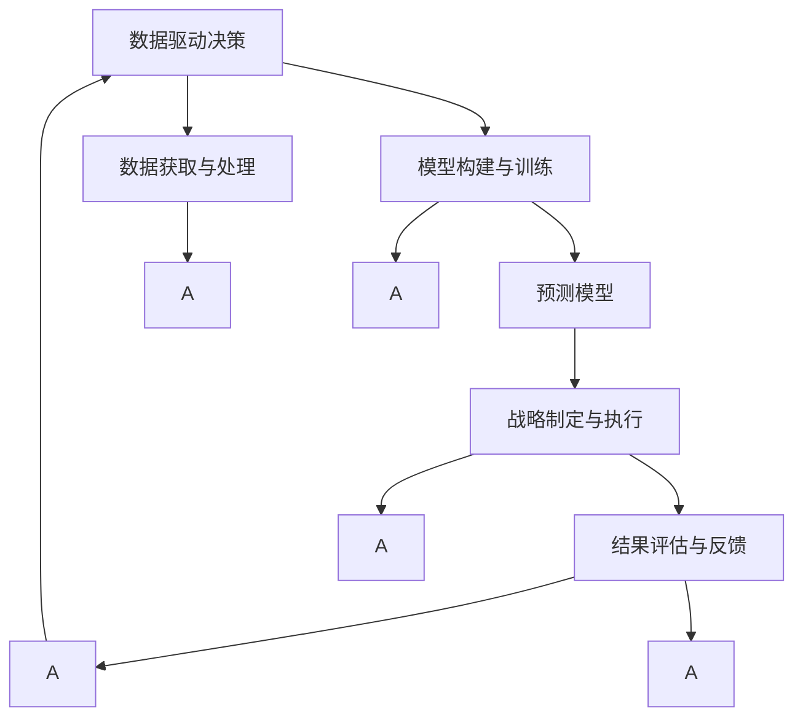

                 

# 洞察力与战略规划：预见未来的能力

> 关键词：洞察力,战略规划,未来预测,决策分析,数据驱动

## 1. 背景介绍

在当今瞬息万变的数字化时代，预见未来的能力成为了企业竞争力的核心。面对复杂多变的市场环境，如何基于现有的数据和模型预测未来趋势，制定科学合理的战略规划，是每一个领导者和管理者都必须面对的重大课题。

### 1.1 问题由来
随着大数据和人工智能技术的飞速发展，企业拥有前所未有的数据获取和分析能力。然而，如何从海量数据中提炼出有用的洞察力，预测未来的发展趋势，制定有效的战略规划，成为了一个巨大的挑战。传统的基于经验的决策方式在当前的数据驱动环境中显得力不从心。因此，企业需要运用先进的数据分析和预测模型，实现对未来趋势的准确预见和战略规划。

### 1.2 问题核心关键点
在未来预测和战略规划中，关键在于如何利用先进的数据分析和预测模型，实现对未来趋势的准确预见。这涉及到以下核心关键点：

- **数据获取与处理**：收集并处理与企业相关的各类数据，包括市场数据、财务数据、客户数据等。
- **模型构建与训练**：基于历史数据构建预测模型，并进行模型训练和优化。
- **战略制定与执行**：将模型预测结果转化为具体的战略规划，并结合专家经验进行执行和调整。
- **结果评估与反馈**：对战略规划的效果进行评估，并根据结果进行调整和优化。

## 2. 核心概念与联系

### 2.1 核心概念概述

为更好地理解未来预测和战略规划的流程，本节将介绍几个密切相关的核心概念：

- **数据驱动决策**：基于数据分析和模型预测结果进行决策的过程，强调客观数据和分析的重要性。
- **预测模型**：使用机器学习、统计学等方法构建的预测未来趋势的模型。
- **战略规划**：企业基于预测结果制定的长期目标和短期策略，包含市场进入、产品开发、资源分配等内容。
- **洞察力**：从大量数据中提炼出的有价值的信息，支持决策者和分析师做出明智的判断。
- **决策分析**：通过数据驱动的方式，对各类数据进行分析，支持战略规划和运营决策。

这些核心概念之间的逻辑关系可以通过以下Mermaid流程图来展示：



这个流程图展示了一些关键概念之间的逻辑关系：

1. 数据驱动决策依赖于数据获取和处理。
2. 预测模型是基于历史数据构建，帮助企业预测未来趋势。
3. 战略规划是决策分析的结果，需要结合专家经验进行调整。
4. 结果评估与反馈用于修正预测模型的准确性，优化战略规划。

## 3. 核心算法原理 & 具体操作步骤

### 3.1 算法原理概述

基于数据驱动的未来预测和战略规划，本质上是一个数据驱动的预测模型构建和应用过程。其核心思想是：通过构建预测模型，对历史数据进行分析，从而预测未来的发展趋势，并根据预测结果制定相应的战略规划。

形式化地，假设企业的目标为 $T$，历史数据集为 $D=\{(x_i,y_i)\}_{i=1}^N$，其中 $x_i$ 表示历史时间点的数据，$y_i$ 表示目标变量。预测模型的目标是最小化预测误差，即找到最优模型参数 $\theta$：

$$
\theta^* = \mathop{\arg\min}_{\theta} \mathcal{L}(\theta, D)
$$

其中 $\mathcal{L}$ 为预测模型的损失函数，用于衡量模型预测输出与真实目标之间的差异。常见的损失函数包括均方误差损失、交叉熵损失等。

### 3.2 算法步骤详解

基于数据驱动的未来预测和战略规划，一般包括以下几个关键步骤：

**Step 1: 数据收集与预处理**
- 收集与企业相关的各类数据，如市场数据、财务数据、客户数据等。
- 清洗和处理数据，包括去除噪声、填补缺失值、标准化等。

**Step 2: 构建预测模型**
- 选择合适的预测模型，如回归模型、时间序列模型、机器学习模型等。
- 根据历史数据训练模型，调整模型参数以最小化预测误差。

**Step 3: 模型评估与优化**
- 在验证集上评估模型的预测性能，选择合适的评估指标。
- 根据评估结果，调整模型参数，优化预测结果。

**Step 4: 战略规划与执行**
- 将模型预测结果转化为具体的战略规划，如市场进入、产品开发、资源分配等。
- 结合专家经验和业务场景，调整战略规划，确保执行的可行性。

**Step 5: 结果评估与反馈**
- 对战略规划的效果进行评估，选择适当的评估指标。
- 根据评估结果，调整预测模型和战略规划，进行迭代优化。

以上是基于数据驱动的未来预测和战略规划的一般流程。在实际应用中，还需要根据具体任务和数据特点进行优化设计，如改进数据预处理方法，应用更复杂的模型结构，引入更多特征等，以进一步提升预测精度和战略效果。

### 3.3 算法优缺点

基于数据驱动的未来预测和战略规划方法具有以下优点：
1. 客观准确。通过数据分析和模型预测，可以消除人为偏见，提供客观的预测结果。
2. 覆盖广泛。可以适用于各种企业经营领域，如市场分析、销售预测、财务规划等。
3. 灵活可调。通过模型优化和参数调整，可以适应不同的业务场景和数据特点。
4. 迭代优化。可以通过持续的评估和反馈，不断提升预测模型的准确性和战略规划的执行效果。

同时，该方法也存在一定的局限性：
1. 数据依赖性高。预测结果高度依赖于数据的质量和完整性，数据偏差可能影响预测结果。
2. 模型复杂度。复杂的预测模型需要大量的计算资源和时间，特别是在大数据环境下。
3. 专家经验不足。模型预测结果可能缺乏实际业务的洞察力，需要专家经验进行验证和调整。
4. 结果解释性差。复杂的模型和预测结果难以解释，可能难以获得管理层的信任。
5. 风险因素未考虑。模型通常忽略外部环境变化和突发事件，可能无法应对不可预测的风险。

尽管存在这些局限性，但就目前而言，基于数据驱动的预测模型方法仍是大企业进行未来预测和战略规划的主流范式。未来相关研究的重点在于如何进一步提高模型的预测能力和泛化性能，同时兼顾可解释性和风险管理等因素。

### 3.4 算法应用领域

基于预测模型的方法在企业战略规划中已经得到了广泛的应用，覆盖了几乎所有常见领域，例如：

- **市场预测**：如市场规模、增长率、客户需求等。通过预测模型对市场趋势进行预测，制定市场进入策略。
- **财务预测**：如销售收入、成本、利润等。通过预测模型对未来财务表现进行评估，优化财务规划。
- **供应链管理**：如库存水平、物流需求等。通过预测模型对供应链状态进行预测，优化资源分配。
- **产品开发**：如新产品需求、市场接受度等。通过预测模型对产品表现进行评估，制定产品开发计划。
- **客户关系管理**：如客户流失率、忠诚度等。通过预测模型对客户行为进行预测，提升客户满意度。

除了上述这些经典领域外，基于预测模型的方法也被创新性地应用到更多场景中，如风险管理、创新研发、资产评估等，为企业决策提供更多有力的支持。

## 4. 数学模型和公式 & 详细讲解 & 举例说明

### 4.1 数学模型构建

本节将使用数学语言对基于数据驱动的未来预测和战略规划过程进行更加严格的刻画。

假设企业目标为 $T$，历史数据集为 $D=\{(x_i,y_i)\}_{i=1}^N$，其中 $x_i$ 表示历史时间点的数据，$y_i$ 表示目标变量。定义模型 $M_{\theta}$ 在输入 $x$ 上的预测输出为 $\hat{y}=M_{\theta}(x)$。则预测模型的目标是最小化预测误差：

$$
\mathcal{L}(\theta) = \frac{1}{N} \sum_{i=1}^N (\hat{y}_i - y_i)^2
$$

其中 $(\hat{y}_i - y_i)^2$ 为预测误差，表示模型预测值与真实值之间的差异。

### 4.2 公式推导过程

以下我们以回归模型为例，推导预测模型和误差公式的计算过程。

假设模型 $M_{\theta}$ 在输入 $x$ 上的预测输出为 $\hat{y}=M_{\theta}(x)$，其中 $M_{\theta}(x) = w_0 + w_1x_1 + w_2x_2 + ... + w_nx_n$。则回归模型的目标是最小化预测误差：

$$
\mathcal{L}(\theta) = \frac{1}{N} \sum_{i=1}^N (w_0 + w_1x_{1i} + w_2x_{2i} + ... + w_nx_{ni} - y_i)^2
$$

根据最小二乘法的原理，我们可以得到模型参数 $w_0, w_1, ..., w_n$ 的求解公式为：

$$
\theta^* = \mathop{\arg\min}_{\theta} \mathcal{L}(\theta) \quad \text{其中} \quad \theta = [w_0, w_1, ..., w_n]
$$

进一步展开，得到：

$$
\frac{\partial \mathcal{L}(\theta)}{\partial w_k} = \frac{-2}{N} \sum_{i=1}^N (w_0 + w_1x_{1i} + w_2x_{2i} + ... + w_nx_{ni} - y_i)x_{ki}
$$

将上式化简，得到：

$$
\frac{\partial \mathcal{L}(\theta)}{\partial w_k} = \frac{-2}{N} \sum_{i=1}^N (w_0 + w_1x_{1i} + w_2x_{2i} + ... + w_nx_{ni} - y_i)x_{ki}
$$

求解上述方程组，得到：

$$
w_k = \frac{1}{N} \sum_{i=1}^N (w_0 + w_1x_{1i} + w_2x_{2i} + ... + w_nx_{ni} - y_i)x_{ki}
$$

其中 $x_{ki}$ 为数据 $x_i$ 的第 $k$ 个特征。

将 $w_k$ 代入回归模型，得到最终预测结果 $\hat{y}_i = w_0 + w_1x_{1i} + w_2x_{2i} + ... + w_nx_{ni}$。

## 5. 项目实践：代码实例和详细解释说明

### 5.1 开发环境搭建

在进行预测模型实践前，我们需要准备好开发环境。以下是使用Python进行Scikit-learn开发的環境配置流程：

1. 安装Anaconda：从官网下载并安装Anaconda，用于创建独立的Python环境。

2. 创建并激活虚拟环境：
```bash
conda create -n sklearn-env python=3.8 
conda activate sklearn-env
```

3. 安装Scikit-learn：从官网获取安装命令，进行安装。例如：
```bash
conda install scikit-learn
```

4. 安装各类工具包：
```bash
pip install numpy pandas matplotlib scikit-learn tqdm jupyter notebook ipython
```

完成上述步骤后，即可在`sklearn-env`环境中开始预测模型实践。

### 5.2 源代码详细实现

下面我以线性回归模型为例，给出使用Scikit-learn进行市场规模预测的Python代码实现。

首先，定义数据处理函数：

```python
import pandas as pd
from sklearn.model_selection import train_test_split
from sklearn.linear_model import LinearRegression
from sklearn.metrics import mean_squared_error, r2_score

def load_data():
    data = pd.read_csv('market_data.csv')
    x = data[['x1', 'x2', 'x3', 'x4']]  # 特征数据
    y = data['y']  # 目标变量
    return x, y

def train_test_split_data(x, y, test_size=0.2, random_state=42):
    x_train, x_test, y_train, y_test = train_test_split(x, y, test_size=test_size, random_state=random_state)
    return x_train, x_test, y_train, y_test

def evaluate_model(model, x_test, y_test):
    y_pred = model.predict(x_test)
    mse = mean_squared_error(y_test, y_pred)
    r2 = r2_score(y_test, y_pred)
    print(f'MSE: {mse:.2f}, R^2: {r2:.2f}')
```

然后，定义模型训练函数：

```python
def train_model(x_train, y_train):
    model = LinearRegression()
    model.fit(x_train, y_train)
    return model

def evaluate_model(model, x_test, y_test):
    y_pred = model.predict(x_test)
    mse = mean_squared_error(y_test, y_pred)
    r2 = r2_score(y_test, y_pred)
    print(f'MSE: {mse:.2f}, R^2: {r2:.2f}')
```

最后，启动模型训练和评估流程：

```python
x, y = load_data()
x_train, x_test, y_train, y_test = train_test_split_data(x, y)

model = train_model(x_train, y_train)
evaluate_model(model, x_test, y_test)
```

以上就是使用Scikit-learn进行线性回归模型市场规模预测的完整代码实现。可以看到，得益于Scikit-learn的强大封装，我们可以用相对简洁的代码完成预测模型的训练和评估。

### 5.3 代码解读与分析

让我们再详细解读一下关键代码的实现细节：

**load_data函数**：
- 定义了一个函数，用于读取市场数据文件，并将特征和目标变量分离。

**train_test_split_data函数**：
- 使用train_test_split方法将数据集分为训练集和测试集，返回分割后的训练集和测试集的特征和目标变量。

**evaluate_model函数**：
- 定义了两个函数，用于在测试集上评估模型的预测性能。计算均方误差和R^2值，并打印输出。

**train_model函数**：
- 定义了一个函数，用于训练线性回归模型。

**train_model函数**：
- 调用train_model函数训练线性回归模型，并在测试集上评估预测性能。

这些代码展示了使用Scikit-learn进行预测模型的基本流程，从数据预处理到模型训练，再到结果评估，每一步都详细解释和分析了相应的函数和变量。

当然，工业级的系统实现还需考虑更多因素，如模型的保存和部署、超参数的自动搜索、更灵活的模型结构等。但核心的预测模型训练过程基本与此类似。

## 6. 实际应用场景

### 6.1 智能制造

智能制造是当前制造业数字化转型的重要方向。通过对市场规模、需求、生产成本等关键指标进行预测，企业可以制定更为科学合理的生产计划，优化资源分配，提升生产效率。

在技术实现上，可以构建基于历史数据的预测模型，如回归模型、时间序列模型等，对未来市场规模和需求进行预测。同时，利用机器学习技术对生产成本进行预测，指导生产资源的最优分配。如此构建的智能制造系统，能大幅提升生产效率和资源利用率，推动制造业向智能化、自动化方向发展。

### 6.2 金融投资

金融投资领域，对市场趋势的准确预测至关重要。通过预测模型对市场价格、波动率、收益等进行预测，投资者可以制定更科学的投资策略，规避风险，提升投资回报。

在实践应用中，可以构建基于历史数据的预测模型，如ARIMA模型、神经网络模型等，对金融市场进行预测。同时，利用金融数据分析技术，对市场风险进行评估，优化投资组合。如此构建的金融投资系统，能显著提升投资效率和风险管理能力，为投资者提供更可靠的投资建议。

### 6.3 智慧医疗

智慧医疗是医疗行业数字化转型的重要方向。通过对患者健康数据、治疗效果、疾病流行趋势等进行预测，医疗机构可以制定更科学合理的诊疗方案，提升医疗服务质量。

在实践应用中，可以构建基于历史数据的预测模型，如随机森林模型、深度学习模型等，对患者健康数据进行预测。同时，利用医疗数据分析技术，对疾病流行趋势进行预测，优化诊疗方案。如此构建的智慧医疗系统，能显著提升医疗服务质量和患者满意度，推动医疗行业向智能化方向发展。

### 6.4 未来应用展望

随着预测模型技术的发展，未来在更多领域将实现对未来趋势的精准预测和战略规划。

在智慧交通领域，通过对交通流量、道路状况、车辆需求等进行预测，交通管理部门可以制定更科学合理的交通方案，提升交通效率和安全性。

在智能农业领域，通过对气象数据、土壤数据、农作物生长状态等进行预测，农业部门可以制定更科学合理的种植方案，提升农业生产效率和作物产量。

在智慧教育领域，通过对学生学习行为、考试成绩、学校管理数据等进行预测，教育部门可以制定更科学合理的人才培养方案，提升教育质量和公平性。

此外，在更多行业，如能源管理、环境保护、城市规划等领域，预测模型也将发挥越来越重要的作用，推动这些领域向智能化、自动化方向发展。

## 7. 工具和资源推荐

### 7.1 学习资源推荐

为了帮助开发者系统掌握数据驱动决策的理论基础和实践技巧，这里推荐一些优质的学习资源：

1. 《机器学习》课程：斯坦福大学开设的经典机器学习课程，全面讲解了机器学习的理论基础和算法实现，适合初学者和进阶者学习。

2. 《深度学习》课程：Coursera与DeepLearning.AI合作推出的深度学习课程，系统讲解了深度学习算法和应用。

3. 《Python数据科学手册》：一本详细介绍Python在数据科学和机器学习中应用的书籍，适合实践开发者学习。

4. 《Kaggle机器学习竞赛》：Kaggle平台上的各种机器学习竞赛，可以通过实际项目积累经验和提升技能。

5. 《Data Science with Python》书籍：一本详细介绍数据科学和机器学习领域的书籍，适合初学者入门。

通过对这些资源的学习实践，相信你一定能够快速掌握数据驱动决策的精髓，并用于解决实际的预测问题。

### 7.2 开发工具推荐

高效的开发离不开优秀的工具支持。以下是几款用于数据驱动决策开发的常用工具：

1. Scikit-learn：基于Python的开源机器学习库，提供丰富的机器学习算法和工具，适合快速开发和实验。

2. TensorFlow：由Google主导开发的开源深度学习框架，生产部署方便，适合大规模工程应用。

3. PyTorch：基于Python的开源深度学习框架，灵活动态的计算图，适合快速迭代研究。

4. Jupyter Notebook：一种交互式的开发环境，适合编写和执行代码，并生成易于理解的文档。

5. R语言：一种广泛用于统计分析和数据科学的数据处理语言，具有强大的数据分析能力。

合理利用这些工具，可以显著提升数据驱动决策的开发效率，加快创新迭代的步伐。

### 7.3 相关论文推荐

数据驱动决策和预测模型的发展源于学界的持续研究。以下是几篇奠基性的相关论文，推荐阅读：

1. Deep Learning：Precise, Robust, and Fast Online Sales Forecasting with Attention Mechanisms：提出基于注意力机制的深度学习模型，用于在线销售预测。

2. Stock Analysis：A comprehensive library for technical analysis of stocks：基于Python的股票分析库，提供丰富的技术分析工具和算法。

3. Forecasting using Large-Scale Online Machine Learning Systems：提出基于在线机器学习系统的预测方法，用于大规模数据预测。

4. An Application of Data Mining to Business Forecasting：提出基于数据挖掘的商业预测方法，用于企业业务预测。

5. A Time Series Modeling Toolbox for Financial Time Series：提出基于时间序列模型的金融数据分析工具，用于金融市场预测。

这些论文代表了大数据驱动决策和预测模型的发展脉络。通过学习这些前沿成果，可以帮助研究者把握学科前进方向，激发更多的创新灵感。

## 8. 总结：未来发展趋势与挑战

### 8.1 总结

本文对基于数据驱动的未来预测和战略规划方法进行了全面系统的介绍。首先阐述了数据驱动决策的背景和重要性，明确了预测模型在科学决策中的关键作用。其次，从原理到实践，详细讲解了预测模型的数学原理和关键步骤，给出了预测任务开发的完整代码实例。同时，本文还广泛探讨了预测模型在智能制造、金融投资、智慧医疗等多个行业领域的应用前景，展示了数据驱动决策的广泛应用潜力。此外，本文精选了数据驱动决策的各类学习资源，力求为读者提供全方位的技术指引。

通过本文的系统梳理，可以看到，基于数据驱动的预测模型方法在各个行业中已得到广泛应用，为企业的未来预测和战略规划提供了有力的支持。未来，伴随预测模型技术的发展，数据驱动决策将进一步普及，推动更多行业向智能化、自动化方向发展。

### 8.2 未来发展趋势

展望未来，数据驱动的预测模型将呈现以下几个发展趋势：

1. 模型复杂度提升。随着深度学习和大数据的普及，预测模型的复杂度将进一步提升，能够处理更加复杂多变的预测任务。

2. 实时预测能力增强。通过流数据处理技术和在线机器学习算法，实时预测能力将显著提升，能够快速响应外部环境变化。

3. 多模态数据融合。预测模型将融合视觉、语音、文本等多种模态数据，提升预测的全面性和准确性。

4. 跨领域泛化能力增强。通过迁移学习和多任务学习，预测模型将具备更强的跨领域泛化能力，适应更多业务场景。

5. 预测结果可视化。预测结果的可视化将显著提升决策的透明度和可信度，帮助管理层理解和应用预测结果。

6. 自动化调参技术发展。通过自动化调参技术，预测模型的训练和优化将更加高效，降低人工干预的成本。

以上趋势凸显了数据驱动决策技术的广阔前景。这些方向的探索发展，必将进一步提升预测模型的性能和战略规划的执行效果，为企业的未来发展提供更加精准可靠的决策支持。

### 8.3 面临的挑战

尽管数据驱动的预测模型技术已经取得了瞩目成就，但在迈向更加智能化、普适化应用的过程中，它仍面临着诸多挑战：

1. 数据质量问题。预测模型高度依赖于数据的质量和完整性，数据偏差可能影响预测结果。如何提高数据的质量和完整性，是当前急需解决的问题。

2. 模型复杂性增加。预测模型的复杂度增加，导致训练和推理的计算资源消耗巨大。如何在保证预测精度的前提下，优化模型的计算资源消耗，是一个重要的研究方向。

3. 模型解释性不足。复杂的预测模型通常难以解释，可能难以获得管理层的信任。如何提升模型的解释性，使其更易于理解和应用，是当前的研究热点。

4. 外部环境变化。预测模型通常忽略外部环境变化和突发事件，可能无法应对不可预测的风险。如何增强模型的鲁棒性，应对外部环境变化，是另一个重要的研究方向。

5. 模型更新频率。预测模型的预测结果需要定期更新，以反映最新的市场趋势。如何提高模型的更新频率，缩短预测周期，是未来需要进一步优化的方向。

6. 数据隐私和安全。预测模型的训练和应用涉及大量敏感数据，如何保障数据隐私和安全，防止数据泄露和滥用，是重要的研究课题。

正视预测模型面临的这些挑战，积极应对并寻求突破，将使数据驱动决策技术迈向成熟，为企业提供更为可靠和高效的决策支持。

### 8.4 研究展望

面向未来，预测模型的研究需要在以下几个方面寻求新的突破：

1. 探索自动化调参技术。通过自动化调参技术，提升模型训练和优化的效率，降低人工干预的成本。

2. 融合多模态数据。通过多模态数据的融合，提升预测模型的全面性和准确性，适应更多业务场景。

3. 引入因果推断方法。通过引入因果推断方法，提升预测模型的鲁棒性和解释性，增强决策的可信度。

4. 优化实时预测系统。通过流数据处理技术和在线机器学习算法，提升实时预测能力，满足企业对实时决策的需求。

5. 引入知识图谱。通过知识图谱与预测模型的融合，提升预测模型的解释性和泛化能力，增强决策的透明度和可信度。

这些研究方向的探索，必将引领预测模型技术迈向更高的台阶，为企业提供更为可靠和高效的决策支持。面向未来，预测模型需要与其他人工智能技术进行更深入的融合，如知识表示、因果推理、强化学习等，多路径协同发力，共同推动预测模型技术的发展。只有勇于创新、敢于突破，才能不断拓展预测模型的边界，让数据驱动决策技术更好地造福人类社会。

## 9. 附录：常见问题与解答

**Q1：数据驱动决策与传统决策方式有何不同？**

A: 数据驱动决策和传统决策方式的主要区别在于决策依据的来源。传统决策方式主要依赖于管理层的经验和直觉，而数据驱动决策则依赖于大量的客观数据和模型预测结果。数据驱动决策通过数据分析和模型预测，能够消除人为偏见，提供客观的决策依据，从而提升决策的科学性和准确性。

**Q2：在数据驱动决策中，如何处理缺失数据？**

A: 数据缺失是常见的问题，需要通过数据预处理技术进行处理。常用的处理方法包括：

1. 填补缺失值：通过插值、均值填补、中位数填补等方式，将缺失值填补完整。
2. 删除缺失值：如果缺失值比例较小，可以直接删除缺失样本。
3. 模型预测：使用模型对缺失值进行预测，并将其填补完整。

具体选择哪种处理方法，需要根据数据特点和业务场景进行选择。

**Q3：预测模型中如何处理过拟合问题？**

A: 过拟合是预测模型中常见的问题，需要通过以下方法进行缓解：

1. 数据增强：通过数据增强技术，如数据扩充、回译等方式，扩充训练数据集，减少过拟合风险。
2. 正则化技术：通过L2正则化、Dropout等方式，限制模型的复杂度，防止过拟合。
3. 交叉验证：使用交叉验证技术，评估模型的泛化能力，调整模型参数。

这些方法通常需要根据具体模型和数据特点进行灵活组合，以达到最佳的效果。

**Q4：如何评估预测模型的效果？**

A: 预测模型的评估通常通过以下指标进行：

1. 均方误差(MSE)：用于回归模型的评估，衡量预测值与真实值之间的差距。
2. 平均绝对误差(MAE)：用于回归模型的评估，衡量预测值与真实值之间的差距。
3. R^2值：用于回归模型的评估，衡量预测值与真实值之间的相关性。
4. 准确率、召回率、F1值：用于分类模型的评估，衡量模型的分类效果。

这些指标通常需要根据具体任务和业务场景进行选择，评估模型的预测性能。

**Q5：预测模型在实际应用中需要注意哪些问题？**

A: 预测模型在实际应用中需要注意以下问题：

1. 模型部署：将预测模型部署到生产环境中，需要考虑模型的可伸缩性、稳定性、安全性等。
2. 数据更新：预测模型需要定期更新，以反映最新的数据和市场趋势。
3. 模型调优：预测模型需要不断调优，以适应外部环境变化和突发事件。
4. 数据隐私：预测模型的训练和应用涉及大量敏感数据，需要保障数据隐私和安全。

通过合理设计和优化预测模型，企业可以更科学地制定战略规划，提升决策效果，实现更高效的业务运营。

---

作者：禅与计算机程序设计艺术 / Zen and the Art of Computer Programming

