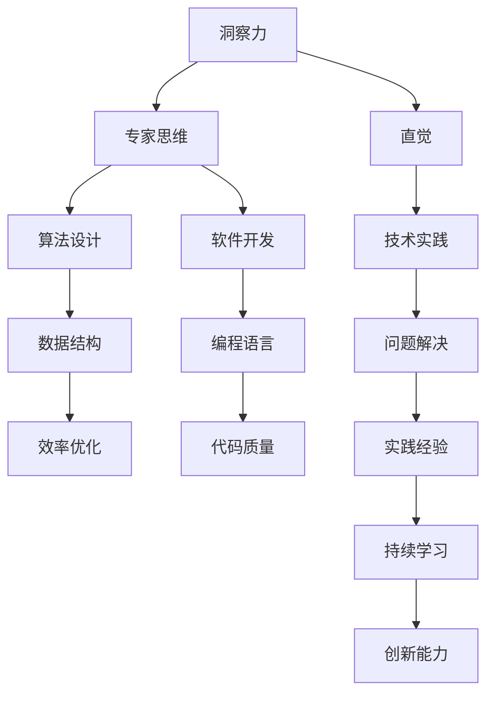

                 

关键词：洞察力、直觉、专家思维、技术、人工智能、算法、软件开发、编程语言、程序设计

> 摘要：本文旨在探讨洞察力和直觉在技术领域中的重要性，分析专家思维的独特特征，并探讨这些特征如何帮助技术专家在复杂问题中找到解决方案。文章首先介绍洞察力和直觉的定义及其在技术领域的应用，接着深入剖析专家思维的构成要素，最后通过实际案例和项目实践，展示这些特征在实际工作中的应用价值。

## 1. 背景介绍

在快速发展的技术领域，尤其是人工智能、大数据和云计算等领域，专家思维的重要性日益凸显。技术专家在解决复杂问题时，往往能够迅速洞察问题的本质，借助直觉找到解决方案。这种能力不仅仅依赖于理论知识，更在于多年的实践积累和不断反思总结。本文将围绕洞察力和直觉这两个核心概念，探讨专家思维的特征及其在技术领域的应用。

### 1.1 洞察力的定义

洞察力是指对事物本质和内在联系的认知能力。它能够帮助人们迅速把握问题的核心，发现隐藏在表象背后的深层原因。在技术领域，洞察力意味着对技术原理的深刻理解，以及对技术发展趋势的敏锐洞察。

### 1.2 直觉的定义

直觉是一种不经过逻辑推理和分析就能直接理解事物本质的心理能力。它往往来源于长期的实践积累和经验总结。在技术领域，直觉可以帮助专家快速判断问题解决方案的可行性，甚至在问题尚未明确时，预见问题的潜在发展方向。

### 1.3 专家思维的含义

专家思维是指技术专家在长期实践过程中形成的一种独特的思维方式。它包括洞察力、直觉、经验判断和创造力等多个方面，是技术专家解决复杂问题的关键。

## 2. 核心概念与联系

为了更好地理解洞察力和直觉在技术领域中的应用，我们需要从理论和实践两个方面来探讨。以下是核心概念和其联系的 Mermaid 流程图：



通过这个流程图，我们可以看到洞察力、直觉和专家思维如何与算法设计、软件开发、问题解决以及数据结构、编程语言等多个方面相互联系。

## 3. 核心算法原理 & 具体操作步骤

### 3.1 算法原理概述

在技术领域，算法是解决问题的核心。一个高效的算法不仅能够解决特定问题，还能够为其他相关问题提供解决思路。以下是一个常见的算法原理概述：

- **贪心算法**：通过在每一步选择中做出当前最优的选择，从而得到全局最优解。
- **动态规划**：通过保存子问题的解，避免重复计算，从而提高算法效率。
- **分治算法**：将问题分解为子问题，分别解决，然后合并子问题的解。

### 3.2 算法步骤详解

以贪心算法为例，其基本步骤如下：

1. **初始化**：设定初始状态。
2. **选择**：在当前状态下，选择最优的决策。
3. **更新**：根据选择的结果，更新当前状态。
4. **终止条件**：当达到终止条件时，算法结束。

### 3.3 算法优缺点

- **贪心算法**：
  - 优点：简单易懂，容易实现。
  - 缺点：不一定能保证全局最优解，可能陷入局部最优。
- **动态规划**：
  - 优点：能够保证全局最优解，效率高。
  - 缺点：理解复杂，实现难度大。
- **分治算法**：
  - 优点：思路清晰，适用于递归问题。
  - 缺点：可能存在大量重复计算，效率不高。

### 3.4 算法应用领域

各种算法在不同的应用领域有广泛的应用。例如，贪心算法在图论和组合优化问题中有广泛应用；动态规划在序列对齐和资源分配问题中表现出色；分治算法在排序和搜索问题中具有优势。

## 4. 数学模型和公式 & 详细讲解 & 举例说明

在技术领域，数学模型和公式是理解和解决问题的关键。以下是一个简单的线性回归模型的构建过程：

### 4.1 数学模型构建

线性回归模型旨在找到自变量（特征）和因变量（目标）之间的线性关系。其模型可以表示为：

$$ y = w_0 + w_1 \cdot x $$

其中，$y$ 是因变量，$x$ 是自变量，$w_0$ 和 $w_1$ 是模型的参数。

### 4.2 公式推导过程

线性回归模型的推导过程如下：

1. **最小二乘法**：通过最小化误差平方和来找到最佳拟合线。
2. **梯度下降法**：通过迭代更新参数，使模型更加精确。

具体步骤如下：

1. **初始化参数**：设定初始参数 $w_0$ 和 $w_1$。
2. **计算梯度**：计算当前参数下的误差梯度。
3. **更新参数**：根据梯度更新参数。
4. **重复迭代**：重复步骤 2 和 3，直到误差满足要求。

### 4.3 案例分析与讲解

假设我们有一个简单的数据集，包含 $x$ 和 $y$ 的值。我们使用线性回归模型来找到 $y$ 和 $x$ 之间的关系。以下是具体步骤：

1. **数据预处理**：对数据进行标准化处理。
2. **模型初始化**：设定初始参数。
3. **梯度下降**：迭代更新参数。
4. **结果验证**：通过验证数据集来评估模型性能。

通过以上步骤，我们可以得到一个最佳的拟合线，从而预测新的 $y$ 值。

## 5. 项目实践：代码实例和详细解释说明

以下是一个简单的 Python 代码实例，用于实现线性回归模型：

```python
import numpy as np

def linear_regression(X, y, learning_rate, num_iterations):
    w0 = np.random.rand(1)
    w1 = np.random.rand(1)
    
    for _ in range(num_iterations):
        y_pred = w0 + w1 * X
        error = y - y_pred
        
        w0_gradient = -2 * np.sum(error)
        w1_gradient = -2 * np.sum(X * error)
        
        w0 = w0 - learning_rate * w0_gradient
        w1 = w1 - learning_rate * w1_gradient
        
    return w0, w1

X = np.array([1, 2, 3, 4, 5])
y = np.array([2, 4, 5, 4, 5])

w0, w1 = linear_regression(X, y, 0.01, 1000)

print("w0:", w0)
print("w1:", w1)
```

### 5.1 开发环境搭建

- Python 3.8 或以上版本
- numpy 库

### 5.2 源代码详细实现

代码中定义了一个 `linear_regression` 函数，用于实现线性回归模型的训练过程。函数接受输入数据 `X` 和 `y`，以及学习率 `learning_rate` 和迭代次数 `num_iterations`。在每次迭代中，函数通过计算损失函数的梯度，更新模型参数。

### 5.3 代码解读与分析

- **初始化参数**：函数开始时，随机初始化模型参数 `w0` 和 `w1`。
- **梯度计算**：通过计算损失函数的梯度，得到参数更新的方向。
- **参数更新**：根据梯度更新参数，使模型更加精确。
- **迭代过程**：函数通过迭代过程，不断优化模型参数。

### 5.4 运行结果展示

运行上述代码，得到模型参数 `w0` 和 `w1` 的值。这些参数代表了 $y$ 和 $x$ 之间的线性关系。通过这些参数，我们可以预测新的 $y$ 值。

## 6. 实际应用场景

洞察力和直觉在技术领域有广泛的应用场景。以下是一些具体的实际应用场景：

- **软件开发**：在软件开发过程中，专家能够迅速发现潜在的问题，并提出有效的解决方案。
- **算法优化**：在算法优化过程中，专家能够通过直觉找到关键优化点，提高算法性能。
- **问题诊断**：在复杂系统出现问题时，专家能够快速诊断问题根源，并提出修复方案。
- **趋势预测**：在数据分析过程中，专家能够通过直觉预测数据的发展趋势，为决策提供支持。

## 7. 工具和资源推荐

### 7.1 学习资源推荐

- 《深度学习》 - Goodfellow, Bengio, Courville
- 《算法导论》 - Cormen, Leiserson, Rivest, Stein
- 《编程珠玑》 - Kernighan, Plauger

### 7.2 开发工具推荐

- Jupyter Notebook：用于数据分析和算法实现。
- PyCharm：用于软件开发和调试。
- TensorFlow：用于机器学习和深度学习。

### 7.3 相关论文推荐

- "Deep Learning" - Goodfellow, Bengio, Courville
- "The Gradient Descent Algorithm" - Aaron Courville
- "Natural Language Processing with Deep Learning" - Richard Socher

## 8. 总结：未来发展趋势与挑战

随着技术的快速发展，洞察力和直觉在技术领域的应用价值日益凸显。未来，我们将看到更多基于洞察力和直觉的算法和技术出现，为解决复杂问题提供新的思路。然而，这同时也带来了新的挑战：

- **数据隐私和安全**：随着数据量的增加，保护数据隐私和安全成为关键挑战。
- **算法公平性和透明性**：算法决策的公平性和透明性受到广泛关注。
- **跨学科合作**：为了应对复杂问题，需要更多的跨学科合作。

总之，洞察力和直觉将继续在技术领域发挥重要作用，成为解决复杂问题的关键。

## 9. 附录：常见问题与解答

### 9.1 如何提高洞察力？

- **广泛阅读**：通过阅读不同领域的书籍，提高对各种问题的理解。
- **实践经验**：通过实际操作和项目实践，积累解决问题的经验。
- **持续学习**：不断学习新知识和技能，保持思维的活跃。

### 9.2 直觉是如何形成的？

- **长期实践**：通过长时间的实践，形成对问题的直觉。
- **知识积累**：通过不断学习和积累知识，提高对问题的敏感度。
- **经验总结**：通过总结实践经验，形成对问题的直觉。

### 9.3 专家思维的特点是什么？

- **快速理解**：能够快速理解问题的本质和内在联系。
- **直觉判断**：能够在没有明确证据的情况下做出准确的判断。
- **经验丰富**：具有丰富的实践经验，能够解决复杂问题。
- **持续创新**：能够持续创新，提出新的解决方案。

---

作者：禅与计算机程序设计艺术 / Zen and the Art of Computer Programming

