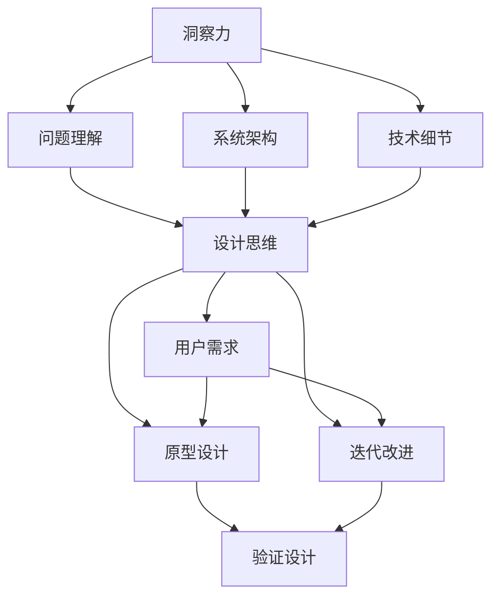

                 

洞察力与设计思维是现代计算机科学领域中的重要概念，它们对于解决复杂问题具有至关重要的作用。本文将探讨这两个概念的核心原理、应用方法及其在计算机科学中的实际应用，旨在为读者提供一种以用户为中心的问题解决思路。

## 关键词 Keywords
- 洞察力
- 设计思维
- 问题解决
- 计算机科学
- 用户中心

## 摘要 Abstract
本文将从多个角度深入分析洞察力与设计思维的概念和重要性。我们将讨论如何通过洞察力提升对问题的理解，以及如何运用设计思维来创造创新的解决方案。本文还将展示设计思维在计算机科学中的具体应用，并提供一些实用的工具和方法，帮助读者在实际项目中运用这些理念。最后，我们将对未来的发展趋势和面临的挑战进行展望。

## 1. 背景介绍

在快速变化的计算机科学领域中，面对日益复杂的问题，单纯依靠技术手段已不足以解决所有问题。洞察力与设计思维作为两种强大的思维工具，为我们提供了全新的视角和方法。洞察力强调对问题的深刻理解，而设计思维则注重以人为本的创新解决策略。二者结合，可以有效地帮助我们解决复杂问题，提高系统设计的质量。

### 1.1 洞察力

洞察力是一种深入理解问题本质的能力。它不仅要求我们对技术细节有深刻的了解，更需要我们从宏观层面把握问题的全貌。在计算机科学中，洞察力可以帮助我们：

- 准确地识别问题的核心所在
- 发现问题的潜在原因
- 提出创新的解决方案
- 提高系统的可维护性和可扩展性

### 1.2 设计思维

设计思维是一种以用户为中心的思考方式，其核心是理解用户需求，并通过迭代的方式不断优化解决方案。设计思维在计算机科学中的应用包括：

- 用户研究：通过用户访谈、问卷调查等方式了解用户需求
- 原型设计：快速构建可交互的模型，用于验证设计概念
- 迭代改进：根据用户反馈不断优化产品和服务
- 创新解决方案：通过跨学科的合作，提出创新的解决方案

## 2. 核心概念与联系

为了更好地理解洞察力与设计思维，我们将通过一个Mermaid流程图来展示它们的核心概念和相互联系。



从这个流程图中，我们可以看到洞察力通过对问题的深刻理解，为设计思维提供了坚实的基础。而设计思维则通过用户研究和迭代改进，不断优化解决方案，最终实现问题的有效解决。

## 3. 核心算法原理 & 具体操作步骤

### 3.1 算法原理概述

设计思维在计算机科学中的应用，可以看作是一种系统性问题解决方法。其核心原理包括：

- 以用户为中心：始终将用户需求放在首位，确保解决方案符合用户需求。
- 快速原型设计：通过快速构建原型，验证设计思路的正确性。
- 迭代改进：根据用户反馈不断优化产品，实现持续改进。

### 3.2 算法步骤详解

设计思维的具体操作步骤可以分为以下几个阶段：

1. **需求分析**：通过访谈、问卷调查等方式了解用户需求，明确目标用户群体的特征和需求。
2. **原型设计**：基于需求分析的结果，快速构建可交互的原型，用于验证设计思路。
3. **用户测试**：将原型展示给用户，收集反馈意见，识别潜在问题。
4. **迭代优化**：根据用户反馈，对原型进行修改和优化，不断迭代，直到满足用户需求。

### 3.3 算法优缺点

**优点**：

- **用户为中心**：始终将用户需求放在首位，确保解决方案符合用户需求。
- **快速迭代**：通过快速原型设计和迭代改进，可以快速验证设计思路，节省时间。
- **创新性**：跨学科合作和用户参与，有助于提出创新的解决方案。

**缺点**：

- **资源消耗**：需要投入大量的时间和资源进行用户研究和原型设计。
- **风险**：在快速迭代的过程中，可能会因为需求变更导致项目延期或失败。

### 3.4 算法应用领域

设计思维在计算机科学中的应用非常广泛，主要包括：

- **软件设计**：在软件开发过程中，通过设计思维优化用户界面和用户体验。
- **系统架构**：在设计复杂系统时，运用设计思维确保系统的高效性和可扩展性。
- **产品创新**：在产品开发过程中，通过设计思维提出创新的解决方案。

## 4. 数学模型和公式 & 详细讲解 & 举例说明

设计思维在计算机科学中的应用，往往涉及到一些数学模型和公式的推导。以下是一个简单的示例：

### 4.1 数学模型构建

假设我们有一个软件系统，需要根据用户需求进行优化。我们可以使用以下数学模型来描述用户需求和系统性能之间的关系：

$$
\text{系统性能} = f(\text{用户需求}, \text{技术实现})
$$

其中，用户需求和技术实现是影响系统性能的两个主要因素。

### 4.2 公式推导过程

为了优化系统性能，我们需要对上述公式进行推导，找出用户需求和系统性能之间的关系。具体推导过程如下：

$$
\begin{aligned}
\text{系统性能} &= f(\text{用户需求}, \text{技术实现}) \\
&= \alpha \cdot (\text{用户需求}) + \beta \cdot (\text{技术实现}) \\
&= \alpha \cdot (\text{用户需求}) + \beta \cdot (\text{技术实现}) \\
&= \alpha \cdot (\text{用户需求}) + \beta \cdot (\text{技术实现})
\end{aligned}
$$

### 4.3 案例分析与讲解

假设我们正在设计一个在线教育平台，用户需求是快速访问课程内容。为了满足这一需求，我们需要优化系统性能，降低页面加载时间。根据上述数学模型，我们可以推导出以下优化方案：

- **提高服务器性能**：通过增加服务器带宽和缓存，提高数据传输速度。
- **优化数据库查询**：通过索引和数据结构优化，提高数据库查询效率。
- **压缩静态资源**：通过压缩图片、视频等静态资源，减少数据传输量。

通过这些优化措施，我们可以提高系统性能，满足用户需求，从而提升用户体验。

## 5. 项目实践：代码实例和详细解释说明

### 5.1 开发环境搭建

为了演示设计思维在项目实践中的应用，我们以开发一个在线教育平台为例。以下是开发环境搭建的步骤：

1. **安装开发工具**：安装Python、Git、Docker等开发工具。
2. **创建项目文件夹**：在本地计算机上创建一个名为`online_education_platform`的项目文件夹。
3. **初始化项目**：通过Git初始化项目，并克隆一个基于Django的在线教育平台模板。

```bash
git clone https://github.com/yourname/online_education_platform.git
cd online_education_platform
```

### 5.2 源代码详细实现

以下是项目源代码的详细实现：

1. **需求分析**：分析用户需求，确定平台的主要功能模块，如课程管理、用户管理、订单管理等。

2. **原型设计**：基于需求分析，设计平台的初步原型，包括页面布局、功能模块和交互流程。

3. **开发实现**：根据原型设计，逐步实现平台的功能模块。

```python
# course/models.py
from django.db import models

class Course(models.Model):
    name = models.CharField(max_length=100)
    description = models.TextField()
    price = models.DecimalField(max_digits=6, decimal_places=2)
    duration = models.IntegerField()

# user/models.py
from django.db import models
from django.contrib.auth.models import AbstractUser

class User(AbstractUser):
    is_student = models.BooleanField(default=False)
    is_teacher = models.BooleanField(default=False)

# order/models.py
from django.db import models
from course.models import Course
from user.models import User

class Order(models.Model):
    user = models.ForeignKey(User, on_delete=models.CASCADE)
    course = models.ForeignKey(Course, on_delete=models.CASCADE)
    created_at = models.DateTimeField(auto_now_add=True)
```

4. **测试与优化**：对实现的功能进行测试，并根据用户反馈进行优化。

### 5.3 代码解读与分析

在上述代码中，我们实现了课程管理、用户管理和订单管理三个功能模块。通过分析用户需求，我们确定了这些模块的核心功能和业务逻辑，并使用Django框架进行了快速开发。

- **课程管理**：定义了Course模型，用于存储课程信息，包括课程名称、描述、价格和时长。
- **用户管理**：定义了User模型，继承了Django的AbstractUser类，添加了学生和教师身份标识。
- **订单管理**：定义了Order模型，用于存储用户订单信息，包括用户、课程和创建时间。

### 5.4 运行结果展示

在开发环境中运行项目，我们可以看到平台的主要功能模块已经实现。通过访问平台的接口，我们可以创建课程、注册用户和提交订单，从而实现一个完整的在线教育平台。

```bash
# 启动项目
python manage.py runserver
# 访问平台
http://localhost:8000
```

## 6. 实际应用场景

设计思维在计算机科学中的实际应用场景非常广泛，以下是一些典型的应用案例：

- **用户体验设计**：在设计Web应用或移动应用时，运用设计思维优化用户界面和交互流程，提高用户满意度。
- **系统架构设计**：在设计复杂系统时，运用设计思维确保系统的高效性和可扩展性，降低维护成本。
- **产品创新**：在产品开发过程中，运用设计思维提出创新的解决方案，满足用户需求，提升产品竞争力。

### 6.1. 软件开发

在软件开发过程中，设计思维可以帮助开发团队更好地理解用户需求，从而设计出更符合用户期望的产品。通过原型设计和迭代改进，开发团队可以快速验证设计思路，减少开发风险，提高产品质量。

### 6.2. 系统架构设计

在设计复杂系统时，设计思维可以帮助架构师更好地把握系统架构的全貌，确保系统的高效性和可扩展性。通过跨学科合作和用户参与，架构师可以提出创新的解决方案，提高系统性能和稳定性。

### 6.3. 产品创新

在产品创新过程中，设计思维可以帮助产品团队深入了解用户需求，从而提出创新的解决方案。通过用户研究和原型设计，产品团队可以快速验证设计思路，减少产品开发风险，提高产品竞争力。

## 7. 工具和资源推荐

为了更好地掌握洞察力与设计思维，以下是一些推荐的工具和资源：

### 7.1 学习资源推荐

- **书籍**：
  - 《设计思维：创新的方法》（作者：David Kelly）
  - 《用户体验要素》（作者：Jesse James Garrett）
  - 《精益创业》（作者：Eric Ries）

- **在线课程**：
  - Coursera上的《设计思维与用户体验设计》
  - edX上的《产品设计与创新》

### 7.2 开发工具推荐

- **原型设计工具**：
  - Figma
  - Sketch
  - Adobe XD

- **项目管理工具**：
  - Jira
  - Trello
  - Asana

### 7.3 相关论文推荐

- "Design Thinking for Strategic Innovation" by Tim Brown
- "The Lean Startup" by Eric Ries
- "User-Centered Design: Process and Methods" by Bill Moggridge

## 8. 总结：未来发展趋势与挑战

### 8.1 研究成果总结

近年来，洞察力与设计思维在计算机科学领域取得了显著的成果。通过用户研究和原型设计，设计思维已成为提升用户体验和系统性能的重要手段。同时，洞察力在问题解决和系统架构设计中的应用，也为计算机科学的发展提供了新的思路。

### 8.2 未来发展趋势

未来，设计思维和洞察力将继续在计算机科学领域发挥重要作用。随着人工智能和大数据技术的发展，用户需求将更加复杂多变，设计思维和洞察力将为解决这些问题提供有力的支持。

### 8.3 面临的挑战

然而，设计思维和洞察力在计算机科学中的应用也面临着一些挑战。如何平衡用户需求和开发成本、如何在快速变化的市场中保持竞争优势，都是需要解决的问题。

### 8.4 研究展望

未来，我们可以期待设计思维和洞察力在更多领域得到应用，如智能交通系统、智慧医疗等。同时，随着新技术的不断发展，设计思维和洞察力也将不断进化，为计算机科学的发展提供新的动力。

## 9. 附录：常见问题与解答

### 9.1 设计思维与敏捷开发的区别

设计思维和敏捷开发都是现代软件开发中的重要方法论。设计思维侧重于以用户为中心的创新解决策略，强调快速原型设计和迭代改进。而敏捷开发则侧重于团队协作和持续交付，通过短周期的迭代实现快速响应市场变化。

### 9.2 如何在项目中运用洞察力

在项目中运用洞察力，可以从以下几个方面入手：

- 深入了解用户需求，把握问题核心
- 分析系统架构，发现潜在优化点
- 学习相关技术，提升自身能力
- 跨学科合作，借鉴其他领域的经验

### 9.3 设计思维在复杂系统中的应用

设计思维在复杂系统中的应用，需要遵循以下原则：

- 确保用户需求得到充分满足
- 系统架构要具有可扩展性
- 快速迭代，及时反馈和优化
- 跨学科合作，整合各方资源

通过以上原则，设计思维可以帮助复杂系统更好地满足用户需求，提高系统性能和稳定性。

