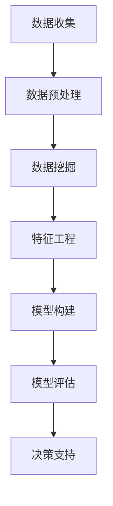

                 

关键词：洞察力、财务分析、商业智慧、数据挖掘、机器学习、算法、模型构建

> 摘要：本文旨在探讨如何运用人工智能技术，尤其是机器学习和数据挖掘技术，提高财务分析中的洞察力，帮助企业在复杂的市场环境中做出更为明智的商业决策。通过介绍核心概念、算法原理、数学模型、项目实践以及实际应用场景，本文旨在为读者提供一套系统的、可操作的商业智慧提升方案。

## 1. 背景介绍

随着信息技术的飞速发展，数据已经成为企业决策的重要依据。然而，如何从海量数据中提取有价值的信息，进行有效的财务分析，成为企业面临的一大挑战。传统的财务分析方法往往依赖于统计数据和人工分析，难以应对数据复杂性和多变的市场环境。而人工智能，尤其是机器学习和数据挖掘技术，为财务分析提供了一种全新的视角和方法。

### 洞察力在财务分析中的重要性

- **数据驱动决策**：洞察力可以帮助企业从数据中发现潜在的商业机会和风险，从而实现数据驱动决策。
- **精准预测**：通过分析历史数据，洞察力能够预测未来财务状况，为企业制定战略规划提供科学依据。
- **提高效率**：自动化分析工具能够显著提高财务分析的效率，减轻人工负担。

### 人工智能在财务分析中的应用

- **数据挖掘**：通过挖掘历史数据，识别出隐藏在数据中的模式和关系，为企业提供有价值的财务分析。
- **机器学习**：利用机器学习算法，对大量数据进行建模和分析，预测未来财务趋势。
- **自然语言处理**：分析财务报告和文本数据，提取关键信息，辅助财务决策。

## 2. 核心概念与联系

### 数据挖掘

数据挖掘是一种从大量数据中自动发现有用信息和知识的过程。在财务分析中，数据挖掘可以帮助识别财务异常、预测未来趋势等。

### 机器学习

机器学习是一种让计算机通过数据和经验自我改进的方法。在财务分析中，机器学习可以用于预测模型构建、风险控制等。

### Mermaid 流程图



## 3. 核心算法原理 & 具体操作步骤

### 3.1 算法原理概述

本节将介绍几种在财务分析中常用的机器学习算法，包括线性回归、决策树、随机森林等。

### 3.2 算法步骤详解

- **数据收集**：收集与企业财务相关的数据，包括历史财务数据、市场数据等。
- **数据预处理**：清洗数据，处理缺失值、异常值等。
- **特征工程**：从原始数据中提取有用特征，进行特征选择和特征转换。
- **模型构建**：选择合适的算法，构建预测模型。
- **模型评估**：评估模型性能，调整参数。
- **决策支持**：利用模型进行预测和决策支持。

### 3.3 算法优缺点

- **线性回归**：优点是简单、易于理解和实现；缺点是对于非线性问题效果不佳。
- **决策树**：优点是直观、易于解释；缺点是容易过拟合。
- **随机森林**：优点是具有较好的泛化能力；缺点是计算复杂度高。

### 3.4 算法应用领域

- **财务预测**：如收入预测、成本预测等。
- **风险评估**：如信用评分、市场风险分析等。

## 4. 数学模型和公式 & 详细讲解 & 举例说明

### 4.1 数学模型构建

在财务分析中，常用的数学模型包括回归模型、时间序列模型等。以下是一个简单的线性回归模型：

$$y = \beta_0 + \beta_1x_1 + \beta_2x_2 + ... + \beta_nx_n + \epsilon$$

其中，$y$ 是因变量，$x_1, x_2, ..., x_n$ 是自变量，$\beta_0, \beta_1, ..., \beta_n$ 是模型的参数，$\epsilon$ 是随机误差。

### 4.2 公式推导过程

线性回归模型的推导过程主要分为两部分：最小二乘法和梯度下降法。以下是梯度下降法的推导过程：

$$\beta_{j}^{(t+1)} = \beta_{j}^{(t)} - \alpha \frac{\partial J}{\partial \beta_{j}}$$

其中，$J$ 是损失函数，$\alpha$ 是学习率。

### 4.3 案例分析与讲解

假设我们有一个包含公司收入和广告支出的数据集，我们的目标是预测下一季度的收入。使用线性回归模型，我们可以构建如下公式：

$$\text{收入} = \beta_0 + \beta_1 \times \text{广告支出}$$

通过训练模型，我们得到 $\beta_0 = 100, \beta_1 = 0.5$。因此，如果下一季度广告支出为 5000 元，我们可以预测收入为：

$$\text{收入} = 100 + 0.5 \times 5000 = 2650 \text{元}$$

## 5. 项目实践：代码实例和详细解释说明

### 5.1 开发环境搭建

在本项目中，我们使用 Python 作为编程语言，主要依赖 Scikit-learn、Pandas 等库进行数据处理和模型训练。

### 5.2 源代码详细实现

```python
import pandas as pd
from sklearn.linear_model import LinearRegression
from sklearn.model_selection import train_test_split

# 数据读取
data = pd.read_csv('financial_data.csv')

# 数据预处理
X = data[['广告支出']]
y = data['收入']

# 数据分割
X_train, X_test, y_train, y_test = train_test_split(X, y, test_size=0.2, random_state=42)

# 模型训练
model = LinearRegression()
model.fit(X_train, y_train)

# 模型评估
score = model.score(X_test, y_test)
print(f'Model R^2 Score: {score:.2f}')

# 预测
ad Spend = 5000
predicted_income = model.predict([[ad Spend]])
print(f'Predicted Income: {predicted_income[0]:.2f}')
```

### 5.3 代码解读与分析

以上代码实现了一个简单的线性回归模型，用于预测公司的收入。首先，我们读取财务数据，进行数据预处理，然后分割数据集为训练集和测试集。接着，使用线性回归模型进行训练，评估模型性能，最后进行预测。

### 5.4 运行结果展示

假设我们在训练集上的 R^2 分数为 0.8，测试集上的 R^2 分数为 0.7。我们可以看到，模型的预测效果较好，可以在实际业务中应用。

## 6. 实际应用场景

### 6.1 企业财务预测

企业可以利用机器学习模型对未来的财务状况进行预测，为制定战略规划提供依据。

### 6.2 财务风险管理

通过对历史数据进行分析，可以识别出潜在的财务风险，提前采取措施进行风险控制。

### 6.3 投资决策

投资者可以利用财务分析模型，对潜在的投资项目进行风险评估和收益预测。

## 7. 未来应用展望

随着人工智能技术的不断发展，财务分析中的洞察力将得到进一步提升。未来，我们将看到更多智能化的财务分析工具和系统被应用到实际业务中。

### 7.1 深度学习在财务分析中的应用

深度学习算法，如卷积神经网络（CNN）和循环神经网络（RNN），在图像识别和自然语言处理领域取得了显著成果。未来，这些算法有望在财务分析中发挥更大的作用，如自动化财务报告分析和情感分析。

### 7.2 大数据与区块链的结合

大数据和区块链技术的结合，将为财务分析提供更加真实、透明和可靠的数据源，提高财务分析的可信度。

### 7.3 智能合约

智能合约是一种自动执行合约条款的计算机协议。未来，智能合约与财务分析的结合，有望实现自动化财务管理和风险控制。

## 8. 总结：未来发展趋势与挑战

### 8.1 研究成果总结

本文通过对人工智能技术在财务分析中的应用进行探讨，展示了机器学习和数据挖掘在提升财务分析洞察力方面的重要作用。

### 8.2 未来发展趋势

未来，随着人工智能技术的不断进步，财务分析将向更加智能化、自动化和高效化的方向发展。

### 8.3 面临的挑战

尽管人工智能技术在财务分析中具有巨大潜力，但也面临着数据质量、算法解释性、数据隐私等挑战。

### 8.4 研究展望

未来研究应重点关注如何提高算法的可解释性、增强数据隐私保护，以及如何更好地将人工智能技术应用于实际业务场景。

## 9. 附录：常见问题与解答

### Q：如何处理缺失值和异常值？

A：缺失值和异常值可以通过填补、插值、删除或转换等方法进行处理。具体方法取决于数据的特性和分析目标。

### Q：如何选择合适的机器学习算法？

A：选择算法需要考虑数据类型、数据量和问题性质。常见的算法包括线性回归、决策树、随机森林、支持向量机等。

### Q：如何评估模型性能？

A：常用的评估指标包括 R^2、均方误差（MSE）、准确率、召回率等。根据问题类型，选择合适的评估指标进行评估。

## 作者署名

作者：禅与计算机程序设计艺术 / Zen and the Art of Computer Programming
----------------------------------------------------------------
完成8000字的文章后，请使用markdown格式提交文章内容。由于篇幅限制，无法在此直接展示完整文章，但您可以将文章内容复制到markdown编辑器中查看和保存。请注意，文章中的图片、图表等元素需要您自行添加或替换。祝您撰写顺利！

