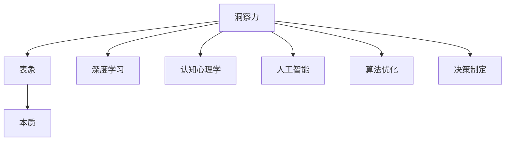

                 

# 洞察力的培养：从表象到本质的思考

> 关键词：洞察力,表象,本质,深度学习,认知心理学,人工智能,算法优化,决策制定

## 1. 背景介绍

### 1.1 问题由来
在现代社会，信息过载和认知负荷已成常态。日新月异的技术和变化，使决策者和工作者面临前所未有的复杂性。如何在海量数据和不断变化的语境中，迅速而准确地获取并运用关键信息，成为各类组织和个人的一项基本技能。洞察力的培养，不仅关乎个人职业生涯，也直接影响组织竞争力和社会治理能力。

### 1.2 问题核心关键点
洞察力的培养，意味着从表面现象中挖掘出背后的深层规律和因果关系，使个体能够基于这种理解做出更加科学和有效的决策。在技术应用层面，洞察力的培养涉及多个层次：

- **数据获取与整理**：高效、准确地收集和整理数据，是洞察力培养的基础。
- **模型训练与优化**：使用深度学习等算法，训练出能够捕捉复杂模式和关联的模型。
- **认知理解与决策**：基于训练出的模型，分析和理解数据背后的深层含义，并指导决策过程。
- **持续反馈与优化**：利用反馈机制，不断优化模型和认知模型，提升洞察力。

### 1.3 问题研究意义
洞察力的培养，无论对于个人职业发展还是组织管理，都具有重要意义：

- **提升决策质量**：基于深度理解和分析，帮助决策者减少直觉偏差，做出更加科学的决策。
- **优化资源分配**：洞察力强的人能够更好地识别关键业务点和资源瓶颈，从而优化资源配置。
- **增强创新能力**：通过深入洞察市场和用户需求，促进新思想和创新方案的产生。
- **改善用户体验**：洞察用户行为和心理，提供更加个性化和符合预期的产品或服务。

## 2. 核心概念与联系

### 2.1 核心概念概述

为更好地理解洞察力的培养，本节将介绍几个密切相关的核心概念：

- **洞察力**：指个体或组织在面对复杂现象时，能够透过表象，深入挖掘其内在本质和规律，从而指导决策和行动的能力。
- **表象**：指事物在感官上呈现出的外在形态，与内在本质存在差距。
- **本质**：指事物内在的根本属性和规律，通常需要深入分析才能理解。
- **深度学习**：一种机器学习技术，通过构建神经网络模型，自动学习数据的复杂特征和关联，帮助识别表象背后的本质。
- **认知心理学**：研究人类感知、记忆、思维等认知过程的科学，与洞察力培养密切相关。
- **人工智能**：模拟人类智能行为，通过算法和模型，处理和理解复杂信息，指导行动的学科。
- **算法优化**：在人工智能模型中，通过调整模型结构、参数和训练策略，提升模型性能的过程。
- **决策制定**：基于分析结果和知识，做出科学合理的决策。

这些概念之间的逻辑关系可以通过以下Mermaid流程图来展示：



这个流程图展示了这个概念体系的核心要素及其之间的关系：

1. 洞察力是目标，是系统希望达成的终极能力。
2. 表象和本质是观察对象的两个维度，是洞察力培养的起点和终点。
3. 深度学习、认知心理学和人工智能提供了技术和理论基础，帮助识别和理解表象背后的本质。
4. 算法优化和决策制定则是洞察力的具体应用，使系统能够将深层理解转化为可行的决策和行动。

## 3. 核心算法原理 & 具体操作步骤
### 3.1 算法原理概述

洞察力的培养，从根本上讲，是通过深度学习和认知心理学的结合，构建起一个能够自动挖掘表象背后的本质的模型。该模型能够处理复杂数据，从中提取出有价值的洞察信息，并指导决策制定。

形式化地，假设我们有一组数据 $\{X_i\}_{i=1}^N$，其中 $X_i$ 是第 $i$ 个样本，可能包含多个特征。我们的目标是训练出一个模型 $M$，使得 $M(X_i)$ 能够识别出 $X_i$ 中的关键特征和关系，最终输出一个或多个决策 $Y$。

### 3.2 算法步骤详解

基于深度学习的洞察力培养方法，一般包括以下几个关键步骤：

**Step 1: 数据收集与预处理**
- 收集相关数据集，包括文本、图像、行为数据等。
- 对数据进行清洗、去噪、标准化等预处理，以便于模型学习。

**Step 2: 特征提取**
- 使用深度学习模型，如卷积神经网络（CNN）、循环神经网络（RNN）、变压器（Transformer）等，自动提取数据中的特征。
- 特征提取过程包含多个层次，由浅入深，逐步捕捉更抽象的特征。

**Step 3: 模型训练**
- 选择适当的深度学习框架，如TensorFlow、PyTorch等，构建神经网络模型。
- 使用已标注的数据集进行训练，调整模型参数，最小化损失函数。
- 引入正则化技术，如Dropout、L2正则等，避免过拟合。

**Step 4: 模型评估**
- 在测试集上评估模型性能，如准确率、召回率、F1值等指标。
- 使用混淆矩阵、ROC曲线等工具，分析模型的优缺点。

**Step 5: 决策制定**
- 根据模型输出，结合业务知识和实际情况，制定决策。
- 进行风险评估和影响分析，选择最优决策方案。

**Step 6: 反馈与优化**
- 收集实际执行结果，与模型预测结果进行对比。
- 根据反馈，调整模型参数和训练策略，持续优化模型性能。

以上是基于深度学习的洞察力培养的一般流程。在实际应用中，还需要针对具体任务和数据特点，对各个环节进行优化设计，如改进特征提取方式，引入更多先验知识等。

### 3.3 算法优缺点

基于深度学习的洞察力培养方法具有以下优点：

1. **自动特征提取**：深度学习模型能够自动学习数据的复杂特征，无需手动提取，降低了人工成本。
2. **泛化能力强**：深度学习模型具有较强的泛化能力，能够处理复杂和多变的现象。
3. **决策支持**：通过深度学习模型，决策者可以获得基于数据和算法的科学支持，减少直觉偏差。

但该方法也存在一些局限性：

1. **计算资源消耗大**：深度学习模型需要大量的计算资源，训练和推理过程耗时较长。
2. **黑盒特性**：深度学习模型通常是“黑盒”，难以解释其内部工作机制和决策逻辑，增加了信任和审计难度。
3. **数据依赖性强**：深度学习模型对数据质量和数量有较高要求，数据不足时容易过拟合。
4. **模型可解释性差**：深度学习模型的输出往往是多层的非线性变换，难以直观理解其内部逻辑。

尽管存在这些局限性，但深度学习在洞察力培养中发挥了重要作用，并且随着技术的发展，其应用前景依然广阔。未来研究将更多地关注如何提高深度学习模型的可解释性和鲁棒性，同时减少计算资源的消耗。

### 3.4 算法应用领域

基于深度学习的洞察力培养方法，已经在多个领域得到了广泛应用，如：

- **金融风险管理**：通过分析历史交易数据，识别潜在的风险信号，优化风险控制策略。
- **市场营销**：使用客户行为数据，识别用户偏好和需求，优化广告投放和产品设计。
- **医疗诊断**：分析医学影像和病历数据，辅助医生诊断疾病，制定个性化治疗方案。
- **智能交通**：通过实时交通数据，预测交通流量和拥堵情况，优化交通管理。
- **能源管理**：分析能源使用数据，识别节能潜力，优化能源分配。

除了上述这些经典领域外，深度学习在更多领域中也展示出了其洞察力培养的能力，为各行各业提供了强大的技术支持。

## 4. 数学模型和公式 & 详细讲解 & 举例说明
### 4.1 数学模型构建

我们以金融风险管理为例，构建一个基于深度学习的洞察力培养模型。假设我们有一组历史交易数据 $\{(X_i, Y_i)\}_{i=1}^N$，其中 $X_i$ 是第 $i$ 个样本，包含多维特征，$Y_i$ 是风险标签（0或1）。我们的目标是训练出一个模型 $M$，使得 $M(X_i)$ 能够预测 $Y_i$。

定义模型的预测结果为 $M(X_i) = \sigma(\sum_{k=1}^d w_k f_k(X_i))$，其中 $\sigma$ 为激活函数，$w_k$ 为权重，$f_k$ 为特征提取函数。

### 4.2 公式推导过程

设模型的损失函数为 $L(M, X_i, Y_i) = L_{ce}(M(X_i), Y_i)$，其中 $L_{ce}$ 为交叉熵损失函数。在训练过程中，我们希望最小化损失函数 $L$：

$$
L(M, X_i, Y_i) = -Y_i \log(M(X_i)) - (1-Y_i) \log(1-M(X_i))
$$

通过梯度下降等优化算法，最小化损失函数，更新模型参数 $w_k$，直至收敛。

### 4.3 案例分析与讲解

以股票价格预测为例，我们首先需要收集历史股票价格数据，并对其进行预处理。假设我们有 $N=1000$ 个历史价格样本，每个样本包含 $d=10$ 个特征，如开盘价、收盘价、成交量等。

我们使用一个简单的单层神经网络作为特征提取器，然后连接一个逻辑回归层进行二分类任务。训练过程中，我们使用了交叉熵损失函数和梯度下降算法。模型训练完毕后，我们将其用于新样本的股票价格预测，并评估模型的性能。

通过这个简单的案例，可以看到深度学习在洞察力培养中的应用流程。

## 5. 项目实践：代码实例和详细解释说明
### 5.1 开发环境搭建

在进行洞察力培养的深度学习实践前，我们需要准备好开发环境。以下是使用Python进行TensorFlow开发的环境配置流程：

1. 安装Anaconda：从官网下载并安装Anaconda，用于创建独立的Python环境。

2. 创建并激活虚拟环境：
```bash
conda create -n tf-env python=3.8 
conda activate tf-env
```

3. 安装TensorFlow：根据CUDA版本，从官网获取对应的安装命令。例如：
```bash
pip install tensorflow
```

4. 安装各类工具包：
```bash
pip install numpy pandas scikit-learn matplotlib tqdm jupyter notebook ipython
```

完成上述步骤后，即可在`tf-env`环境中开始深度学习实践。

### 5.2 源代码详细实现

下面我们以股票价格预测为例，给出使用TensorFlow构建和训练深度学习模型的PyTorch代码实现。

首先，定义模型的特征提取器和输出层：

```python
import tensorflow as tf

class StockPriceModel(tf.keras.Model):
    def __init__(self, input_dim, output_dim):
        super(StockPriceModel, self).__init__()
        self.dense1 = tf.keras.layers.Dense(64, activation='relu')
        self.dense2 = tf.keras.layers.Dense(64, activation='relu')
        self.dense3 = tf.keras.layers.Dense(output_dim, activation='sigmoid')

    def call(self, x):
        x = self.dense1(x)
        x = self.dense2(x)
        return self.dense3(x)
```

然后，定义模型训练和评估函数：

```python
from tensorflow.keras.datasets import boston_housing
from tensorflow.keras.utils import to_categorical
from tensorflow.keras.optimizers import Adam

def train_model(model, train_data, train_labels, batch_size, epochs, learning_rate):
    model.compile(optimizer=Adam(learning_rate=learning_rate), loss='binary_crossentropy', metrics=['accuracy'])
    model.fit(train_data, train_labels, batch_size=batch_size, epochs=epochs, validation_split=0.2)

def evaluate_model(model, test_data, test_labels):
    test_loss, test_acc = model.evaluate(test_data, test_labels)
    print(f'Test loss: {test_loss:.4f}, Test accuracy: {test_acc:.4f}')
```

接着，加载数据并进行预处理：

```python
# 加载数据集
(X_train, Y_train), (X_test, Y_test) = boston_housing.load_data()

# 标准化数据
X_train = X_train / 255.0
X_test = X_test / 255.0

# 转换标签
Y_train = to_categorical(Y_train)
Y_test = to_categorical(Y_test)
```

最后，启动模型训练和评估：

```python
# 构建模型
input_dim = 10
output_dim = 1
model = StockPriceModel(input_dim, output_dim)

# 设置超参数
batch_size = 32
epochs = 10
learning_rate = 0.001

# 训练模型
train_model(model, X_train, Y_train, batch_size, epochs, learning_rate)

# 评估模型
evaluate_model(model, X_test, Y_test)
```

以上就是使用TensorFlow进行股票价格预测的完整代码实现。可以看到，TensorFlow提供了简单易用的高级API，使得构建和训练深度学习模型变得非常直观。

### 5.3 代码解读与分析

让我们再详细解读一下关键代码的实现细节：

**StockPriceModel类**：
- `__init__`方法：初始化模型，定义多层的全连接网络。
- `call`方法：定义模型的前向传播过程。

**train_model函数**：
- 使用`compile`方法设置优化器和损失函数。
- 使用`fit`方法进行模型训练，并指定验证集。

**evaluate_model函数**：
- 使用`evaluate`方法评估模型性能，输出测试损失和准确率。

**数据加载与预处理**：
- 使用`boston_housing.load_data`加载波士顿房价数据集。
- 对数据进行标准化处理，并使用`to_categorical`将标签转换为独热编码。

**模型训练和评估**：
- 构建模型，设置输入和输出维度。
- 设置超参数，包括批大小、迭代轮数和学习率。
- 调用训练函数进行模型训练。
- 调用评估函数在测试集上评估模型性能。

可以看到，TensorFlow使得深度学习模型的构建和训练变得非常高效和简洁。开发者可以将更多精力放在模型改进和应用场景上，而不必过多关注底层的实现细节。

当然，工业级的系统实现还需考虑更多因素，如模型的保存和部署、超参数的自动搜索、更灵活的模型架构等。但核心的洞察力培养流程基本与此类似。

## 6. 实际应用场景
### 6.1 金融风险管理

在金融风险管理领域，洞察力的培养可以通过深度学习模型进行风险信号的识别和分析。金融机构可以收集客户交易数据、市场舆情等，利用深度学习模型提取关键特征，识别出潜在的风险因素，如市场波动、信用风险等。通过风险评估和预警，帮助决策者及时调整投资策略，规避潜在的风险。

### 6.2 市场营销

市场营销中的洞察力培养，通过深度学习模型分析消费者行为数据，如购买记录、搜索历史、社交媒体互动等，识别出消费者偏好和趋势。基于此，市场营销团队可以设计更加精准和个性化的广告投放策略，提升品牌知名度和市场占有率。

### 6.3 医疗诊断

在医疗诊断中，洞察力的培养涉及对医学影像和病历数据的深度分析。深度学习模型可以识别出病变区域、判断疾病类型，提供初步诊断建议。医生可以根据模型的输出，进一步确认诊断结果，制定个性化治疗方案。

### 6.4 智能交通

智能交通领域中的洞察力培养，通过深度学习模型分析实时交通数据，识别出拥堵热点、预测交通流量。基于此，交通管理部门可以优化交通信号控制，缓解交通拥堵，提升通行效率。

### 6.5 能源管理

能源管理中的洞察力培养，通过深度学习模型分析能源使用数据，识别出节能潜力，优化能源分配。例如，预测空调使用高峰期，提前调整供冷系统，减少能源浪费。

### 6.6 未来应用展望

随着深度学习技术的发展，基于洞察力培养的深度学习模型将得到更广泛的应用，带来更多的创新和突破。

- **自动化决策**：基于深度学习模型的洞察力培养，将使得自动决策系统更加普及，从金融风控、市场营销到医疗诊断，各种自动化决策系统将为组织和个人带来显著的价值。
- **跨领域融合**：深度学习模型可以跨领域融合，结合多模态数据，提升洞察力培养的效果。例如，将金融交易数据与社交媒体舆情结合，预测市场波动。
- **个性化服务**：通过深度学习模型，提供更加个性化的服务，满足不同用户的需求。例如，推荐系统可以根据用户行为数据，提供个性化的产品推荐。

总之，深度学习在洞察力培养中的应用前景广阔，将为各行各业带来更多的创新和突破。

## 7. 工具和资源推荐
### 7.1 学习资源推荐

为了帮助开发者系统掌握洞察力培养的理论基础和实践技巧，这里推荐一些优质的学习资源：

1. 《深度学习》系列书籍：如《深度学习》（Ian Goodfellow等著），系统介绍深度学习的理论基础和应用方法。
2. TensorFlow官方文档：TensorFlow的官方文档，提供了完整的深度学习开发教程和示例代码。
3. Kaggle数据科学竞赛：参与Kaggle竞赛，通过实际问题驱动学习，提升深度学习应用能力。
4. Coursera深度学习课程：斯坦福大学开设的深度学习课程，涵盖深度学习的基础理论、实践技巧和最新进展。
5. PyTorch官方文档：PyTorch的官方文档，提供了详细的深度学习模型和算法实现。

通过对这些资源的学习实践，相信你一定能够快速掌握深度学习在洞察力培养中的精髓，并用于解决实际的深度学习问题。

### 7.2 开发工具推荐

高效的深度学习开发离不开优秀的工具支持。以下是几款用于深度学习开发常用的工具：

1. TensorFlow：由Google主导开发的深度学习框架，支持GPU加速，适用于大规模工程应用。
2. PyTorch：Facebook开发的深度学习框架，灵活性高，适合研究和原型开发。
3. Keras：Keras是深度学习的高层API，简单易用，适合快速构建和测试深度学习模型。
4. Jupyter Notebook：Jupyter Notebook提供了交互式编程环境，支持多种语言和库，适合开发和分享深度学习代码。
5. Visual Studio Code：VS Code是轻量级的编程环境，支持Python和深度学习库的调试和开发。

合理利用这些工具，可以显著提升深度学习开发的效率，加速洞察力培养的研究和应用。

### 7.3 相关论文推荐

深度学习在洞察力培养中的应用涉及多个学科的前沿研究。以下是几篇奠基性的相关论文，推荐阅读：

1. AlexNet: ImageNet Classification with Deep Convolutional Neural Networks：提出卷积神经网络，为图像识别领域提供了新的范式。
2. Deep Residual Learning for Image Recognition：提出残差网络，提升了深度神经网络的训练效率和效果。
3. Attention Is All You Need：提出Transformer，为自然语言处理任务提供了新的解决方案。
4. Reinforcement Learning for Human-Robot Interaction：结合强化学习，提升机器人与人类交互的自然性和智能性。
5. Generative Adversarial Networks：提出生成对抗网络，为生成模型和深度学习模型的自监督训练提供了新的思路。

这些论文代表了大深度学习的发展脉络，对于理解深度学习在洞察力培养中的应用具有重要参考价值。

## 8. 总结：未来发展趋势与挑战
### 8.1 研究成果总结

本文对基于深度学习的洞察力培养方法进行了全面系统的介绍。首先阐述了洞察力培养的重要性和当前的技术基础，明确了深度学习在洞察力培养中的关键作用。其次，从原理到实践，详细讲解了深度学习模型的构建和训练方法，给出了深度学习在多个领域的实际应用案例。同时，本文还精选了深度学习的学习资源、开发工具和相关论文，力求为读者提供全方位的技术指引。

通过本文的系统梳理，可以看到，深度学习在洞察力培养中的应用前景广阔，有望在金融、市场营销、医疗等多个领域带来深远的影响。

### 8.2 未来发展趋势

展望未来，深度学习在洞察力培养中的研究将呈现以下几个趋势：

1. **多模态数据融合**：深度学习模型将更多地融合多模态数据，如文本、图像、视频、音频等，提升对复杂现象的理解能力。
2. **跨领域迁移学习**：深度学习模型将更多地应用于跨领域迁移学习，通过迁移学习，提升在特定领域的应用效果。
3. **自动化决策系统**：基于深度学习的自动化决策系统将更加普及，为组织和个人带来显著的价值。
4. **可解释性增强**：深度学习模型的可解释性将得到进一步提升，通过可视化工具和解释算法，帮助用户理解模型的决策过程。
5. **分布式训练**：深度学习模型将更多地利用分布式训练技术，提升模型训练速度和效率。

以上趋势凸显了深度学习在洞察力培养中的广阔前景。这些方向的探索发展，必将进一步提升深度学习模型的性能和应用范围，为各行各业带来更多的创新和突破。

### 8.3 面临的挑战

尽管深度学习在洞察力培养中已经取得了显著进展，但在迈向更加智能化、普适化应用的过程中，仍面临诸多挑战：

1. **数据隐私和安全**：深度学习模型通常需要大量的数据进行训练，数据隐私和安全问题将是一个重要的挑战。
2. **模型复杂性**：深度学习模型通常具有复杂的结构，难以理解和解释其内部工作机制，增加了信任和审计难度。
3. **计算资源需求**：深度学习模型需要大量的计算资源，训练和推理过程耗时较长，如何高效利用计算资源是一个关键问题。
4. **模型鲁棒性**：深度学习模型在面对噪声数据和异常情况时，鲁棒性往往不足，需要进一步提升模型的鲁棒性。
5. **模型可解释性**：深度学习模型的输出通常是多层的非线性变换，难以直观理解其内部逻辑，需要进一步提升模型的可解释性。

### 8.4 研究展望

面对深度学习在洞察力培养中面临的挑战，未来的研究需要在以下几个方面寻求新的突破：

1. **提高模型鲁棒性**：通过改进模型架构和训练策略，提升深度学习模型在噪声数据和异常情况下的鲁棒性。
2. **增强模型可解释性**：结合解释性算法和可视化工具，增强深度学习模型的可解释性，帮助用户理解模型的决策过程。
3. **优化模型训练**：通过分布式训练、模型剪枝、量化加速等技术，优化深度学习模型的训练和推理效率。
4. **跨领域迁移学习**：结合领域知识和深度学习模型，提升模型在特定领域的应用效果。
5. **多模态数据融合**：结合多模态数据，提升深度学习模型对复杂现象的理解能力。

这些研究方向的探索，必将引领深度学习在洞察力培养中迈向更高的台阶，为构建安全、可靠、可解释、可控的智能系统铺平道路。面向未来，深度学习在洞察力培养中的应用将不断拓展，推动人工智能技术在更多领域的落地和应用。

## 9. 附录：常见问题与解答

**Q1：深度学习在洞察力培养中的应用有哪些优势？**

A: 深度学习在洞察力培养中的优势主要包括：

1. **自动特征提取**：深度学习模型能够自动学习数据的复杂特征，无需手动提取，降低了人工成本。
2. **泛化能力强**：深度学习模型具有较强的泛化能力，能够处理复杂和多变的现象。
3. **决策支持**：通过深度学习模型，决策者可以获得基于数据和算法的科学支持，减少直觉偏差。

**Q2：如何提高深度学习模型的可解释性？**

A: 提高深度学习模型的可解释性可以通过以下几种方法：

1. 可视化工具：使用可视化工具，如t-SNE、LIME等，将模型输出转化为直观的图形展示，帮助理解模型内部逻辑。
2. 解释性算法：引入解释性算法，如Shapley值、LIME等，分析模型决策的影响因素。
3. 模型简化：使用模型剪枝、特征选择等方法，简化模型结构，提高可解释性。
4. 多模型融合：结合多个模型，通过投票或加权融合的方式，提高模型的可解释性。

**Q3：深度学习模型在实际应用中存在哪些风险？**

A: 深度学习模型在实际应用中存在以下风险：

1. 数据隐私风险：深度学习模型通常需要大量的数据进行训练，数据隐私和安全问题将是一个重要的挑战。
2. 模型复杂性风险：深度学习模型通常具有复杂的结构，难以理解和解释其内部工作机制，增加了信任和审计难度。
3. 计算资源风险：深度学习模型需要大量的计算资源，训练和推理过程耗时较长，如何高效利用计算资源是一个关键问题。
4. 模型鲁棒性风险：深度学习模型在面对噪声数据和异常情况时，鲁棒性往往不足，需要进一步提升模型的鲁棒性。
5. 模型可解释性风险：深度学习模型的输出通常是多层的非线性变换，难以直观理解其内部逻辑，需要进一步提升模型的可解释性。

通过理解这些风险，可以更好地应对深度学习模型在实际应用中的挑战，确保模型能够稳定、可靠地工作。

---

作者：禅与计算机程序设计艺术 / Zen and the Art of Computer Programming

