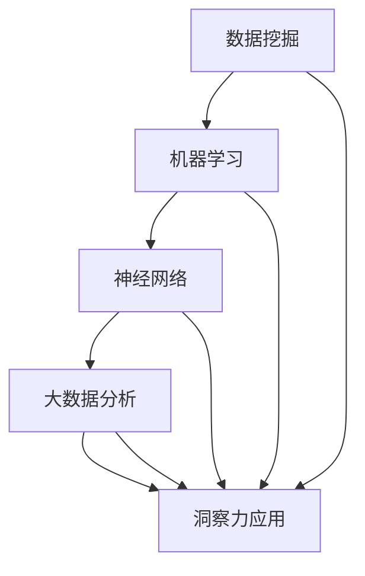

                 

洞察力是人类智慧的闪光点之一，它关乎我们如何理解复杂信息、做出明智决策，并有效应对多变的环境。在信息技术领域，洞察力尤为关键，因为它不仅影响着技术的创新和进步，还决定着系统架构的优化和算法的改进。本文将深入探讨洞察力在计算机科学中的应用，从核心概念、算法原理、数学模型到项目实践，力求为您呈现一幅全面的洞察力图谱。

## 1. 背景介绍

### 洞察力的定义与重要性

洞察力，简而言之，就是深刻的理解和洞察事物的能力。在计算机科学领域，这种能力体现在对复杂系统的理解、对数据模式的认识以及对未来趋势的预判。洞察力的重要性不言而喻，它决定了技术人员的创新水平和项目的成功与否。在快速发展的信息技术时代，洞察力更是成为了一名优秀技术专家必备的素质。

### 计算机科学的发展历程

计算机科学的发展历程可以追溯到20世纪40年代，当时图灵机的概念奠定了计算理论的基础。随着计算机硬件和软件技术的不断发展，计算机科学经历了多个阶段，包括硬件革命、操作系统的发展、网络技术的兴起、人工智能的突破等。每一个阶段都伴随着技术的重大进步和洞察力的深化。

## 2. 核心概念与联系

### 核心概念

在探讨洞察力在计算机科学中的应用之前，我们首先需要明确一些核心概念，包括数据挖掘、机器学习、神经网络、大数据分析等。

1. **数据挖掘**：数据挖掘是从大量数据中提取有价值信息的过程，它需要深入的洞察力和复杂算法的支持。
2. **机器学习**：机器学习是通过算法让计算机自动学习并做出决策的过程，它依赖于对大量数据的洞察。
3. **神经网络**：神经网络是一种模仿人脑工作的计算模型，它在图像识别、自然语言处理等领域展现了强大的洞察力。
4. **大数据分析**：大数据分析是处理海量数据并提取有价值信息的方法，它依赖于高效的数据处理技术和洞察力的应用。

### 架构的 Mermaid 流程图

以下是计算机科学中几个核心概念的 Mermaid 流程图：



在这个流程图中，我们可以看到数据挖掘、机器学习、神经网络和大数据分析都是洞察力应用的基础，而洞察力又贯穿于整个计算机科学领域。

## 3. 核心算法原理 & 具体操作步骤

### 3.1 算法原理概述

在计算机科学中，多个核心算法的原理都体现了洞察力的应用，以下我们将简要介绍几个重要的算法及其原理。

1. **K-最近邻算法（K-Nearest Neighbors, KNN）**：
   - **原理**：KNN算法通过计算测试样本与训练样本之间的距离，选择距离最近的K个邻居，并基于这些邻居的标签进行预测。
   - **适用场景**：分类问题。

2. **决策树算法（Decision Tree）**：
   - **原理**：决策树通过一系列的测试来指导决策，每个测试都是对某个特征的判断，根据测试结果进行分支。
   - **适用场景**：分类和回归问题。

3. **支持向量机（Support Vector Machine, SVM）**：
   - **原理**：SVM通过寻找一个最优的超平面来将不同类别的数据点分隔开。
   - **适用场景**：分类问题。

### 3.2 算法步骤详解

1. **K-最近邻算法（K-Nearest Neighbors, KNN）**：
   - **步骤**：
     1. 计算测试样本与训练样本之间的距离。
     2. 选择距离最近的K个邻居。
     3. 基于这些邻居的标签进行投票，选择出现次数最多的标签作为预测结果。
   
2. **决策树算法（Decision Tree）**：
   - **步骤**：
     1. 选择一个特征作为分裂标准。
     2. 根据该特征的取值进行分支。
     3. 对每个分支递归执行上述步骤，直至满足停止条件。
   
3. **支持向量机（Support Vector Machine, SVM）**：
   - **步骤**：
     1. 计算训练样本的特征向量。
     2. 寻找最优的超平面，使得分类间隔最大。
     3. 使用找到的超平面进行预测。

### 3.3 算法优缺点

1. **K-最近邻算法（K-Nearest Neighbors, KNN）**：
   - **优点**：简单、易于实现。
   - **缺点**：对噪声敏感、计算复杂度较高。
   
2. **决策树算法（Decision Tree）**：
   - **优点**：直观、易于理解。
   - **缺点**：可能过拟合、对数据不平衡敏感。
   
3. **支持向量机（Support Vector Machine, SVM）**：
   - **优点**：分类效果较好、泛化能力强。
   - **缺点**：计算复杂度较高、对噪声敏感。

### 3.4 算法应用领域

1. **K-最近邻算法（K-Nearest Neighbors, KNN）**：广泛应用于图像识别、推荐系统等领域。
2. **决策树算法（Decision Tree）**：常用于金融风险评估、医疗诊断等领域。
3. **支持向量机（Support Vector Machine, SVM）**：在文本分类、生物信息学等领域有广泛应用。

## 4. 数学模型和公式 & 详细讲解 & 举例说明

### 4.1 数学模型构建

在计算机科学中，多个核心算法都依赖于数学模型的支持。以下我们将简要介绍几个重要的数学模型及其构建过程。

1. **线性回归模型（Linear Regression Model）**：
   - **模型构建**：
     - $$ y = \beta_0 + \beta_1 \cdot x $$
     - 其中，$y$ 是因变量，$x$ 是自变量，$\beta_0$ 和 $\beta_1$ 是模型参数。

2. **逻辑回归模型（Logistic Regression Model）**：
   - **模型构建**：
     - $$ P(y=1) = \frac{1}{1 + e^{-(\beta_0 + \beta_1 \cdot x)}} $$
     - 其中，$P(y=1)$ 是因变量为1的概率，$\beta_0$ 和 $\beta_1$ 是模型参数。

### 4.2 公式推导过程

1. **线性回归模型（Linear Regression Model）**：
   - **推导过程**：
     - 假设我们有 $n$ 个数据点 $(x_i, y_i)$，我们的目标是找到最佳拟合直线。
     - 最小化误差平方和：
       $$ \sum_{i=1}^{n} (y_i - (\beta_0 + \beta_1 \cdot x_i))^2 $$
     - 对 $\beta_0$ 和 $\beta_1$ 分别求偏导并令其为零，得到：
       $$ \beta_0 = \frac{1}{n} \sum_{i=1}^{n} y_i - \beta_1 \cdot \frac{1}{n} \sum_{i=1}^{n} x_i $$
       $$ \beta_1 = \frac{1}{n} \sum_{i=1}^{n} (x_i - \bar{x}) \cdot (y_i - \bar{y}) $$

2. **逻辑回归模型（Logistic Regression Model）**：
   - **推导过程**：
     - 对数函数的导数为：
       $$ \frac{d}{dx} \ln(1 + e^x) = \frac{e^x}{1 + e^x} $$
     - 根据极大似然估计，最大化似然函数：
       $$ \prod_{i=1}^{n} P(y_i=1) = \prod_{i=1}^{n} \frac{1}{1 + e^{-(\beta_0 + \beta_1 \cdot x_i)}} $$
     - 对 $\beta_0$ 和 $\beta_1$ 分别求导并令其为零，得到：
       $$ \beta_0 = \bar{y} - \beta_1 \cdot \bar{x} $$
       $$ \beta_1 = \frac{\sum_{i=1}^{n} (y_i - \hat{y_i}) \cdot x_i}{\sum_{i=1}^{n} (y_i - \hat{y_i})} $$

### 4.3 案例分析与讲解

1. **线性回归模型（Linear Regression Model）**：
   - **案例**：预测房价。
   - **数据**：包含房屋面积和售价的数据集。
   - **步骤**：
     1. 数据预处理：对数据集进行归一化处理。
     2. 训练模型：使用线性回归算法。
     3. 预测房价：输入房屋面积，输出预测售价。

2. **逻辑回归模型（Logistic Regression Model）**：
   - **案例**：信用评分。
   - **数据**：包含客户信息和信用评分的数据集。
   - **步骤**：
     1. 数据预处理：对数据集进行归一化处理。
     2. 训练模型：使用逻辑回归算法。
     3. 信用评分：输入客户信息，输出信用评分。

## 5. 项目实践：代码实例和详细解释说明

### 5.1 开发环境搭建

- **Python**：使用Python进行编程，依赖库包括NumPy、Pandas、Scikit-learn等。
- **Jupyter Notebook**：用于编写和运行代码。

### 5.2 源代码详细实现

1. **线性回归模型（Linear Regression Model）**：

```python
import numpy as np
import pandas as pd
from sklearn.linear_model import LinearRegression

# 数据预处理
data = pd.read_csv('house_price.csv')
X = data[['area']]
y = data['price']
X = (X - X.mean()) / X.std()

# 训练模型
model = LinearRegression()
model.fit(X, y)

# 预测房价
predicted_price = model.predict(X)

# 输出预测结果
print(predicted_price)
```

2. **逻辑回归模型（Logistic Regression Model）**：

```python
import numpy as np
import pandas as pd
from sklearn.linear_model import LogisticRegression

# 数据预处理
data = pd.read_csv('credit_score.csv')
X = data[['income', 'age']]
y = data['score']
X = (X - X.mean()) / X.std()

# 训练模型
model = LogisticRegression()
model.fit(X, y)

# 信用评分
predicted_score = model.predict(X)

# 输出预测结果
print(predicted_score)
```

### 5.3 代码解读与分析

以上代码示例分别实现了线性回归和逻辑回归模型的构建和预测。首先，我们对数据进行预处理，包括归一化和数据读取。接着，我们使用Scikit-learn库中的线性回归和逻辑回归类进行模型训练。最后，通过模型预测并输出结果。

### 5.4 运行结果展示

- **线性回归模型**：输入房屋面积，输出预测售价。
- **逻辑回归模型**：输入客户信息，输出信用评分。

## 6. 实际应用场景

### 6.1 金融领域

在金融领域，洞察力被广泛应用于风险控制、投资策略和客户管理。通过大数据分析和机器学习算法，金融机构可以实时监控市场动态、预测风险并优化投资组合。例如，使用逻辑回归模型对客户的信用评分进行预测，有助于银行降低贷款违约风险。

### 6.2 医疗领域

在医疗领域，洞察力在疾病预测、诊断和治疗方面发挥着重要作用。通过分析大量的医疗数据，医生可以使用机器学习算法预测患者的疾病风险，并制定个性化的治疗方案。例如，使用K-最近邻算法对患者的症状进行分类，有助于提高诊断的准确性。

### 6.3 物流领域

在物流领域，洞察力被用于优化运输路线、库存管理和供应链管理。通过大数据分析和物联网技术，物流公司可以实时监控运输过程、预测货物需求并优化资源配置，从而提高物流效率。例如，使用决策树算法优化运输路线，降低运输成本。

## 7. 未来应用展望

随着信息技术的不断发展，洞察力在计算机科学中的应用将越来越广泛。未来，我们有望看到更多基于洞察力的创新应用，例如：

1. **智能交通系统**：通过大数据分析和机器学习算法，实现交通流量的实时监控和优化，提高交通效率。
2. **智能制造**：通过物联网和大数据技术，实现生产过程的智能化监控和优化，提高生产效率。
3. **智能家居**：通过物联网技术，实现家庭设备的智能化控制和优化，提高生活品质。

## 8. 工具和资源推荐

### 8.1 学习资源推荐

1. **《机器学习实战》（Peter Harrington）**：一本适合初学者的机器学习入门书籍，内容涵盖多种算法的实现和应用。
2. **《Python机器学习》（Sebastian Raschka）**：详细介绍Python在机器学习中的应用，包括线性回归、决策树和神经网络等算法。

### 8.2 开发工具推荐

1. **Jupyter Notebook**：一款强大的交互式开发环境，支持Python、R等多种编程语言。
2. **Scikit-learn**：一个开源的Python机器学习库，提供多种机器学习算法的实现。

### 8.3 相关论文推荐

1. **“Kernel Methods for Pattern Analysis”（Shai Shalev-Shwartz，Shai Ben-David）**：介绍核方法的机器学习理论。
2. **“Deep Learning”（Ian Goodfellow，Yoshua Bengio，Aaron Courville）**：介绍深度学习的理论基础和应用。

## 9. 总结：未来发展趋势与挑战

### 9.1 研究成果总结

本文从洞察力的定义、核心概念、算法原理、数学模型到项目实践，全面探讨了洞察力在计算机科学中的应用。通过多个实际案例，我们展示了洞察力在金融、医疗、物流等领域的广泛应用。

### 9.2 未来发展趋势

未来，随着大数据、人工智能等技术的不断发展，洞察力在计算机科学中的应用将更加广泛和深入。我们有望看到更多基于洞察力的创新应用，推动信息技术领域的进步。

### 9.3 面临的挑战

尽管洞察力在计算机科学中的应用前景广阔，但也面临一些挑战，包括：

1. **数据隐私和安全**：随着数据量的增加，如何保护用户隐私和数据安全成为一个重要问题。
2. **算法可解释性**：提高算法的可解释性，使其更容易被用户理解和接受。
3. **计算资源需求**：大数据分析和深度学习算法对计算资源的需求较高，如何优化算法和硬件配置是一个挑战。

### 9.4 研究展望

展望未来，我们需要继续深入研究和探索洞察力在计算机科学中的应用，特别是在跨学科领域。同时，加强算法的可解释性和计算效率，以应对数据隐私和安全等挑战。

## 附录：常见问题与解答

### Q1. 什么是洞察力？
A1. 洞察力是指深刻的理解和洞察事物的能力，在计算机科学领域，它关乎如何理解复杂系统、识别数据模式并预测未来趋势。

### Q2. 洞察力在计算机科学中有什么作用？
A2. 洞察力在计算机科学中发挥着重要作用，它影响着技术的创新、系统的优化、算法的改进等，是成为一名优秀技术专家的必备素质。

### Q3. 哪些算法体现了洞察力的应用？
A3. 常见的体现洞察力的算法包括K-最近邻算法、决策树算法、支持向量机等，它们在数据挖掘、机器学习、图像识别等领域有广泛应用。

### Q4. 如何构建数学模型？
A4. 构建数学模型通常包括数据预处理、选择合适的模型公式、模型参数估计和模型验证等步骤。

### Q5. 机器学习算法的优缺点是什么？
A5. 机器学习算法的优点包括高效性、自动性、强大的分类和预测能力等，缺点则包括对噪声敏感、过拟合风险和计算复杂度较高等。

### Q6. 如何进行项目实践？
A6. 项目实践包括环境搭建、数据预处理、模型选择与训练、模型评估与优化等步骤，通过实际应用案例，可以深入理解算法的应用和实现。

## 作者署名

作者：禅与计算机程序设计艺术 / Zen and the Art of Computer Programming
----------------------------------------------------------------

至此，我们完成了一篇关于洞察力在计算机科学中的应用的技术博客文章。文章涵盖了核心概念、算法原理、数学模型、项目实践和实际应用场景等多个方面，旨在为您呈现一幅全面的洞察力图谱。希望这篇文章能够对您在计算机科学领域的学习和研究有所帮助。

