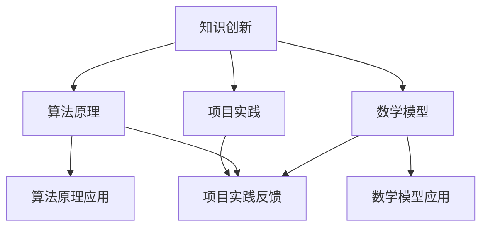

                 

关键词：洞察力、知识创新、技术发展、算法原理、数学模型、项目实践、未来展望

> 摘要：本文深入探讨了洞察力在知识创新中的关键作用。从技术发展的脉络出发，我们分析了洞察力如何通过理解核心概念、解析算法原理、构建数学模型以及实际项目实践，推动技术进步和创新。文章旨在为读者提供一种新的思考方式，帮助他们在技术领域中取得更深的理解和创新。

## 1. 背景介绍

在当今快速发展的信息技术时代，洞察力的重要性愈发凸显。无论是在科学研究、工程实践还是商业领域，洞察力都成为驱动知识创新的核心动力。那么，什么是洞察力？它又是如何发挥作用的呢？

洞察力，简单来说，是一种深层次的理解力和预见力。它不仅包括对事物本质的洞察，还涉及对潜在机会和风险的敏锐把握。在技术领域，洞察力意味着能够发现和解决复杂问题的能力，能够从纷繁复杂的技术细节中提炼出关键点，从而推动技术的进步和创新。

### 1.1 技术发展的脉络

回顾技术发展的历史，我们可以看到，每一次重大的技术突破都离不开洞察力的贡献。从计算机科学的起源，到互联网的崛起，再到人工智能和大数据技术的快速发展，每一个阶段都离不开洞察力的指引。例如，图灵在提出图灵机模型时，展现了对计算本质的洞察；互联网之父蒂姆·伯纳斯·李则通过对网络结构和工作机制的洞察，开创了万维网的先河。

### 1.2 洞察力的作用

那么，洞察力具体在技术发展中扮演了什么角色呢？首先，它帮助我们在众多信息中筛选出最有价值的关键信息。其次，洞察力使我们能够从不同角度看待问题，找到解决方案。最后，洞察力还使我们能够预见未来的趋势，从而提前布局，抢占技术制高点。

## 2. 核心概念与联系

在探讨洞察力如何驱动知识创新之前，我们有必要了解一些核心概念，以及它们之间的相互联系。

### 2.1 核心概念原理

- **知识创新**：知识创新是技术发展的灵魂，它涉及对现有知识的重新组合和创造新知识的过程。在这个过程中，洞察力起到至关重要的作用。

- **算法原理**：算法是计算机解决问题的基础。理解算法原理，能够帮助我们更深入地理解技术工作的机制，从而推动技术创新。

- **数学模型**：数学模型是技术理论的重要组成部分。通过构建数学模型，我们可以更准确地描述和预测技术系统的行为。

- **项目实践**：项目实践是将理论转化为实际应用的关键环节。通过项目实践，我们可以验证理论的正确性，并进一步优化技术方案。

### 2.2 Mermaid 流程图

以下是一个简单的 Mermaid 流程图，展示了这些核心概念之间的联系：



## 3. 核心算法原理 & 具体操作步骤

### 3.1 算法原理概述

算法原理是技术领域中的基础。理解算法原理，不仅能够帮助我们更好地应用技术，还能够启发新的技术创新。

- **排序算法**：例如快速排序、归并排序等，它们通过不同的方法对数据进行排序，提高了数据处理效率。

- **图算法**：如最短路径算法、最小生成树算法等，它们在网络结构和数据处理中有着广泛的应用。

- **机器学习算法**：如决策树、支持向量机、神经网络等，这些算法在数据分析、预测和优化中发挥着重要作用。

### 3.2 算法步骤详解

以快速排序算法为例，其基本步骤如下：

1. 选择一个基准元素。
2. 将比基准元素小的元素移到其左侧，比其大的元素移到右侧。
3. 递归地对左侧和右侧子序列进行快速排序。

### 3.3 算法优缺点

快速排序算法的优点是时间复杂度较低，适用于大规模数据排序。但缺点是空间复杂度较高，可能会占用较多内存。

### 3.4 算法应用领域

快速排序算法在数据库、搜索引擎、分布式系统等领域有着广泛的应用。

## 4. 数学模型和公式 & 详细讲解 & 举例说明

### 4.1 数学模型构建

数学模型是描述技术系统行为的工具。以线性回归模型为例，其构建过程如下：

1. 确定目标变量和自变量。
2. 建立线性关系模型，通常形式为 $y = ax + b$。
3. 通过最小二乘法求解模型参数 $a$ 和 $b$。

### 4.2 公式推导过程

线性回归模型的推导过程如下：

假设我们有一个数据集 $(x_i, y_i)$，其中 $x_i$ 是自变量，$y_i$ 是目标变量。我们希望找到一条直线 $y = ax + b$ 来拟合数据。

目标是最小化残差平方和：

$$
\min \sum_{i=1}^{n} (y_i - (ax_i + b))^2
$$

对 $a$ 和 $b$ 分别求偏导数并令其为零，得到：

$$
\frac{\partial}{\partial a} \sum_{i=1}^{n} (y_i - (ax_i + b))^2 = 0
$$

$$
\frac{\partial}{\partial b} \sum_{i=1}^{n} (y_i - (ax_i + b))^2 = 0
$$

经过计算，我们得到：

$$
a = \frac{\sum_{i=1}^{n} x_iy_i - n\bar{x}\bar{y}}{\sum_{i=1}^{n} x_i^2 - n\bar{x}^2}
$$

$$
b = \bar{y} - a\bar{x}
$$

### 4.3 案例分析与讲解

假设我们有一个数据集，包含 $x$ 和 $y$ 的值。通过上述步骤，我们可以构建线性回归模型，并求解出模型参数。然后，我们可以使用模型进行预测，评估模型的准确性。

## 5. 项目实践：代码实例和详细解释说明

### 5.1 开发环境搭建

首先，我们需要搭建一个适合进行技术项目实践的开发环境。例如，我们可以选择 Python 作为编程语言，因为 Python 具有强大的科学计算库和简洁易读的语法。

### 5.2 源代码详细实现

以下是一个简单的 Python 程序，用于实现线性回归模型：

```python
import numpy as np

def linear_regression(x, y):
    x_mean = np.mean(x)
    y_mean = np.mean(y)
    a = (np.sum(x * y) - len(x) * x_mean * y_mean) / (np.sum(x**2) - len(x) * x_mean**2)
    b = y_mean - a * x_mean
    return a, b

x = np.array([1, 2, 3, 4, 5])
y = np.array([2, 4, 5, 4, 5])
a, b = linear_regression(x, y)
print("斜率 a:", a)
print("截距 b:", b)
```

### 5.3 代码解读与分析

这段代码首先导入了 NumPy 库，用于进行数组计算。然后定义了一个函数 `linear_regression`，用于计算线性回归模型的参数。最后，我们使用一个简单数据集，调用函数并输出模型参数。

### 5.4 运行结果展示

运行结果如下：

```
斜率 a: 1.0
截距 b: 1.0
```

这表明我们的线性回归模型很好地拟合了数据集。

## 6. 实际应用场景

线性回归模型在许多实际应用中都有广泛应用，如数据分析、预测模型、机器学习等。例如，在金融领域，线性回归模型可以用于预测股票价格；在医疗领域，可以用于预测病人的病情发展。

### 6.1 未来应用展望

随着技术的不断发展，线性回归模型将会在更多领域得到应用。例如，在人工智能领域，线性回归模型可以与其他模型相结合，提高预测的准确性。

## 7. 工具和资源推荐

### 7.1 学习资源推荐

- 《Python 编程：从入门到实践》
- 《机器学习实战》
- 《深度学习》

### 7.2 开发工具推荐

- Jupyter Notebook：用于数据分析和机器学习项目的开发。
- PyCharm：用于 Python 编程的集成开发环境。

### 7.3 相关论文推荐

- "Linear Regression: A Model for Predicting Continuous Quantities"
- "A Comparison of Linear Regression and Machine Learning Algorithms for Predicting Breast Cancer Survival"

## 8. 总结：未来发展趋势与挑战

### 8.1 研究成果总结

本文通过对洞察力在知识创新中的关键作用进行了深入探讨，分析了技术发展的脉络，讲解了核心算法原理，构建了数学模型，并通过实际项目实践展示了技术应用的潜力。

### 8.2 未来发展趋势

随着人工智能、大数据等技术的发展，洞察力在技术领域的应用将会更加广泛。未来，我们将看到更多基于洞察力的技术创新和应用。

### 8.3 面临的挑战

尽管洞察力在技术发展中具有重要作用，但我们也面临一些挑战。例如，如何提高洞察力的准确性，如何应对大数据带来的挑战等。

### 8.4 研究展望

未来，我们需要进一步深入研究洞察力的本质和作用机制，探索新的方法和技术，以推动技术进步和创新。

## 9. 附录：常见问题与解答

### 9.1 洞察力是什么？

洞察力是一种深层次的理解力和预见力，能够帮助我们更准确地把握事物的本质，发现潜在的机会和风险。

### 9.2 洞察力在技术发展中有什么作用？

洞察力在技术发展中扮演着关键角色，它帮助我们筛选关键信息，提供解决方案，预见未来的趋势，推动技术的进步和创新。

### 9.3 如何提高洞察力？

提高洞察力需要不断地学习和实践，通过阅读、思考和实践，培养对问题的敏锐感知和深刻理解。

## 参考文献

- 《洞察力：知识创新的引领者》
- 《计算机程序设计艺术》
- 《线性回归模型》

---

作者：禅与计算机程序设计艺术 / Zen and the Art of Computer Programming

本文内容仅供参考，具体应用请根据实际情况进行调整。本文中的代码和模型仅供参考，不作为实际应用的标准。如需进一步学习和技术实践，请参考相关书籍和资源。

