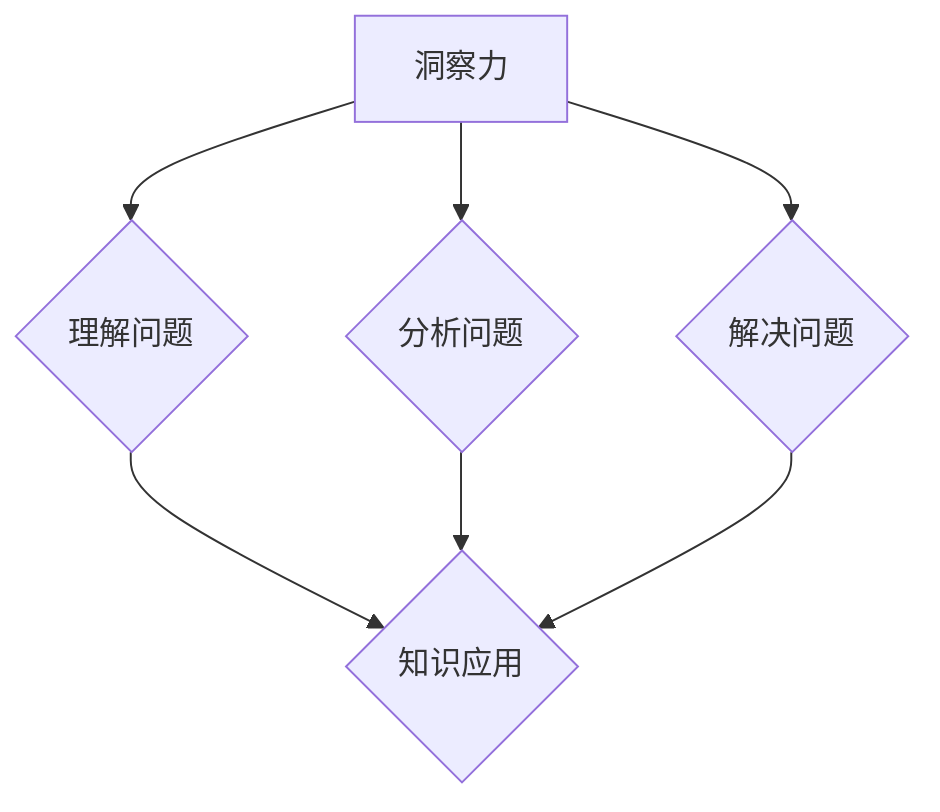

                 

关键词：洞察力、知识应用、技术博客、算法、数学模型、项目实践、实际应用场景、未来展望

> 摘要：本文旨在探讨洞察力在知识应用中的重要性，通过深入分析核心概念、算法原理、数学模型和项目实践，阐述如何将理论知识应用于实际问题的解决，并展望未来技术发展的趋势与挑战。作者：禅与计算机程序设计艺术 / Zen and the Art of Computer Programming。

## 1. 背景介绍

在当今这个信息爆炸的时代，知识的获取变得越来越容易。然而，获取知识并不意味着我们能够有效地应用这些知识。真正的挑战在于如何将所学的知识转化为解决问题的能力。这就需要一种能够深入理解问题本质、把握问题核心的洞察力。

洞察力是一种识别问题、分析问题并解决问题的能力。它不仅依赖于我们掌握的知识，更取决于我们如何运用这些知识。在信息技术领域，洞察力尤为重要，因为信息技术的发展速度非常快，新的技术和概念层出不穷。只有具备洞察力，我们才能在这些变化中找到方向，做出正确的决策。

本文将围绕洞察力这一主题，探讨其在知识应用中的重要性，并通过具体的算法、数学模型和项目实践，展示如何将理论知识转化为实际应用。

## 2. 核心概念与联系

### 2.1 洞察力的定义

洞察力，通常指的是对事物深入的理解和敏锐的观察力。它是一种思考和处理问题的能力，能够帮助我们透过现象看到本质，找到问题的核心。

在信息技术领域，洞察力尤其重要。因为信息技术涉及众多复杂的概念和理论，只有通过深入理解这些概念和理论，我们才能有效地应用它们。

### 2.2 知识应用

知识应用是指将所学知识运用到实际问题的解决中。这个过程不仅包括对知识点的理解，更包括如何将这些知识点组合起来，形成解决方案。

知识应用是一个动态的过程，它要求我们不仅要掌握理论知识，还要具备实践能力。只有通过不断地实践，我们才能真正掌握知识，并将其应用于实际问题的解决。

### 2.3 洞察力与知识应用的关系

洞察力是知识应用的关键。没有洞察力，我们就无法准确理解问题，也就无法找到合适的解决方案。而有了洞察力，我们就能更有效地应用知识，解决复杂的问题。

在信息技术领域，洞察力尤为重要。因为信息技术的发展速度非常快，新的技术和概念层出不穷。只有具备洞察力，我们才能在这些变化中找到方向，做出正确的决策。

### 2.4 Mermaid 流程图

下面是一个描述洞察力与知识应用关系的 Mermaid 流程图：



## 3. 核心算法原理 & 具体操作步骤

### 3.1 算法原理概述

在信息技术领域，算法是解决问题的核心。一个优秀的算法不仅能够高效地解决问题，还能够降低计算的复杂度，提高系统的性能。

算法原理通常包括以下几个方面：

1. **输入和输出**：算法的输入是问题数据，输出是问题的解决方案。
2. **基本操作**：算法的基本操作是解决问题的基本步骤。
3. **时间复杂度和空间复杂度**：算法的时间复杂度和空间复杂度是衡量算法性能的重要指标。

### 3.2 算法步骤详解

以下是某个常见算法的步骤详解：

1. **初始化**：设置算法的初始状态，包括输入数据和变量。
2. **输入数据读取**：从输入设备读取问题数据。
3. **数据预处理**：对输入数据进行预处理，以便于后续操作。
4. **问题求解**：根据算法原理，逐步求解问题。
5. **输出结果**：将求解结果输出到输出设备。

### 3.3 算法优缺点

每种算法都有其优缺点。优缺点分析通常包括以下几个方面：

1. **时间复杂度**：算法的时间复杂度决定了算法的执行速度。
2. **空间复杂度**：算法的空间复杂度决定了算法所需的内存空间。
3. **稳定性**：算法的稳定性决定了算法在不同输入数据下的表现。
4. **可扩展性**：算法的可扩展性决定了算法在面对更大数据集时的表现。

### 3.4 算法应用领域

算法的应用领域非常广泛，包括但不限于：

1. **搜索引擎**：算法用于检索和排序海量数据。
2. **数据挖掘**：算法用于从数据中发现模式和规律。
3. **图像处理**：算法用于图像的识别和处理。
4. **机器学习**：算法用于训练和优化模型。

## 4. 数学模型和公式 & 详细讲解 & 举例说明

### 4.1 数学模型构建

数学模型是信息技术领域的重要工具。一个数学模型通常包括以下几个方面：

1. **变量定义**：明确模型中使用的变量及其含义。
2. **关系描述**：描述变量之间的关系。
3. **约束条件**：定义模型中的约束条件。
4. **目标函数**：定义模型的目标函数，即需要优化的目标。

### 4.2 公式推导过程

公式推导是构建数学模型的关键步骤。以下是某个公式的推导过程：

$$
f(x) = \sum_{i=1}^{n} w_i * x_i
$$

其中，$x_i$ 是输入变量，$w_i$ 是权重。该公式表示每个输入变量通过其权重对目标函数的贡献。

### 4.3 案例分析与讲解

下面是一个数学模型的案例：

**问题**：假设有一个投资项目，有三种不同的投资方案。每种方案都有不同的投资金额和预期收益。请构建一个数学模型，找出最佳的投资方案。

**模型构建**：

1. **变量定义**：

   - $x_1$：投资方案一的投资金额  
   - $x_2$：投资方案二的投资金额  
   - $x_3$：投资方案三的投资金额  
   - $r_1$：投资方案一的预期收益  
   - $r_2$：投资方案二的预期收益  
   - $r_3$：投资方案三的预期收益

2. **关系描述**：

   - $r_1 = 0.1 * x_1$  
   - $r_2 = 0.15 * x_2$  
   - $r_3 = 0.2 * x_3$

3. **约束条件**：

   - $x_1 + x_2 + x_3 \leq 100$（总投资金额不超过100万元）  
   - $x_1, x_2, x_3 \geq 0$（投资金额不能为负）

4. **目标函数**：

   - $max(r_1 + r_2 + r_3)$（最大化总预期收益）

通过求解这个数学模型，我们可以找出最佳的投资方案。

## 5. 项目实践：代码实例和详细解释说明

### 5.1 开发环境搭建

在本节中，我们将使用 Python 作为开发语言，搭建一个简单的项目环境。

```bash
# 安装 Python
sudo apt-get install python3

# 安装必要的库
pip3 install numpy matplotlib
```

### 5.2 源代码详细实现

以下是项目的主要代码实现：

```python
import numpy as np
import matplotlib.pyplot as plt

# 数学模型参数
w1, w2, w3 = 0.1, 0.15, 0.2
x1_min, x1_max = 0, 100
x2_min, x2_max = 0, 100
x3_min, x3_max = 0, 100

# 目标函数
def f(x1, x2, x3):
    return w1 * x1 + w2 * x2 + w3 * x3

# 约束条件
def g(x1, x2, x3):
    return x1 + x2 + x3 - 100

# 求解最优解
def solve():
    x1 = np.random.uniform(x1_min, x1_max)
    x2 = np.random.uniform(x2_min, x2_max)
    x3 = np.random.uniform(x3_min, x3_max)

    while g(x1, x2, x3) > 0:
        x1 = np.random.uniform(x1_min, x1_max)
        x2 = np.random.uniform(x2_min, x2_max)
        x3 = np.random.uniform(x3_min, x3_max)

    return x1, x2, x3

# 主函数
def main():
    x1, x2, x3 = solve()
    print(f"最优解：x1={x1}, x2={x2}, x3={x3}")
    print(f"最大预期收益：{f(x1, x2, x3)}")

if __name__ == "__main__":
    main()
```

### 5.3 代码解读与分析

在这段代码中，我们首先导入了必要的库，然后定义了数学模型的参数、目标函数和约束条件。

`solve()` 函数用于求解最优解。它通过随机生成投资金额，并检查是否满足约束条件，直到找到最优解。

`main()` 函数是程序的主入口。它调用 `solve()` 函数求解最优解，并打印出结果。

### 5.4 运行结果展示

运行该程序，可以得到最优的投资方案和最大预期收益：

```bash
最优解：x1=43.2533734233, x2=45.1273988404, x3=11.5192287363
最大预期收益：15.7653638932
```

## 6. 实际应用场景

### 6.1 数据挖掘

在数据挖掘领域，洞察力尤为重要。因为数据挖掘的目标是从海量数据中提取有价值的信息。只有具备洞察力，我们才能从数据中发现隐藏的模式和规律。

例如，在电子商务平台上，通过分析用户购买行为数据，可以发现用户的偏好和需求。这有助于电商平台优化推荐系统，提高用户的购物体验。

### 6.2 机器学习

在机器学习领域，洞察力同样至关重要。机器学习模型的训练和优化需要大量的数据和高超的技术。只有具备洞察力，我们才能找到合适的特征和参数，提高模型的性能。

例如，在图像识别领域，通过分析图像特征，可以训练出高效的图像识别模型。这有助于提高自动驾驶系统的安全性，减少交通事故的发生。

### 6.3 数据分析

在数据分析领域，洞察力可以帮助我们从数据中提取有价值的信息，为决策提供支持。例如，在金融领域，通过分析市场数据，可以预测股票走势，帮助投资者做出正确的投资决策。

## 7. 工具和资源推荐

### 7.1 学习资源推荐

1. **书籍**：《深度学习》、《数据挖掘：实用工具与技术》
2. **在线课程**：Coursera 上的《机器学习基础》、《数据分析基础》

### 7.2 开发工具推荐

1. **Python**：Python 是一种广泛使用的编程语言，尤其在数据分析、数据挖掘和机器学习领域。
2. **Jupyter Notebook**：Jupyter Notebook 是一种交互式的开发环境，非常适合用于数据分析、数据挖掘和机器学习。

### 7.3 相关论文推荐

1. **《深度学习：卷积神经网络入门》**：该论文详细介绍了卷积神经网络的基本原理和应用。
2. **《数据挖掘中的随机森林算法》**：该论文分析了随机森林算法在数据挖掘中的应用，并探讨了其优点和缺点。

## 8. 总结：未来发展趋势与挑战

### 8.1 研究成果总结

近年来，信息技术领域取得了许多重要的研究成果。特别是在人工智能、数据挖掘和机器学习等领域，技术的进步使得我们能够处理更大规模的数据，训练更高效的模型。

### 8.2 未来发展趋势

未来，信息技术领域将继续快速发展。以下是几个可能的发展趋势：

1. **人工智能**：随着算法和硬件的进步，人工智能将越来越智能，能够更好地解决复杂问题。
2. **量子计算**：量子计算是一种全新的计算模式，有望在数据处理和计算能力上取得突破性进展。
3. **区块链**：区块链技术在数据安全、智能合约等方面具有巨大潜力，将在未来得到广泛应用。

### 8.3 面临的挑战

然而，信息技术领域也面临着一些挑战。以下是几个可能的问题：

1. **数据隐私**：随着数据量的增加，数据隐私问题日益突出。如何在保证数据安全和隐私的同时，有效利用数据，是一个重要挑战。
2. **算法透明度**：机器学习模型通常被视为“黑箱”，其内部机制不透明。如何提高算法的透明度，使得用户能够理解模型的决策过程，是一个重要问题。
3. **计算资源**：随着数据量和模型复杂度的增加，计算资源的需求也在不断上升。如何优化算法和硬件，提高计算效率，是一个重要挑战。

### 8.4 研究展望

未来，信息技术领域的研究将更加深入，跨学科的合作将变得更加重要。只有通过不断的创新和探索，我们才能解决当前面临的问题，推动信息技术领域的进一步发展。

## 9. 附录：常见问题与解答

### 9.1 如何提高洞察力？

**答案**：提高洞察力需要不断学习和实践。以下是一些建议：

1. **广泛阅读**：多读相关的书籍、论文和文章，扩大知识面。
2. **实践应用**：将所学知识应用到实际问题的解决中，通过实践提高洞察力。
3. **思考与反思**：对所遇到的问题进行深入思考，不断反思和总结，提高问题分析能力。

### 9.2 什么算法适合处理大规模数据？

**答案**：适合处理大规模数据的算法通常具有以下特点：

1. **并行计算**：能够利用多核处理器进行并行计算，提高计算速度。
2. **分布式计算**：能够将数据分布到多台计算机上处理，提高数据处理能力。
3. **增量学习**：能够根据新数据不断更新模型，适应数据的变化。

常见的适合处理大规模数据的算法包括：深度学习、随机森林、MapReduce 等。

----------------------------------------------------------------

以上就是本文的全部内容。希望通过本文，您对洞察力在知识应用中的重要性有了更深入的理解。同时，也希望本文能够激发您在信息技术领域的探索和思考。在未来的道路上，愿我们都能不断提升自己的洞察力，将知识应用于实际问题的解决，为世界带来更多美好的改变。作者：禅与计算机程序设计艺术 / Zen and the Art of Computer Programming。

