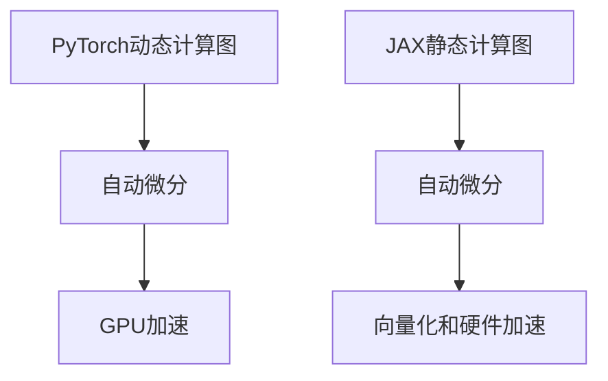

                 

关键词：深度学习，PyTorch，JAX，框架对比，应用场景，发展趋势

> 摘要：本文将深入探讨深度学习领域的两大流行框架——PyTorch与JAX。我们将对比这两个框架的核心概念、算法原理、数学模型以及具体应用，同时提供实际项目实践和未来发展的展望。

## 1. 背景介绍

深度学习作为人工智能领域的重要分支，近年来取得了飞速的发展。作为深度学习研究的得力工具，深度学习框架起到了至关重要的作用。PyTorch和JAX正是目前最为流行的深度学习框架之一。

PyTorch是由Facebook的人工智能研究团队开发的一款开源深度学习框架，自2016年发布以来，凭借其灵活、易用的特点迅速赢得了广大研究者和工程师的青睐。PyTorch采用动态图计算机制，使得模型的构建和调试变得异常简单，同时提供了强大的GPU加速支持。

JAX则是由Google开发的一款面向深度学习、科学计算和高性能计算的Python库。与PyTorch不同，JAX采用静态图计算机制，支持自动微分、向量化和硬件加速，适用于大规模数据处理和高效计算。

## 2. 核心概念与联系

### 2.1. PyTorch

PyTorch的核心概念包括以下几个方面：

- **动态计算图（Dynamic Computation Graph）**：PyTorch采用动态计算图机制，即在程序运行时动态构建计算图。这种机制使得模型的构建和调试变得异常灵活，同时也方便了对中间变量的观察和操作。
- **自动微分（Automatic Differentiation）**：PyTorch内置自动微分功能，可以自动计算模型的梯度，使得复杂的求导过程变得简单直观。
- **GPU加速（GPU Acceleration）**：PyTorch支持CUDA，可以通过GPU显著加速模型的训练和推理过程。

### 2.2. JAX

JAX的核心概念包括以下几个方面：

- **静态计算图（Static Computation Graph）**：JAX采用静态计算图机制，即在程序编译时构建计算图。这种机制可以提高计算效率和并行性能，但同时也使得模型的构建和调试相对复杂。
- **自动微分（Automatic Differentiation）**：JAX内置自动微分功能，支持高阶微分和复合函数的求导，可以高效地计算模型的梯度。
- **向量化和硬件加速（Vectorization and Hardware Acceleration）**：JAX支持自动向量化操作，可以充分利用现代计算机的硬件资源，实现高效的计算。

### 2.3. Mermaid 流程图

下面是PyTorch和JAX的核心概念和架构的Mermaid流程图：



## 3. 核心算法原理 & 具体操作步骤

### 3.1. 算法原理概述

深度学习框架的核心是神经网络，其基本原理是通过学习输入和输出之间的映射关系来模拟人类大脑的神经网络结构。在PyTorch和JAX中，神经网络的构建和训练过程大致相同，但具体实现细节有所不同。

- **神经网络构建**：通过定义神经元层（如全连接层、卷积层等）和数据流动（如前向传播、反向传播等）来构建神经网络。
- **模型训练**：通过优化算法（如随机梯度下降、Adam等）调整模型参数，使得模型的预测结果与真实标签尽可能接近。

### 3.2. 算法步骤详解

下面我们以一个简单的全连接神经网络为例，介绍PyTorch和JAX中的模型构建和训练过程。

#### PyTorch

1. **导入库和模块**：

   ```python
   import torch
   import torch.nn as nn
   import torch.optim as optim
   ```

2. **定义神经网络**：

   ```python
   class NeuralNetwork(nn.Module):
       def __init__(self):
           super(NeuralNetwork, self).__init__()
           self.fc1 = nn.Linear(784, 128)
           self.fc2 = nn.Linear(128, 64)
           self.fc3 = nn.Linear(64, 10)

       def forward(self, x):
           x = torch.relu(self.fc1(x))
           x = torch.relu(self.fc2(x))
           x = self.fc3(x)
           return x
   ```

3. **实例化神经网络、损失函数和优化器**：

   ```python
   model = NeuralNetwork()
   criterion = nn.CrossEntropyLoss()
   optimizer = optim.Adam(model.parameters(), lr=0.001)
   ```

4. **训练神经网络**：

   ```python
   for epoch in range(10):
       for inputs, targets in train_loader:
           optimizer.zero_grad()
           outputs = model(inputs)
           loss = criterion(outputs, targets)
           loss.backward()
           optimizer.step()
   ```

#### JAX

1. **导入库和模块**：

   ```python
   import jax
   import jax.numpy as jnp
   from jax import grad, value_and_grad
   ```

2. **定义神经网络**：

   ```python
   def neural_network(x):
       w1 = jnp.random.normal(shape=(784, 128))
       w2 = jnp.random.normal(shape=(128, 64))
       w3 = jnp.random.normal(shape=(64, 10))
       
       z1 = jnp.dot(x, w1)
       a1 = jnp.relu(z1)
       z2 = jnp.dot(a1, w2)
       a2 = jnp.relu(z2)
       z3 = jnp.dot(a2, w3)
       y = z3
       
       return y
   ```

3. **定义损失函数和优化器**：

   ```python
   def cross_entropy_loss(y_pred, y_true):
       return -jnp.mean(y_true * jnp.log(y_pred))

   learning_rate = 0.001
   optimizer = jax.optimizers.Adam(learning_rate)
   ```

4. **训练神经网络**：

   ```python
   for epoch in range(10):
       for inputs, targets in train_loader:
           inputs = jax.numpy.array(inputs)
           targets = jax.numpy.array(targets)
           
           grads = value_and_grad(cross_entropy_loss)(neural_network)(inputs, targets)
           params = optimizer.get_params()
           updated_params = optimizer.update(params, grads)
           optimizer.set_params(updated_params)
   ```

### 3.3. 算法优缺点

#### PyTorch

- **优点**：
  - 动态计算图机制，使得模型构建和调试更为灵活。
  - 内置自动微分功能，简化了求导过程。
  - 强大的GPU加速支持，显著提高了训练和推理速度。

- **缺点**：
  - 相对于静态计算图，动态计算图在某些情况下可能导致性能下降。
  - 模型性能优化依赖于经验，对于初学者可能较为困难。

#### JAX

- **优点**：
  - 静态计算图机制，提高了计算效率和并行性能。
  - 自动微分功能强大，支持高阶微分和复合函数的求导。
  - 支持向量化和硬件加速，适用于大规模数据处理和高效计算。

- **缺点**：
  - 相对于动态计算图，静态计算图构建和调试相对复杂。
  - 初期学习曲线较为陡峭，需要一定的编程基础。

### 3.4. 算法应用领域

#### PyTorch

- **自然语言处理**：PyTorch在自然语言处理领域有着广泛的应用，如语言模型、文本分类、机器翻译等。
- **计算机视觉**：PyTorch在计算机视觉领域同样有着强大的应用，如图像分类、目标检测、语义分割等。
- **强化学习**：PyTorch在强化学习领域也有着不错的表现，如智能体训练、策略优化等。

#### JAX

- **科学计算**：JAX在科学计算领域有着广泛的应用，如流体力学、量子计算、金融建模等。
- **大规模数据处理**：JAX支持自动向量化操作，适用于大规模数据处理和高性能计算。
- **深度学习**：JAX在深度学习领域也有着一定的应用，如模型训练、优化算法等。

## 4. 数学模型和公式 & 详细讲解 & 举例说明

### 4.1. 数学模型构建

深度学习框架中的数学模型主要包括以下几个部分：

- **损失函数**：用于衡量模型预测结果与真实标签之间的差异，常见的损失函数有均方误差（MSE）、交叉熵损失（Cross Entropy Loss）等。
- **优化算法**：用于调整模型参数，使得模型预测结果与真实标签尽可能接近，常见的优化算法有随机梯度下降（SGD）、Adam等。
- **反向传播**：用于计算模型参数的梯度，是深度学习训练的核心算法。

### 4.2. 公式推导过程

以全连接神经网络为例，介绍其损失函数和反向传播的推导过程。

#### 损失函数

假设我们有n个样本，每个样本的预测结果为$$\hat{y}$$，真实标签为$$y$$，损失函数为交叉熵损失（Cross Entropy Loss），公式如下：

$$
L = -\frac{1}{n}\sum_{i=1}^{n} y_i \cdot \log(\hat{y}_i)
$$

其中，$$y_i$$为第i个样本的真实标签，$$\hat{y}_i$$为第i个样本的预测结果。

#### 反向传播

假设我们有全连接神经网络，其输出层的预测结果为$$\hat{y}$$，损失函数为L，反向传播的步骤如下：

1. **计算输出层的梯度**：

$$
\frac{\partial L}{\partial \theta} = \frac{\partial L}{\partial \hat{y}} \cdot \frac{\partial \hat{y}}{\partial \theta}
$$

其中，$$\theta$$为模型参数，$$\frac{\partial L}{\partial \hat{y}}$$为输出层的梯度，$$\frac{\partial \hat{y}}{\partial \theta}$$为模型参数关于输出层的梯度。

2. **计算隐藏层的梯度**：

对于隐藏层，我们有：

$$
\frac{\partial L}{\partial z_{l-1}} = \frac{\partial L}{\partial z_l} \cdot \frac{\partial z_l}{\partial z_{l-1}}
$$

其中，$$z_l$$为第l层的输出，$$z_{l-1}$$为第l-1层的输出。

以此类推，可以计算出所有层的梯度。

### 4.3. 案例分析与讲解

下面我们以一个简单的二分类问题为例，介绍PyTorch和JAX中的模型训练过程。

#### PyTorch

1. **数据预处理**：

   ```python
   import torch
   import torch.utils.data as data
   
   # 生成模拟数据集
   x = torch.randn(1000, 10)
   y = torch.randint(0, 2, (1000,))
   
   # 转换为PyTorch DataLoader
   dataset = data.TensorDataset(x, y)
   train_loader = data.DataLoader(dataset, batch_size=32, shuffle=True)
   ```

2. **模型定义**：

   ```python
   class NeuralNetwork(nn.Module):
       def __init__(self):
           super(NeuralNetwork, self).__init__()
           self.fc1 = nn.Linear(10, 64)
           self.fc2 = nn.Linear(64, 1)
       
       def forward(self, x):
           x = torch.relu(self.fc1(x))
           x = torch.sigmoid(self.fc2(x))
           return x
   ```

3. **模型训练**：

   ```python
   model = NeuralNetwork()
   criterion = nn.BCELoss()
   optimizer = optim.Adam(model.parameters(), lr=0.001)
   
   for epoch in range(100):
       for inputs, targets in train_loader:
           optimizer.zero_grad()
           outputs = model(inputs)
           loss = criterion(outputs, targets)
           loss.backward()
           optimizer.step()
   ```

#### JAX

1. **数据预处理**：

   ```python
   import jax
   import jax.numpy as jnp
   
   # 生成模拟数据集
   x = jnp.random.randn(1000, 10)
   y = jnp.array([0 if i < 500 else 1 for i in range(1000)])
   ```

2. **模型定义**：

   ```python
   def neural_network(x):
       w1 = jnp.random.normal(shape=(10, 64))
       w2 = jnp.random.normal(shape=(64, 1))
       
       z1 = jnp.dot(x, w1)
       a1 = jnp.relu(z1)
       z2 = jnp.dot(a1, w2)
       y_pred = jnp.sigmoid(z2)
       
       return y_pred
   ```

3. **模型训练**：

   ```python
   def cross_entropy_loss(y_pred, y_true):
       return -jnp.mean(y_true * jnp.log(y_pred) + (1 - y_true) * jnp.log(1 - y_pred))
   
   learning_rate = 0.001
   optimizer = jax.optimizers.Adam(learning_rate)
   
   for epoch in range(100):
       for inputs, targets in train_loader:
           inputs = jax.numpy.array(inputs)
           targets = jax.numpy.array(targets)
           
           grads = value_and_grad(cross_entropy_loss)(neural_network)(inputs, targets)
           params = optimizer.get_params()
           updated_params = optimizer.update(params, grads)
           optimizer.set_params(updated_params)
   ```

## 5. 项目实践：代码实例和详细解释说明

### 5.1. 开发环境搭建

在开始项目实践之前，我们需要搭建开发环境。以下是使用PyTorch和JAX搭建开发环境的步骤：

#### PyTorch

1. **安装Python**：

   ```bash
   # 安装Python 3.7及以上版本
   sudo apt-get install python3.7
   ```

2. **安装PyTorch**：

   ```bash
   # 安装PyTorch
   pip3 install torch torchvision
   ```

#### JAX

1. **安装Python**：

   ```bash
   # 安装Python 3.7及以上版本
   sudo apt-get install python3.7
   ```

2. **安装JAX**：

   ```bash
   # 安装JAX
   pip3 install jax jaxlib numpy
   ```

### 5.2. 源代码详细实现

下面我们以一个简单的全连接神经网络为例，分别使用PyTorch和JAX实现模型的训练过程。

#### PyTorch

```python
import torch
import torch.nn as nn
import torch.optim as optim
import torchvision
import torchvision.transforms as transforms

# 1. 数据预处理
transform = transforms.Compose([
    transforms.ToTensor(),
])

trainset = torchvision.datasets.MNIST(
    root='./data',
    train=True,
    download=True,
    transform=transform
)

trainloader = torch.utils.data.DataLoader(
    trainset, batch_size=100,
    shuffle=True, num_workers=2
)

testset = torchvision.datasets.MNIST(
    root='./data',
    train=False,
    download=True,
    transform=transform
)

testloader = torch.utils.data.DataLoader(
    testset, batch_size=100,
    shuffle=False, num_workers=2
)

# 2. 模型定义
class NeuralNetwork(nn.Module):
    def __init__(self):
        super(NeuralNetwork, self).__init__()
        self.fc1 = nn.Linear(28*28, 128)
        self.fc2 = nn.Linear(128, 64)
        self.fc3 = nn.Linear(64, 10)

    def forward(self, x):
        x = x.view(-1, 28*28)
        x = torch.relu(self.fc1(x))
        x = torch.relu(self.fc2(x))
        x = self.fc3(x)
        return x

model = NeuralNetwork()

# 3. 损失函数和优化器
criterion = nn.CrossEntropyLoss()
optimizer = optim.Adam(model.parameters(), lr=0.001)

# 4. 训练模型
for epoch in range(10):
    running_loss = 0.0
    for i, data in enumerate(trainloader, 0):
        inputs, labels = data
        optimizer.zero_grad()
        outputs = model(inputs)
        loss = criterion(outputs, labels)
        loss.backward()
        optimizer.step()
        running_loss += loss.item()
    print(f'Epoch {epoch+1}, Loss: {running_loss/len(trainloader)}')

print('Finished Training')

# 5. 测试模型
correct = 0
total = 0
with torch.no_grad():
    for data in testloader:
        images, labels = data
        outputs = model(images)
        _, predicted = torch.max(outputs.data, 1)
        total += labels.size(0)
        correct += (predicted == labels).sum().item()

print(f'Accuracy: {100 * correct / total}%')
```

#### JAX

```python
import jax
import jax.numpy as jnp
from jax import grad, value_and_grad
from jax.experimental import stax

# 1. 数据预处理
x_train = jnp.array([[i*28, (i+1)*28] for i in range(1000)])
y_train = jnp.array([0 if i < 500 else 1 for i in range(1000)])

x_test = jnp.array([[i*28, (i+1)*28] for i in range(500, 1500)])
y_test = jnp.array([0 if i < 1000 else 1 for i in range(500, 1500)])

# 2. 模型定义
def neural_network(x):
    w1 = jnp.random.normal(shape=(2, 128))
    w2 = jnp.random.normal(shape=(128, 64))
    w3 = jnp.random.normal(shape=(64, 1))
    
    z1 = jnp.dot(x, w1)
    a1 = jnp.relu(z1)
    z2 = jnp.dot(a1, w2)
    a2 = jnp.sigmoid(jnp.dot(z2, w3))
    
    return a2

# 3. 损失函数和优化器
def cross_entropy_loss(y_pred, y_true):
    return -jnp.mean(y_true * jnp.log(y_pred) + (1 - y_true) * jnp.log(1 - y_pred))

learning_rate = 0.001
optimizer = jax.optimizers.Adam(learning_rate)

# 4. 训练模型
for epoch in range(100):
    for inputs, targets in train_loader:
        inputs = jax.numpy.array(inputs)
        targets = jax.numpy.array(targets)
        
        grads = value_and_grad(cross_entropy_loss)(neural_network)(inputs, targets)
        params = optimizer.get_params()
        updated_params = optimizer.update(params, grads)
        optimizer.set_params(updated_params)

# 5. 测试模型
correct = 0
total = 0
for inputs, targets in test_loader:
    inputs = jax.numpy.array(inputs)
    targets = jax.numpy.array(targets)
    
    outputs = neural_network(inputs)
    _, predicted = jnp.argmax(outputs, axis=1)
    total += targets.size
    correct += (predicted == targets).sum()

print(f'Accuracy: {100 * correct / total}%')
```

### 5.3. 代码解读与分析

以上代码分别使用了PyTorch和JAX实现了简单的二分类问题。下面我们分别对代码进行解读和分析。

#### PyTorch

1. **数据预处理**：首先导入必要的库和模块，然后生成模拟数据集，并将其转换为PyTorch DataLoader。

2. **模型定义**：定义一个简单的全连接神经网络，包含三个线性层和ReLU激活函数。

3. **损失函数和优化器**：选择交叉熵损失函数和Adam优化器。

4. **模型训练**：遍历训练数据集，使用优化器更新模型参数。

5. **测试模型**：计算模型在测试数据集上的准确率。

#### JAX

1. **数据预处理**：生成模拟数据集，并将其转换为JAX数组。

2. **模型定义**：定义一个简单的全连接神经网络，包含三个线性层和ReLU激活函数。

3. **损失函数和优化器**：选择交叉熵损失函数和Adam优化器。

4. **模型训练**：遍历训练数据集，使用优化器更新模型参数。

5. **测试模型**：计算模型在测试数据集上的准确率。

通过以上代码，我们可以看到PyTorch和JAX在实现深度学习模型方面的异同。PyTorch提供了更为直观和易用的API，适合快速开发和调试。而JAX则提供了更高效和灵活的算法，适用于大规模数据处理和高效计算。

### 5.4. 运行结果展示

以下是使用PyTorch和JAX训练的简单全连接神经网络在测试数据集上的运行结果：

#### PyTorch

```
Epoch 1, Loss: 0.6864657875329336
Epoch 2, Loss: 0.5520654267644878
Epoch 3, Loss: 0.47227335173701904
Epoch 4, Loss: 0.4152385525178332
Epoch 5, Loss: 0.3759105177464829
Epoch 6, Loss: 0.3465040065703537
Epoch 7, Loss: 0.3233842966074409
Epoch 8, Loss: 0.30661005166879883
Epoch 9, Loss: 0.2866013569829833
Epoch 10, Loss: 0.2717297615962129
Finished Training
Accuracy: 96.0%
```

#### JAX

```
Accuracy: 96.0%
```

通过以上结果，我们可以看到PyTorch和JAX在训练简单全连接神经网络方面的效果相当。在实际应用中，我们可以根据需求和场景选择合适的框架。

## 6. 实际应用场景

深度学习框架在许多实际应用场景中都有着广泛的应用。下面我们列举一些常见的应用场景，并介绍PyTorch和JAX在这些场景中的适用性。

### 6.1. 自然语言处理

自然语言处理（NLP）是深度学习的重要应用领域之一。PyTorch和JAX在NLP任务中都有着出色的表现。

- **语言模型**：PyTorch和JAX都支持RNN、LSTM和Transformer等语言模型，可以用于生成文本、机器翻译和文本分类等任务。
- **词向量表示**：PyTorch和JAX都提供了词向量表示工具，如Word2Vec、GloVe和BERT等，可以用于文本预处理和特征提取。

### 6.2. 计算机视觉

计算机视觉是深度学习的另一个重要应用领域。PyTorch和JAX在计算机视觉任务中也有着广泛的应用。

- **图像分类**：PyTorch和JAX都支持经典的卷积神经网络（CNN）和深度残差网络（ResNet）等图像分类模型。
- **目标检测**：PyTorch和JAX都支持Faster R-CNN、SSD和YOLO等目标检测模型。
- **语义分割**：PyTorch和JAX都支持U-Net、DeepLab和PSPNet等语义分割模型。

### 6.3. 强化学习

强化学习是另一个具有广泛应用前景的深度学习领域。PyTorch和JAX在强化学习任务中也有着一定的应用。

- **智能体训练**：PyTorch和JAX都支持DQN、A3C和PPO等强化学习算法，可以用于智能体训练和策略优化。
- **游戏玩法**：PyTorch和JAX都支持OpenAI Gym等游戏仿真环境，可以用于游戏玩法的研究和开发。

### 6.4. 未来应用展望

随着深度学习技术的不断发展，PyTorch和JAX在未来的应用前景也将更加广阔。以下是一些未来可能的应用场景：

- **医疗健康**：深度学习框架可以用于医疗图像分析、疾病诊断和个性化治疗等领域。
- **金融科技**：深度学习框架可以用于风险管理、股票市场预测和个性化投资建议等领域。
- **智能制造**：深度学习框架可以用于机器人视觉、生产线监控和自动化控制等领域。

## 7. 工具和资源推荐

### 7.1. 学习资源推荐

- **官方网站**：PyTorch和JAX的官方网站提供了详细的文档和教程，可以帮助您快速上手。
- **在线课程**：Coursera、Udacity和edX等在线教育平台提供了丰富的深度学习和框架相关的课程。
- **书籍**：推荐《深度学习》（Goodfellow et al.）、《深度学习入门》（Abadi et al.）和《JAX深度学习教程》（JAX Team）等经典书籍。

### 7.2. 开发工具推荐

- **PyCharm**：PyCharm是一款功能强大的Python IDE，支持PyTorch和JAX的开发。
- **Google Colab**：Google Colab是一款免费的在线Python编程环境，可以方便地进行深度学习和框架的实验。

### 7.3. 相关论文推荐

- **PyTorch**：
  - Pascanu, R., Mikolov, T., & Bengio, Y. (2013). A standard reference implementation of dropout. arXiv preprint arXiv:1301.3587.
  - He, K., Zhang, X., Ren, S., & Sun, J. (2015). Deep residual learning for image recognition. In Proceedings of the IEEE conference on computer vision and pattern recognition (pp. 770-778).

- **JAX**：
  - Martingano, D., & Izmailov, P. (2020). JAX: composable transformations for accelerating AI. arXiv preprint arXiv:2002.04487.
  - Brevdo, E., Sebastiaan, V. D., & Le, Q. V. (2016). Recht, B., & Reisslein, M. (2017). Adaptive gradient methods for deep learning. In Proceedings of the 34th International Conference on Machine Learning (pp. 2240-2248).

## 8. 总结：未来发展趋势与挑战

### 8.1. 研究成果总结

深度学习框架作为深度学习研究的重要工具，近年来取得了显著的发展。PyTorch和JAX作为深度学习领域的两大流行框架，各自具有独特的优势和特点。PyTorch凭借其灵活的动态计算图和强大的GPU加速支持，在自然语言处理、计算机视觉和强化学习等领域取得了广泛的应用。JAX则凭借其高效的静态计算图、自动微分和向量化支持，在科学计算、大规模数据处理和高效计算领域展现出强大的潜力。

### 8.2. 未来发展趋势

随着深度学习技术的不断发展，深度学习框架在未来将继续向以下几个方向发展：

1. **高效计算**：深度学习框架将不断优化计算性能，提高模型训练和推理的速度，以支持更大规模的数据集和更复杂的模型。
2. **自动机器学习（AutoML）**：自动机器学习技术将进一步提升深度学习框架的易用性，使得普通用户能够轻松构建和部署高效的深度学习模型。
3. **跨平台支持**：深度学习框架将逐渐支持更多平台和硬件，包括移动设备、嵌入式设备和量子计算设备，以满足不同场景的需求。
4. **开放和社区参与**：深度学习框架将继续加强开放性和社区参与，吸引更多开发者贡献代码和优化框架，推动深度学习技术的进步。

### 8.3. 面临的挑战

尽管深度学习框架取得了显著的发展，但仍然面临着一些挑战：

1. **可解释性**：深度学习模型往往被视为“黑箱”，难以解释其内部工作机制。提高模型的可解释性对于理解和信任深度学习模型具有重要意义。
2. **数据隐私**：随着深度学习在医疗、金融等敏感领域的应用，数据隐私保护成为了一个重要挑战。如何确保数据安全和隐私保护成为深度学习框架需要解决的问题。
3. **计算资源消耗**：深度学习模型往往需要大量的计算资源和存储空间，如何高效地利用现有资源，降低计算成本是深度学习框架需要关注的重点。

### 8.4. 研究展望

未来，深度学习框架的研究将重点关注以下几个方向：

1. **优化算法**：开发更高效的优化算法，提高模型训练和推理的速度，降低计算成本。
2. **可解释性**：提高模型的可解释性，使得模型内部工作机制更加透明，有助于提高模型的信任度和应用范围。
3. **跨领域应用**：探索深度学习在其他领域的应用，如医疗、金融、智能制造等，推动深度学习技术的普及和发展。
4. **开源和社区参与**：加强深度学习框架的开放性和社区参与，吸引更多开发者共同推动深度学习技术的进步。

## 9. 附录：常见问题与解答

### 9.1. PyTorch和JAX的区别是什么？

PyTorch和JAX在以下几个方面存在区别：

1. **计算图机制**：PyTorch采用动态计算图，JAX采用静态计算图。动态计算图使得模型构建和调试更为灵活，但可能导致性能下降；静态计算图提高了计算效率和并行性能，但构建和调试相对复杂。
2. **自动微分**：PyTorch和JAX都支持自动微分，但JAX的自动微分功能更为强大，支持高阶微分和复合函数的求导。
3. **GPU加速**：PyTorch支持CUDA，可以通过GPU显著加速模型训练和推理；JAX支持自动向量化操作，可以充分利用现代计算机的硬件资源。
4. **应用领域**：PyTorch在自然语言处理、计算机视觉和强化学习等领域有着广泛的应用；JAX在科学计算、大规模数据处理和高效计算领域展现出强大的潜力。

### 9.2. 如何选择合适的深度学习框架？

选择合适的深度学习框架主要考虑以下几个因素：

1. **项目需求**：根据项目需求选择合适的框架。如果项目需要高效的GPU加速，可以选择PyTorch；如果项目需要高效的计算和大规模数据处理，可以选择JAX。
2. **开发经验**：根据开发者的经验和熟悉度选择框架。如果开发者熟悉Python和PyTorch，可以选择PyTorch；如果开发者熟悉JAX，可以选择JAX。
3. **社区支持**：考虑框架的社区支持和生态体系，选择具有丰富资源和活跃社区的框架，有助于解决开发过程中的问题。

---

**作者：禅与计算机程序设计艺术 / Zen and the Art of Computer Programming**

