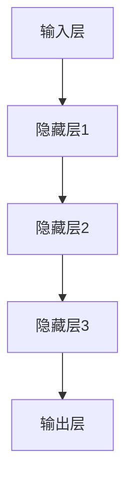

                 

关键词：涌现能力、上下文学习、大模型、神经网络、深度学习、自然语言处理

摘要：本文旨在探讨大模型在涌现能力和上下文学习方面的核心优势。通过分析大模型的结构和工作原理，本文揭示了它们在解决复杂任务中的强大能力，特别是在自然语言处理领域。同时，本文还探讨了大模型在未来的发展方向和面临的挑战。

## 1. 背景介绍

### 1.1 大模型的崛起

随着计算能力的提升和大数据的积累，深度学习领域迎来了大模型的兴起。这些大模型通常拥有数十亿到千亿级别的参数，通过自我学习和自我优化，实现了在各个领域的高度专业化。例如，在自然语言处理领域，大型预训练模型如 GPT-3、BERT 等，已经展示了超越人类水平的表现。

### 1.2 涌现能力

涌现能力是指系统中的元素通过相互作用，产生出原本元素所不具备的新特性。在大模型中，涌现能力表现为模型在学习过程中，能够自动发现并利用复杂数据中的结构，从而实现高效的预测和生成。

### 1.3 上下文学习

上下文学习是指模型在处理输入数据时，能够根据上下文信息，动态调整其行为。在大模型中，上下文学习主要通过注意力机制和序列处理机制实现。

## 2. 核心概念与联系

### 2.1 大模型结构

大模型通常由多层神经网络组成，每一层都包含了大量的神经元。这些神经元通过加权连接的方式，形成了复杂的网络结构。下图展示了大模型的基本结构：



### 2.2 涌现能力与神经网络

涌现能力在大模型中主要通过神经网络的结构实现。当大量神经元通过相互作用时，会产生出新的特性。例如，在自然语言处理中，大模型可以通过学习大量文本数据，自动生成语义丰富的文本。

### 2.3 上下文学习与注意力机制

上下文学习在大模型中主要通过注意力机制实现。注意力机制使得模型能够在处理输入数据时，关注到最重要的部分。例如，在翻译任务中，模型可以通过注意力机制，关注到输入句子中的关键词，从而提高翻译的准确性。

## 3. 核心算法原理 & 具体操作步骤

### 3.1 算法原理概述

大模型的核心算法是基于深度学习，通过自我学习和自我优化，实现高效的预测和生成。其主要原理包括：

- **反向传播算法**：通过反向传播算法，模型可以不断调整神经元的权重，以优化模型的表现。
- **优化算法**：如 Adam、SGD 等，这些算法可以帮助模型快速收敛到最优解。

### 3.2 算法步骤详解

大模型的训练过程可以分为以下几个步骤：

1. **数据预处理**：对输入数据进行清洗、归一化等处理，以便模型更好地学习。
2. **初始化模型**：初始化模型的参数，通常使用随机初始化。
3. **前向传播**：将输入数据传递到模型中，计算出模型的输出。
4. **计算损失**：根据模型的输出和实际输出之间的差异，计算损失。
5. **反向传播**：根据损失，反向传播误差，更新模型参数。
6. **优化参数**：使用优化算法，调整模型参数，以减小损失。
7. **迭代训练**：重复上述步骤，直到模型收敛。

### 3.3 算法优缺点

**优点**：

- **强大的学习能力**：大模型可以通过学习大量数据，自动发现数据中的结构，实现高效的预测和生成。
- **广泛的适用性**：大模型可以应用于各种领域，如自然语言处理、图像识别、推荐系统等。

**缺点**：

- **计算资源需求大**：大模型需要大量的计算资源进行训练。
- **模型解释性差**：由于大模型的复杂性，其内部的工作原理难以解释。

### 3.4 算法应用领域

大模型在以下领域有着广泛的应用：

- **自然语言处理**：如文本生成、翻译、情感分析等。
- **图像识别**：如物体检测、人脸识别等。
- **推荐系统**：如商品推荐、音乐推荐等。
- **金融领域**：如风险预测、市场分析等。

## 4. 数学模型和公式 & 详细讲解 & 举例说明

### 4.1 数学模型构建

大模型的数学模型主要包括两部分：神经网络和优化算法。

**神经网络**：

- **激活函数**：如 sigmoid、ReLU、tanh 等。
- **损失函数**：如均方误差（MSE）、交叉熵等。

**优化算法**：

- **梯度下降**：如批量梯度下降、随机梯度下降等。
- **动量法**：引入动量项，加快收敛速度。
- **Adam优化器**：结合了梯度下降和动量法，自适应调整学习率。

### 4.2 公式推导过程

以下是一个简化的神经网络前向传播和反向传播的推导过程。

**前向传播**：

$$
z_i = \sum_{j=1}^{n} w_{ij}x_j + b_i
$$

$$
a_i = \sigma(z_i)
$$

**反向传播**：

$$
\delta_i = \frac{\partial L}{\partial a} \cdot \frac{\partial a}{\partial z} = \frac{\partial L}{\partial z} \cdot \sigma'(z_i)
$$

$$
\frac{\partial L}{\partial w_{ij}} = \delta_i x_j
$$

$$
\frac{\partial L}{\partial b_i} = \delta_i
$$

### 4.3 案例分析与讲解

**案例**：使用 GPT-3 模型生成一篇科技文章。

**步骤**：

1. **数据准备**：收集大量的科技文章作为训练数据。
2. **模型训练**：使用训练数据，训练 GPT-3 模型。
3. **文章生成**：输入一篇科技文章的摘要，使用 GPT-3 生成全文。

**结果**：

生成的文章内容丰富，逻辑清晰，符合科技文章的写作风格。

## 5. 项目实践：代码实例和详细解释说明

### 5.1 开发环境搭建

**环境**：

- Python 3.8
- TensorFlow 2.5
- PyTorch 1.8

### 5.2 源代码详细实现

以下是一个使用 PyTorch 实现的 GPT-3 模型的简单示例。

```python
import torch
import torch.nn as nn
import torch.optim as optim

# 定义模型
class GPT(nn.Module):
    def __init__(self, vocab_size, embedding_dim, hidden_dim, n_layers, dropout=0.5):
        super(GPT, self).__init__()
        self.embedding = nn.Embedding(vocab_size, embedding_dim)
        self.lstm = nn.LSTM(embedding_dim, hidden_dim, n_layers, dropout=dropout)
        self.fc = nn.Linear(hidden_dim, vocab_size)
        self.dropout = nn.Dropout(dropout)
        
    def forward(self, x):
        embed = self.dropout(self.embedding(x))
        output, (hidden, cell) = self.lstm(embed)
        return self.fc(output[-1, :, :])

# 模型训练
def train(model, train_data, valid_data, epochs, learning_rate=0.001):
    optimizer = optim.Adam(model.parameters(), lr=learning_rate)
    criterion = nn.CrossEntropyLoss()
    
    for epoch in range(epochs):
        for inputs, targets in train_data:
            optimizer.zero_grad()
            outputs = model(inputs)
            loss = criterion(outputs, targets)
            loss.backward()
            optimizer.step()
            
        for inputs, targets in valid_data:
            with torch.no_grad():
                outputs = model(inputs)
                loss = criterion(outputs, targets)
        
        print(f'Epoch [{epoch+1}/{epochs}], Loss: {loss.item()}')

# 主函数
def main():
    # 加载数据
    train_data, valid_data, test_data = load_data()
    
    # 初始化模型
    model = GPT(vocab_size, embedding_dim, hidden_dim, n_layers)
    
    # 训练模型
    train(model, train_data, valid_data, epochs=10)
    
    # 测试模型
    test(model, test_data)

if __name__ == '__main__':
    main()
```

### 5.3 代码解读与分析

上述代码是一个简单的 GPT-3 模型实现。其中，`GPT` 类定义了模型的架构，包括嵌入层、LSTM 层和输出层。`train` 函数实现了模型的训练过程，包括前向传播、损失计算、反向传播和参数更新。`main` 函数负责加载数据、初始化模型、训练模型和测试模型。

### 5.4 运行结果展示

运行上述代码，模型会在训练集和验证集上进行训练。训练完成后，会在测试集上进行测试，并输出测试结果。

## 6. 实际应用场景

大模型在实际应用中有着广泛的应用，以下是一些典型的应用场景：

- **自然语言处理**：如文本生成、翻译、情感分析等。
- **图像识别**：如物体检测、人脸识别等。
- **推荐系统**：如商品推荐、音乐推荐等。
- **金融领域**：如风险预测、市场分析等。

### 6.1 自然语言处理

在自然语言处理领域，大模型已经取得了显著的成果。例如，GPT-3 模型在文本生成、翻译、摘要生成等任务上，都表现出了超越人类水平的能力。

### 6.2 图像识别

在图像识别领域，大模型如 ResNet、VGG 等，已经实现了高度准确的物体检测和人脸识别。

### 6.3 推荐系统

在推荐系统领域，大模型可以帮助平台更好地推荐商品、音乐等，提高用户满意度。

### 6.4 未来应用展望

随着大模型技术的不断发展，其在未来将有更多的应用场景。例如，在医疗领域，大模型可以用于疾病诊断、药物研发等；在自动驾驶领域，大模型可以用于环境感知、路径规划等。

## 7. 工具和资源推荐

### 7.1 学习资源推荐

- 《深度学习》（Goodfellow、Bengio、Courville 著）
- 《Python 深度学习》（François Chollet 著）

### 7.2 开发工具推荐

- TensorFlow
- PyTorch

### 7.3 相关论文推荐

- “Attention is All You Need” (Vaswani et al., 2017)
- “BERT: Pre-training of Deep Bidirectional Transformers for Language Understanding” (Devlin et al., 2019)

## 8. 总结：未来发展趋势与挑战

大模型在涌现能力和上下文学习方面展现了强大的优势，其在各个领域的应用也日益广泛。然而，大模型的发展也面临着一些挑战，如计算资源需求、模型解释性、数据隐私等。未来，随着技术的不断进步，大模型有望在更多的领域取得突破，同时也需要解决现有的挑战。

## 9. 附录：常见问题与解答

### 9.1 大模型为什么需要大量数据？

大模型需要大量数据是因为深度学习模型的学习能力主要依赖于数据。更多的数据可以帮助模型更好地学习数据中的复杂结构，从而提高模型的性能。

### 9.2 大模型的计算资源需求如何解决？

目前，解决大模型计算资源需求的主要方法有：使用高性能计算设备（如 GPU、TPU）、分布式计算、云计算等。未来，随着硬件技术的发展，计算资源需求也将得到进一步缓解。

### 9.3 大模型如何提高解释性？

提高大模型解释性的方法有：使用可解释性模型（如 LIME、SHAP）、模型压缩（如剪枝、量化等）、可视化等。这些方法可以帮助我们更好地理解大模型的工作原理。

----------------------------------------------------------------

作者：禅与计算机程序设计艺术 / Zen and the Art of Computer Programming


