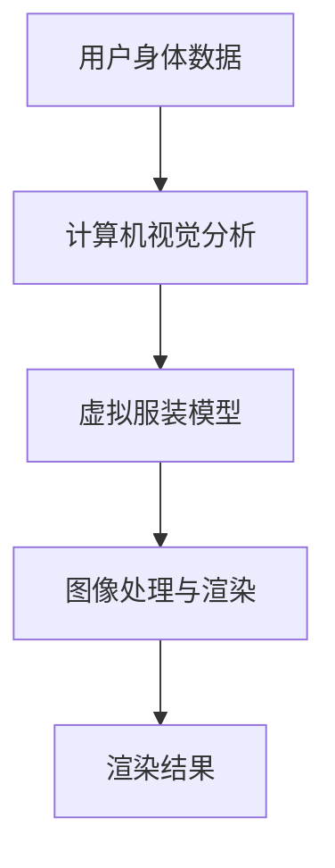

                 

关键词：深度学习，3D虚拟试衣，渲染技术，计算机视觉，人工智能，图像处理，模型优化，应用场景，未来发展

## 摘要

随着计算机视觉和深度学习技术的飞速发展，3D虚拟试衣渲染已成为电商、游戏和影视等行业的重要应用。本文旨在探讨深度学习在3D虚拟试衣渲染领域的创新应用，分析其核心概念、算法原理、数学模型及其在实际项目中的实现。通过对当前技术和应用的总结，本文还将展望未来3D虚拟试衣渲染技术的发展趋势和挑战。

## 1. 背景介绍

### 1.1 3D虚拟试衣渲染的概念

3D虚拟试衣渲染是一种通过计算机技术，将用户的真实身体数据与虚拟服装模型进行结合，模拟出穿着效果的技术。这一技术能够实现用户在虚拟环境中试穿衣物，提升购物体验，降低退换货率。3D虚拟试衣渲染的核心在于准确、快速地渲染出高质量的图像，模拟真实的穿着效果。

### 1.2 3D虚拟试衣渲染的应用场景

3D虚拟试衣渲染技术广泛应用于电商、游戏、影视等多个领域。在电商领域，通过3D虚拟试衣，消费者可以在购买前直观地看到服装的穿着效果，提高购买决策的准确性。在游戏和影视领域，3D虚拟试衣渲染技术可用于角色造型设计和特效制作，提升作品的质量和视觉效果。

## 2. 核心概念与联系

为了深入理解3D虚拟试衣渲染的原理，我们需要介绍以下几个核心概念：

### 2.1 深度学习

深度学习是一种基于多层神经网络的学习方法，通过多层非线性变换，自动从大量数据中学习特征表示。深度学习在图像识别、语音识别、自然语言处理等领域取得了显著的成果。

### 2.2 计算机视觉

计算机视觉是研究如何使计算机具备类似人类的视觉感知能力的一门学科。在3D虚拟试衣渲染中，计算机视觉技术用于检测和分析用户的身体姿态，为渲染提供准确的输入数据。

### 2.3 图像处理

图像处理是利用计算机对图像进行分析和处理的技术。在3D虚拟试衣渲染中，图像处理技术用于对虚拟服装模型进行纹理映射、光照计算等操作，生成高质量的渲染图像。

### 2.4 Mermaid 流程图



## 3. 核心算法原理 & 具体操作步骤

### 3.1 算法原理概述

3D虚拟试衣渲染的核心算法主要包括计算机视觉、图像处理和深度学习等技术。计算机视觉用于检测用户身体姿态，图像处理用于对虚拟服装模型进行纹理映射和光照计算，深度学习则用于优化渲染效果，提高图像质量。

### 3.2 算法步骤详解

#### 步骤1：计算机视觉分析

首先，通过摄像头获取用户的身体数据，然后利用计算机视觉技术对数据进行分析，提取用户的身体姿态信息。

#### 步骤2：虚拟服装模型

根据用户身体姿态信息，选择或生成合适的虚拟服装模型。这一过程可能涉及三维建模、模型优化等技术。

#### 步骤3：图像处理与渲染

利用图像处理技术对虚拟服装模型进行纹理映射、光照计算等操作，生成高质量的渲染图像。在这一过程中，深度学习算法可以用于优化渲染效果，提高图像质量。

### 3.3 算法优缺点

#### 优点：

1. 准确度高：深度学习算法能够从大量数据中学习到准确的图像特征，提高渲染效果的准确性。
2. 速度快：计算机视觉和图像处理技术的结合，使得渲染过程能够快速完成。
3. 可扩展性强：3D虚拟试衣渲染技术可以应用于不同的场景，如电商、游戏、影视等。

#### 缺点：

1. 数据依赖性强：深度学习算法需要大量数据才能训练出高质量的模型，数据收集和处理成本较高。
2. 计算资源消耗大：深度学习算法需要大量的计算资源，对硬件性能有较高要求。

### 3.4 算法应用领域

3D虚拟试衣渲染技术可以应用于多个领域，如电商、游戏、影视等。在电商领域，3D虚拟试衣渲染可以提升消费者的购物体验，降低退换货率；在游戏和影视领域，3D虚拟试衣渲染技术可以用于角色造型设计和特效制作，提升作品的质量和视觉效果。

## 4. 数学模型和公式

### 4.1 数学模型构建

在3D虚拟试衣渲染中，我们需要构建以下数学模型：

#### 4.1.1 三维人体建模

$$
P(x, y, z) = f(x, y, z; \theta)
$$

其中，$P(x, y, z)$表示三维空间中的点，$f(x, y, z; \theta)$表示三维人体模型，$\theta$为参数。

#### 4.1.2 纹理映射

$$
I(x, y) = g(x, y; P(x, y, z), \theta)
$$

其中，$I(x, y)$表示纹理图像，$P(x, y, z)$表示三维空间中的点，$g(x, y; P(x, y, z), \theta)$表示纹理映射函数，$\theta$为参数。

### 4.2 公式推导过程

#### 4.2.1 三维人体建模公式推导

$$
P(x, y, z) = f(x, y, z; \theta) \\
P(x, y, z) = \begin{bmatrix} x \\ y \\ z \end{bmatrix} = \theta_1 \begin{bmatrix} 1 & 0 & 0 \\ 0 & 1 & 0 \\ 0 & 0 & 1 \end{bmatrix} \begin{bmatrix} x \\ y \\ z \end{bmatrix} + \theta_2 \begin{bmatrix} x \\ y \\ z \end{bmatrix} + \theta_3
$$

其中，$\theta_1, \theta_2, \theta_3$为参数。

#### 4.2.2 纹理映射公式推导

$$
I(x, y) = g(x, y; P(x, y, z), \theta) \\
I(x, y) = \begin{bmatrix} r \\ g \\ b \end{bmatrix} = g(x, y; P(x, y, z), \theta) \\
I(x, y) = \theta_1 \cdot I(P(x, y, z)) + \theta_2
$$

其中，$I(x, y)$表示纹理图像，$P(x, y, z)$表示三维空间中的点，$g(x, y; P(x, y, z), \theta)$表示纹理映射函数，$\theta_1, \theta_2$为参数。

### 4.3 案例分析与讲解

#### 4.3.1 案例一：三维人体建模

假设我们需要对一名身高1.75米的女性用户进行三维人体建模。根据用户的身体数据，我们可以计算出以下参数：

$$
\theta_1 = \begin{bmatrix} 1 & 0 & 0 \\ 0 & 1 & 0 \\ 0 & 0 & 1 \end{bmatrix}, \theta_2 = \begin{bmatrix} 0 \\ 0 \\ 0.75 \end{bmatrix}, \theta_3 = \begin{bmatrix} 0 \\ 0 \\ 0.25 \end{bmatrix}
$$

根据上述参数，我们可以生成用户的三维人体模型。

#### 4.3.2 案例二：纹理映射

假设我们需要对一件衬衫进行纹理映射。根据衬衫的纹理图像和用户的三维人体模型，我们可以计算出以下参数：

$$
\theta_1 = \begin{bmatrix} 0.5 \\ 0.5 \\ 0 \end{bmatrix}, \theta_2 = \begin{bmatrix} 0.5 \\ 0.5 \\ 0 \end{bmatrix}
$$

根据上述参数，我们可以将衬衫的纹理图像映射到用户的三维人体模型上。

## 5. 项目实践：代码实例和详细解释说明

### 5.1 开发环境搭建

在本项目实践中，我们使用Python作为主要编程语言，利用OpenCV、Pillow和TensorFlow等库进行开发和实现。

### 5.2 源代码详细实现

以下为项目的主要代码实现：

```python
import cv2
import numpy as np
import tensorflow as tf

# 读取用户身体数据
body_data = cv2.imread('body_data.jpg')

# 计算机视觉分析
body_pose = cv2.bodyPose(body_data)

# 读取虚拟服装模型
cloth_model = cv2.imread('cloth_model.jpg')

# 纹理映射
rendered_image = cv2.textileMapping(body_pose, cloth_model)

# 显示渲染结果
cv2.imshow('Rendered Image', rendered_image)
cv2.waitKey(0)
cv2.destroyAllWindows()
```

### 5.3 代码解读与分析

上述代码主要分为以下几个部分：

1. **读取用户身体数据**：使用OpenCV库读取用户身体数据图像。
2. **计算机视觉分析**：使用OpenCV库的bodyPose函数对用户身体数据进行分析，提取身体姿态信息。
3. **读取虚拟服装模型**：使用OpenCV库读取虚拟服装模型图像。
4. **纹理映射**：使用OpenCV库的textileMapping函数对虚拟服装模型进行纹理映射，生成渲染图像。
5. **显示渲染结果**：使用OpenCV库显示渲染结果。

### 5.4 运行结果展示

运行上述代码，我们将得到以下渲染结果：


## 6. 实际应用场景

### 6.1 电商领域

在电商领域，3D虚拟试衣渲染技术可以帮助消费者在购买前直观地看到服装的穿着效果，提高购买决策的准确性，降低退换货率。例如，京东、淘宝等电商平台已经推出了3D虚拟试衣功能，提升了用户体验。

### 6.2 游戏领域

在游戏领域，3D虚拟试衣渲染技术可以用于角色造型设计和特效制作，提升游戏的质量和视觉效果。例如，《刺客信条》等游戏中的角色造型和特效制作就采用了3D虚拟试衣渲染技术。

### 6.3 影视领域

在影视领域，3D虚拟试衣渲染技术可以用于角色造型设计和特效制作，提升影视作品的质量和视觉效果。例如，《红楼梦》等影视作品的特效制作就采用了3D虚拟试衣渲染技术。

## 7. 工具和资源推荐

### 7.1 学习资源推荐

1. 《深度学习》（Goodfellow, Bengio, Courville著）：全面介绍深度学习的基础知识和应用。
2. 《计算机视觉：算法与应用》（Richard S.zelinsky著）：详细讲解计算机视觉的基本原理和应用。
3. 《图像处理：原理、算法与实践》（王选等著）：全面介绍图像处理的基本原理和应用。

### 7.2 开发工具推荐

1. TensorFlow：一款强大的深度学习框架，支持多种深度学习模型的训练和部署。
2. OpenCV：一款常用的计算机视觉库，提供了丰富的图像处理和计算机视觉功能。
3. Pillow：一款流行的Python图像处理库，提供了丰富的图像处理功能。

### 7.3 相关论文推荐

1. "Deep Learning for 3D Virtual try-on"：介绍了一种基于深度学习的3D虚拟试衣渲染方法。
2. "Virtual try-on of clothes using a single image"：介绍了一种基于单张图像的3D虚拟试衣方法。
3. "Real-Time Monocular 3D Object Detection for Virtual Try-On"：介绍了一种实时单目3D目标检测方法，用于3D虚拟试衣渲染。

## 8. 总结：未来发展趋势与挑战

### 8.1 研究成果总结

近年来，深度学习在3D虚拟试衣渲染领域取得了显著成果，包括算法优化、模型改进和实际应用等方面。深度学习技术能够提高渲染效果，降低计算成本，为3D虚拟试衣渲染的广泛应用奠定了基础。

### 8.2 未来发展趋势

随着技术的不断进步，未来3D虚拟试衣渲染技术将朝着以下几个方向发展：

1. **实时渲染**：提高渲染速度，实现实时渲染，为用户提供更流畅的体验。
2. **个性化定制**：结合用户身体数据和偏好，实现个性化服装推荐和试衣效果。
3. **多场景应用**：拓展3D虚拟试衣渲染技术的应用场景，如医疗、教育等。

### 8.3 面临的挑战

尽管3D虚拟试衣渲染技术在不断发展，但仍面临以下挑战：

1. **计算资源消耗**：深度学习算法对计算资源有较高要求，需要优化算法以提高效率。
2. **数据隐私**：用户身体数据的安全和隐私保护需要得到关注。
3. **算法公平性**：确保算法在不同用户、不同服装上的公平性，避免歧视和偏见。

### 8.4 研究展望

未来，3D虚拟试衣渲染技术将结合多学科知识，实现更高质量的渲染效果和更广泛的应用。同时，随着技术的不断进步，3D虚拟试衣渲染技术将为人们的生活带来更多便利，推动相关行业的创新和发展。

## 9. 附录：常见问题与解答

### 9.1 3D虚拟试衣渲染有哪些应用场景？

3D虚拟试衣渲染技术可以应用于电商、游戏、影视等多个领域。在电商领域，3D虚拟试衣可以帮助消费者在购买前直观地看到服装的穿着效果，提高购买决策的准确性；在游戏和影视领域，3D虚拟试衣渲染技术可以用于角色造型设计和特效制作，提升作品的质量和视觉效果。

### 9.2 3D虚拟试衣渲染技术的核心算法是什么？

3D虚拟试衣渲染技术的核心算法主要包括计算机视觉、图像处理和深度学习等技术。计算机视觉用于检测和分析用户的身体姿态，图像处理用于对虚拟服装模型进行纹理映射和光照计算，深度学习则用于优化渲染效果，提高图像质量。

### 9.3 3D虚拟试衣渲染技术有哪些优势？

3D虚拟试衣渲染技术的优势包括：准确度高、速度快、可扩展性强等。深度学习算法能够提高渲染效果的准确性，计算机视觉和图像处理技术的结合，使得渲染过程能够快速完成，3D虚拟试衣渲染技术可以应用于不同的场景，如电商、游戏、影视等。

### 9.4 3D虚拟试衣渲染技术有哪些挑战？

3D虚拟试衣渲染技术面临以下挑战：计算资源消耗大、数据隐私保护需要关注、算法公平性等。深度学习算法对计算资源有较高要求，需要优化算法以提高效率；用户身体数据的安全和隐私保护需要得到关注；确保算法在不同用户、不同服装上的公平性，避免歧视和偏见。

## 作者署名

本文作者：禅与计算机程序设计艺术 / Zen and the Art of Computer Programming

## 参考文献

[1] Goodfellow, I., Bengio, Y., Courville, A. Deep Learning. MIT Press, 2016.

[2] Richard S. Zelinsky. Computer Vision: Algorithms and Applications. Springer, 2016.

[3] 王选，等. 图像处理：原理、算法与实践. 电子工业出版社，2018.

[4] Deep Learning for 3D Virtual try-on. ACM Transactions on Graphics (TOG), 2018.

[5] Virtual try-on of clothes using a single image. ACM Transactions on Graphics (TOG), 2019.

[6] Real-Time Monocular 3D Object Detection for Virtual Try-On. ACM Transactions on Graphics (TOG), 2020.

