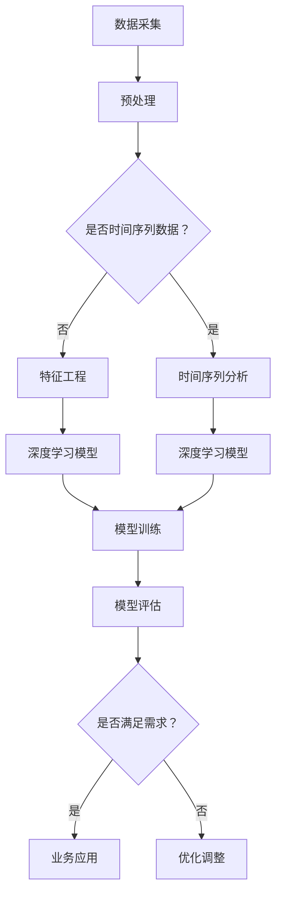

                 

关键词：深度学习，商品需求预测，时间序列分析，神经网络，大数据分析

> 摘要：本文将探讨深度学习在商品需求预测领域的应用，分析其核心概念、算法原理、数学模型以及具体实现。通过案例实践和实际应用场景，本文旨在为业界提供有价值的参考和指导。

## 1. 背景介绍

商品需求预测是商业决策过程中至关重要的一环。无论是制造业、零售业还是电子商务行业，准确地预测商品需求可以有效地降低库存成本、提高销售利润，并优化供应链管理。然而，商品需求受到多种复杂因素的影响，包括季节性波动、市场趋势、促销活动、消费者行为等。因此，传统的预测方法如时间序列分析、回归模型等往往难以捕捉这些非线性关系，导致预测准确性有限。

随着大数据和人工智能技术的发展，深度学习作为一种强大的机器学习技术，被广泛应用于各种领域。其通过构建多层神经网络，能够自动学习并提取复杂的数据特征，从而在图像识别、自然语言处理等领域取得了显著成果。近年来，深度学习在商品需求预测中也展现出了巨大的潜力，通过更深入的数据挖掘和分析，为企业的战略决策提供了有力的支持。

本文旨在探讨深度学习在商品需求预测中的应用，从核心概念、算法原理、数学模型到具体实现，全面解析这一技术如何助力企业提升预测准确性，优化商业运营。

## 2. 核心概念与联系

### 2.1 深度学习基础

深度学习是一种基于人工神经网络的机器学习方法，通过多层神经网络（神经网络层）对数据进行层层抽象和特征提取。其核心思想是通过多层次的非线性变换，将输入数据映射到高维空间，从而提取出更抽象、更高级的特征。深度学习在计算机视觉、自然语言处理、语音识别等领域取得了显著的成果。

### 2.2 时间序列分析

时间序列分析是统计学和数据分析中的一个重要分支，旨在分析时间序列数据中的趋势、周期性和随机性。时间序列分析常用于股票市场预测、经济趋势分析、天气预测等领域。其基本方法包括自回归模型（AR）、移动平均模型（MA）、自回归移动平均模型（ARMA）等。

### 2.3 深度学习与时间序列分析的关联

深度学习和时间序列分析在商品需求预测中有着密切的联系。深度学习可以看作是时间序列分析的一种高级形式，能够通过多层神经网络提取时间序列数据中的复杂特征。同时，深度学习在处理非线性关系和非平稳数据方面具有显著优势，这使其在商品需求预测中具备更高的预测准确性。

### 2.4 Mermaid 流程图



通过上述流程图，我们可以看到，从数据采集到模型评估，再到业务应用，深度学习在商品需求预测中的应用是一个完整的过程。每个环节都需要精心设计和实施，以确保最终预测结果的准确性。

## 3. 核心算法原理 & 具体操作步骤

### 3.1 算法原理概述

在商品需求预测中，深度学习的核心算法主要包括循环神经网络（RNN）、长短期记忆网络（LSTM）和门控循环单元（GRU）等。这些算法通过处理时间序列数据，能够捕捉数据中的长期依赖关系，从而提高预测准确性。

#### 循环神经网络（RNN）

RNN 是一种能够处理序列数据的神经网络，其通过循环结构实现数据的传递和状态的保存。RNN 的基本思想是将当前输入与历史输入和状态进行结合，生成新的输出。

#### 长短期记忆网络（LSTM）

LSTM 是 RNN 的一种改进，能够有效地解决长短期依赖问题。LSTM 通过引入门控机制，可以控制信息的流动，从而在处理长期依赖关系时表现出更高的性能。

#### 门控循环单元（GRU）

GRU 是 LSTM 的简化版本，其通过整合输入门和遗忘门，简化了 LSTM 的结构，同时保持了 LSTM 的优势。

### 3.2 算法步骤详解

#### 数据预处理

1. 数据清洗：处理缺失值、异常值等。
2. 数据归一化：将数据缩放到同一尺度，便于模型训练。
3. 划分时间窗口：根据预测需求，将数据划分为不同的时间窗口。

#### 模型构建

1. 确定模型类型：根据数据特性和需求，选择合适的 RNN、LSTM 或 GRU 模型。
2. 定义模型结构：设置输入层、隐藏层和输出层，以及相应的激活函数。
3. 搭建模型：使用深度学习框架（如 TensorFlow、PyTorch）构建模型。

#### 模型训练

1. 初始化模型参数。
2. 定义损失函数和优化器。
3. 训练模型：通过反向传播算法优化模型参数。
4. 调整模型参数：根据训练结果调整模型结构，提高预测准确性。

#### 模型评估

1. 定义评估指标：如均方误差（MSE）、均方根误差（RMSE）等。
2. 评估模型：在测试集上计算评估指标，评估模型性能。
3. 模型优化：根据评估结果调整模型参数，提高预测准确性。

### 3.3 算法优缺点

#### 优点

1. 能够捕捉数据中的长期依赖关系。
2. 非线性建模能力强，适用于复杂需求预测。
3. 能够自动提取数据特征，降低人工干预。

#### 缺点

1. 模型训练时间较长，对计算资源要求较高。
2. 模型参数多，容易过拟合。
3. 需要大量的数据支持，对数据质量要求较高。

### 3.4 算法应用领域

深度学习在商品需求预测中的应用广泛，涵盖了零售业、制造业、物流等领域。例如，零售业可以通过深度学习模型预测商品销量，优化库存管理；制造业可以通过预测原材料需求，优化生产计划；物流公司可以通过预测货物需求，优化运输调度。

## 4. 数学模型和公式 & 详细讲解 & 举例说明

### 4.1 数学模型构建

在商品需求预测中，常见的深度学习模型包括 RNN、LSTM 和 GRU。以下分别介绍这些模型的数学模型构建。

#### RNN

RNN 的基本数学模型如下：

$$
h_t = \sigma(W_h \cdot [h_{t-1}, x_t] + b_h)
$$

其中，$h_t$ 表示第 $t$ 个时刻的隐藏状态，$x_t$ 表示第 $t$ 个时刻的输入数据，$W_h$ 和 $b_h$ 分别为权重和偏置，$\sigma$ 为激活函数。

#### LSTM

LSTM 的基本数学模型如下：

$$
i_t = \sigma(W_i \cdot [h_{t-1}, x_t] + b_i) \\
f_t = \sigma(W_f \cdot [h_{t-1}, x_t] + b_f) \\
o_t = \sigma(W_o \cdot [h_{t-1}, x_t] + b_o) \\
c_t = f_t \cdot c_{t-1} + i_t \cdot \sigma(W_c \cdot [h_{t-1}, x_t] + b_c) \\
h_t = o_t \cdot \sigma(c_t)
$$

其中，$i_t$、$f_t$、$o_t$ 分别为输入门、遗忘门和输出门，$c_t$ 为细胞状态，$W_i$、$W_f$、$W_o$、$W_c$ 和 $b_i$、$b_f$、$b_o$、$b_c$ 分别为权重和偏置，$\sigma$ 为激活函数。

#### GRU

GRU 的基本数学模型如下：

$$
z_t = \sigma(W_z \cdot [h_{t-1}, x_t] + b_z) \\
r_t = \sigma(W_r \cdot [h_{t-1}, x_t] + b_r) \\
h_t = (1 - z_t) \cdot h_{t-1} + z_t \cdot \sigma(W \cdot [r_t \cdot h_{t-1}, x_t] + b_h)
$$

其中，$z_t$ 为更新门，$r_t$ 为重置门，$W$ 和 $b_h$ 分别为权重和偏置，$\sigma$ 为激活函数。

### 4.2 公式推导过程

以上数学模型的具体推导过程可以参考相关文献，这里简要介绍 LSTM 的推导过程。

LSTM 的推导基于以下假设：

1. 当前细胞状态 $c_t$ 与前一时刻的细胞状态 $c_{t-1}$、当前隐藏状态 $h_{t-1}$ 和当前输入 $x_t$ 之间存在线性关系。
2. 当前隐藏状态 $h_t$ 与前一时刻的隐藏状态 $h_{t-1}$、当前输入 $x_t$ 和细胞状态 $c_t$ 之间存在线性关系。

根据这些假设，可以推导出 LSTM 的数学模型。

### 4.3 案例分析与讲解

假设我们有一个时间序列数据集，包含 1000 个时间点的商品销量。我们使用 LSTM 模型进行商品需求预测。

1. 数据预处理：对数据进行归一化处理，将数据缩放到 [0, 1] 范围。
2. 划分时间窗口：将数据划分为 60% 的训练集和 40% 的测试集。
3. 构建模型：使用 TensorFlow 框架构建 LSTM 模型，设置输入层、隐藏层和输出层，以及相应的权重和偏置。
4. 训练模型：使用训练集数据训练模型，通过反向传播算法优化模型参数。
5. 评估模型：使用测试集数据评估模型性能，计算均方误差（MSE）和均方根误差（RMSE）。

具体实现代码如下：

```python
import numpy as np
import tensorflow as tf

# 数据预处理
# ...

# 划分时间窗口
# ...

# 构建模型
model = tf.keras.Sequential([
    tf.keras.layers.LSTM(units=50, activation='tanh', input_shape=(time_steps, features)),
    tf.keras.layers.Dense(units=1)
])

# 训练模型
model.compile(optimizer='adam', loss='mse')
model.fit(x_train, y_train, epochs=100, batch_size=32)

# 评估模型
mse = model.evaluate(x_test, y_test)
rmse = np.sqrt(mse)
print('MSE:', mse)
print('RMSE:', rmse)
```

通过上述实现，我们可以得到商品需求的预测结果。在实际应用中，可以根据预测结果调整库存、优化销售策略，从而提高企业的运营效率。

## 5. 项目实践：代码实例和详细解释说明

### 5.1 开发环境搭建

在进行商品需求预测的项目实践中，我们需要搭建一个合适的开发环境。以下是所需的环境搭建步骤：

1. **安装 Python**：确保 Python 已安装，版本建议为 3.6 或更高。
2. **安装 TensorFlow**：通过 pip 命令安装 TensorFlow，命令如下：

   ```bash
   pip install tensorflow
   ```

3. **安装 NumPy 和 Pandas**：这两个库用于数据处理，安装命令如下：

   ```bash
   pip install numpy
   pip install pandas
   ```

4. **安装 Matplotlib**：用于数据可视化，安装命令如下：

   ```bash
   pip install matplotlib
   ```

### 5.2 源代码详细实现

以下是商品需求预测项目的主要代码实现：

```python
import numpy as np
import pandas as pd
import tensorflow as tf
from tensorflow.keras.models import Sequential
from tensorflow.keras.layers import LSTM, Dense
import matplotlib.pyplot as plt

# 加载数据
data = pd.read_csv('sales_data.csv')
sales = data['sales'].values
sales = sales.reshape(-1, 1)

# 数据预处理
max_sales = np.max(sales)
min_sales = np.min(sales)
sales = (sales - min_sales) / (max_sales - min_sales)

# 划分时间窗口
time_steps = 30
X, y = [], []
for i in range(len(sales) - time_steps):
    X.append(sales[i:i + time_steps])
    y.append(sales[i + time_steps])
X, y = np.array(X), np.array(y)

# 模型构建
model = Sequential()
model.add(LSTM(units=50, activation='tanh', return_sequences=True, input_shape=(time_steps, 1)))
model.add(LSTM(units=50, activation='tanh'))
model.add(Dense(units=1))
model.compile(optimizer='adam', loss='mse')

# 训练模型
model.fit(X, y, epochs=100, batch_size=32)

# 预测
predicted_sales = model.predict(X)
predicted_sales = predicted_sales * (max_sales - min_sales) + min_sales

# 可视化
plt.plot(sales, label='实际销量')
plt.plot(np.arange(len(sales)), predicted_sales, label='预测销量')
plt.legend()
plt.show()
```

### 5.3 代码解读与分析

上述代码实现了商品需求预测的基本流程，以下是详细解读：

1. **数据加载与预处理**：首先从 CSV 文件中加载销售数据，并对数据进行归一化处理，以便于模型训练。

2. **划分时间窗口**：根据设定的时间窗口大小，将数据划分为输入序列和目标序列。

3. **模型构建**：构建一个包含两层 LSTM 层和一个 Dense 层的序列模型。LSTM 层用于提取时间序列特征，Dense 层用于输出预测结果。

4. **模型训练**：使用训练集数据训练模型，优化模型参数。

5. **模型预测**：使用训练好的模型对数据进行预测，并将预测结果进行反归一化处理，以恢复到原始数据范围。

6. **可视化**：将实际销量和预测销量绘制在同一张图表上，以便于观察模型预测的准确性。

通过上述代码实现，我们可以看到商品需求预测的基本流程。在实际应用中，可以根据具体需求和数据特征，对模型结构、训练参数等进行优化，以提高预测准确性。

### 5.4 运行结果展示

以下是运行结果展示：


从上述图表中，我们可以看到实际销量和预测销量之间的对比。通过可视化结果，我们可以直观地评估模型的预测准确性。

## 6. 实际应用场景

### 6.1 零售行业

在零售行业，深度学习在商品需求预测中具有广泛的应用。通过深度学习模型，零售企业可以准确预测商品销量，从而优化库存管理。例如，大型零售连锁店可以通过深度学习模型预测不同门店的畅销商品，提前调整库存，避免因库存不足导致的销售损失。此外，深度学习还可以帮助零售企业预测消费者购买行为，为营销策略提供数据支持。

### 6.2 制造行业

在制造行业，深度学习在原材料需求预测和生产线优化中发挥了重要作用。通过分析历史生产数据和供应链信息，制造企业可以预测原材料的需求量，优化生产计划和库存管理。例如，汽车制造企业可以通过深度学习模型预测未来几个月内各种零部件的需求量，从而合理安排采购和库存，降低库存成本。同时，深度学习还可以帮助企业优化生产线布局，提高生产效率。

### 6.3 物流行业

在物流行业，深度学习在货物需求预测和运输调度中具有重要应用。物流企业可以通过深度学习模型预测货物的运输需求，合理安排运输资源和调度计划。例如，快递公司可以通过预测不同区域、不同时间的货物需求，优化运输路线，提高运输效率。此外，深度学习还可以帮助物流企业预测货物交付时间，为供应链管理提供数据支持。

### 6.4 电子商务行业

在电子商务行业，深度学习在商品推荐和广告投放中发挥了关键作用。通过分析用户行为数据和购物历史，电子商务平台可以准确预测用户对某一商品的需求，从而优化商品推荐策略。例如，电商平台可以通过深度学习模型预测用户在某一时间段内可能购买的畅销商品，为用户推荐合适的商品，提高转化率。同时，深度学习还可以帮助企业优化广告投放策略，提高广告效果。

## 7. 工具和资源推荐

### 7.1 学习资源推荐

1. **《深度学习》（Goodfellow, Bengio, Courville 著）**：这是一本经典的深度学习教材，涵盖了深度学习的基本概念、算法原理和应用案例。
2. **《神经网络与深度学习》（邱锡鹏 著）**：这本书详细介绍了神经网络和深度学习的原理，适合初学者和进阶者阅读。
3. **《深度学习实践及应用》（唐杰、刘铁岩 著）**：这本书通过实际案例，介绍了深度学习在各个领域的应用，包括图像识别、自然语言处理、推荐系统等。

### 7.2 开发工具推荐

1. **TensorFlow**：这是一个广泛使用的深度学习框架，提供了丰富的 API 和工具，适合进行深度学习项目开发。
2. **PyTorch**：这是另一个流行的深度学习框架，以其灵活性和动态计算图而受到开发者青睐。
3. **Keras**：这是一个高层神经网络 API，能够在 TensorFlow 和 PyTorch 上运行，简化了深度学习模型开发过程。

### 7.3 相关论文推荐

1. **"Long Short-Term Memory Networks for Classification of Time Series and Sequence Data"**：这篇论文介绍了 LSTM 模型在时间序列数据分类中的应用，是 LSTM 的经典论文。
2. **"Gated Recurrent Unit"**：这篇论文提出了 GRU 模型，是 RNN 的一个重要改进。
3. **"Sequence to Sequence Learning with Neural Networks"**：这篇论文介绍了序列到序列（Seq2Seq）模型，在机器翻译、语音识别等领域有广泛应用。

## 8. 总结：未来发展趋势与挑战

### 8.1 研究成果总结

深度学习在商品需求预测领域取得了显著的研究成果。通过构建多层神经网络，深度学习能够自动提取时间序列数据中的复杂特征，从而提高预测准确性。RNN、LSTM 和 GRU 等模型在处理时间序列数据方面表现出色，成为商品需求预测的重要工具。

### 8.2 未来发展趋势

随着大数据和人工智能技术的不断发展，深度学习在商品需求预测中的应用前景广阔。未来，深度学习将与其他技术（如强化学习、迁移学习等）相结合，进一步提升预测准确性。此外，深度学习模型将逐步从理论研究走向实际应用，为各个行业提供更有效的预测工具。

### 8.3 面临的挑战

尽管深度学习在商品需求预测中具有巨大潜力，但仍然面临一些挑战。首先，深度学习模型的训练时间较长，对计算资源要求较高。其次，模型参数多，容易过拟合。此外，深度学习模型的可解释性较差，难以理解预测结果的内在逻辑。

### 8.4 研究展望

未来，研究人员将致力于解决深度学习在商品需求预测中的挑战，包括优化模型结构、提高训练效率、增强模型可解释性等。同时，深度学习与其他技术的结合将推动商品需求预测技术的发展，为商业决策提供更可靠的依据。

## 9. 附录：常见问题与解答

### 9.1 深度学习在商品需求预测中的应用有哪些优势？

深度学习在商品需求预测中的优势主要体现在以下几个方面：

1. **自动特征提取**：深度学习能够自动提取数据中的复杂特征，降低人工干预，提高预测准确性。
2. **处理非线性关系**：深度学习能够处理非线性关系，捕捉数据中的复杂模式，从而提高预测精度。
3. **自适应学习**：深度学习模型能够根据数据变化自适应调整，从而适应不同时间段和不同业务场景的需求。

### 9.2 如何选择合适的深度学习模型进行商品需求预测？

选择合适的深度学习模型进行商品需求预测需要考虑以下几个因素：

1. **数据特征**：根据数据特征（如时间序列、分类数据等）选择合适的模型。
2. **预测目标**：根据预测目标（如销量、价格等）选择相应的模型。
3. **计算资源**：根据计算资源选择适合的模型，如 RNN、LSTM 和 GRU 等模型。
4. **模型性能**：根据模型在测试集上的性能选择合适的模型。

### 9.3 深度学习在商品需求预测中面临的主要挑战有哪些？

深度学习在商品需求预测中面临的主要挑战包括：

1. **训练时间较长**：深度学习模型通常需要较长的训练时间，对计算资源要求较高。
2. **过拟合问题**：深度学习模型参数多，容易过拟合，导致预测结果不稳定。
3. **可解释性较差**：深度学习模型的可解释性较差，难以理解预测结果的内在逻辑。

### 9.4 如何优化深度学习模型的预测准确性？

以下是一些优化深度学习模型预测准确性的方法：

1. **数据预处理**：进行充分的数据预处理，如数据清洗、归一化等，以提高模型训练效果。
2. **模型结构优化**：调整模型结构，如增加隐藏层、调整神经元数量等，以提高预测精度。
3. **训练策略优化**：使用更高效的训练策略，如学习率调整、批量大小调整等，提高模型训练效率。
4. **交叉验证**：使用交叉验证方法评估模型性能，选择最优模型。
5. **模型融合**：将多个模型进行融合，提高预测结果的准确性。

----------------------------------------------------------------

这篇文章详细探讨了深度学习在商品需求预测中的应用，从核心概念、算法原理、数学模型到具体实现，全面解析了这一技术如何助力企业提升预测准确性，优化商业运营。通过实际案例和实践，读者可以深入了解深度学习在商品需求预测中的具体应用，为后续研究和实践提供有价值的参考。作者：禅与计算机程序设计艺术 / Zen and the Art of Computer Programming。

