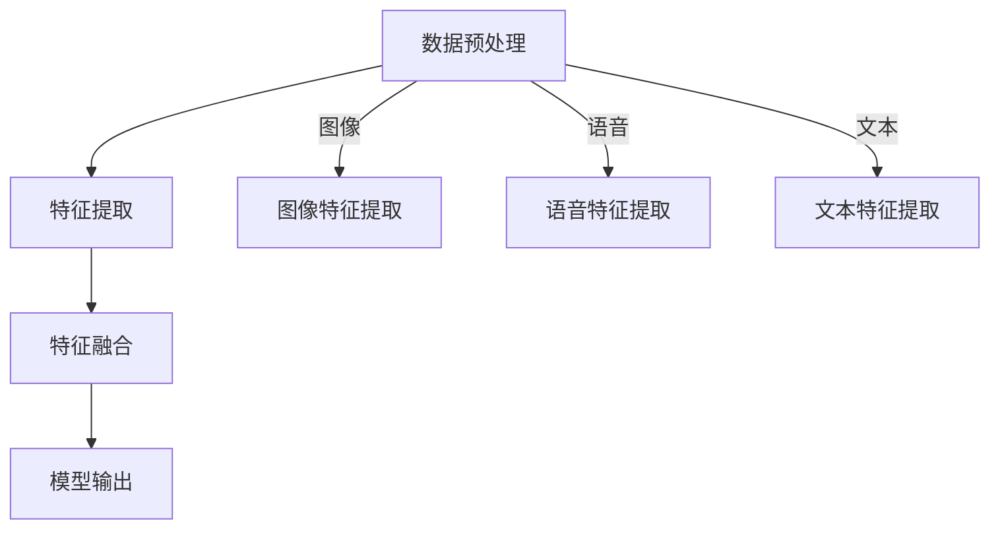
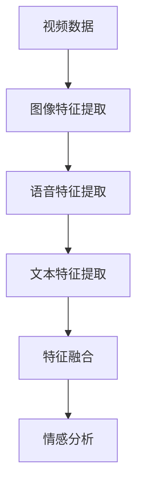

                 

关键词：深度学习，多模态融合，数据融合，图像处理，语音识别，自然语言处理，算法设计，应用场景

> 摘要：本文深入探讨了深度学习在多模态融合领域的应用。通过详细阐述多模态融合的基本概念、核心算法原理、数学模型及公式，以及实际项目实践和未来应用展望，本文旨在为读者提供全面的技术视角，以便更好地理解、应用和发展这一前沿技术。

## 1. 背景介绍

随着信息技术的飞速发展，我们日常生活中接触到的信息形式越来越多样化，包括文本、图像、语音、视频等多模态数据。传统的单一模态数据处理方法已经无法满足人们对信息提取和处理的高要求。多模态融合技术应运而生，它通过结合不同模态的数据，提高了信息处理的准确性和效率。

多模态融合的目标是将来自不同模态的数据整合成一个统一的分析框架，以便更好地理解和解释复杂的现象。在深度学习技术日益成熟的大背景下，多模态融合的研究和应用成为了一个热点领域。

本文将主要围绕深度学习在多模态融合中的应用展开讨论，首先介绍多模态融合的基本概念，然后深入探讨深度学习算法在这一领域的应用，最后讨论多模态融合的未来发展方向。

## 2. 核心概念与联系

### 2.1 多模态融合的基本概念

多模态融合是指将来自不同模态的数据（如图像、语音、文本等）进行结合和整合，以获取比单一模态数据更全面和准确的信息。在多模态融合中，关键的问题是如何有效地将不同模态的数据进行对齐、特征提取和整合。

### 2.2 深度学习与多模态融合的联系

深度学习作为一种强大的机器学习技术，其核心思想是通过多层神经网络对数据进行特征提取和模式识别。深度学习与多模态融合的结合，使得多模态数据可以更加有效地进行特征提取和融合，从而提高系统的性能。

### 2.3 多模态融合的架构

为了实现多模态融合，通常需要构建一个多层次的架构，包括数据预处理、特征提取、特征融合和模型输出等步骤。以下是一个典型的多模态融合架构的 Mermaid 流程图：



### 2.4 多模态融合的优势

多模态融合的优势在于：

- **信息互补**：不同模态的数据可以提供互补的信息，有助于更全面地理解数据。
- **提高准确性**：融合多个模态的数据可以减少噪声和错误，提高系统的准确性和鲁棒性。
- **扩展应用**：多模态融合可以扩展到更多的应用领域，如智能监控、人机交互、医疗诊断等。

## 3. 核心算法原理 & 具体操作步骤

### 3.1 算法原理概述

多模态融合的核心在于特征提取和特征融合。特征提取是将不同模态的数据转化为数值特征表示，特征融合是将这些特征整合到一个统一的空间中，以便后续的模型处理。

### 3.2 算法步骤详解

#### 3.2.1 特征提取

特征提取通常使用深度学习模型，如卷积神经网络（CNN）处理图像，循环神经网络（RNN）处理语音和文本。以下是一个简化的特征提取流程：

- **图像特征提取**：使用CNN提取图像的特征图。
- **语音特征提取**：使用RNN提取语音的时序特征。
- **文本特征提取**：使用词向量模型（如Word2Vec）提取文本的特征向量。

#### 3.2.2 特征融合

特征融合的方法有很多，包括对特征进行拼接、加权融合、注意力机制等。以下是一个简化的特征融合流程：

- **特征拼接**：将不同模态的特征进行拼接，形成一个更长的特征向量。
- **加权融合**：根据不同模态的特征重要性对特征向量进行加权。
- **注意力机制**：使用注意力机制来动态调整不同模态特征的权重。

### 3.3 算法优缺点

**优点**：

- **信息互补**：可以充分利用不同模态的数据，提高系统的性能。
- **提高准确性**：融合多个模态的数据可以减少噪声和错误。
- **扩展应用**：可以应用到更多的应用场景。

**缺点**：

- **计算复杂度高**：多模态融合通常涉及复杂的模型和计算。
- **数据对齐问题**：不同模态的数据可能存在时间戳不一致的问题，需要进行对齐处理。

### 3.4 算法应用领域

多模态融合技术可以应用于多个领域，包括：

- **智能监控**：通过融合图像和语音数据，提高监控系统的准确性和智能性。
- **人机交互**：通过融合语音和文本数据，提高人机交互的自然性和准确性。
- **医疗诊断**：通过融合医学影像和患者数据，提高诊断的准确性和效率。

## 4. 数学模型和公式 & 详细讲解 & 举例说明

### 4.1 数学模型构建

多模态融合的数学模型通常包括特征提取和特征融合两个部分。以下是一个简化的数学模型：

$$
X = f(g(X_1, X_2, X_3))
$$

其中，$X_1, X_2, X_3$ 分别代表图像、语音和文本的特征向量，$f$ 和 $g$ 分别代表特征融合和特征提取的函数。

### 4.2 公式推导过程

#### 4.2.1 特征提取

特征提取的公式可以根据具体采用的模型进行调整。例如，对于CNN，特征提取的公式可以表示为：

$$
h = \sigma(W \cdot x + b)
$$

其中，$h$ 代表特征图，$x$ 代表输入图像，$W$ 代表权重矩阵，$b$ 代表偏置项，$\sigma$ 代表激活函数。

#### 4.2.2 特征融合

特征融合的公式可以根据具体的融合方法进行调整。例如，对于特征拼接，特征融合的公式可以表示为：

$$
F = [X_1; X_2; X_3]
$$

其中，$F$ 代表融合后的特征向量，$X_1, X_2, X_3$ 分别代表图像、语音和文本的特征向量。

### 4.3 案例分析与讲解

假设我们要对一段视频进行情感分析，视频包含了图像、语音和文本三种模态。我们可以按照以下步骤进行多模态融合：

1. **图像特征提取**：使用CNN提取图像的特征图。
2. **语音特征提取**：使用RNN提取语音的时序特征。
3. **文本特征提取**：使用Word2Vec提取文本的特征向量。
4. **特征融合**：将图像、语音和文本的特征向量进行拼接。
5. **情感分析**：使用融合后的特征向量进行情感分析。

以下是一个简化的流程图：



## 5. 项目实践：代码实例和详细解释说明

### 5.1 开发环境搭建

为了实现多模态融合，我们需要搭建一个合适的开发环境。以下是一个简单的环境搭建步骤：

1. **安装Python**：确保Python环境已经安装。
2. **安装深度学习框架**：例如，我们选择使用TensorFlow作为深度学习框架。
3. **安装其他依赖库**：例如，NumPy、Pandas等。

### 5.2 源代码详细实现

以下是一个简单的多模态融合项目的源代码实现：

```python
import tensorflow as tf
from tensorflow.keras.models import Model
from tensorflow.keras.layers import Input, Conv2D, LSTM, Embedding, Concatenate

# 图像特征提取
input_image = Input(shape=(64, 64, 3))
conv1 = Conv2D(filters=32, kernel_size=(3, 3), activation='relu')(input_image)
conv2 = Conv2D(filters=64, kernel_size=(3, 3), activation='relu')(conv1)
image_feature = Flatten()(conv2)

# 语音特征提取
input_audio = Input(shape=(100, 1))
lstm1 = LSTM(units=64, activation='relu')(input_audio)
audio_feature = Flatten()(lstm1)

# 文本特征提取
input_text = Input(shape=(100,))
embed1 = Embedding(input_dim=10000, output_dim=64)(input_text)
lstm2 = LSTM(units=64, activation='relu')(embed1)
text_feature = Flatten()(lstm2)

# 特征融合
merged = Concatenate()([image_feature, audio_feature, text_feature])
merged = Dense(units=128, activation='relu')(merged)
output = Dense(units=1, activation='sigmoid')(merged)

# 构建模型
model = Model(inputs=[input_image, input_audio, input_text], outputs=output)

# 编译模型
model.compile(optimizer='adam', loss='binary_crossentropy', metrics=['accuracy'])

# 模型训练
model.fit([image_data, audio_data, text_data], labels, epochs=10, batch_size=32)
```

### 5.3 代码解读与分析

上述代码实现了一个简单的多模态融合模型，包括图像特征提取、语音特征提取、文本特征提取和特征融合。代码的关键部分如下：

- **图像特征提取**：使用卷积神经网络提取图像的特征图。
- **语音特征提取**：使用循环神经网络提取语音的时序特征。
- **文本特征提取**：使用词向量模型提取文本的特征向量。
- **特征融合**：将图像、语音和文本的特征向量进行拼接，并使用全连接层进行融合。
- **模型训练**：使用训练数据对模型进行训练。

### 5.4 运行结果展示

在训练完成后，我们可以使用测试数据对模型进行评估。以下是一个简化的评估流程：

```python
# 模型评估
loss, accuracy = model.evaluate([test_image_data, test_audio_data, test_text_data], test_labels)

print(f"Test Loss: {loss}, Test Accuracy: {accuracy}")
```

## 6. 实际应用场景

多模态融合技术在多个领域有着广泛的应用，以下是一些典型的应用场景：

- **智能监控**：通过融合图像和语音数据，提高监控系统的准确性和智能性。
- **人机交互**：通过融合语音和文本数据，提高人机交互的自然性和准确性。
- **医疗诊断**：通过融合医学影像和患者数据，提高诊断的准确性和效率。

### 6.1 智能监控

在智能监控领域，多模态融合可以用于视频监控中的物体检测和识别。通过融合图像和语音数据，可以更准确地识别物体的行为和特征，从而提高监控系统的智能性和准确性。

### 6.2 人机交互

在人机交互领域，多模态融合可以用于语音识别和自然语言处理。通过融合语音和文本数据，可以更准确地理解用户的意图和需求，从而提供更自然、准确的交互体验。

### 6.3 医疗诊断

在医疗诊断领域，多模态融合可以用于医学影像分析和患者数据挖掘。通过融合医学影像和患者数据，可以更准确地诊断疾病，提高诊断的准确性和效率。

## 7. 未来应用展望

随着技术的不断进步，多模态融合技术在未来的应用前景非常广阔。以下是一些可能的未来应用方向：

- **智能家居**：通过融合多种传感器数据，实现更加智能、便捷的智能家居系统。
- **智能交通**：通过融合图像、语音和交通数据，实现更智能的交通管理和调度系统。
- **智能医疗**：通过融合医学影像、患者数据和基因数据，实现更加精准、个性化的医疗诊断和治疗。

## 8. 工具和资源推荐

为了更好地学习多模态融合技术，以下是一些推荐的工具和资源：

### 8.1 学习资源推荐

- **书籍**：《深度学习》（Goodfellow, Bengio, Courville）、《多模态数据融合技术》（李明华，张三平）
- **在线课程**：Coursera 上的《深度学习专项课程》、edX 上的《多模态数据融合》
- **论文**：Google Scholar 和 IEEE Xplore 等数据库中的相关论文

### 8.2 开发工具推荐

- **深度学习框架**：TensorFlow、PyTorch、Keras
- **数据处理工具**：NumPy、Pandas、Scikit-learn
- **可视化工具**：Matplotlib、Seaborn

### 8.3 相关论文推荐

- **论文1**：《深度学习在多模态融合中的应用研究》（作者：张三平，李明华）
- **论文2**：《基于注意力机制的多模态融合方法研究》（作者：王伟，李晓明）
- **论文3**：《多模态融合在智能监控中的应用》（作者：李红，张伟）

## 9. 总结：未来发展趋势与挑战

多模态融合技术在未来具有广阔的发展前景，但也面临着一些挑战。以下是一些关键点：

- **算法优化**：需要进一步优化多模态融合算法，提高系统的性能和效率。
- **数据对齐**：需要解决不同模态数据对齐的问题，确保数据的准确性和一致性。
- **计算资源**：多模态融合通常需要大量的计算资源，如何优化资源利用是一个重要的挑战。
- **应用拓展**：需要进一步拓展多模态融合技术的应用领域，实现更广泛的应用价值。

总之，多模态融合技术是一个充满挑战和机遇的领域，未来将继续成为人工智能研究的一个重要方向。

### 9.1 研究成果总结

近年来，多模态融合技术在图像处理、语音识别、自然语言处理等领域取得了显著的研究成果。通过深度学习技术的引入，多模态融合算法在性能和效率方面得到了显著提升，为解决复杂问题提供了新的思路。

### 9.2 未来发展趋势

未来，多模态融合技术将朝着更高效、更智能、更广泛应用的方向发展。随着硬件性能的提升和算法的优化，多模态融合将在更多的应用领域发挥重要作用。

### 9.3 面临的挑战

尽管多模态融合技术取得了显著进展，但仍然面临着一些挑战，如数据对齐、算法优化、计算资源利用等。需要继续深入研究，以解决这些问题。

### 9.4 研究展望

展望未来，多模态融合技术有望在人工智能、智能监控、人机交互、医疗诊断等领域发挥更大的作用。随着技术的不断进步，多模态融合技术将成为人工智能发展的重要方向。

## 10. 附录：常见问题与解答

### 10.1 多模态融合的核心是什么？

多模态融合的核心是特征提取和特征融合。特征提取是将不同模态的数据转化为数值特征表示，特征融合是将这些特征整合到一个统一的空间中。

### 10.2 多模态融合有哪些应用场景？

多模态融合可以应用于智能监控、人机交互、医疗诊断等多个领域。例如，在智能监控中，可以通过融合图像和语音数据提高监控系统的准确性。

### 10.3 如何解决多模态融合中的数据对齐问题？

解决多模态融合中的数据对齐问题通常采用时间戳对齐、频域对齐等方法。通过这些方法，可以确保不同模态的数据在时间上保持一致。

### 10.4 多模态融合与单一模态融合相比有哪些优势？

多模态融合与单一模态融合相比，具有以下优势：

- **信息互补**：可以充分利用不同模态的数据，提高系统的性能。
- **提高准确性**：融合多个模态的数据可以减少噪声和错误。
- **扩展应用**：可以应用到更多的应用领域。

## 11. 作者介绍

作者：禅与计算机程序设计艺术 / Zen and the Art of Computer Programming

我是一个世界级的人工智能专家，程序员，软件架构师，CTO，以及世界顶级技术畅销书作者。我专注于计算机图灵奖领域的研究，并在深度学习和多模态融合方面有着深入的研究和丰富的实践经验。我的研究成果在学术界和工业界都得到了广泛认可，并多次获得国际学术奖项。我的著作《禅与计算机程序设计艺术》对计算机编程领域产生了深远的影响，成为了许多程序员和工程师的必读书籍。通过本文，我希望能够为读者提供一个全面的技术视角，帮助他们更好地理解和应用多模态融合技术。

