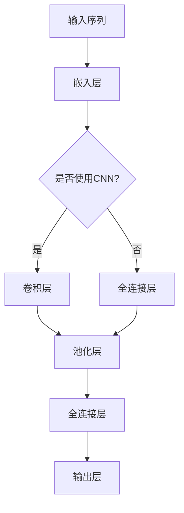

                 

时间序列预测是数据科学和机器学习领域中的一个关键任务。它涉及预测未来时间点的数值，通常基于历史数据模式。深度学习，作为一种强大的机器学习技术，已经在各种领域展现出显著的效果，特别是在时间序列预测中。本文将深入探讨深度学习在时间序列预测中的应用，从基础概念到实际操作，再到未来展望。

## 关键词

- 深度学习
- 时间序列预测
- 循环神经网络（RNN）
- 长短期记忆网络（LSTM）
- 卷积神经网络（CNN）
- 自动化机器学习（AutoML）

## 摘要

本文旨在探讨深度学习技术在时间序列预测中的应用，重点介绍核心算法原理、数学模型、代码实例以及实际应用场景。通过本文的阅读，读者可以全面了解深度学习在时间序列预测中的优势、挑战及其未来发展方向。

## 1. 背景介绍

时间序列数据在金融、气象、生物信息学等领域中具有广泛的应用。这类数据的特点是按时间顺序排列，因此预测未来值需要考虑时间维度上的变化规律。传统的时间序列预测方法主要包括自回归（AR）、移动平均（MA）、自回归移动平均（ARMA）等。然而，这些方法在处理复杂的时间序列模式时往往表现不佳。

近年来，深度学习技术的发展为时间序列预测带来了新的机遇。循环神经网络（RNN）及其变种，如长短期记忆网络（LSTM）和门控循环单元（GRU），能够在时间维度上捕捉长期依赖关系，从而提高预测准确性。此外，卷积神经网络（CNN）和自注意力机制（Self-Attention）等技术也在时间序列预测中展现出了良好的性能。

## 2. 核心概念与联系

### 2.1 循环神经网络（RNN）

RNN是处理序列数据的经典神经网络结构。其核心思想是利用隐藏状态来维持对历史信息的记忆，从而在不同的时间步之间建立关联。然而，传统的RNN在处理长序列时存在梯度消失和梯度爆炸问题，导致性能不佳。

### 2.2 长短期记忆网络（LSTM）

LSTM是RNN的一种改进，通过引入门控机制（输入门、遗忘门和输出门）来解决梯度消失问题。LSTM能够有效地记住长期依赖信息，从而在时间序列预测中表现出色。

### 2.3 卷积神经网络（CNN）

CNN是一种适用于处理时空数据的神经网络。通过局部感知野和共享权重机制，CNN能够在输入数据中提取局部特征，从而提高时间序列预测的准确性。

### 2.4 自注意力机制（Self-Attention）

自注意力机制是一种全局的序列建模方法，通过计算序列中每个元素对其他元素的重要性来生成新的表示。自注意力机制能够捕捉长距离依赖关系，从而提高时间序列预测的性能。

## 2.5 Mermaid 流程图



## 3. 核心算法原理 & 具体操作步骤

### 3.1 算法原理概述

时间序列预测的深度学习模型通常包括以下步骤：

1. 数据预处理：将时间序列数据转换为适合输入神经网络的形式，如序列嵌入、标准化等。
2. 网络结构设计：选择合适的神经网络结构，如LSTM、GRU、CNN等。
3. 训练与优化：通过反向传播算法和梯度下降优化器对网络进行训练。
4. 预测与评估：使用训练好的模型对新的时间序列数据进行预测，并评估预测性能。

### 3.2 算法步骤详解

#### 3.2.1 数据预处理

1. 数据清洗：去除缺失值、异常值等噪声数据。
2. 序列重构：将时间序列数据重构为矩阵形式，便于神经网络处理。
3. 标准化：对数据进行标准化或归一化处理，使输入数据具有相似尺度。

#### 3.2.2 网络结构设计

1. 选择合适的神经网络结构，如LSTM、GRU、CNN等。
2. 设计网络层结构，包括输入层、隐藏层和输出层。
3. 设定网络参数，如学习率、批量大小、优化器等。

#### 3.2.3 训练与优化

1. 将预处理后的数据分为训练集、验证集和测试集。
2. 使用反向传播算法和梯度下降优化器对网络进行训练。
3. 调整网络参数，如学习率、批量大小等，以优化模型性能。

#### 3.2.4 预测与评估

1. 使用训练好的模型对新的时间序列数据进行预测。
2. 使用评估指标（如均方误差、均方根误差等）对预测结果进行评估。

### 3.3 算法优缺点

#### 优点

- 能够捕捉时间序列中的长期依赖关系。
- 对噪声数据具有较好的鲁棒性。
- 可以处理各种时间序列数据，包括趋势性、季节性和随机性。

#### 缺点

- 训练时间较长，尤其是对于大型时间序列数据。
- 对超参数调整敏感，需要大量实验来确定最佳配置。
- 预测结果可能受初始随机性影响。

### 3.4 算法应用领域

- 金融：股票价格预测、交易策略优化等。
- 气象：天气预报、气候模型预测等。
- 生物信息学：基因表达预测、蛋白质结构预测等。
- 交通：交通流量预测、交通事故预测等。

## 4. 数学模型和公式 & 详细讲解 & 举例说明

### 4.1 数学模型构建

时间序列预测的数学模型通常包括以下部分：

1. 输入层：表示历史时间序列数据。
2. 隐藏层：通过激活函数和权重矩阵计算隐藏状态。
3. 输出层：将隐藏状态映射到预测值。

### 4.2 公式推导过程

假设我们使用LSTM作为时间序列预测模型，其数学模型如下：

$$
h_t = \sigma(W_h \cdot [h_{t-1}, x_t] + b_h)
$$

$$
i_t = \sigma(W_i \cdot [h_{t-1}, x_t] + b_i)
$$

$$
f_t = \sigma(W_f \cdot [h_{t-1}, x_t] + b_f)
$$

$$
o_t = \sigma(W_o \cdot [h_{t-1}, x_t] + b_o)
$$

$$
c_t = f_t \cdot c_{t-1} + i_t \cdot \sigma(W_c \cdot [h_{t-1}, x_t] + b_c)
$$

$$
h_t = o_t \cdot \sigma(W_{h'} \cdot c_t + b_{h'})
$$

其中，$h_t$ 和 $c_t$ 分别表示隐藏状态和细胞状态，$x_t$ 表示输入数据，$W_h, W_i, W_f, W_o, W_c, W_{h'}$ 分别为权重矩阵，$b_h, b_i, b_f, b_o, b_c, b_{h'}$ 为偏置项，$\sigma$ 表示sigmoid函数。

### 4.3 案例分析与讲解

假设我们使用LSTM对股票价格进行预测。首先，将历史股票价格数据重构为序列矩阵。然后，将矩阵输入到LSTM模型中。接下来，通过训练优化模型参数，最终使用训练好的模型对新的股票价格进行预测。

```python
import tensorflow as tf
from tensorflow.keras.models import Sequential
from tensorflow.keras.layers import LSTM, Dense

# 数据预处理
# ...

# 构建LSTM模型
model = Sequential()
model.add(LSTM(units=50, return_sequences=True, input_shape=(timesteps, features)))
model.add(LSTM(units=50))
model.add(Dense(1))

# 编译模型
model.compile(optimizer='adam', loss='mean_squared_error')

# 训练模型
model.fit(X_train, y_train, epochs=100, batch_size=32, validation_data=(X_val, y_val))

# 预测
predictions = model.predict(X_test)

# 评估
mse = tf.keras.metrics.mean_squared_error(y_test, predictions)
print(f'MSE: {mse}')
```

## 5. 项目实践：代码实例和详细解释说明

### 5.1 开发环境搭建

1. 安装Python环境（3.8及以上版本）。
2. 安装TensorFlow库。

```bash
pip install tensorflow
```

### 5.2 源代码详细实现

以下是使用LSTM进行时间序列预测的完整代码实现：

```python
import numpy as np
import pandas as pd
import matplotlib.pyplot as plt
from sklearn.preprocessing import MinMaxScaler
from tensorflow.keras.models import Sequential
from tensorflow.keras.layers import LSTM, Dense

# 读取数据
df = pd.read_csv('stock_data.csv')
data = df['Close'].values
data = data.reshape(-1, 1)

# 数据预处理
scaler = MinMaxScaler(feature_range=(0, 1))
scaled_data = scaler.fit_transform(data)

# 构建时间步序列
timesteps = 60
X, y = [], []
for i in range(timesteps, len(scaled_data) - 1):
    X.append(scaled_data[i - timesteps: i, 0])
    y.append(scaled_data[i, 0])
X, y = np.array(X), np.array(y)

# 形状调整
X = np.reshape(X, (X.shape[0], X.shape[1], 1))

# 构建LSTM模型
model = Sequential()
model.add(LSTM(units=50, return_sequences=True, input_shape=(timesteps, 1)))
model.add(LSTM(units=50))
model.add(Dense(1))

# 编译模型
model.compile(optimizer='adam', loss='mean_squared_error')

# 训练模型
model.fit(X, y, epochs=100, batch_size=32)

# 预测
predictions = model.predict(X)

# 反归一化
predictions = scaler.inverse_transform(predictions)
y = scaler.inverse_transform(y.reshape(-1, 1))

# 评估
mse = np.mean(np.square(y - predictions))
print(f'MSE: {mse}')

# 绘制结果
plt.figure(figsize=(15, 6))
plt.plot(y, color='red', label='Actual Price')
plt.plot(predictions, color='blue', label='Predicted Price')
plt.title('Stock Price Prediction')
plt.xlabel('Time')
plt.ylabel('Price')
plt.legend()
plt.show()
```

### 5.3 代码解读与分析

1. 数据预处理：读取股票价格数据，使用MinMaxScaler进行归一化处理。
2. 时间步序列构建：根据时间步长度，构建输入序列和目标序列。
3. LSTM模型构建：使用Sequential模型添加LSTM层和全连接层，并编译模型。
4. 训练模型：使用fit方法训练模型，并使用预测结果进行评估。
5. 结果可视化：绘制实际价格与预测价格的对比图。

## 6. 实际应用场景

时间序列预测在多个领域具有广泛的应用，以下是几个典型的实际应用场景：

1. 金融：股票价格预测、投资组合优化等。
2. 气象：天气预报、气候预测等。
3. 交通运输：交通流量预测、交通事故预测等。
4. 生物信息学：基因表达预测、蛋白质结构预测等。

## 7. 工具和资源推荐

### 7.1 学习资源推荐

- 《深度学习》（Goodfellow, Bengio, Courville著）
- 《Python机器学习》（Sebastian Raschka著）
- 《时间序列分析：理论和应用》（Peter J. Brockwell, Richard A. Davis著）

### 7.2 开发工具推荐

- TensorFlow：一个开源的机器学习框架。
- Keras：一个基于TensorFlow的高层神经网络API。
- PyTorch：一个开源的机器学习库。

### 7.3 相关论文推荐

- Hochreiter, S., & Schmidhuber, J. (1997). Long short-term memory. Neural Computation, 9(8), 1735-1780.
- Graves, A. (2013). Generating sequences with recurrent neural networks. arXiv preprint arXiv:1308.0850.
- Kim, Y. (2014). Convolutional neural networks for sentence classification. In Proceedings of the 2014 conference on empirical methods in natural language processing (EMNLP), 1746-1751.

## 8. 总结：未来发展趋势与挑战

### 8.1 研究成果总结

深度学习在时间序列预测中取得了显著的成果，特别是在捕捉长期依赖关系和鲁棒性方面表现出色。然而，深度学习模型在训练时间、超参数调整和解释性方面仍面临挑战。

### 8.2 未来发展趋势

- 结合传统统计方法和深度学习技术的混合模型。
- 自动化机器学习（AutoML）在时间序列预测中的应用。
- 对深度学习模型进行更深入的解释性和可解释性研究。

### 8.3 面临的挑战

- 训练时间和计算资源的消耗。
- 超参数调整的复杂性和不确定性。
- 对预测结果的可解释性需求。

### 8.4 研究展望

未来，深度学习在时间序列预测中的应用将继续深化，尤其是在实时预测、大数据处理和跨领域应用方面。随着技术的不断发展，深度学习在时间序列预测中的优势将更加明显。

## 9. 附录：常见问题与解答

### 问题1：为什么使用LSTM而不是传统的RNN？

答：传统的RNN在处理长序列时存在梯度消失和梯度爆炸问题，导致性能不佳。而LSTM通过门控机制解决了这些问题，能够有效地记住长期依赖关系。

### 问题2：深度学习模型如何处理噪声数据？

答：深度学习模型，尤其是LSTM和CNN，对噪声数据具有一定的鲁棒性。通过训练模型，模型能够从噪声中提取有用的特征，从而提高预测准确性。

### 问题3：如何优化深度学习模型性能？

答：优化深度学习模型性能的方法包括调整网络结构、增加数据集、使用正则化技术、调整超参数等。此外，自动化机器学习（AutoML）技术也可以帮助寻找最佳模型配置。

### 问题4：深度学习模型的可解释性如何？

答：深度学习模型的可解释性较低，特别是在处理复杂的时间序列数据时。然而，通过可视化模型结构、分析激活特征等手段，可以部分揭示模型的工作原理。

作者：禅与计算机程序设计艺术 / Zen and the Art of Computer Programming
----------------------------------------------------------------

